# Pyflate Huffman Accelerator Tutorial

This is the learning companion to the simplified hardware project. It builds
the necessary software and hardware ideas in order. Each lesson contains a
small example, connections to the repository, key facts, and understanding
questions. Answers and clarifications will be added after discussion.

## Learning roadmap

| Lesson | Subject | Status |
|---:|---|---|
| 1 | Pyflate, Huffman decoding, and the acceleration boundary | Complete |
| 2 | Bits, bytes, masks, shifts, and MSB-first ordering | Complete |
| 3 | Huffman codes and shortest-first matching | Complete |
| 4 | What hardware acceleration changes | Complete |
| 5 | Combinational and sequential SystemVerilog | Complete |
| 6 | Clocks, registers, reset, latency, and throughput | Complete |
| 7 | Ready/valid handshakes and backpressure | In progress |
| 8 | The one-table matcher, line by line | Not started |
| 9 | Six tables and the selector controller | Not started |
| 10 | The streaming bit reservoir | Not started |
| 11 | The complete top-level controller | Not started |
| 12 | MMIO, DMA, drivers, and the Python boundary | Not started |
| 13 | Timing, area, performance, and power | Not started |
| 14 | Testbenches and verification | Not started |

---

# Lesson 1: Pyflate and the acceleration boundary

## 1. What pyflate does

Pyflate is a software decompressor. The benchmark reads compressed bzip2 data
and reconstructs the original bytes. Decompression is a pipeline: each stage
transforms one representation into another.

```mermaid
flowchart LR
    IN[Compressed bzip2 bytes] --> HEADER[Parse block header]
    HEADER --> META[Read used symbols,<br/>selectors, and code lengths]
    META --> HUFF[Huffman decode]
    HUFF --> RAW[Huffman symbol stream]
    RAW --> RUN[Expand RUNA and RUNB]
    RUN --> MTF[Move-to-front decode]
    MTF --> BWT[Inverse Burrows-Wheeler transform]
    BWT --> RLE[Final run-length expansion]
    RLE --> OUT[Original output bytes]
```

Huffman decoding is only one stage. Our accelerator does not perform inverse
BWT, move-to-front decoding, or the final run-length expansion.

In the original source:

- `decode_huffman_block` begins near line 394 of
  `../../suites/original/bm_pyflate/run_benchmark.py`;
- selectors are constructed near line 405;
- Huffman tables are constructed near line 407;
- the main Huffman loop begins near line 417; and
- `find_next_symbol` is called near line 425.

## 2. What a Huffman decoder receives and produces

The compressed input is a sequence of bits. A Huffman table maps variable-length
bit codes to symbols.

Example table:

| Code | Length | Decoded symbol |
|---|---:|---|
| `0` | 1 bit | A |
| `10` | 2 bits | B |
| `110` | 3 bits | C |
| `111` | 3 bits | EOB |

For the bitstream:

```text
0 10 110 111
```

the decoded sequence is:

```text
A, B, C, EOB
```

and the total number of consumed bits is:

```text
1 bit + 2 bits + 3 bits + 3 bits = 9 bits
```

EOB means end of block. It is a real Huffman symbol and must be emitted before
the hardware reports completion.

## 3. What `find_next_symbol` does

The original function is at lines 224–235:

```python
def find_next_symbol(self, field, reversed=True):
    cached_length = -1
    cached = None
    for x in self.table:
        if cached_length != x.bits:
            cached = field.snoopbits(x.bits)
            cached_length = x.bits
        if ((reversed and x.reverse_symbol == cached) or
                (not reversed and x.symbol == cached)):
            field.readbits(x.bits)
            return x.code
    raise Exception("unfound symbol")
```

Conceptually it performs four operations:

1. Inspect the next candidate number of bits without removing them.
2. Compare that prefix with Huffman table entries.
3. When an entry matches, remove exactly that entry's code length.
4. Return its decoded symbol.

`snoopbits(L)` is a peek: it reads the next `L` bits without moving the logical
bit position. `readbits(L)` consumes them and advances the bit position.

The table is sorted by increasing code length. That is why our hardware uses
shortest-first selection.

## 4. Why it is a bottleneck

For the measured benchmark job:

| Quantity | Value |
|---|---:|
| Total runtime | 662.237 ms |
| Self/exclusive `find_next_symbol` fraction | 12.11% |
| Self/exclusive `find_next_symbol` time | 80.21 ms |
| Inclusive lookup fraction | 38.71% |
| Inclusive lookup-subtree time | 256.34 ms |
| Huffman lookup calls | 148,271 |

The two percentages answer different questions. **Self** (also called
**exclusive**) counts samples taken while the CPU is executing the body of
`find_next_symbol` itself. **Inclusive** (called **Children** by this `perf`
report) counts those samples plus samples in functions called underneath it,
including `snoopbits` and `readbits` on this call path. Some profilers use the
word **total** for inclusive time, so column names matter more than the word
"total."

The corresponding estimates are:

```text
T_self      = T_total * self_fraction
            = 662.237 ms * (4,604 / 38,010)
            = 80.21 ms

T_inclusive = T_total * inclusive_fraction
            = 662.237 ms * (14,713 / 38,010)
            = 256.34 ms

T_children  = T_inclusive - T_self
            = 256.34 ms - 80.21 ms
            = 176.13 ms
```

These values are reproducible from the full-run result files:

- `results/pyflate/original/original results full run/timing.json` contains 60
  non-warmup benchmark values. Their arithmetic mean is 0.662236860 s/job.
- `results/pyflate/original/original results full run/speedscope.folded`
  contains the weighted folded stacks produced from `perf` samples.
- `results/pyflate/original/original results full run/run_metadata.txt` records
  a 199 Hz `cpu-clock` profile with frame-pointer call graphs.

Within the folded stacks, 38,010 weighted samples contain the benchmark frame
`py::bench_pyflake`. Of those, 14,713 contain
`py::HuffmanTable.find_next_symbol`, giving the inclusive share:

```text
f_inclusive = 14,713 samples / 38,010 samples
            = 0.387082
            = 38.71%
```

For Python-level self attribution, 4,604 samples have `find_next_symbol` as the
deepest Python (`py::`) frame; lower native frames are CPython operations being
executed for that function. Therefore:

```text
f_self = 4,604 samples / 38,010 samples
       = 0.121126
       = 12.11%
```

The exact earlier values 38.37% and 12.02% were prior rounded/normalized
estimates and are not literal values in the retained result files. The tutorial
now uses the reproducible full-run calculation above. `perf` is a sampling
profiler, so these shares are estimates rather than exact stopwatch timings.

Thus, only about 80.21 ms is directly attributed to the function body. The
256.34 ms value is the cost of the whole software lookup subtree; it is not a
claim that every one of those milliseconds is spent on the comparison statement.
Inclusive percentages for a parent and its children overlap and therefore must
not be added together.

Which value belongs in a speedup estimate depends on the hardware/software
boundary. A matcher called once per symbol while software still performs
`snoopbits` and `readbits` can claim only the self scope (and may remove less
after communication overhead). Our batched design includes a bit reservoir and
bit consumption, so it is intended to replace the child work too. For that
design, 38.71% is a defensible **optimistic removable scope**, while 12.11% is
the conservative directly attributed scope. Neither is an achieved saving until
an end-to-end hardware measurement is made.

The software repeatedly performs Python-level loops, object accesses, variable
length bit operations, comparisons, and function calls. The operation is small,
but repeating it 148,271 times makes its total cost important.

## 5. The software/hardware boundary

The safest acceleration boundary moves the repeated Huffman loop as one batch,
not one symbol at a time.

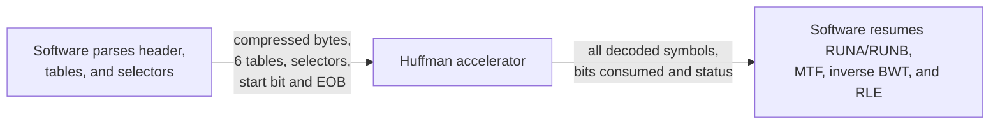

Software remains responsible for:

- parsing the bzip2 format;
- building the six Huffman tables and selector list;
- later RUNA/RUNB, move-to-front, inverse BWT, and run-length stages; and
- validating the final output.

Hardware is responsible for:

- maintaining the compressed-bit window;
- choosing the active Huffman table;
- finding each symbol;
- consuming the correct number of bits;
- detecting EOB and errors; and
- returning symbols and counters.

A call per symbol would cross the software/hardware boundary 148,271 times.
That communication overhead could destroy the benefit. One job should cover the
whole Huffman payload.

## 6. What optimized software does and does not prove

Optimized Python can reduce allocation, function-call, or lookup overhead. It
can suggest useful algorithms and reveal which work is avoidable. It does not,
by itself, constitute a hardware accelerator.

Hardware acceleration changes the execution structure: dedicated comparators
can operate in parallel, registers preserve state each clock, and input/output
move through explicit protocols. Software optimization still runs instructions
on the CPU, normally with mostly sequential control.

## Key facts to remember

1. Huffman decoding is only one stage of bzip2 decompression.
2. A Huffman result contains both a symbol and a consumed code length.
3. Peeking at bits does not consume them; accepting a match does.
4. EOB is emitted as a symbol before completion.
5. The acceleration boundary should contain the whole repeated Huffman loop.
6. The measured bottleneck fraction limits total application speedup.

## Understanding check

1. Does our accelerator produce the final 399,360 decompressed bytes? If not,
   what does it produce?
2. Using the example table, decode the bitstream `10 0 111`. Which symbols are
   produced, and how many total bits are consumed?
3. Why would calling the hardware once for every symbol be a poor interface?

## Discussion and answers

All three answers were correct:

1. The accelerator produces a sequence of decoded Huffman symbols, not the
   final 399,360 decompressed bytes. Software performs the remaining stages.
2. `10 0 111` decodes to `B, A, EOB` and consumes `2+1+3=6 bits`.
3. One software/hardware transaction per symbol would create 148,271 expensive
   crossings, so communication overhead could exceed the lookup work.

### Where 148,271 came from

This is a measured instrumentation count, not a value calculated from runtime.
`tools/characterize_workload.py` saves the original Python method, replaces it
with a wrapper, and increments a counter after every successful call:

```python
original_find = module.HuffmanTable.find_next_symbol

def measured_find(table, *args, **kwargs):
    result = original_find(table, *args, **kwargs)
    counts["huffman_symbols"] += 1
    return result
```

Running the original benchmark input through that instrumented function gave:

```text
N_calls = sum(1 for every successful find_next_symbol call)
        = 148,271 calls
```

Each successful call returns one symbol, including the final EOB, so for this
workload:

```text
N_huffman_symbols = N_find_next_symbol_calls = 148,271
```

The reference test also asserts the exact count:

```python
self.assertEqual(call_count, 148_271)
```

The selector count gives a consistency check. There are 148,270 non-EOB
symbols, and one selector covers at most 50 of them:

```text
selectors_required = ceil(non_EOB_symbols / 50)
                   = ceil(148,270 / 50)
                   = ceil(2,965.4)
                   = 2,966 selectors
```

This agrees with the measured selector count. It is not how the exact symbol
count was originally obtained: the final selector group can be partially full,
so selectors alone do not reveal its exact number of symbols.

### One software job versus internal hardware lookups

The final design fixes the transaction problem at the software/hardware
boundary:

```text
Software submissions per Huffman payload = 1 job
Internal hardware symbol lookups          = 148,271 lookups
```

Software configures the job once and starts it once. Bytes and symbols then
flow through streaming handshakes or DMA. Inside the accelerator, the matcher
still performs one lookup for each symbol—that repeated work is precisely what
the dedicated hardware is built to do.

## Peek versus consume in the reservoir

The reservoir has a fixed **capacity** of 32 bits, but its contents and number
of valid bits change. It is not cleared whenever a symbol matches.

The sequence is:

1. Append input bytes until a usable lookup window is present.
2. Present the next 16 bits to the matcher. This is the hardware peek.
3. The matcher returns a symbol and its code length `L`.
4. Nothing moves while that result is waiting for acceptance.
5. When the result is accepted, remove only the first `L` bits by shifting the
   reservoir left and subtracting `L` from `valid_bits`.
6. Preserve every remaining bit because it belongs to later symbols.
7. Append more bytes when there is free space.

Suppose the valid part of the reservoir begins with:

```text
valid_bits = 16
reservoir  = 11010110_01100000________________
             ^^^
```

If `110` means symbol C, the matcher returns:

```text
symbol = C
L      = 3 bits
```

Peeking caused no state change. After the result is accepted:

```text
reservoir  = 10110_01100000___________________
valid_bits = 16 - 3 = 13 bits
```

The remaining `10110_01100000` bits were not cleared. If byte `11110000`
arrives next, it is appended after them:

```text
reservoir  = 10110_01100000_11110000___________
valid_bits = 13 + 8 = 21 bits
```

The returned length is not "how long decoding took." It is the number of
compressed bits belonging to the symbol. Time is measured separately in clock
cycles. At 200 MHz, one clock cycle is 5 ns.

### Why use this mechanism?

Huffman codes have different lengths and do not normally end on byte
boundaries. After consuming a three-bit code, the next symbol begins at the
fourth bit of the same byte. Clearing the entire buffer would destroy valid
future input.

A reservoir bridges two different granularities:

```text
Input interface:       whole 8-bit bytes
Decoder consumption:   variable 1-to-16-bit codes
```

Other designs are possible. Software could construct and send a new 16-bit
window for every symbol, but that recreates the expensive per-symbol boundary.
A circular buffer with a bit pointer could avoid physical shifting, but its
selection and refill logic is harder to explain. The 32-bit left-shift
reservoir is a small, direct design for this project.

## Follow-up check and clarification

The follow-up answers were correct:

1. `21-4=17` valid bits remain; only the accepted code is removed.
2. `result_ready=0` means the consumer cannot accept the found result, so the
   result and reservoir must wait unchanged.
3. `match_len=7` means this code occupies and consumes seven compressed bits.
   It is not a time measurement or an average over multiple symbols.

### Shortest-first is separate from ready/valid

`result_ready` does not decide which Huffman code wins. Matching has already
selected a code before the result handshake begins.

A valid Huffman table is **prefix-free**: no complete code is the beginning of
another complete code. In this table:

```text
A   = 0
B   = 10
C   = 110
EOB = 111
```

for input beginning `110...`, the decoder checks:

```text
length 1: 1   -> no code
length 2: 11  -> no code
length 3: 110 -> C
```

Exactly one legal entry matches. The codes are not selected by longest-prefix
matching. The implementation uses shortest-first because the original pyflate
table is sorted by increasing length. With a valid prefix-free table, shortest-
first and longest-first would reach the same sole match.

Merely saying codes are different or unique is not sufficient. The invalid
table `X=1`, `Y=10` contains two different codes, but `1` is a prefix of `10`.
Input beginning `10...` would be ambiguous: should it be X followed by another
code, or Y? Huffman construction prohibits this situation.

### Why a found result may have to wait

The downstream consumer might be a small FIFO, DMA writer, or testbench. It can
temporarily run out of space or lose access to shared memory. It communicates
this by setting `result_ready=0`.

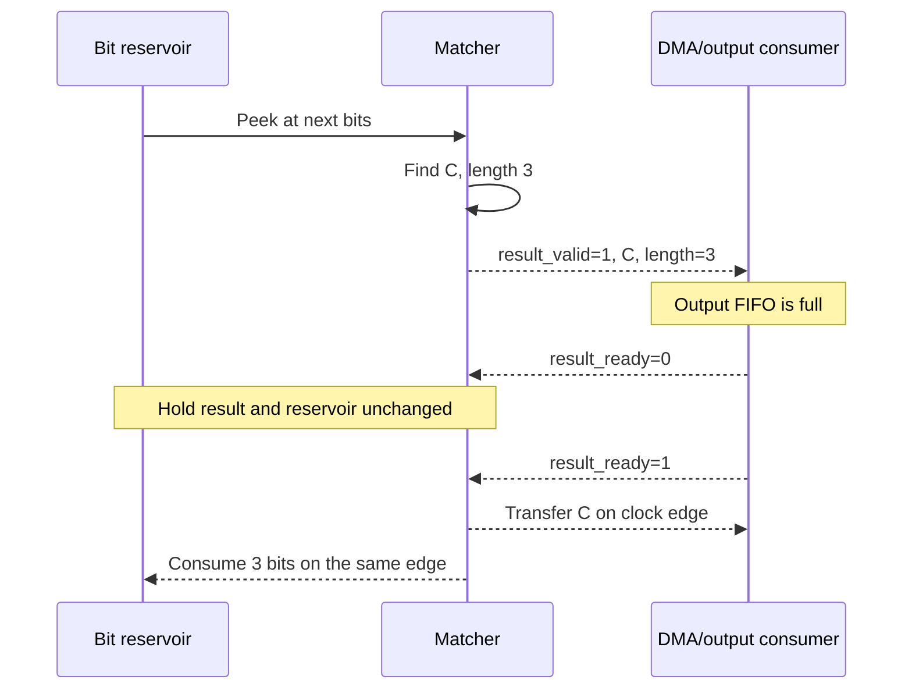

Example clock trace:

| Rising edge | `result_valid` | `result_ready` | Event | Reservoir action |
|---:|---:|---:|---|---|
| 10 | 1 | 0 | C is offered but not accepted | Hold all bits |
| 11 | 1 | 0 | C is still stalled | Hold all bits |
| 12 | 1 | 1 | C transfers to consumer | Remove exactly 3 bits |

The transfer condition is:

```text
result_transfer = result_valid AND result_ready
```

Coupling symbol transfer and bit consumption on the same edge makes them one
atomic event. If the reservoir advanced while the consumer was unable to store
C, the system could lose C, overwrite it with the following result, or leave
the output stream and input position inconsistent.

### Final Lesson 1 check

Both answers were correct:

1. `X=1`, `Y=10` is illegal because the complete code `1` is the prefix of the
   complete code `10`.
2. While `result_valid=1` and `result_ready=0`, the registered symbol, length,
   and reservoir position must remain unchanged.

Direction matters: the downstream consumer drives `result_ready`. It tells the
accelerator whether it has space to accept the offered result. The accelerator
drives `result_valid`, symbol, and length.

---

# Lesson 2: Bits, masks, shifts, and MSB-first ordering

## 1. Bits and bytes

A bit has one of two values:

```text
0 or 1
```

Eight bits form one byte. SystemVerilog labels an eight-bit signal like this:

```systemverilog
logic [7:0] byte_data;
```

```text
bit index:   7 6 5 4 3 2 1 0
example:     1 0 1 1 0 0 1 0
```

Bit 7 is the most significant bit (MSB). Bit 0 is the least significant bit
(LSB). The example is binary `1011_0010`, hexadecimal `0xB2`, and decimal 178:

```text
value = 1×2^7 + 0×2^6 + 1×2^5 + 1×2^4
        + 0×2^3 + 0×2^2 + 1×2^1 + 0×2^0
      = 128 + 32 + 16 + 2
      = 178
```

Hexadecimal is a compact way to write binary. One hex digit represents four
bits:

```text
B    2
1011 0010
```

## 2. MSB-first ordering

MSB-first means the decoder consumes bit 7 first, then bit 6, down through bit
0. For byte `0xB2`:

```text
stored byte:   1 0 1 1 0 0 1 0
read order:    1,0,1,1,0,0,1,0
bit indices:   7 6 5 4 3 2 1 0
```

If the next byte is `0x61 = 0110_0001`, the logical bitstream is:

```text
0xB2         0x61
1011_0010    0110_0001

combined stream = 1011001001100001...
```

This is the ordering used by the benchmark's bzip2 path. The simplified
accelerator does not support the reversed-code DEFLATE path.

## 3. Bit indices in the lookup window

Our lookup key is 16 bits:

```systemverilog
logic [15:0] lookup_bits;
```

The contract is:

```text
lookup_bits[15] = next compressed bit
lookup_bits[14] = following compressed bit
...
lookup_bits[0]  = sixteenth visible bit
```

That places the next code at the MSB side, which is called left alignment or
MSB alignment.

## 4. Right-aligned configuration code

Software supplies a canonical code at the right side of a 16-bit value. For
code `101`, length 3:

```text
dict_wr_code = 0000_0000_0000_0101
                                      ^^^ significant code bits
```

This is right aligned because the code occupies bits `[2:0]`.

The lookup window holds upcoming codes on the left. Hardware therefore shifts
the configured code left:

```text
shift = KEY_WIDTH - code_length
      = 16 bits - 3 bits
      = 13 bit positions

stored_pattern = dict_wr_code << shift
               = 0000_0000_0000_0101 << 13
               = 1010_0000_0000_0000
```

In hexadecimal:

```text
dict_wr_code   = 0x0005
stored_pattern = 0xA000
```

`<<` is a left shift. Bits move toward the higher index, zeros enter from the
right, and anything beyond the fixed 16-bit width is discarded.

## 5. Why a mask is needed

Only the first three lookup bits belong to this code. The other thirteen bits
may contain later Huffman symbols and must not affect the comparison.

The hardware creates this mask:

```text
stored_mask = 1110_0000_0000_0000 = 0xE000
```

A mask bit of 1 means "compare this position." A mask bit of 0 means "ignore
this position."

The comparison is:

```text
(lookup_bits AND stored_mask) == stored_pattern
```

Example lookup:

```text
lookup_bits:    1011_0110_0011_1001
stored_mask:    1110_0000_0000_0000
                ------------------- AND
masked_lookup:  1010_0000_0000_0000
stored_pattern: 1010_0000_0000_0000
```

They are equal, so code `101` matches. The trailing `1_0110_0011_1001` is
ignored and remains available for later symbols.

For a nonmatching lookup:

```text
lookup_bits:    1001_0110_0011_1001
stored_mask:    1110_0000_0000_0000
                ------------------- AND
masked_lookup:  1000_0000_0000_0000
stored_pattern: 1010_0000_0000_0000
```

`0x8000 != 0xA000`, so it does not match.

## 6. Generating the mask

Start with sixteen ones and shift by the same amount:

```text
all_ones   = 1111_1111_1111_1111
shift      = 13
stored_mask = all_ones << 13
            = 1110_0000_0000_0000
```

The general equations, with all values limited to `KEY_WIDTH` bits, are:

```text
shift          = KEY_WIDTH - L
stored_pattern = right_aligned_code << shift
stored_mask    = all_ones << shift
```

Hardware generates the mask internally so software cannot accidentally provide
a mask that disagrees with the code length.

## 7. Bitwise AND versus logical AND

SystemVerilog uses two different operators that look similar:

```systemverilog
lookup_bits & mask_mem[i]  // bitwise AND: operates on every bit position
valid_mem[i] && condition  // logical AND: combines true/false conditions
```

Example bitwise AND:

```text
1011
1100
---- AND
1000
```

Logical AND produces one true/false result:

```text
valid=1 AND comparison_true=1 -> match=1
valid=0 AND comparison_true=1 -> match=0
```

Our matcher combines both:

```systemverilog
raw_matches[i] = lookup_valid
               && valid_mem[i]
               && ((lookup_bits & mask_mem[i]) == pattern_mem[i]);
```

## 8. Starting in the middle of a byte

The Huffman payload may begin after other bzip2 fields inside the same byte.
`start_bit` tells the reservoir how many leading bits of its first input byte to
discard.

For first byte `1101_0110` and `start_bit=3`:

```text
original byte: 1 1 0 1 0 1 1 0
discard:       ^ ^ ^
remaining:           1 0 1 1 0

valid initial stream = 10110
valid_bits            = 8 - 3 = 5 bits
```

Only the first byte uses `start_bit`. Every following byte contributes all
eight bits.

## Key facts to remember

1. `[15]` is the MSB of a 16-bit vector and `[0]` is the LSB.
2. MSB-first means `lookup_bits[15]` is decoded first.
3. Software supplies codes right aligned; hardware stores them left aligned.
4. A left shift moves bits toward higher positions and inserts zeros.
5. A mask selects which lookup positions participate in comparison.
6. `&` operates bit by bit; `&&` combines Boolean conditions.
7. `start_bit` discards already-consumed leading bits from only the first byte.

## Understanding check

1. Write the first four MSB-first bits read from byte `0xB2 = 1011_0010`.
2. For code `011`, length 3, write its 16-bit right-aligned input, stored
   pattern, and stored mask.
3. Does lookup window `0111_0101_0000_1111` match that code? Show the masked
   lookup.
4. For first byte `1011_0010` and `start_bit=3`, which bits remain and how many
   are valid?

## Lesson 2 answers and byte-boundary clarification

All four answers were correct:

1. The first four MSB-first bits of `0xB2` are `1011`.
2. For code `011`, length 3:

   ```text
   right-aligned input = 0000_0000_0000_0011
   stored pattern      = 0110_0000_0000_0000
   stored mask         = 1110_0000_0000_0000
   ```

3. The lookup matches because the mask selects the first three lookup bits,
   those bits are `011`, and the masked value equals the stored pattern:

   ```text
   0111_0101_0000_1111 AND 1110_0000_0000_0000
   = 0110_0000_0000_0000
   ```

4. With `start_bit=3`, five bits remain from the first byte.

Code length alone does not make a lookup match. It defines which prefix bits
participate through the mask; the selected bit values must also equal the
pattern.

### Bytes are storage containers, not Huffman boundaries

Huffman codewords are concatenated without padding each one to a byte. Several
codewords can occupy one byte, and one codeword can begin in one byte and finish
in the next.

Using the example table:

```text
B   = 10
C   = 110
A   = 0
EOB = 111
```

the symbol sequence `B, C, A, EOB` becomes:

```text
10 | 110 | 0 | 111 = 101100111
```

Packing that continuous stream into bytes gives:

```text
byte 0: 10110011
        -- --- - --
        B   C  A first two EOB bits

byte 1: 1xxxxxxx
        ^ final EOB bit
```

Byte 0 contains all of B, all of C, all of A, and part of EOB. EOB crosses the
byte boundary. The reservoir joins the bytes so the matcher sees the continuous
stream `...111...` without caring where the physical byte boundary occurred.

### Why `start_bit` is needed

Before the main Huffman payload, bzip2 stores header and table-description
fields whose lengths are measured in bits. After software parses them, the next
Huffman code may start in the middle of the current byte.

Example:

```text
source byte:  H H H 1 0 1 1 0
bit index:    7 6 5 4 3 2 1 0
              ----- ----------
              parsed Huffman payload begins here
              header
```

If software has already consumed the three `H` bits, it gives hardware:

```text
source address = address of this same byte
start_bit      = 3
```

The hardware discards only those three already-consumed bits and begins with
`10110`. Starting from the following byte would incorrectly lose those five
valid payload bits.

Software could copy and shift the entire remaining input to make the payload
byte-aligned, but that adds CPU work and an extra memory copy. Passing a byte
address plus a three-bit offset preserves the original data and is cheaper:

```text
absolute_bit_position = 8 × byte_offset + start_bit
```

For `byte_offset=100 bytes` and `start_bit=3 bits`:

```text
absolute_bit_position = 8 bits/byte × 100 bytes + 3 bits
                      = 803 bits from the source beginning
```

### Final Lesson 2 check

All answers were correct:

1. EOB crosses from byte 0 into byte 1.
2. The remaining five bits cannot be skipped because compressed codewords are
   packed continuously and those bits contain later payload data.
3. For a 12-byte offset and five-bit starting offset:

   ```text
   absolute_bit_position = 12 bytes × 8 bits/byte + 5 bits
                         = 96 bits + 5 bits
                         = 101 bits
   ```

At the beginning of the accelerator job, the discarded `start_bit` bits usually
belong to bzip2 metadata that software already parsed. During Huffman decoding,
bits left after consuming one codeword belong to later codewords. Both cases
demonstrate why the bitstream cannot simply jump to the next byte.

---

# Lesson 3: Prefix-free and canonical Huffman codes

## 1. Why Huffman codes have different lengths

Compression tries to represent common symbols with fewer bits and uncommon
symbols with more bits. A small example is:

| Symbol | Code | Length |
|---|---|---:|
| A | `0` | 1 bit |
| B | `10` | 2 bits |
| C | `110` | 3 bits |
| EOB | `111` | 3 bits |

If A is common, its one-bit code saves space. The price is that the decoder must
determine where one variable-length codeword ends and the next begins.

## 2. Prefix-free means unambiguous

A code is a prefix of another code if it appears at the beginning of that code.
For example, `1` is a prefix of `10` and `111`, while `10` is not a prefix of
`110`.

A valid Huffman table is prefix-free:

```text
No complete codeword is a prefix of another complete codeword.
```

The example table can be drawn as a binary tree. A zero takes the left branch,
a one takes the right branch, and every complete symbol is a leaf:

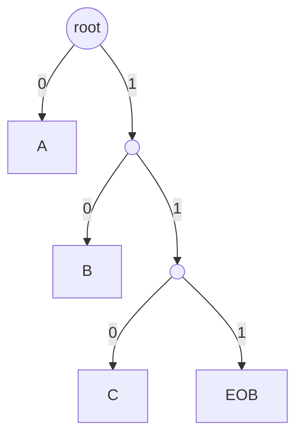

No symbol leaf has children. Once the decoder reaches a leaf, the codeword is
complete and decoding can stop.

Different codes are not automatically prefix-free. This table is invalid:

```text
X = 1
Y = 10
```

For input beginning `10...`, `1` could mean X, but `10` could mean Y. The first
code ends at a node that also needs children, causing ambiguity.

## 3. Decoding walks until the first leaf

For input beginning `1101...`, use the valid example tree:

```text
read 1:    not a leaf
read 11:   not a leaf
read 110:  leaf C
```

The decoder returns C and consumes three bits. It does not keep reading to find
a longer match because reaching a leaf proves the code is complete.

This is the conceptual reason shortest-first decoding is natural:

```text
try length 1, then length 2, then length 3, ...
stop at the first complete code
```

## 4. Parallel CAM interpretation

Our matcher does not physically walk a tree. It compares the lookup window
against every stored entry in parallel. For lookup beginning `110...`:

| Entry | Pattern checked | Result |
|---|---|---|
| A | first bit equals `0` | no |
| B | first two bits equal `10` | no |
| C | first three bits equal `110` | yes |
| EOB | first three bits equal `111` | no |

The parallel comparison produces one `raw_matches` bit per table entry. The
priority selector then scans code lengths from 1 through `KEY_WIDTH` and returns
the shortest valid match.

For a legal prefix-free table, only one entry should match, so shortest-first
and longest-first would return the same entry. Shortest-first is still chosen
because it mirrors the original Python table order and behaves like walking the
Huffman tree to its first leaf.

For a malformed overlapping table, priority defines deterministic behavior:

```text
X = 1
Y = 10
lookup begins 10...

shortest-first returns X
longest-first  returns Y
```

Neither result makes the malformed table valid; the priority rule merely makes
hardware behavior defined.

## 5. Canonical Huffman codes

Many different binary trees can use the same set of code lengths. Canonical
Huffman coding chooses one predictable assignment based on lengths and symbol
order. The decoder can reconstruct the codewords from the lengths instead of
storing an arbitrary tree representation.

For symbols with lengths:

```text
A: 1
B: 2
C: 3
EOB: 3
```

the canonical assignment is:

```text
A   = 0
B   = 10
C   = 110
EOB = 111
```

The broad procedure is:

1. Sort symbols by increasing code length and then symbol order.
2. Assign the first available binary value of each length.
3. Increment the code for the next symbol.
4. When length increases, shift the running code left.

The original pyflate software constructs these canonical codes before the main
decode loop. Our simplified hardware does not construct them; software loads
each already-computed `(code, length, decoded symbol)` entry.

Pyflate's field names are slightly confusing:

```text
x.symbol = canonical compressed bit code
x.bits   = code length
x.code   = decoded numeric symbol returned to the algorithm
```

The hardware configuration maps them as:

```text
dict_wr_code   = x.symbol
dict_wr_len    = x.bits
dict_wr_symbol = x.code
```

## 6. Code-space check: the Kraft sum

For a binary prefix code, lengths must satisfy the Kraft inequality:

```text
sum over all symbols of 2^(-code_length) <= 1
```

Each length-`L` code occupies `1/2^L` of the binary tree's available leaf
space. For lengths 1, 2, 3, and 3:

```text
K = 2^-1 + 2^-2 + 2^-3 + 2^-3
  = 1/2 + 1/4 + 1/8 + 1/8
  = 1
```

The tree is complete: all available code space is used. A sum greater than one
would mean that no prefix-free binary assignment is possible. A sum below one
can be valid but leaves some tree space unused.

## 7. EOB and remaining bits

EOB is an ordinary codeword with a special meaning. Once accepted, the current
Huffman block is complete. Bits following EOB may belong to later bzip2 fields,
so hardware reports the exact Huffman `bits_consumed` instead of declaring that
every prefetched bit was consumed.

## Key facts to remember

1. Short codes normally represent more frequent symbols.
2. Prefix-free means no complete codeword begins another complete codeword.
3. Reaching the first tree leaf completes one decode.
4. Our CAM compares entries in parallel but selects shortest length first.
5. Canonical coding derives predictable bit patterns from code lengths.
6. Software builds the canonical table; our simplified hardware matches it.
7. The Kraft sum checks whether code lengths can fit in a prefix-free tree.

## Understanding check

Use the table `A=0`, `B=10`, `C=110`, `EOB=111`.

1. Decode `0 10 111 110`. Which symbols are emitted before the decoder stops at
   EOB, how many bits are consumed, and which bits remain?
2. Why is "every symbol has a different code" weaker than saying the table is
   prefix-free?
3. For a lookup beginning `1110...`, which entry matches and what is its
   `match_len`?
4. Calculate the Kraft sum for code lengths `1, 2, 3, 3`. What does the result
   say about the available binary-tree code space?

## Lesson 3 answers and clarification

All answers were correct:

1. `0 10 111 110` emits A, B, and EOB. It consumes `1+2+3=6` bits and leaves
   `110` untouched.
2. Different codes can still overlap by prefix, as in `X=110`, `Y=1101`.
   Prefix-free coding removes that boundary ambiguity.
3. Lookup `1110...` matches EOB code `111` with `match_len=3`; the following
   bit is not consumed by this symbol.
4. The Kraft sum is one, so this particular tree's code space is full. Another
   leaf cannot be added without changing the code assignment or lengths.

After EOB, remaining bits are no longer interpreted by the current Huffman
loop. Although remaining bits `110` happen to equal C in the example table,
they may belong to a CRC, another block field, padding, or other bzip2 syntax.
The hardware must report its exact consumed length and leave interpretation of
later bits to the software parser.

---

# Lesson 4: What hardware acceleration changes

## 1. Software and hardware execute differently

A CPU is general-purpose hardware. Python asks it to execute a sequence of
instructions for many unrelated tasks. The original lookup is conceptually:

```text
for each table entry:
    read its length
    peek at that many bits
    compare the code
    branch based on the result
    continue or return
```

The CPU reuses a comparatively small set of arithmetic, load/store, and branch
circuits for each iteration. Python adds interpreter, object, and function-call
work around those CPU instructions.

A custom accelerator builds a dedicated spatial circuit for the operation:

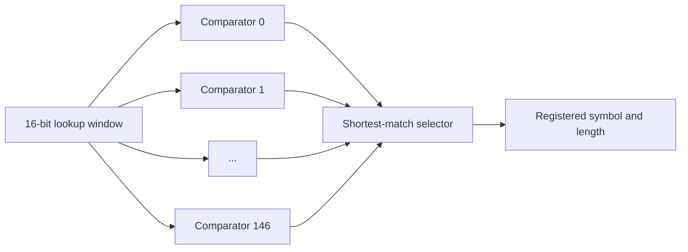

All 147 entry comparators exist physically in one table bank. They evaluate in
parallel rather than being reused by a software loop that examines entries in
sequence until it finds a match. The CPU loop also performs list iteration,
Python-object and attribute access, loop/branch control, and calls to bitfield
methods. An object access may hit a CPU cache, so it would be inaccurate to say
that every access reaches DRAM; the important point is that the general-purpose
CPU must execute these operations as a dependent instruction sequence.

Parallel does not mean zero time. Electrical signals still pass through mask,
comparison, and priority-selection logic. The path must settle before the next
registering clock edge.

## 2. Temporal reuse versus spatial parallelism

The main distinction is:

```text
Software loop: reuse hardware across time
Accelerator:   duplicate hardware across space
```

Suppose, only as a simplified illustration, that one software entry check takes
five CPU cycles and 80 entries are inspected before finding a match:

```text
software comparison work = 80 entries × 5 cycles/entry
                         = 400 CPU cycles
```

The accelerator evaluates 147 entries together and registers one result. Our
connected simple design then uses a second clock to accept that result and
advance the bit reservoir:

```text
hardware steady-state work = 2 accelerator cycles/symbol
```

The CPU and accelerator clocks need not be equal, so cycle counts alone are not
enough. Time always uses:

```text
time [s] = cycles [cycles] / frequency [cycles/s]
```

## 3. Configuration creates specialization

The comparator hardware is fixed, but its table contents are programmable.
Before a job, software writes each entry's code, length, and output symbol.

```text
Fixed circuit:      masks, comparators, priority logic, registers
Configured state:   patterns, lengths, symbols, valid entries, selectors
Streaming state:    reservoir bits, counters, current selector
```

This is still a specialized accelerator: it can perform Huffman matching, not
arbitrary Python operations. Configuration changes its data, not its fundamental
function.

## 4. Choosing the software/hardware partition

Good hardware candidates tend to have several properties:

- a measured portion of runtime is significant;
- an operation repeats many times;
- the datapath is regular and bounded;
- parallelism is available;
- the required state fits on chip; and
- enough work is submitted per job to repay communication overhead.

`find_next_symbol` has these properties: 148,271 repeated lookups, at most 147
entries in each measured table, bounded 16-bit comparisons, a 12.11% self
runtime share, and a 38.71% inclusive call-subtree share.

The surrounding bzip2 parser is a less attractive first target. It contains
irregular control, varied fields, exceptions, dynamic software objects, and
work that occurs far fewer times. Keeping it in software also makes the hardware
interface smaller and easier to verify. Programmability lets software load the
six tables that it parsed, but that is not the reason for the partition.
Amortization is a separate idea: configure and start once, then decode 148,271
symbols before returning control to software.

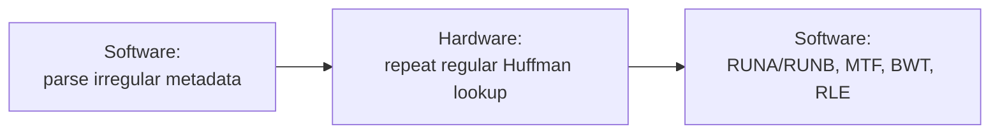

## 5. The accelerator needs more than a comparator

Moving only the equality comparison into hardware would not remove enough work.
The final accelerator also needs:

- a bit reservoir, so software does not prepare every lookup window;
- six stored tables, so software does not reload one every 50 symbols;
- a selector controller, so hardware chooses tables internally;
- ready/valid interfaces, so streams can stall safely;
- EOB and error handling; and
- bit, symbol, cycle, and stall counters.

This is why the final design is larger than the original friend matcher. The
friend matcher is the computational kernel; the wrappers make it usable without
per-symbol software control.

## 6. One job amortizes communication overhead

If software called hardware once per symbol:

```text
software/hardware crossings = 148,271 per benchmark job
```

With the selected boundary:

```text
job start operations = 1
internal lookups      = 148,271
```

Configuration and DMA setup occur once, and the repeated loop stays in
hardware. This is called amortization: a fixed setup cost is spread over many
useful operations.

If setup takes `T_setup` and `N` symbols are processed, average setup overhead
per symbol is:

```text
setup_overhead_per_symbol [s/symbol] = T_setup [s] / N [symbols]
```

For an illustrative 20 microsecond setup and 148,271 symbols:

```text
20 us / 148,271 symbols = 0.0001349 us/symbol
                        = 0.1349 ns/symbol
```

The same 20 microseconds paid separately for every symbol would instead be:

```text
148,271 × 20 us = 2,965,420 us = 2.96542 s
```

## 7. Component speedup versus application speedup

Making one component extremely fast cannot remove time spent elsewhere. We show
two bounds so that the profile scope matches the proposed implementation:

| Case | Accelerated fraction `f` | Software scope |
|---|---:|---:|
| Conservative matcher-only/self | 0.121126 | 80.21 ms |
| Batched matcher + reservoir, optimistic | 0.387082 | 256.34 ms |

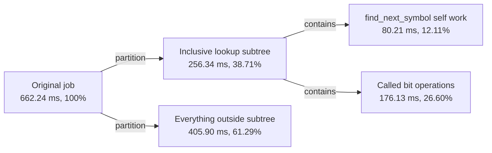

The simple matcher corresponds mainly to `SELF`. In the complete top level,
`huffman_bit_reservoir` performs peek and consume, the byte stream supplies the
source data, and the controller repeats lookups. Functionally, our proposed
batch accelerator therefore aims at `SELF + CHILD`. We still call the inclusive
number optimistic because profiling is sampled and real MMIO/DMA/output costs
are added at the new boundary.

Amdahl's law is:

```text
S_total = 1 / ((1-f) + f/S_component)
```

Our analytical hardware estimate is `T_hardware = 1.482725 ms`. For the
conservative self-only accounting:

```text
S_component,self = 80.21 ms / 1.482725 ms = 54.10x
S_total,self = 1 / (0.878874 + 0.121126/54.10)
             = 1.135x

S_max,self = 1 / (1-0.121126) = 1.138x
```

For our intended batch boundary, where the hardware reservoir also replaces
the software peek/consume operations:

```text
S_component,inclusive = 256.34 ms / 1.482725 ms = 172.88x
S_total,inclusive = 1 / (0.612918 + 0.387082/172.88)
                  = 1.626x optimistic estimate

S_max,inclusive = 1 / (1-0.387082) = 1.632x
```

The inclusive case is appropriate to the architecture we designed, but it is
still an upper projection: MMIO/DMA setup, output handling, and any child work
left in software reduce the achieved result. This is why the final report
should present 1.135x as the conservative estimate and 1.626x as the optimistic
full-boundary estimate, not as a guaranteed measurement.

## 8. The cost of parallel hardware

Parallelism consumes physical resources. The six-bank design contains:

```text
6 tables × 147 entries/table = 882 CAM entries
```

Each entry stores pattern, mask, symbol, length, and valid state and has matching
logic. This increases area and potential power. "Six available tables" means
that all six are resident; it does not mean that all six decode the same symbol.
The selector sends `lookup_valid` only to the active bank, and the result mux
returns only that bank's answer.

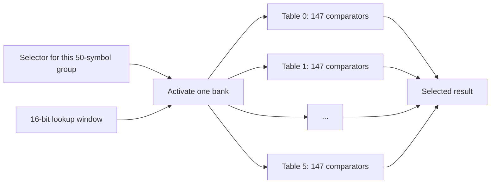

Compared with one complete 147-entry bank, six banks do not make an individual
comparison six times faster. Their main performance benefit is eliminating a
table reload whenever the selector changes: selection is a mux operation with
no extra cycle in the current RTL. Their cost is roughly six times the entry
storage and comparison logic, more routing, static leakage, and potentially
harder timing closure. Gating inactive banks reduces dynamic switching power,
but it does not remove their area or leakage.

A smaller alternative could retain six table memories but share one comparison
engine. That saves comparator area but adds muxing or sequential reads and can
increase lookup cycles. A single reloaded table saves still more area but adds
configuration transfers and stalls whenever the required table is not resident.

The central tradeoff is:

```text
more parallel comparators -> more area and power, fewer lookup cycles
less shared hardware      -> less area and power, more lookup cycles
```

Our version favors clarity and speed because the project goal is to demonstrate
the complete hardware/software acceleration idea. The detailed canonical-range
design remains an example of a more area-efficient alternative.

## 9. Hardware acceleration is not automatically faster

The design can lose its advantage if:

- data-transfer or driver overhead is too large;
- jobs contain too little work;
- memory cannot supply or accept data fast enough;
- the circuit misses its target clock frequency;
- output backpressure causes many stalls; or
- the selected function was not actually an important bottleneck.

That is why the project includes profiling, interfaces, counters, timing
analysis, and Amdahl's law instead of presenting parallel logic alone.

## Key facts to remember

1. A CPU reuses general-purpose hardware over time; an accelerator dedicates
   hardware to a narrower operation.
2. Our table entries compare in parallel, but their logic still has delay.
3. Software performs irregular parsing; hardware performs the repeated bounded
   lookup loop.
4. The reservoir and selector controller keep per-symbol work out of software.
5. One large job amortizes setup cost over 148,271 symbols.
6. Component speedup and whole-application speedup are different.
7. More parallelism normally costs more area and power.

## Understanding check

1. In your own words, how does the CPU's entry-search loop differ from the 147
   parallel hardware comparators?
2. Why do we keep bzip2 header and metadata parsing in software but move the
   repeated symbol lookup into hardware?
3. Calculate both perfect limits: matcher-only with `f=0.121126`, and the
   optimistic matcher-plus-reservoir boundary with `f=0.387082`. Explain why the
   second value is applicable to our design but must not be claimed as measured.
4. Name one performance benefit and one hardware cost of keeping six complete
   table banks available simultaneously.

## Lesson 4 discussion and corrected answers

### 1. What the 147 comparators replace

The answer is substantially correct. In software, the loop inspects entries in
sequence and pays for Python list iteration, object/attribute access,
comparisons, branches, and bitfield calls. It stops when a match is found, so it
does not necessarily inspect all 147 entries. In one active hardware bank, 147
masked comparisons are described concurrently and shortest-first priority logic
selects the winner. The trade is temporal CPU work for spatial hardware.

Do not say that every Python object access goes to main memory. It can be served
by a CPU cache. "Memory/object access overhead" is accurate; "147 DRAM reads"
is not established by the profile.

### 2. Why parsing remains software

The primary reason is workload shape. Header/metadata parsing is irregular and
infrequent, while lookup is regular, bounded, parallelizable, and repeated
148,271 times. Programmability lets the same accelerator accept the tables that
software parsed. Parameter scalability is useful engineering, but neither is
the definition of amortization.

Amortization means paying configuration and start/finish communication once for
a large batch, so:

```text
average setup cost per symbol = setup cost per job / symbols per job
```

### 3. Exactly which measured time our hardware targets

Python-level self attribution gives the narrow matcher boundary: 12.11%,
estimated as 80.21 ms/job. Inclusive folded-stack attribution gives the nested
call boundary: 38.71%, estimated as 256.34 ms/job. The latter already contains
the former.

`huffman_find_simple` replaces the scan and compare portion. The completed top
level additionally uses `huffman_bit_reservoir` to replace the accelerated
call path's `snoopbits` and `readbits`, streams source bytes, chooses selectors,
and repeats lookups without returning to software. Therefore the functional
goal is to replace the inclusive subtree. Use 256.34 ms only as an optimistic
projection; use 80.21 ms as the conservative directly attributed scope and
report both. The hardware does not replace RUNA/RUNB expansion, MTF, inverse
BWT, final RLE, or unrelated parsing.

For infinitely fast hardware, the two Amdahl limits are:

```text
S_max,self      = 1 / (1 - 0.121126) = 1.138x
S_max,inclusive = 1 / (1 - 0.387082) = 1.632x
```

With the analytical 1.482725 ms hardware time, they become approximately 1.135x
and 1.626x before communication overhead. These are estimates, not synthesis or
end-to-end measurements.

### 4. What six complete banks buy and cost

The answer has the right direction, with one correction: the design still
switches tables logically through `active_table`; it avoids **reloading** the
table contents. Six banks do not shorten the compare latency relative to one
equally parallel 147-entry bank. They remove reconfiguration stalls when the
bzip2 selector changes.

Using the current stored fields, an approximate raw storage count is:

```text
bits per entry = 16 pattern + 16 mask + 9 symbol + 5 length + 1 valid
               = 47 bits/entry

six-bank storage = 6 * 147 entries * 47 bits/entry
                 = 41,454 bits
                 = about 40.5 Kibit, excluding control and comparator logic
```

The performance benefit is immediate table selection with no reload cycle. The
cost is more LUT/comparator logic, registers or memory bits, routing, leakage,
and timing pressure. Only one bank receives a valid lookup in the current RTL,
which reduces inactive-bank switching power; all six banks still occupy area.

### Short follow-up check

1. For one symbol, how many table banks are resident, how many are selected, and
   how many entry comparisons occur in the selected bank?
2. Which profile fraction should we use as the intended optimistic boundary,
   and which should we retain as the conservative boundary?
3. Does six-bank storage make one comparison six times faster? If not, what
   delay does it avoid?

---

# Lesson 5: Combinational and sequential SystemVerilog

## 1. SystemVerilog describes a circuit

The most important mental shift is that synthesizable SystemVerilog normally
describes hardware that exists at the same time. It is not a list of CPU
instructions that automatically run one after another.

In Python, this loop reuses the CPU across time:

```python
for entry in table:
    if matches(entry, bits):
        return entry.symbol
```

In our matcher, a fixed-bound SystemVerilog loop describes repeated hardware:

```systemverilog
always_comb begin
    for (int i = 0; i < NUM_ENTRIES; i++) begin
        raw_matches[i] = lookup_valid
                       && valid_mem[i]
                       && ((lookup_bits & mask_mem[i]) == pattern_mem[i]);
    end
end
```

For `NUM_ENTRIES=147`, synthesis can unroll this into 147 masked equality
comparisons. The loop itself does not mean 147 clock cycles. A design takes 147
cycles only if we explicitly build state such as an index register and advance
that index once per clock.

## 2. `logic` does not automatically mean a register

SystemVerilog `logic` is a signal/data type. Whether it represents remembered
state depends on how it is driven:

| Driver | Meaning in this design |
|---|---|
| `assign` | Continuous combinational relationship |
| `always_comb` | Procedural description of combinational logic |
| `always_ff @(posedge clk ...)` | Clocked state/register behavior |

For example, `raw_matches` and `candidate_symbol` are declared as `logic`, but
they are combinational. `result_valid` is also `logic`, but it is assigned in
`always_ff`, so it is remembered by a register.

Parameters such as `KEY_WIDTH=16` and `NUM_ENTRIES=147` are elaboration-time
constants. They configure the circuit that is built; they are not ordinary
runtime input signals.

## 3. Continuous assignment

This line is a continuous Boolean equation:

```systemverilog
assign lookup_ready = !result_valid || result_ready;
```

There is no clock and no stored previous value. Whenever `result_valid` or
`result_ready` changes, the physical logic propagates toward a new
`lookup_ready` value after its gate/wire delay.

The equation implements three cases:

| `result_valid` | `result_ready` | `lookup_ready` | Meaning |
|---:|---:|---:|---|
| 0 | 0 or 1 | 1 | Output register is empty; accept a lookup |
| 1 | 0 | 0 | Old result is stalled; do not overwrite it |
| 1 | 1 | 1 | Old result leaves; a new lookup may replace it |

The ready/valid protocol itself is Lesson 7. Here, the key point is that
`assign` creates combinational logic.

## 4. `always_comb`: outputs depend on current inputs

An `always_comb` block describes logic with no intentional memory:

```text
combinational outputs = function(current inputs, current registered state)
```

Our first combinational stage creates one `raw_matches[i]` bit per entry. The
second stage examines those bits and selects a symbol:

```systemverilog
always_comb begin
    candidate_found  = 1'b0;
    candidate_symbol = '0;
    candidate_len    = '0;

    for (int l = 1; l <= KEY_WIDTH; l++) begin
        for (int i = 0; i < NUM_ENTRIES; i++) begin
            if (!candidate_found
                    && raw_matches[i]
                    && (len_mem[i] == l)) begin
                candidate_found  = 1'b1;
                candidate_symbol = symbol_mem[i];
                candidate_len    = len_mem[i];
            end
        end
    end
end
```

The initial assignments are defaults. Every output receives a value even when
no entry matches, so the block does not need to remember an earlier result.

The loop over `l` starts at 1, so the generated priority logic chooses the
shortest matching length. Although all raw comparisons are parallel, priority
selection still has propagation delay and may become part of the critical path.

## 5. Blocking assignment in combinational logic

The combinational blocks use blocking assignment, written `=`:

```systemverilog
candidate_found = 1'b0;
candidate_found = 1'b1;
```

Within one evaluation of the block, the assigned value is immediately visible
to the following statements. That is important here: after one candidate sets
`candidate_found`, later candidates see it as 1 and cannot replace the winner.

A practical rule for this project is:

```text
always_comb -> normally use blocking assignment (=)
always_ff   -> normally use nonblocking assignment (<=)
```

## 6. Avoiding unintended latches

Consider this incomplete combinational block:

```systemverilog
always_comb begin
    if (enable)
        y = a;
end
```

What should `y` be when `enable=0`? To preserve the old value, hardware would
need memory. A synthesis tool may infer a latch, even though the author probably
wanted combinational logic.

One fix assigns a default:

```systemverilog
always_comb begin
    y = '0;
    if (enable)
        y = a;
end
```

Equivalent complete `if/else` assignments also work. This is why the matcher
sets `candidate_found`, `candidate_symbol`, and `candidate_len` before its loops,
and why the six-table output mux gives every output a default before checking
`active_table`.

## 7. `always_ff`: state changes at a clock edge

Registers remember values between clock edges. Our table configuration is
stored with:

```systemverilog
always_ff @(posedge clk or negedge rst_n) begin
    if (!rst_n) begin
        valid_mem <= '0;
    end else if (dict_wr_en && (dict_wr_addr < NUM_ENTRIES)) begin
        pattern_mem[dict_wr_addr]
            <= dict_wr_code << (KEY_WIDTH - dict_wr_len);
        // Other stored fields are written here too.
    end
end
```

When `rst_n` is asserted low, the validity state clears. During normal operation,
new table data is captured on a rising edge only when the write conditions are
true. Between writes, the stored entries retain their values.

An omitted assignment has different meanings in the two block types:

```text
always_comb missing a path -> unintended latch may be required
always_ff missing a branch -> existing register intentionally holds its value
```

The output register is another sequential block:

```systemverilog
always_ff @(posedge clk or negedge rst_n) begin
    if (!rst_n) begin
        result_valid <= 1'b0;
        match_found  <= 1'b0;
        match_symbol <= '0;
        match_len    <= '0;
    end else if (lookup_ready) begin
        result_valid <= lookup_valid;
        if (lookup_valid) begin
            match_found  <= candidate_found;
            match_symbol <= candidate_symbol;
            match_len    <= candidate_len;
        end
    end
end
```

This turns a changing combinational candidate into a result that remains stable
while the next component is not ready.

## 8. The matcher as registers and combinational clouds

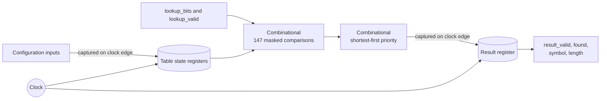

Between rising edges, signals propagate through `CMP` and `PRI`. At a rising
edge, the result register samples the settled candidate. It then holds that
value until another permitted register update occurs.

This gives a useful abstraction:

```text
register/state -> combinational calculation -> register/state
```

Lesson 6 will calculate how much time the combinational calculation is allowed
to take.

## 9. Nonblocking assignment uses the old register values

Clocked logic uses nonblocking assignment, written `<=`. All right-hand sides
are evaluated using the state immediately before the triggering edge, and the
register updates take effect together.

For example:

```systemverilog
always_ff @(posedge clk) begin
    a <= b;
    b <= a;
end
```

After the edge, `a` receives the old `b`, while `b` receives the old `a`. This
models two registers exchanging values. Nonblocking assignment prevents the
first source-code line from incorrectly changing what the second line reads on
the same edge.

## 10. Procedural loops versus generate loops

Our RTL uses two different kinds of loop:

1. A fixed procedural loop inside `always_comb` describes repeated comparison
   or priority logic.
2. A `generate for` loop in `huffman_find_six_table.sv` creates six physical
   matcher instances during elaboration.

```systemverilog
generate
    for (genvar table_index = 0;
         table_index < NUM_TABLES;
         table_index++) begin : gen_table
        hardware_dictionary_accelerator matcher (...);
    end
endgenerate
```

Neither loop advances itself one iteration per clock. To make a sequential
147-cycle search, we would explicitly create an entry-index register, compare
one indexed entry, increment the index at each edge, and stop when a match is
found.

## 11. One request through the matcher

For a simplified accepted request:

1. Table entries already exist in registers or synthesized memory structures.
2. `lookup_bits` and `lookup_valid` drive the combinational match logic.
3. `raw_matches` settles to a 147-bit vector.
4. The priority logic settles on `candidate_symbol` and `candidate_len`.
5. At the next permitted rising edge, the result register captures them and
   asserts `result_valid`.
6. The register holds the result if the consumer applies backpressure.

The exact physical implementation is chosen by synthesis. An array named
`pattern_mem` is not guaranteed to become a dedicated RAM block. Because all
147 entries are read in parallel for CAM matching, an FPGA tool may implement
much of this structure with registers and LUT logic.

## 12. What the timescale directive does not do

```systemverilog
`timescale 1ns / 1ps
```

This sets simulation time units and precision. It does not create a clock and
does not guarantee 200 MHz. A testbench generates clock transitions; synthesis
and timing constraints define the target hardware frequency.

## Key facts to remember

1. SystemVerilog describes concurrent hardware, not an automatic instruction
   sequence.
2. `logic` can represent combinational or registered signals.
3. `assign` and `always_comb` describe combinational relationships.
4. `always_ff` describes state updated at clock/reset events.
5. Use blocking `=` for our combinational blocks and nonblocking `<=` for our
   clocked blocks.
6. Give combinational outputs values on every path to avoid unintended latches.
7. A fixed HDL loop normally replicates logic; it does not automatically consume
   one clock per iteration.
8. Parallel comparison can still have a long priority/routing delay.

## Understanding check

1. Does the `for` loop that creates 147 `raw_matches` consume 147 clock cycles?
   Explain what it creates instead.
2. Which signals represent remembered state: `raw_matches`, `pattern_mem`,
   `candidate_symbol`, and `result_valid`?
3. Why are blocking assignments useful in the shortest-first combinational
   priority block?
4. What unwanted hardware could be inferred if an `always_comb` output is not
   assigned for every possible path?
5. What is the difference between the matcher loop in `always_comb` and the
   six-table `generate for` loop?

## Lesson 5 answers

### 1. The 147-entry loop

It does not take 147 clock cycles. With the fixed parameter value, synthesis
unrolls the loop into 147 masked comparison lanes. They evaluate concurrently,
then feed the priority-selection network. This spends hardware area and creates
combinational propagation delay, not 147 sequential cycles.

### 2. Signals that remember state

`pattern_mem` and `result_valid` are remembered state because `always_ff`
assigns them. `raw_matches` and `candidate_symbol` are combinational values
because `always_comb` assigns them. The declaration type `logic` alone does not
answer whether a signal is registered.

### 3. Blocking assignment in the priority block

Blocking assignment makes an update immediately visible to later statements in
the same combinational evaluation. Once the shortest matching entry sets
`candidate_found=1`, the remaining loop iterations see that value and cannot
replace the chosen candidate. This procedural ordering describes priority
logic; it does not insert clock cycles.

### 4. Missing combinational assignment

If an output is not assigned on every path, retaining its previous value may
require a latch. That latch is normally unintended here. Defaults at the start
of the block, or a complete `if/else` or `case`, ensure purely combinational
behavior.

### 5. Procedural and generate loops

A fixed loop inside `always_comb` repeats operations within one combinational
network. The `generate for` loop repeats structural instances, creating six
matcher modules. Neither advances with time. A counter and state machine would
be required to distribute loop iterations over multiple cycles.

---

# Lesson 6: Clocks, registers, reset, latency, and throughput

## 1. A clock divides operation into periods

A synchronous circuit uses repeated clock edges as coordination points. The
frequency says how many periods occur per second, and the period says how much
time exists between corresponding edges:

```text
T_clock [s/cycle] = 1 / f_clock [cycles/s]
f_clock [cycles/s] = 1 / T_clock [s/cycle]
```

Our target is 200 MHz:

```text
f_clock = 200 MHz
        = 200,000,000 cycles/s

T_clock = 1 / 200,000,000 cycles/s
        = 0.000000005 s/cycle
        = 5 ns/cycle
```

Thus adjacent rising edges are five nanoseconds apart. A higher frequency gives
less time for combinational logic; it is not automatically achievable.

## 2. What happens between two rising edges

A simplified register-to-register path works as follows:

1. At edge `k`, a source register launches its new output.
2. That signal propagates through gates and routing.
3. It must reach the destination register early enough before edge `k+1`.
4. At edge `k+1`, the destination captures it.

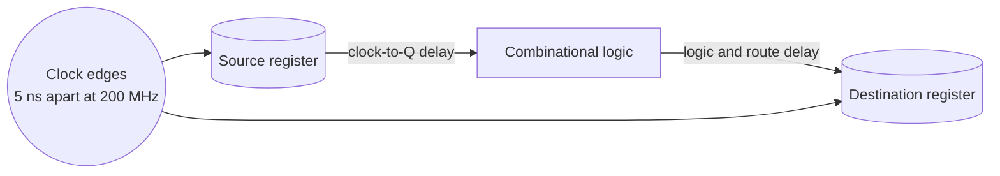

For our matcher, a likely maximum-delay path is:

```text
table/result source state
    -> 16-bit mask and equality comparison
    -> 147-entry shortest-first priority selection
    -> matcher result register
```

The reservoir has another candidate path: a variable-length 32-bit shift plus
bit-count and refill control.

The active selector is now registered, so selector RAM is not in the normal
bank-to-CAM path. At a 50-symbol boundary, a separate timing risk begins at the
selector-index register, performs the increment and asynchronous selector read,
checks the table ID, and reaches `active_table_q`. Synthesis and routing—not the
RTL text—determine which path is actually worst. A synchronous prefetch stage is
the fallback if the boundary-only path misses the target.

## 3. Setup time, hold time, and uncertainty

The destination register needs data to be stable shortly before its capture
edge. That requirement is **setup time**. Data must also remain stable briefly
after the edge; that requirement is **hold time**.

For a maximum-delay/setup check, a simplified constraint is:

```text
T_clock_to_Q + T_logic + T_route + T_setup + T_uncertainty <= T_clock
```

where:

- `T_clock_to_Q` is the source register's output delay after an edge;
- `T_logic` is delay through gates/LUTs;
- `T_route` is physical wire delay;
- `T_setup` is the destination register requirement; and
- `T_uncertainty` accounts for clock variation, skew, and margin.

Static timing analysis also checks minimum-delay/hold paths. Passing setup does
not by itself prove that hold timing passes.

## 4. Critical path, slack, and maximum frequency

Static timing analysis examines many paths. The path that most restricts the
clock is the **critical path**.

For a simplified setup report:

```text
slack [ns] = required arrival time [ns] - actual arrival time [ns]
```

Interpretation:

```text
positive slack -> path meets the target with margin
zero slack     -> path barely meets the target
negative slack -> target frequency is not met
```

Example only, if the complete critical-path requirement is 6.4 ns:

```text
target period = 5.0 ns
path time     = 6.4 ns

slack = 5.0 ns - 6.4 ns
      = -1.4 ns

F_max approximately = 1 / 6.4 ns
                    = 156.25 MHz
```

The 200 MHz comment in the RTL is a target, not a measurement. We cannot obtain
real LUT and routing delays from the source code alone. The normal proof flow is:

1. choose a specific FPGA or ASIC technology;
2. apply a 5.000 ns clock constraint;
3. synthesize the RTL;
4. place and route the mapped hardware; and
5. inspect static timing reports for worst setup and hold slack.

An illustrative FPGA constraint is:

```tcl
create_clock -name clk -period 5.000 [get_ports clk]
```

Because this course project does not require implementation on a device, we
label 200 MHz as an expected target and all resulting times as analytical
estimates, unless tool reports are later produced.

## 5. Latency, initiation interval, and throughput are different

These terms answer different questions:

| Term | Question | Unit |
|---|---|---|
| Latency | How long until one request's result is available/accepted? | cycles or seconds/request |
| Initiation interval (`II`) | How many cycles between accepted new requests? | cycles/request |
| Throughput | How many results can be completed per second? | results/s |

For a steady pipeline with no stalls:

```text
throughput [symbols/s] = f_clock [cycles/s] / II [cycles/symbol]
```

A pipeline may have latency of several cycles while still having `II=1`. For
example, after a three-stage pipeline fills, it can complete one result every
cycle even though each individual request takes three cycles to traverse it.

## 6. Standalone matcher versus complete feedback loop

The one-entry matcher can replace an accepted old result and capture a new
lookup on the same edge when `result_ready=1`. Considered alone, it can support
an initiation interval of one cycle.

The complete top intentionally allows only one outstanding symbol. The next
lookup window depends on the current result's variable `match_len`, because the
reservoir cannot know which bits come next until that length is accepted. The
top therefore uses:

```systemverilog
matcher_lookup_valid = ... && !matcher_result_valid;
```

This creates the following no-stall schedule:

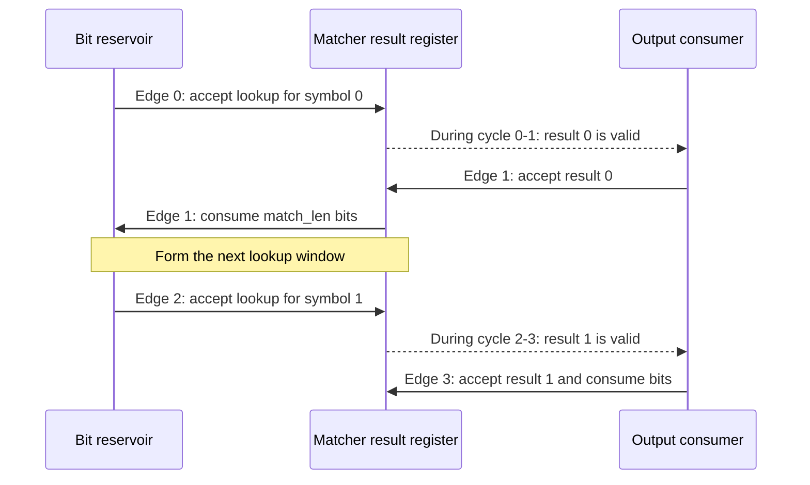

New lookup acceptances occur at edges 0, 2, 4, and so on:

```text
II_top = 2 cycles/symbol
```

At 200 MHz:

```text
steady symbol interval = II * T_clock
                       = 2 cycles/symbol * 5 ns/cycle
                       = 10 ns/symbol

maximum no-stall throughput = 200,000,000 cycles/s / 2 cycles/symbol
                            = 100,000,000 symbols/s
```

From an already-valid reservoir window to `symbol_valid` takes one register
clock. Accepting that symbol and consuming its bits occurs on the following
edge, so window-to-consumption takes two clocks. If latency is measured only
from the lookup-acceptance edge to the output-handshake edge, it is one clock.
Stating the endpoints avoids an apparent contradiction. The feedback dependency
prevents accepting the next lookup on the output edge. Backpressure or missing
input bytes can extend both effective latency and the observed interval.

## 7. Why the reservoir initially needs up to three byte cycles

Before ordinary decoding, the 16-bit lookup window must be available. The first
byte can contribute from one to eight valid bits because `start_bit` may discard
zero through seven leading bits.

Worst case, `start_bit=7`:

```text
after byte 0: 1 valid bit
after byte 1: 1 + 8 = 9 valid bits
after byte 2: 9 + 8 = 17 valid bits
```

Therefore the analytical worst-case initial fill is:

```text
C_fill = ceil((KEY_WIDTH + start_bit) / 8)
       = ceil((16 + start_bit) / 8)

start_bit = 0      -> C_fill = 2 cycles
start_bit = 1..7   -> C_fill = 3 cycles
```

The input stream can continue refilling concurrently with later decoding when
space exists in the 32-bit reservoir. At the worst code length, decoding needs
16 bits every two cycles, or eight bits/cycle, exactly matching the one-byte-per-
cycle input interface when the producer never stalls.

## 8. Complete decode-time estimate

For `N` symbols, initial fill `C_fill`, and initiation interval `II`, the ideal
no-stall schedule is:

```text
C_ideal [cycles] = C_fill + N*II

C_total [cycles] = C_ideal + C_additional_bubbles

T_decode [s]
    = C_total [cycles] / f_clock [cycles/s]
```

The generic pipeline form is `C_first + (N-1)*II`, where `C_first` includes the
latency to the first completion. For this particular controller,
`C_fill + N*II` is equivalent because `C_fill` counts only byte filling and the
first symbol then uses the same two-cycle service interval as every other
symbol.

`C_additional_bubbles` means cycles that actually extend completion beyond the
ideal schedule. Do not blindly add the raw input- and output-stall counters:
they can overlap each other, and an absent input byte can be counted while the
reservoir still has enough bits for useful decoding.

For the measured `N=148,271` symbols including EOB, nonzero `start_bit` so
`C_fill=3`, `II=2`, continuous input, always-ready output, and no error:

```text
C_decode = 3 + 148,271*2
         = 296,545 cycles

T_decode = 296,545 cycles / 200,000,000 cycles/s
         = 0.001482725 s
         = 1.482725 ms
```

This is a core execution estimate. It does not include table/selector
configuration, DMA setup, driver calls, interrupts, cache maintenance, or
software processing of returned symbols.

With `start_bit=0`, the total is one cycle lower:

```text
C_decode = 2 + 148,271*2 = 296,544 cycles
T_decode = 1.482720 ms at 200 MHz
```

If the design achieved only 156.25 MHz while retaining `II=2`:

```text
T_decode = 296,545 cycles / 156,250,000 cycles/s
         = 0.001897888 s
         = 1.898 ms
```

This shows why cycle count and clock frequency must both be stated.

## 9. Stalls change achieved throughput

The top level exposes counters that separate useful scheduling from waiting:

```text
cycle_count
input_stall_cycles
output_stall_cycles
symbols_produced
bits_consumed
```

Given an achieved clock frequency:

```text
measured core time [s] = cycle_count [cycles] / f_clock [cycles/s]

achieved symbol throughput [symbols/s]
    = symbols_produced / measured core time
    = symbols_produced * f_clock / cycle_count
```

An input-stall count means the reservoir could accept a byte but no byte was
offered; it does not necessarily mean decoding stopped that cycle. An output
stall means a symbol is valid but the downstream consumer is not ready and does
block progress. The counters are diagnostic and may overlap, while
`cycle_count` gives the exact busy-cycle total for the run.

## 10. Reset versus per-job initialization

The design uses active-low asynchronous reset syntax:

```systemverilog
always_ff @(posedge clk or negedge rst_n)
```

`rst_n=0` asserts reset without waiting for a clock edge. Normal register updates
occur at `posedge clk` when `rst_n=1`. On physical hardware, asynchronous-reset
deassertion is normally synchronized to avoid recovery/removal timing problems.

Reset and starting a new job are not identical:

| Operation | Purpose |
|---|---|
| Global reset | Put the entire accelerator into a known safe state and invalidate configuration |
| Reservoir `clear` | Empty bit state and load `start_bit` for a new job on a clock edge |
| Top-level `start` | Clear per-job counters/status and enter `busy` if configuration is valid |

Only table validity needs reset; invalid payload bits cannot affect a match.
Job start preserves previously loaded table and selector configuration so it can
be reused when appropriate.

## 11. Pipelining as a timing tradeoff

If comparison plus priority selection cannot settle within five nanoseconds, one
option is to add a register between them:

```text
before: comparison + priority -> result register

after:  comparison -> raw-match register -> priority -> result register
```

This shortens each combinational stage but adds latency and registers. For
independent inputs, a well-designed pipeline can add latency without reducing
throughput. Our next lookup depends on the previous variable-length result, so a
simple extra stage would also lengthen the feedback loop and could change the
top from `II=2` to approximately `II=3`. Keeping high throughput would require a
more sophisticated feedback or speculative design.

Other timing alternatives include a tree priority encoder, fewer shared
comparators over more cycles, a canonical-range decoder, or a lower target
frequency. Each trades timing, area, power, complexity, or throughput.

This lesson analyzes `huffman_find_simple_top.sv`. The separate, more complex
`huffman_find_accel.sv` document discusses a different performance architecture
with different initiation-interval assumptions; its numbers must not be mixed
with this simplified top's `II=2` estimate.

## Key facts to remember

1. `200 MHz` means a five-nanosecond clock period.
2. The combinational path between registers must meet setup and hold checks.
3. Positive setup slack passes; negative setup slack fails the chosen target.
4. Actual timing requires a technology, synthesis, place-and-route, and static
   timing analysis.
5. Latency is time for one request; `II` is spacing between requests; throughput
   is completed work per second.
6. The standalone matcher can support `II=1`, while the current reservoir
   feedback wrapper deliberately has `II=2`.
7. With `II=2` at 200 MHz, the no-stall throughput ceiling is 100 million
   symbols/s.
8. `296,545` cycles at 200 MHz gives the analytical 1.482725 ms core time.
9. Reset, reservoir clear, and job start have different scopes.

## Understanding check

1. What clock period corresponds to 250 MHz? Show the formula and units.
2. If a required period is 5.0 ns and a path takes 6.4 ns, what is its setup
   slack, and does it meet 200 MHz?
3. Why can the standalone matcher support `II=1` while the complete top uses
   `II=2`?
4. For `N=1,000`, `C_fill=3`, `II=2`, and zero stalls, calculate total cycles
   and core time at 200 MHz.
5. Why is the reservoir's per-job `clear` different from the global `rst_n`?

## Lesson 6 answers

### 1. Clock period at 250 MHz

Frequency is the number of clock cycles per second, while period is the time
available for one cycle:

```text
T_clock = 1 / f_clock
        = 1 / (250 x 10^6 cycles/s)
        = 4 x 10^-9 s/cycle
        = 4 ns/cycle
```

Therefore, a 250 MHz clock has a period of **4 ns**.

### 2. Setup slack for a 6.4 ns path

Setup slack is the required arrival time minus the actual path time:

```text
setup slack = required time - actual path time
            = 5.0 ns - 6.4 ns
            = -1.4 ns
```

The negative slack means that the signal arrives 1.4 ns too late, so this path
does **not** meet the 200 MHz target. Ignoring additional timing margins, a
6.4 ns path corresponds to an approximate upper frequency of:

```text
F_max approximately = 1 / 6.4 ns
                    = 156.25 MHz
```

This `F_max` is only an interpretation of the example path delay, not a timing
result for our RTL. A real result requires synthesis, placement, routing, and
static timing analysis for a selected implementation technology.

### 3. Why the matcher can use II=1 but the top currently uses II=2

The standalone matcher has an elastic, one-entry result register:

```systemverilog
lookup_ready = !result_valid || result_ready;
```

If the old result is being accepted (`result_valid && result_ready`), the
matcher may capture a new lookup on that same rising clock edge. It can
therefore accept one independent lookup every cycle when the receiver never
stalls, giving `II=1`.

The complete decoder has a feedback dependency. Its next lookup window depends
on the current symbol's `match_len`:

```text
find current symbol
        -> accept current result
        -> consume match_len bits
        -> expose the next lookup window
        -> find next symbol
```

Our simple top-level controller waits for the result handshake and consumes the
matched bits before issuing the next lookup. Consequently, accepted lookup
requests are two clocks apart, giving `II=2`. This is a property of the current
controller architecture, not a fundamental rule that every Huffman accelerator
must have `II=2`.

### 4. Time for 1,000 symbols

For the current controller's no-stall timing model:

```text
C_total = C_fill + N x II
        = 3 cycles + (1,000 symbols x 2 cycles/symbol)
        = 2,003 cycles
```

At 200 MHz:

```text
T_clock = 1 / (200 x 10^6 cycles/s) = 5 ns/cycle

T_core = C_total x T_clock
       = 2,003 cycles x 5 ns/cycle
       = 10,015 ns
       = 10.015 us
```

Thus the estimate is **2,003 cycles**, or **10.015 microseconds**. It assumes
continuous input availability, an always-ready output receiver, no decoding
errors, and a realized 200 MHz clock. Configuration and software communication
time are not included.

### 5. Reservoir `clear` versus global `rst_n`

`rst_n` is the global hardware reset. It initializes the complete accelerator,
invalidates programmed matcher entries, resets control state, and returns the
design to a known condition. In the current RTL it is active-low, and assertion
is asynchronous.

The reservoir's `clear` is a narrower, synchronous per-job operation. It throws
away buffered bits and resets the reservoir's valid-bit count so a new
compressed stream can begin. It does not invalidate the six programmed Huffman
tables. This separation lets software configure reusable tables and then start
a new decoding job without necessarily reprogramming every table entry.

The short rule is:

```text
rst_n  -> reset the accelerator as a hardware system
clear  -> empty stream-specific reservoir state for a new job
```

---

# Lesson 7: Ready/valid handshakes and backpressure

## 1. Why a handshake is needed

Connected hardware blocks do not always make progress at the same rate. The
matcher may produce a symbol while the output consumer is temporarily busy, or
the input producer may offer a byte while the reservoir is full. A ready/valid
channel lets either side pause without losing or duplicating data.

Every channel has two directions:

- the producer sends `valid` and the payload forward;
- the consumer sends `ready` backward.

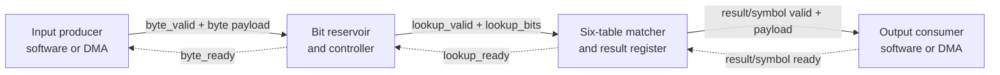

The solid arrows carry work forward. The dotted arrows carry permission
backward. That backward flow is called **backpressure**.

## 2. The one transfer rule

For any ready/valid channel, a transfer occurs at rising edge `k` exactly when:

```text
fire[k] = valid[k] AND ready[k]
```

`fire` is a common informal name for the transfer event; it does not need to be
an actual port. `valid` and `ready` are levels observed immediately before the
rising edge.

| `valid` | `ready` | Transfer at the edge? | Meaning |
|---:|---:|---|---|
| 0 | 0 | No | No item is offered and the consumer is blocked |
| 0 | 1 | No | Consumer is ready, but there is no item |
| 1 | 0 | No | An item is waiting; the channel is stalled |
| 1 | 1 | Yes | Exactly one item transfers |

Two common misunderstandings are therefore:

- `ready=1` alone does not mean that anything transferred;
- `valid=1` alone does not permit the producer to discard the item.

If `valid=1` and `ready=1` remain high for four consecutive rising edges, four
items transfer, one at each edge. `valid` is not required to pulse low between
items.

## 3. Who owns each signal?

Suppose block A produces data and block B receives it:

| Signal | Driven by | Meaning |
|---|---|---|
| `valid` | Producer A | "My payload currently represents a real item" |
| payload | Producer A | The item being offered |
| `ready` | Consumer B | "I can accept an item on this edge" |

In our external symbol channel, the accelerator is the producer:

```text
accelerator -> symbol_valid, symbol, code_length, table_id, symbol_eob
consumer    -> symbol_ready
```

This corrects an easy wording mistake: `symbol_ready` does not tell the next
component whether the accelerator is ready. It is the next component telling
the accelerator whether **it** can accept the current symbol.

## 4. The stability rule during a stall

Once a producer raises `valid`, it must keep both `valid` and every associated
payload field stable until a transfer occurs. Therefore:

```text
valid=1 and ready=0
    -> do not transfer
    -> keep valid asserted
    -> keep the payload unchanged
    -> do not advance transaction-dependent state
```

Consider a registered result containing symbol B and length 4. Signals are
shown immediately before each rising edge:

| Edge | `symbol_valid` | `symbol_ready` | Payload | Transfer? | Result |
|---|---:|---:|---|---|---|
| E10 | 1 | 0 | B, length 4 | No | Hold B and do not consume bits |
| E11 | 1 | 0 | B, length 4 | No | Hold exactly the same item |
| E12 | 1 | 1 | B, length 4 | Yes | Consumer accepts B; consume 4 bits |

Readiness has nothing to do with longest or shortest Huffman matching. By E10,
the match has already been calculated and registered. `symbol_ready=0` only
means that the receiver needs more time before accepting that result.

## 5. How the one-entry matcher result register works

The central equation is in `rtl/huffman_find_simple.sv`:

```systemverilog
assign lookup_ready = !result_valid || result_ready;
```

A new request can enter in either of two cases:

1. `!result_valid`: the output register is empty;
2. `result_ready`: the old result will leave on this edge, so the register can
   be replaced immediately.

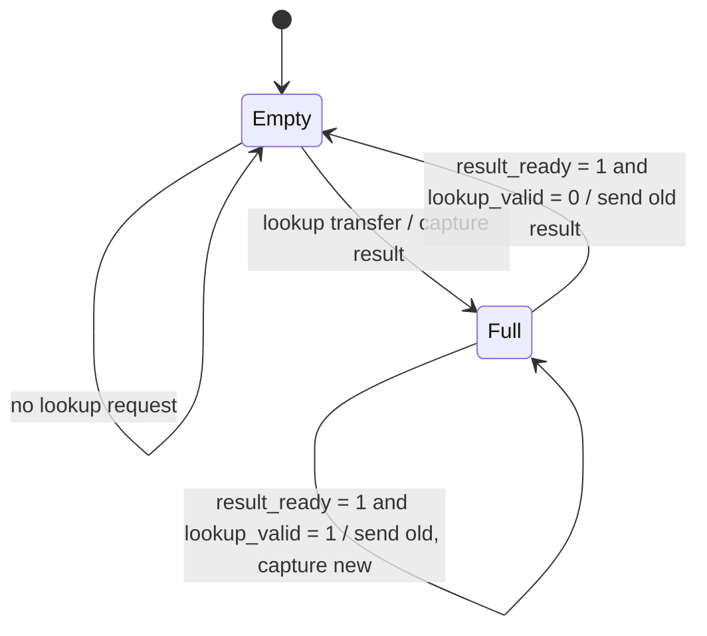

This is an **elastic one-entry buffer**. The important full-and-stalled case is
implemented by deliberately making no assignments to the result registers:

```systemverilog
else if (lookup_ready) begin
    // capture or clear the output register
end
// Otherwise every registered result field retains its value.
```

This holding behavior is why adding the registered output made the simple
matcher substantially safer. Its cost is a small number of flip-flops and one
cycle of latency; its benefit is a stable result that survives an arbitrarily
long downstream stall.

## 6. Ready/valid channels in this accelerator

The simplified design uses the same idea at several boundaries:

| Channel | Producer's offer | Consumer's permission | Payload |
|---|---|---|---|
| Dictionary configuration | `dict_wr_en` | `cfg_ready` | table, address, code, symbol, length |
| Selector configuration | `selector_wr_en` | `cfg_ready` | address and table ID |
| Compressed input | `byte_valid` | `byte_ready` | `byte_data`, `byte_last` |
| Matcher request | `lookup_valid` | `lookup_ready` | `lookup_bits` |
| Matcher result | `result_valid` | `result_ready` | found, symbol, length |
| Decoded output | `symbol_valid` | `symbol_ready` | symbol, length, table ID, EOB |
| Reservoir consume command | `consume_valid` | `consume_ready` | consumed length |

Configuration uses a shared enable/ready convention rather than a completely
independent streaming channel. A write is accepted only when its enable and
`cfg_ready` are high and its bounds checks pass.

For the input byte channel, the reservoir defines:

```systemverilog
byte_fire = byte_valid && byte_ready;
```

Only on `byte_fire` may the reservoir append `byte_data` or remember
`byte_last`. If `byte_last=1` while the channel is stalled, the producer must
keep `byte_valid`, `byte_data`, and `byte_last` stable until acceptance.

## 7. The complete output transaction

At the external boundary, the symbol transfer condition is conceptually:

```text
symbol_fire = symbol_valid AND symbol_ready
```

The top level also has to prove that the reservoir can remove the matched
number of bits. Its RTL therefore uses:

```systemverilog
reservoir_consume_valid = symbol_valid && symbol_ready;
output_fire = reservoir_consume_valid && reservoir_consume_ready;
```

`reservoir_consume_valid` is the valid signal for a separate internal consume
command. It is asserted only after the external consumer agrees to take the
symbol. For a legal emitted symbol, `match_len` is nonzero and no greater than
the reservoir's valid-bit count, so `reservoir_consume_ready=1`. Under that
invariant:

```text
output_fire = symbol_valid AND symbol_ready
```

The following state changes only when `output_fire=1`:

- the reservoir removes `match_len` bits;
- `bits_consumed` increases by `match_len`;
- `symbols_produced` increases by one;
- the 50-symbol selector-group counter advances;
- the selector may advance to the next table; and
- an accepted EOB may finish the job.

This is why EOB detection alone must not assert `done`. If an EOB is presented
while `symbol_ready=0`, the consumer has not received it yet. The accelerator
holds the EOB stable and finishes only on its handshake.

## 8. Peek, consume, and backpressure together

Suppose the reservoir contains 21 valid bits and the registered match has
`match_len=4`:

```text
Before acceptance: valid bits = 21
During a stall:     valid bits = 21
After acceptance:  valid bits = 21 bits - 4 bits = 17 bits
```

No matter how many cycles `symbol_ready` remains zero, the reservoir must not
move. Once the output fires, the matched prefix is consumed exactly once.

Backpressure can propagate all the way to the input:

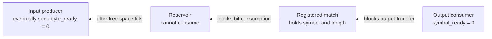

The reservoir may still accept a few input bytes while it has free space. Once
it can no longer fit another byte, it lowers `byte_ready`, and the upstream
producer must hold its next byte. Buffering delays backpressure; it does not
remove the need for it.

## 9. No-match is still a valid transaction

In the matcher, `result_valid=1` means, "the result register contains the
answer to an accepted lookup." It does not mean that a code was found.

```text
result_valid=1, match_found=1 -> valid lookup result containing a symbol
result_valid=1, match_found=0 -> valid lookup result reporting no match
```

The top level accepts a no-match result internally and reports an error. Keeping
transaction validity separate from semantic success prevents a no-match result
from looking like "the matcher has not answered yet."

## 10. Why the table selection must remain stable

The six-table wrapper routes `result_ready` and the output mux using
`active_table`. Therefore, the selected table must remain unchanged from an
accepted lookup until its result is accepted. If it changed during a stall, the
pending result could be hidden behind another bank and the old bank would not
receive its ready signal.

Our top level satisfies this contract: it updates the selector index only in
the `output_fire` branch. Thus the table cannot change while its symbol is
stalled. A more general reusable wrapper could instead register the table ID
alongside each accepted request.

## 11. Counting transfers and stalls

Across `C` observed clock cycles, the number of transfers is:

```text
N_transfers = sum from k=0 to C-1 of (valid[k] AND ready[k])
```

The number of output-stall cycles is:

```text
N_output_stall = sum from k=0 to C-1 of
                 (symbol_valid[k] AND NOT symbol_ready[k])
```

This second equation is exactly the event counted by `output_stall_cycles` in
the top-level RTL. Given an observed busy-cycle count, effective symbol rate is:

```text
effective rate [symbols/s]
    = symbols_produced [symbols]
      x f_clock [cycles/s]
      / cycle_count [cycles]
```

For example, 100 accepted symbols over 250 cycles at 200 MHz gives:

```text
effective rate = 100 symbols x 200,000,000 cycles/s / 250 cycles
               = 80,000,000 symbols/s
```

Input and output stalls can overlap with each other or with useful buffered
work. Therefore, use `cycle_count` for exact observed core time rather than
blindly adding every stall counter to an ideal-cycle estimate.

## 12. Common handshake mistakes

1. Pulsing `valid` for one cycle and dropping it when `ready=0` loses data.
2. Changing the payload while `valid=1 && ready=0` corrupts the waiting item.
3. Treating `ready=1` alone as a transfer invents data that was never offered.
4. Advancing counters when only `valid` is high can count the same stalled item
   repeatedly.
5. If a producer waits for `ready` before asserting `valid`, while a consumer
   waits for `valid` before asserting `ready`, both sides can deadlock.
6. Combinational paths between ready and valid must not form a loop across
   connected modules; such loops are both a timing and simulation problem.

## 13. Lesson 7 key facts

1. A transfer occurs only at a rising edge with `valid && ready`.
2. The producer owns `valid` and payload; the consumer owns `ready`.
3. A stalled producer holds its valid payload stable for as long as necessary.
4. Both signals may stay high, producing one transfer on every clock edge.
5. Backpressure travels opposite the direction of the data.
6. Registered output state prevents a slow receiver from losing a match.
7. Huffman bits are consumed only when the corresponding symbol is accepted.
8. EOB finishes the job on acceptance, not merely on detection.
9. `result_valid` says an answer exists; `match_found` says what kind of answer
   it is.
10. Selector state must not change while the selected bank's result is stalled.

## Understanding check

1. For each pair `valid/ready = 00, 01, 10, 11`, state whether a transfer
   occurs and describe what the producer must do in the `10` case.
2. A producer presents symbol A with `valid=1`. The consumer has `ready=0` for
   two edges and then raises it for the third edge. How many times is A
   transferred, and when may the producer change the payload?
3. The reservoir has 28 valid bits. On one edge, an accepted symbol consumes 8
   bits while an input-byte handshake appends 8 bits. What is the new bit count,
   and why can both operations happen on the same edge?
4. Why can `result_valid=1` together with `match_found=0` be a meaningful
   response rather than a contradiction?
5. An EOB result is valid, but `symbol_ready=0`. Should `busy`, `done`, the
   reservoir position, and the EOB payload change? Explain what happens when
   `symbol_ready` becomes 1.
