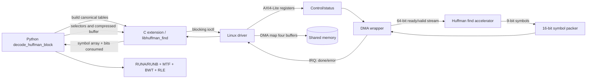
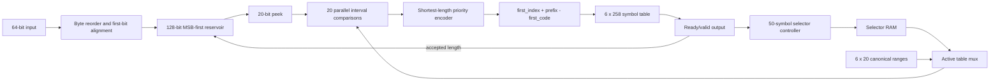

# `HuffmanTable.find_next_symbol` Hardware Accelerator

Status: selected version-1 component and integration specification. The active
RTL is `rtl/huffman_find_accel.sv`; `PROPOSED_ACCELERATOR.md` is retained only
as a possible later expansion to a complete bzip2 block decoder.

## Decision and scope

Version 1 accelerates the repeated bzip2 call:

```python
r = table.find_next_symbol(bitfield, False)
```

The hardware accepts all canonical tables and selectors for one bzip2 block,
an MSB-first compressed byte stream beginning at an arbitrary bit offset, and
an end-of-block symbol. It emits 9-bit decoded symbols until it emits the EOB
symbol, then reports the exact number of compressed bits consumed.

The following operations remain in software:

- stream and block-header parsing;
- in-use map, selector, and code-length parsing;
- canonical-table construction and validation;
- RUNA/RUNB expansion, data move-to-front, inverse BWT, and final RLE; and
- output MD5 checking.

The first version intentionally supports the bzip2 `reversed=False` path only.
The gzip path uses reversed DEFLATE codes and is outside this benchmark and
outside version 1.

## Why this is a good candidate

The reproducible full-run profile attributes 12.11% of benchmark samples
directly (self/exclusive) to `find_next_symbol` and 38.71% inclusively to its
complete call subtree. The
inclusive value includes its repeated `snoopbits` and `readbits` calls. Using
the measured 662.237 ms mean:

```text
T_self      = 662.237 ms * (4,604 / 38,010) = 80.21 ms
T_inclusive = 662.237 ms * (14,713 / 38,010) = 256.34 ms
T_children  = 256.34 ms - 80.21 ms = 176.13 ms
```

The timing source is `../../results/pyflate/original/original results full
run/timing.json`; profile counts come from the adjacent `speedscope.folded`.
The denominator contains the `py::bench_pyflake` frame, inclusive samples
contain `find_next_symbol`, and self samples have it as the deepest Python
frame.

The matcher by itself maps most directly to the 80.21 ms self time. This
accelerator also implements the bit reservoir, peek, and consumption operations
and processes a whole batch, so 256.34 ms is the intended but optimistic
removable scope. It is not an achieved saving, and the inclusive percentages of
parent and child functions must never be summed.

The function performs a large number of small, regular integer comparisons,
shifts, masks, and table accesses. The benchmark invokes it 148,271 times for
one block. Hardware can compare all legal code lengths in parallel and replace
Python object traversal and method calls with fixed-width combinational logic.

It is also a more practical first RTL component than inverse BWT: its canonical
tables require only about 18.5 Kbit, while inverse BWT needs megabytes of
random-access L/T storage. The main limitation is Amdahl's law: accelerating
this function alone cannot remove the remaining 61.63% of runtime.

## System integration



One ioctl is issued per bzip2 block, not per symbol. A per-symbol MMIO design
would require 148,271 submissions for this input and would be slower than the
software function.

### Buffers and DMA

The driver maps four immutable/non-overlapping regions for one job:

| Region | Direction | Format |
|---|---|---|
| Source | device reads | Compressed bytes, beginning at `floor(bit_position/8)` |
| Tables | device reads | Up to six `struct huffman_find_table` records |
| Selectors | device reads | One unsigned byte per table selector |
| Destination | device writes | Little-endian `uint16_t` symbols; bits 8:0 valid |

Source byte lane zero is bits 7:0 of the first stream beat. Bits within each
byte are decoded most-significant first. The final source beat uses byte-valid
strobes. The output includes the EOB symbol so software can validate the
termination condition.

The DMA wrapper is expected to use a 128-bit system-memory master even though
the reusable core exposes a 64-bit input stream. Width conversion, symbol
packing, burst generation, 4-KiB boundary handling, and AXI error recovery live
outside `huffman_find_accel`.

Persistent DMA mappings should be created before the benchmark timer and reused
for all pyperf loops. Submission, DMA, decoding, completion, and output
visibility remain inside the timed loop.

### Cache coherency and ordering

The Linux driver must use `dma_map_sg` or coherent allocations rather than CPU
physical addresses. Before START it synchronizes source/table/selector buffers
for the device and executes a write barrier after programming registers. After
completion it synchronizes the symbol buffer for the CPU. On an IOMMU system,
MMIO receives I/O virtual addresses. Mappings are released only after accepted
DMA transactions have drained.

## Software-visible API

The fixed-width ioctl ABI is defined in `sw/huffman_find_uapi.h`. The initial
operation is blocking:

```c
int huffman_find_decode(
    struct huffman_find_context *ctx,
    const uint8_t *compressed,
    uint32_t compressed_bytes,
    uint8_t start_bit,
    const struct huffman_find_table *tables,
    uint8_t table_count,
    const uint8_t *selectors,
    uint32_t selector_count,
    uint16_t eob_symbol,
    uint16_t *symbols,
    uint32_t symbol_capacity,
    struct huffman_find_result *result);
```

The Python extension should expose:

```python
result = decoder.decode_into(
    compressed=compressed_view,
    start_bit=absolute_bit_position,
    tables=canonical_tables,
    selectors=selectors_list,
    eob_symbol=symbols_in_use - 1,
    output=symbol_buffer,
)
# result.symbols_produced, result.bits_consumed, result.cycles
```

The extension converts `absolute_bit_position` to a byte address and a 0-to-7
bit offset. It releases the GIL while waiting for the ioctl and raises an
exception containing both `errno` and the hardware error code on failure.

## Required pyflate changes

The original suite remains unchanged as the golden reference. A hardware
backend in the optimized suite changes the main block loop as follows:

1. Keep the compressed file in an immutable byte buffer rather than relying
   only on the current file descriptor position.
2. Extend `RBitfield` with an absolute logical bit position and an efficient
   `advance_bits(n)` operation. File position alone is incorrect because the
   bitfield may already have prefetched unread bits.
3. After `compute_tables`, convert each table to canonical ranges and a `perm`
   array.
4. Submit the source position, tables, complete selector list, and EOB symbol
   once to hardware.
5. Advance the software bitfield by the returned `bits_consumed`.
6. Feed the returned symbol array through the existing RUNA/RUNB and MTF loop.
   The software no longer switches tables every 50 symbols; hardware already
   used the selector sequence to produce the symbols.

Conceptually:

```python
start = bitfield.absolute_tellbits()
canonical = [to_canonical_descriptor(t) for t in tables]
result = accelerator.decode(
    compressed, start, canonical, selectors_list, symbols_in_use - 1
)
bitfield.advance_bits(result.bits_consumed)

for r in result.symbols:              # includes EOB
    if 0 <= r <= 1:
        update_runa_runb(r)
    elif r == symbols_in_use - 1:
        break
    else:
        flush_pending_run()
        update_data_mtf_and_buffer(r)
```

Backend selection should use
`PYFLATE_HUFFMAN_BACKEND=software|hardware|auto`. Published accelerator results
must use `hardware`; `auto` is convenient for development but could silently
fall back and invalidate a claimed speedup.

## Canonical representation and equation

For every table and code length `L` from 1 through 20, software supplies:

- `count[L]`: number of codes of length L;
- `first_code[L]`: numerically smallest canonical code of length L;
- `first_index[L]`: index of that first code in `perm`; and
- `perm[]`: decoded symbols in canonical-code order.

Let `P_L` be the next L compressed bits interpreted as an unsigned MSB-first
integer. Length L matches when:

```text
count[L] > 0
and first_code[L] <= P_L < first_code[L] + count[L]
```

The permutation index and result are:

```text
index  = first_index[L] + P_L - first_code[L]
symbol = perm[index]
```

Hardware tests all 20 lengths in parallel and selects the shortest match. It
then shifts the reservoir left by L and subtracts L from its valid-bit count.

### Small example

Suppose the canonical alphabet is:

| Symbol | Length | Canonical code |
|---|---:|---:|
| A | 2 | `00` |
| B | 2 | `01` |
| C | 3 | `100` |
| D | 3 | `101` |
| E | 3 | `110` |
| F | 3 | `111` |

The descriptors are:

```text
count[2]=2, first_code[2]=0, first_index[2]=0
count[3]=4, first_code[3]=4, first_index[3]=2
perm=[A, B, C, D, E, F]
```

For input `101011...`:

```text
P_2 = binary 10 = 2;  0 <= 2 < 2 is false
P_3 = binary 101 = 5; 4 <= 5 < 8 is true
index = 2 + 5 - 4 = 3
symbol = perm[3] = D
```

The accelerator emits D and consumes 3 bits. At 200 MHz, those combinational
tests and the state update occupy one 5 ns cycle in the performance build.

## RTL interfaces

`rtl/huffman_find_accel.sv` is bus-independent and synthesizable. Its interface
has four groups.

### Configuration ports

| Payload | Width | Meaning |
|---|---:|---|
| Table ID | 3 bits | One of 2-to-6 bzip2 groups |
| Code length | 5 bits | 1 through 20 |
| First code | 20 bits | Right-aligned canonical value |
| First permutation index | 9 bits | 0 through 257 |
| Count | 9 bits | 0 through 258 |
| Permutation index/symbol | 9/9 bits | Canonical index to decoded symbol |
| Selector index/table | 15/3 bits | Table selected for each 50-symbol group |

Configuration writes are accepted only while idle. The DMA wrapper must write
all 20 ranges for every used table, including zero-count lengths, because table
RAM is not bulk-cleared on reset.

### Job-control ports

`start_i` snapshots `start_bit_i`, `table_count_i`, `selector_count_i`,
`eob_symbol_i`, and `symbols_max_i`. `busy_o` remains asserted until EOB or an
error. `done_o` pulses for one clock on either outcome. `error_o` and
`error_code_o` remain available until the next start.

### Compressed input

The input is a 64-bit `valid/ready/data/keep/last` stream. `keep` must be a
nonzero contiguous mask from byte lane zero. A 128-bit, left-aligned reservoir
permits simultaneous symbol consumption and beat insertion without overflow.

### Symbol output

The output is a backpressure-safe channel containing:

| Signal | Width | Meaning |
|---|---:|---|
| `m_symbol_o` | 9 bits | Decoded symbol, 0 through 257 |
| `m_code_length_o` | 5 bits | Number of compressed bits consumed |
| `m_table_o` | 3 bits | Huffman table used, useful for checking |
| `m_eob_o` | 1 bit | Symbol equals configured EOB |

The output remains stable while `valid=1` and `ready=0`. State, selector count,
bit consumption, and result counters advance only on a completed handshake.

## Datapath and control



The control logic tracks:

- first input beat and its initial bit offset;
- valid reservoir bits and whether the last source beat arrived;
- active selector index and position 0 through 49 within its group;
- total decoded symbols and consumed bits;
- output-capacity, invalid-selector, no-match, truncated-input, and malformed
  byte-keep conditions; and
- normal completion only after the EOB record is accepted downstream.

## MMIO register interface

The production wrapper uses a 32-bit little-endian AXI4-Lite slave at 200 MHz.
The canonical offsets are in `rtl/huffman_find_pkg.sv`.

| Offset | Register | Purpose |
|---:|---|---|
| `0x000` | ID | `0x4846494e`, ASCII `HFIN` |
| `0x004` | VERSION | Initially 1.0 |
| `0x00c` | CONTROL | START, ABORT, SOFT_RESET write-one pulses |
| `0x010` | STATUS | BUSY, DONE, ERROR, IRQ_PENDING |
| `0x014` | ERROR_CODE | First retained hardware error |
| `0x020`–`0x028` | SRC | 64-bit IOVA and byte length |
| `0x02c` | START_BIT | Bits 2:0, zero means first-byte MSB |
| `0x030`–`0x034` | TABLE_ADDR | Canonical table IOVA |
| `0x038`–`0x040` | SELECTORS | Selector IOVA and count |
| `0x044` | TABLE_COUNT | 2 through 6 |
| `0x048` | EOB_SYMBOL | 9-bit end symbol |
| `0x050`–`0x058` | DST | Symbol-buffer IOVA and capacity |
| `0x060` | BITS_CONSUMED | Bits after `START_BIT` through EOB |
| `0x064` | SYMBOLS_PRODUCED | Includes EOB |
| `0x068`–`0x06c` | CYCLE_COUNT | 64-bit active cycles |
| `0x070`–`0x074` | STALLS | Input and output stall cycles |

START atomically snapshots configuration. Writes during BUSY do not change the
active job. ABORT stops new DMA requests, drains accepted responses, and then
reports `HFIN_ERR_ABORTED`. DONE and ERROR are sticky in the wrapper until
acknowledged. The core itself emits a one-cycle `done_o` pulse.

## Driver behavior

The Linux platform driver binds to `hwswcodesign,huffman-find-1.0`, exposes
`/dev/huffman_find0`, and serializes the single hardware context with a mutex.
For each ioctl it validates fixed-width fields and overflow, pins/maps all four
buffers, programs MMIO, starts the engine, sleeps on a completion interrupt,
handles a timeout with ABORT, synchronizes output for the CPU, and returns
counters. PCIe can use the same register and ioctl contracts with BAR0 MMIO.

The driver must reject:

- table counts outside 2 through 6;
- start offsets outside 0 through 7;
- selectors that name an absent table;
- malformed or oversubscribed canonical tables;
- EOB values or permutation entries above 257;
- output capacities whose byte multiplication overflows; and
- overlapping or inaccessible user buffers.

## Frequency, latency, and throughput

The target constraint is:

```tcl
create_clock -name core_clk -period 5.000 [get_ports clk_i]
```

The performance build targets an initiation interval of one accepted symbol per
cycle. For the measured `N=148,271` symbols:

```text
T_core = N symbols / (200,000,000 cycles/s / 1 cycle/symbol)
       = 0.000741355 s
       = 0.741 ms
```

The destination contains `148,271 * 2 = 296,542 bytes`. A 128-bit DMA needs at
least:

```text
ceil(296,542 bytes / 16 bytes/beat) = 18,534 beats
18,534 beats / 200 MHz = 92.67 us
```

Configuration loading is about 4,634 records for this block: 120 ranges, 1,548
permutation entries, and 2,966 selectors. At one record/cycle it costs about
23.17 us. These transfers can partly overlap source filling but not table use.

An estimated hardware time of 1.0-1.8 ms, plus driver/interrupt overhead, aims
to replace up to the 256.34 ms inclusive subtree. The directly attributed lower
scope is 80.21 ms; only an end-to-end implementation can determine how much of
the child time is actually removed.

## Expected end-to-end speedup

Amdahl's law with accelerated fraction `f` and component speedup `S` is:

```text
Speedup_total = 1 / ((1-f) + f/S)
```

Examples:

```text
At S=10:
Speedup = 1 / (0.612918 + 0.387082/10)
        = 1 / 0.651626
        = 1.53x

At S=50:
Speedup = 1 / (0.612918 + 0.387082/50)
        = 1 / 0.620660
        = 1.61x

Perfect accelerator:
Speedup_max = 1 / (1-0.387082) = 1.63x
```

Those examples use the optimistic inclusive boundary because the design
contains its own bit reservoir. A conservative self-only bound uses
`f=0.121126`:

```text
With T_accel = 1.482725 ms:
S_component,self = 80.21 / 1.482725 = 54.10x
Speedup_total,self = 1 / (0.878874 + 0.121126/54.10) = 1.135x
Speedup_max,self = 1 / (1-0.121126) = 1.138x
```

Using the explicit time model and 1.0 ms accelerator time:

```text
T_new = T_other + T_accel + T_communication
      = 405.90 ms + 1.00 ms + T_communication
```

With 0.10 ms SoC submission/completion overhead, `T_new=407.00 ms` and the
projection is `662.237/407.00=1.63x`. With 1.0 ms communication overhead it is
`407.90 ms`, still 1.62x. These are estimates, not measurements.

Against the current optimized mean of 436.035 ms, its profile places 40.28%
inside `find_next_symbol`, approximately 175.65 ms. The corresponding perfect
limit is `1/(1-0.4028)=1.67x`; about 261–263 ms is a reasonable first projection
after replacing that subtree. The hardware benchmark must measure this rather
than combining estimates from separate release/debug runs.

## Area and power tradeoffs

Canonical table state, excluding selectors, is approximately:

```text
ranges = 6 tables * 20 lengths * (20 + 9 + 9) bits = 4,560 bits
perm   = 6 tables * 258 symbols * 9 bits            = 13,932 bits
total                                                   18,492 bits
```

The maximum selector RAM is `32,768 * 3 = 98,304 bits`. The reservoir is 128
bits. Exact LUT/FF/BRAM counts require synthesis for a named FPGA.

| Choice | Performance | Area | Dynamic power |
|---|---|---|---|
| 20 parallel range comparisons | One-symbol/cycle target | More comparators, priority logic, routing | Highest decoder switching |
| Iterative length search | 1–20 cycles/symbol | Much smaller | Lower per cycle but active longer |
| Asynchronous LUTRAM/register `perm` | Supports one-cycle result | About 13.9 Kbit plus muxing | Moderate/high |
| Synchronous BRAM `perm` | Adds lookup cycle; simple II≈2 design | Fewer LUTs | Lower logic power |
| 32,768-entry selector RAM | Accepts full 15-bit field | About 98.3 Kbit | Low because one read per 50 symbols |
| 128-bit reservoir | Fewer input stalls | 128 FF plus barrel shift | Small relative to comparator network |

The provided RTL is the performance architecture: parallel comparisons and an
asynchronously indexed permutation array. If post-route timing misses 200 MHz,
the first fallback is a registered/synchronous permutation lookup with an
initiation interval near two cycles. Even `148,271*2/200 MHz = 1.483 ms` remains
far below the estimated 256.34 ms software subtree.

Clock enables should prevent table configuration arrays and selector memory
from toggling during decode. The accelerator is active for roughly 1–2 ms per
benchmark iteration, so energy per job is more informative than peak watts:

```text
Energy_job [joules] = average_active_power [watts] * active_time [seconds]
```

For example, if post-route analysis reports 0.40 W dynamic power for 1.5 ms:

```text
E = 0.40 J/s * 0.0015 s = 0.0006 J = 0.60 mJ
```

That numerical power is illustrative only; it is not a claim about the RTL.

## Verification and acceptance

Verification must compare hardware symbols and bit consumption with the
original function for every call sequence. Required cases include:

1. All legal lengths 1 through 20 and codes crossing every input-byte boundary.
2. The six-symbol worked example above.
3. Dynamic tables extracted from the benchmark block: exactly 148,271 output
   symbols including EOB and 2,966 selectors.
4. Selector changes at symbols 0, 50, 100, and the last partial group.
5. Random output backpressure while asserting that output remains stable.
6. Partial final input beats and start offsets 0 through 7.
7. Invalid keep masks, selectors, tables, missing EOB, truncated input, and
   symbol-output overflow.
8. The existing complete decoder after consuming the returned symbols must
   still produce 399,360 bytes and MD5 `afa004a630fe072901b1d9628b960974`.

RTL simulation, lint, post-route timing, area, and activity-based power reports
are still required. No SystemVerilog simulator is installed in the present
workspace, so the RTL has not yet been compiled; this must be recorded rather
than treating source inspection as verification.
