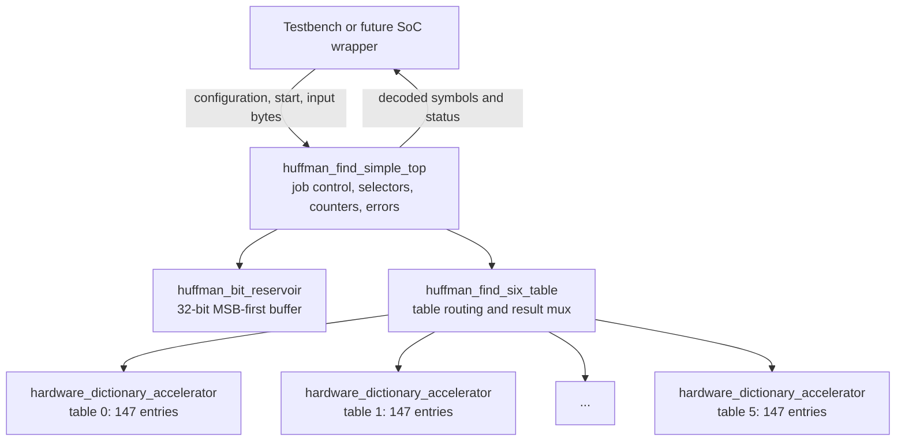
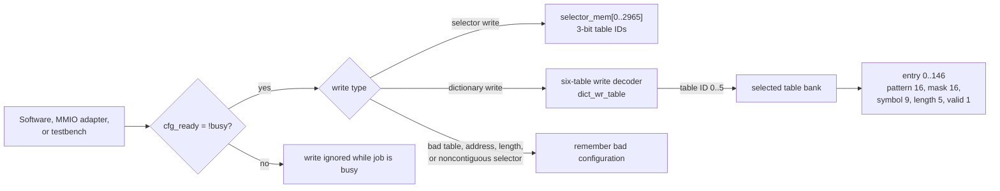
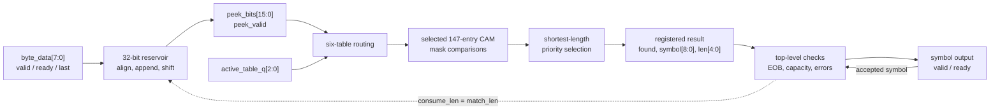
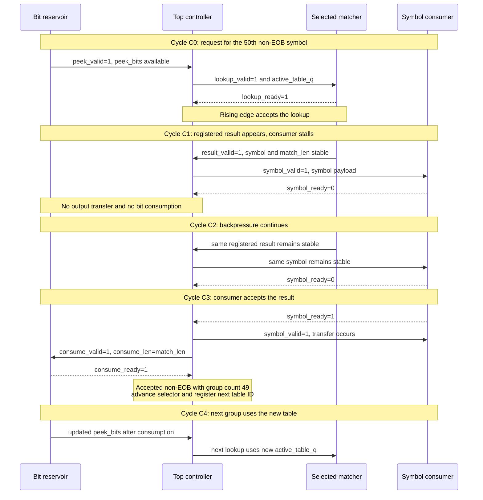

# Guide to the single-file simplified Huffman accelerator

This guide explains the proof-of-concept SystemVerilog file:

[`rtl/huffman_find_simple_complete.sv`](rtl/huffman_find_simple_complete.sv)

The combined file preserves the same four modules and the same division of
responsibilities as the split design. It does **not** flatten everything into
one giant module. Putting several module definitions in one `.sv` source file
is legal SystemVerilog and is useful here because the whole hardware idea can
be opened, read, and submitted as one artifact.

The synthesis or simulation top-level name remains:

```text
huffman_find_simple_top
```

> **Important compilation rule:** compile
> `huffman_find_simple_complete.sv` **instead of** the four split source files,
> never alongside them. The combined and split sources define the same module
> names, so compiling both sets would produce duplicate-module-definition
> errors.

Use exactly one of these source sets:

| Build choice | SystemVerilog sources |
|---|---|
| Combined proof-of-concept | `huffman_find_simple_complete.sv` |
| Original split organization | `huffman_find_simple.sv`, `huffman_find_six_table.sv`, `huffman_bit_reservoir.sv`, and `huffman_find_simple_top.sv` |

## 1. What is inside the combined file?

The file contains four module definitions:

1. `hardware_dictionary_accelerator` stores and searches **one** Huffman table.
2. `huffman_find_six_table` creates six table matchers and routes a lookup to
   the currently selected table.
3. `huffman_bit_reservoir` converts incoming bytes into an MSB-first bit stream
   and presents the next 16 bits for matching.
4. `huffman_find_simple_top` connects the complete datapath, stores selectors,
   detects EOB and errors, implements job control, and maintains counters.

The first three modules are submodules. `huffman_find_simple_top` is the module
that an external testbench, SoC wrapper, or future MMIO/DMA wrapper instantiates.

### Diagram 1 — preserved module hierarchy



This hierarchy is functionally the same as the four split files. File
boundaries are an organization choice; they do not create clock cycles or
hardware by themselves.

## 2. Default design size and specialization

The defaults deliberately specialize the accelerator for the measured
`pyflate` benchmark:

| Parameter or resource | Default | Meaning |
|---|---:|---|
| `NUM_TABLES` | 6 | Six bzip2 Huffman tables are simultaneously resident |
| `NUM_ENTRIES` | 147 | Maximum alphabet/table size measured for this workload |
| `KEY_WIDTH` | 16 bits | Width of the MSB-first lookup window |
| `SYMBOL_WIDTH` | 9 bits | Can represent symbol values 0 through 511 |
| `MAX_SELECTORS` | 2,966 | Maximum selector entries measured for the workload |
| Reservoir size | 32 bits | Holds incoming bits and permits byte refill plus consumption |
| Input stream width | 8 bits | One compressed byte per accepted input transfer |
| Target clock | 200 MHz | A 5 ns target, not a measured achieved frequency |

`147` is the number of distinct entries in each table, not the number of
symbols in the compressed job. The same entries can be used repeatedly to
decode many thousands of symbol occurrences.

The target period follows from:

\[
T_{clock}=\frac{1}{f_{clock}}
=\frac{1}{200\times10^6\ \text{cycles/s}}
=5\ \text{ns/cycle}
\]

No synthesis or static timing result is implied by this target. The CAM
comparison and shortest-match priority logic must still be synthesized and
timed for a chosen FPGA or ASIC technology.

## 3. External interface of the top module

The complete external interface is grouped by responsibility below. Widths
are the default widths after evaluating the parameters.

### Clock and reset

| Signal | Direction | Width | Purpose |
|---|---|---:|---|
| `clk` | input | 1 | Clock for all sequential state |
| `rst_n` | input | 1 | Active-low reset; assertion may be asynchronous, but system integration should synchronize its deassertion to `clk` |

### Huffman-table configuration

| Signal | Direction | Width | Purpose |
|---|---|---:|---|
| `cfg_ready` | output | 1 | High only while no job is active; configuration writes are accepted in this state |
| `dict_wr_en` | input | 1 | Requests one dictionary-entry write |
| `dict_wr_table` | input | 3 | Chooses table 0 through 5 |
| `dict_wr_addr` | input | 8 | Chooses entry 0 through 146; unused binary values are rejected |
| `dict_wr_code` | input | 16 | Right-aligned Huffman code supplied by software |
| `dict_wr_symbol` | input | 9 | Decoded symbol associated with the code |
| `dict_wr_len` | input | 5 | Code length; zero invalidates the addressed entry |

For a nonzero valid length, one table matcher converts the right-aligned code
to an MSB-aligned pattern and mask:

\[
pattern = (code \bmod 2^{length}) \ll (KEY\_WIDTH-length)
\]

\[
mask = (2^{length}-1) \ll (KEY\_WIDTH-length)
\]

For example, code `101` with length 3 and `KEY_WIDTH=16` becomes:

```text
pattern = 1010000000000000
mask    = 1110000000000000
```

### Selector configuration

| Signal | Direction | Width | Purpose |
|---|---|---:|---|
| `selector_wr_en` | input | 1 | Requests one selector-memory write |
| `selector_wr_addr` | input | 12 | Selects one of 2,966 selector positions |
| `selector_wr_table` | input | 3 | Stores a table ID from 0 through 5 |

New selector entries must be written in contiguous ascending order. Rewriting
an already loaded position is allowed. The top records how many contiguous
entries have been loaded so it can reject an incomplete selector sequence at
`start`.

### Job inputs

| Signal | Direction | Width | Purpose |
|---|---|---:|---|
| `start` | input | 1 | One-cycle request to begin one Huffman payload |
| `start_bit` | input | 3 | Number of leading bits, 0 through 7, to discard from the first input byte |
| `selector_count` | input | 12 | Number of configured selector entries used by this job |
| `eob_symbol` | input | 9 | Symbol value that terminates the Huffman payload |
| `symbol_capacity` | input | 32 | Maximum number of symbols permitted in the output job |

### Compressed-byte input stream

| Signal | Direction | Width | Purpose |
|---|---|---:|---|
| `byte_valid` | input | 1 | Producer is presenting a valid byte |
| `byte_ready` | output | 1 | Reservoir has room to accept that byte |
| `byte_data` | input | 8 | Compressed data, interpreted MSB first |
| `byte_last` | input | 1 | Marks the final byte of the payload |

### Decoded-symbol output stream

| Signal | Direction | Width | Purpose |
|---|---|---:|---|
| `symbol_valid` | output | 1 | A registered decoded symbol is available |
| `symbol_ready` | input | 1 | Consumer can accept the symbol |
| `symbol` | output | 9 | Decoded symbol value |
| `code_length` | output | 5 | Number of compressed bits used by this symbol |
| `table_id` | output | 3 | Huffman table that decoded this symbol |
| `symbol_eob` | output | 1 | Current valid symbol equals the configured EOB symbol |

### Job status and counters

| Signal | Direction | Width | Purpose |
|---|---|---:|---|
| `busy` | output | 1 | A job is active |
| `done` | output | 1 | One-cycle completion pulse, for success or error |
| `error` | output | 1 | Completion was caused by an error |
| `error_code` | output | 8 | Encoded error reason |
| `bits_consumed` | output | 32 | Sum of accepted Huffman code lengths |
| `symbols_produced` | output | 32 | Number of accepted output symbols, including EOB |
| `cycle_count` | output | 64 | Active-job clock cycles |
| `input_stall_cycles` | output | 32 | Cycles when a byte could be accepted but was not valid |
| `output_stall_cycles` | output | 32 | Cycles when a symbol was valid but the consumer was not ready |

## 4. How table and selector configuration travel through the design

Configuration is intentionally bus-independent. A testbench can drive the
configuration ports directly. In a real SoC, an MMIO register adapter could
translate software register writes into the same one-cycle pulses.

Dictionary writes first pass through the top-level `cfg_ready` gate. The
six-table wrapper decodes `dict_wr_table`, so only one of the six matchers sees
`dict_wr_en`. That matcher stores the pattern, mask, decoded symbol, length, and
valid state at `dict_wr_addr`.

Selector writes go to selector memory in the top module rather than to the
matcher banks. A selector value tells the controller which table to use for a
group of 50 accepted non-EOB symbols.

### Diagram 2 — configuration flow



All six tables should be completely rewritten for a new configuration. Slots
not used by a shorter table should be invalidated with `dict_wr_len=0`; this
prevents stale valid entries from a previous job from participating in CAM
matching.

## 5. One-table matcher

`hardware_dictionary_accelerator` is the computation core for one table. Its
storage arrays are:

| Internal object | Default shape | Meaning |
|---|---:|---|
| `pattern_mem` | 147 × 16 bits | MSB-aligned code patterns |
| `mask_mem` | 147 × 16 bits | Selects meaningful leading bits |
| `symbol_mem` | 147 × 9 bits | Decoded symbol for each entry |
| `len_mem` | 147 × 5 bits | Code length for each entry |
| `valid_mem` | 147 bits | Indicates which entries may match |
| `raw_matches` | 147 combinational bits | One comparison result per entry |

Every valid entry is checked conceptually in parallel:

\[
raw\_match_i = valid_i \land
((lookup\_bits \land mask_i)=pattern_i)
\]

The priority logic searches by code length from 1 through 16 and then by entry
index. It therefore chooses the shortest match, with the lowest entry address
as a deterministic tie-breaker. A legal Huffman table is prefix-free, so it
normally produces exactly one match.

The selected result enters a one-entry output register. A lookup can be
accepted when that register is empty or its current result is being accepted:

\[
lookup\_ready = \neg result\_valid \lor result\_ready
\]

## 6. Six-table wrapper

`huffman_find_six_table` instantiates six copies of the one-table matcher.
Only the matcher selected by `active_table` receives `lookup_valid`. The input
bits of the other five banks are forced to zero, reducing unnecessary
combinational switching. This is operand isolation, not clock gating.

The wrapper also multiplexes the selected bank's ready, valid, found, symbol,
and length signals back to the top. Its integration contract is important:
`active_table` must remain unchanged from acceptance of a lookup until
acceptance of its result. The top satisfies this by changing the registered
active table only after an accepted output at a 50-symbol boundary.

## 7. Bit reservoir

`huffman_bit_reservoir` bridges byte-addressed input and variable-length
Huffman codes:

- accepted bytes are appended MSB first;
- valid bits remain left aligned in a 32-bit register;
- `peek_bits[15]` is always the next compressed bit;
- `peek_bits[15:0]` is the current lookup window;
- the first byte discards `start_bit` leading bits;
- an accepted result shifts out exactly `code_length` bits; and
- consumption and one-byte refill may occur on the same rising edge.

Before the final byte, the reservoir waits until 16 real bits are available.
After `byte_last`, it may expose a zero-padded partial window. The top verifies
that the matched code length is no greater than the number of real valid bits,
so padding cannot be accepted as part of a symbol.

## 8. Complete one-symbol datapath

The top issues no new lookup while a registered result is pending. This makes
the feedback from decoded code length to reservoir consumption simple and
unambiguous.

### Diagram 3 — one-symbol datapath and length feedback



For one symbol, the functional steps are:

1. The reservoir gathers enough input bits and asserts `peek_valid`.
2. The top asserts `matcher_lookup_valid` only if a job and selector are valid,
   no previous result is pending, and output capacity remains.
3. The six-table wrapper routes the 16-bit window to `active_table_q`.
4. The selected matcher compares all valid entries and chooses a result.
5. The result is stored in that matcher's output register.
6. The top checks `match_found`, available real bits, and capacity, and then
   raises `symbol_valid`.
7. Only when the consumer also raises `symbol_ready` does the symbol transfer.
8. That same accepted transfer requests consumption of `match_len` bits.

## 9. Ready/valid, backpressure, and selector boundaries

Every streaming transfer uses the same rule:

\[
transfer = valid \land ready
\]

The producer controls `valid` and the payload. The consumer controls `ready`.
When `valid=1` and `ready=0`, no transfer occurs and the producer must keep the
payload stable. This is called backpressure.

The top increments its symbol counter and consumes compressed bits only on an
actual output transfer. Therefore, output stalls cannot discard a symbol,
consume its bits twice, or switch the selected table too early.

`symbols_in_group_q` begins at zero. When an accepted non-EOB symbol observes
`symbols_in_group_q == 49`, that symbol is the 50th accepted member of the
group. The top resets the group counter, advances the selector index, and
captures the next table ID in `active_table_q`. EOB completes the job instead
of advancing to another selector.

### Diagram 4 — cycle sequence with backpressure and a selector switch



Without stalls, the deliberately simple request/result feedback gives an
initiation interval of approximately two clocks per symbol:

\[
throughput = \frac{f_{clock}}{II}
=\frac{200\ \text{MHz}}{2\ \text{cycles/symbol}}
=100\ \text{million symbols/s}
\]

This is the core steady-state estimate. Initial reservoir filling, EOB,
selector boundaries, producer/consumer stalls, configuration time, and system
transfer overhead must be included in a full-system measurement.

## 10. Top-level control and error behavior

At `start`, the top copies job inputs into registers, clears counters, validates
configuration, reads selector zero, and activates the job. While `busy=1`,
configuration is disabled.

Normal completion occurs after EOB is transferred to the output. EOB is
included in `symbols_produced`, and its code length is included in
`bits_consumed`.

The top can terminate with these encoded errors:

| Code | Name | Meaning |
|---:|---|---|
| `0x00` | `ERR_NONE` | No error |
| `0x02` | `ERR_BAD_CONFIG` | Missing or invalid job/table/selector configuration |
| `0x04` | `ERR_TRUNCATED` | The final byte has been accepted and decoding cannot continue: no entry matches, too few bits remain, or a returned length would extend into zero padding |
| `0x05` | `ERR_NO_SYMBOL` | No configured entry matches before final input has been established |
| `0x06` | `ERR_SELECTOR` | Missing, exhausted, or out-of-range selector |
| `0x07` | `ERR_OUTPUT_OVERFLOW` | Output capacity is exhausted before EOB |

`done` is only a one-cycle pulse. A future MMIO wrapper should convert it to a
sticky status bit, or to an interrupt condition, so software cannot miss it.

## 11. Memory represented by the simple architecture

Each dictionary entry stores:

\[
16\ pattern + 16\ mask + 9\ symbol + 5\ length + 1\ valid
=47\ bits/entry
\]

Across all six banks:

\[
6\ tables\times147\ entries/table\times47\ bits/entry
=41{,}454\ bits
\]

Selector storage is:

\[
2{,}966\ selectors\times3\ bits/selector
=8{,}898\ bits
\]

These are logical bit counts. They are not a post-synthesis area result. An
FPGA tool may implement some arrays as registers or distributed RAM, while the
parallel CAM comparisons and priority network consume LUTs and routing.

## 12. Timing and implementation expectations

The main likely timing path is inside one active matcher:

```text
lookup bits -> 147 masked comparisons -> shortest-match selection -> result register
```

The selector is registered at job start and at 50-symbol boundaries, keeping a
selector-memory read out of the ordinary per-symbol CAM path. The reservoir's
variable shift and refill logic is another path that requires timing analysis.

The 200 MHz value is an engineering target. Proving it requires:

1. choosing a target FPGA or ASIC library;
2. synthesizing the combined file with `huffman_find_simple_top` as top;
3. applying a 5 ns clock constraint;
4. placing and routing the design; and
5. checking setup/hold slack and implementation reports.

The basic setup requirement is:

\[
T_{clk}\ge T_{clk\rightarrow q}+T_{comb}+T_{setup}+T_{uncertainty}
\]

If the comparison and priority path is too slow, a balanced priority tree or a
pipeline register can be considered. Pipelining may change the feedback
latency and initiation interval, so it must be evaluated as an architectural
change rather than presented as a free frequency improvement.

## 13. How to read the combined source

A beginner-friendly reading order is:

1. Read the port list of `hardware_dictionary_accelerator`, then its dictionary
   write block, parallel comparison block, priority block, and result register.
2. Read `huffman_find_six_table` to see how six identical matchers are created
   with a `generate` loop and selected with `active_table`.
3. Read `huffman_bit_reservoir` to see how bytes are aligned, appended, exposed,
   and consumed.
4. Read `huffman_find_simple_top` last. Follow its instantiated modules first,
   then the lookup/output combinational equations, and finally its sequential
   job-control block.

The many comments in the combined source intentionally explain ports,
handshake rules, stored state, bounds checks, timing intent, and control
decisions. They are part of the proof-of-concept documentation, not an
indication that every comment describes a separate hardware block.

## 14. Scope of this proof-of-concept

The combined file is intended to demonstrate a logically complete accelerator
idea: table configuration, bit alignment, selected-table matching, registered
ready/valid output, bit-consumption feedback, EOB, selector scheduling, errors,
and counters are all represented.

It is not a production-ready bzip2 device. In particular:

- it is specialized to the measured 147-symbol, maximum-16-bit-code workload;
- it exposes bus-independent configuration and streams rather than implementing
  AXI, MMIO registers, DMA engines, cache coherency, or an interrupt controller;
- the 200 MHz target has not been established by synthesis and timing closure;
- area and power require a chosen technology and implementation reports; and
- a real integration still needs a wrapper, driver/API behavior, and
  verification against compressed benchmark data.

Those limitations are appropriate for the project goal: the source represents
the big hardware/software acceleration idea while staying small enough to
explain module by module.
