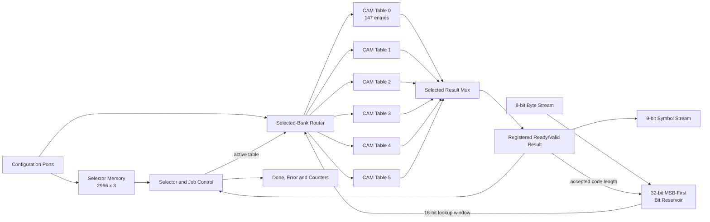
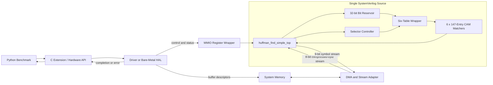

# דוח מסכם: `huffman_find_simple_complete.sv`

## מטרת התכנון והיקף הדוח

מטרת הפרויקט היא להדגים הבנה של הצד ה-Software ושל הצד ה-Hardware ב-Hardware
acceleration. בחרנו להאיץ את `HuffmanTable.find_next_symbol` מתוך benchmark
ה-`pyflate`. המימוש שעליו מבוסס הדוח נמצא כולו בקובץ
[`rtl/huffman_find_simple_complete.sv`](rtl/huffman_find_simple_complete.sv).

זהו קובץ SystemVerilog יחיד, אך הוא שומר על hierarchy של ארבעה modules. הוא
מהווה proof of concept מלא ולוגי, ולא תכנון שמוכן ל-tapeout. אין עדיין תוצאות
synthesis, place-and-route או power analysis, ולכן frequency, area ו-power
המופיעים בדוח הם targets או הערכות אנליטיות בלבד.

ה-parameters של ה-benchmark הם:

| Parameter | ערך | משמעות |
|---|---:|---|
| `NUM_TABLES` | 6 | שישה Huffman tables זמינים ללא טעינה מחדש |
| `NUM_ENTRIES` | 147 | מספר entries בכל table עבור input זה |
| `KEY_WIDTH` | 16 bits | רוחב חלון ה-lookup; אורכי ה-code שנמדדו הם 2–15 |
| `SYMBOL_WIDTH` | 9 bits | רוחב decoded symbol |
| `MAX_SELECTORS` | 2,966 | selector אחד לכל קבוצה של עד 50 symbols |
| Reservoir | 32 bits | buffer מסוג MSB-first |
| Clock target | 200 MHz | period של 5 ns; עדיין לא הוכח ב-timing closure |
| Expected power draw | לא ידוע עדיין | דורש target device, synthesis ו-activity-based power analysis |

`147` ו-`16` הם specialization ל-benchmark. Decoder כללי של bzip2 יצטרך עד
258 entries ועד 20-bit codes.

---

## 1. תיאור ה-Hardware

ה-accelerator מקבל stream של compressed bytes, יוצר חלון של 16 bits, מחפש
Huffman code ב-table הפעיל, מוציא symbol ואת אורך ה-code, ואז מסיר מה-buffer
בדיוק את מספר ה-bits שנצרכו.

ארבעת ה-modules נמצאים באותו קובץ:

| Module | תפקיד |
|---|---|
| `hardware_dictionary_accelerator` | שומר table אחד, מבצע 147 masked comparisons במקביל, בוחר match קצר ביותר ורושם את התוצאה. |
| `huffman_find_six_table` | יוצר שישה matchers, מנתב write/lookup ל-table הנבחר ומבצע mux לתוצאה. |
| `huffman_bit_reservoir` | ממיר byte stream לחלון MSB-first, מטפל ב-`start_bit`, refill וצריכת מספר משתנה של bits. |
| `huffman_find_simple_top` | מחבר את כל המערכת ומנהל selectors, ready/valid, EOB, errors ו-counters. |

יש לקמפל את הקובץ המשולב **במקום** ארבעת קובצי ה-RTL המפוצלים, ולא יחד איתם,
מפני שהם מגדירים את אותם module names.

בוצעה בדיקת source-level שהלוגיקה זהה לקבצים המפוצלים. קיימים
[`testbench` ל-matcher](tests/tb_huffman_find_simple.sv) ו-
[`testbench` ל-top](tests/tb_huffman_find_simple_top.sv), אך לא היה simulator
מותקן ולכן איננו טוענים שהם הורצו. בדיקות Python של ה-reference model עברו;
הן בודקות את האלגוריתם, לא את ה-SystemVerilog.

---

## 2. Inputs, outputs, wires, memory, frequency ו-power

כל הפעולות מסונכרנות ל-rising edge של `clk`. ב-stream interface מתבצעת העברה
רק כאשר `valid && ready` שווים ל-1 באותו edge. כאשר `ready=0`, ה-producer חייב
לשמור את `valid` ואת ה-payload יציבים.

רוחבי כתובות מחושבים לפי:

```text
W [bits] = ceil(log2(N))

table ID        = ceil(log2(6))    = 3 bits
table address   = ceil(log2(147))  = 8 bits
selector address= ceil(log2(2966)) = 12 bits
selector count  = ceil(log2(2967)) = 12 bits
```

להלן **טבלת I/O יחידה** עבור ה-top module עם ערכי ברירת המחדל:

| קבוצה | Signal | כיוון | רוחב | תפקיד והגבלה |
|---|---|---:|---:|---|
| Clock/reset | `clk` | input | 1 | Clock של כל ה-core; target של 200 MHz. |
| Clock/reset | `rst_n` | input | 1 | Reset active-low; assertion יכול להיות asynchronous, deassertion חייב להיות synchronized ל-`clk`. |
| Configuration | `cfg_ready` | output | 1 | גבוה כאשר ה-core idle ומותר לכתוב configuration. |
| Configuration | `dict_wr_en` | input | 1 | Strobe לכתיבה או invalidation של table entry. |
| Configuration | `dict_wr_table` | input | 3 | Table ID חוקי: 0–5. |
| Configuration | `dict_wr_addr` | input | 8 | Entry חוקי: 0–146; ה-RTL בודק bounds. |
| Configuration | `dict_wr_code` | input | 16 | Canonical code מיושר לימין. |
| Configuration | `dict_wr_symbol` | input | 9 | ה-symbol המפוענח המשויך ל-code. |
| Configuration | `dict_wr_len` | input | 5 | אורך 1–16; ערך 0 מבטל entry. |
| Configuration | `selector_wr_en` | input | 1 | Strobe לכתיבת selector. |
| Configuration | `selector_wr_addr` | input | 12 | כתובת selector חוקית: 0–2965. |
| Configuration | `selector_wr_table` | input | 3 | Table ID עבור קבוצת 50 symbols. |
| Job | `start` | input | 1 | Pulse של cycle אחד להתחלת job. |
| Job | `start_bit` | input | 3 | מספר bits לדלג בתחילת ה-byte הראשון: 0–7. |
| Job | `selector_count` | input | 12 | מספר selectors תקפים: 1–2966. |
| Job | `eob_symbol` | input | 9 | ערך ה-End Of Block. |
| Job | `symbol_capacity` | input | 32 | מספר outputs מרבי, כולל EOB. |
| Input stream | `byte_valid` | input | 1 | מציין ש-`byte_data` ו-`byte_last` תקפים. |
| Input stream | `byte_ready` | output | 1 | ה-reservoir יכול לקבל byte. |
| Input stream | `byte_data` | input | 8 | Compressed byte; bit 7 נקרא ראשון. |
| Input stream | `byte_last` | input | 1 | מסמן את ה-byte האחרון, ורלוונטי רק בעת transfer. |
| Output stream | `symbol_valid` | output | 1 | ה-output fields תקפים. |
| Output stream | `symbol_ready` | input | 1 | ה-consumer מוכן; 0 יוצר backpressure. |
| Output stream | `symbol` | output | 9 | Decoded Huffman symbol. |
| Output stream | `code_length` | output | 5 | מספר compressed bits שנצרכים עבור ה-symbol. |
| Output stream | `table_id` | output | 3 | ה-table שפענח את ה-symbol. |
| Output stream | `symbol_eob` | output | 1 | גבוה כאשר ה-symbol התקף הוא EOB. |
| Status | `busy` | output | 1 | גבוה מתחילת job חוקי ועד EOB או error. |
| Status | `done` | output | 1 | Pulse של cycle אחד בסיום מוצלח או בכשל. |
| Status | `error` | output | 1 | Error latched עבור ה-job הנוכחי/האחרון. |
| Status | `error_code` | output | 8 | קוד הסיבה לכשל. |
| Status | `bits_consumed` | output | 32 | סכום אורכי ה-codes של outputs שהתקבלו. |
| Status | `symbols_produced` | output | 32 | מספר outputs שהתקבלו, כולל EOB. |
| Status | `cycle_count` | output | 64 | מספר cycles שבהם `busy=1`. |
| Status | `input_stall_cycles` | output | 32 | Cycles שבהם ה-core היה מוכן ל-byte אך לא קיבל אותו. |
| Status | `output_stall_cycles` | output | 32 | Cycles שבהם symbol תקף נחסם בגלל `symbol_ready=0`. |

### Memory ו-area אנליטיים

כל CAM entry שומר `pattern`, `mask`, `symbol`, `length` ו-`valid`:

```text
B_entry = 16 + 16 + 9 + 5 + 1 = 47 bits/entry
B_CAM   = 6 tables * 147 entries/table * 47 bits/entry
        = 41,454 bits
B_selectors = 2,966 selectors * 3 bits = 8,898 bits
```

כולל reservoir, result registers, counters ו-control state, סך ה-state הגולמי
הוא בקירוב `50,782 bits = 6.20 KiB` ב-bit packing. זה אינו מספר LUTs או gates;
אותם ניתן לדעת רק לאחר synthesis. קיימים `6*147=882` masked comparators פיזיים,
אף שרק bank אחד מקבל operands פעילים בכל lookup.

### Frequency, timing ו-power

ה-target הוא:

```text
T_clk = 5 ns
f_clk = 1/T_clk = 1/(5 ns) = 200 MHz
```

כדי להוכיח שהוא אפשרי, כל register-to-register path צריך לקיים:

```text
T_cq + T_logic + T_route + T_setup + T_uncertainty <= T_clk
```

ה-path החשוד הוא: reservoir/registers → bank selection → 147 comparisons →
shortest-first priority logic → result register. רק post-route Static Timing
Analysis יכול לקבוע `Fmax`. ה-directive‏ `timescale 1ns/1ps` אינו קובע frequency.

הספק dynamic מחושב בקירוב לפי:

```text
P_dynamic ~= sum(alpha_i * C_i * V^2 * f)       [W]
P_total   = P_static + P_dynamic                 [W]
E_job     ~= P_average * T_job                   [J]
```

לכן ה-expected power draw כרגע הוא `TBD`: אין target FPGA/ASIC, voltage או
switching trace שמהם אפשר להפיק ערך אמין.
לדוגמה בלבד, אם מניחים `P_average=0.40 W` וזמן core של `1.482725 ms`, אז:

```text
E_job = 0.40 W * 0.001482725 s = 0.00059309 J = 0.593 mJ
```

`0.40 W` הוא מספר להדגמת החישוב, לא תוצאת measurement או prediction.

---

## 3. Hardware architecture והפעולה הפנימית



### 3.1 Programming ו-pattern alignment

ה-Software כותב code `c` מיושר לימין באורך `L`. עבור `W=16`, ה-Hardware שומר:

```text
pattern = (c << (W-L)) mod 2^W
mask    = ((2^W-1) << (W-L)) mod 2^W
```

דוגמה קטנה: עבור `c=0b101`, ‏`L=3`:

```text
pattern = 0x0005 << 13 = 0xA000
mask    = 0xFFFF << 13 = 0xE000   (after 16-bit truncation)
```

ולכן חלון שמתחיל ב-`101...` מתאים כי:

```text
(lookup_bits & 0xE000) == 0xA000
```

בדיקת הכתובת `dict_wr_addr < 147` מונעת write מחוץ ל-array. `dict_wr_len=0`
מנקה את ה-`valid` של entry שאינו בשימוש.

### 3.2 Match, priority ו-registered output

בכל table נבדקים כל ה-entries במקביל:

```text
raw_match[i] = lookup_valid
             && valid[i]
             && ((lookup_bits & mask[i]) == pattern[i])
```

ה-priority logic מחפש תחילה length קצר יותר, ובשוויון address נמוך יותר. ב-table
חוקי של Huffman קיים בדרך כלל match יחיד, אך הכלל נותן תוצאה deterministic גם
ל-configuration שגוי. התוצאה נשמרת ב-register. אם `symbol_ready=0`, כל שדות
ה-output נשארים יציבים ולכן אין איבוד symbol בזמן backpressure.

### 3.3 Reservoir, selectors ו-control

ה-reservoir שומר bits בצד ה-MSB, ולכן `buffer[31]` הוא ה-bit הבא. הוא יכול לקבל
byte ולצרוך `code_length` באותו cycle. לאחר ה-byte האחרון מותר חלון חלקי עם
zero padding, אבל ה-top דוחה match שאורכו גדול ממספר ה-bits האמיתיים.

ה-signals המרכזיים בין ה-modules הם `reservoir_peek_bits[15:0]`,
`reservoir_valid_bits[5:0]`, ‏`active_table_q[2:0]`, ‏`matcher_symbol[8:0]`,
`matcher_len[4:0]` ו-signals של `valid/ready`. הם internal signals ואינם
נגישים ישירות ל-Software; הסיומת `_q` מציינת register.

ה-`active_table` נשמר ב-register. לאחר כל 50 outputs שאינם EOB, ה-controller
טוען את ה-selector הבא. EOB עצמו יוצא ב-stream ורק transfer שלו מסיים את ה-job.
ה-design מאפשר lookup אחד outstanding; ללא stalls מתקבלת תוצאה אחת בכל שני
cycles, כלומר `II=2 cycles/symbol`.

קודי ה-error העיקריים הם: `0x02` bad configuration, `0x04` truncated input,
`0x05` no symbol, `0x06` selector error ו-`0x07` output overflow.

---

## 4. Hardware/Software interface

הקובץ המשולב הוא bus-independent core: הוא **לא** כולל בפועל AXI, MMIO, DMA,
interrupt או Linux driver. לצורך proof of concept זה מספיק, אך integration
אמיתי דורש wrapper קטן מסביבו.

חלוקת העבודה המוצעת היא:

1. ה-Software קורא את bzip2 header, בונה את ששת ה-Huffman tables ואת רשימת
   ה-selectors, ובודק שהגדלים מתאימים ל-parameters.
2. Python קורא ל-C/C++ extension פעם אחת לכל block, לדוגמה API בשם
   `decode_huffman_block_hw(src, start_bit, tables, selectors, eob, capacity)`
   שמחזיר `symbols` ו-`stats`. אסור לבצע device call אחד לכל symbol.
3. ה-driver או bare-metal HAL מקצה source/destination buffers, מטפל ב-cache
   coherence, כותב control registers ב-MMIO ומפעיל את ה-job.
4. MMIO משמש לכתיבת table/selector configuration ול-registers של כתובות
   buffers, אורכים, `start_bit`, ‏`selector_count`, ‏EOB, ‏`symbol_capacity`,
   ‏`START`, status, errors ו-counters.
5. DMA משמש ל-bulk data של compressed bytes ו-decoded symbols. הוא מתרגם bus
   beats ל-ready/valid streams ומכבד backpressure. DMA config loader הוא שיפור
   אפשרי בעתיד, אך אינו דרוש למודל הפשוט הזה.
6. בסיום, ה-Software בודק `error_code` ו-counters, ואז ממשיך ב-RUNA/RUNB,
   move-to-front, inverse BWT ו-run-length processing הקיימים.

ב-SoC טיפוסי ניתן להשתמש ב-AXI4-Lite עבור MMIO וב-AXI4/AXI-Stream עבור DMA.
מכיוון ש-`done` הוא pulse של cycle אחד, ה-MMIO wrapper חייב לשמור `DONE` sticky
או להרים interrupt שנשאר pending עד שה-Software מבצע acknowledge.

פורמט פשוט אפשרי הוא record של 32 bits לכל table entry: code של 16 bits,
symbol של 9 bits, length של 5 bits ושני reserved bits. ה-selectors נשמרים כ-byte
אחד כל אחד. ה-output יכול להישמר ב-`uint16_t`, כאשר 9 ה-bits הנמוכים הם symbol.

```text
table image    = 6 * 147 * 4 bytes = 3,528 bytes
selector image = 2,966 * 1 byte    = 2,966 bytes
total config   = 6,494 bytes
```

הגרסה ה-optimized של Python שימושית כ-reference לרעיונות אלגוריתמיים, אך היא
עדיין Software סדרתי: היא אינה יוצרת parallel comparators, stream interface,
MMIO או DMA, ועדיין משלמת overhead של Python בכל lookup.

---

## 5. הצדקת ההאצה והערכת performance

### 5.1 נתוני profiling

ה-baseline הראשי הוא mean של 60 ריצות:
[`timing.json`](../../results/pyflate/original/original%20results%20full%20run/timing.json).
חלוקת הפונקציות נלקחה מ-
[`speedscope.folded`](../../results/pyflate/original/original%20results%20full%20run/speedscope.folded).
לא מדובר ב-stopwatch נפרד לכל function, אלא בהמרה של CPU samples לזמן משוער.

עבור function עם `s_i` self samples מתוך `38,010`:

```text
p_i [%] = 100 * s_i / 38,010
T_i [ms] = 662.236860 ms * s_i / 38,010
```

| Function / deepest Python frame | Self samples | מהזמן הכולל | זמן משוער |
|---|---:|---:|---:|
| `decode_huffman_block` | 10,064 | 26.477% | 175.34 ms |
| `move_to_front` | 5,824 | 15.322% | 101.47 ms |
| `HuffmanTable.find_next_symbol` | 4,604 | 12.113% | 80.21 ms |
| `bwt_transform` | 3,765 | 9.905% | 65.60 ms |
| `RBitfield.readbits` | 3,001 | 7.895% | 52.29 ms |
| `RBitfield.snoopbits` | 2,874 | 7.561% | 50.07 ms |
| `bwt_reverse` | 2,759 | 7.259% | 48.07 ms |
| `_mask` | 2,179 | 5.733% | 37.96 ms |
| `_read` | 970 | 2.552% | 16.90 ms |
| `_more` | 845 | 2.223% | 14.72 ms |
| `needbits` | 471 | 1.239% | 8.21 ms |
| `bzip2_main` | 438 | 1.152% | 7.63 ms |
| Other | 216 | 0.568% | 3.76 ms |
| **Total** | **38,010** | **100.000%** | **662.24 ms** |

לדוגמה:

```text
100 * 4,604 / 38,010 = 12.1126%
662.236860 ms * 4,604 / 38,010 = 80.2141 ms
```

ה-inclusive subtree של `find_next_symbol`, כולל bit-reader children, מכיל
`14,713/38,010=38.708%`, כלומר `256.3402 ms`. אי אפשר לחבר inclusive times של
functions שונים, כי הם חופפים. ה-reservoir נכלל בתכנון בדיוק כדי להחליף גם חלק
מעבודת ה-bit reader, ולא רק את ה-comparator.

בדקנו גם את כל תיקיות התוצאות הקיימות:

| Result set והמקור | ריצות | Mean | Profile samples | Self | Inclusive |
|---|---:|---:|---:|---:|---:|
| Original debug: [timing](../../results/pyflate/original/timing.json), [profile](../../results/pyflate/original/speedscope.folded) | 1 | 695.254 ms | 452 | 14.381% | 38.053% |
| Original full: [timing](../../results/pyflate/original/original%20results%20full%20run/timing.json), [profile](../../results/pyflate/original/original%20results%20full%20run/speedscope.folded) | 60 | 662.237 ms | 38,010 | 12.113% | 38.708% |
| Optimized 13-09: [timing](../../results/pyflate/optimized/2026-09-12-13-09/timing.json), [profile](../../results/pyflate/optimized/2026-09-12-13-09/speedscope.folded) | 20 | 436.035 ms | 9,664 | 15.004% | 40.284% |
| Optimized 14-09: [timing](../../results/pyflate/optimized/2026-09-12-14-09/timing.json), [profile](../../results/pyflate/optimized/2026-09-12-14-09/speedscope.folded) | 60 | 431.718 ms | 24,650 | 15.290% | 40.775% |
| Optimized 15-04: [timing](../../results/pyflate/optimized/2026-09-12-15-04/timing.json), [profile](../../results/pyflate/optimized/2026-09-12-15-04/speedscope.folded) | 1 | 430.226 ms | 289 | 14.533% | 41.176% |
| Optimized 15-16: [timing](../../results/pyflate/optimized/2026-09-12-15-16/timing.json), [profile](../../results/pyflate/optimized/2026-09-12-15-16/speedscope.folded) | 60 | 430.018 ms | 24,788 | 15.261% | 41.137% |

ריצות עם sample אחד הן sanity checks בלבד. ה-optimized האחרון מהיר מה-original
הראשי פי `662.236860/430.018329=1.540x`, כלומר ירידה של
`100*(1-430.018329/662.236860)=35.066%`, אך הוא אינו Hardware accelerator.

### 5.2 למה זה מועמד טוב

- הפעולה חוזרת `148,271` פעמים ב-job אחד, כולל EOB.
- ה-state חסום וקטן: שישה tables של עד 147 entries ו-code עד 16 bits.
- 147 comparisons סדרתיים ב-Software יכולים להפוך להשוואה מרחבית מקבילית.
- ה-byte stream וה-symbol stream מאפשרים batching, ולכן setup cost מתחלק על
  כל ה-lookups.
- הבחירה משאירה את שאר bzip2 ב-Software ומצמצמת את היקף הפרויקט.

### 5.3 זמן Hardware ו-speedup צפוי

ללא stalls, ה-top השלם עובד ב-`II=2`. עבור fill גרוע של 3 cycles:

```text
C_fill [cycles] = ceil((KEY_WIDTH + start_bit)/8)
                = ceil((16 + start_bit)/8) = 2 or 3 cycles

C_core [cycles] = C_fill + N_symbols * II
                = 3 + 148,271 * 2
                = 296,545 cycles

T_core [s] = C_core / f_clk
           = 296,545 cycles / 200,000,000 cycles/s
           = 0.001482725 s = 1.482725 ms

Throughput = f_clk / II = 200 MHz / 2 = 100 Msymbol/s
```

הערכה שמרנית מחליפה רק את ה-self time:

```text
S_component = 80.2141 ms / 1.482725 ms = 54.10x

S_total = 1 / ((1-p) + p/S_component)
        = 1 / ((1-0.121126) + 0.121126/54.10)
        = 1.13493x
```

אם ה-reservoir וה-batching מחליפים את כל ה-inclusive subtree, הגבול האופטימי
הוא בקירוב `662.2369/(662.2369-256.3402+1.4827)=1.626x`. לכן ההערכה שלנו היא
`1.135x–1.626x` לכל ה-benchmark, לפני MMIO, DMA, cache ו-driver overhead. אלה
תחזיות, לא מדידות Hardware.

---

## 6. Block diagram של המערכת השלמה

כל הטקסט בתוך התרשים נשמר באנגלית כדי למנוע בעיות כיוון וקריאות.



החץ החוזר מה-matchers אל ה-top כולל symbol ו-code length; ה-length חוזר
ל-reservoir כדי ליצור את חלון ה-lookup הבא. זו תלות feedback שמסבירה את
ה-`II=2` של המימוש הפשוט.

---

## 7. Performance/area/power trade-offs

| החלטה | יתרון | מחיר |
|---|---|---|
| שישה CAM banks | מעבר table מיידי בכל 50 symbols | 882 comparators, area ו-capacitance גבוהים |
| `147` entries ו-`KEY_WIDTH=16` | חוסך area, routing ו-power עבור benchmark זה | אינו תומך בכל קובץ bzip2 |
| Operand isolation ל-banks לא פעילים | מפחית switching activity | אינו חוסך area או static power ואינו clock gating |
| Registered ready/valid result | output יציב ובטוח תחת backpressure | מוסיף latency ותורם ל-`II=2` ב-feedback loop |
| Priority shortest-first שטוח | RTL פשוט וברור | עלול להיות ה-critical path ולמנוע 200 MHz |
| 32-bit reservoir עם 8-bit input | integration פשוט ו-refill נוח | variable shifter ומעט logic נוסף |
| Counters ו-error checks | מאפשרים debug ומדידה | מוסיפים מעט registers ו-toggle activity |
| MMIO ל-control ו-DMA ל-data | overhead קטן לכל job במקום לכל symbol | דורש wrapper, driver ו-buffer management |

הפשרה שנבחרה מתאימה לפרויקט לימודי: ה-datapath וה-control ברורים, כל ששת
ה-tables זמינים, ויש protocol מלא של streaming ו-backpressure. החיסרון העיקרי
הוא area גדול יחסית ו-priority network רחב. אם נמשיך ל-synthesis, השיפור הראשון
שכדאי לבדוק הוא balanced priority tree ששומר על shortest-first semantics.

Pipeline נוסף עשוי להעלות את `Fmax`, אך אם הוא משנה את `II` מ-2 ל-3, נדרש:

```text
f_new / f_old >= II_new / II_old = 3/2 = 1.5
```

כלומר לפחות 50% עלייה ב-frequency רק כדי לשמור על אותו throughput. לכן אין
להוסיף pipeline לפני ש-Static Timing Analysis מראה שה-path אכן נכשל.

---

## סיכום ומקורות

התכנון מממש accelerator עקבי עבור `find_next_symbol`: configuration של tables
ו-selectors, reservoir מסוג MSB-first, שישה matchers, ready/valid עם
backpressure, EOB, counters ו-errors. הוא מדגים Hardware/Software co-design,
אך אינו טוען לתוצאות פיזיות שטרם נמדדו.

מקורות עיקריים:

- [קובץ ה-SystemVerilog היחיד](rtl/huffman_find_simple_complete.sv)
- [המדריך המפורט לקובץ המשולב](HUFFMAN_FIND_SIMPLE_COMPLETE_GUIDE.md)
- [הקוד המקורי של pyflate](../../suites/original/bm_pyflate/run_benchmark.py)
- [הקוד ה-optimized](../../suites/optimized/bm_pyflate/run_benchmark.py)
- [כלי characterization של ה-workload](tools/characterize_workload.py)
- [Clock constraint של 5 ns](constraints/huffman_find_simple_top.xdc)
- [הדוח האנגלי המפורט](report/README.md)
- [התרגום העברי המפורט](report%20in%20hebrew/README.md)
