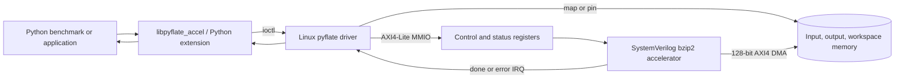

# Pyflate `decode_huffman_block` Accelerator (Deferred Expansion)

Status: deferred possible expansion. The first selected hardware kernel is now
`HuffmanTable.find_next_symbol`; its active specification and RTL are in
`HUFFMAN_FIND_ACCELERATOR.md` and `rtl/huffman_find_accel.sv`. This document is
retained as the possible second-stage, complete-block design so that its useful
BWT, DMA, and software notes are not lost.

## Decision

Implement a complete non-randomized bzip2 block decoder whose hot core is
equivalent to `decode_huffman_block` in the original benchmark. The host-facing
interface accepts a complete `.bz2` byte stream even though the selected kernel
is block decoding. Parsing the stream header and block marker in a small RTL
wrapper avoids an unsafe, non-byte-aligned handoff from software to hardware.

The first implementation processes one job and one bzip2 block at a time. It
supports multiple blocks in one stream sequentially. Gzip remains in software.

The baseline target is synthesizable SystemVerilog at 200 MHz with:

- one 32-bit AXI4-Lite slave for control and status;
- one 128-bit AXI4 DMA master for input, output, and optional workspace;
- one level-sensitive interrupt output;
- 64-bit DMA addresses; and
- one outstanding decompression job.

The host API is deliberately coarse grained: submit one complete compressed
stream, wait once, and receive one decompressed byte buffer. Calling hardware
once per Huffman symbol or MTF update is not supported because communication
overhead would dominate those small operations.

## Measured reason for this boundary

The original mean runtime is 664.900 ms. CPU-clock stack samples place 98.76%
of the benchmark inside `decode_huffman_block`, approximately 656.69 ms. A
perfect implementation of only MTF is limited to 1.18x end-to-end speedup, and
inverse BWT alone is limited to 1.21x. The selected boundary includes Huffman
decoding, RUNA/RUNB expansion, data MTF, inverse BWT, and the final RLE stage.

`tools/characterize_workload.py` measures the actual benchmark's logical work:

| Quantity | Benchmark value |
|---|---:|
| Compressed input | 67,562 bytes |
| Blocks | 1 |
| Huffman symbols decoded | 148,271 |
| Selector MTF operations | 2,966 |
| Data MTF operations | 89,837 |
| Bytes entering inverse BWT | 336,184 |
| Final output | 399,360 bytes |

These counts are workload characteristics, not timing measurements. The
original output MD5 is `afa004a630fe072901b1d9628b960974`.

## Hardware/software partition



Software is responsible for device discovery, buffer allocation/mapping,
timeouts, job serialization, fallback, and final benchmark MD5 validation.
Hardware is responsible for parsing and decoding the bzip2 stream, bounds
checking every write, optional CRC verification, and reporting exact status.

## Functional requirements

The accelerator shall:

1. Accept a complete `BZh1` through `BZh9` stream in memory.
2. Interpret all compressed bits most-significant-bit first.
3. Validate the `BZ` magic, compression method, block-size character, block
   marker, Huffman-group count, selector values, code lengths, symbol values,
   original BWT pointer, end marker, and all input/output bounds.
4. Reject randomized blocks with `ERR_RANDOMIZED`; the benchmark also rejects
   them.
5. Decode the in-use bitmap and create the initial 0-to-255 byte MTF list.
6. Decode two to six canonical Huffman tables and switch table after each group
   of 50 symbols using the selector list.
7. Decode RUNA/RUNB and data MTF exactly as the original algorithm does.
8. Build and walk the inverse-BWT table for exactly the decoded block length.
9. Perform the final bzip2 RLE expansion and produce bytes in original order.
10. Support sequential blocks until the end-of-stream marker.
11. Optionally verify block and combined stream CRCs. CRC checking is enabled by
    the production API and may be disabled only by explicit benchmark-compat
    mode because the original Python benchmark discards CRC fields.
12. Never read beyond `SRC_LENGTH`, write beyond `DST_CAPACITY`, or access beyond
    `WORK_SIZE`, including after malformed input.
13. Return the exact input bytes consumed, output bytes produced, block count,
    error code, and cycle count.

Concatenated independent `.bz2` streams are outside version 1. A caller may
submit each stream as a separate job.

## Top-level SystemVerilog contract

The project will define reusable `axi4_lite_if` and `axi4_if` interfaces. The
logical top-level signature is:

```systemverilog
module pyflate_accel_top #(
  parameter int unsigned AXI_ADDR_W      = 64,
  parameter int unsigned AXI_DATA_W      = 128,
  parameter int unsigned MAX_BLOCK_BYTES = 900_000,
  parameter bit          EXTERNAL_WORK   = 1'b0
) (
  input  logic              clk_i,
  input  logic              rst_ni,
  axi4_lite_if.slave        s_axil,
  axi4_if.master            m_axi,
  output logic              irq_o
);
```

All interfaces use the same 200 MHz clock in version 1. `rst_ni` is asserted
asynchronously and deasserted synchronously. Internal data channels use
backpressure-safe `valid`, `ready`, and payload signals. No module may drop or
duplicate data when downstream `ready` is low.

The implementation timing constraint is a 5.000 ns clock. A design that fails
200 MHz after place and route must report its achieved frequency and recompute
performance projections; simulation alone is not evidence of frequency.

## Register map

Registers are 32-bit little-endian words in a 4 KiB AXI4-Lite region. DMA byte
order is unchanged from memory; only the bit-reservoir logic interprets bzip2
fields as MSB-first.

| Offset | Name | Access | Definition |
|---:|---|---|---|
| `0x000` | `ID` | RO | `0x5059464c` (`PYFL`) |
| `0x004` | `VERSION` | RO | Major in bits 31:16, minor in 15:0; initially `1.0` |
| `0x008` | `CAPABILITIES` | RO | CRC, workspace mode, BZh1-9, counter capabilities |
| `0x00c` | `CONTROL` | WO | Bit 0 `START`, bit 1 `ABORT`, bit 2 `SOFT_RESET`; write-one pulse |
| `0x010` | `STATUS` | RO | Bit 0 `BUSY`, 1 `DONE`, 2 `ERROR`, 3 `ABORTED`, 4 `IRQ_PENDING` |
| `0x014` | `IRQ_ENABLE` | RW | Bit 0 enable completion IRQ, bit 1 enable error IRQ |
| `0x018` | `IRQ_STATUS` | RW1C | Bit 0 completion, bit 1 error/abort |
| `0x01c` | `ERROR_CODE` | RO | `pyflate_error_e`; first error is retained |
| `0x020` | `SRC_ADDR_LO` | RW | Compressed input IOVA bits 31:0 |
| `0x024` | `SRC_ADDR_HI` | RW | Compressed input IOVA bits 63:32 |
| `0x028` | `SRC_LENGTH` | RW | Valid compressed bytes |
| `0x02c` | `DST_ADDR_LO` | RW | Output IOVA bits 31:0 |
| `0x030` | `DST_ADDR_HI` | RW | Output IOVA bits 63:32 |
| `0x034` | `DST_CAPACITY` | RW | Maximum bytes hardware may write |
| `0x038` | `WORK_ADDR_LO` | RW | External workspace IOVA bits 31:0, or zero for on-chip mode |
| `0x03c` | `WORK_ADDR_HI` | RW | External workspace IOVA bits 63:32 |
| `0x040` | `WORK_SIZE` | RW | External workspace bytes, or zero for on-chip mode |
| `0x044` | `OPTIONS` | RW | Bit 0 block CRC, 1 stream CRC, 2 benchmark-compat CRC bypass |
| `0x048` | `OUTPUT_LENGTH` | RO | Successfully produced bytes |
| `0x04c` | `INPUT_CONSUMED` | RO | Compressed bytes consumed |
| `0x050` | `BLOCK_COUNT` | RO | Completed block count |
| `0x054` | `CYCLE_COUNT_LO` | RO | Active-job cycles 31:0 |
| `0x058` | `CYCLE_COUNT_HI` | RO | Active-job cycles 63:32; read low then high |
| `0x05c` | `HUFFMAN_SYMBOLS` | RO | Entropy symbols decoded |
| `0x060` | `DATA_MTF_OPS` | RO | Data MTF operations |
| `0x064` | `BWT_BYTES` | RO | Bytes entering inverse BWT |
| `0x068` | `DMA_READ_STALLS` | RO | Cycles waiting for compressed/workspace reads |
| `0x06c` | `DMA_WRITE_STALLS` | RO | Cycles waiting for output/workspace writes |
| `0x070` | `CORE_STALLS` | RO | Cycles the entropy core is blocked downstream |
| `0x074` | `MAX_BLOCK_BYTES` | RO | Synthesized block-storage capacity |

Configuration writes while `BUSY=1` do not affect the active job. `START` when
busy sets `ERR_BUSY` without disturbing that job. On a legal `START`, hardware
atomically snapshots the configuration, clears old counters and completion
state, then asserts `BUSY`.

`DONE`, `ERROR`, and IRQ status are sticky until the corresponding
`IRQ_STATUS` bits are cleared. `ABORT` stops issuing new DMA requests, drains
already accepted AXI responses, records `ERR_ABORTED`, and then clears `BUSY`.
`SOFT_RESET` is legal only while idle; the driver aborts and waits before reset.

The canonical register and error constants are in `rtl/pyflate_accel_pkg.sv`.

## DMA and memory contract

### Buffers

The driver supplies three non-overlapping DMA regions:

- `SRC`: device-readable compressed bytes;
- `DST`: device-writable output bytes; and
- `WORK`: device-readable/writable inverse-BWT workspace when
  `EXTERNAL_WORK=1`.

Base addresses must be 64-byte aligned. Lengths need not be a multiple of the
128-bit bus width. The DMA reader must not fetch a cache line beyond the mapped
source range; the final partial beat is handled with internal byte-valid bits.
The writer uses AXI write strobes for its final partial beat.

The baseline AXI master uses incrementing bursts of at most 16 beats, never
crosses a 4 KiB boundary, supports multiple outstanding sequential source and
destination transactions, and reports any non-OKAY AXI response as
`ERR_DMA_READ` or `ERR_DMA_WRITE`.

### Workspace

For a block capacity `N`, the packed on-chip representation needs:

```text
L bytes:      N * 8 bits
T pointers:   N * ceil(log2(MAX_BLOCK_BYTES)) bits
```

At `MAX_BLOCK_BYTES=900000`, a 20-bit pointer gives 25.2 Mbit or 3.15 MB. For
the measured 336,184-byte BWT input, it uses 9.413 Mbit or 1.177 MB.

The external-workspace implementation favors address simplicity over packed
capacity:

```text
L region: align_up(MAX_BLOCK_BYTES, 64) bytes
T region: MAX_BLOCK_BYTES * 4 bytes
required: align_up(L size, 64) + T size
```

General BZh9 support therefore requires 4,500,032 bytes with the stated
alignment. Only the low 20 bits of each 32-bit T entry are meaningful. Hardware
checks `WORK_SIZE` before reading compressed data.

On-chip RAM is the performance reference because inverse BWT follows a
data-dependent pointer chain. External DRAM reduces FPGA memory use but cannot
hide the latency of the next `T[row]` lookup with ordinary burst prefetching.

### Cache coherency and IOMMU

The Linux driver uses the DMA API rather than exposing CPU physical addresses:

1. Pin or allocate input and output pages.
2. Call `dma_map_sg` or allocate DMA-coherent buffers.
3. Synchronize source data for the device before `START` on non-coherent
   platforms.
4. Execute a write memory barrier after programming addresses and before
   `START`.
5. On completion, synchronize destination data for the CPU before returning it.
6. Unmap and unpin only after all DMA responses are drained.

On an IOMMU system the MMIO registers receive I/O virtual addresses. On an FPGA
SoC with a coherent AXI port, the device-tree `dma-coherent` property allows the
driver to omit explicit cache maintenance while retaining the same API.

## Internal architecture

```mermaid
flowchart LR
    RD[AXI DMA reader] --> IFIFO[Input FIFO]
    IFIFO --> BR[128-bit MSB-first reservoir]
    BR --> SP[Stream and block parser]
    SP --> USED[In-use and selector decoder]
    USED --> HT[Canonical table builder]
    HT --> HD[Huffman decoder]
    HD --> RUN2[RUNA/RUNB expander]
    RUN2 --> MTF[256-byte MTF]
    MTF --> LRAM[L RAM and histogram]
    LRAM --> PREFIX[256-bin prefix sum]
    PREFIX --> TBUILD[T construction]
    TBUILD --> WALK[LF pointer walk]
    WALK --> RLE1[Five-byte lookahead RLE1]
    RLE1 --> CRC[Block and stream CRC]
    CRC --> OFIFO[Output FIFO]
    OFIFO --> WR[AXI DMA writer]
```



### Controller states

```text
IDLE
  -> VALIDATE_JOB
  -> PARSE_STREAM_HEADER
  -> PARSE_BLOCK_MARKER
  -> PARSE_BLOCK_HEADER
  -> READ_IN_USE_MAP
  -> READ_SELECTORS
  -> READ_CODE_LENGTHS
  -> BUILD_CANONICAL_TABLES
  -> DECODE_HUFFMAN_AND_RLE2
  -> BUILD_PREFIX_SUM
  -> BUILD_T
  -> INVERSE_BWT_AND_RLE1
  -> CHECK_BLOCK_CRC
  -> PARSE_BLOCK_MARKER (next block)
  -> CHECK_STREAM_CRC
  -> DRAIN_OUTPUT_DMA
  -> DONE
```

Any validation, bounds, CRC, or bus failure transitions to `ERROR_DRAIN`, where
new requests stop and accepted AXI transactions complete before status/IRQ is
raised.

### Bit reservoir

The reader fills an input FIFO in 128-bit beats. The reservoir holds at least
128 bits plus one refill beat so that a 48-bit marker and a 20-bit Huffman peek
can be evaluated without special boundary cases. A `bit_count` register tracks
valid bits. `consume(n)` shifts left by `n`, and refill appends bytes in memory
order. The parser is allowed to consume only when `bit_count >= n`.

### Table and selector construction

The in-use map contains 256 bits. Selector MTF uses six 3-bit registers.
Selectors are stored as three-bit values in RAM. Version 1 provisions 32,768
entries because the stream field is 15 bits; values inconsistent with the
selected block size are rejected before an out-of-range RAM access.

Each of up to six Huffman groups stores:

- `min_len` and `max_len`;
- canonical `base[0:21]` and `limit[0:20]` values; and
- `perm[0:257]`, mapping canonical order to the decoded symbol.

Code lengths outside 0 through 20, oversubscribed tables, incomplete end-symbol
coverage, and impossible canonical indices produce `ERR_HUFFMAN_TABLE`.

### Huffman decode

The performance configuration peeks 20 reservoir bits, compares the prefix to
the selected group's canonical limits in parallel, priority-selects the first
legal length, obtains the symbol through `perm`, and consumes that length. The
comparison and symbol lookup are split by one register stage, but the reservoir
is committed only when the result and downstream path are ready.

The area configuration checks one extra code bit per cycle from `min_len` to
`max_len`. It shares the same tables and is functionally identical but has a
variable initiation interval of 1 through 20 cycles per symbol.

The selector changes after every 50 decoded symbols, matching the software.
End-of-block is the `symbols_in_use - 1` symbol.

### RUNA/RUNB and MTF

RUNA and RUNB update:

```text
if first run symbol: repeat_power = 1
repeat       += repeat_power << symbol[0]
repeat_power <<= 1
```

When the next non-run symbol arrives, the expander writes `repeat` copies of
the current MTF-front byte before handling that symbol. Counter widths cover a
full block, and a run that would exceed `MAX_BLOCK_BYTES` raises
`ERR_BLOCK_OVERFLOW`.

The performance MTF implementation holds 256 bytes in registers. Index `k`
returns entry `k`, shifts entries `0..k-1` right by one position, and writes the
selected entry at zero in one accepted cycle. Clock enables prevent entries
above `k` from toggling. The small-area implementation performs the same update
in a RAM over multiple cycles and stalls Huffman decode during the shift.

Every byte written to L RAM increments one of 256 20-bit histogram counters.

### Inverse BWT

After entropy decoding, a 256-cycle prefix unit converts histogram counts into
the first position of each byte value. A sequential L scan constructs:

```text
T[prefix[L[i]]] = i
prefix[L[i]]++
```

The inverse walk initializes `row=orig_ptr` and performs exactly `N` iterations:

```text
row      = T[row]
next_byte = L[row]
```

Separate L and T memories allow one dependent T lookup per cycle after RAM
latency, followed by a pipelined L lookup. `orig_ptr >= N`, a pointer outside
`0..N-1`, or a walk count other than exactly N raises `ERR_BWT_POINTER`.

### Final RLE and CRC

The final decoder uses a five-byte lookahead FIFO. If its first four bytes are
equal, the fifth byte is a repeat count and the output stage emits that byte
`count + 4` times. Otherwise it emits the oldest byte and shifts by one.
End-of-block drains the remaining one through four bytes normally.

Output expansion is checked against `DST_CAPACITY` before accepting the bytes
that would overflow it. CRC is updated on each committed output byte, not on
stalled cycles. The combined stream CRC is updated after every valid block.

## Error codes and recovery

| Code | Meaning | Linux result |
|---|---|---|
| `ERR_NONE` | Successful completion | `0` |
| `ERR_BUSY` | Start attempted while active | `-EBUSY` |
| `ERR_BAD_CONFIG` | Address, alignment, length, option, or workspace failure | `-EINVAL` |
| `ERR_BAD_MAGIC` | Not a supported bzip2 stream/marker | `-EINVAL` |
| `ERR_TRUNCATED` | Input ended before a complete stream | `-ENODATA` |
| `ERR_RANDOMIZED` | Randomized legacy block | `-EOPNOTSUPP` |
| `ERR_SELECTOR` | Illegal selector/group encoding | `-EBADMSG` |
| `ERR_HUFFMAN_TABLE` | Illegal Huffman length/table | `-EBADMSG` |
| `ERR_HUFFMAN_SYMBOL` | No valid next symbol | `-EBADMSG` |
| `ERR_BLOCK_OVERFLOW` | Decoded BWT block exceeds capacity | `-EOVERFLOW` |
| `ERR_BWT_POINTER` | Invalid original pointer or T entry | `-EBADMSG` |
| `ERR_DST_OVERFLOW` | Output buffer is too small | `-ENOSPC` |
| `ERR_BLOCK_CRC` | Block CRC mismatch | `-EBADMSG` |
| `ERR_STREAM_CRC` | Combined CRC mismatch | `-EBADMSG` |
| `ERR_DMA_READ` | AXI read failure | `-EIO` |
| `ERR_DMA_WRITE` | AXI write failure | `-EIO` |
| `ERR_ABORTED` | Software abort or timeout recovery | `-ECANCELED` |
| `ERR_INTERNAL` | Invariant or impossible FSM state | `-EIO` |

Partial output is never reported as successful. The driver returns
`OUTPUT_LENGTH` and the hardware error for diagnosis, but the Python API raises
an exception and discards partial output by default.

## Linux driver

### Binding

The SoC reference driver is a platform driver with device-tree compatible
string `hwswcodesign,pyflate-1.0`. Its node supplies `reg`, `interrupts`,
`clocks`, and optionally `dma-coherent`. A PCIe implementation uses the same
register map in BAR0 and the same DMA API after setting a 64-bit DMA mask.

The driver creates `/dev/pyflate0` and permits one open file to own the engine at
a time. A mutex serializes jobs; the hardware itself does not depend on Linux
process identity.

### Blocking job path

1. Validate fixed-width ioctl fields and integer overflow.
2. Pin/map source and destination buffers, or copy into reusable coherent
   buffers on platforms that cannot map user pages safely.
3. Allocate/map the external workspace when the synthesized capability needs
   it.
4. Clear stale IRQ state and program address, size, and option registers.
5. Enable completion/error interrupts, issue a write barrier, and pulse START.
6. Sleep on a wait queue until IRQ or timeout; polling is used only during early
   bring-up.
7. On timeout, pulse ABORT, wait for `BUSY=0`, and reset if the drain itself
   times out.
8. Synchronize DMA output, unmap/unpin, copy result metadata to userspace, and
   translate the hardware error to `errno`.

The interrupt handler reads `IRQ_STATUS`, acknowledges it with write-one-to-
clear, snapshots status/error, and wakes the wait queue. It does not unmap
buffers in interrupt context.

The fixed-width userspace ABI is defined in `sw/pyflate_accel_uapi.h`. The
initial `PYFLATE_IOC_DECOMPRESS` call is blocking. `poll()` reports readable on
job completion for a future asynchronous submit API, but an asynchronous queue
is not required for version 1.

## C and Python APIs

The C library API is:

```c
struct pyflate_context *pyflate_open(const char *device);
int pyflate_prepare(struct pyflate_context *, size_t max_input,
                    size_t max_output);
int pyflate_decompress_into(struct pyflate_context *,
                            const void *src, size_t src_len,
                            void *dst, size_t dst_capacity,
                            struct pyflate_result *result);
void pyflate_close(struct pyflate_context *);
```

`pyflate_prepare` creates persistent page-aligned source, destination, and
workspace mappings. Reusing them is important for the small benchmark because
repeated pin/map/allocation overhead would otherwise be included in every
iteration.

The Python extension exposes:

```python
class Accelerator:
    def __init__(self, device="/dev/pyflate0", verify_crc=True): ...
    def prepare(self, compressed: bytes, output_capacity: int) -> PreparedJob: ...
    def decompress(self, compressed: bytes, output_capacity: int) -> bytes: ...

class PreparedJob:
    def run_into(self, output: bytearray) -> Result: ...

def available(device="/dev/pyflate0") -> bool: ...
```

The extension releases the GIL while waiting in the ioctl. `Result` contains
`output_length`, `input_consumed`, `block_count`, `cycles`, and hardware
counters. Exceptions retain both `errno` and `hardware_error`.

## Required benchmark modification

Only the optimized suite changes. The original remains the golden reference.
The hardware object, input mapping, and output allocation are created before
the timed region, just as the current benchmark opens the input file before its
timer. Submission, DMA, decompression, interrupt completion, and output-DMA
visibility remain inside the timed loop.

Equivalent structure:

```python
def bench_pyflake_hardware(loops, filename):
    compressed = Path(filename).read_bytes()
    output = bytearray(MAX_EXPECTED_OUTPUT)
    accelerator = pyflate_accel.Accelerator()
    job = accelerator.prepare(compressed, len(output))

    t0 = pyperf.perf_counter()
    for _ in range(loops):
        result = job.run_into(output)
    dt = pyperf.perf_counter() - t0

    decoded = memoryview(output)[:result.output_length]
    if hashlib.md5(decoded).hexdigest() != EXPECTED_MD5:
        raise Exception("MD5 checksum mismatch")
    return dt
```

Backend selection uses `PYFLATE_BACKEND=software|hardware|auto`:

- `software`: always use the current optimized Python decoder;
- `hardware`: require `/dev/pyflate0` and fail if it cannot run the stream; and
- `auto`: use hardware when available, otherwise fall back to software.

Published hardware measurements must use `hardware`, not `auto`, so a silent
fallback cannot be mistaken for acceleration. The run metadata must record
backend, RTL version, register version, clock frequency, memory mode, driver
version, CRC mode, hardware cycle count, and output length.

The benchmark MD5 remains outside the timed region for parity with the original
code. A separate end-to-end application test should include context creation,
mapping, and checksum time.

## Performance model

For the benchmark and a 128-bit DMA bus:

```text
minimum source beats       = ceil(67562 / 16) = 4,223 cycles
entropy/RLE2 storage       >= 336,184 cycles
T construction             = 336,184 cycles
inverse BWT/final output    >= max(336,184, 399,360) cycles
```

With on-chip one-cycle L/T memories and overlap between the inverse walk, RLE,
and output packer, the first-order core count is approximately:

```text
336,184 + 336,184 + 399,360 + setup = about 1.08 million cycles
```

At 200 MHz this is approximately 5.4 ms; allowing 10% for table setup, FIFO
bubbles, and control gives about 5.9 ms before host scheduling overhead. Adding
the previously estimated 8.21 ms outside `decode_huffman_block` gives a
provisional 14-15 ms application time, approximately 44-47x faster than the
664.9 ms baseline. These are projections to be replaced by RTL and
post-synthesis measurements.

External workspace changes the result materially. The T walk has a dependent
address every byte and then a dependent L read. Its throughput is governed by
random-read latency, not peak burst bandwidth. `DMA_READ_STALLS` exists to make
that penalty visible.

## Area, frequency, and power tradeoffs

| Choice | Performance | Area | Power | Default |
|---|---|---|---|---|
| Parallel canonical-length comparison | One symbol/cycle target | More comparators and routing | Higher toggle rate | Performance build |
| Iterative Huffman length check | 1-20 cycles/symbol | Small | Lower | Small-area build |
| Register-array MTF | One accepted MTF/cycle | About 2,048 state FFs plus shift muxes | Potentially high switching | Performance build |
| RAM/sequential MTF | Variable cycles per index | Lower logic | Lower | Small-area build |
| Packed on-chip L/T | One pointer step/cycle | Up to 25.2 Mbit RAM | Lower system I/O power | Performance reference |
| 32-bit T in external memory | 4.5 MB workspace, small FPGA RAM | Low on-chip area | Higher DDR and stall power | Portable build |
| 128-bit AXI | I/O comfortably above byte-serial core | Moderate bus logic | Moderate | Version 1 |
| Wider AXI | Little core benefit | More routing/FIFOs | Higher | Not recommended initially |

Clock enables shall gate inactive tables, MTF entries above the selected index,
histogram banks, CRC, and DMA channels. RAMs should infer FPGA block/ultra RAM,
not distributed registers. The controller is single-job so unused phases can be
clock-gated aggressively.

Absolute LUT, FF, BRAM/URAM, Fmax, and watt claims require a named FPGA/ASIC
target and post-route activity-based power analysis. The report must distinguish
architectural estimates from tool results.

## Verification plan

### Unit-level RTL

1. Bit reservoir tests across every byte and 128-bit beat boundary.
2. Canonical table tests for minimum/maximum lengths, sparse alphabets, and
   malformed oversubscribed tables.
3. Selector and 256-byte MTF tests against Python reference state after every
   operation.
4. RUNA/RUNB tests including a run that reaches the block-capacity boundary.
5. BWT construction and reverse-walk tests for empty/one-byte inputs, repeated
   strings, all 256 byte values, invalid pointers, and the benchmark block.
6. RLE1 tests for runs of four, counts 0 and 255, tails shorter than five bytes,
   and output overflow.
7. CRC known-answer tests.
8. Random ready/valid backpressure on every internal interface.
9. AXI error injection, short input, abort during every phase, and reset/IRQ
   semantics.

### System verification

1. Use Python's `bz2.decompress` and the original benchmark as independent
   golden models.
2. Test bzip2 levels 1 through 9, multiple blocks, incompressible data, long
   runs, all-byte patterns, zero-length original data, and malformed streams.
3. Compare output byte-for-byte and check CRC/error behavior.
4. Reproduce the benchmark output length 399,360 and its expected MD5.
5. Confirm benchmark counters: one block, 148,271 Huffman symbols, 89,837 data
   MTF operations, and 336,184 BWT bytes.
6. Run gate-level or post-route timing simulation for the DMA/register boundary.
7. Synthesize, place, route, and report Fmax/resources.
8. Estimate power from switching activity captured while decoding the benchmark.

## Acceptance criteria

The design is complete when:

- synthesizable RTL implements every state and error above with no behavioral
  placeholder;
- lint and clock/reset checks pass;
- unit and randomized backpressure tests pass;
- software, ioctl ABI, register package, and RTL agree on version and constants;
- the hardware output matches the benchmark MD5;
- malformed input cannot produce an out-of-range DMA access;
- measured hardware counters agree with the golden dynamic counts;
- the placed design meets its reported clock constraint;
- end-to-end timing includes submit, DMA, completion, and output visibility; and
- area and power are reported from the selected target rather than estimated.

## Implementation sequence

1. Bus-independent bit reservoir and canonical Huffman decoder.
2. Selector, RUNA/RUNB, and MTF pipeline writing a behavioral L RAM.
3. BWT table construction, inverse walk, RLE1, and CRC.
4. Whole-stream parser and multi-block controller.
5. AXI DMA and AXI4-Lite register wrapper.
6. Linux driver and C/Python bindings.
7. Optimized benchmark backend and metadata reporting.
8. FPGA synthesis, timing closure, power analysis, and end-to-end measurement.
