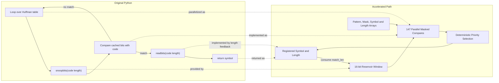
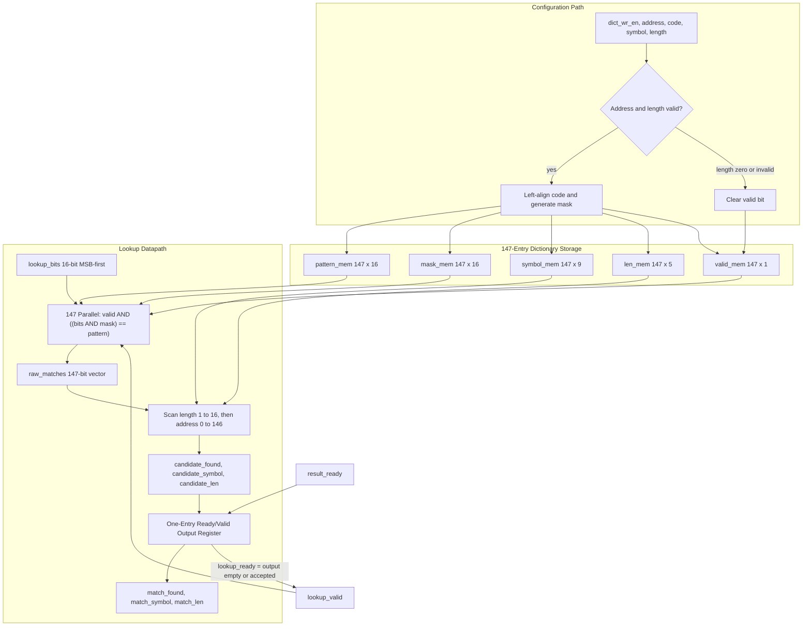
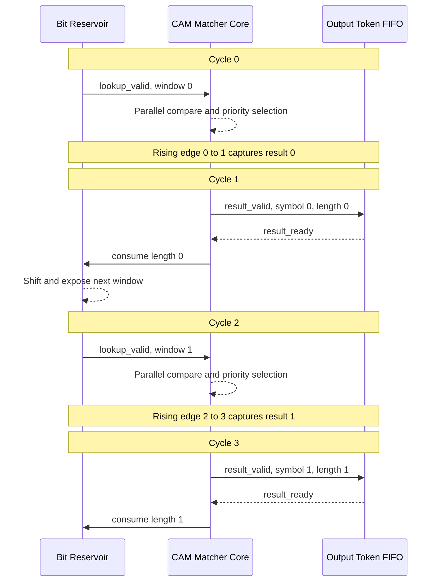
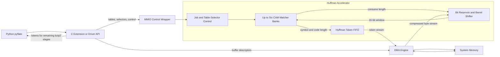
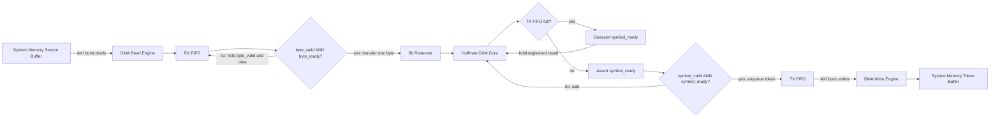
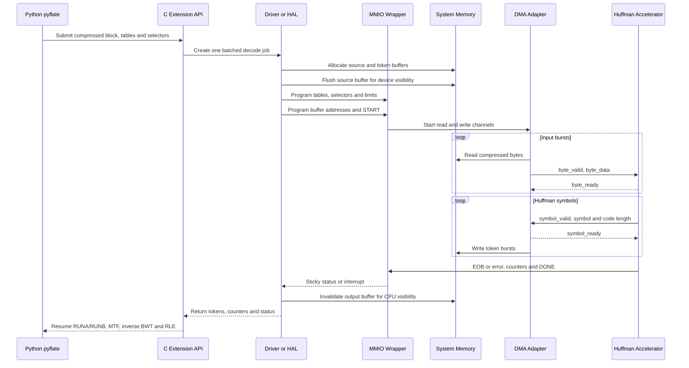
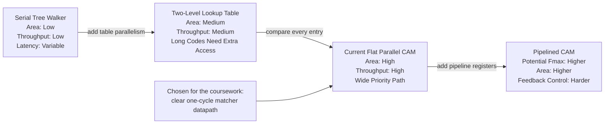

# הצעה למאיץ Hardware עבור `HuffmanTable.find_next_symbol`

## תיאור ה-Hardware

בחרנו להאיץ את `HuffmanTable.find_next_symbol` מתוך benchmark ה-`pyflate`. בכל קריאה הפונקציה עוברת באופן סדרתי על Huffman table, מבצעת `snoopbits` עבור אורכי code שונים, משווה את ה-bits לערכי ה-table, וכאשר נמצאת התאמה צורכת את מספר ה-bits המתאים באמצעות `readbits`. הפעולה חוזרת מספר רב של פעמים ולכן משלבת loop של Python, השוואות, branches וטיפול חוזר ב-bit buffer.

הפתרון המוצע הוא CAM-style Huffman matcher הממומש ב-SystemVerilog בקובץ [`huffman_find_simple.sv`](../huffman_find_simple.sv). ה-module שומר Huffman table אחד ובודק את כל ה-entries במקביל. עבור כל lookup הוא מחזיר את ה-`symbol` שנמצא ואת אורך ה-code שנצרך. זהו core מלא ולוגי עבור פעולת החיפוש עצמה; MMIO, DMA, bit reservoir ותמיכה במספר tables שייכים ל-system wrapper שסביבו ואינם ממומשים בקובץ זה.

ברירת המחדל היא `147` entries, חלון lookup של `16 bits` ו-`symbol` ברוחב `9 bits`. ערכים אלה מותאמים ל-input שנמדד. Decoder כללי יותר עשוי לדרוש parameters גדולים יותר.

## קוד ה-Software שמוחלף ומואץ

ההחלפה הישירה היא של הפונקציה הבאה בשורות `224–235` של
[`run_benchmark.py`](../suites/original/bm_pyflate/run_benchmark.py):

```python
def find_next_symbol(self, field, reversed=True):
    cached_length = -1
    cached = None
    for x in self.table:
        if cached_length != x.bits:
            cached = field.snoopbits(x.bits)
            cached_length = x.bits
        if (reversed and x.reverse_symbol == cached) or (not reversed and x.symbol == cached):
            field.readbits(x.bits)
            return x.code
    raise Exception("unfound symbol, even after end of table @%r"
                    % field.tell())
```

במסלול ה-bzip2 הפונקציה נקראת בשורה `425` כך:

```python
r = t.find_next_symbol(b, False)
```

ה-core מחליף ישירות את ה-loop, את ההשוואה ואת החזרת `x.code`. כאשר מוסיפים סביבו bit reservoir, הוא מחליף באותו מסלול גם את פעולות `RBitfield.snoopbits` בשורות `112–115` ואת `RBitfield.readbits` בשורות `117–122`. שאר `decode_huffman_block` אינו מוחלף: ה-Software עדיין מטפל ב-selectors, ‏`RUNA/RUNB`, ‏`move_to_front`, ‏EOB והשלבים המאוחרים של bzip2.

| פעולת Python | מימוש Hardware מקביל |
|---|---|
| `for x in self.table` | `147` comparators שפועלים במקביל. |
| `field.snoopbits(x.bits)` | חלון `lookup_bits[15:0]` שמגיע מה-bit reservoir. |
| השוואת `x.symbol == cached` | masked compare מול `pattern_mem[i]` ו-`mask_mem[i]`. |
| `field.readbits(x.bits)` | feedback של `match_len` לצריכת bits מה-reservoir. |
| `return x.code` | `match_symbol` יחד עם `result_valid`. |
| ה-`raise` במקרה שאין התאמה | `result_valid=1` יחד עם `match_found=0`; ה-wrapper מתרגם זאת ל-error. |



## Inputs ו-Outputs

כל הפעולות מסונכרנות ל-rising edge של `clk`. העברה בממשקי ה-stream מתבצעת כאשר `valid && ready` שווים ל-1 באותו cycle.

| Signal | כיוון | רוחב בברירת מחדל | תפקיד |
|---|---:|---:|---|
| `clk` | input | 1 | Clock של ה-core. |
| `rst_n` | input | 1 | Reset מסוג active-low; ה-assertion הוא asynchronous ויש לסנכרן deassertion ב-wrapper. |
| `dict_wr_en` | input | 1 | Strobe לכתיבת entry. |
| `dict_wr_addr` | input | 8 | כתובת entry בטווח `0..146`. |
| `dict_wr_code` | input | 16 | Huffman code מיושר לימין. |
| `dict_wr_symbol` | input | 9 | ה-symbol המשויך ל-code. |
| `dict_wr_len` | input | 5 | אורך code בטווח `1..16`; ערך `0` מבטל entry. |
| `lookup_valid` | input | 1 | מציין ש-`lookup_bits` תקף. |
| `lookup_ready` | output | 1 | מציין שה-core יכול לקבל lookup חדש. |
| `lookup_bits` | input | 16 | חלון MSB-first; bit 15 הוא ה-bit הבא ב-stream. |
| `result_valid` | output | 1 | מציין שתוצאת lookup רשומה ותקפה. |
| `result_ready` | input | 1 | מציין שה-consumer מוכן לקבל תוצאה. |
| `match_found` | output | 1 | האם נמצאה התאמה חוקית. |
| `match_symbol` | output | 9 | ה-Huffman symbol שנמצא. |
| `match_len` | output | 5 | מספר ה-bits שיש לצרוך מה-stream. |

תדר העבודה המוצע הוא `200 MHz`, כלומר clock period של `5 ns`. זהו design target בלבד. `timescale 1ns/1ps` מגדיר resolution ל-simulation ואינו מוכיח את התדר. קביעת `Fmax` מחייבת synthesis, place-and-route ו-Static Timing Analysis על target technology מוגדר.

## Hardware architecture

בשלב ה-configuration, ה-Software מספק code מיושר לימין באורך `L`. עבור `W=16` ה-core יוצר ושומר:

```text
pattern = code << (W-L)
mask    = 0xFFFF << (W-L)
```

כל entry כולל `pattern[15:0]`, ‏`mask[15:0]`, ‏`symbol[8:0]`, ‏`length[4:0]` ו-`valid`. בזמן lookup, כל `147` ה-entries משווים במקביל:

```text
raw_match[i] = lookup_valid
             && valid[i]
             && ((lookup_bits & mask[i]) == pattern[i])
```

לאחר מכן priority logic סורק תחילה אורכים קצרים ובשוויון בוחר address נמוך יותר. ב-Huffman table חוקי ה-codes הם prefix-free ולכן צפויה התאמה יחידה; ה-priority רק נותן התנהגות deterministic במקרה של configuration לא חוקי. התוצאה נשמרת ב-output register אחד. כאשר `result_ready=0`, ה-register מחזיק את כל שדות התוצאה יציבים ומפעיל backpressure דרך `lookup_ready`.



### התנהגות cycle-by-cycle

ה-output של ה-core רשום. אם הוא מחובר ל-producer שמסוגל לספק חלונות בלתי תלויים, ניתן לקבל lookup חדש בכל cycle. ב-system wrapper הפשוט, לעומת זאת, החלון הבא תלוי ב-`match_len` של התוצאה הקודמת. לכן הוא ממתין cycle אחד לצריכת ה-bits ומתקבל `II=2`.



## בחירת תדר העבודה והערכת `Fmax`

הערך `200 MHz` לא התקבל מחישוב מדויק של ה-RTL. הוא נבחר כ-design target שמרני וסביר ל-proof of concept עם CAM רחב, priority network ו-routing משמעותי. הוא מופיע ב-clock constraint הקיים:

```tcl
create_clock -name core_clk -period 5.000 [get_ports {clk}]
```

הקשר בין period לתדר הוא:

```text
T_clk,target = 5 ns = 5 * 10^-9 s

f_target = 1 / T_clk,target
         = 1 / (5 * 10^-9 s)
         = 200 * 10^6 Hz
         = 200 MHz
```

לפני synthesis ניתן לבנות timing budget בלבד. המסלול המרכזי המשוער הוא output של storage/registers, דרך CAM compare, ‏priority logic ו-output mux, עד result register:

```text
T_clk,min >= T_cq + T_CAM + T_priority + T_mux
             + T_route + T_setup + T_uncertainty

T_CAM ~= T_AND + T_XNOR + ceil(log2(KEY_WIDTH)) * T_reduce-stage
      ~= T_AND + T_XNOR + ceil(log2(16)) * T_reduce-stage
      ~= T_AND + T_XNOR + 4 * T_reduce-stage

balanced priority depth ~= ceil(log2(NUM_ENTRIES))
                        = ceil(log2(147))
                        = 8 stages

Fmax,estimate ~= 1 / T_clk,min
```

הערכה זו אינה מספיקה כדי לטעון שהתדר הושג, מפני שה-RTL הנוכחי משתמש ב-nested loops והכלי עשוי לממש priority network שונה מעץ מאוזן. לאחר place-and-route משתמשים ב-critical path delay האמיתי:

```text
T_critical = T_cq + T_logic + T_route + T_setup + T_uncertainty
Fmax       = 1 / T_critical
```

לחלופין, אם timing report נותן `WNS` ביחס ל-constraint של `5 ns`, קירוב שימושי הוא:

```text
T_critical ~= T_constraint - WNS
Fmax       ~= 1 / (T_constraint - WNS)
```

לדוגמה, אם מתקבל `WNS = -0.8 ns`:

```text
T_critical ~= 5.0 ns - (-0.8 ns)
           ~= 5.8 ns

Fmax ~= 1 / (5.8 * 10^-9 s)
     ~= 172.4 MHz
```

במקרה כזה התכנון אינו עומד ב-`200 MHz`; יש להוריד תדר או לשפר את ה-priority path. אם `WNS >= 0`, ה-design עומד ב-constraint, אך עדיין יש לבדוק את כל ה-clocks וה-I/O constraints.

התדר משפיע ישירות על throughput ועל זמן ה-Hardware, ובעקיפין על power:

```text
Throughput [symbols/s] = f_clk / II
T_core [s]             = C_core / f_clk
P_dynamic              ~= alpha * C_switched * V^2 * f_clk
```

עבור `C_core=296,545 cycles` ו-`II=2`:

| `f_clk` | חישוב throughput | חישוב זמן core | משמעות |
|---:|---:|---:|---|
| `100 MHz` | `100*10^6 / 2 = 50 Msymbol/s` | `296,545 / (100*10^6) = 2.96545 ms` | timing קל יותר ו-dynamic power נמוך יותר. |
| `200 MHz` | `200*10^6 / 2 = 100 Msymbol/s` | `296,545 / (200*10^6) = 1.482725 ms` | נקודת העבודה שנבחרה. |
| `300 MHz` | `300*10^6 / 2 = 150 Msymbol/s` | `296,545 / (300*10^6) = 0.988483 ms` | מהיר יותר, אך קשה יותר לסגור timing ועלול לדרוש pipeline נוסף. |

## Hardware Software interface

החלוקה המוצעת משאירה ב-Software את parsing ה-header, יצירת ה-Huffman tables ואת שלבי bzip2 המאוחרים, כגון `RUNA/RUNB`, ‏`move-to-front`, ‏`inverse BWT` ו-run-length decoding. ה-Hardware מחליף את חיפוש ה-symbol ואת קידום ה-bit stream.

כדי שה-overhead לא יבטל את ההאצה, אין לבצע MMIO call נפרד לכל symbol. במקום זאת, Python יקרא פעם אחת לכל compressed block ל-C/C++ extension או ל-driver, למשל:

```text
decode_huffman_symbols_hw(src, tables, selectors, start_bit, capacity)
    -> symbols, lengths, status
```

ה-driver יטען configuration באמצעות MMIO ויעביר את ה-compressed bytes ואת פלט ה-tokens ב-DMA. bit reservoir בתוך ה-wrapper יציג בכל פעם חלון `16-bit` ל-core ויצרוך `match_len` bits לאחר קבלת התוצאה. `match_symbol` הוא Huffman token ולא בהכרח byte סופי: הוא יכול להיות literal, ‏End Of Block או control symbol שה-Software צריך להמשיך לעבד.

ב-bzip2 קיימים עד שישה Huffman tables וה-selector עשוי להחליף table בכל 50 symbols. לכן integration יעיל דורש שישה banks או storage שמאפשר החלפה מיידית. ה-RTL שסופק מממש bank אחד; ה-multi-table wrapper וה-bit reservoir הם שכבת integration נדרשת סביבו.



### התנהגות ה-DMA adapter

ה-DMA adapter מפריד בין AXI memory transactions הרחבות לבין ready/valid streams הצרים של ה-accelerator. בצד הקלט הוא מבצע burst reads וממלא RX FIFO. byte עובר ל-reservoir רק כאשר `byte_valid && byte_ready=1`. בצד הפלט token מתקבל רק כאשר `symbol_valid && symbol_ready=1`; כאשר TX FIFO מלא, ה-adapter מוריד את `symbol_ready` וכך מפעיל backpressure ללא איבוד מידע.



ה-adapter צריך גם לעקוב אחר source length, ‏destination capacity ו-end-of-stream. במקרה של AXI error, output overflow או input truncated הוא מפסיק issuing של transactions חדשים, מנקז או מבטל transactions שכבר outstanding, ושומר status עד שה-driver קורא ומאשר אותו.

### End-to-end transaction sequence



## הצדקת ההאצה והערכת performance

ה-profiling של ריצת ה-baseline המלאה מכיל `38,010` samples וזמן ממוצע של `662.236860 ms`. ל-`find_next_symbol` מיוחסים `4,604` self samples. החלק היחסי והזמן המשוער מחושבים כך:

```text
p_self = self_samples / total_samples
       = 4,604 / 38,010
       = 0.121126
       = 12.1126%

T_self = T_total * p_self
       = 662.236860 ms * (4,604 / 38,010)
       = 80.2141 ms
```

כאשר כוללים את `snoopbits`, ‏`readbits` ושאר עבודת ה-bit reader שנמצאת מתחת לקריאה, מתקבלים `14,713` inclusive samples:

```text
p_inclusive = inclusive_samples / total_samples
            = 14,713 / 38,010
            = 0.387082
            = 38.7082%

T_inclusive = T_total * p_inclusive
            = 662.236860 ms * (14,713 / 38,010)
            = 256.3402 ms
```

instrumentation של ה-workload מצא `N_symbols=148,271` lookups, כולל EOB. עבור חלון של `16 bits`, ‏`start_bit` מקסימלי של `7` ו-byte input ברוחב `8 bits`, מספר cycles המקסימלי למילוי הראשוני הוא:

```text
C_fill = ceil((KEY_WIDTH + start_bit_max) / byte_width)
       = ceil((16 + 7) / 8)
       = ceil(23 / 8)
       = 3 cycles
```

ב-wrapper הפשוט מתקבל `II=2 cycles/symbol`, ולכן:

```text
C_core = C_fill + N_symbols * II
       = 3 + 148,271 * 2
       = 3 + 296,542
       = 296,545 cycles

Throughput = f_clk / II
           = 200,000,000 cycles/s / 2 cycles/symbol
           = 100,000,000 symbols/s
           = 100 Msymbol/s

T_core = C_core / f_clk
       = 296,545 cycles / 200,000,000 cycles/s
       = 0.001482725 s
       = 1.482725 ms
```

ה-speedup של הרכיב ביחס ל-self time הוא:

```text
S_component = T_self / T_core
            = 80.2141 ms / 1.482725 ms
            = 54.10x
```

הערכת Amdahl השמרנית מניחה שרק ה-self portion מוחלף:

```text
S_total,self = 1 / ((1 - p_self) + p_self / S_component)
             = 1 / ((1 - 0.121126) + 0.121126 / 54.10)
             = 1 / (0.878874 + 0.002239)
             = 1 / 0.881113
             = 1.13493x
```

הגבול האופטימי מניח שה-bit reservoir וה-batching מחליפים את כל ה-inclusive subtree:

```text
T_new,optimistic = T_total - T_inclusive + T_core
                 = 662.236860 - 256.340198 + 1.482725
                 = 407.379387 ms

S_total,optimistic = T_total / T_new,optimistic
                   = 662.236860 / 407.379387
                   = 1.62560x
```

לכן הטווח הצפוי הוא בקירוב `1.135x–1.626x` לכל ה-benchmark. החישוב אינו כולל setup, ‏MMIO, ‏DMA, ‏cache-coherence, interrupt ו-driver overhead, ולכן מדובר בתחזית ולא ב-Hardware measurement.

## Performance Area Power trade-offs

| החלטה | יתרון | מחיר או מגבלה |
|---|---|---|
| `147` parallel comparators | lookup קבוע ומהיר במקום loop סדרתי | area, routing ו-dynamic power גבוהים יותר. |
| `KEY_WIDTH=16` ו-`147` entries | התאמה יעילה ל-workload שנמדד | אינו Decoder כללי לכל קובץ bzip2. |
| Output register עם ready/valid | תוצאה יציבה תחת backpressure ו-interface ברור | מוסיף cycle של latency; feedback ב-wrapper עשוי ליצור `II=2`. |
| Priority logic שטוח | מימוש פשוט ו-deterministic | עשוי להיות critical path; balanced tree יכול לשפר timing. |
| שישה banks ב-system wrapper | table switch מיידי כל 50 symbols | עד `882` comparators ו-area גדול פי שישה. |
| הפעלת comparison רק כאשר `lookup_valid=1` | מפחיתה switching מיותר | אינה מחליפה Clock Gating פיזי. |
| MMIO ל-control ו-DMA ל-data | overhead מתחלק על block שלם | דורש wrapper, driver ו-cache-coherence נכונים. |

חישוב ה-storage עבור entry יחיד הוא:

```text
B_entry = B_pattern + B_mask + B_symbol + B_length + B_valid
        = 16 + 16 + 9 + 5 + 1
        = 47 bits/entry

B_one_bank = NUM_ENTRIES * B_entry
           = 147 * 47
           = 6,909 bits
           = 6,909 / 8
           = 863.625 bytes
           = 863.625 / 1,024
           = 0.843 KiB

B_six_banks = 6 * B_one_bank
            = 6 * 6,909
            = 41,454 bits
            = 5.06 KiB

B_selectors = 2,966 selectors * 3 bits/selector
            = 8,898 bits
            = 1.086 KiB
```

המספרים האלה מתארים state bits בלבד. הם אינם כוללים את עלות `147` או `882` ה-comparators, ‏priority logic, ‏routing, ‏FIFO, ‏DMA ו-control. מספר LUTs או gates מתקבל רק מ-synthesis.

עבור power, הקשר הראשון להערכה הוא:

```text
P_dynamic ~= alpha * C_switched * V^2 * f_clk
P_total   = P_static + P_dynamic
E_job     = P_average * T_job
```

לדוגמה, אם המתח וה-capacitance אינם משתנים, מעבר מ-`100 MHz` ל-`200 MHz` נותן בקירוב:

```text
P_dynamic,200 / P_dynamic,100
    ~= (alpha * C * V^2 * 200 MHz) / (alpha * C * V^2 * 100 MHz)
    ~= 2
```

כלומר dynamic power עשוי לגדול בערך פי שניים, בעוד שזמן ה-job קטן בערך בחצי. energy אינו בהכרח גדל פי שניים משום ש-`E_job=P*T`; את הערך האמיתי יש לחשב באמצעות switching activity אחרי implementation.



ה-CAM השטוח נבחר מפני שהוא מציג באופן ברור את רעיון ה-Hardware acceleration ומבטל את ה-loop הסדרתי. עבור מוצר אמיתי, synthesis עשוי להראות ש-two-level table או balanced and pipelined priority tree נותנים יחס טוב יותר בין throughput, ‏area ו-power.

הערכת LUTs, gates ו-power אמינה דורשת synthesis ופעילות switching על FPGA או ASIC מוגדרים. לכן אין לייחס לתכנון ערכי area או power מספריים לפני ביצוע הכלים הללו.

## סיכום ומגבלות

ההצעה שומרת על הגישה המקורית של CAM מקבילי ומיישרת אותה עם ה-SystemVerilog הקיים: code מיושר לימין, יצירת mask פנימית, `147` entries ו-interface מלא של ready/valid. ה-core מספק מימוש טוב מספיק של `find_next_symbol`, אך system acceleration של ה-benchmark דורש בנוסף bit reservoir, בחירה מהירה בין עד שישה tables ו-batched DMA interface. כמו כן, `200 MHz`, ‏speedup, ‏area ו-power הם targets או estimates עד לביצוע synthesis ומדידה.

## מקורות בפרויקט

- [`HuffmanTable.find_next_symbol` והקריאות אליו](../suites/original/bm_pyflate/run_benchmark.py)
- [מימוש ה-SystemVerilog של ה-CAM matcher](../huffman_find_simple.sv)
- [תוצאות timing של ה-baseline](../results/pyflate/original/original%20results%20full%20run/timing.json)
- [נתוני ה-profiling של ה-baseline](../results/pyflate/original/original%20results%20full%20run/speedscope.folded)
- [Characterization והנחות התכנון](../hardware/pyflate_v2/SIMPLIFIED_HUFFMAN_DESIGN.md)
- [Clock constraint של 5 ns](../hardware/pyflate_v2/constraints/huffman_find_simple_top.xdc)
