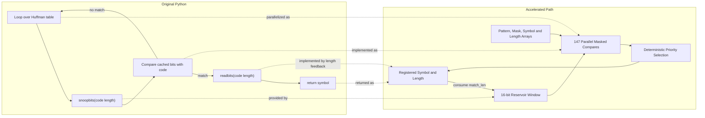
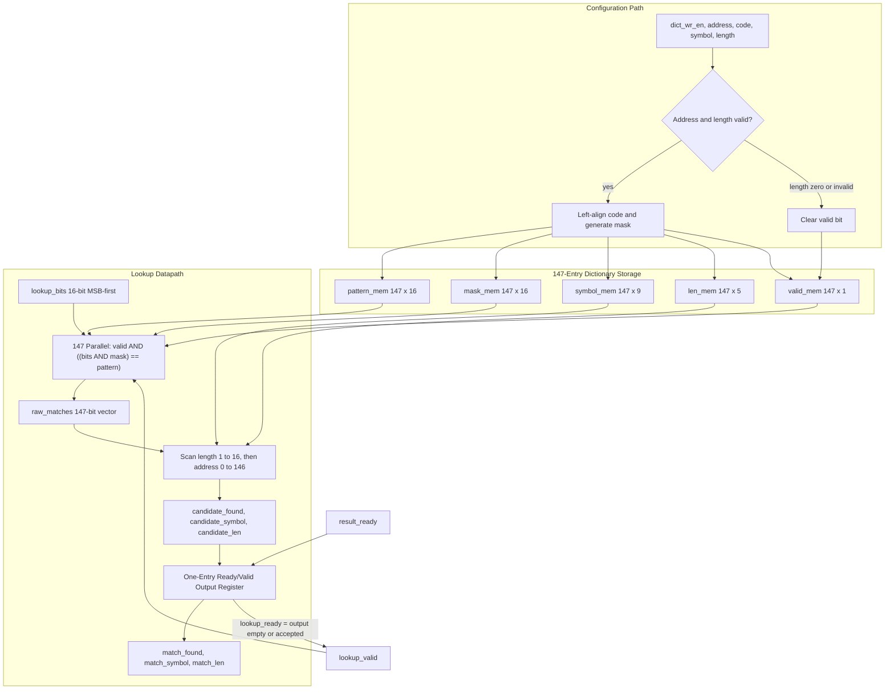
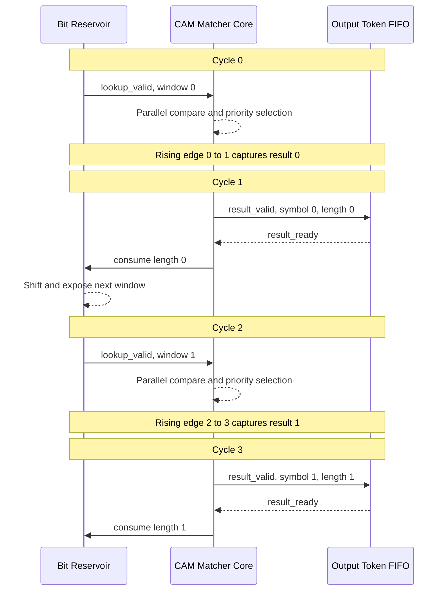
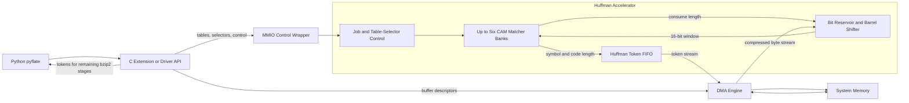
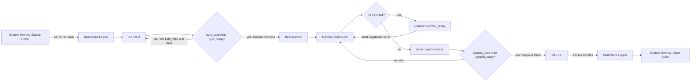
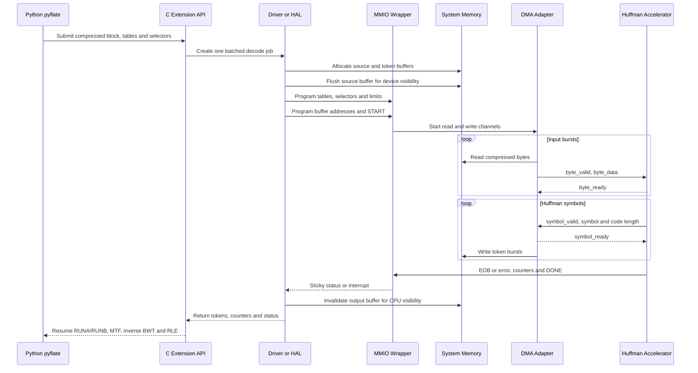
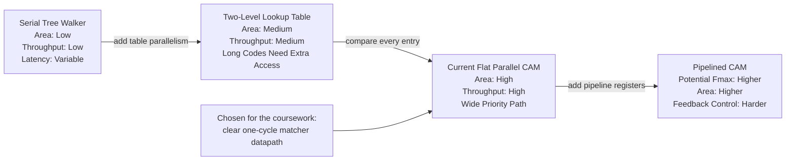

# הצעה למאיץ Hardware עבור `HuffmanTable.find_next_symbol`

## תיאור ה-Hardware

בחרנו להאיץ את `HuffmanTable.find_next_symbol` מתוך benchmark ה-`pyflate`. בכל קריאה הפונקציה עוברת באופן סדרתי על Huffman table, מבצעת `snoopbits` עבור אורכי code שונים, משווה את ה-bits לערכי ה-table, וכאשר נמצאת התאמה צורכת את מספר ה-bits המתאים באמצעות `readbits`. הפעולה חוזרת מספר רב של פעמים ולכן משלבת loop של Python, השוואות, branches וטיפול חוזר ב-bit buffer.

הפתרון המוצע הוא CAM-style Huffman matcher הממומש ב-SystemVerilog בקובץ [`huffman_find_simple.sv`](../huffman_find_simple.sv). ה-module שומר Huffman table אחד ובודק את כל ה-entries במקביל. עבור כל lookup הוא מחזיר את ה-`symbol` שנמצא ואת אורך ה-code שנצרך. זהו core מלא ולוגי עבור פעולת החיפוש עצמה; MMIO, DMA, bit reservoir ותמיכה במספר tables שייכים ל-system wrapper שסביבו ואינם ממומשים בקובץ זה.

ברירת המחדל היא `147` entries, חלון lookup של `16 bits` ו-`symbol` ברוחב `9 bits`. ערכים אלה מותאמים ל-input שנמדד. Decoder כללי יותר עשוי לדרוש parameters גדולים יותר.

### מהו `core`

המונח `core` אינו ראשי תיבות. בהקשר הזה הכוונה היא ליחידת החישוב המרכזית שמבצעת את הפעולה שאותה רוצים להאיץ. אצלנו ה-core הוא ה-module בשם `hardware_dictionary_accelerator`: הוא שומר Huffman table אחד, מבצע את ההשוואות המקביליות ומחזיר `match_symbol` ו-`match_len`. ה-core אינו כולל את כל המערכת שמסביבו. רכיבים כמו MMIO registers, ‏DMA, ‏bit reservoir, ‏FIFO, ‏interrupt logic וה-Driver נמצאים ב-system wrapper או ב-Software. אפשר לחשוב על ה-core כעל “המנוע” שמבצע את החישוב, ועל ה-wrapper כעל החלק שמחבר את המנוע למעבד, לזיכרון ולשאר המערכת.

## קוד ה-Software שמוחלף ומואץ

ההחלפה הישירה היא של הפונקציה הבאה בשורות `224–235` של
[`run_benchmark.py`](../suites/original/bm_pyflate/run_benchmark.py):

```python
def find_next_symbol(self, field, reversed=True):
    cached_length = -1
    cached = None
    for x in self.table:
        if cached_length != x.bits:
            cached = field.snoopbits(x.bits)
            cached_length = x.bits
        if (reversed and x.reverse_symbol == cached) or (not reversed and x.symbol == cached):
            field.readbits(x.bits)
            return x.code
    raise Exception("unfound symbol, even after end of table @%r"
                    % field.tell())
```

במסלול ה-bzip2 הפונקציה נקראת בשורה `425` כך:

```python
r = t.find_next_symbol(b, False)
```

ה-core מחליף ישירות את ה-loop, את ההשוואה ואת החזרת `x.code`. כאשר מוסיפים סביבו bit reservoir, הוא מחליף באותו מסלול גם את פעולות `RBitfield.snoopbits` בשורות `112–115` ואת `RBitfield.readbits` בשורות `117–122`. שאר `decode_huffman_block` אינו מוחלף: ה-Software עדיין מטפל ב-selectors, ‏`RUNA/RUNB`, ‏`move_to_front`, ‏EOB והשלבים המאוחרים של bzip2.

| פעולת Python | מימוש Hardware מקביל |
|---|---|
| `for x in self.table` | `147` comparators שפועלים במקביל. |
| `field.snoopbits(x.bits)` | חלון `lookup_bits[15:0]` שמגיע מה-bit reservoir. |
| השוואת `x.symbol == cached` | masked compare מול `pattern_mem[i]` ו-`mask_mem[i]`. |
| `field.readbits(x.bits)` | feedback של `match_len` לצריכת bits מה-reservoir. |
| `return x.code` | `match_symbol` יחד עם `result_valid`. |
| ה-`raise` במקרה שאין התאמה | `result_valid=1` יחד עם `match_found=0`; ה-wrapper מתרגם זאת ל-error. |



## Inputs ו-Outputs

כל הפעולות מסונכרנות ל-rising edge של `clk`. העברה בממשקי ה-stream מתבצעת כאשר `valid && ready` שווים ל-1 באותו cycle.

| Signal | כיוון | רוחב בברירת מחדל | תפקיד |
|---|---:|---:|---|
| `clk` | input | 1 | Clock של ה-core. |
| `rst_n` | input | 1 | Reset מסוג active-low; ה-assertion הוא asynchronous ויש לסנכרן deassertion ב-wrapper. |
| `dict_wr_en` | input | 1 | Strobe לכתיבת entry. |
| `dict_wr_addr` | input | 8 | כתובת entry בטווח `0..146`. |
| `dict_wr_code` | input | 16 | Huffman code מיושר לימין. |
| `dict_wr_symbol` | input | 9 | ה-symbol המשויך ל-code. |
| `dict_wr_len` | input | 5 | אורך code בטווח `1..16`; ערך `0` מבטל entry. |
| `lookup_valid` | input | 1 | מציין ש-`lookup_bits` תקף. |
| `lookup_ready` | output | 1 | מציין שה-core יכול לקבל lookup חדש. |
| `lookup_bits` | input | 16 | חלון MSB-first; bit 15 הוא ה-bit הבא ב-stream. |
| `result_valid` | output | 1 | מציין שתוצאת lookup רשומה ותקפה. |
| `result_ready` | input | 1 | מציין שה-consumer מוכן לקבל תוצאה. |
| `match_found` | output | 1 | האם נמצאה התאמה חוקית. |
| `match_symbol` | output | 9 | ה-Huffman symbol שנמצא. |
| `match_len` | output | 5 | מספר ה-bits שיש לצרוך מה-stream. |

### Expected operating frequency

תדר העבודה הצפוי שהגדרנו עבור התכנון הוא `200 MHz`. בחרנו clock period של `5 ns`, ולכן החישוב המלא הוא:

$$
\begin{aligned}
T_{clk,target} &= 5\text{ ns} = 5\times10^{-9}\text{ s} \\
f_{target} &= \frac{1}{T_{clk,target}} \\
           &= \frac{1}{5\times10^{-9}} \\
           &= 200\times10^{6}\text{ Hz} \\
           &= 200\text{ MHz}
\end{aligned}
$$

זהו design target ולא תוצאת מדידה. ה-`timescale 1ns/1ps` בקוד קובע רק את יחידות הזמן של ה-simulation ואינו קובע את תדר העבודה. כדי לדעת את התדר המרבי בפועל צריך לבצע synthesis, ‏place-and-route ו-Static Timing Analysis עבור FPGA או ASIC מוגדרים.

בחרנו ב-`200 MHz` משום שהוא מהווה נקודת התחלה סבירה עבור proof of concept עם `147` comparators, ‏priority logic ו-routing רחב. בנוסף, זהו התדר שמוגדר ב-clock constraint הקיים באמצעות period של `5 ns`. הבחירה אינה אומרת ש-`200 MHz` הוא התדר היחיד האפשרי או שהתכנון כבר הוכח בתדר זה. תדר נמוך יותר, למשל `100 MHz`, מקל על timing closure ומקטין בקירוב את ה-dynamic power, אך גם מקטין את ה-throughput. תדר גבוה יותר, למשל `300 MHz`, יכול להגדיל את ה-throughput, אך מקצר את הזמן המותר ל-critical path ועלול לחייב pipeline נוסף, יותר registers או שינוי ב-priority network.

ערך התדר משפיע על קצב הפענוח, על זמן העבודה ועל צריכת ההספק הדינמית:

$$
Throughput=\frac{f_{clk}}{II},\qquad
T_{job}=\frac{C_{job}}{f_{clk}},\qquad
P_{dynamic}\approx\alpha C V^2f_{clk}
$$

כאן `C_job` הוא מספר ה-clock cycles הדרוש לביצוע משימה מסוימת (`job`), ו-`T_job` הוא הזמן בשניות שלוקח להשלים אותה משימה. המונח `job` אינו חייב להיות קובץ שלם: הוא יכול להיות lookup יחיד, פענוח block אחד או כל שלב אחר שאנו מודדים. לדוגמה, אם פענוח block דורש `296,545 cycles` והמאיץ עובד ב-`200 MHz`, אז:

$$
\begin{aligned}
C_{job} &= 296{,}545\text{ cycles} \\
f_{clk} &= 200\text{ MHz}=200{,}000{,}000\text{ cycles/s} \\
T_{job} &= \frac{C_{job}}{f_{clk}} \\
        &= \frac{296{,}545\text{ cycles}}
                 {200{,}000{,}000\text{ cycles/s}} \\
        &= 0.001482725\text{ s} \\
        &= 1.482725\text{ ms}
\end{aligned}
$$

כאשר מדברים על מספר פעולות הפענוח בשנייה, הכוונה כאן היא למספר ה-Huffman symbols שהמאיץ יכול לזהות, ולא למספר קבצים או blocks שלמים. ה-matcher core לבדו יכול באופן עקרוני לקבל lookup בלתי תלוי בכל cycle (`II=1`), ולכן ב-`200 MHz` הגבול התיאורטי שלו הוא:

$$
\begin{aligned}
Throughput_{core} &= \frac{f_{clk}}{II} \\
                  &= \frac{200{,}000{,}000}{1} \\
                  &= 200{,}000{,}000\text{ symbols/s} \\
                  &= 200\text{ Msymbol/s}
\end{aligned}
$$

ב-wrapper הפשוט שלנו, החלון הבא תלוי ב-`match_len` של התוצאה הקודמת ולכן ההערכה השמרנית היא `II=2`. במקרה זה, ב-`200 MHz` מתקבלים:

$$
\begin{aligned}
Throughput_{system} &= \frac{f_{clk}}{II} \\
                    &= \frac{200{,}000{,}000}{2} \\
                    &= 100{,}000{,}000\text{ symbols/s} \\
                    &= 100\text{ Msymbol/s}
\end{aligned}
$$

בהנחה ש-`II=2` נשאר קבוע ושאין stalls, השפעת התדר היא לינארית:

| תדר עבודה | חישוב | קצב פענוח תיאורטי |
|---:|---:|---:|
| `100 MHz` | $100{,}000{,}000/2$ | `50 Msymbol/s` |
| `150 MHz` | $150{,}000{,}000/2$ | `75 Msymbol/s` |
| `200 MHz` | $200{,}000{,}000/2$ | `100 Msymbol/s` |
| `250 MHz` | $250{,}000{,}000/2$ | `125 Msymbol/s` |
| `300 MHz` | $300{,}000{,}000/2$ | `150 Msymbol/s` |

לדוגמה, העלאת התדר מ-`100 MHz` ל-`200 MHz` מכפילה באופן תיאורטי את קצב הפענוח מ-`50` ל-`100 Msymbol/s`, והורדת התדר מ-`200 MHz` ל-`150 MHz` מורידה אותו ל-`75 Msymbol/s`. יחס זה מתקיים רק כל עוד ה-memory, ה-DMA וה-consumer מסוגלים לספק ולקבל מידע בקצב הדרוש, וכל עוד backpressure אינו מוסיף cycles המתנה.

כל עוד ה-timing constraints מתקיימים, שינוי התדר אינו משנה איזה symbol נבחר אלא רק את הקצב שבו התוצאות מתקבלות. הגבול העליון של התדר נקבע על ידי ה-critical path, ה-routing delay, ה-fan-out, ‏setup time, ‏clock uncertainty, ה-speed grade של ה-device ותנאי voltage ו-temperature. מבחינה פונקציונלית אין ל-core גבול תחתון מיוחד, ולכן בדרך כלל ניתן להפעיל אותו גם בתדר נמוך יותר. עם זאת, מערכת אמיתית עשויה להציב minimum frequency בגלל מגבלות PLL, ‏DMA, ‏memory bandwidth, ‏timeouts או דרישת throughput. לכן `Fmax` ו-minimum system frequency נקבעים רק לאחר בחירת target device וביצוע timing analysis ברמת המערכת.

## Hardware architecture

בשלב ה-configuration, ה-Software מספק code מיושר לימין באורך `L`. עבור `W=16` ה-core יוצר ושומר:

$$
\begin{aligned}
pattern &= code \ll (W-L) \\
mask &= (2^W-1) \ll (W-L)
\end{aligned}
$$

כל entry כולל `pattern[15:0]`, ‏`mask[15:0]`, ‏`symbol[8:0]`, ‏`length[4:0]` ו-`valid`. בזמן lookup, כל `147` ה-entries משווים במקביל:

$$
raw\_match_i = lookup\_valid \land valid_i
\land \left((lookup\_bits \land mask_i)=pattern_i\right)
$$

לאחר מכן priority logic סורק תחילה אורכים קצרים ובשוויון בוחר address נמוך יותר. ב-Huffman table חוקי ה-codes הם prefix-free ולכן צפויה התאמה יחידה; ה-priority רק נותן התנהגות deterministic במקרה של configuration לא חוקי. התוצאה נשמרת ב-output register אחד. כאשר `result_ready=0`, ה-register מחזיק את כל שדות התוצאה יציבים ומפעיל backpressure דרך `lookup_ready`.

### כיצד המאיץ מבצע את המשימה

הפעולה של המאיץ פשוטה יחסית. תחילה ה-Software טוען את Huffman table ומקשר כל code ל-symbol ולאורך שלו. בזמן הפענוח, ה-bit reservoir מציג למאיץ את 16 ה-bits הבאים של ה-compressed stream דרך `lookup_bits`. המאיץ משדר את אותו חלון לכל `147` ה-comparators, וכל comparator בודק במקביל האם ה-prefix של הקלט מתאים ל-entry שלו. תוצאות ההשוואה נשמרות ב-`raw_matches`, ולאחר מכן ה-priority logic בוחר את ה-entry המתאים ומוציא את ה-`symbol` ואת אורך ה-code. התוצאה נשמרת ב-output register ונשלחת ל-wrapper באמצעות ready/valid handshake. לאחר שהתוצאה מתקבלת, ה-wrapper משתמש ב-`match_len` כדי להסיר מה-bit reservoir את מספר ה-bits שנצרכו, מציג חלון חדש וחוזר על אותה פעולה עבור ה-symbol הבא.



### התנהגות cycle-by-cycle

ה-output של ה-core רשום. אם הוא מחובר ל-producer שמסוגל לספק חלונות בלתי תלויים, ניתן לקבל lookup חדש בכל cycle. ב-system wrapper הפשוט, לעומת זאת, החלון הבא תלוי ב-`match_len` של התוצאה הקודמת. לכן הוא ממתין cycle אחד לצריכת ה-bits ומתקבל `II=2`.

### מהו `II`

`II` הוא קיצור של **Initiation Interval**. הוא מציין כמה clock cycles עוברים בין התחלה של שתי פעולות עוקבות. אם `II=1`, ניתן להתחיל lookup חדש בכל cycle; אם `II=2`, ניתן להתחיל lookup חדש פעם בשני cycles. חשוב להבדיל בין `II` לבין latency: ‏latency הוא הזמן מבקשה מסוימת ועד שהתוצאה שלה מופיעה, ואילו `II` קובע באיזו תדירות ניתן להתחיל בקשות חדשות. ה-matcher core יכול לקבל lookups בלתי תלויים ב-`II=1` כאשר `result_ready=1`, אבל ב-wrapper הפשוט החלון הבא תלוי ב-`match_len` של התוצאה הקודמת ולכן הנחנו `II=2`. בהתאם לכך, ב-`200 MHz` מתקבל throughput של $200\text{ MHz}/2=100\text{ Msymbol/s}$.



## בחירת תדר העבודה והערכת `Fmax`

הערך `200 MHz` לא התקבל ממדידה של ה-RTL, אלא נבחר כ-design target סביר ל-proof of concept עם CAM רחב, priority network ו-routing משמעותי. הוא מופיע ב-clock constraint הקיים:

```tcl
create_clock -name core_clk -period 5.000 [get_ports {clk}]
```

לפני synthesis אפשר לבנות רק timing budget. המסלול המשוער עובר מה-registers, דרך ה-CAM comparisons וה-priority logic, ועד result register. לכן:

$$
T_{clk,min} \geq T_{cq}+T_{CAM}+T_{priority}+T_{mux}
+T_{route}+T_{setup}+T_{uncertainty}
$$

עומק ה-reduction tree עבור השוואה ברוחב `16 bits` מוערך לפי:

$$
\begin{aligned}
D_{compare} &\approx \left\lceil \log_2(KEY\_WIDTH) \right\rceil \\
            &= \left\lceil \log_2(16) \right\rceil \\
            &= 4\text{ stages}
\end{aligned}
$$

אם ה-priority network ממומש כעץ מאוזן, העומק המשוער שלו הוא:

$$
\begin{aligned}
D_{priority} &\approx \left\lceil \log_2(NUM\_ENTRIES) \right\rceil \\
             &= \left\lceil \log_2(147) \right\rceil \\
             &= 8\text{ stages}
\end{aligned}
$$

ולכן ההערכה הבסיסית היא:

$$
F_{max,estimate}\approx\frac{1}{T_{clk,min}}
$$

הערכה זו אינה מספיקה כדי לטעון שהתדר הושג, מפני שה-RTL הנוכחי משתמש ב-nested loops והכלי עשוי לממש priority network שונה מעץ מאוזן. לאחר place-and-route משתמשים ב-critical path delay האמיתי:

$$
\begin{aligned}
T_{critical} &= T_{cq}+T_{logic}+T_{route}+T_{setup}+T_{uncertainty} \\
F_{max} &= \frac{1}{T_{critical}}
\end{aligned}
$$

לחלופין, אם timing report נותן `WNS` ביחס ל-constraint של `5 ns`, קירוב שימושי הוא:

$$
\begin{aligned}
T_{critical} &\approx T_{constraint}-WNS \\
F_{max} &\approx \frac{1}{T_{constraint}-WNS}
\end{aligned}
$$

לדוגמה, אם מתקבל `WNS = -0.8 ns`:

$$
\begin{aligned}
T_{critical} &\approx 5.0\text{ ns}-(-0.8\text{ ns}) \\
             &\approx 5.8\text{ ns} \\
F_{max} &\approx \frac{1}{5.8\times10^{-9}} \\
        &\approx 172.4\text{ MHz}
\end{aligned}
$$

במקרה כזה התכנון אינו עומד ב-`200 MHz`; יש להוריד תדר או לשפר את ה-priority path. אם `WNS >= 0`, ה-design עומד ב-constraint, אך עדיין יש לבדוק את כל ה-clocks וה-I/O constraints.

התדר משפיע ישירות על throughput ועל זמן ה-Hardware, ובעקיפין על power:

$$
\begin{aligned}
Throughput &= \frac{f_{clk}}{II} \\
T_{core} &= \frac{C_{core}}{f_{clk}} \\
P_{dynamic} &\approx \alpha C_{switched}V^2f_{clk}
\end{aligned}
$$

עבור `C_core=296,545 cycles` ו-`II=2`:

| `f_clk` | חישוב throughput | חישוב זמן core | משמעות |
|---:|---:|---:|---|
| `100 MHz` | `100*10^6 / 2 = 50 Msymbol/s` | `296,545 / (100*10^6) = 2.96545 ms` | timing קל יותר ו-dynamic power נמוך יותר. |
| `200 MHz` | `200*10^6 / 2 = 100 Msymbol/s` | `296,545 / (200*10^6) = 1.482725 ms` | נקודת העבודה שנבחרה. |
| `300 MHz` | `300*10^6 / 2 = 150 Msymbol/s` | `296,545 / (300*10^6) = 0.988483 ms` | מהיר יותר, אך קשה יותר לסגור timing ועלול לדרוש pipeline נוסף. |

## Hardware/Software interface

החלוקה המוצעת משאירה ב-Software את parsing ה-header, יצירת ה-Huffman tables ואת שלבי bzip2 המאוחרים, כגון `RUNA/RUNB`, ‏`move-to-front`, ‏`inverse BWT` ו-run-length decoding. ה-Hardware מחליף את חיפוש ה-symbol ואת קידום ה-bit stream. לצורך התקשורת נשתמש ב-`AXI4-Lite` או MMIO דומה עבור control, configuration ו-status, וב-DMA עם `AXI4` ו-`AXI4-Stream` עבור העברת compressed bytes ו-Huffman tokens. בתוך ה-Hardware, ערוצי ה-stream משתמשים ב-ready/valid handshake כדי לתמוך ב-backpressure בלי לאבד מידע.

כדי שה-overhead לא יבטל את ההאצה, אין לבצע MMIO call נפרד לכל symbol. במקום זאת, Python יקרא פעם אחת לכל compressed block ל-C/C++ extension או ל-driver, למשל:

```text
decode_huffman_symbols_hw(src, tables, selectors, start_bit, capacity)
    -> symbols, lengths, status
```

ה-driver יטען configuration באמצעות MMIO ויעביר את ה-compressed bytes ואת פלט ה-tokens ב-DMA. bit reservoir בתוך ה-wrapper יציג בכל פעם חלון `16-bit` ל-core ויצרוך `match_len` bits לאחר קבלת התוצאה. `match_symbol` הוא Huffman token ולא בהכרח byte סופי: הוא יכול להיות literal, ‏End Of Block או control symbol שה-Software צריך להמשיך לעבד.

ב-bzip2 קיימים עד שישה Huffman tables וה-selector עשוי להחליף table בכל 50 symbols. לכן integration יעיל דורש שישה banks או storage שמאפשר החלפה מיידית. ה-RTL שסופק מממש bank אחד; ה-multi-table wrapper וה-bit reservoir הם שכבת integration נדרשת סביבו.

### שכבת Driver וממשק Software

ה-Driver מספק שכבת Abstraction בין תוכנת `pyflate` לבין ה-system wrapper. הוא אחראי למיפוי ה-MMIO registers, להגדרת DMA buffers, לטיפול ב-cache coherence ולרישום interrupt handler. הפונקציות הבאות הן API מוצע לצורך ההסבר; הן אינן ממומשות בתוך `huffman_find_simple.sv`.

#### `huffman_accel_init`

```c
int huffman_accel_init(huffman_accel_t *dev);
```

הפונקציה מאתחלת את ההתקן לפני השימוש הראשון. ה-Driver ממפה את אזור ה-MMIO ל-virtual address space שלו, מגדיר את ערוצי ה-DMA ורושם interrupt handler אם המערכת משתמשת ב-interrupts. לאחר מכן הוא יכול להפעיל `SOFT_RESET` באמצעות control register. ה-reset התוכנתי צריך לאפס באופן סינכרוני את ה-FIFOs, ה-status registers וה-state של ה-wrapper; הוא אינו מתחבר ישירות ל-`rst_n` של ה-core.

#### `huffman_load_tables`

```c
int huffman_load_tables(
    huffman_accel_t *dev,
    const huffman_code_t *tables,
    size_t table_count,
    size_t entries_per_table,
    const uint8_t *selectors,
    size_t selector_count);
```

הפונקציה נקראת לפני פענוח block שמשתמש ב-Huffman tables חדשים. עבור כל entry ה-Software מעביר `table_id`, ‏`dict_wr_addr`, ‏`dict_wr_code`, ‏`dict_wr_symbol` ו-`dict_wr_len`. אין צורך להעביר `pattern`, ‏`mask` או `valid_mem`, משום שה-core מייצר ומנהל אותם בעצמו. עבור ה-workload הנוכחי ניתן לטעון עד שישה tables, שבכל אחד מהם עד `147` entries, יחד עם רשימת ה-selectors שקובעת איזה table פעיל בכל קבוצה של עד 50 symbols.

#### `huffman_decode_block_async`

```c
huffman_job_t *huffman_decode_block_async(
    huffman_accel_t *dev,
    const void *src,
    size_t src_size,
    void *dst_tokens,
    size_t dst_capacity,
    unsigned int start_bit,
    unsigned int eob_symbol);
```

הפונקציה מפעילה job אחד בצורה asynchronous. ה-Driver ממפה את ה-source ואת ה-destination באמצעות DMA API, כותב ל-MMIO את כתובות ה-buffers, הגדלים, `start_bit`, ‏EOB ופקודת `START`, ואז מחזיר ל-Software בלי לחכות לסיום. RX DMA מעביר compressed bytes ל-bit reservoir, וה-reservoir מייצר חלונות של `16 bits` עבור ה-CAM core. ‏TX DMA כותב ל-DRAM את Huffman tokens שהתקבלו. הפלט אינו הקובץ המפוענח הסופי, ולכן לאחר סיום ה-job ה-Software ממשיך את שלבי bzip2 הנותרים.

#### `huffman_wait`

```c
int huffman_wait(
    huffman_job_t *job,
    huffman_status_t *status);
```

הפונקציה ממתינה לסיום job שהופעל בצורה asynchronous. ה-wrapper שומר `DONE`, ‏`ERROR` ו-`ERROR_CODE` ב-sticky status registers, או מפעיל interrupt אם `IRQ_ENABLE` פעיל. לאחר הסיום ה-Driver מסנכרן את output buffer עבור ה-CPU, קורא את ה-counters ואת ה-status ומחזיר אותם ל-Software.



### התנהגות ה-DMA adapter

ה-DMA adapter מפריד בין AXI memory transactions הרחבות לבין ready/valid streams הצרים של ה-accelerator. בצד הקלט הוא מבצע burst reads וממלא RX FIFO. byte עובר ל-reservoir רק כאשר `byte_valid && byte_ready=1`. בצד הפלט token מתקבל רק כאשר `symbol_valid && symbol_ready=1`; כאשר TX FIFO מלא, ה-adapter מוריד את `symbol_ready` וכך מפעיל backpressure ללא איבוד מידע.



ה-adapter צריך גם לעקוב אחר source length, ‏destination capacity ו-end-of-stream. במקרה של AXI error, output overflow או input truncated הוא מפסיק issuing של transactions חדשים, מנקז או מבטל transactions שכבר outstanding, ושומר status עד שה-driver קורא ומאשר אותו.

### End-to-end transaction sequence



## הצדקת ההאצה והערכת performance

לדעתי `find_next_symbol` הוא מועמד טוב ל-Hardware acceleration מפני שאותה פעולה חוזרת מספר גדול מאוד של פעמים, והעבודה בכל איטרציה מתאימה למקביליות. ב-Software עוברים על Huffman table ומבצעים השוואות בזו אחר זו. ב-Hardware אפשר לשמור את ה-table קרוב ל-comparators ולבדוק את כל `147` ה-entries במקביל. בנוסף, גודל ה-state מוגבל, רוחב ה-code הוא רק `16 bits` בתכנון שלנו, והקלט והפלט מתאימים ל-batched streaming. כך ניתן לבצע קריאה אחת ל-Driver עבור block שלם במקום לבצע מעבר Software-to-Hardware עבור כל symbol.

נתוני ה-`perf` של ריצת ה-baseline המלאה מראים שהבחירה אינה מבוססת רק על השערה:

| נתון | ערך שנמדד |
|---|---:|
| זמן benchmark ממוצע | `662.236860 ms` |
| סך samples | `38,010` |
| self samples של `find_next_symbol` | `4,604` |
| inclusive samples של lookup subtree | `14,713` |
| מספר lookups ב-job | `148,271` |

תחילה מחשבים את החלק של `find_next_symbol` מתוך זמן הריצה. הנוסחה היא:

$$
p_{self}=\frac{N_{self}}{N_{total}}
$$

הצבת המספרים נותנת:

$$
\begin{aligned}
p_{self} &= \frac{4{,}604}{38{,}010} \\
         &= 0.121126 \\
         &= 12.1126\%
\end{aligned}
$$

את הזמן המשוער של החלק הזה מחשבים בעזרת:

$$
T_{self}=T_{total}\cdot p_{self}
$$

ולכן:

$$
\begin{aligned}
T_{self} &= 662.236860\text{ ms}\cdot0.121126 \\
         &= 80.2141\text{ ms}
\end{aligned}
$$

כאשר כוללים גם את `snoopbits`, ‏`readbits` ושאר עבודת ה-bit reader מתחת לקריאה, מקבלים:

$$
\begin{aligned}
p_{inclusive} &= \frac{14{,}713}{38{,}010} \\
              &= 0.387082 \\
              &= 38.7082\% \\
T_{inclusive} &= 662.236860\text{ ms}\cdot0.387082 \\
              &= 256.3402\text{ ms}
\end{aligned}
$$

כדי להעריך את זמן ה-Hardware, קודם מחשבים את זמן המילוי הראשוני של ה-bit reservoir. הנוסחה היא:

$$
C_{fill}=\left\lceil\frac{KEY\_WIDTH+start\_bit_{max}}{byte\_width}\right\rceil
$$

עבור הנתונים שלנו:

$$
\begin{aligned}
C_{fill} &= \left\lceil\frac{16+7}{8}\right\rceil \\
         &= \left\lceil\frac{23}{8}\right\rceil \\
         &= 3\text{ cycles}
\end{aligned}
$$

ב-wrapper הפשוט הנחנו `II=2 cycles/symbol`. מספר ה-cycles הכולל הוא:

$$
C_{core}=C_{fill}+N_{symbols}\cdot II
$$

ולכן:

$$
\begin{aligned}
C_{core} &= 3+148{,}271\cdot2 \\
         &= 3+296{,}542 \\
         &= 296{,}545\text{ cycles}
\end{aligned}
$$

ה-throughput התיאורטי מחושב לפי:

$$
Throughput=\frac{f_{clk}}{II}
$$

ב-`200 MHz`:

$$
\begin{aligned}
Throughput &= \frac{200{,}000{,}000}{2} \\
           &= 100{,}000{,}000\text{ symbols/s} \\
           &= 100\text{ Msymbol/s}
\end{aligned}
$$

זמן ה-core הוא:

$$
T_{core}=\frac{C_{core}}{f_{clk}}
$$

ולכן:

$$
\begin{aligned}
T_{core} &= \frac{296{,}545}{200{,}000{,}000} \\
         &= 0.001482725\text{ s} \\
         &= 1.482725\text{ ms}
\end{aligned}
$$

ה-speedup של ה-component עצמו הוא:

$$
\begin{aligned}
S_{component} &= \frac{T_{self}}{T_{core}} \\
              &= \frac{80.2141}{1.482725} \\
              &= 54.10\times
\end{aligned}
$$

כדי להעריך את השיפור של כל ה-benchmark משתמשים ב-Amdahl's law. בהערכה השמרנית מניחים שרק ה-self time מוחלף:

$$
S_{total,self}=\frac{1}{(1-p_{self})+\frac{p_{self}}{S_{component}}}
$$

אחרי הצבת המספרים:

$$
\begin{aligned}
S_{total,self} &= \frac{1}{(1-0.121126)+\frac{0.121126}{54.10}} \\
               &= \frac{1}{0.878874+0.002239} \\
               &= \frac{1}{0.881113} \\
               &= 1.13493\times
\end{aligned}
$$

בהערכה האופטימית מניחים שה-bit reservoir וה-batching מחליפים את כל ה-inclusive subtree:

$$
\begin{aligned}
T_{new,optimistic} &= T_{total}-T_{inclusive}+T_{core} \\
                   &= 662.236860-256.340198+1.482725 \\
                   &= 407.379387\text{ ms} \\
S_{total,optimistic} &= \frac{662.236860}{407.379387} \\
                     &= 1.62560\times
\end{aligned}
$$

לכן השיפור הצפוי לכל ה-benchmark נמצא בקירוב בין `1.135x` ל-`1.626x`. ההנחות המרכזיות הן שהמאיץ עובד ב-`200 MHz`, שה-wrapper מצליח לשמור על `II=2`, שאין stalls משמעותיים ב-DMA, ושכל `148,271` ה-lookups אכן עוברים דרך המאיץ. החישוב אינו כולל setup time, ‏MMIO, ‏DMA, ‏cache-coherence, interrupt או Driver overhead. לכן אלה estimates בלבד ולא תוצאות Hardware שנמדדו.

## Performance/Area/Power trade-offs

### Performance ותדר עבודה

היתרון המרכזי של התכנון הוא שכל `147` ה-entries נבדקים במקביל במקום לעבור עליהם ב-loop של Python. מצד שני, parallel comparison וה-priority network יוצרים מסלול combinational רחב שעלול להגביל את `Fmax`. תדר היעד שלנו הוא `200 MHz`, כלומר period של `5 ns`, כפי שחושב בסעיף ה-Inputs and Outputs. ב-wrapper הפשוט מתקבל `II=2`, ולכן קצב העיבוד הצפוי הוא:

$$
\begin{aligned}
Throughput &= \frac{f_{clk}}{II} \\
           &= \frac{200\text{ MHz}}{2} \\
           &= 100\text{ Msymbol/s}
\end{aligned}
$$

הוספת pipeline register יכולה לקצר את ה-critical path ולהעלות את התדר, אבל בזרם Huffman יחיד החלון הבא תלוי ב-`match_len` של ה-symbol הקודם. לכן pipeline נוסף עלול להגדיל גם את `II`. כדי לבדוק האם pipeline עדיין משפר את throughput משתמשים בתנאי:

$$
\frac{f_{new}}{II_{new}}\geq\frac{f_{old}}{II_{old}}
$$

לדוגמה, אם `II` עולה מ-2 ל-3 והתדר המקורי הוא `200 MHz`:

$$
\begin{aligned}
\frac{f_{new}}{3} &\geq \frac{200\text{ MHz}}{2} \\
f_{new} &\geq 300\text{ MHz}
\end{aligned}
$$

כלומר pipeline כזה צריך להגיע לפחות ל-`300 MHz` רק כדי לשמור על אותו throughput של `100 Msymbol/s`. מסיבה זו לא כדאי להוסיף pipeline לפני ש-timing report מראה שהמסלול הנוכחי אינו עומד ב-`200 MHz`.

### Area מול Performance

המחיר של המקביליות הוא area. כל entry שומר `pattern`, ‏`mask`, ‏`symbol`, ‏`length` ו-`valid`. מספר ה-storage bits ל-entry מחושב לפי:

$$
\begin{aligned}
B_{entry} &= B_{pattern}+B_{mask}+B_{symbol}+B_{length}+B_{valid} \\
          &= 16+16+9+5+1 \\
          &= 47\text{ bits/entry}
\end{aligned}
$$

עבור bank אחד עם `147` entries:

$$
\begin{aligned}
B_{one\ bank} &= NUM\_ENTRIES\cdot B_{entry} \\
              &= 147\cdot47 \\
              &= 6{,}909\text{ bits} \\
              &= \frac{6{,}909}{8}=863.625\text{ bytes} \\
              &= \frac{863.625}{1{,}024}=0.843\text{ KiB}
\end{aligned}
$$

אם ה-system wrapper משתמש בשישה banks כדי לעבור בין Huffman tables ללא טעינה מחדש:

$$
\begin{aligned}
N_{comparators} &= 6\cdot147=882 \\
B_{six\ banks} &= 6\cdot6{,}909 \\
               &= 41{,}454\text{ bits} \\
               &= \frac{41{,}454}{8\cdot1{,}024} \\
               &= 5.06\text{ KiB}
\end{aligned}
$$

רשימת ה-selectors מוסיפה:

$$
\begin{aligned}
B_{selectors} &= 2{,}966\cdot3 \\
              &= 8{,}898\text{ bits} \\
              &= \frac{8{,}898}{8\cdot1{,}024} \\
              &= 1.086\text{ KiB}
\end{aligned}
$$

החישובים האלה מתארים רק storage bits. הם אינם כוללים את area של ה-comparators, ה-priority logic, ה-routing, ה-FIFOs, ה-DMA וה-control logic. את מספר ה-LUTs, ה-registers או ה-gates ניתן לקבל רק לאחר synthesis. חלופה חסכונית יותר היא two-level lookup table: קודים קצרים מוחזרים מגישה ראשונה, וקודים ארוכים דורשים גישה נוספת. פתרון כזה עשוי להשתמש ב-BRAM ולחסוך comparators, אך הוא יוצר latency משתנה ועלול להקטין throughput.

### Power consumption

אין עדיין target FPGA או ASIC ותוצאות power analysis, ולכן אי אפשר לתת ערך אמין ב-Watts. אפשר רק להסביר את הקשרים המרכזיים. ה-dynamic power מוערך לפי:

$$
P_{dynamic}\approx\alpha C_{switched}V^2f_{clk}
$$

ה-total power וה-energy ל-job הם:

$$
\begin{aligned}
P_{total} &= P_{static}+P_{dynamic} \\
E_{job} &= P_{average}\cdot T_{job}
\end{aligned}
$$

ה-CAM מבצע השוואות רבות במקביל ולכן מגדיל את ה-switched capacitance. מצד שני, הוא מסיים את ה-lookup בפחות cycles. לכן ייתכן שה-instantaneous power יהיה גבוה יותר, אך ה-energy הכולל לא בהכרח יהיה גבוה יותר. צריך למדוד גם את ה-power וגם את זמן הריצה.

אם מניחים שה-voltage, ה-capacitance וה-switching activity אינם משתנים, העלאת התדר מ-`100 MHz` ל-`200 MHz` נותנת:

$$
\begin{aligned}
\frac{P_{dynamic,200}}{P_{dynamic,100}}
&\approx
\frac{\alpha CV^2\cdot200\text{ MHz}}
     {\alpha CV^2\cdot100\text{ MHz}} \\
&\approx 2
\end{aligned}
$$

כלומר dynamic power עשוי לגדול בקירוב פי שניים, בעוד שזמן העבודה עשוי לרדת בקירוב לחצי. בפועל ה-capacitance וה-switching activity עשויים להשתנות כאשר משנים implementation, ולכן נדרש post-implementation power report. הקוד הנוכחי מפחית switching בעזרת `lookup_valid` ו-`valid_mem`, אך זוהי operand isolation ולא Clock Gating פיזי. ב-FPGA עדיף להשתמש ב-clock enable של ה-device ולא ליצור gated clock באמצעות logic רגיל.



ה-CAM השטוח נבחר מפני שהוא מציג באופן ברור את רעיון ה-Hardware acceleration ומבטל את ה-loop הסדרתי. עבור מוצר אמיתי, synthesis עשוי להראות ש-two-level table או balanced and pipelined priority tree נותנים יחס טוב יותר בין throughput, ‏area ו-power.

### הסבר קצר למונחים

**Backpressure** הוא מצב שבו ה-consumer אינו מוכן לקבל תוצאה ולכן הוא מוריד את `ready`. במקרה כזה ה-producer חייב לשמור את `valid` ואת הנתונים יציבים עד שההעברה מתאפשרת. **Latency** הוא מספר ה-cycles מרגע כניסת בקשה ועד הופעת התוצאה, ואילו **throughput** הוא מספר התוצאות שניתן להפיק ביחידת זמן. **II**, או Initiation Interval, הוא מספר ה-cycles בין התחלה של שתי פעולות עוקבות; בתכנון הפשוט שלנו `II=2`. ‏**Critical path** הוא המסלול combinational הארוך ביותר בין registers, והוא זה שמגביל את `Fmax`. ‏**Fmax** הוא תדר ה-clock המרבי שבו כל אילוצי ה-timing מתקיימים. ‏**Operand isolation** מפחית switching על ידי חסימת inputs של לוגיקה שאינה פעילה, בעוד **Clock Gating** עוצר את ה-clock לרכיבים לא פעילים ודורש implementation בטוח שמתאים ל-target technology.

הערכת LUTs, gates ו-power אמינה דורשת synthesis ו-switching activity על FPGA או ASIC מוגדרים. לכן אין לייחס לתכנון ערכי area או power מספריים מעבר לחישובי ה-storage לפני ביצוע הכלים הללו.

## סיכום ומגבלות

ההצעה שומרת על הגישה המקורית של CAM מקבילי ומיישרת אותה עם ה-SystemVerilog הקיים: code מיושר לימין, יצירת mask פנימית, `147` entries ו-interface מלא של ready/valid. ה-core מספק מימוש טוב מספיק של `find_next_symbol`, אך system acceleration של ה-benchmark דורש בנוסף bit reservoir, בחירה מהירה בין עד שישה tables ו-batched DMA interface. כמו כן, `200 MHz`, ‏speedup, ‏area ו-power הם targets או estimates עד לביצוע synthesis ומדידה.

## מקורות בפרויקט

- [`HuffmanTable.find_next_symbol` והקריאות אליו](../suites/original/bm_pyflate/run_benchmark.py)
- [מימוש ה-SystemVerilog של ה-CAM matcher](../huffman_find_simple.sv)
- [תוצאות timing של ה-baseline](../results/pyflate/original/original%20results%20full%20run/timing.json)
- [נתוני ה-profiling של ה-baseline](../results/pyflate/original/original%20results%20full%20run/speedscope.folded)
- [Characterization והנחות התכנון](../hardware/pyflate_v2/SIMPLIFIED_HUFFMAN_DESIGN.md)
- [Clock constraint של 5 ns](../hardware/pyflate_v2/constraints/huffman_find_simple_top.xdc)
