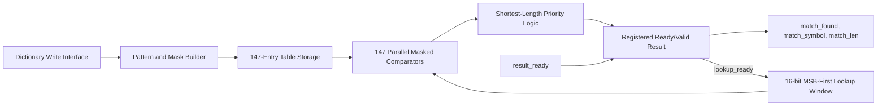
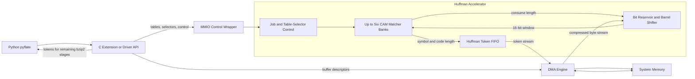

# הצעה למאיץ Hardware עבור `HuffmanTable.find_next_symbol`

## תיאור ה-Hardware

בחרנו להאיץ את `HuffmanTable.find_next_symbol` מתוך benchmark ה-`pyflate`. בכל קריאה הפונקציה עוברת באופן סדרתי על Huffman table, מבצעת `snoopbits` עבור אורכי code שונים, משווה את ה-bits לערכי ה-table, וכאשר נמצאת התאמה צורכת את מספר ה-bits המתאים באמצעות `readbits`. הפעולה חוזרת מספר רב של פעמים ולכן משלבת loop של Python, השוואות, branches וטיפול חוזר ב-bit buffer.

הפתרון המוצע הוא CAM-style Huffman matcher הממומש ב-SystemVerilog בקובץ [`huffman_find_simple.sv`](../huffman_find_simple.sv). ה-module שומר Huffman table אחד ובודק את כל ה-entries במקביל. עבור כל lookup הוא מחזיר את ה-`symbol` שנמצא ואת אורך ה-code שנצרך. זהו core מלא ולוגי עבור פעולת החיפוש עצמה; MMIO, DMA, bit reservoir ותמיכה במספר tables שייכים ל-system wrapper שסביבו ואינם ממומשים בקובץ זה.

ברירת המחדל היא `147` entries, חלון lookup של `16 bits` ו-`symbol` ברוחב `9 bits`. ערכים אלה מותאמים ל-input שנמדד. Decoder כללי יותר עשוי לדרוש parameters גדולים יותר.

## Inputs ו-Outputs

כל הפעולות מסונכרנות ל-rising edge של `clk`. העברה בממשקי ה-stream מתבצעת כאשר `valid && ready` שווים ל-1 באותו cycle.

| Signal | כיוון | רוחב בברירת מחדל | תפקיד |
|---|---:|---:|---|
| `clk` | input | 1 | Clock של ה-core. |
| `rst_n` | input | 1 | Reset מסוג active-low; ה-assertion הוא asynchronous ויש לסנכרן deassertion ב-wrapper. |
| `dict_wr_en` | input | 1 | Strobe לכתיבת entry. |
| `dict_wr_addr` | input | 8 | כתובת entry בטווח `0..146`. |
| `dict_wr_code` | input | 16 | Huffman code מיושר לימין. |
| `dict_wr_symbol` | input | 9 | ה-symbol המשויך ל-code. |
| `dict_wr_len` | input | 5 | אורך code בטווח `1..16`; ערך `0` מבטל entry. |
| `lookup_valid` | input | 1 | מציין ש-`lookup_bits` תקף. |
| `lookup_ready` | output | 1 | מציין שה-core יכול לקבל lookup חדש. |
| `lookup_bits` | input | 16 | חלון MSB-first; bit 15 הוא ה-bit הבא ב-stream. |
| `result_valid` | output | 1 | מציין שתוצאת lookup רשומה ותקפה. |
| `result_ready` | input | 1 | מציין שה-consumer מוכן לקבל תוצאה. |
| `match_found` | output | 1 | האם נמצאה התאמה חוקית. |
| `match_symbol` | output | 9 | ה-Huffman symbol שנמצא. |
| `match_len` | output | 5 | מספר ה-bits שיש לצרוך מה-stream. |

תדר העבודה המוצע הוא `200 MHz`, כלומר clock period של `5 ns`. זהו design target בלבד. `timescale 1ns/1ps` מגדיר resolution ל-simulation ואינו מוכיח את התדר. קביעת `Fmax` מחייבת synthesis, place-and-route ו-Static Timing Analysis על target technology מוגדר.

## Hardware architecture

בשלב ה-configuration, ה-Software מספק code מיושר לימין באורך `L`. עבור `W=16` ה-core יוצר ושומר:

```text
pattern = code << (W-L)
mask    = 0xFFFF << (W-L)
```

כל entry כולל `pattern[15:0]`, ‏`mask[15:0]`, ‏`symbol[8:0]`, ‏`length[4:0]` ו-`valid`. בזמן lookup, כל `147` ה-entries משווים במקביל:

```text
raw_match[i] = lookup_valid
             && valid[i]
             && ((lookup_bits & mask[i]) == pattern[i])
```

לאחר מכן priority logic סורק תחילה אורכים קצרים ובשוויון בוחר address נמוך יותר. ב-Huffman table חוקי ה-codes הם prefix-free ולכן צפויה התאמה יחידה; ה-priority רק נותן התנהגות deterministic במקרה של configuration לא חוקי. התוצאה נשמרת ב-output register אחד. כאשר `result_ready=0`, ה-register מחזיק את כל שדות התוצאה יציבים ומפעיל backpressure דרך `lookup_ready`.



## Hardware Software interface

החלוקה המוצעת משאירה ב-Software את parsing ה-header, יצירת ה-Huffman tables ואת שלבי bzip2 המאוחרים, כגון `RUNA/RUNB`, ‏`move-to-front`, ‏`inverse BWT` ו-run-length decoding. ה-Hardware מחליף את חיפוש ה-symbol ואת קידום ה-bit stream.

כדי שה-overhead לא יבטל את ההאצה, אין לבצע MMIO call נפרד לכל symbol. במקום זאת, Python יקרא פעם אחת לכל compressed block ל-C/C++ extension או ל-driver, למשל:

```text
decode_huffman_symbols_hw(src, tables, selectors, start_bit, capacity)
    -> symbols, lengths, status
```

ה-driver יטען configuration באמצעות MMIO ויעביר את ה-compressed bytes ואת פלט ה-tokens ב-DMA. bit reservoir בתוך ה-wrapper יציג בכל פעם חלון `16-bit` ל-core ויצרוך `match_len` bits לאחר קבלת התוצאה. `match_symbol` הוא Huffman token ולא בהכרח byte סופי: הוא יכול להיות literal, ‏End Of Block או control symbol שה-Software צריך להמשיך לעבד.

ב-bzip2 קיימים עד שישה Huffman tables וה-selector עשוי להחליף table בכל 50 symbols. לכן integration יעיל דורש שישה banks או storage שמאפשר החלפה מיידית. ה-RTL שסופק מממש bank אחד; ה-multi-table wrapper וה-bit reservoir הם שכבת integration נדרשת סביבו.



## הצדקת ההאצה והערכת performance

ה-profiling של ריצת ה-baseline המלאה מראה זמן ממוצע של `662.24 ms`. ל-`find_next_symbol` מיוחסים `4,604` self samples מתוך `38,010`, כלומר `12.113%` או כ-`80.21 ms`. כאשר כוללים את פעולות ה-bit reader שמתחתיה, ה-inclusive subtree הוא `14,713` samples, כלומר `38.708%` או כ-`256.34 ms`. בנוסף, instrumentation של ה-workload מצא `148,271` lookups ב-job אחד. לכן גם פעולה קטנה יחסית לכל symbol מצטברת לעלות משמעותית.

ה-core עצמו יכול לקבל lookup חדש בכל cycle כל עוד ה-output מתקבל מיד. עם wrapper פשוט שבו `match_len` חוזר ל-bit reservoir, ההערכה השמרנית היא `II=2 cycles/symbol`. ב-`200 MHz` מתקבל throughput תיאורטי של `100 Msymbol/s`, ול-`148,271` symbols זמן core של כ-`1.48 ms`, לפני MMIO, DMA, cache-coherence ו-driver overhead.

לפי Amdahl's law, החלפה של self time בלבד נותנת speedup כולל מוערך של כ-`1.135x`. אם ה-reservoir וה-batching מחליפים גם את רוב ה-inclusive bit-reader subtree, הגבול האופטימי הוא כ-`1.626x`. הטווח `1.135x–1.626x` הוא תחזית המבוססת על profiling והנחות ארכיטקטוניות, ולא measurement של Hardware.

## Performance Area Power trade-offs

| החלטה | יתרון | מחיר או מגבלה |
|---|---|---|
| `147` parallel comparators | lookup קבוע ומהיר במקום loop סדרתי | area, routing ו-dynamic power גבוהים יותר. |
| `KEY_WIDTH=16` ו-`147` entries | התאמה יעילה ל-workload שנמדד | אינו Decoder כללי לכל קובץ bzip2. |
| Output register עם ready/valid | תוצאה יציבה תחת backpressure ו-interface ברור | מוסיף cycle של latency; feedback ב-wrapper עשוי ליצור `II=2`. |
| Priority logic שטוח | מימוש פשוט ו-deterministic | עשוי להיות critical path; balanced tree יכול לשפר timing. |
| שישה banks ב-system wrapper | table switch מיידי כל 50 symbols | עד `882` comparators ו-area גדול פי שישה. |
| הפעלת comparison רק כאשר `lookup_valid=1` | מפחיתה switching מיותר | אינה מחליפה Clock Gating פיזי. |
| MMIO ל-control ו-DMA ל-data | overhead מתחלק על block שלם | דורש wrapper, driver ו-cache-coherence נכונים. |

ב-core יחיד נשמרים בקירוב `147 × 47 = 6,909 bits` של table state, בנוסף ל-output registers ול-control. הערכת LUTs, gates ו-power אמינה דורשת synthesis ופעילות switching על FPGA או ASIC מוגדרים. לכן אין לייחס לתכנון ערכי area או power מספריים לפני ביצוע הכלים הללו.

## סיכום ומגבלות

ההצעה שומרת על הגישה המקורית של CAM מקבילי ומיישרת אותה עם ה-SystemVerilog הקיים: code מיושר לימין, יצירת mask פנימית, `147` entries ו-interface מלא של ready/valid. ה-core מספק מימוש טוב מספיק של `find_next_symbol`, אך system acceleration של ה-benchmark דורש בנוסף bit reservoir, בחירה מהירה בין עד שישה tables ו-batched DMA interface. כמו כן, `200 MHz`, ‏speedup, ‏area ו-power הם targets או estimates עד לביצוע synthesis ומדידה.

## מקורות בפרויקט

- [`HuffmanTable.find_next_symbol` והקריאות אליו](../suites/original/bm_pyflate/run_benchmark.py)
- [מימוש ה-SystemVerilog של ה-CAM matcher](../huffman_find_simple.sv)
- [תוצאות timing של ה-baseline](../results/pyflate/original/original%20results%20full%20run/timing.json)
- [נתוני ה-profiling של ה-baseline](../results/pyflate/original/original%20results%20full%20run/speedscope.folded)
- [Characterization והנחות התכנון](../hardware/pyflate_v2/SIMPLIFIED_HUFFMAN_DESIGN.md)
- [Clock constraint של 5 ns](../hardware/pyflate_v2/constraints/huffman_find_simple_top.xdc)
