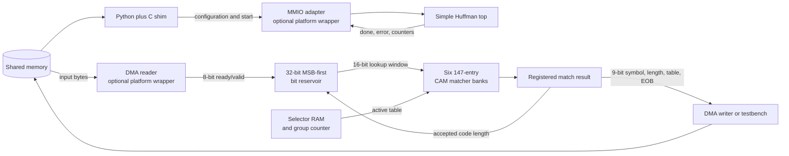

# Simplified Pyflate Huffman Accelerator Design

## Scope and result status

This design accelerates the original benchmark's MSB-first
`HuffmanTable.find_next_symbol` work. It deliberately supports the measured
workload rather than general bzip2 or DEFLATE:

- six Huffman tables;
- 147 entries per table;
- code lengths from 1 through 16 (the benchmark uses 2 through 15);
- 2,966 selectors, with one selector per group of 50 non-EOB symbols; and
- nine-bit decoded symbols.

The SystemVerilog defines a complete bus-independent datapath and controller.
It has not been synthesized, placed, routed, or run in an RTL simulator in the
current environment. Hardware timing, area, power, and speed figures below are
therefore **analytical estimates**, not measurements.

The software baseline and workload counts are **measured** values documented in
`HUFFMAN_FIND_ACCELERATOR.md`, derived from
`results/pyflate/original/perf_report.txt`, the benchmark timing results, and
`tools/characterize_workload.py`.

## Why this function is accelerated

The original implementation repeatedly scans a Python list, snoops increasingly
long prefixes, compares Python objects, and finally advances the bitfield. Its
source is `../../suites/original/bm_pyflate/run_benchmark.py`, lines 224–235,
and the bzip2 call site is at lines 417–443.

Measured/derived baseline quantities are:

| Quantity | Value | Status |
|---|---:|---|
| Original mean benchmark time | 662.237 ms/job | mean of 60 measured full-run values |
| Self/exclusive `find_next_symbol` share | 12.11% | 4,604 / 38,010 folded-stack samples |
| Self/exclusive function time | 80.21 ms/job | calculated from measured values |
| Inclusive `find_next_symbol` share | 38.71% | 14,713 / 38,010 folded-stack samples |
| Inclusive lookup-subtree time | 256.34 ms/job | calculated from measured values |
| Lookup calls/symbols including EOB | 148,271/job | measured instrumentation |
| Compressed input | 67,562 bytes/job | measured file size |

Timing comes from `../../results/pyflate/original/original results full
run/timing.json`. Profile counts come from the weighted stacks in
`../../results/pyflate/original/original results full run/speedscope.folded`;
the denominator is samples containing `py::bench_pyflake`, inclusive samples
contain `py::HuffmanTable.find_next_symbol`, and self samples have that function
as the deepest Python frame. The profiler setup is recorded in the adjacent
`run_metadata.txt`.

The time calculation is:

```text
T_self [ms] = T_total [ms] * (4,604 / 38,010)
            = 662.237 ms * 0.121126
            = 80.21 ms

T_inclusive [ms] = T_total [ms] * (14,713 / 38,010)
                 = 662.237 ms * 0.387082
                 = 256.34 ms
```

Self/exclusive time counts only execution in `find_next_symbol`; inclusive time
also counts its called bitfield operations on that call path. The RTL matcher
alone maps most directly to 80.21 ms. The complete batched design also contains
the reservoir and bit-consumption logic, so 256.34 ms is its optimistic
removable software scope, not a guaranteed saving.

The function is a strong hardware candidate because the same operation is
repeated 148,271 times, the tables are small, every table entry can be compared
in parallel, and each result directly states how many input bits to consume.
The unavoidable software work after Huffman decoding limits whole-program
speedup, so this is an accelerator rather than a complete decompressor.

## Hardware organization



The implemented modules are:

| Module | Responsibility |
|---|---|
| `rtl/huffman_find_simple.sv` | One 147-entry CAM table and registered result |
| `rtl/huffman_find_six_table.sv` | Six banks, table programming, active-bank mux, operand isolation |
| `rtl/huffman_bit_reservoir.sv` | Byte input, starting offset, 32-bit left-aligned bit buffer |
| `rtl/huffman_find_simple_top.sv` | Selectors, job control, EOB, errors, and counters |

## Functional operation

### Configuration

Software programs every table entry with:

```text
table_id       3 bits
entry_address  8 bits, legal range 0..146
code           16 bits, right aligned
symbol          9 bits
code_length     5 bits, legal range 0..16
```

For code `101` of length 3, the matcher stores:

```text
shift          = KEY_WIDTH - code_length = 16 - 3 = 13 bits
stored_pattern = 0x0005 << 13 = 0xA000
stored_mask    = 0xFFFF << 13 = 0xE000 after 16-bit truncation
```

Length zero invalidates an entry. A nonzero length above 16 and any address
above 146 are rejected. The mask is generated internally so software cannot
provide a pattern/mask pair with inconsistent alignment.

Selectors are three-bit table IDs written in ascending address order. The top
tracks the contiguous number loaded and refuses a job whose `selector_count`
exceeds that number.

### Streaming decode

1. `start` clears the reservoir and latches `start_bit`, selector count, EOB,
   and output capacity.
2. Accepted input bytes are appended to the right of valid reservoir bits.
   `start_bit=0` selects the first byte's MSB; values 1 through 7 discard that
   many leading bits from only the first byte.
3. When enough bits are present, the active CAM bank compares all 147 entries.
   For entry `i`:

   ```text
   entry_match[i] = valid[i] AND
                    ((lookup_bits AND mask[i]) == pattern[i])
   ```

4. A shortest-first priority encoder selects the first matching length and
   registers `(found, symbol, length)`.
5. When the consumer accepts that result, the reservoir shifts left by the
   returned length and `bits_consumed` increases by the same amount.
6. Each accepted non-EOB symbol increments the 0–49 group counter. Acceptance
   of symbol 50 resets the counter and selects the next table.
7. EOB is emitted like any other symbol. `done` pulses only when EOB is
   accepted, ensuring it cannot be lost during output backpressure.

The reservoir can consume a symbol and append one byte on the same clock edge.
After `byte_last`, a partial lookup window is padded with zeros, but the top
rejects a returned code whose length exceeds the number of real buffered bits.

### Ready/valid rule

For every channel:

```text
transfer_on_clock_edge = valid AND ready
```

The producer must keep `valid` and its payload stable until transfer. The
consumer may lower `ready` at any time. The registered matcher holds its symbol,
length, and found flag while stalled. Selector and reservoir state advance only
on accepted outputs.

The simple top permits only one outstanding lookup. It takes one clock to
register a match and a second clock to accept it and consume bits, giving an
initiation interval of two cycles per symbol. This is easier to verify than
speculatively forming the next lookup through a variable-length feedback path.

## External RTL interface

The ports below belong to `huffman_find_simple_top`. All transfers occur on the
rising edge of `clk`; reset is active-low.

| Group | Signal | Width | Direction | Meaning |
|---|---|---:|---|---|
| Clock | `clk`, `rst_n` | 1 each | input | Clock and asynchronous active-low reset |
| Config | `cfg_ready` | 1 | output | Configuration accepted only while high/idle |
| Table config | `dict_wr_en` | 1 | input | One-cycle entry-write request |
| Table config | `dict_wr_table` | 3 | input | Table 0..5 |
| Table config | `dict_wr_addr` | 8 | input | Entry 0..146 |
| Table config | `dict_wr_code` | 16 | input | Right-aligned canonical code |
| Table config | `dict_wr_symbol` | 9 | input | Decoded symbol |
| Table config | `dict_wr_len` | 5 | input | Code length; zero invalidates |
| Selector config | `selector_wr_en` | 1 | input | One-cycle selector write |
| Selector config | `selector_wr_addr` | 12 | input | Selector address 0..2965 |
| Selector config | `selector_wr_table` | 3 | input | Selected table 0..5 |
| Job | `start` | 1 | input | One-cycle start pulse while idle |
| Job | `start_bit` | 3 | input | Leading bits skipped in first byte |
| Job | `selector_count` | 12 | input | Number of valid selectors |
| Job | `eob_symbol` | 9 | input | End-of-block symbol value |
| Job | `symbol_capacity` | 32 | input | Maximum outputs including EOB |
| Input | `byte_valid`, `byte_ready` | 1 each | input/output | Byte-stream handshake |
| Input | `byte_data`, `byte_last` | 8, 1 | input | Byte and final-buffer marker |
| Output | `symbol_valid`, `symbol_ready` | 1 each | output/input | Result-stream handshake |
| Output | `symbol` | 9 | output | Decoded Huffman symbol |
| Output | `code_length` | 5 | output | Bits consumed for this symbol |
| Output | `table_id`, `symbol_eob` | 3, 1 | output | Source table and EOB marker |
| Status | `busy`, `done`, `error` | 1 each | output | Job state; `done` is a pulse |
| Status | `error_code` | 8 | output | First terminal error category |
| Counters | `bits_consumed`, `symbols_produced` | 32 each | output | Accepted work; EOB is included |
| Counters | `cycle_count` | 64 | output | Busy clock cycles |
| Counters | `input_stall_cycles` | 32 | output | Ready for a byte but none offered |
| Counters | `output_stall_cycles` | 32 | output | Symbol valid while consumer not ready |

Terminal errors are bad configuration (`0x02`), truncated input (`0x04`), no
matching code (`0x05`), invalid/exhausted selectors (`0x06`), and output
capacity overflow (`0x07`).

## MMIO and DMA integration

### What MMIO means here

Memory-mapped I/O (MMIO) exposes accelerator control registers at fixed CPU
addresses. A CPU store to `CONTROL` is delivered to device logic rather than
ordinary RAM; a load from `STATUS` reads hardware state. AXI4-Lite on an FPGA
SoC is one common transport, but the logical register behavior is bus-neutral.

MMIO is appropriate for a few job-level values because it is simple and
ordered. It is inefficient for 148,271 symbol transactions because every access
requires CPU instructions and bus handshaking.

A proposed platform wrapper can use this register map:

| Offset | Register | Access | Purpose |
|---:|---|---|---|
| `0x000` | `ID` | RO | Accelerator identity |
| `0x004` | `VERSION` | RO | Interface version |
| `0x008` | `CONTROL` | WO | Bit 0 starts one job |
| `0x00C` | `STATUS` | RO | Busy, done, and error bits |
| `0x010` | `ERROR_CODE` | RO | Terminal error code |
| `0x020/024` | `SRC_ADDR_LO/HI` | RW | DMA source address |
| `0x028` | `SRC_LENGTH` | RW | Available compressed bytes |
| `0x02C` | `START_BIT` | RW | Initial 0..7 bit offset |
| `0x030/034` | `TABLE_ADDR_LO/HI` | RW | Packed table configuration address |
| `0x038/03C` | `SELECTOR_ADDR_LO/HI` | RW | Selector array address |
| `0x040` | `SELECTOR_COUNT` | RW | 1..2966 |
| `0x048` | `EOB_SYMBOL` | RW | Nine-bit EOB value |
| `0x050/054` | `DST_ADDR_LO/HI` | RW | Packed-symbol destination |
| `0x058` | `DST_CAPACITY` | RW | Symbol capacity including EOB |
| `0x060` | `BITS_CONSUMED` | RO | Exact logical input advance |
| `0x064` | `SYMBOLS_PRODUCED` | RO | Outputs including EOB |
| `0x068/06C` | `CYCLE_COUNT_LO/HI` | RO | Accelerator active cycles |
| `0x070` | `INPUT_STALLS` | RO | Input starvation opportunities |
| `0x074` | `OUTPUT_STALLS` | RO | Output backpressure cycles |

This MMIO adapter is not implemented because it is platform-specific and not
required by the project. In RTL simulation, a testbench drives the top-level
configuration and stream ports directly.

### What DMA means here

Direct memory access (DMA) moves a block between system memory and the
accelerator without one CPU operation per byte or symbol. A read DMA engine
turns the source buffer into `byte_valid/byte_ready/byte_data/byte_last`. A
write DMA engine accepts the output stream and writes each nine-bit symbol in a
16-bit memory slot.

One benchmark job transfers approximately:

```text
input payload  = 67,562 bytes
output payload = 148,271 symbols × 2 bytes/symbol
               = 296,542 bytes
table payload  = 6 × 147 entries × 4 packed bytes/entry
               = 3,528 bytes
selector data  = 2,966 selectors × 1 byte/selector
               = 2,966 bytes
```

Tables and selectors total only 6,494 bytes and may be cached across repeated
benchmark runs. For a real system, bulk loading or DMA is preferable to 3,848
individual MMIO writes. For the course model, one configuration entry per clock
is sufficient and easy to demonstrate.

A real driver would pin or map user buffers, obtain DMA/IOMMU addresses, perform
required cache synchronization, program the MMIO registers, start the job, wait
by interrupt or polling, check `ERROR_CODE`, unmap buffers, and return counters.
Those responsibilities are described but no Linux driver is required or
implemented.

### Job-level software API

A C extension or simulation shim should expose one whole-payload operation:

```text
decode_huffman(
    source_bytes,
    source_length_bytes,
    start_bit,
    tables[6][147],
    selectors[selector_count],
    eob_symbol,
    destination_capacity_symbols
) -> {
    symbols[], bits_consumed, symbols_produced,
    cycle_count, input_stalls, output_stalls, error
}
```

One call per symbol is explicitly rejected; 148,271 calls would place Python,
driver, and MMIO overhead back inside the hot loop.

## Required changes to the Python benchmark

The original parser should remain responsible for the block header, used-byte
map, selectors, code-length tables, RUNA/RUNB expansion, move-to-front stage,
inverse BWT, and final run-length expansion. Only the repeated symbol search and
bit consumption move to hardware.

For every `HuffmanLength x` in each parsed table, software packs:

```text
hardware code   = x.symbol       # canonical code, right aligned
hardware length = x.bits
hardware output = x.code         # symbol consumed by decode_huffman_block
```

At the original call site around line 425, the revised flow is:

```python
# Pseudocode: the platform-specific shim is intentionally not implemented.
absolute_bit_position = b.tellbits()
byte_offset = absolute_bit_position >> 3
start_bit = absolute_bit_position & 7
result = accelerator.decode_huffman(
    source_bytes[byte_offset:], start_bit, tables, selectors_list,
    eob_symbol=symbols_in_use - 1,
    capacity=estimated_symbol_capacity,
)
b.advance_bits(result.bits_consumed)

for r in result.symbols:          # includes EOB
    # Existing lines 426–443: RUNA/RUNB and move-to-front processing.
    process_decoded_symbol(r)
```

DMA may read beyond the exact EOB bit into later bytes, but software advances
its logical `RBitfield` by exactly `bits_consumed`; prefetched bytes are not
logically consumed. Final output length and MD5 must remain 399,360 bytes and
`afa004a630fe072901b1d9628b960974`.

## Timing and performance analysis

The target frequency is 200 MHz, so:

```text
T_clock [s/cycle] = 1 / f_clock [cycles/s]
                  = 1 / 200,000,000
                  = 5 ns/cycle
```

The simplified feedback loop has `II=2 cycles/symbol`. Filling the reservoir
takes at most three byte cycles when the initial offset leaves fewer than eight
useful bits in byte zero:

```text
C_decode [cycles] = C_fill + N_symbols × II
                  = 3 cycles + 148,271 symbols × 2 cycles/symbol
                  = 296,545 cycles

T_decode [s] = C_decode [cycles] / f_clock [cycles/s]
             = 296,545 / 200,000,000
             = 0.001482725 s
             = 1.482725 ms
```

The one-byte input accepts at most 200 MB/s:

```text
T_input = 67,562 bytes / 200,000,000 bytes/s
        = 0.00033781 s = 337.81 us
```

Input transfer overlaps decoding and is shorter than the estimated decode loop.
For a conservative loader that serializes the two configuration channels at one
internal write per cycle:

```text
C_config = 6×147 + 2,966 = 3,848 cycles
T_config = 3,848 / 200,000,000 = 19.24 us
```

The core has independent dictionary and selector write ports, so a dual-issue
loader can reduce the internal lower bound to
`max(882, 2,966)=2,966 cycles=14.83 us`. Both figures exclude CPU/MMIO or DMA
setup latency. Reusing cached tables and selectors removes most configuration
work from repeated jobs.

Ignoring integration overhead, the conservative self-only estimate is:

```text
S_component,self = 80.21 ms / 1.482725 ms = 54.10x
S_total,self = 1 / (0.878874 + 0.121126/54.10) = 1.135x
S_max,self = 1 / (1-0.121126) = 1.138x
```

For the intended batch boundary, the reservoir replaces the software
`snoopbits`/`readbits` work as well. The optimistic inclusive estimate is:

```text
S_component,inclusive = 256.34 ms / 1.482725 ms = 172.88x
S_total,inclusive = 1 / (0.612918 + 0.387082/172.88)
                  = 1.626x
S_max,inclusive = 1 / (1-0.387082) = 1.632x
```

DMA setup, cache maintenance, driver calls, and software processing of returned
symbols reduce the achieved speedup. Therefore 1.135x is a conservative
projection and 1.626x is an optimistic full-boundary projection; neither is a
measured promise.

## Timing closure: how it would be calculated

RTL text specifies behavior but not actual gate and routing delays. For a chosen
FPGA, synthesis maps the logic to LUTs/registers and place-and-route determines
wire delays. Static timing analysis then evaluates every register-to-register
path:

```text
T_path = T_clock_to_Q + T_logic + T_route + T_setup + T_uncertainty
slack  = T_required - T_path
F_max  approximately equals 1 / T_critical
```

Positive slack meets the target; negative slack fails it. Example only:

```text
T_critical = 6.4 ns
slack at 200 MHz = 5.0 ns - 6.4 ns = -1.4 ns
F_max ≈ 1 / 6.4 ns = 156.25 MHz
```

Likely critical paths are:

1. 16-bit mask/equality comparison plus shortest-match priority selection into
   the matcher result register; and
2. variable-length 32-bit reservoir shift plus count/control updates.

The active table is now registered at start and at each 50-symbol boundary, so
selector memory is no longer in the normal per-symbol CAM path. The remaining
boundary-only selector read must still meet one clock or be prefetched.

If the first path misses 5 ns, first restructure selection as a balanced tree.
Registering the 147 raw match bits also shortens the path, but because the next
lookup depends on the preceding length, a simple extra stage would likely change
the complete top from `II=2` to about `II=3`. A canonical-range decoder could
further improve timing and area at the cost of a less direct design.

## Area estimate and tradeoff

Explicit table state per CAM entry is:

```text
B_entry = pattern + mask + symbol + length + valid
        = 16 + 16 + 9 + 5 + 1
        = 47 bits/entry

B_CAM = 6 tables × 147 entries/table × 47 bits/entry
      = 41,454 bits

B_selectors = 2,966 × 3 = 8,898 bits
B_raw_state approximately = 41,454 CAM + 8,898 selector
                          + 96 matcher-result + 43 reservoir
                          + 291 top/control/counters
                          = 50,782 bits
                          = 6,347.75 byte-equivalents
```

The fuller total includes the visible counters/control state but excludes
combinational logic, clock/reset resources, and routing. More importantly, the
parallel match requires `6×147=882` masked 16-bit comparators, or 14,112 bit
comparison lanes before reduction. Because every table entry is read in
parallel, synthesis may implement much of the CAM in LUTs/registers rather than
ordinary single-port block RAM.

| Choice | Performance | Area | Power | Reason used here |
|---|---|---|---|---|
| Six parallel CAM banks | Instant table switch | Highest | Highest potential | Clearest mapping from friend’s matcher |
| One reloaded CAM | Reload needed every 50 symbols | About 1/6 comparator area | Lower | Reload overhead/control is unattractive |
| Sequential RAM search | Many cycles per symbol | Low | Low per cycle | Loses most throughput benefit |
| Canonical range decoder | Parallel over up to 16 lengths | Much lower | Usually lower | Better production design, but less simple |

The six-bank wrapper sends zero lookup bits and no valid request to inactive
banks. This operand isolation reduces their switching activity, although only a
real synthesis/power flow can quantify the saving.

## Power analysis

CMOS dynamic power is commonly approximated by:

```text
P_dynamic [W] = activity_factor × switched_capacitance [F]
                × voltage² [V²] × frequency [1/s]
```

Six parallel banks increase capacitance and area. Operand isolation lowers the
activity factor of five inactive banks. A lower frequency reduces dynamic power
but increases active time; reducing voltage can save more because of the square
term, if the device permits it.

Energy for one job is:

```text
E_job [J] = P_average [W] × T_active [s]
```

Example only—not a prediction—if post-route analysis reported 0.40 W during a
1.50 ms job:

```text
E_job = 0.40 W × 0.00150 s = 0.00060 J = 0.60 mJ
```

Actual static/dynamic watts require a named FPGA, placed routing, clock
constraints, and realistic VCD/SAIF switching activity.

## Verification evidence and remaining limitations

Two self-checking testbenches are provided:

- `tests/tb_huffman_find_simple.sv` checks the one-table matcher, alignment,
  bounds, shortest priority, no-match, and backpressure.
- `tests/tb_huffman_find_simple_top.sv` is a compact byte-to-EOB streaming test
  with output backpressure and final counter checks.

No HDL simulator is installed in the current environment, so these RTL tests
are **written but not executed**. The Python reference suite was rerun on
2026-09-14 with the bundled Python runtime and all six tests passed; it defines
the golden behavior but does not execute SystemVerilog. A later simulator run
should compile all four RTL modules and compare larger generated vectors with
`tools/huffman_reference.py`.

The remaining intentional limitations are benchmark-only 16-bit codes, exactly
six physical table banks in the target build, at most 147 entries per table,
MSB-first bzip2 only, no gzip reversed-code path, no implemented bus/DMA/driver,
and no measured post-synthesis timing, area, or power.
