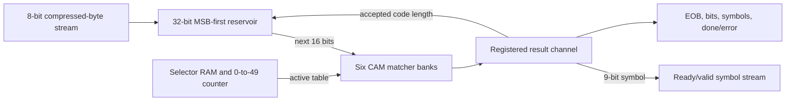
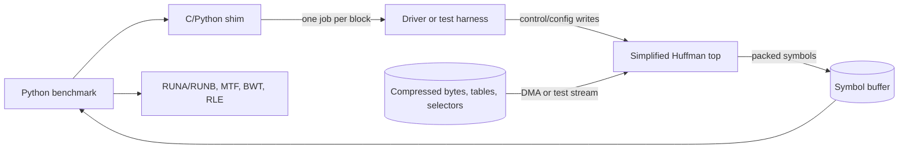

# Simplified Pyflate Huffman Accelerator: Living Plan

Status: Sections 1, 2, and 3 are implemented and documented. The remaining
unchecked items are optional RTL simulation, synthesis, place-and-route, power,
and physical performance measurements.

## Project goal and evidence standard

The primary goal is to demonstrate a solid understanding of both the software
and hardware sides of hardware acceleration. The project must explain:

1. why `HuffmanTable.find_next_symbol` is a measured software bottleneck;
2. which work remains in software and which work moves into hardware;
3. the accelerator's complete functionality, interfaces, datapath, and control;
4. how software configures the hardware and transfers input and output data;
5. expected performance, area, power, and timing tradeoffs using transparent
   formulas, units, assumptions, and limitations; and
6. how the design would be verified and evaluated on a real implementation.

Actual FPGA synthesis, place and route, physical-board execution, a Linux
driver, and exhaustive RTL verification are **not required** for this project.
They are optional extensions if the necessary tools and time are available.

Simple testing is still valuable. The minimum practical target is an executable
software reference model plus focused tests. A small RTL simulation that checks
the matcher and one short streaming example is recommended but optional. The
report must label every result as one of the following:

- **measured**: obtained from the original software benchmark or a real tool;
- **simulated**: obtained from RTL simulation;
- **estimated**: calculated from an analytical model; or
- **illustrative**: an example value that is not a prediction.

## Fixed project decision

This design accelerates the repository's exact `pyflate` benchmark rather than
every possible bzip2 stream. Therefore:

```text
KEY_WIDTH = 16 bits
```

Instrumentation of `interpreter.tar.bz2` found code lengths from 2 through 15
bits, so a 16-bit lookup window covers every Huffman code used by this workload.
The original Python decoder permits lengths up to 20; that general support is
deliberately outside the simplified version.

This limitation must be stated in the final report. It is a specialization for
performance and simplicity, not a claim of general bzip2 compatibility.

## Relationship between the three sections and final checklist

Yes: Sections 1 through 3 are the implementation sequence for the final agreed
checklist.

| Final requirement | Section |
|---|---:|
| Benchmark-specific 16-bit decision | Fixed decision above |
| Shortest-first matching | 1 |
| Defined MSB-aligned patterns and internally generated masks | 1 |
| Dictionary write-address bounds | 1 |
| Registered ready/valid matcher interface | 1 |
| Six Huffman tables | 2 |
| Selector change after every 50 accepted symbols | 2 |
| MSB-first streaming bit reservoir | 2 |
| EOB, bit-consumption, symbol, and status counters | 2 |
| Software reference tests and optional simple RTL simulation | 3 |
| Software, MMIO, and DMA integration description | 3 |
| Analytical timing, area, power, and performance report | 3 |
| Optional synthesis, place-and-route, and physical measurements | 3 |

## Measured workload contract

The simplified design may specialize to these measured properties:

| Quantity | Benchmark value |
|---|---:|
| Input file | `interpreter.tar.bz2` |
| Compressed bytes | 67,562 |
| Bzip2 blocks | 1 |
| Huffman tables used | 6 |
| Valid symbols per table | 147 |
| Minimum code length | 2 bits |
| Maximum code length | 15 bits |
| Huffman symbols decoded, including EOB | 148,271 |
| Selector entries/groups | 2,966 |
| Final output bytes | 399,360 |
| Expected output MD5 | `afa004a630fe072901b1d9628b960974` |

All 148,271 calls use the original function's `reversed=False` MSB-first path.
Gzip/DEFLATE reversed codes are outside the simplified design.

## Proposed module hierarchy

```text
rtl/
|-- huffman_find_simple.sv          # Friend's CAM matcher, improved in Section 1
|-- huffman_find_six_table.sv       # Six CAM banks and active-table mux, Section 2
|-- huffman_bit_reservoir.sv        # Streaming MSB-first buffer, Section 2
`-- huffman_find_simple_top.sv      # Selectors, job control, and connected datapath
```

The existing detailed `huffman_find_accel.sv` remains a reference and is not
merged into the simplified implementation. The completed explanation and
integration report is `SIMPLIFIED_HUFFMAN_DESIGN.md`.



## Section 1: make the simple matcher safe and precise

Section 1 primarily changes `rtl/huffman_find_simple.sv` and adds the optional
`tests/tb_huffman_find_simple.sv` testbench. The matcher remains independently
testable and does not yet read bytes or switch tables.

### 1.1 Parameter decisions

Use:

```systemverilog
parameter int NUM_ENTRIES  = 147;
parameter int KEY_WIDTH    = 16;
parameter int SYMBOL_WIDTH = 9;
```

`KEY_WIDTH=16` is fixed for the benchmark. `NUM_ENTRIES=147` matches every one
of its six tables. Keeping these as parameters makes unit testing easier even
though the top-level benchmark build uses those fixed values.

The previously hard-coded priority-loop bound has already been changed from 16
to `KEY_WIDTH`. This preserves parameter consistency.

### 1.2 Shortest-first match

The original Python table is sorted by increasing length. Change:

```systemverilog
for (int length = KEY_WIDTH; length >= 1; length--)
```

to:

```systemverilog
for (int length = 1; length <= KEY_WIDTH; length++)
```

Legal Huffman codes are prefix-free, so only one properly programmed entry
should match. Shortest-first still mirrors the original behavior and provides
deterministic behavior if invalid entries overlap.

### 1.3 Remove pattern-alignment ambiguity

The programming interface shall accept a right-aligned canonical code rather
than an independently supplied pattern and mask:

```systemverilog
input logic [KEY_WIDTH-1:0] dict_wr_code;
input logic [4:0]           dict_wr_len;
```

For a valid length `L`, hardware derives:

```text
shift          = KEY_WIDTH - L
stored_pattern = dict_wr_code << shift
stored_mask    = all_ones << shift
```

The caller therefore cannot provide an inconsistent mask. `lookup_bits[15]` is
defined as the next compressed bit, so both stored codes and lookup data are
MSB-aligned.

Example for code `101`, length 3:

```text
dict_wr_code:   0000_0000_0000_0101
stored_pattern: 1010_0000_0000_0000
stored_mask:    1110_0000_0000_0000
```

The write logic must handle `dict_wr_len==0` without shifting. A zero length
invalidates that dictionary entry. Lengths above 16 are rejected or ignored and
must never produce an out-of-range shift.

### 1.4 Write-address bounds

`$clog2(147)=8`, so the address signal can express values 0 through 255 even
though only 0 through 146 are legal. Every write must check:

```systemverilog
if (dict_wr_en && dict_wr_addr < NUM_ENTRIES) begin
    // Program or invalidate the entry.
end
```

Add this code comment:

```systemverilog
// The binary address width also represents values above NUM_ENTRIES-1.
// Check the bound to prevent an out-of-range array access and
// implementation-dependent simulation or synthesis behavior.
```

For the simple core, an invalid address may be ignored. The future top-level
wrapper reports it as a configuration error.

### 1.5 Registered ready/valid result

Add a one-entry output register with the following transaction rules:

```text
input accepted  = lookup_valid && lookup_ready
output accepted = result_valid && result_ready
```

Interface:

```systemverilog
input  logic                    lookup_valid;
output logic                    lookup_ready;
input  logic [KEY_WIDTH-1:0]    lookup_bits;

output logic                    result_valid;
input  logic                    result_ready;
output logic                    match_found;
output logic [SYMBOL_WIDTH-1:0] match_symbol;
output logic [4:0]              match_len;
```

The standard one-entry-buffer expression is:

```systemverilog
assign lookup_ready = !result_valid || result_ready;
```

When `result_valid=1` and `result_ready=0`, `match_found`, `match_symbol`, and
`match_len` must remain stable. A no-match query is still a completed result:
`result_valid=1`, `match_found=0`, and the other fields zero.

### Section 1 checklist

- [x] Fix `KEY_WIDTH=16` for this benchmark.
- [x] Use `KEY_WIDTH` rather than a hard-coded priority-loop bound.
- [x] Set the benchmark build to 147 entries.
- [x] Change priority to shortest-first.
- [x] Replace caller-provided pattern/mask ambiguity with right-aligned code.
- [x] Derive MSB-aligned pattern and mask internally.
- [x] Handle zero and invalid lengths safely.
- [x] Check `dict_wr_addr < NUM_ENTRIES` and explain why in a comment.
- [x] Add registered input/output ready/valid behavior.
- [x] Hold results stable under output backpressure.
- [x] Write an independent self-checking matcher testbench.
- [ ] Run the RTL testbench (optional; no simulator is currently installed).

## Section 2: six-table streaming wrapper

Section 2 turns the matcher into a useful benchmark accelerator while keeping
the matcher itself small and understandable.

### 2.1 Six matcher banks

Instantiate six `hardware_dictionary_accelerator` modules, each with 147
entries. Configuration adds a three-bit table ID and routes each entry write to
one bank. All banks see the same 16-bit lookup window, but only the active bank
receives `lookup_valid`.

This is not the smallest possible implementation: it creates
`6*147=882` masked comparators. It is selected because it is simple, allows
instant table changes, and avoids reprogramming a CAM every 50 symbols. Valid
and operand isolation hold inactive-bank compare inputs constant, reducing
dynamic switching even though their logic still occupies area. This is not
physical clock gating.

### 2.2 Selector controller

Store the benchmark's 2,966 three-bit selector entries in a small RAM. The
controller maintains:

```text
selector_index   = current selector RAM address
symbols_in_group = 0 through 49
active_table_q   = registered current selector
```

Only an accepted, non-EOB output advances the group counter. After the 50th
accepted symbol:

```text
symbols_in_group = 0
selector_index   = selector_index + 1
active_table_q   = selector_ram[selector_index + 1]
```

Changing on output acceptance rather than on `lookup_valid` makes selector
state correct during downstream stalls.

### 2.3 Streaming bit reservoir

Use a 32-bit left-aligned reservoir and an eight-bit input channel:

```systemverilog
input  logic       byte_valid;
output logic       byte_ready;
input  logic [7:0] byte_data;
input  logic       byte_last;
```

The next compressed bit is always the reservoir MSB. A `valid_bits` counter
tracks available data. Normally the matcher receives `reservoir[31:16]` when at
least 16 bits are present. After `byte_last`, a shorter final window may be
zero-padded; the top rejects any match whose length exceeds `valid_bits`. On an
accepted match of length `L`:

```text
reservoir = reservoir << L
valid_bits = valid_bits - L
bits_consumed = bits_consumed + L
```

New bytes are appended below existing valid bits. Consumption and refill may
occur in the same cycle. The reservoir must not discard or duplicate bits when
either input or output is stalled.

An initial three-bit offset supports a Huffman payload that starts in the
middle of the first source byte. Offset zero means that byte's MSB is next.

An eight-bit stream is intentionally simpler than AXI width conversion and can
still accept 200 MB/s at 200 MHz. Reading all 67,562 compressed bytes would take
at most:

```text
67,562 bytes / 200,000,000 bytes/s = 337.81 us
```

This can overlap symbol decoding.

### 2.4 Job control and outputs

The simplified top-level interface includes:

```text
start, busy, done, error
start_bit[2:0]
selector_count[11:0]
eob_symbol[8:0]
symbol_capacity[31:0]
```

Symbol output uses ready/valid and includes:

```text
symbol[8:0]
code_length[4:0]
table_id[2:0]
eob
```

The EOB symbol is emitted. Completion occurs only when that result is accepted
by the downstream consumer.

Required counters:

```text
bits_consumed[31:0]
symbols_produced[31:0]   # includes EOB
cycle_count[63:0]
input_stall_cycles[31:0]
output_stall_cycles[31:0]
```

Errors include invalid configuration, invalid table selector, no matching code,
input ending before EOB, and symbol-capacity overflow.

### Section 2 checklist

- [x] Create the six-table wrapper.
- [x] Add three-bit table programming and selection.
- [x] Gate and operand-isolate lookup activity to the active bank.
- [x] Store and validate all 2,966 benchmark selectors.
- [x] Switch selector after every 50 accepted non-EOB symbols.
- [x] Implement the 32-bit MSB-first reservoir.
- [x] Support simultaneous bit consumption and byte refill.
- [x] Support an initial bit offset from 0 through 7.
- [x] Add EOB recognition and emit the EOB symbol.
- [x] Add bits-consumed, symbols-produced, cycle, and stall counters.
- [x] Add start/busy/done/error control.
- [x] Detect truncated input, no match, selector exhaustion, and overflow.
- [x] Connect all paths with backpressure-safe ready/valid logic.

## Section 3: explanation, analytical evaluation, and optional verification

### 3.1 Verification approach

The executable reference model in `tools/huffman_reference.py` and its existing
Python tests are the required practical evidence. They verify the software
semantics and provide expected results for the hardware.

If an RTL simulator is available, create a small self-checking testbench that
compares the simplified design with the reference model. This is recommended,
but its absence does not make the project incomplete. Candidate tests, ordered
from small demonstrations to broader coverage, are:

1. Individual codes of every measured length 2 through 15.
2. Codes crossing byte and reservoir boundaries.
3. Start offsets 0 through 7.
4. Shortest-first behavior for intentionally overlapping invalid entries.
5. Dictionary write addresses 146, 147, and the maximum encoded address.
6. Random input and output backpressure.
7. Selector transitions at output symbols 50 and 100.
8. Missing code, missing EOB, selector exhaustion, and capacity overflow.
9. The benchmark tables and selector sequence.
10. Exactly 148,271 emitted symbols including EOB.
11. Existing software post-processing still produces 399,360 bytes and the
    expected MD5.

Any RTL testbench should assert that output is stable while stalled and that
every accepted match consumes exactly `match_len` bits. Completing tests 1, 2,
4, 5, and one short table-selector/reservoir example would be a useful compact
demonstration; running the full benchmark in RTL is optional.

### 3.2 Timing concepts and equations

The simulation directive:

```systemverilog
`timescale 1ns / 1ps
```

means one nanosecond simulation units and one picosecond simulation precision.
It does not create a 1 GHz or any other hardware clock.

The target is 200 MHz:

```text
T_required = 1 / 200,000,000 Hz = 5 ns
```

For `N` symbols, initial fill `C_fill` cycles, initiation interval `II`, and
clock frequency `f_clk`:

```text
T_decode = (C_fill + N*II) / f_clk
```

The completed simple top deliberately allows one outstanding lookup, giving
`II=2`. With worst-case `C_fill=3`, `N=148,271`, and 200 MHz:

```text
T_decode = (3 + 148,271*2) cycles / 200,000,000 cycles/s
         = 0.001482725 s
         = 1.482725 ms
```

Exact maximum frequency cannot be calculated from RTL text. It comes from
static timing analysis after synthesis and, preferably, placement and routing:

```text
T_critical = logic delay + routing delay + setup + clock uncertainty
F_max approximately equals 1 / T_critical
slack = T_required - T_critical
```

Example: if the placed critical path is 6.4 ns:

```text
F_max = 1 / 6.4 ns = 156.25 MHz
slack at 200 MHz = 5.0 ns - 6.4 ns = -1.4 ns
```

Negative slack means the implementation does not meet 200 MHz. The likely
critical path is masked comparison, match reduction/priority selection, and the
result register. If necessary, register raw matches before priority encoding;
that increases latency and, without speculation, would likely change the full
feedback top from `II=2` to about `II=3`. A balanced priority tree is the first
timing refinement to try because it may retain `II=2`. A more aggressive bypass
or speculative feedback design could approach `II=1`, but is intentionally
outside this simplified implementation.

### 3.3 Optional tool-based implementation results

Synthesis, place and route, and power analysis are optional extensions. They are
not prerequisites for demonstrating the design. However, if the report claims
**measured** timing, area, or power, it must:

1. Record the FPGA part and synthesis tool/version.
2. Apply a 5.000 ns clock constraint.
3. Run synthesis and inspect inferred latches, RAM, and warnings.
4. Run place and route.
5. Record critical-path delay, worst slack, and achieved Fmax.
6. Record LUT, FF, BRAM, and routing utilization.
7. Simulate the benchmark and capture VCD/SAIF switching activity.
8. Run post-route power analysis and report static/dynamic watts and energy.

Energy per benchmark job is:

```text
E_job [J] = P_average [W] * T_active [s]
```

Example only: 0.40 W for 1.5 ms gives:

```text
E_job = 0.40 J/s * 0.0015 s = 0.0006 J = 0.60 mJ
```

The 0.40 W value is illustrative, not a prediction. Without tool results, report
qualitative area and power tradeoffs and analytical performance estimates; do
not present them as measured implementation results.

### 3.4 Performance expectation

Keep the profiler scopes separate. Self/exclusive time counts only instructions
executed in `find_next_symbol`; inclusive time also counts its child bitfield
operations on that call path:

```text
T_self      = 662.237 ms * (4,604 / 38,010) = 80.21 ms
T_inclusive = 662.237 ms * (14,713 / 38,010) = 256.34 ms
T_children  = 256.34 ms - 80.21 ms = 176.13 ms
```

Source: the arithmetic mean of 60 measured values in `../../results/pyflate/
original/original results full run/timing.json`, and weighted stack counts in
the adjacent `speedscope.folded`. The 38,010-sample denominator contains the
`py::bench_pyflake` frame; 14,713 samples include `find_next_symbol`, while
4,604 have it as the deepest Python frame. Record these counts with the
percentages so the analysis is reproducible.

Amdahl's law is:

```text
Speedup_total = 1 / ((1-f) + f/S_component)
```

The implemented `II=2` analytical estimate gives two cases:

```text
Conservative matcher-only/self scope:
S_component = 80.21 ms / 1.482725 ms = 54.10x
Speedup_total = 1 / (0.878874 + 0.121126/54.10) = 1.135x
Speedup_max = 1 / (1-0.121126) = 1.138x

Optimistic batched matcher + reservoir scope:
S_component = 256.34 ms / 1.482725 ms = 172.88x
Speedup_total = 1 / (0.612918 + 0.387082/172.88) = 1.626x
Speedup_max = 1 / (1-0.387082) = 1.632x
```

This estimate excludes DMA setup, driver, cache-maintenance, and returned-symbol
processing overhead. The limit is why the report must not promise a
whole-program speedup equal to the much larger component speedup. Use the
inclusive case only because our batch architecture implements peek/consume in
its reservoir; label it as optimistic until measured end to end.

### 3.5 MMIO, DMA, and software integration description

The course version need not implement a Linux driver unless the rubric requires
running on a physical SoC/PCIe platform. The report must still explain a viable
integration:



Required software changes:

1. Keep the compressed source in memory.
2. Parse the block and construct all six dictionaries and selector list.
3. Record the exact absolute starting bit.
4. Program tables/selectors before the timed lookup job.
5. Stream compressed bytes and collect symbols.
6. Advance the software bitfield by hardware `bits_consumed`.
7. Run the existing post-Huffman software stages.
8. Validate final length and MD5.

One transaction must cover the entire Huffman payload. One MMIO call per symbol
would require 148,271 calls and would defeat the accelerator.

### Section 3 checklist

Required understanding and documentation:

- [x] Keep an executable reference model and focused Python tests.
- [x] Explain the clock-period, latency, throughput, Fmax, and slack equations.
- [x] Identify the likely critical path and explain possible pipelining.
- [x] Estimate comparator/storage resources and state every assumption.
- [x] Explain static/dynamic power tradeoffs and the energy-per-job equation.
- [x] Describe the MMIO register/configuration sequence.
- [x] Describe DMA or test-harness data transfers.
- [x] Describe required Python/C software modifications.
- [x] Calculate matcher and whole-program speedup with Amdahl's law.
- [x] Clearly label measured, simulated, estimated, and illustrative results.

Optional implementation evidence:

- [ ] Compile/lint the RTL if a suitable tool is available.
- [x] Write a small self-checking matcher testbench.
- [ ] Run the matcher testbench when a simulator is available.
- [x] Write one wrapper/reservoir streaming test.
- [ ] Run the streaming test when a simulator is available.
- [ ] Generate full benchmark fixtures and verify all 148,271 symbols.
- [ ] Verify random backpressure and error cases.
- [ ] Run synthesis and record warnings, LUTs, FFs, and inferred memories.
- [ ] Run place and route with the 5 ns constraint and report achieved timing.
- [ ] Run activity-based power analysis and calculate energy per job.
- [ ] Measure physical end-to-end runtime and compare it with the estimate.

## Definition of done

The simplified accelerator is complete when:

- the Section 1 and Section 2 RTL defines the intended functionality,
  interfaces, main datapath, control, handshakes, counters, and error behavior;
- the code is written to be synthesizable by construction, while honestly
  stating whether synthesis or RTL compilation was actually performed;
- the software/hardware boundary, configuration procedure, transfers, and
  required benchmark modifications are fully described;
- the reference model and focused Python tests pass, and the report explains
  how RTL results would be checked against them;
- timing, performance, area, and power are analyzed with equations, units,
  assumptions, and tradeoffs;
- the final document distinguishes measured, simulated, estimated, and
  illustrative results; and
- the benchmark-only limitations—16-bit window, six 147-entry tables, one
  known input workload, and no gzip support—are stated plainly.

The optional checklist is evidence beyond the project requirement. It improves
confidence, but incomplete optional items do not prevent completion.

## Change log

| Date | Decision |
|---|---|
| 2026-09-13 | Selected the simple CAM matcher as the v2 implementation base. |
| 2026-09-13 | Fixed `KEY_WIDTH=16` because the measured benchmark maximum is 15. |
| 2026-09-13 | Agreed to implement Sections 1, 2, and 3 in order. |
| 2026-09-13 | Set the goal to demonstrate software/hardware co-design understanding; synthesis and RTL testing are optional evidence. |
| 2026-09-13 | Implemented Section 1 and added an optional self-checking RTL testbench; execution awaits an available simulator. |
| 2026-09-13 | Implemented the Section 2 six-bank wrapper, selector controller, bit reservoir, top-level control, counters, and errors. |
| 2026-09-13 | Completed the Section 3 integration and analytical design report; tool-based implementation results remain optional. |
| 2026-09-14 | Registered the active selector to remove selector RAM from the normal CAM critical path, documented synchronized reset deassertion, and added a 5.000 ns target constraint. |
| 2026-09-14 | Added the seven-chapter report under `report/`, including measured profiling sources, integration ABI, diagrams, and PPA caveats. |
| 2026-09-14 | Extended workload characterization to report table, alphabet, code-length, and selector bounds; reran all six Python reference tests successfully. |
