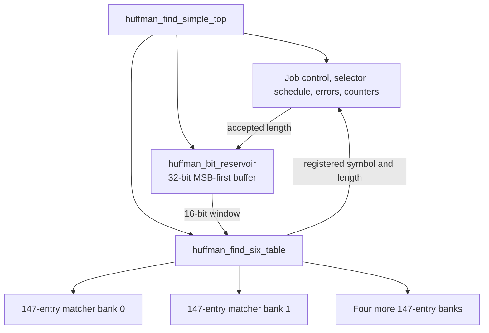
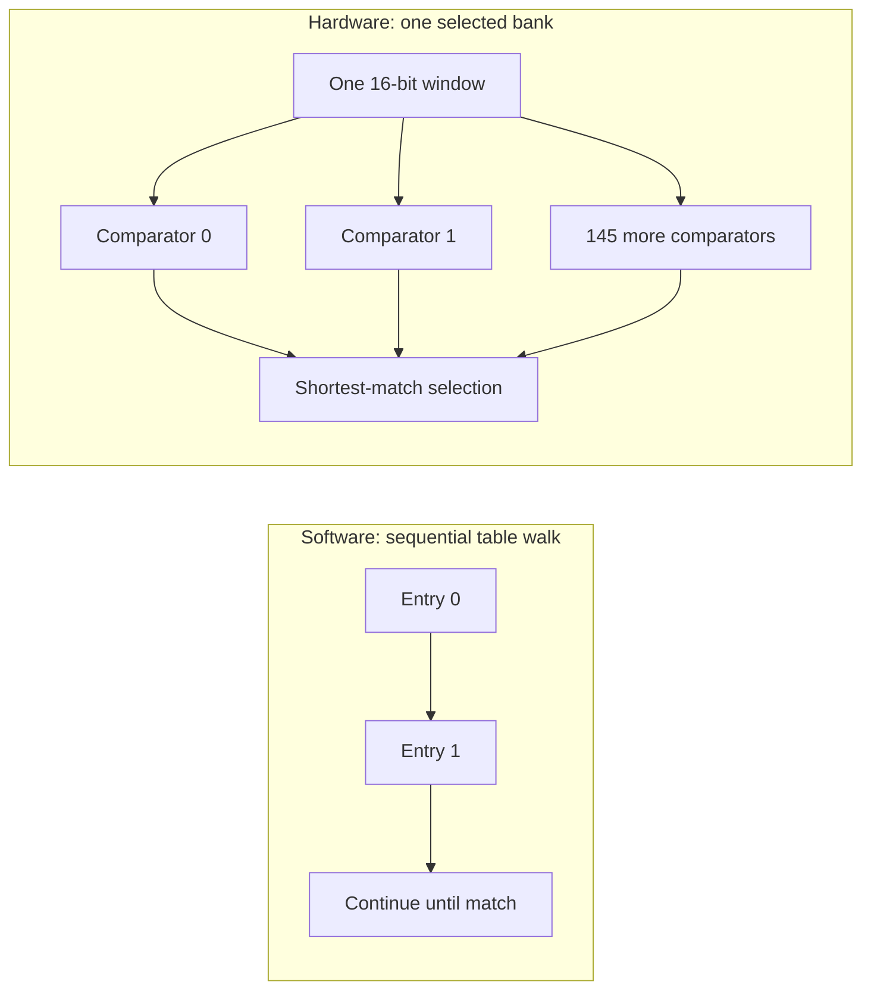
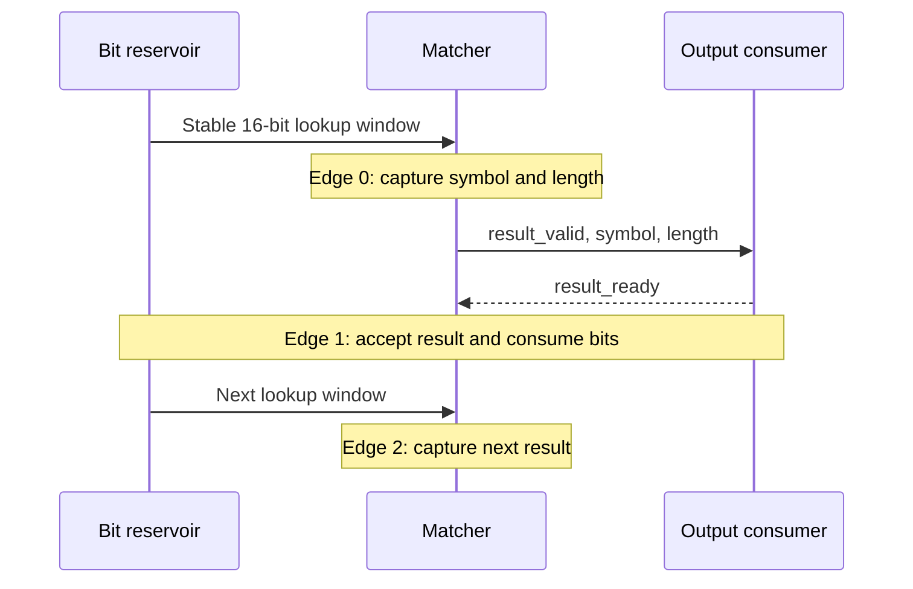
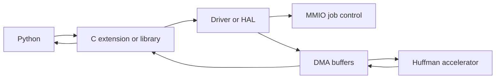

# Pyflate hardware co-design: from a Python hot loop to a streaming Huffman accelerator

This document explains the Pyflate hardware design in simple English. It is
structured for presentation use: the motivation, hardware changes, software
connection, expected effects, analytical performance, PPA tradeoffs, code
snippets, and verification limits are all shown separately.

> **Current status:** the RTL exists, the workload has been characterized, and
> six Python reference tests pass. No HDL simulator, synthesis, place-and-route,
> FPGA execution, timing closure, resource utilization, or power measurement is
> available. Every hardware number below is labeled as an RTL fact, target, or
> analytical estimate.

The active hardware source is the four-file hierarchy below. The combined
`huffman_find_simple_complete*.sv` files are packaging variants; compile either
the split hierarchy or one combined file, never both. The non-compact variant
mirrors the split sources, while the compact variant is semantically condensed.

| Item | Source of truth |
|---|---|
| Complete accelerator control | [`rtl/huffman_find_simple_top.sv`](rtl/huffman_find_simple_top.sv) |
| Streaming bit reservoir | [`rtl/huffman_bit_reservoir.sv`](rtl/huffman_bit_reservoir.sv) |
| Six-table wrapper | [`rtl/huffman_find_six_table.sv`](rtl/huffman_find_six_table.sv) |
| One-table matcher | [`rtl/huffman_find_simple.sv`](rtl/huffman_find_simple.sv) |
| 200 MHz target constraint | [`constraints/huffman_find_simple_top.xdc`](constraints/huffman_find_simple_top.xdc) |
| SystemVerilog testbenches | [`tests`](tests) |
| Executable reference model | [`tools/huffman_reference.py`](tools/huffman_reference.py) |
| Detailed seven-chapter report | [`report/README.md`](report/README.md) |
| Software optimization evidence | [Pyflate software story](../../software%20report%20pyflate/presentation_optimization_story.md) |

The checked-in `huffman_find_accel.sv` is an older 20-bit canonical-range
comparison design. It is not instantiated by the active hierarchy and is not a
measured "before" hardware version.

## 1. Evidence labels used in this report

| Label | Meaning |
|---|---|
| **Measured software** | Comes from saved Pyperf, profile, or `perf stat` files. |
| **Workload observation** | Counted from the fixed `interpreter.tar.bz2` input. |
| **RTL fact** | Follows directly from implemented parameters, ports, or state. |
| **Analytical estimate** | Calculated from an explicit cycle or area model. |
| **Target** | A requirement given to implementation tools; it has not been achieved yet. |
| **Illustrative example** | Demonstrates a formula using assumed values; it is not a prediction. |

This separation matters because the design currently has measured **software**
results and verified workload counts, but no measured **hardware** results.

## 2. What moves to hardware

The accelerator replaces repeated Huffman symbol lookup and bit consumption.
It does not decompress the entire BZip2 file.

```mermaid
flowchart LR
    A[Python parses BZip2 headers] --> B[Build six Huffman tables and selectors]
    B --> C[Submit one batched hardware job]
    C --> D[32-bit bit reservoir]
    D --> E[Selected 147-entry matcher]
    E --> F[Raw Huffman symbols]
    F --> G[Software RUNA/RUNB and move-to-front]
    G --> H[Software inverse BWT and final RLE]
    H --> I[399,360 output bytes and MD5 check]
```



| Stage | Execution after integration |
|---|---|
| Header, used-byte map, table lengths, and selectors | Software |
| Huffman lookup and exact input-bit advance | Hardware |
| RUNA/RUNB expansion and move-to-front | Software |
| Inverse BWT and final run-length expansion | Software |
| Output verification | Software |

The hardware emits 9-bit raw Huffman symbols and their consumed code lengths.
It does not directly emit the final 399,360 decompressed bytes.

### 2.1 Quick glossary

| Term | Simple meaning |
|---|---|
| Huffman code | A variable-length bit pattern: common symbols use fewer bits. |
| EOB | End-of-block symbol. The accelerator emits it before completing the job. |
| RTL | Register-transfer-level hardware description written here in SystemVerilog. |
| CAM-style lookup | Compare one key against many stored entries at once. This design uses ordinary RTL comparison logic, not a claimed vendor CAM primitive. |
| Bit reservoir | A small register that keeps unread compressed bits aligned for lookup. |
| Ready/valid | A transfer occurs only when the sender says data is valid and the receiver says it is ready. |
| Backpressure | The receiver lowers `ready`, making the sender hold its current output. |
| II | Initiation interval: clocks between starting or accepting successive symbols. |
| MMIO | Small control reads and writes made through memory addresses. |
| DMA | Bulk data transfer without one CPU transaction for every byte or symbol. |
| PPA | Performance, power, and area: the three main physical-design tradeoffs. |

## 3. Why Huffman lookup was selected

The operation is repeated many times, uses small tables, and has a natural
hardware comparison structure.

| Evidence from one decode | Value | Why it matters |
|---|---:|---|
| Compressed input | 67,562 bytes | Small enough to batch as one job. |
| Huffman symbols including EOB | 148,271 | The same operation repeats enough times to amortize setup. |
| Huffman tables | 6 | All tables can remain resident. |
| Maximum entries per table | 147 | Defines the active matcher size. |
| Observed code lengths | 2 through 15 bits | A 16-bit lookup window covers this workload. |
| Selectors | 2,966 | Hardware must change tables every group of at most 50 symbols. |
| Original lookup self time | approximately 80.214 ms | Conservative software scope replaced by the matcher. |
| Lookup plus bit-reader subtree | approximately 256.340 ms | Optimistic scope replaced by matcher plus reservoir. |

The 80.214 ms and 256.340 ms values are rough estimates formed by scaling
debug-Python sample shares with a separate regular-Python benchmark mean.
Treat them as directional. The self and inclusive scopes are alternative
projection boundaries; they must not be added.

The main workload counts are reproducible with the checked-in characterization
tool. The all-six-table-ID observation, bit-reader call counts, and first lookup
offset were also reproduced with direct instrumentation, but that extra output
is not currently saved by the tool.

### 3.1 Relationship to the software measurements

| Software result | Original | Optimized Python | Hardware interpretation |
|---|---:|---:|---|
| Mean benchmark time | 662.237 ms | 430.018 ms | Baselines for end-to-end comparison; neither is hardware time. |
| Instructions over full Pyperf invocation | 382.299 B | 248.717 B | Python optimization already removed much interpreter work. |
| Cycles over full Pyperf invocation | 143.192 B | 96.466 B | Hardware must beat an improved software baseline to be useful. |
| `find_next_symbol` approximate self time | 80.214 ms | 65.627 ms | Conservative removable component scope. |
| Lookup plus bit-reader approximate inclusive time | 256.340 ms | 176.896 ms | Optimistic batched boundary. |

The `perf stat` totals include process startup, warmups, and many benchmark
values. They motivate reducing interpreted work but cannot predict RTL cycles,
area, or power.

## 4. Active hardware architecture



| Module | Simple explanation |
|---|---|
| `hardware_dictionary_accelerator` | Stores one Huffman table, compares its entries, chooses the shortest match, and registers the result. |
| `huffman_find_six_table` | Keeps six tables resident, routes a request to the selected bank, and returns that bank's result. |
| `huffman_bit_reservoir` | Turns incoming bytes into a stable 16-bit MSB-first lookup window and removes the accepted code length. |
| `huffman_find_simple_top` | Starts jobs, switches selectors every 50 accepted symbols, handles EOB/errors, and counts work and stalls. |

The control is handshake-driven rather than an explicit named FSM. `busy`,
reservoir validity, matcher result validity, and `valid && ready` transfers
encode the logical phases: configure, start, fill, match, hold, commit, and
finish.

## 5. Complete design-decision summary

| Design change | How and why | Expected software and hardware effect | Evidence or calculation |
|---|---|---|---|
| Batch a complete Huffman payload | Submit compressed bytes, tables, and selectors once instead of calling a device for each symbol. | Amortizes Python, driver, MMIO, and DMA setup over 148,271 symbols. | Required for useful acceleration; the host interface is still proposed. |
| Specialize dimensions to the workload | Use 6 tables, 147 entries, a 16-bit window, and 2,966 selectors. | Less state and narrower comparisons than a fully general design, but it no longer covers every legal BZip2 stream. | Observed maxima are 6, 147, 15 code bits, and 2,966 selectors. |
| Spatial CAM comparison | Compare all 147 active-bank entries together. | Replaces Python's sequential object loop with parallel comparison logic; costs area and routing. | 147 active comparisons; 882 RTL entries across six banks. |
| Generate pattern and mask internally | Program a right-aligned code and length, then align them in hardware. | Removes caller alignment ambiguity and prevents inconsistent pattern/mask pairs. | Implemented RTL behavior; no performance claim. |
| Shortest-first priority | Search lengths 1 through 16. | Matches Python ordering and is deterministic for malformed overlapping entries. | Implemented correction; legal prefix-free tables normally have one match. |
| Six resident table banks | Keep every table available instead of reloading on selector changes. | Immediate table switches every 50 symbols at the cost of about six times the one-bank fabric. | Workload uses all six table IDs. |
| Operand isolation | Assert lookup valid and send changing lookup bits only to the selected bank. | Expected to reduce switching in five banks; does not save their area, leakage, or clock power. | RTL fact; power effect is unmeasured. |
| 32-bit bit reservoir | Maintain unread bits in hardware and expose a fixed 16-bit window. | Replaces repeated Python snoop/read/mask/refill operations and supports byte boundaries. | Reservoir-inclusive software scope is approximately 256.340 ms. |
| Registered ready/valid result | Hold symbol and length until accepted. | Prevents loss or duplication under backpressure; feedback gives the complete top II=2. | RTL-derived no-stall model. |
| Registered active selector | Read selector memory at start or a 50-symbol boundary and hold the chosen table. | Removes selector memory from the normal per-symbol compare path. | Timing-oriented RTL change; physical benefit is unmeasured. |
| Atomic output commit | Consume bits and update state only on `valid && ready`. | Preserves ordering and exact bit position during stalls. | RTL fact and testbench intent. |
| Errors and counters | Report terminal errors and count bits, symbols, cycles, and stalls. | Makes future integration bottlenecks measurable for modest state/adder cost. | RTL fact; approximately 291 top/control/counter bits in the state model. |
| Add a 5 ns clock constraint | Tell implementation tools to target 200 MHz. | Creates a concrete timing requirement for STA. | Target only; no WNS, TNS, or achieved Fmax exists. |

## 6. Design change 1: batch the whole Huffman payload

**Purpose:** Performance and software/hardware integration.

**Problem:** Calling hardware once for every symbol would create 148,271
Python-to-driver or MMIO transactions. Interface overhead could cost more than
the lookup being accelerated.

| Change | How and why | Expected software and hardware effect | Relation to evidence |
|---|---|---|---|
| Replace per-symbol software calls with one block-level submission. | Send the compressed payload, six tables, selectors, EOB value, and destination capacity once. | Removes Python and host/device control work from the inner symbol loop. Requires DMA or another bulk stream interface. | The workload has 148,271 Huffman symbols. The batched shim, DMA, and driver are proposed but not implemented. |

**Before: current Python hot loop**

```python
r = t.find_next_symbol(b, False)
```

**After: proposed integration API**

```python
result = accelerator.decode_huffman(source_bytes[byte_offset:], start_bit, tables, selectors_list, eob_symbol=symbols_in_use - 1, capacity=estimated_symbol_capacity)
b.advance_bits(result.bits_consumed)
for r in result.symbols:
    process_decoded_symbol(r)
```

The "after" code is interface pseudocode. It is not present as a working Python
extension or driver.

**Simple explanation:** Send one box containing the whole job instead of asking
the accelerator one tiny question 148,271 times.

## 7. Design change 2: specialize the hardware dimensions

**Purpose:** Area and timing specialization for the measured workload.

**Problem:** A general BZip2 design can require 20-bit codes and up to 258
symbols. The fixed benchmark uses smaller maxima.

| Change | How and why | Expected software and hardware effect | Relation to evidence |
|---|---|---|---|
| Replace general comparison parameters with the measured workload limits. | Narrower keys and smaller tables reduce stored bits, comparison width, routing, and selector storage. | Expected to reduce area and timing pressure, but the active build cannot decode every valid BZip2 stream. | The fixture uses 6 tables, at most 147 entries, code lengths 2-15, and 2,966 selectors. No synthesis result quantifies the saving. |

**Earlier alternative RTL parameters - never active or measured**

```systemverilog
parameter int unsigned MAX_TABLES = 6;
parameter int unsigned MAX_SYMBOLS = 258;
parameter int unsigned MAX_CODE_BITS = 20;
parameter int unsigned MAX_SELECTORS = 32768;
```

These parameters come from the checked-in
[`huffman_find_accel.sv`](rtl/huffman_find_accel.sv) comparison architecture.

**Active benchmark-specific design**

```systemverilog
parameter int NUM_TABLES = 6;
parameter int NUM_ENTRIES = 147;
parameter int KEY_WIDTH = 16;
parameter int SYMBOL_WIDTH = 9;
parameter int MAX_SELECTORS = 2966;
```

The observed maximum code length is 15. A 16-bit window leaves one bit of
margin for this fixture. General BZip2 may need 20 bits.

These dimensions should be compared with a hypothetical general direct CAM.
The older canonical-range design stores tables differently and may still use
less area.

**Simple explanation:** We measured the largest suitcase used by this trip and
built for that size. The hardware is smaller in concept, but it cannot carry
every suitcase allowed by the general standard.

## 8. Design change 3: replace sequential search with spatial comparison

**Purpose:** Performance through spatial hardware parallelism.

**Problem:** Python inspects table objects one after another. Every visit
requires interpreted loop control, attribute reads, comparisons, and reference
management.

| Change | How and why | Expected software and hardware effect | Relation to evidence |
|---|---|---|---|
| Build one masked comparator for every table entry in the selected bank. | SystemVerilog's combinational loop describes replicated logic, so all 147 comparisons can evaluate together. | Removes the sequential Python entry loop. The tradeoff is a wide comparator and priority network with substantial LUT/routing cost. | Original lookup self work is approximately 80.214 ms. The source describes 147 active comparisons and 882 RTL table entries. |

**Before: Python table walk**

```python
for x in self.table:
    if cached_length != x.bits:
        cached = field.snoopbits(x.bits)
        cached_length = x.bits
    if (reversed and x.reverse_symbol == cached) or (not reversed and x.symbol == cached):
        field.readbits(x.bits)
        return x.code
```

**After: selected-bank CAM comparison**

```systemverilog
for (int i = 0; i < NUM_ENTRIES; i++) begin
    raw_matches[i] = lookup_valid && valid_mem[i] && ((lookup_bits & mask_mem[i]) == pattern_mem[i]);
end
```

A SystemVerilog `for` loop inside `always_comb` is not a 147-cycle software
loop. Synthesis creates parallel comparison logic unless it transforms the
architecture.



**Simple explanation:** Python asks 147 people one after another. The CAM gives
147 people a copy of the question at the same time, then selects the winning
answer.

## 9. Design change 4: make table programming precise

**Purpose:** Correctness and deterministic configuration behavior; no speedup
is claimed for this section.

The simple matcher received three correctness-oriented changes: shortest-first
selection, hardware-generated alignment, and explicit bounds.

### 9.1 Shortest code first

| Change | How and why | Expected software and hardware effect | Relation to evidence |
|---|---|---|---|
| Change priority from longest-first to lengths 1 through 16. | Python's table order is shortest-first. Legal Huffman codes are prefix-free, but the rule also makes malformed overlaps deterministic. | Preserves the required decoded result. It changes priority ordering, not the number of comparisons. | Documented and implemented RTL correction; no speedup is claimed. |

**Earlier planned matcher order - never measured**

```systemverilog
for (int length = KEY_WIDTH; length >= 1; length--)
```

This earlier form is documented in
[`SIMPLIFIED_HUFFMAN_PLAN.md`](SIMPLIFIED_HUFFMAN_PLAN.md), not as a measured
hardware baseline.

**After: active matcher order**

```systemverilog
for (int l = 1; l <= KEY_WIDTH; l++) begin
```

### 9.2 Generate alignment mask from code length

| Change | How and why | Expected software and hardware effect | Relation to evidence |
|---|---|---|---|
| Accept a right-aligned code and length, then generate the MSB-aligned pattern and mask in hardware. | The caller cannot provide an inconsistent pattern/mask pair. | Adds configuration-time shifts but makes every lookup use one unambiguous representation. | RTL fact; configuration is outside the hot lookup loop. |

**Before: caller conceptually prepares two aligned values**

```text
stored_pattern = caller_pattern
stored_mask = caller_mask
```

**After: active write logic**

```systemverilog
pattern_mem[dict_wr_addr] <= dict_wr_code << (KEY_WIDTH - dict_wr_len);
mask_mem[dict_wr_addr] <= {KEY_WIDTH{1'b1}} << (KEY_WIDTH - dict_wr_len);
```

For the right-aligned code `101` with length 3:

```text
input code = 0000_0000_0000_0101
pattern    = 1010_0000_0000_0000
mask       = 1110_0000_0000_0000
```

### 9.3 Reject unsafe addresses and lengths

**Before concept: address width alone permits more values than the table holds**

```text
8-bit dict_wr_addr can encode 0 through 255
stored table addresses exist only from 0 through 146
```

**After: only entries 0 through 146 are accepted**

```systemverilog
if (dict_wr_en && (dict_wr_addr < NUM_ENTRIES)) begin
    if ((dict_wr_len > 0) && (dict_wr_len <= KEY_WIDTH)) begin
        // Program the entry.
    end else begin
        valid_mem[dict_wr_addr] <= 1'b0;
    end
end
```

Zero length invalidates an entry. A nonzero length above 16 is rejected before
it can create an invalid shift.

## 10. Design change 5: keep six tables resident and isolate inactive banks

**Purpose:** Throughput, with an area and power tradeoff.

**Problem:** BZip2 can change its active table every 50 accepted symbols.
Reloading one physical matcher at every change would create repeated
configuration delays.

| Change | How and why | Expected software and hardware effect | Relation to evidence |
|---|---|---|---|
| Instantiate six matcher banks and route each lookup to one selected bank. | Table changes become selection changes rather than reloads. Inactive banks receive `lookup_valid=0` and zero lookup data. | No intended table-switch bubble. Costs six banks of area. Operand isolation is expected to reduce data switching, but not leakage or clock power. | All six table IDs occur in the workload. Power and area effects are not physically measured. |

**Building block: one independently usable bank**

```text
one hardware_dictionary_accelerator instance
```

**Composed active design: six banks with selected-bank activity**

```systemverilog
for (genvar table_index = 0; table_index < NUM_TABLES; table_index++) begin : gen_table
    hardware_dictionary_accelerator matcher (
        .lookup_valid(lookup_valid && (active_table == table_index)),
        .lookup_bits((active_table == table_index) ? lookup_bits : '0)
    );
end
```

Only the selected bank actively compares the current window. All six banks
still occupy silicon or FPGA resources.

**Simple explanation:** Keep six dictionaries open on the desk. Point to the
one currently needed, while keeping the other five pages still.

## 11. Design change 6: move bit management into a reservoir

**Purpose:** Performance and streaming data handling.

**Problem:** Each Python symbol lookup repeatedly peeks at bits, masks them,
decides the code length, consumes that length, and refills from the file.

| Change | How and why | Expected software and hardware effect | Relation to evidence |
|---|---|---|---|
| Use a 32-bit left-aligned reservoir with a fixed 16-bit peek window. | Incoming bytes append below valid bits; an accepted result shifts out its exact length. Consume and refill may happen on the same edge. | Replaces hot Python bit-reader calls and exposes a stable matcher input. The variable shift/count path can become a timing risk. | One software decode performs 341,601 snoops and 156,708 reads. The inclusive lookup/bit-reader scope is approximately 256.340 ms. |

**Before: Python bit access**

```python
cached = field.snoopbits(x.bits)
field.readbits(x.bits)
```

**After: hardware peek and consume**

```systemverilog
assign peek_bits = buffer_q[BUFFER_WIDTH-1 -: KEY_WIDTH];

if (consume_fire) begin
    buffer_n = buffer_n << consume_len;
    bit_count_n = bit_count_n - consume_len;
end
```

The first byte may start at any bit offset from 0 through 7. After `byte_last`,
a partial final window is zero padded, but the top rejects any match whose
length exceeds the number of real buffered bits. The measured fixture begins
the first Huffman lookup at bit offset 4, so the worst-case three-byte initial
fill is actually needed by this input.

**Simple explanation:** The reservoir is a small conveyor belt of bits. The
matcher looks at the front 16, reports how many belong to one symbol, and the
belt advances by exactly that amount.

## 12. Design change 7: register the result and obey ready/valid

**Purpose:** Interface correctness and a cleaner timing boundary.

**Problem:** The earlier comparison architecture drove symbol and length
directly from combinational match logic. The active register creates an
explicit stable output stage and a cleaner timing boundary. The next lookup
also depends on the length of the current symbol.

| Change | How and why | Expected software and hardware effect | Relation to evidence |
|---|---|---|---|
| Capture `found`, symbol, and length in a one-entry output register and hold them until `result_ready`. | This gives a precise backpressure contract and makes output stable. | Improves interface correctness and breaks the combinational path at the result. The complete feedback loop accepts one symbol every two clocks without stalls. | `II=2` is an RTL fact/model, not a measured waveform result. |

**Earlier alternative RTL output - never active or measured**

```systemverilog
assign m_valid_o = busy_o && match_found && (active_table < table_count_i) && (symbols_produced_o < symbols_max_i);
assign m_symbol_o = match_symbol;
assign m_code_length_o = match_length;
```

This comparison snippet comes from
[`huffman_find_accel.sv`](rtl/huffman_find_accel.sv).

**After: one-entry registered result**

```systemverilog
assign lookup_ready = !result_valid || result_ready;

always_ff @(posedge clk or negedge rst_n) begin
    if (!rst_n) begin
        result_valid <= 1'b0;
        match_found <= 1'b0;
        match_symbol <= '0;
        match_len <= '0;
    end else if (lookup_ready) begin
        result_valid <= lookup_valid;
        if (lookup_valid) begin
            match_found <= candidate_found;
            match_symbol <= candidate_symbol;
            match_len <= candidate_len;
        end else begin
            match_found <= 1'b0;
            match_symbol <= '0;
            match_len <= '0;
        end
    end
end
```

While `result_valid=1` and `result_ready=0`, all result fields hold their value.

**Simple explanation:** Put the answer in a one-slot mailbox and leave it there
until the receiver says it took the answer.

## 13. Design change 8: register the active selector

**Purpose:** Timing.

**Problem:** Reading selector memory inside every lookup would place selector
addressing and memory muxing in front of the already large CAM path.

| Change | How and why | Expected software and hardware effect | Relation to evidence |
|---|---|---|---|
| Capture selector 0 at start and capture the next selector only at an accepted 50-symbol boundary. | The normal lookup sees a stable register instead of a selector-memory read. | Expected to shorten the common per-symbol critical path with negligible state. A boundary-only read remains. | Implemented timing refinement; no STA result proves the gain yet. |

**Earlier alternative RTL - never active or measured**

```systemverilog
assign active_table = selector_mem[selector_index_q[SELECTOR_W-1:0]];
```

**Active RTL**

```systemverilog
active_table_q <= selector_mem[0];

if (symbols_in_group_q == 6'd49) begin
    selector_index_q <= next_selector_index;
    active_table_q <= selector_mem[next_selector_index];
end
```

This comparison shows two checked-in architectures. The older 20-bit source was
never a measured active stage.

**Simple explanation:** Read the instruction card once and keep its answer in a
fast register for the next 50 symbols.

## 14. Design change 9: commit state only when output is accepted

**Purpose:** Correctness under backpressure.

**Problem:** If the consumer stalls, consuming bits or advancing a selector
early would skip or duplicate data.

| Change | How and why | Expected software and hardware effect | Relation to evidence |
|---|---|---|---|
| Define `output_fire` from the output handshake and perform all dependent state changes on that event. | Bit consumption, symbol count, table-group count, selector change, and EOB completion remain atomic. | Correct behavior under arbitrary output backpressure; stalls increase cycles without corrupting state. | RTL fact. The small top testbench intends to hold the first result for two clocks. |

**Before: software advances during the function call**

```python
field.readbits(x.bits)
return x.code
```

**After: hardware commits on one accepted transfer**

```systemverilog
assign reservoir_consume_valid = symbol_valid && symbol_ready;
assign output_fire = reservoir_consume_valid && reservoir_consume_ready;

if (output_fire) begin
    bits_consumed <= bits_consumed + matcher_len;
    symbols_produced <= symbols_produced + 1'b1;
end
```

EOB is emitted as a normal output. `done` pulses only after that EOB output is
accepted.

## 15. Design change 10: add errors, counters, and a real clock target

**Purpose:** Observability, deterministic terminal behavior, and a timing
requirement for future implementation tools.

### 15.1 Observability and terminal errors

The active top reports configuration, truncation, no-match, selector, and output
capacity errors. It also exposes:

```systemverilog
output logic [31:0] bits_consumed;
output logic [31:0] symbols_produced;
output logic [63:0] cycle_count;
output logic [31:0] input_stall_cycles;
output logic [31:0] output_stall_cycles;
```

| Change | How and why | Expected software and hardware effect | Relation to evidence |
|---|---|---|---|
| Count accepted work and stall opportunities. | Future measurements can help diagnose core-active time and indications of input or output stalls. Stall counts may overlap and do not form an exact time partition. | Adds registers and incrementers but makes core behavior more observable. | Counters are implemented, but no RTL execution has produced values. |
| Add explicit terminal errors. | Report the implemented configuration/range, no-match, truncation-after-`byte_last`, selector, and output-capacity conditions. | Simplifies host diagnosis for those detected conditions. It does not validate every malformed Huffman table. | Implemented RTL behavior, unexecuted in HDL here. |

### 15.2 Real timing target

| Change | How and why | Expected software and hardware effect | Relation to evidence |
|---|---|---|---|
| Add a 5.000 ns clock constraint. | `timescale` controls simulation units; `create_clock` gives synthesis/STA a timing requirement. | Allows a future tool run to report WNS, TNS, and achieved timing. | 200 MHz remains a target. |

**Simulation unit declaration**

```systemverilog
`timescale 1ns / 1ps
```

**Implementation constraint**

```tcl
create_clock -name core_clk -period 5.000 [get_ports {clk}]
```

A 5 ns testbench clock or XDC constraint does not prove that placed hardware can
run at 200 MHz.

## 16. Cycle-by-cycle operation



The current top allows one outstanding lookup:

1. The reservoir presents a window.
2. The matcher registers the result.
3. The consumer accepts the result and the reservoir consumes its length.
4. The next window becomes available for another request.

This produces a no-stall initiation interval of two cycles per symbol. It is
not one symbol per cycle.

## 17. Analytical performance projection

The cycle model assumes no input starvation, no output backpressure, and the
target clock is achieved.

```text
C_core = C_fill + N_symbols x II
       = 3 + 148,271 x 2
       = 296,545 cycles

T_core = 296,545 / 200,000,000
       = 1.482725 ms
```

The three-cycle fill follows from `ceil((16 + start_bit) / 8)` with the
fixture's observed `start_bit=4`.

| Quantity | Value | Evidence type |
|---|---:|---|
| Huffman symbols | 148,271 | Workload observation |
| Initial fill | 3 cycles for this fixture | Workload observation plus RTL model |
| Initiation interval | 2 cycles/symbol | RTL-derived no-stall model |
| Core cycles | 296,545 | Analytical estimate |
| Clock | 200 MHz | Target |
| Core throughput | 100 million symbols/s | Analytical estimate at target |
| Core time | 1.482725 ms | Analytical estimate at target |
| Original lookup self time | 80.214 ms | Profile-derived software estimate |
| Original lookup plus bit-reader time | 256.340 ms | Profile-derived software estimate |
| Self-scope component speedup | 54.10x | Analytical projection |
| Inclusive component speedup | 172.88x | Analytical projection |

### 17.1 Amdahl's-law limit

Accelerating a component does not accelerate software outside that component.

```text
whole speedup = 1 / ((1 - affected_fraction) + affected_fraction / component_speedup)
```

| Projection boundary | Affected original time | Projected total time | Projected whole speedup |
|---|---:|---:|---:|
| Matcher self work only | 80.214 ms | 583.506 ms | 1.135x |
| Matcher plus bit-reader subtree | 256.340 ms | 407.379 ms | 1.626x |

Both assume zero integration overhead. The perfect-component limits are only
1.138x and 1.632x because the remaining BZip2 stages still run in software.

The measured optimized Python version takes 430.018 ms. The optimistic
original-software hardware projection beats it by only 22.639 ms, so all driver,
DMA, packing, cache, completion, and extra post-processing overhead must remain
below approximately 22.639 ms per job for that comparison to win. The
conservative projection does not beat optimized Python.

Applying the same zero-overhead model to the optimized profile gives a
sensitivity range of 365.874 to 254.605 ms, or 1.175x to 1.689x. These values
are also projections.

### 17.2 Frequency and pipeline sensitivity

| Architecture or frequency | Analytical core time |
|---|---:|
| Current II=2 at 100 MHz | 2.965450 ms |
| Current II=2 at 156.25 MHz | 1.897888 ms |
| Current II=2 at 200 MHz target | 1.482725 ms |
| Current II=2 at 250 MHz | 1.186180 ms |
| Speculative/bypassed II=1 at 200 MHz | 0.741370 ms |
| Extra non-speculative stage, about II=3 at 200 MHz | 2.224080 ms |

Changing II from 2 to 3 requires about 1.5 times the clock frequency merely to
recover the same long-stream throughput. Adding a pipeline stage is therefore
not automatically an optimization for this feedback-dependent decoder.

## 18. Data movement and software integration



MMIO is suitable for a few job controls. It is not suitable for one transaction
per symbol. Bulk source and destination movement should use DMA or an equivalent
streaming mechanism.

| Transfer or setup item | Size or time | Interpretation |
|---|---:|---|
| Full compressed file | 67,562 bytes | Upper bound; hardware begins after software-parsed headers. |
| Input at 1 byte/cycle and target clock | 337.81 us | Ideal source-port occupancy for the full-file byte upper bound; actual elapsed transfer can be longer and can overlap decoding. |
| Raw destination symbols in 16-bit slots | 296,542 bytes | `148,271 x 2` bytes. |
| Table plus selector image | 6,494 bytes | 3,528 table bytes plus 2,966 selector bytes. |
| Serialized internal configuration | 3,848 cycles, 19.24 us | One table or selector write per target-clock cycle. |
| Ideal dual-port internal configuration | 2,966 cycles, 14.83 us | Table and selector writes overlap; excludes host setup. |

The core needs about 45.57 MB/s of source bandwidth for the full-file upper
bound over 1.482725 ms. A 16-bit symbol destination can approach 200 MB/s at the
target throughput, so output buffering is more likely to create backpressure.

A fair end-to-end measurement must include:

```text
software parsing + table packing + configuration transfer + source transfer
+ accelerator cycles and stalls + destination transfer + completion
+ software RUNA/RUNB, MTF, inverse BWT, final RLE, and output verification
```

## 19. Area model

The direct matcher stores a pattern, mask, symbol, length, and valid bit for
every entry.

```text
entry bits = 16 + 16 + 9 + 5 + 1 = 47
CAM bits   = 6 x 147 x 47 = 41,454
selectors  = 2,966 x 3 = 8,898
matcher result registers = 6 x (1 + 1 + 9 + 5) = 96
reservoir state = 32 + 6 + 3 + 1 + 1 = 43
top job, control, and counters = approximately 291
approximate explicit state total = 41,454 + 8,898 + 96 + 43 + 291
                                 = 50,782 bits = 6.20 KiB bit-packed
```

| Hardware property | Analytical or RTL value | Important limitation |
|---|---:|---|
| RTL table entries | 882 | Six banks times 147 entries; physical mapping is unknown. |
| Selected-bank comparisons | 147 | Evaluate spatially for one symbol. |
| Total masked comparators in source architecture | 882 | Only one bank receives active operands. |
| Bit comparison lanes | 14,112 | `882 x 16`; synthesis may factor logic. |
| CAM entry state | 47 bits | Pattern, mask, symbol, length, valid. |
| CAM state | 41,454 bits | State only; excludes comparison and routing. |
| Selector state | 8,898 bits | `2,966 x 3`. |
| Approximate explicit state | 50,782 bits, 6.20 KiB | Not LUT, FF, BRAM, cell area, or routed utilization. |

A normal one- or two-port block RAM cannot expose all 147 entries at once.
Synthesis may therefore map much of the CAM into registers, LUTRAM, LUTs, and
routing. Only a real synthesis report can provide LUT, flip-flop, RAM, DSP, and
device-utilization numbers.

## 20. Timing risks and design alternatives

| Candidate path | Why it may be slow | First proposed remedy | Tradeoff |
|---|---|---|---|
| 147 masked comparisons plus nested 16-by-147 priority selection | Wide compare and potentially deep priority/mux network | Balanced priority or tournament reduction | More structured RTL; II=2 may remain possible |
| Result length through subtract, variable shift, and byte append | Barrel-shift and count-dependent routing | Refactor or pipeline the reservoir path | A pipeline may increase II |
| Boundary selector index, memory read, range check, and register | Asynchronous memory/mux path needed after symbol 50 | Prefetch the next selector | Extra state and control |
| Six physical banks | High capacitance, area, and routing | Canonical-range decoder or fewer banks | Less direct design or reload/control overhead |

The recommended first timing refinement is a balanced priority network. It
targets the most likely critical path without automatically adding another
feedback cycle. This refinement is proposed, not implemented.

Architecture alternatives:

| Architecture | Expected performance | Expected area/power | Main tradeoff |
|---|---|---|---|
| Current six direct CAM banks | II=2 in current model; instant switch | Highest comparator area and capacitance | Clearest mapping and demonstration |
| Six CAM banks with balanced reduction | II=2 may be preserved | Similar state, better structured logic | Requires equivalence verification |
| One reloaded CAM | II=2 after loading | About one-sixth bank fabric | Reload every table change can dominate |
| Sequential RAM search | Many cycles per symbol | Small and BRAM-friendly | Loses most acceleration |
| Canonical-range decoder | Potentially II=1 or II=2 | Much less comparison state | More complex representation |
| Full BZip2 hardware | Removes more software | Much larger and harder to verify | Outside current component scope |

## 21. Power and energy

No target FPGA/ASIC, voltage, routed capacitance, or activity trace exists, so
absolute power is unknown.

The active design makes two clear qualitative tradeoffs:

- Six banks increase area, capacitance, leakage, and clock-network load.
- Operand isolation is expected to reduce data switching in five inactive
  banks, but it is not clock gating and does not remove those banks.

```text
dynamic power is approximately proportional to activity x capacitance x voltage^2 x frequency
energy per job = average power x active time
```

Illustrative only: assuming 0.40 W and the analytical target-time value of
1.482725 ms gives 0.593 mJ. Neither the power nor the job time has been measured
in hardware.

## 22. Is this SIMD?

This is spatial hardware parallelism, not CPU SIMD.

SIMD uses one processor instruction to apply the same operation to several data
lanes. The accelerator instead creates dedicated comparison circuits. Within
the selected bank, 147 masked equality checks can exist at the same time.

Important limits:

- Six banks do not decode six symbols at once.
- Only one bank is selected for each symbol.
- The next lookup window depends on the current code length.
- The current top permits one outstanding lookup and has II=2.
- Operand isolation reduces inactive-bank input toggling; it does not remove
  their hardware.

The hardware exposes independent comparison **inside one symbol lookup**. The
symbol stream itself remains dependent.

## 23. Verification status

The evidence available today is:

| Check | Status | What it proves |
|---|---|---|
| Workload characterization tool | Executed successfully | Counts the fixed input: 148,271 symbols, 6 tables, 147 entries, lengths 2-15, and 2,966 selectors. |
| Python reference suite | 6 of 6 tests pass | Validates the software reference contract and sampled agreement with the original decoder. |
| Original full decode during sampled test | Executed | Confirms 148,271 lookup calls and 399,360-byte output length. |
| Reference comparisons during that decode | 1,421 sampled calls, about 0.958% | Compares early calls and every 127th lookup against the reference model. |
| One-table SystemVerilog testbench source | Written, not executed | Intended to check priority, bad address/length, no-match, and backpressure. |
| Streaming-top SystemVerilog testbench source | Written, not executed | Intended to decode three one-bit symbols, hold output for two clocks, and check counters. |
| RTL compile or lint | Not available | Syntax/elaboration remains unverified by an HDL tool in this environment. |
| RTL simulation | Not available | II, handshakes, errors, and full-stream behavior remain unmeasured. |
| Synthesis and place-and-route | Not available | No utilization, critical path, WNS, TNS, Fmax, or bitstream exists. |
| Activity-based power | Not available | No watts or joules can be claimed. |
| FPGA/board execution | Not available | No measured hardware time or end-to-end MD5 exists. |

The Python test is useful, but it does not execute SystemVerilog. The small top
testbench also does not cover the 50-symbol selector boundary, nonzero
`start_bit`, all simultaneous consume/refill cases, every error, the full
148,271-symbol fixture, or final MD5.

The current environment was checked for Icarus Verilog, Verilator, Yosys,
Vivado, Questa/ModelSim, and related commands; none was available.

## 24. Implemented versus proposed

| Implemented in RTL | Proposed for later |
|---|---|
| Six 147-entry programmable match banks | AXI4-Lite or another MMIO wrapper |
| 32-bit MSB-first reservoir | DMA engines and width-conversion FIFOs |
| Selector change every 50 accepted symbols | Interrupt integration |
| Ready/valid input and output | Linux driver or platform HAL |
| EOB, capacity checks, and terminal errors | Python C extension or library binding |
| Bits, symbols, cycle, and stall counters | Balanced priority tree |
| Operand isolation | Selector prefetch if required by timing |
| Registered active table and result | Canonical-range or speculative II=1 redesign |
| 5.000 ns target constraint | Named-device synthesis, place-and-route, and power flow |

The platform interface must preserve exact `bits_consumed`. DMA may fetch bytes
past EOB, but software must advance its logical bitfield by only the accepted
hardware count.

## 25. Recommended next steps

1. Compile and lint the four split RTL sources for one selected simulator.
2. Run both self-checking testbenches and save logs and waveforms.
3. Add generated reference vectors covering nonzero start offsets, selector
   transitions, consume/refill collisions, every error, and random
   backpressure.
4. Run the entire 148,271-symbol fixture through RTL and compare every emitted
   symbol, consumed bit count, final software output, and MD5.
5. Select a named FPGA part and synthesize with the 5.000 ns constraint.
6. Record LUT, FF, LUTRAM, BRAM, DSP, unconstrained-path, WNS, and TNS results.
7. If priority logic is critical, implement and equivalence-test a balanced
   reduction tree before adding a feedback pipeline stage.
8. Place and route, then establish achieved frequency rather than assuming the
   target.
9. Generate representative VCD/SAIF activity and run device power analysis.
10. Implement one batched host interface and measure parsing, configuration,
    DMA, completion, post-processing, total wall time, and energy.
11. Compare end-to-end hardware against both 662.237 ms original software and
    430.018 ms optimized software.

## 26. Presentation takeaway

The hardware design attacks a real repeated operation:

```text
148,271 dependent Huffman lookups
    -> one batched stream
    -> 147 spatial comparisons in the selected bank
    -> registered symbol and length
    -> exact bit consumption
```

At the unverified 200 MHz target, the no-stall analytical core model is
296,545 cycles or 1.482725 ms. That large component acceleration becomes only
about **1.135x to 1.626x projected whole-program speedup** because most BZip2
work remains in software.

The design's strongest qualities are a clear software/hardware boundary,
backpressure-safe streaming, immediate six-table selection, explicit error
handling, and counters for future measurement. Its main costs are 882 RTL
table entries with comparison logic, a wide priority network, and unresolved
integration and physical implementation.

The honest conclusion for a presentation is:

> The architecture is implemented as RTL and analytically promising, but its
> frequency, area, power, and end-to-end speedup are not measured yet.
