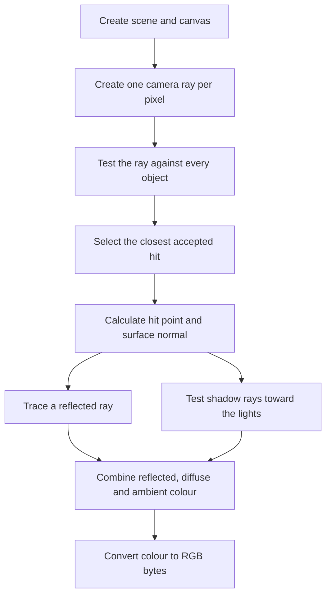

# Raytracer optimization: from profiling to a 9.37x speedup

This document explains the complete optimization process in simple English. It
is structured for presentation use: each improvement has its own explanation,
expected software and hardware effect, measured evidence, and a short
before/after code comparison.

The optimization kept the raytracer's tested output unchanged. The selected
800x800 images from Original, V1, V2, V3, V4 with batch 1024, and V4 with batch
2048 are byte-for-byte identical:

```text
SHA-256: 3F8C8BBCA2BD3188BA3AD3B95AE29950C53E1F534983D82A6AF15256AB3D59F0
```

The code excerpts are trimmed for readability, but they come from the actual
saved versions:

| Version | Source of truth |
|---|---|
| Original, before V1 | [Original renderer](../suites/original/bm_raytrace/run_benchmark.py) |
| After V1 / before V2 | [V1 snapshot](../results/raytrace/validation/2026-09-10-helpers/baseline.py) |
| After V2 / before V3 | [V2 snapshot](../results/raytrace/validation/2026-09-10-radius-camera/baseline.py) |
| After V3 / before V4 | [V3 snapshot](../results/raytrace/validation/2026-09-10-numpy-batches/baseline.py) |
| After V4 | [Current optimized renderer](../suites/optimized/bm_raytrace/run_benchmark.py) |

## 1. What the program does

For each pixel, the raytracer sends a ray from the camera into a scene. It finds
the closest object hit, calculates the surface normal, checks whether each light
is visible, adds reflected, diffuse, and ambient colour, and writes the final
RGB value to the canvas.



The original implementation is small, but each useful arithmetic operation is
surrounded by Python method calls, object allocation, attribute lookups, loop
control, and reference counting. That overhead matters because the same work is
repeated for hundreds of thousands of ray-object tests.

## 2. What profiling showed

The original profile pointed to recursive colour calculation, lighting, shadow
tests, sphere intersections, temporary vectors, and normalization.

| Original hot path | Approx. inclusive sampled time [s] | What it suggested |
|---|---:|---|
| `Scene.rayColour` | 106.88 | Reduce per-ray Python work and temporary hit data. |
| `SimpleSurface.colourAt` | 80.58 | Reduce repeated lighting and reflection overhead. |
| `Scene.visibleLights` | 56.10 | Stop rebuilding identical shadow rays. |
| `Sphere.intersectionTime` | 48.93 | Remove temporary vectors and repeated helper calls. |
| `Point.__sub__` | 25.87 | Reduce temporary object creation. |
| `Vector.normalized` | 18.86 | Reduce method calls and repeated normalization. |

These are inclusive call-path times, so they overlap and must not be added
together.

## 3. Optimization reasoning

The work progressed from low-risk Python changes to a larger data-parallel
rewrite:


The main question at every stage was: **can we do the same calculation with
less interpreter work, fewer temporary objects, or more work per compiled
operation?**

## 4. Measurement summary

All rows use the same 800x800 workload, one CPU, and CPython 3.12.13 on the
assignment server. V1 through V4 were measured during the same server boot. The
Original run used the same configuration but came from an earlier boot.

The benchmark time below comes from the saved timing result. Hardware counters
come from a separate `perf stat` execution of the same workload.

| Version | Benchmark time [ms] | Speedup vs previous | Speedup vs Original | Instructions [B] | Cycles [B] | Branch misses [M] |
|---|---:|---:|---:|---:|---:|---:|
| Original | 29,832.6 | 1.00x | 1.00x | 186.72 | 71.65 | 173.48 |
| V1: remove repeated Python work | 13,636.5 | 2.19x | 2.19x | 82.98 | 33.03 | 79.91 |
| V2: direct helper arithmetic | 12,734.2 | 1.07x | 2.34x | 77.80 | 30.33 | 68.10 |
| V3: cache radius and camera values | 12,075.5 | 1.05x | 2.47x | 74.43 | 29.44 | 66.87 |
| V4: NumPy, batch 1024 | 3,862.3 | 3.13x | 7.72x | 21.01 | 9.71 | 24.25 |
| V4: NumPy, batch 2048 | 3,183.6 | 1.21x | **9.37x** | 18.34 | 8.15 | 18.21 |

The relationship is strong: the faster versions execute far fewer instructions
and cycles. The final version is 9.37x faster, with 90.18% fewer instructions,
88.62% fewer cycles, and 89.50% fewer branch misses than Original.

| Version | Cache references [M] | Cache misses [K] | L1 data-load misses [M] | dTLB load misses [M] | Peak memory [MiB] |
|---|---:|---:|---:|---:|---:|
| Original | 45.85 | 189.90 | 585.92 | 6.93 | 36.27 |
| V1 | 41.04 | 176.03 | 410.78 | 3.33 | 36.39 |
| V2 | 25.31 | 171.00 | 326.12 | 2.93 | 36.43 |
| V3 | 35.21 | 184.65 | 376.70 | 2.79 | 36.48 |
| V4, batch 1024 | 97.97 | 681.76 | 213.00 | 1.74 | 48.97 |
| V4, batch 2048 | 78.68 | 671.85 | 201.15 | 1.45 | 48.91 |

The NumPy implementation uses about 34% more peak memory because it creates
arrays for a batch of rays. Its cache-miss percentage is also higher. However,
it executes so much less total work that the absolute number of L1 data loads,
L1 misses, instructions, and cycles still falls strongly.

## 5. V1 — remove repeated Python work

V1 kept the scalar, one-ray-at-a-time design. It removed repeated work and
temporary Python objects from the hottest paths.

| Original to V1 | Before | After | Change |
|---|---:|---:|---:|
| Benchmark time [ms] | 29,832.6 | 13,636.5 | **-54.29%** |
| Instructions [B] | 186.72 | 82.98 | **-55.56%** |
| Cycles [B] | 71.65 | 33.03 | **-53.90%** |
| Branch instructions [B] | 30.40 | 13.71 | **-54.90%** |
| Branch misses [M] | 173.48 | 79.91 | **-53.94%** |
| L1 data loads [B] | 42.99 | 19.11 | **-55.55%** |
| L1 data stores [B] | 10.20 | 4.57 | **-55.26%** |

Separate instrumentation of one 100x100 render explains the reduction:

| Operation | Original | V1 | Change |
|---|---:|---:|---:|
| `Vector` constructions | 452,943 | 85,013 | -81.2% |
| `Ray` constructions | 98,172 | 26,000 | -73.5% |
| Vector normalizations | 109,887 | 27,479 | -75.0% |
| Sphere intersection tests | 179,457 | 179,457 | unchanged |
| Halfspace intersection tests | 25,501 | 25,501 | unchanged |

The same geometry was tested. The program simply spent less Python work around
each test.

### 5.1 Reuse one shadow ray

**Problem:** The original code rebuilt and normalized the same shadow ray once
for every object tested against a light.

| Change | How and why | Expected software and hardware effect | Relation to measured results |
|---|---|---|---|
| Create one shadow ray per point/light pair and reuse it for all objects. | Every object receives the same origin and direction, so rebuilding the ray cannot change the answer. | Fewer `Ray` and `Vector` objects, method calls, square roots, divisions, instructions, loads, and stores. | The isolated local stage improved by about 22.7% in both passes. It is part of V1's 54.29% time and 55.56% instruction reduction. |

**Before**

```python
def _lightIsVisible(self, l, p):
    for (o, s) in self.objects:
        t = o.intersectionTime(Ray(p, l - p))
        if t is not None and t > EPSILON:
            return False
    return True
```

**After**

```python
def _lightIsVisible(self, l, p):
    return self._lightRayIsVisible(Ray(p, l - p))

def _lightRayIsVisible(self, ray):
    for (o, s) in self.objects:
        t = o.intersectionTime(ray)
        if t is not None and t > EPSILON:
            return False
    return True
```

**Presentation takeaway:** We moved identical work out of the inner object loop.

### 5.2 Cache camera row and column components

**Problem:** The camera recalculated the same horizontal value for every row and
the same vertical value for every column.

| Change | How and why | Expected software and hardware effect | Relation to measured results |
|---|---|---|---|
| Calculate horizontal components once per column and the vertical component once per row. | Those values depend on only one coordinate, so most pixel-loop calculations were duplicates. | At 100x100, component scaling falls from roughly 20,000 calls to 200. This reduces Python calls, multiplications, allocations, loads, and stores. | The isolated local result was small and noisy, so no individual speedup is claimed. It contributes to the combined V1 result. |

**Before**

```python
for y in range(canvas.height):
    for x in range(canvas.width):
        xcomp = vpRight.scale(x * pixelWidth - halfWidth)
        ycomp = vpUp.scale(y * pixelHeight - halfHeight)
        ray = Ray(eye.point, eye.vector + xcomp + ycomp)
```

**After**

```python
xcomponents = [vpRight.scale(x * pixelWidth - halfWidth) for x in range(canvas.width)]
for y in range(canvas.height):
    ycomp = vpUp.scale(y * pixelHeight - halfHeight)
    for x, xcomp in enumerate(xcomponents):
        ray = Ray(eye.point, eye.vector + xcomp + ycomp)
```

**Presentation takeaway:** A column value is calculated once for the column, and
a row value is calculated once for the row.

### 5.3 Select the closest hit during traversal

**Problem:** The original code created a list of eight result tuples and then
scanned that list a second time.

| Change | How and why | Expected software and hardware effect | Relation to measured results |
|---|---|---|---|
| Keep the nearest accepted hit while testing objects. | The current best hit is all later code needs. The strict comparison keeps the original tie behavior. | Removes the temporary list, result tuples, second loop, allocations, reference counting, and memory traffic. | The cumulative local step was about 3% faster. It contributes to V1's large instruction, cycle, and branch reduction. |

**Before**

```python
intersections = [(o, o.intersectionTime(ray), s) for (o, s) in self.objects]
i = firstIntersection(intersections)
```

**After**

```python
closestTime = None
for o, s in self.objects:
    t = o.intersectionTime(ray)
    if t is not None and t > -EPSILON:
        if closestTime is None or t < closestTime:
            closestObject = o
            closestTime = t
            closestSurface = s
```

**Presentation takeaway:** We kept only the best answer instead of building a
temporary collection of every answer.

### 5.4 Calculate sphere intersections with scalar locals

**Problem:** Each sphere test created a temporary `Vector` and called general
`dot` methods for a fixed three-coordinate calculation.

| Change | How and why | Expected software and hardware effect | Relation to measured results |
|---|---|---|---|
| Read coordinates into local variables and write the same arithmetic directly. | The sphere formula always uses exactly three coordinates, so general Python objects and dispatch add overhead without changing the math. | Removes temporary objects, attribute lookups, method calls, and reference management. The CPU sees fewer interpreter instructions around the same floating-point work. | This was the strongest isolated V1 step: about 32–34% faster locally. The number of sphere tests stayed unchanged. |

**Before**

```python
cp = self.centre - ray.point
v = cp.dot(ray.vector)
discriminant = (self.radius * self.radius) - (cp.dot(cp) - v * v)
```

**After**

```python
centre = self.centre
point = ray.point
direction = ray.vector
cpx = centre.x - point.x
cpy = centre.y - point.y
cpz = centre.z - point.z
v = ((cpx * direction.x) + (cpy * direction.y) + (cpz * direction.z))
cpSquared = ((cpx * cpx) + (cpy * cpy) + (cpz * cpz))
discriminant = (self.radius * self.radius) - (cpSquared - v * v)
```

**Presentation takeaway:** We preserved the formula and removed the Python object
machinery around it.

### 5.5 Add `__slots__`

**Problem:** By default, every `Vector`, `Point`, and `Ray` instance carries a
dictionary that maps attribute names to values.

| Change | How and why | Expected software and hardware effect | Relation to measured results |
|---|---|---|---|
| Declare the exact fields allowed in small geometry classes. | `__slots__` tells Python that the object needs only fixed fields, so it does not create a separate attribute dictionary for every instance. | Smaller objects, less allocation metadata, and potentially better CPU-cache locality. Coordinates are still Python objects; this is not packed numeric storage. | Isolated timing was inconsistent, so no individual speedup is claimed. It is part of the combined V1 result. |

**Before**

```python
class Vector(object):
    def __init__(self, initx, inity, initz):
        self.x = initx
        self.y = inity
        self.z = initz
```

**After**

```python
class Vector(object):
    __slots__ = ('x', 'y', 'z')

    def __init__(self, initx, inity, initz):
        self.x = initx
        self.y = inity
        self.z = initz

class Point(object):
    __slots__ = ('x', 'y', 'z')

class Ray(object):
    __slots__ = ('point', 'vector')
```

**Presentation takeaway:** Each temporary geometry object became a smaller,
simpler Python object.

### 5.6 Reuse the normalized shadow direction for diffuse lighting

**Problem:** After normalizing a shadow ray to test visibility, the original
lighting code subtracted the same points and normalized the same direction
again.

| Change | How and why | Expected software and hardware effect | Relation to measured results |
|---|---|---|---|
| Yield the already normalized shadow-ray direction to the lighting calculation. | The visibility ray and Lambert lighting use the same point-to-light direction. | Removes another subtraction, normalization, square root, division, temporary vector, and visible-light list entry for each visible light. | The cumulative local step improved by roughly 5%. It contributes to V1's reduction in ray construction, normalization, instructions, and cycles. |

**Before**

```python
for lightPoint in scene.visibleLights(p):
    contribution = (lightPoint - p).normalized().dot(normal)
```

**After**

```python
def _visibleLightDirections(self, p):
    for light in self.lightPoints:
        ray = Ray(p, light - p)
        if self._lightRayIsVisible(ray):
            yield ray.vector

for lightDirection in scene._visibleLightDirections(p):
    contribution = lightDirection.dot(normal)
```

**Presentation takeaway:** The direction calculated for the shadow test is reused
for lighting.

### 5.7 Remove discarded checkerboard scaling

**Problem:** `v.scale(...)` returned a new vector, but the code discarded that
return value. The next lines still read the original `v`.

| Change | How and why | Expected software and hardware effect | Relation to measured results |
|---|---|---|---|
| Remove the call whose result was unused. | It could not affect the checker pattern because `Vector.scale` does not modify `v` in place. | Saves one vector allocation, three multiplications, a call, and reference-management work for each checker lookup. | The isolated timing was inconclusive because this is a small part of the full render. It contributes to the combined V1 work reduction. |

**Before**

```python
v = p - Point.ZERO
v.scale(1.0 / self.checkSize)
if ((int(abs(v.x) + 0.5) + int(abs(v.y) + 0.5) + int(abs(v.z) + 0.5)) % 2):
```

**After**

```python
v = p - Point.ZERO
if ((int(abs(v.x) + 0.5) + int(abs(v.y) + 0.5) + int(abs(v.z) + 0.5)) % 2):
```

**Presentation takeaway:** We deleted work that produced a value nobody used.

## 6. V2 — write four hot helper calculations directly

V2 applied the same idea as scalar sphere intersections to four frequently
called helpers. The mathematical order was preserved, but intermediate method
calls and objects were removed.

| V1 to V2 | Before | After | Change |
|---|---:|---:|---:|
| Benchmark time [ms] | 13,636.5 | 12,734.2 | **-6.62%** |
| Instructions [B] | 82.98 | 77.80 | **-6.25%** |
| Cycles [B] | 33.03 | 30.33 | **-8.19%** |
| Branch instructions [B] | 13.71 | 12.95 | **-5.54%** |
| Branch misses [M] | 79.91 | 68.10 | **-14.78%** |
| L1 data-load misses [M] | 410.78 | 326.12 | **-20.61%** |

Separate 100x100 instrumentation shows what changed:

| Operation | V1 | V2 | Change |
|---|---:|---:|---:|
| `Vector` constructions | 85,013 | 67,538 | -20.6% |
| `Vector.magnitude` calls | 27,479 | 0 | -100% |
| `Vector.dot` calls | 68,549 | 41,070 | -40.1% |
| `Vector.scale` calls | 43,678 | 200 | -99.5% |
| Sphere intersection tests | 179,457 | 179,457 | unchanged |
| Halfspace intersection tests | 25,501 | 25,501 | unchanged |

Zero `magnitude` calls does not mean zero square roots. The square-root
calculation was moved directly into the optimized helpers.

### 6.1 Direct `Vector.normalized()` arithmetic

**Problem:** One normalization called `magnitude`, which called `dot`, and then
called `scale`. Each small helper added a Python call frame and lookups.

| Change | How and why | Expected software and hardware effect | Relation to measured results |
|---|---|---|---|
| Calculate squared length, square root, reciprocal, and coordinates in one method. | The exact operation is known, so the call chain can be replaced by the same arithmetic. | Fewer Python calls and lookups; no temporary result from `scale` beyond the final vector. The same square root and floating-point math remain. | Individual desktop timing was not repeatably significant. All four V2 changes together reduced server time 6.62%, instructions 6.25%, and cycles 8.19%. |

**Before**

```python
def normalized(self):
    return self.scale(1.0 / self.magnitude())
```

**After**

```python
def normalized(self):
    x = self.x
    y = self.y
    z = self.z
    factor = 1.0 / math.sqrt((x * x) + (y * y) + (z * z))
    return Vector(factor * x, factor * y, factor * z)
```

**Presentation takeaway:** The CPU performs the same math through one Python
method instead of a chain of methods.

### 6.2 Direct `Vector.reflectThrough()` arithmetic

**Problem:** Reflection constructed two intermediate vectors and then a third
vector for the result.

| Change | How and why | Expected software and hardware effect | Relation to measured results |
|---|---|---|---|
| Keep the dot product, then calculate the three result coordinates directly. | Only the final reflected vector is needed. | Vector constructions fall from three to one per reflection, reducing allocation, method dispatch, loads, stores, and reference counting. | No reliable isolated speedup was measured. Its effect is included in V2's stage-wide reductions. |

**Before**

```python
def reflectThrough(self, normal):
    d = normal.scale(self.dot(normal))
    return self - d.scale(2)
```

**After**

```python
def reflectThrough(self, normal):
    projection = self.dot(normal)
    return Vector(self.x - 2 * (projection * normal.x), self.y - 2 * (projection * normal.y), self.z - 2 * (projection * normal.z))
```

**Presentation takeaway:** Reflection now creates only the vector that the caller
actually needs.

### 6.3 Direct `Ray.pointAtTime()` arithmetic

**Problem:** Calculating a hit point first created a scaled direction vector and
then created the final point.

| Change | How and why | Expected software and hardware effect | Relation to measured results |
|---|---|---|---|
| Calculate the three point coordinates directly. | The temporary scaled vector is only an intermediate value. | Removes one vector allocation and the `scale` and addition method calls per shaded hit. | No reliable isolated speedup was measured. It contributes to V2's 20.6% reduction in vector constructions. |

**Before**

```python
def pointAtTime(self, t):
    return self.point + self.vector.scale(t)
```

**After**

```python
def pointAtTime(self, t):
    point = self.point
    vector = self.vector
    return Point(point.x + t * vector.x, point.y + t * vector.y, point.z + t * vector.z)
```

**Presentation takeaway:** The hit point is built directly, without a temporary
displacement object.

### 6.4 Direct `Sphere.normalAt()` arithmetic

**Problem:** A sphere normal first used overloaded point subtraction to create a
vector, then sent that vector through the general normalization call chain.

| Change | How and why | Expected software and hardware effect | Relation to measured results |
|---|---|---|---|
| Combine subtraction and normalization inside `normalAt`. | The same three displacement values can be normalized immediately. | Removes one temporary vector plus several method calls and attribute checks for each sphere hit. | No reliable isolated speedup was measured. The server's combined V2 result confirms that the group reduced real work. |

**Before**

```python
def normalAt(self, p):
    return (p - self.centre).normalized()
```

**After**

```python
def normalAt(self, p):
    centre = self.centre
    x = p.x - centre.x
    y = p.y - centre.y
    z = p.z - centre.z
    factor = 1.0 / math.sqrt((x * x) + (y * y) + (z * z))
    return Vector(factor * x, factor * y, factor * z)
```

**Presentation takeaway:** The normal is calculated in one place and only the
final vector is allocated.

## 7. V3 — cache values that do not change

V3 looked for calculations whose input stays constant during the render. It
calculates each of those values once and reuses it.

| V2 to V3 | Before | After | Change |
|---|---:|---:|---:|
| Benchmark time [ms] | 12,734.2 | 12,075.5 | **-5.17%** |
| Instructions [B] | 77.80 | 74.43 | **-4.33%** |
| Cycles [B] | 30.33 | 29.44 | **-2.92%** |
| Branch instructions [B] | 12.95 | 12.39 | **-4.34%** |
| Branch misses [M] | 68.10 | 66.87 | **-1.79%** |
| L1 data loads [B] | 18.23 | 17.15 | **-5.90%** |
| L1 data-load misses [M] | 326.12 | 376.70 | **+15.51%** |

The higher L1-miss count does not mean the change failed. Runtime, instructions,
cycles, and total L1 loads all fell. Software caching means “save a calculated
value”; it does not promise fewer misses in the processor's hardware cache.

### 7.1 Cache each sphere's radius squared

**Problem:** A sphere's radius never changes in this scene, but
`radius * radius` ran during every sphere intersection.

| Change | How and why | Expected software and hardware effect | Relation to measured results |
|---|---|---|---|
| Calculate `radiusSquared` when the sphere is constructed and read it during intersections. | One value is constant for the sphere's entire lifetime in this benchmark. | Replaces repeated Python multiplication with an attribute read. At 100x100, radius-squared multiplications fall from 179,457 to 7. | Radius-only local timing was about 1.05x faster. Together with camera caching, V3 reduced server time 5.17% and instructions 4.33%. |

**Before**

```python
def __init__(self, centre, radius):
    self.centre = centre
    self.radius = radius

discriminant = (self.radius * self.radius) - (cpSquared - v * v)
```

**After**

```python
def __init__(self, centre, radius):
    self.centre = centre
    self.radius = radius
    self.radiusSquared = radius * radius

discriminant = self.radiusSquared - (cpSquared - v * v)
```

**Presentation takeaway:** Seven spheres now calculate seven squared radii instead
of recalculating them for every ray.

### 7.2 Cache the combined camera-column direction

**Problem:** V1 cached the horizontal offset, but every pixel still recalculated
`eye.vector + xcomp`.

| Change | How and why | Expected software and hardware effect | Relation to measured results |
|---|---|---|---|
| Cache `eye direction + horizontal offset` once per column. | This sum is identical for every pixel in a column. Each pixel then adds only its row offset. | At 800x800 it avoids 639,200 temporary vectors and 1,917,600 coordinate additions. At 100x100, vector additions fall from 20,000 to 10,100. | Camera-only local timing was about 1.04x faster. It is part of V3's 5.17% server time reduction. |

**Before**

```python
xcomponents = [vpRight.scale(x * pixelWidth - halfWidth) for x in range(canvas.width)]
for y in range(canvas.height):
    ycomp = vpUp.scale(y * pixelHeight - halfHeight)
    for x, xcomp in enumerate(xcomponents):
        ray = Ray(eye.point, eye.vector + xcomp + ycomp)
```

**After**

```python
columnDirections = [eye.vector + vpRight.scale(x * pixelWidth - halfWidth) for x in range(canvas.width)]
for y in range(canvas.height):
    ycomp = vpUp.scale(y * pixelHeight - halfHeight)
    for x, columnDirection in enumerate(columnDirections):
        ray = Ray(eye.point, columnDirection + ycomp)
```

**Presentation takeaway:** Each column's shared camera direction is calculated
once instead of once per pixel.

## 8. V4 — process rays in NumPy batches

V1–V3 made scalar Python more efficient, but every ray still passed through
Python loops and Python objects. V4 changed the data layout and processed many
rays with compiled NumPy array operations.

| V3 to V4, batch 1024 | Before | After | Change |
|---|---:|---:|---:|
| Benchmark time [ms] | 12,075.5 | 3,862.3 | **-68.02%** |
| Instructions [B] | 74.43 | 21.01 | **-71.77%** |
| Cycles [B] | 29.44 | 9.71 | **-67.00%** |
| Branch instructions [B] | 12.39 | 3.58 | **-71.10%** |
| Branch misses [M] | 66.87 | 24.25 | **-63.74%** |
| L1 data loads [B] | 17.15 | 4.30 | **-74.91%** |
| L1 data-load misses [M] | 376.70 | 213.00 | **-43.46%** |
| Generic cache references [M] | 35.21 | 97.97 | **+178.24%** |

The extra cache references come from working on NumPy arrays. That tradeoff was
worth it: moving repetitive loops out of the interpreter removed over 70% of
instructions and cut runtime by 68%.

### 8.1 Dispatch rendering to a batched backend

**Problem:** The scalar renderer entered Python once for every pixel and then
again for every recursive ray, object, and light.

| Change | How and why | Expected software and hardware effect | Relation to measured results |
|---|---|---|---|
| Replace the scalar pixel loop in `Scene.render` with one `BatchedRenderer` call. | This makes the array implementation the hot rendering path while keeping the benchmark and scene interface. | Far fewer Python loop iterations and calls. More work is performed inside compiled numeric kernels. | This is the entry point to V4. The full V4 stage reduced runtime 68.02% at batch 1024. |

**Before**

```python
for y in range(canvas.height):
    ycomp = vpUp.scale(y * pixelHeight - halfHeight)
    for x, columnDirection in enumerate(columnDirections):
        ray = Ray(eye.point, columnDirection + ycomp)
        colour = self.rayColour(ray)
        canvas.plot(x, y, *colour)
```

**After**

```python
def render(self, canvas, batch_size=DEFAULT_BATCH_SIZE):
    BatchedRenderer(self).render(canvas, batch_size)
```

**Presentation takeaway:** Python starts a batch instead of tracing each pixel
through the full scalar pipeline.

### 8.2 Pack scene and material values into numeric arrays

**Problem:** Scalar rays repeatedly followed Python object references and read
attributes such as centre, colour, and material coefficients.

| Change | How and why | Expected software and hardware effect | Relation to measured results |
|---|---|---|---|
| Copy the static scene values into contiguous `float64` and Boolean arrays once per render. | A complete batch can read compact numeric data instead of many small Python objects. Packing remains inside the timed workload. | Better spatial locality, less pointer chasing, and data that compiled loops and possible SIMD kernels can consume directly. Array allocation raises peak memory. | Part of V4's 71.77% instruction and 74.91% L1-load reduction at batch 1024. Peak memory rose from about 36.5 MiB to 49.0 MiB. |

**Before**

```python
class Scene(object):
    def __init__(self):
        self.objects = []

    def addObject(self, object, surface):
        self.objects.append((object, surface))

for o, s in self.objects:
    t = o.intersectionTime(ray)
```

**After**

```python
self.geometry = []
for obj, surface in scene.objects:
    if isinstance(obj, Sphere):
        self.geometry.append((self.coordinates(obj.centre), obj.radiusSquared, None))
    else:
        self.geometry.append((None, None, self.coordinates(obj.normal)))

self.baseColours = np.array([s.baseColour for s in surfaces], dtype=np.float64).reshape(-1, 3).T.copy()
self.specular = np.array([s.specularCoefficient for s in surfaces])
self.lambert = np.array([s.lambertCoefficient for s in surfaces])
self.ambient = np.array([s.ambientCoefficient for s in surfaces])
```

**Presentation takeaway:** Scene data is arranged as numbers the processor can
scan efficiently.

### 8.3 Generate configurable batches of primary rays

**Problem:** The scalar loop creates and normalizes one `Ray` object at a time.

| Change | How and why | Expected software and hardware effect | Relation to measured results |
|---|---|---|---|
| Generate consecutive pixel indices, camera directions, and origins as arrays whose size is selected with `--batch-size`. | One array call handles many independent rays, and a shorter final batch handles the remainder. | Amortizes Python and NumPy call overhead across many rays. Larger batches use more temporary memory but give compiled loops more work per call. | Small local batches were slower because overhead dominated. At 100x100, batch 1 was 29.8x slower than scalar, while batch 1024 was 3.94x faster in the exploratory sweep. |

**Before**

```python
for y in range(canvas.height):
    for x, columnDirection in enumerate(columnDirections):
        ray = Ray(eye.point, columnDirection + ycomp)
        colour = self.rayColour(ray)
```

**After**

```python
for start in range(0, width * height, batch_size):
    pixels = np.arange(start, min(start + batch_size, width * height))
    x = pixels % width
    y = pixels // width
    directions = self.normalized(columns[:, x] + rows[:, y])
    yield (x, y, np.broadcast_to(origin, directions.shape), directions)
```

The command-line option is forwarded into the renderer:

```python
cmd.add_argument("--batch-size", type=int, default=DEFAULT_BATCH_SIZE)
```

**Presentation takeaway:** Batch size controls how many rays share one set of
array operations; it does not select the CPU's SIMD width.

### 8.4 Calculate many sphere intersections at once

**Problem:** The scalar function calculates one ray-sphere pair through Python
for every call.

| Change | How and why | Expected software and hardware effect | Relation to measured results |
|---|---|---|---|
| Store ray coordinates in array columns and apply the same intersection formula element by element. | Ray-sphere tests in a batch are independent and use the same operations. | Moves arithmetic loops into compiled code, exposes independent operations, and lets NumPy use CPU-specific kernels where available. It creates temporary arrays and masks. | A central contributor to V4's 71.77% instruction and 67.00% cycle reduction at batch 1024. No SIMD-instruction counter was collected, so this is not a measured SIMD-only gain. |

**Before**

```python
cpx = centre.x - point.x
cpy = centre.y - point.y
cpz = centre.z - point.z
v = ((cpx * direction.x) + (cpy * direction.y) + (cpz * direction.z))
cpSquared = ((cpx * cpx) + (cpy * cpy) + (cpz * cpz))
discriminant = radiusSquared - (cpSquared - v * v)
```

**After**

```python
cp = centre - origins
v = self.dot(cp, directions)
discriminant = radiusSquared - (self.dot(cp, cp) - v * v)
hits = discriminant >= 0
times[hits] = v[hits] - np.sqrt(discriminant[hits])
```

**Presentation takeaway:** One Python request now calculates the formula for many
independent rays.

### 8.5 Select closest hits with Boolean masks

**Problem:** Even after V1, Python still updated the closest hit separately for
each ray.

| Change | How and why | Expected software and hardware effect | Relation to measured results |
|---|---|---|---|
| Compare candidate times for a complete batch and update only array positions selected by a Boolean mask. | Each array lane represents one ray. Object traversal order and strict comparison preserve the original tie behavior. | Replaces many Python branches and loop iterations with compiled comparisons and indexed writes. | Supports V4's 71.10% drop in branch instructions and 63.74% drop in branch misses at batch 1024. These are full-stage figures. |

**Before**

```python
if t is not None and t > -EPSILON:
    if closestTime is None or t < closestTime:
        closestObject = o
        closestTime = t
```

**After**

```python
candidate = self.intersectionTimes(index, origins, directions)
selected = ((candidate > -EPSILON) & ((closest < 0) | (candidate < times)))
closest[selected] = index
times[selected] = candidate[selected]
```

**Presentation takeaway:** A mask performs the same decision for a full group of
rays.

### 8.6 Preserve shadow early exit with batched filtering

**Problem:** A shadow ray should stop testing objects as soon as a blocker is
found, but different rays in a batch become blocked at different times.

| Change | How and why | Expected software and hardware effect | Relation to measured results |
|---|---|---|---|
| Track visible rays and remove blocked indices before testing the next object. | This is the batched equivalent of returning `False` immediately for one ray. | Avoids later intersection work for already blocked rays while retaining array processing for the remaining rays. Index arrays and masks add some memory traffic. | Included in V4's major reductions in instructions, cycles, branches, and L1 loads. There was no separate server counter run for this method alone. |

**Before**

```python
for (o, s) in self.objects:
    t = o.intersectionTime(ray)
    if t is not None and t > EPSILON:
        return False
```

**After**

```python
visible = np.ones(directions.shape[1], dtype=bool)
remaining = np.arange(directions.shape[1])

for index in range(len(self.geometry)):
    if remaining.size == 0:
        break
    times = self.intersectionTimes(index, origins[:, remaining], directions[:, remaining])
    blocked = times > EPSILON
    visible[remaining[blocked]] = False
    remaining = remaining[~blocked]
```

**Presentation takeaway:** Blocked rays leave the batch's remaining shadow work,
just as one scalar ray would return early.

### 8.7 Batch normals, material selection, lighting, and reflections

**Problem:** Intersections alone were not enough. Returning to scalar Python for
normals, checker colours, lights, and recursion would keep most interpreter
overhead.

| Change | How and why | Expected software and hardware effect | Relation to measured results |
|---|---|---|---|
| Keep hit rays in arrays through normal calculation, checker selection, light accumulation, and recursive reflection. | A substantial kernel is needed so the cost of entering NumPy is spread across the full ray pipeline. | Keeps coordinates in compact arrays, exposes independent arithmetic, and removes per-ray Python calls. Masks and temporary arrays increase memory use and some cache counters. | Explains why V4 delivered a 3.13x stage speedup rather than only accelerating one formula. After V4, remaining Python profiling weight shifted toward `Canvas.plot`. |

**Before**

```python
reflectedRay = Ray(p, ray.vector.reflectThrough(normal))
reflectedColour = scene.rayColour(reflectedRay)
c = addColours(c, self.specularCoefficient, reflectedColour)
```

**After**

```python
d = directions[:, selected]
n = normals[:, selected]
projection = self.dot(d, n)
reflected = self.normalized(d - 2 * (projection * n))
reflectedColour = self.rayColours(points[:, selected], reflected, depth + 1)
shaded[:, selected] = shaded[:, selected] + specular[selected] * reflectedColour
```

Checker colours are also selected for all relevant hits:

```python
parity = np.remainder(np.floor(np.abs(points[:, selected]) + 0.5), 2)
odd = ((parity[0] + parity[1] + parity[2]) % 2) != 0
alternate = np.flatnonzero(selected)[odd]
colours[:, alternate] = self.otherColours[:, objects[alternate]]
```

**Presentation takeaway:** Rays stay batched through the expensive recursive
shading work.

### 8.8 Tune the batch size from 1024 to 2048

**Problem:** Batch size trades call overhead against temporary-array size. The
best value must be measured for the workload and machine.

| Change | How and why | Expected software and hardware effect | Relation to measured results |
|---|---|---|---|
| Increase the default from 1024 to 2048 rays after the server comparison. | At 800x800, about 625 batches are needed at 1024 but only about 313 at 2048. | Fewer Python-to-NumPy transitions, allocations, batch-loop branches, and repeated setup operations; each batch needs more temporary storage. | 1024 to 2048 cut time 17.57%, instructions 12.69%, cycles 16.11%, and branch misses 24.90%. Measured peak memory stayed near 49 MiB in these runs. |

**Before**

```python
DEFAULT_BATCH_SIZE = 1024
```

**After**

```python
DEFAULT_BATCH_SIZE = 1024 * 2
```

The renderer remains configurable:

```bash
python run_benchmark.py --width 800 --height 800 --batch-size 2048
```

**Presentation takeaway:** A larger batch gave NumPy more useful work per call
and reduced the number of batches by about half.

## 9. Did V4 use SIMD?

NumPy can use SIMD, but “using NumPy” is not proof that every operation executed
as a SIMD instruction.

SIMD means **Single Instruction, Multiple Data**. A CPU instruction applies the
same operation to several numbers at once. A simple analogy is carrying four
boxes in one cart instead of making four separate trips.

V4 gives NumPy arrays of independent rays:

```python
cp = centre - origins
v = self.dot(cp, directions)
discriminant = radiusSquared - (self.dot(cp, cp) - v * v)
```

That layout makes SIMD possible because the same add, subtract, and multiply
operations are applied across many elements. The local NumPy dispatch report
selected CPU-specific x86 kernels for the relevant `float64` operations.
However:

- Batch size is a software work size, not a SIMD lane count.
- NumPy decides which compiled kernel to use.
- Masks, strides, and short arrays can affect the executed path.
- The collected `perf stat` files did not count SIMD instructions.
- The measured V4 speedup combines less Python overhead, compiled loops, compact
  numeric data, better exposure of independent arithmetic, and possible SIMD.

The accurate presentation statement is: **V4 enabled NumPy to use optimized
compiled and potentially SIMD kernels, but the experiment did not isolate or
count a SIMD-only speedup.**

## 10. Software–hardware cause and effect

| Software decision | What changed for the processor | Evidence |
|---|---|---|
| Reuse results and remove temporary objects | Less allocation, pointer chasing, reference counting, and interpreter work | V1 cut instructions 55.56% and L1 loads 55.55%. |
| Write hot arithmetic directly | Fewer Python frames and dynamic method lookups around the same math | V2 cut another 6.25% of instructions and 8.19% of cycles. |
| Cache constant values | Fewer repeated additions and multiplications | V3 cut another 4.33% of instructions and 5.17% of time. |
| Pack numeric arrays | More regular memory access and data usable by compiled kernels; more temporary-array memory | V4 used about 34% more peak memory and more generic cache references. |
| Batch full ray pipelines | Many independent operations run per Python call; possible SIMD and more instruction-level parallelism | V3 to V4-1024 cut instructions 71.77%, cycles 67.00%, and time 68.02%. |
| Increase batch size | Fewer batches and less setup per ray | 1024 to 2048 cut another 17.57% of time. |

The final version intentionally trades some array storage and generic cache
activity for a much larger decrease in interpreted work.

## 11. Final result

| Original to final V4, batch 2048 | Original | Final | Change |
|---|---:|---:|---:|
| Benchmark time [ms] | 29,832.6 | 3,183.6 | **9.37x faster / -89.33%** |
| Instructions [B] | 186.72 | 18.34 | **-90.18%** |
| Cycles [B] | 71.65 | 8.15 | **-88.62%** |
| Branch misses [M] | 173.48 | 18.21 | **-89.50%** |
| L1 data-load misses [M] | 585.92 | 201.15 | **-65.67%** |
| dTLB load misses [M] | 6.93 | 1.45 | **-79.14%** |
| iTLB load misses [M] | 4.51 | 1.36 | **-69.90%** |
| Generic cache references [M] | 45.85 | 78.68 | **+71.60%** |
| Generic cache misses [K] | 189.90 | 671.85 | **+253.79%** |
| Minor page faults | 11,915 | 16,466 | **+38.20%** |

The repeated final fast run measured **3,118.9 +/- 38.3 ms** over 20 values,
which is about **9.57x faster** than the saved original timing. The 9.37x figure
is used for the strict stage table because it compares the selected single-run
Original and V4 results.

The strongest conclusion is not that every counter improved. Several
array-related memory counters increased. The important result is that the
processor executed about 90% fewer instructions and 89% fewer cycles while
producing the same tested image.

## 12. Measurement limits

- Timing and `perf stat` were separate executions. Timing is the main
  performance result; counters explain the trend.
- Original was measured on an earlier server boot. V1 through V4 share one boot,
  and all runs used the same CPU model, Python version, input, and one-CPU setup.
- The stage timings are single diagnostic values. The final V4 run has the
  stronger 20-value repeat.
- Hardware events were multiplexed and ran for about 20–30% of collection time.
  Perf scaled the displayed counts. Large differences are useful evidence;
  small differences should be treated cautiously.
- Server counters describe complete versions. A stage-wide counter change
  cannot be assigned exactly to one micro-optimization without a separate
  `perf stat` run for that edit.
- The individual desktop experiments are useful for ranking changes but do not
  replace the server measurements.

## 13. Evidence files

- [Optimization and validation notes](../suites/optimized/bm_raytrace/OPTIMIZATIONS.md)
- [Original perf stat](../results/raytrace/original/perf_stat.txt)
- [V1 perf stat](../results/raytrace/optimized/2026-09-17-13-27%20single%20v1/perf_stat.txt)
- [V2 perf stat](../results/raytrace/optimized/2026-09-17-14-13%20single%20v2/perf_stat.txt)
- [V3 perf stat](../results/raytrace/optimized/2026-09-17-14-18%20single%20v3/perf_stat.txt)
- [V4 batch-1024 perf stat](../results/raytrace/optimized/2026-09-17-14-22%20single%20v4%201024/perf_stat.txt)
- [V4 batch-2048 perf stat](../results/raytrace/optimized/2026-09-17-14-23%20single%20v4%202048/perf_stat.txt)
- [V1 isolated local stages](../results/raytrace/validation/2026-09-09-windows/README.md)
- [V2 helper validation](../results/raytrace/validation/2026-09-10-helpers/README.md)
- [V3 caching validation](../results/raytrace/validation/2026-09-10-radius-camera/README.md)
- [V4 NumPy validation](../results/raytrace/validation/2026-09-10-numpy-batches/README.md)
