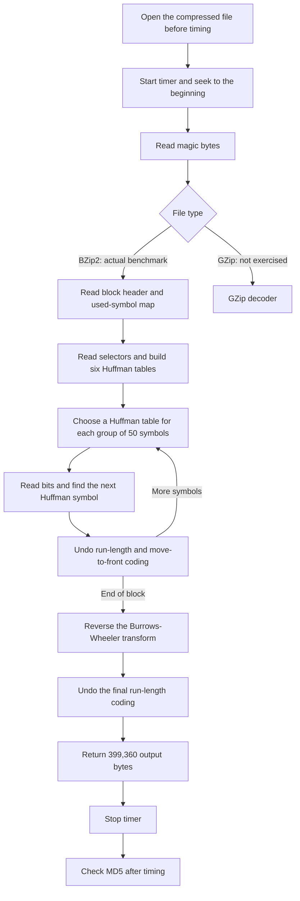
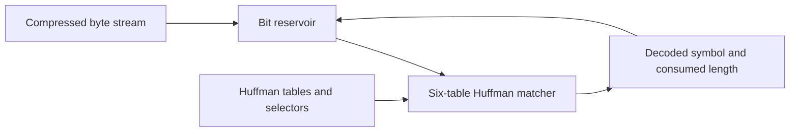

# Pyflate optimization: from profiling to a 1.54x speedup

This document explains the Pyflate optimization in simple English. It is
structured for presentation use: every improvement has its own rationale,
expected software and hardware effect, measured evidence, and compact
before/after code.

The optimized decoder produces exactly the same result as the original:

```text
Input:          67,562 bytes
Input SHA-256:  81101162ee7fc7a3db86d1a87e0c86781304eb9026aca4078432004a1383c51a
Output:         399,360 bytes
Output MD5:     afa004a630fe072901b1d9628b960974
Output SHA-256: 86dea2452c818fd8f52536c364eab095e6b0a7bc9fa33b874b10872e401e622f
```

| Version | Source of truth |
|---|---|
| Original | [Original Pyflate](../suites/original/bm_pyflate/run_benchmark.py) |
| Optimized | [Optimized Pyflate](../suites/optimized/bm_pyflate/run_benchmark.py) |
| Original measurements | [Original result directory](../results/pyflate/original/original%20results%20full%20run) |
| Optimized measurements | [Latest optimized result directory](../results/pyflate/optimized/2026-09-12-15-16) |

All four optimized result folders contain the same normalized source hash. The
changes were measured together, so this report does **not** label them V1, V2,
and so on, and it does not assign the combined performance-counter reduction to
one edit.

## 1. What the program does

Pyflate is a pure-Python decompressor. The benchmark input is
`interpreter.tar.bz2`, so the measured path is **BZip2**. The GZip decoder is
present in the file but is not called by this workload.

In simple terms, the decoder reads a compressed stream a few bits at a time.
It uses Huffman tables to turn short bit patterns into symbols, reverses the
move-to-front and run-length transformations, reverses the Burrows-Wheeler
transform, and rebuilds the original bytes.



The timed region includes seeking, bit-reader creation, magic detection, and
the complete decompression. Opening and closing the file and checking the MD5
are outside the timer.

## 2. What profiling showed

One decompression performs a large amount of small Python work:

| Work performed once per benchmark decode | Count |
|---|---:|
| Input bytes consumed by the bit reservoir | 67,562 |
| `RBitfield.readbits()` calls | 156,708 |
| `RBitfield.snoopbits()` calls | 341,601 |
| Huffman symbols decoded | 148,271 |
| Original move-to-front helper calls | 92,803 |
| Selector move-to-front operations | 2,966 |
| Data-symbol move-to-front operations | 89,837 |
| Bytes entering inverse BWT | 336,184 |
| BZip2 blocks | 1 |
| Huffman tables | 6 |

The original profile showed that Huffman lookup, bit reading, move-to-front
updates, and BWT reconstruction dominated the useful Python work.

The following values are rough estimates formed by scaling exclusive sample
shares from debug-Python profiles by separate regular-Python benchmark means.
Treat them as directional. The inclusive call paths shown below can overlap and must not be added together.

| Function | Original approx. self time [ms] | Optimized approx. self time [ms] | What it means |
|---|---:|---:|---|
| `decode_huffman_block` | 175.3 | 128.3 | The complete symbol-decoding loop performs less Python work even though some helper work was moved into it. |
| `HuffmanTable.find_next_symbol` | 80.2 | 65.6 | Absolute lookup time fell by about 18%; its percentage grew because other code became faster. |
| `move_to_front` | 101.5 | 0.3 | The hot data update was inlined. Its work did not all disappear; most moved into the caller. |
| `RBitfield.readbits` | 52.3 | 32.0 | Direct masking and simpler state updates reduced bit-reader overhead. |
| `RBitfield.snoopbits` | 50.1 | 44.9 | The same bit inspection remains necessary, but helper-call overhead fell. |
| `BitfieldBase._mask` | 38.0 | no separate frame | The mask expression was placed directly in the caller. |
| `bwt_transform` | 65.6 | 70.4 | The new counting algorithm did not show a profile improvement for this input. |
| `bwt_reverse` | 48.1 | 48.5 | Preallocation did not produce a clear measured gain. |

Inclusive profile samples provide the same overall direction:

| Inclusive call path | Original samples | Optimized samples | Change |
|---|---:|---:|---:|
| `HuffmanTable.find_next_symbol` | 14,713 | 10,197 | -30.69% |
| `RBitfield.readbits` | 4,042 | 1,878 | -53.54% |
| `move_to_front` | 5,824 | 18 | -99.69% as a separate function |

The `move_to_front` row reflects inlining as well as optimization. It must not
be read as "99.69% of all move-to-front work disappeared."

## 3. Optimization reasoning

The goal was to keep the decompression algorithm and output unchanged while
removing Python bookkeeping around it.


The main reasoning was:

1. Optimize operations repeated hundreds of thousands of times first.
2. Store bytes as byte values instead of thousands of one-byte Python objects.
3. Trade a small amount of setup work for cheaper work inside the hot loop.
4. Check the profile after optimization, including changes that did not clearly
   improve.
5. Use exact output bytes as the correctness requirement.

### 3.1 Complete change summary

The table below gives the complete presentation-level map. The detailed
sections that follow contain the before/after code.

| Change | How and why | Expected software and hardware effect | Relation to measured stats |
|---|---|---|---|
| Direct BZip2 byte access | Use the integer already returned by byte indexing and combine the reservoir update. | Fewer Python calls and attribute writes around the same scalar shift/add. | Runs 67,562 times; approximate refill self time fell from 14.7 to 12.5 ms. |
| Inline bit masks | Calculate masks in the reader and keep the remaining low bits directly. | Fewer call frames, lookups, shifts, inversions, branches, and temporary integers. | The mask frame disappears; read self time fell about 38.8%. |
| Dictionary-based Huffman lookup | Precompute a mapping from code length and visible bits to decoded symbol. | Fewer table-object loads, comparisons, loop iterations, and branches; small setup-memory cost. | 883,623 linear comparisons became 341,601 dictionary probes; inclusive lookup samples fell 30.69%. |
| Simpler bit reversal | Build the reversed result one bit at a time. | Simpler state, but still scalar setup work. | Only 882 calls; no isolated speedup is claimed. |
| In-place move-to-front | Replace list slicing and concatenation with pop and insert. | Fewer temporary lists, copied references, allocations, loads, and stores. | Part of the combined MTF improvement; not timed alone. |
| Inline hot move-to-front | Update the favourites list inside the decode loop. | Removes tens of thousands of Python function calls. | Helper calls fell from 92,803 to 2,966; some work moved into the caller. |
| Direct metadata appends | Use append and extend instead of one-element temporary lists. | Less allocation and reference copying during block setup. | Small setup contribution; not timed alone. |
| Histogram BWT construction | Count byte values instead of sorting and repeatedly searching. | Better algorithmic complexity, but more work executes in the Python interpreter. | Approximate BWT-transform self time rose from 65.6 to 70.4 ms; benefit is unconfirmed. |
| Preallocated inverse-BWT output | Fill an exact-size bytearray instead of growing a Python list. | Denser storage and less dynamic list growth. | Reverse time stayed near 48 ms; no clear individual gain. |
| Integer symbols and block bytearray | Keep byte values as integers in one contiguous buffer. | Fewer list entries, references, intermediate chunks, copies, and cache lines. | The combined 39.04% RSS and 67.59% L1-miss reductions are consistent with this representation change. |
| Contiguous final output | Append or extend one bytearray and convert once at the end. | Removes 302,016 list entries, pointer chasing, and a large final join. | The combined cache, page-fault, and memory reductions are consistent with this change. |
| GZip buffer cleanup | Apply similar bytearray changes to the GZip decoder. | Expected to reduce GZip object overhead. | Not executed by the BZip2 benchmark, so it explains none of the measured result. |

## 4. Overall measured result

The main comparison uses 60-value regular-Python runs from the same server boot,
on one CPU, with CPython 3.12.13 and the same 67,562-byte input.

| Measurement | Original | Optimized | Change |
|---|---:|---:|---:|
| Arithmetic mean | 662.237 ms | 430.018 ms | **-35.07%** |
| Median | 659.092 ms | 428.317 ms | -35.01% |
| Minimum | 652.654 ms | 425.536 ms | -34.80% |
| Maximum | 736.233 ms | 518.911 ms | -29.52% |
| Sample standard deviation | 11.667 ms | 11.810 ms | similar absolute variation |
| Maximum recorded RSS | 61.90 MiB | 37.73 MiB | **-39.04%** |
| Speedup | 1.00x | **1.540x** | 54.0% more work completed per unit time |

The latest run uses the current optimized source. A same-commit optimized run
measured 431.718 ms. It is only 0.39% slower than the latest 430.018 ms result,
which supports repeatability.

### 4.1 Supporting `perf stat` evidence

The counters below cover a complete pyperf invocation, including startup and
warmups. They are not the counters for one 662 ms or 430 ms decode, so timing
comes from `timing.json` and counters are supporting evidence.

| Counter over full pyperf invocation | Original | Optimized | Change |
|---|---:|---:|---:|
| Elapsed time | 63.715 s | 43.253 s | -32.11% |
| CPU clock | 63.204 s | 42.925 s | -32.08% |
| Instructions | 382.299 B | 248.717 B | **-34.94%** |
| CPU cycles | 143.192 B | 96.466 B | **-32.63%** |
| Branch instructions | 63.898 B | 36.850 B | **-42.33%** |
| Branch misses | 331.517 M | 189.527 M | **-42.83%** |
| Cache references | 451.591 M | 315.042 M | -30.24% |
| Cache misses | 38.158 M | 10.704 M | **-71.95%** |
| L1 data loads | 83.038 B | 54.141 B | -34.80% |
| L1 data-load misses | 1.754 B | 0.568 B | **-67.59%** |
| L1 data stores | 16.184 B | 11.173 B | -30.96% |
| Minor page faults | 695,238 | 394,683 | -43.23% |

| Derived rate | Original | Optimized | Interpretation |
|---|---:|---:|---|
| Instructions per cycle | 2.670 | 2.578 | Slightly lower; speed came from doing less work, not from making each instruction run faster. |
| Branch-miss rate | 0.519% | 0.514% | Nearly unchanged; fewer total branches explain the lower miss count. |
| Cache-miss rate | 8.45% | 3.40% | Consistent with a smaller, denser working set; identical-source reruns show that the exact count varies. |
| L1 data-load miss rate | 2.11% | 1.05% | Consistent with more useful data staying local to the core. |
| CPU utilization | about 0.992 CPU | about 0.992 CPU | Both versions remain single-core workloads. |

The close match between the **35.07% time reduction** and the **34.94%
instruction reduction** is the clearest cause-and-effect result. The program
became faster mainly because it asked the Python interpreter to execute less
work. Hardware events were multiplexed at roughly 20-31% coverage, so the large
trends are useful but small differences should not be overinterpreted. Cache-miss counts also varied across repeated runs of the same optimized source, so their direction supports the memory explanation but the exact percentage is not a per-edit result.

## 5. Improvement 1: read each compressed byte more directly

**Problem:** The hot BZip2 bit reader converted a one-byte `bytes` object with
`ord()` and updated the reservoir in two statements.

| Change | How and why | Expected software and hardware effect | Relation to measured stats |
|---|---|---|---|
| Read the integer byte with `c[0]` and combine shift and add. | In Python 3, indexing a `bytes` object already returns an integer, so `ord()` is unnecessary. | Removes a Python function call and one attribute update per input byte. The CPU still performs the same scalar shift and add, with less interpreter work around them. | This path runs 67,562 times. Approximate `_more` self time fell from 14.7 ms to 12.5 ms, but this edit was not measured alone. |

**Before**

```python
def _more(self):
    c = self._read(1)
    self.bitfield <<= 8
    self.bitfield += ord(c)
    self.bits += 8
```

**After**

```python
def _more(self):
    c = self._read(1)
    self.bitfield = (self.bitfield << 8) + c[0]
    self.bits += 8
```

**Simple explanation:** The byte is already a number. The optimized code uses
that number directly instead of asking Python to convert it again.

## 6. Improvement 2: calculate bit masks inside the hot reader

**Problem:** Every bit read called a tiny `_mask()` method. `readbits()` also
built a mask, shifted it, inverted it, and then used it to retain the unread
bits.

| Change | How and why | Expected software and hardware effect | Relation to measured stats |
|---|---|---|---|
| Inline `(1 << n) - 1` and retain the remaining low bits directly. | The helper contains one expression, and after reducing `self.bits` the required retained mask is simply `(1 << self.bits) - 1`. | Fewer Python call frames, lookups, shifts, inversions, branches, and temporary integers in a very hot path. | One decode calls `readbits` 156,708 times and `snoopbits` 341,601 times. `_mask` disappears as a sampled frame; `readbits` self time fell about 38.8%. |

**Before**

```python
def snoopbits(self, n=8):
    if n > self.bits:
        self.needbits(n)
    return (self.bitfield >> (self.bits - n)) & self._mask(n)

def readbits(self, n=8):
    if n > self.bits:
        self.needbits(n)
    r = (self.bitfield >> (self.bits - n)) & self._mask(n)
    self.bits -= n
    self.bitfield &= ~(self._mask(n) << self.bits)
    return r
```

**After**

```python
def snoopbits(self, n=8):
    if n > self.bits:
        self.needbits(n)
    return (self.bitfield >> (self.bits - n)) & ((1 << n) - 1)

def readbits(self, n=8):
    if n > self.bits:
        self.needbits(n)
    r = (self.bitfield >> (self.bits - n)) & ((1 << n) - 1)
    self.bits -= n
    self.bitfield &= (1 << self.bits) - 1
    return r
```

**Simple explanation:** Instead of calling another Python function to make a
small stencil for the bits, the reader makes the stencil where it is used.

## 7. Improvement 3: use dictionaries for Huffman lookup

**Problem:** To decode one symbol, the original code walked through Huffman
table objects one by one. It reused the visible bit pattern for entries of the
same length, but still compared that pattern against every entry.

A Python dictionary is a key-value lookup table. Here the key is
`(code length, visible bits)` and the value is the decoded symbol.

| Change | How and why | Expected software and hardware effect | Relation to measured stats |
|---|---|---|---|
| Build normal and reversed lookup dictionaries once, record the distinct code lengths, and probe one dictionary entry per length. | The tables are reused for thousands of symbols, so a small setup cost avoids repeated linear scans. | Fewer object loads, comparisons, loop iterations, and conditional branches. It uses a little more table memory. A hardware equivalent can compare many entries in parallel. | For 148,271 decodes, 883,623 linear entry comparisons became 341,601 dictionary probes, a 61.34% reduction in lookup attempts. Inclusive lookup samples fell 30.69%. |

**Before**

```python
def find_next_symbol(self, field, reversed=True):
    cached_length = -1
    cached = None
    for x in self.table:
        if cached_length != x.bits:
            cached = field.snoopbits(x.bits)
            cached_length = x.bits
        if (reversed and x.reverse_symbol == cached) or (not reversed and x.symbol == cached):
            field.readbits(x.bits)
            return x.code
```

**After**

```python
def populate_huffman_symbols(self):
    # Existing symbol construction remains above these lines.
    self.lookup_normal = {(x.bits, x.symbol): x.code for x in self.table}
    self.lookup_reversed = {(x.bits, x.reverse_symbol): x.code for x in self.table}
    self.unique_lengths = sorted(list(set(x.bits for x in self.table if x.bits > 0)))

def find_next_symbol(self, field, reversed_code=True):
    lookup = self.lookup_reversed if reversed_code else self.lookup_normal
    for length in self.unique_lengths:
        cached = field.snoopbits(length)
        code = lookup.get((length, cached))
        if code is not None:
            field.readbits(length)
            return code
```

**Simple explanation:** The original searched many cards in a pile. The
optimized version labels drawers by code length and visible bits, then opens the
matching drawer.

The lookup occupies a larger **percentage** of the optimized profile because
other functions became faster. Its absolute sample count and estimated time
both fell.

## 8. Improvement 4: simplify bit reversal during table setup

**Problem:** The original bit reversal maintained masks at both ends and moved
two bits per loop. The replacement builds the reversed result one bit at a
time.

| Change | How and why | Expected software and hardware effect | Relation to measured stats |
|---|---|---|---|
| Shift the result left and append the next low input bit. | The direct loop is easier to follow and uses fewer live variables and mask updates. | Simpler scalar operations and less temporary state. It is table-setup work, so the whole-program effect is expected to be small. | Called only 882 times per decode, compared with 148,271 symbol lookups. No isolated speedup is claimed. |

**Before**

```python
def reverse_bits(v, n):
    a = 1 << 0
    b = 1 << (n - 1)
    z = 0
    for i in range(n - 1, -1, -2):
        z |= (v >> i) & a
        z |= (v << i) & b
        a <<= 1
        b >>= 1
    return z
```

**After**

```python
def reverse_bits(v, n):
    z = 0
    for _ in range(n):
        z = (z << 1) | (v & 1)
        v >>= 1
    return z
```

**Simple explanation:** Read one bit, place it at the other end, and repeat.
Because this happens during setup rather than for every output byte, it is a
secondary optimization.

## 9. Improvement 5: update move-to-front lists without rebuilding them

**Problem:** The original helper created three list slices, combined them into
another list, and copied that list back into the original.

| Change | How and why | Expected software and hardware effect | Relation to measured stats |
|---|---|---|---|
| Remove the selected item with `pop()` and insert it at the front. | The list can be changed in place without creating several temporary lists. | Fewer allocations, copied references, loads, stores, and garbage for each update. | The original called this helper 92,803 times. The optimized helper remains for 2,966 selector updates; the hotter 89,837 data updates are inlined in the next improvement. |

**Before**

```python
def move_to_front(l, c):
    l[:] = l[c:c + 1] + l[0:c] + l[c + 1:]
```

**After**

```python
def move_to_front(lst, c):
    val = lst.pop(c)
    lst.insert(0, val)
```

**Simple explanation:** Instead of photocopying most of the list to move one
item, take that item out and put it at the front.

## 10. Improvement 6: inline the hot move-to-front update

**Problem:** The data-symbol loop called `move_to_front()` for nearly every
decoded non-run symbol. A Python function call was added to an operation that
needed only a few list actions.

| Change | How and why | Expected software and hardware effect | Relation to measured stats |
|---|---|---|---|
| Perform `pop()` and `insert()` directly in the decode loop. | The loop already needs the selected value for output, so it can fetch and move it in one place. | Removes tens of thousands of Python function calls and avoids repeated slicing allocations. The MTF state remains sequential because each symbol changes the next lookup order. | Helper calls fell from 92,803 to 2,966. The separate `move_to_front` inclusive profile samples fell 99.69%, while some work moved into `decode_huffman_block`. |

**Before**

```python
o = favourites[r - 1]
move_to_front(favourites, r - 1)
buffer.append(o)
```

**After**

```python
val = favourites.pop(r - 1)
favourites.insert(0, val)
buffer.append(val)
```

**Simple explanation:** The hot loop stopped asking another function to move
the item. It moves the item itself and immediately saves the value.

## 11. Improvement 7: avoid one-element temporary lists during setup

**Problem:** Expressions such as `lengths += [length]` create a new one-element
list just to add one item. The original used this pattern while reading symbol
maps and code lengths.

| Change | How and why | Expected software and hardware effect | Relation to measured stats |
|---|---|---|---|
| Use `append()` for one item and `extend()` for a known group. | These methods express the intended list update directly and avoid temporary one-element lists. | Fewer allocations, reference copies, and interpreter operations. | This runs during one-block setup, so it is a small contributor. It was not measured separately. |

**Before**

```python
used += [bool(huffman_used_bitmap & bit_mask)]
lengths += [length]
groups_lengths += [lengths]
```

**After**

```python
used.append(bool(bitmap & (1 << j)))
lengths.append(length)
groups_lengths.append(lengths)
```

**Simple explanation:** To add one item to a shopping list, add the item
directly instead of first making a second one-item shopping list.

## 12. Improvement 8: build the BWT table with a histogram

**Problem:** The original sorted every byte and then searched the sorted byte
string 256 times to find where each byte value begins.

| Change | How and why | Expected software and hardware effect | Relation to measured stats |
|---|---|---|---|
| Count each byte value, convert counts to starting positions, and fill the pointer table. | Counting is O(n + 256), while sorting is O(n log n) plus repeated searches. | The algorithm performs less abstract work and uses a fixed 257-counter table. In Python, however, the counting loop runs in the interpreter while `sorted()` and `bytes.find()` use fast native code. | `bwt_transform` approximate self time changed from 65.6 ms to 70.4 ms. This profile does **not** confirm an improvement for the fixed input. |

**Before**

```python
def bwt_transform(L):
    F = bytes(sorted(L))
    base = []
    for i in range(256):
        base.append(F.find(int2byte(i)))
    pointers = [-1] * len(L)
    for i, symbol in enumerate(L):
        pointers[base[symbol]] = i
        base[symbol] += 1
    return pointers
```

**After**

```python
def bwt_transform(l_seq):
    counts = [0] * 257
    for byte_val in l_seq:
        counts[byte_val + 1] += 1
    for i in range(1, 256):
        counts[i] += counts[i - 1]
    base = counts[:256]
    pointers = [-1] * len(l_seq)
    for i, symbol in enumerate(l_seq):
        pointers[base[symbol]] = i
        base[symbol] += 1
    return pointers
```

**Simple explanation:** The new algorithm counts how many zeros, ones, twos,
and so on exist, instead of sorting the whole collection.

This is also an important negative result: a better big-O algorithm can be
slower in pure Python when it replaces optimized C library work with a long
Python loop. It should be tested independently before being credited as a
speedup.

## 13. Improvement 9: preallocate inverse-BWT output

**Problem:** The original inverse BWT appended Python integers to a growing
list and converted the list to `bytes` at the end.

| Change | How and why | Expected software and hardware effect | Relation to measured stats |
|---|---|---|---|
| Allocate the exact-size `bytearray` first and write each byte by index. | The output size is already known. A bytearray stores compact byte values instead of pointers to Python objects. | Less dynamic growth and denser memory, with potentially better cache locality. The pointer-following BWT dependency remains unchanged. | Approximate `bwt_reverse` self time stayed near 48 ms. No clear individual benefit was measured. |

**Before**

```python
def bwt_reverse(L, end):
    out = []
    if len(L):
        T = bwt_transform(L)
        for i in range(len(L)):
            end = T[end]
            out.append(L[end])
    return bytes(out)
```

**After**

```python
def bwt_reverse(l_seq, end):
    if not l_seq:
        return b""
    t_table = bwt_transform(l_seq)
    out = bytearray(len(l_seq))
    curr = end
    for i in range(len(l_seq)):
        curr = t_table[curr]
        out[i] = l_seq[curr]
    return bytes(out)
```

**Simple explanation:** The decoder knows the box size in advance, so it makes
one correctly sized byte box instead of growing a list one entry at a time.

## 14. Improvement 10: keep decoded symbols as integers in a bytearray

**Problem:** The original favourites list stored one-byte `bytes` objects. The
decoded block was a list containing more byte strings, followed by a
`b"".join(buffer)` copy before inverse BWT.

| Change | How and why | Expected software and hardware effect | Relation to measured stats |
|---|---|---|---|
| Store byte values as integers and accumulate decoded data in one `bytearray`. | BZip2 symbols are values from 0 to 255. A bytearray packs those values directly instead of keeping list entries that point to one-byte strings and run chunks. | Fewer list entries, references, intermediate chunks, pointer loads, and copies; denser data is expected to improve cache locality. | Together with contiguous final output, this is consistent with the combined 39.04% RSS, 67.59% L1-miss, 71.95% cache-miss, and 43.23% page-fault reductions. |

**Before**

```python
favourites = [int2byte(i) for i, x in enumerate(used) if x]
buffer = []
buffer.append(favourites[0] * repeat)
buffer.append(o)
nt = bwt_reverse(b"".join(buffer), pointer)
```

**After**

```python
favourites = [i for i, x in enumerate(used) if x]
buffer = bytearray()
buffer.extend(bytes([favourites[0]]) * repeat)
buffer.append(val)
nt = bwt_reverse(buffer, pointer)
```

**Simple explanation:** Instead of managing a list of references and chunks and
joining them later, the optimized code stores byte values next to each other in one container.

## 15. Improvement 11: use one contiguous final output buffer

**Problem:** The original final run-length loop created byte slices and stored
them in a list. Just before returning, `bzip2_main()` joined 302,016 separate
byte-string entries.

| Change | How and why | Expected software and hardware effect | Relation to measured stats |
|---|---|---|---|
| Accumulate output in one `bytearray`, append integer bytes, extend repeated runs, cache the loop length, and convert to immutable `bytes` once. | The result is naturally a byte sequence, so a contiguous byte buffer matches the data better than a list of byte objects. | Expected to reduce object allocation, pointer chasing, final joining, memory traffic, and working-set size. | Original held 302,016 list entries before joining; optimized held one 399,360-byte bytearray. The measured RSS and cache reductions are consistent with the combined buffer changes. |

**Before**

```python
nt = nearly_there = bwt_reverse(b"".join(buffer), pointer)
i = 0
while i < len(nearly_there):
    if i < len(nearly_there) - 4 and nt[i] == nt[i + 1] == nt[i + 2] == nt[i + 3]:
        out.append(nearly_there[i:i + 1] * (ord(nearly_there[i + 4:i + 5]) + 4))
        i += 5
    else:
        out.append(nearly_there[i:i + 1])
        i += 1

return b"".join(out)
```

**After**

```python
nt = bwt_reverse(buffer, pointer)
i = 0
nt_len = len(nt)
while i < nt_len:
    if i < nt_len - 4 and nt[i] == nt[i + 1] == nt[i + 2] == nt[i + 3]:
        count = nt[i + 4] + 4
        out.extend(bytes([nt[i]]) * count)
        i += 5
    else:
        out.append(nt[i])
        i += 1

return bytes(out)
```

**Simple explanation:** The original output was hundreds of thousands of small
pieces that had to be glued together. The optimized output is built in one
continuous byte buffer.

## 16. Changes present in the file but not measured by this benchmark

### 16.1 GZip output improvements

The GZip path also changed from lists of one-byte objects to `bytearray` and
from list concatenation to `extend()`.

**Before**

```python
out = []
out.append(int2byte(b.readbits(8)))
out.append(int2byte(r))
out += out[-distance:]
return "".join(out)
```

**After**

```python
out = bytearray()
out.append(b.readbits(8))
out.append(r)
out.extend(out[-distance:])
return bytes(out)
```

These are reasonable representation improvements, but the benchmark input has
BZip2 magic `0x425a`. `gzip_main()` is never called, so none of the measured
1.54x speedup may be credited to this change.

### 16.2 Correctness and cleanup edits

The rewrite also contains edits that should not be presented as performance
wins:

| Edit | Purpose |
|---|---|
| Copy `x.count` instead of `x.bitfield` into a copied bitfield | Correct the stored byte count. |
| Use a strict selector bound, `selector_pointer < len(selectors_list)` | Avoid indexing one position beyond the selector list. |
| Replace string raises with exception objects | Use valid modern Python exception behavior. |
| Return the dictionary from `tables_by_bits()` | Complete an otherwise unused helper. |
| Simplify names, comments, messages, and dead branches | Improve readability and maintenance. |
| Stop subtracting `ord('0')` from the unused BZip2 block-size field | Remove unused work with negligible effect. |

These changes are part of the source difference but are not the reason for the
large timing result.

## 17. Cause and effect summary

| Observed change | Direct cause in the code | Why the CPU benefits |
|---|---|---|
| Time fell 35.07% | Less work in bit reading, lookup, MTF, and byte assembly | The interpreter executes fewer operations for the same decompression. |
| Instructions fell 34.94% | Removed helper calls, loops, temporary lists, byte objects, and joins | Fewer machine instructions are needed around the useful arithmetic. |
| Branches fell 42.33% | Dictionary probes replace many table-entry loop iterations; hot helper calls disappear | The core executes fewer loop and call-control branches. |
| Branch misses fell 42.83% but the miss rate stayed near 0.52% | Total branch count fell | Prediction quality is similar; there are simply fewer branches to predict. |
| L1 data-load misses fell 67.59% | Bytearrays replace lists of references and tiny byte objects | More useful data is packed into fewer cache lines. |
| Cache misses fell 71.95% | Fewer temporary objects and a smaller working set | The core waits less often for data farther down the memory hierarchy. |
| Maximum RSS fell 39.04% | Contiguous buffers replace hundreds of thousands of Python objects | The process needs less object payload and allocator metadata. |
| IPC fell slightly | Remaining work has different dependency and memory behavior | Speedup did not come from more instructions per cycle; it came from removing instructions. |

The counters describe the **combined optimized program**. They support these
mechanisms, but they cannot tell us exactly how many milliseconds belong to
each source edit.

## 18. Did this optimization use SIMD?

No deliberate SIMD was added.

- There is no NumPy.
- There are no compiler intrinsics.
- There is no native extension.
- The hot loops still execute as CPython bytecode on one core.

SIMD means one machine instruction performs the same operation on several
numbers at once. A simple example is adding four pairs of numbers with one
vector instruction instead of four scalar instructions.

Several Pyflate stages are difficult to vectorize directly:

| Stage | Dependency that limits batching |
|---|---|
| Variable-length Huffman decoding | The length of the current code decides where the next code begins. |
| Move-to-front decoding | Every decoded symbol changes the list used by the next symbol. |
| Inverse BWT | Each pointer tells the decoder which pointer to follow next. |
| Run-length decoding | A control symbol decides how much output is produced next. |

The optimization still helped the hardware by reducing instructions and packing
data more tightly. That is a memory and interpreter-overhead improvement, not
SIMD.

## 19. Hardware co-design connection

The remaining Huffman lookup is a reasonable hardware target because a hardware
unit can store the tables close to the matcher and compare several candidate
entries at the same time.

The repository contains an RTL design described in the [hardware acceleration report](../hardware/pyflate_v2/report/05_acceleration_justification.md):



This is **spatial parallelism**: hardware contains several comparison circuits
that operate together. It is not software SIMD, and the next symbol still
depends on how many bits the current symbol consumes.

For the measured workload:

| Hardware-study input | Value |
|---|---:|
| Huffman symbols | 148,271 |
| Current complete-top initiation interval | 2 cycles/symbol |
| Fill plus decode cycle model | `3 + 148,271 x 2 = 296,545 cycles` |
| Frequency | 200 MHz target, not measured |
| Analytical core time at that target | 1.483 ms |

Using the sampled software scope, the analytical component speedup is about
54.1x when crediting only the lookup function's self time, or 172.9x when
crediting its complete bit-reader subtree. Amdahl's law turns that into an
estimated original-program speedup of about **1.135x to 1.626x before
integration overhead**.

These are projections, not measured FPGA results. The design has not yet been
validated by synthesis, place-and-route, or end-to-end hardware execution. The
200 MHz figure is a target.

## 20. Validation and evidence

The current files match the source hashes recorded by the server after
normalizing line endings:

| Source | Normalized SHA-256 |
|---|---|
| Original | `ec5347c7045af86ba33e1b2c6f64bc4b506d0ade3b77391d7e41863fe25fb464` |
| Optimized | `cd4394b988f7a5751cc8ef2707e73bf198a130d98e266854aac5d352a703a44d` |

Validation performed:

- Directly decoded the repository input with both modules.
- Confirmed identical 399,360-byte output, MD5, and SHA-256.
- Ran all six tests in [`tests/test_huffman_reference.py`](../tests/test_huffman_reference.py); all passed.
- Used [original `timing.json`](../results/pyflate/original/original%20results%20full%20run/timing.json) and [optimized `timing.json`](../results/pyflate/optimized/2026-09-12-15-16/timing.json) for benchmark timing.
- Used [original `perf_stat.txt`](../results/pyflate/original/original%20results%20full%20run/perf_stat.txt) and [optimized `perf_stat.txt`](../results/pyflate/optimized/2026-09-12-15-16/perf_stat.txt) only for supporting counter trends.
- Used sampled profiles to explain hot paths, with the limitation that they used debug Python while the timing runs used regular Python.

## 21. Presentation takeaway

The optimized Pyflate is **1.54x faster** and uses about **39% less peak
memory** while producing exactly the same output.

The strongest evidence is the direct relationship between fewer Python
instructions and lower time:

```text
Instructions: -34.94%
Mean time:    -35.07%
```

The main ideas were to replace repeated linear Huffman entry scans with
dictionary probes, remove function calls and list slicing from move-to-front
updates, and store byte data in compact bytearrays instead of hundreds of
thousands of small Python objects. The BWT counting and preallocation changes
did not show a clear individual benefit, which is why they are presented as
unconfirmed rather than automatically credited for the final speedup.
