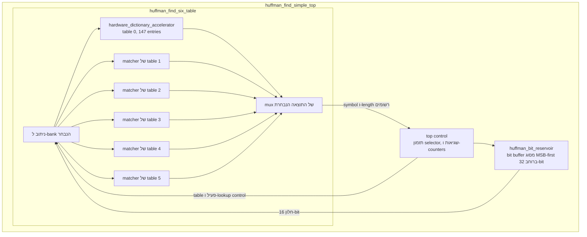
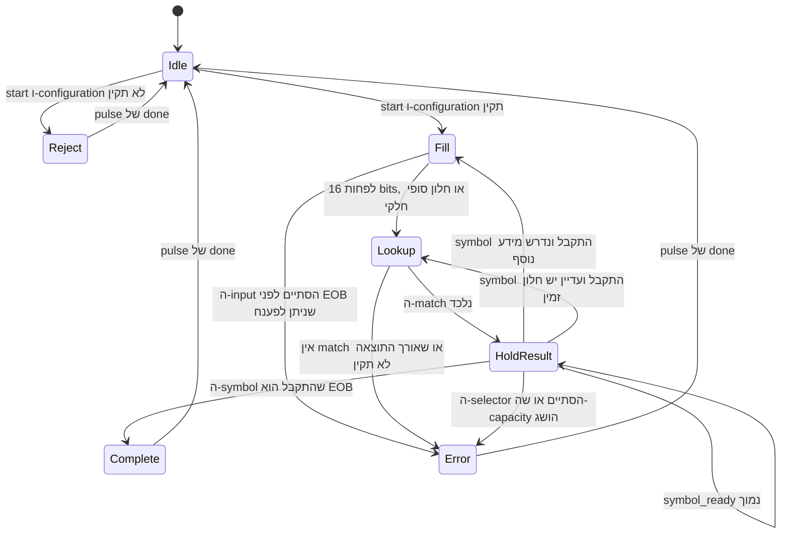

# 1. תיאור ה-Hardware

[חזרה לאינדקס הדוח](README.md)

## 1.1 ה-Accelerator המוצע

ה-Hardware המוצע מאיץ את הפעולה החוזרת שמבצעת הפונקציה
`HuffmanTable.find_next_symbol` ב-decoder מסוג bzip2 של pyflate. בדרך כלל,
ה-Software בוחן את ה-bits הדחוסים הבאים, מחפש ב-Huffman table, מחזיר את
ה-symbol שפוענח ומתקדם לפי אורך ה-code שנמצא. ה-Hardware מבצע את אותן ארבע
פעולות בתור פעולת streaming:

```text
compressed bytes -> bit window -> table match -> decoded symbol
                         ^                           |
                         `---- consume length <-----'
```

המימוש הפעיל מותאם במכוון ל-benchmark שנמדד:

| Parameter | ערך | סיבה |
|---|---:|---|
| Huffman tables | 6 | המספר המרבי שבו משתמש בלוק ה-bzip2 של ה-benchmark |
| Entries בכל table | 147 | גודל ה-Huffman alphabet שנצפה, כולל EOB |
| אורך code מרבי | 16 bits | מספיק עבור benchmark זה; קטן מהגבול הכללי של bzip2 |
| רוחב decoded symbol | 9 bits | `ceil(log2(147)) = 8`, אך 9 bits מייצגים בבטחה את מלוא ה-symbol interface של הפרויקט ואת הערכים 0–511 |
| Selector entries | 2,966 | Selector אחד לכל קבוצה של עד 50 decoded symbols |
| Reservoir | 32 bits | מחזיק חלון lookup של 16 bits יחד עם מרווח ל-refill |
| Input stream | 8 bits/cycle | גבול טבעי של memory/DMA המבוסס על bytes |
| Output stream | symbol ברוחב 9-bit בתוספת metadata | מזין ישירות את לולאת ה-post-processing הקיימת ב-Software |
| יעד Clock | 200 MHz | יעד מתון לתכנון במסגרת הקורס, שמספק 100 Msymbol/s ב-II=2; היתכנות של 5.000 ns עדיין מחייבת timing closure עבור device מסוים |

זהו component accelerator, ולא decompressor מלא של bzip2. ה-Software ממשיך
לנתח headers ו-Huffman metadata, לבצע RUNA/RUNB expansion, עיבוד
move-to-front, inverse BWT, הרחבת run-length סופית ואימות output.

## 1.2 היררכיית ה-SystemVerilog הפעילה



המימוש מחולק לארבעה קובצי מקור פעילים:

| Module | Source | אחריות |
|---|---|---|
| `hardware_dictionary_accelerator` | [`rtl/huffman_find_simple.sv`](../rtl/huffman_find_simple.sv) | מאחסן ומחפש ב-table אחד; יוצר alignment mask; מכריע בין matches לפי האורך הקצר ביותר תחילה; ורושם את התוצאה. |
| `huffman_find_six_table` | [`rtl/huffman_find_six_table.sv`](../rtl/huffman_find_six_table.sv) | יוצר שישה matchers, מנתב writes ו-requests ל-bank אחד, מבודד operands שאינם פעילים ומבצע multiplexing לתוצאה אחת. |
| `huffman_bit_reservoir` | [`rtl/huffman_bit_reservoir.sv`](../rtl/huffman_bit_reservoir.sv) | מקבל bytes בסדר MSB-first, משליך את ה-bit offset ההתחלתי, חושף את 16 ה-bits הבאים ומסיר מספר משתנה של bits לאחר קבלת תוצאה. |
| `huffman_find_simple_top` | [`rtl/huffman_find_simple_top.sv`](../rtl/huffman_find_simple_top.sv) | מחבר את ה-reservoir ואת ה-table banks; מתזמן selectors בכל 50 symbols; ומממש start/done/error, EOB, capacity ו-counters. |

סדר compile מוצע:

```text
1. rtl/huffman_find_simple.sv
2. rtl/huffman_find_six_table.sv
3. rtl/huffman_bit_reservoir.sv
4. rtl/huffman_find_simple_top.sv
5. tests/tb_huffman_find_simple_top.sv
```

המקור `rtl/huffman_find_accel.sv` **אינו** instantiated בהיררכיה זו. זוהי
חלופה ישנה יותר, המשתמשת ב-canonical range ברוחב 20-bit, ואסור לערבב אותה עם
ה-direct-table interface ברוחב 16-bit שמתואר כאן.

## 1.3 מנוע match עבור table יחיד

### ייצוג ה-Configuration

כל table entry מאחסן:

```text
pattern[15:0]  mask[15:0]  symbol[8:0]  length[4:0]  valid
```

ה-Software כותב canonical code מיושר לימין. ה-Hardware יוצר pattern ו-mask
מיושרים לצד ה-MSB. עבור `W = KEY_WIDTH`, code מיושר לימין `c`, ואורך `L`:

```text
shift   = W - L                                      [bits]
pattern = (c << shift) mod 2^W                       [W-bit vector]
mask    = ((2^W - 1) << shift) mod 2^W              [W-bit vector]
```

דוגמה עבור `W=16`, ה-code `c=0b101=5`, ו-`L=3`:

```text
shift   = 16 - 3 = 13 bits
pattern = 0x0005 << 13 = 0xA000
mask    = 0xFFFF << 13 = 0xE000 after 16-bit truncation
```

אם חלון ה-lookup הבא מתחיל ב-`101...`, אז:

```text
(lookup_bits AND 0xE000) == 0xA000
```

מתקיים בלי תלות ב-13 ה-bits הנותרים. מוסכמה זו פותרת את חוסר הבהירות הקודם
לגבי alignment: ה-configuration codes מיושרים לימין; ה-lookup bits של
ה-reservoir וה-patterns המאוחסנים פנימית מיושרים לצד ה-MSB.

אורך אפס מבטל slot. אורך שאינו אפס וגדול מ-`KEY_WIDTH` אינו חוקי. Writes
מתבצעים רק כאשר `dict_wr_addr < NUM_ENTRIES`, וכך נמנעת גישה ל-array index
מחוץ לטווח אף על פי שה-port ברוחב שמונה bits יכול לייצג 0–255.

### השוואה מקבילית

כל 147 ה-entries ב-bank הנבחר מושווים באופן combinational:

```text
raw_match[i] = lookup_valid
             AND valid[i]
             AND ((lookup_bits AND mask[i]) == pattern[i])
```

לאחר מכן המימוש מחפש lengths מ-1 עד 16 ו-entries מ-0 עד 146. ה-match הראשון
באורך הקצר ביותר מנצח. Huffman code חוקי הוא prefix-free, ולכן בדרך כלל אמורה
להיות בדיוק תוצאה אחת; priority של shortest-first מספק התנהגות דטרמיניסטית
גם אם ה-Software מתכנת בטעות entries חופפים ולא תקינים.

### Registered output

ה-`(found, symbol, length)` שנבחר נלכד ב-output register בעל entry אחד. הוא
פועל לפי כלל ה-ready/valid transfer הסטנדרטי:

```text
request_fire = lookup_valid AND lookup_ready
result_fire  = result_valid AND result_ready
```

ה-core יכול לקבל request כאשר ה-output register שלו ריק, או כאשר התוצאה שבו
נצרכת באותו edge:

```text
lookup_ready = NOT result_valid OR result_ready
```

אם `result_valid=1` ו-`result_ready=0`, שדות התוצאה נשארים יציבים. כך נמנע
אובדן תוצאה כאשר ה-downstream logic נמצא ב-stall.

## 1.4 Wrapper של שישה tables

bzip2 יכול להשתמש בכמה Huffman tables ומספק selector שמודיע ל-decoder איזה
table חל על כל קבוצה של 50 symbols. ה-wrapper יוצר שישה table banks עצמאיים,
כך שמעבר בין tables אינו מחייב טעינה מחדש של ה-CAM.

עבור bank `k`:

```text
bank_lookup_valid[k] = lookup_valid AND (active_table == k)
bank_lookup_bits[k]  = lookup_bits when selected, otherwise 0
```

רק ה-bank הנבחר מקבל request פעיל או lookup operand משתנה. operand isolation
זה מפחית dynamic switching מיותר בחמשת ה-banks האחרים. הוא אינו מבטל את
ה-leakage או את ה-area שלהם.

Configuration writes מפוענחים באופן דומה באמצעות `dict_wr_table`. ה-wrapper
מדווח על configuration error אם ה-table ID, כתובת ה-entry או length שאינו
אפס נמצאים מחוץ לטווח הנתמך.

## 1.5 Bit reservoir בסדר MSB-first

ה-reservoir ממיר byte stream שקל לשלב במערכת לתצוגת 16-bit הדרושה ל-table
matcher. ה-bits התקפים נשמרים בצד המשמעותי ביותר של register ברוחב 32-bit:

```text
buffer_q[31] = next compressed bit
peek_bits    = buffer_q[31:16]
```

ב-byte הראשון, מושלכים `start_bit` leading bits. הדבר מאפשר ל-job להתחיל
ב-bit position שרירותי בתוך ה-byte הראשון שלו. bytes נוספים מצורפים מיד לאחר
ה-bits התקפים כעת.

לאחר קבלת תוצאת symbol, code באורך `L` נצרך כך:

```text
buffer_next    = buffer_current << L
bit_count_next = bit_count_current - L
```

Consumption ו-refill של byte אחד יכולים להתרחש באותו rising edge. לפני
ה-byte האחרון, ה-matcher ממתין לחלון מלא של 16-bit. לאחר `byte_last`,
ה-reservoir מאפשר חלון חלקי המרופד באפסים, כדי שניתן יהיה לפענח EOB code קצר
בסוף ה-input. ה-top דוחה candidate כאשר `match_len > valid_bits`, ולכן אפסי
ה-padding אינם יכולים ליצור match ארוך שגוי.

## 1.6 Top-level control

ה-top level מבצע job אחד באמצעות השלבים הלוגיים הבאים:



ה-RTL אינו מקודד labels אלה כ-FSM enumerated גדול; הוא משתמש ב-`busy`, במצב
result-valid של ה-matcher, במצב ה-reservoir ובבדיקות terminal condition לפי
סדר מוגדר. דיאגרמת ה-state היא הפירוש ההתנהגותי המקביל.

בעת `start`, ה-top לוכד:

- bit offset של ה-byte הראשון;
- מספר ה-selector entries;
- EOB symbol;
- destination symbol capacity; וכן
- selector table מספר אפס.

ה-table הפעיל נשמר ב-`active_table_q`, במקום להיקרא באופן asynchronous
מ-selector memory בכל lookup. שינוי זה, שנוסף עבור timing, מסיר מהפעולה
הרגילה את המסלול `selector index -> selector RAM -> bank mux -> CAM -> priority encoder`.
ה-selector הבא נלכד רק כאשר ה-symbol ה-50 בקבוצה מתקבל.

התנהגות ה-selector מבוססת על output symbols שהתקבלו, ולא על matches
ספקולטיביים:

```text
group positions 0..49  -> selector[0]
group positions 50..99 -> selector[1]
group positions 100..149 -> selector[2]
```

EOB מועבר דרך result stream הרגיל. Completion מופעל רק ב-clock edge שבו תוצאת
ה-EOB מתקבלת, ולכן backpressure אינו יכול להשמיט את ה-symbol האחרון.

## 1.7 שגיאות ו-Observability

ה-top מספק terminal status ו-counters:

| Code | Name | משמעות |
|---:|---|---|
| `0x00` | `ERR_NONE` | אין שגיאה |
| `0x02` | `ERR_BAD_CONFIG` | Configuration לא תקין/לא מלא או write ו-start לא חוקיים בו-זמנית |
| `0x04` | `ERR_TRUNCATED` | לא נותרה תוצאה שניתן לפענח לאחר ה-input byte האחרון, כולל מצב שבו אין מספיק bits אמיתיים |
| `0x05` | `ERR_NO_SYMBOL` | חלון lookup מלא לא התאים לאף table entry |
| `0x06` | `ERR_SELECTOR` | לוח ה-selector אינו תקין או הסתיים |
| `0x07` | `ERR_OUTPUT_OVERFLOW` | ה-symbol capacity הושג לפני EOB שהתקבל |

סיווג no-match שממומש משתמש ב-flag הרשום `reservoir_last_seen`: הוא מדווח
`ERR_TRUNCATED` כאשר flag זה מוגדר, ואחרת מדווח `ERR_NO_SYMBOL`. לכן, גם חלון
lookup מלא של 16-bit שאין עבורו match לאחר ה-input byte האחרון מסווג במימוש
ה-RTL הנוכחי בתור `ERR_TRUNCATED`.

ה-counters מדווחים על העבודה הלוגית ולא רק על פעילות ה-interface:

- `bits_consumed`: סכום אורכי ה-code עבור output symbols שהתקבלו;
- `symbols_produced`: מספר ה-outputs שהתקבלו, כולל EOB;
- `cycle_count`: מספר ה-clocks שבהם המודול היה busy;
- `input_stall_cycles`: cycles שבהם ה-reservoir יכול היה לקבל byte אך ה-producer
  לא סיפק byte; וכן
- `output_stall_cycles`: cycles שבהם symbol תקף נחסם על ידי ה-consumer.

Input stalls ו-output stalls יכולים לחפוף לתנאים פנימיים אחרים. לכן,
stall counters הם קטגוריות diagnostic, ואין לחבר אותם אוטומטית כדי לשחזר את
מספר ה-cycles הכולל.

## 1.8 Initiation interval ופשטות מכוונת

ל-table engine עצמו יש output רשום בעל entry אחד, והוא יכול לקבל lookup עצמאי
אחד בכל cycle כאשר התוצאות מתקבלות ברציפות. אולם ל-decoder המלא קיימת תלות
feedback בעלת אורך משתנה:

```text
lookup bits -> matched length -> consume reservoir -> next lookup bits
```

ה-top הפשוט מאפשר רק lookup אחד שטרם הושלם. Match נרשם ב-edge אחד, וה-length
שלו נצרך ב-accepting edge הבא. לכן מתקיים:

```text
II = 2 cycles/symbol with no stream stalls
```

בחירה זו שמרנית וקלה להסבר ולאימות. Architecture אגרסיבית יותר יכולה לבצע
bypass או לחזות את חלון ה-reservoir הבא, אך הדבר ייצור combinational feedback
path ארוך יותר, או יחייב speculation ו-recovery.

## 1.9 הנחות Reset ו-Clock

כל ה-modules הפעילים משתמשים ב-active-low reset בתוך `always_ff @(posedge clk or
negedge rst_n)`. ה-assertion יכול להיות asynchronous. ה-deassertion חייב להיות
מסונכרן ל-`clk` על ידי המערכת המקיפה, כדי ש-registers לא יצאו מ-reset ב-edges
שאינם קשורים זה לזה. דרישה זו מתועדת כעת ב-RTL ports.

ה-clock constraint בקובץ
[`constraints/huffman_find_simple_top.xdc`](../constraints/huffman_find_simple_top.xdc)
מבקש period של 5.000 ns:

```tcl
create_clock -name core_clk -period 5.000 [get_ports {clk}]
```

שורה זו מבטאת **יעד**, ולא frequency שהושג. עדיין נדרשים I/O delays שתלויים
ב-device, generated clocks, clock uncertainty, טיפול ב-reset/CDC, synthesis,
placement, routing ו-static timing analysis.

## 1.10 נכסי Verification ומצב המימוש

קיימים שני קובצי self-checking SystemVerilog testbench:

- [`tests/tb_huffman_find_simple.sv`](../tests/tb_huffman_find_simple.sv)
  בודק table programming, alignment, shortest priority, no-match, bounds
  ו-output backpressure.
- [`tests/tb_huffman_find_simple_top.sv`](../tests/tb_huffman_find_simple_top.sv)
  בודק byte streaming עד EOB, stalls ו-counters סופיים.

ה-Python reference model בקובץ
[`tools/huffman_reference.py`](../tools/huffman_reference.py) מספק golden model
שימושי לבדיקות randomized גדולות יותר.

בזמן כתיבת דוח זה, אין ב-workspace תוצאה של HDL simulator או של מימוש על FPGA
יעד. לכן ה-tests **ממומשים אך לא נטען שהם הורצו כאן**, ו-frequency, area ו-power
נשארים יעדים/הערכות אנליטיים. הסתייגות זו חשובה: RTL שלם מבחינה לוגית אינו זהה
ל-Hardware מאומת, בר-synthesis בכל tool, או כזה שעבר timing closure.

ששת ה-Python reference tests הורצו בהצלחה ב-2026-09-14 באמצעות ה-Python runtime
המצורף ו-`pyperf` import stub שאינו משפיע על ההתנהגות. הם מאמתים את ה-golden
algorithm ואת מספר ה-lookups שנמדד, ולא הרצה של SystemVerilog.

ה-top test הקומפקטי עדיין אינו מכסה את מעבר ה-selector לאחר 50 symbols,
`start_bit` שאינו אפס, כל מקרה של consume/refill בו-זמנית, error paths או ערך
מדויק של `cycle_count`. ה-tables האמיתיים של ה-benchmark נבדקים באמצעות
ה-Python reference tests, אך עדיין לא באמצעות ה-SystemVerilog testbench. אלה
הם צעדי verification אופציונליים ושימושיים להמשך, ולא evidence שכבר נטען.

## 1.11 מגבלות מכוונות

התכנון הפעיל אינו מספק במכוון:

- codes ארוכים מ-16 bits;
- יותר משישה tables, יותר מ-147 entries לכל table או יותר מ-2,966 selectors;
- decoding בסדר LSB-first או עם reversed-code;
- כמה jobs בו-זמנית;
- context save/restore או preemption;
- standard bus, cache-coherent port, DMA master או interrupt output;
- פקודת configuration-clear/epoch נפרדת או per-table loaded flag;
  ה-configuration נשמר עד global reset, ולכן ה-Software חייב לכתוב מחדש את כל
  6x147 ה-slots, לבטל entries שאינם קיימים ולכתוב מחדש את כל ה-selector prefix
  שבשימוש לפני שימוש ב-configuration שונה;
- הגנה מפני שינוי ה-table configuration על ידי ה-Software במהלך job, מעבר
  ל-`cfg_ready` ולהתנהגות המצופה מה-adapter; או
- יכולות production reliability כגון ECC, watchdog recovery, formal proof
  או redundant error reporting.

ערכי ה-default וה-test parameters הם ה-configurations הנתמכים. Elaboration עם
ערך של table יחיד או entry יחיד ייצור ports ברוחב אפס בגלל `$clog2`, וה-reservoir
מניח `BUFFER_WIDTH>=8`, `KEY_WIDTH<=BUFFER_WIDTH` ו-length ברוחב חמישה bits
(`KEY_WIDTH<=31`). הוספת formal elaboration guards היא שיפור portability עתידי.

השמטות אלה מתאימות ל-accelerator ייעודי ל-benchmark במסגרת קורס, אך יש לבחון
מחדש כל אחת מהן לפני שימוש בתכנון כ-product block כללי.
