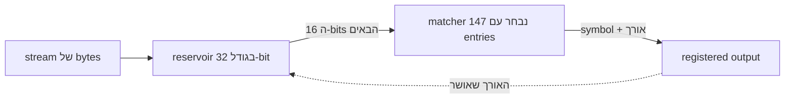
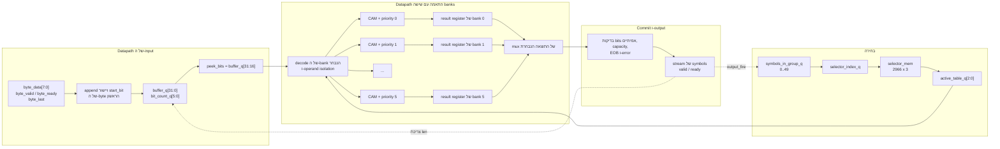
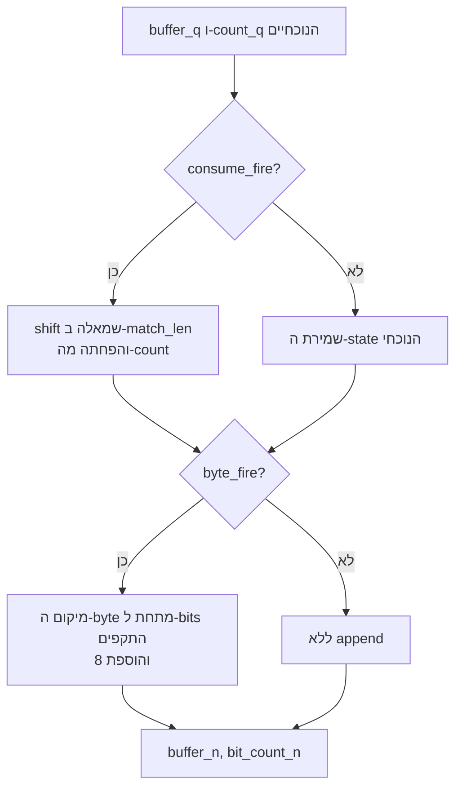
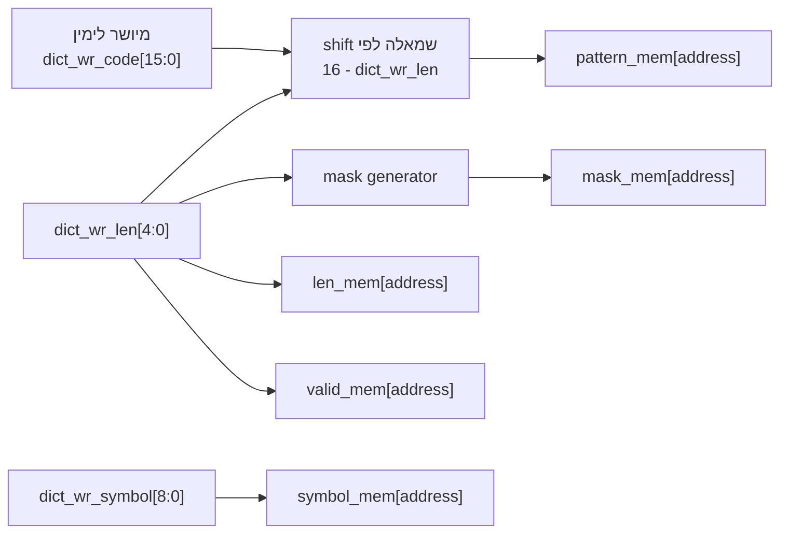
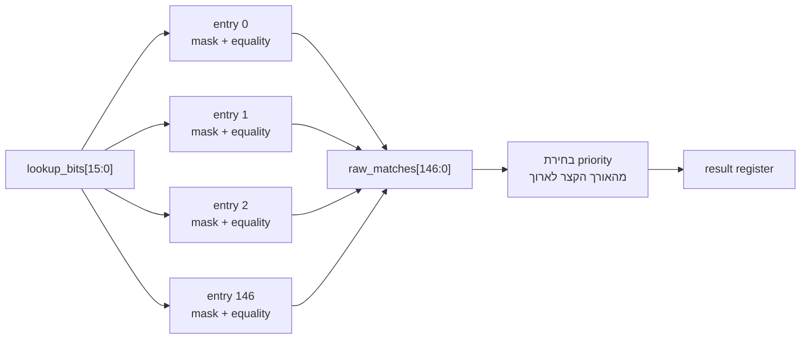
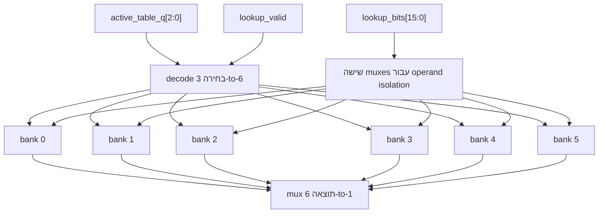
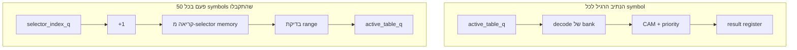
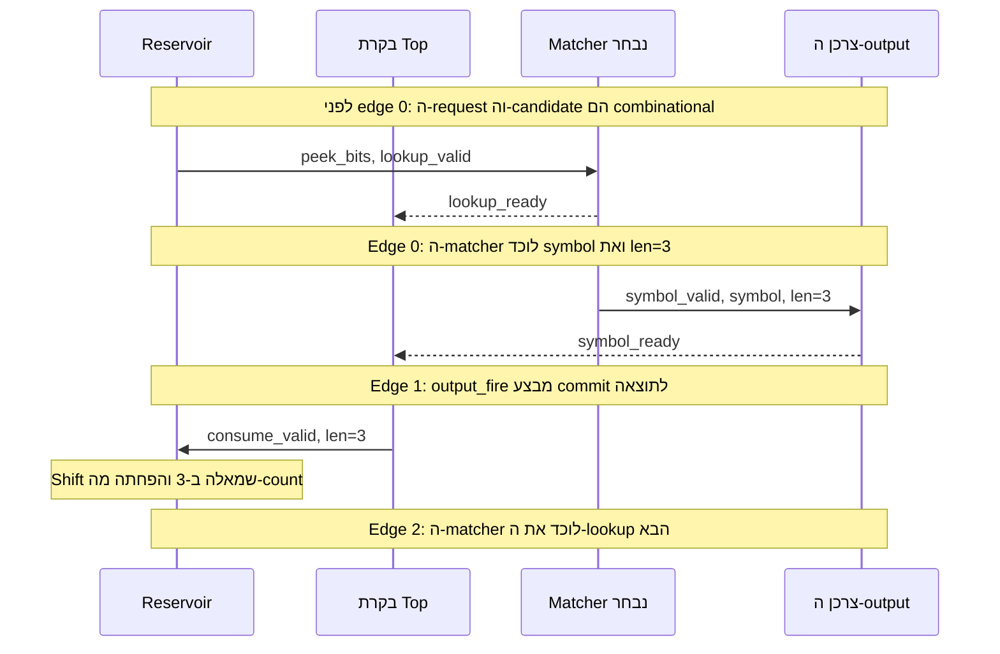
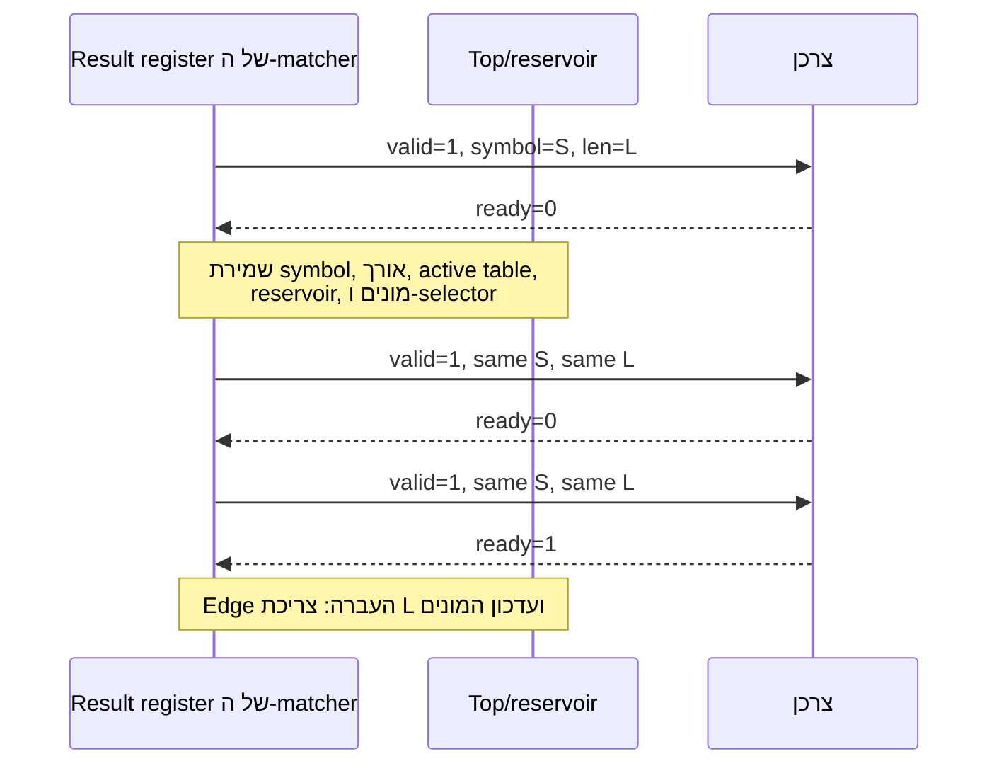
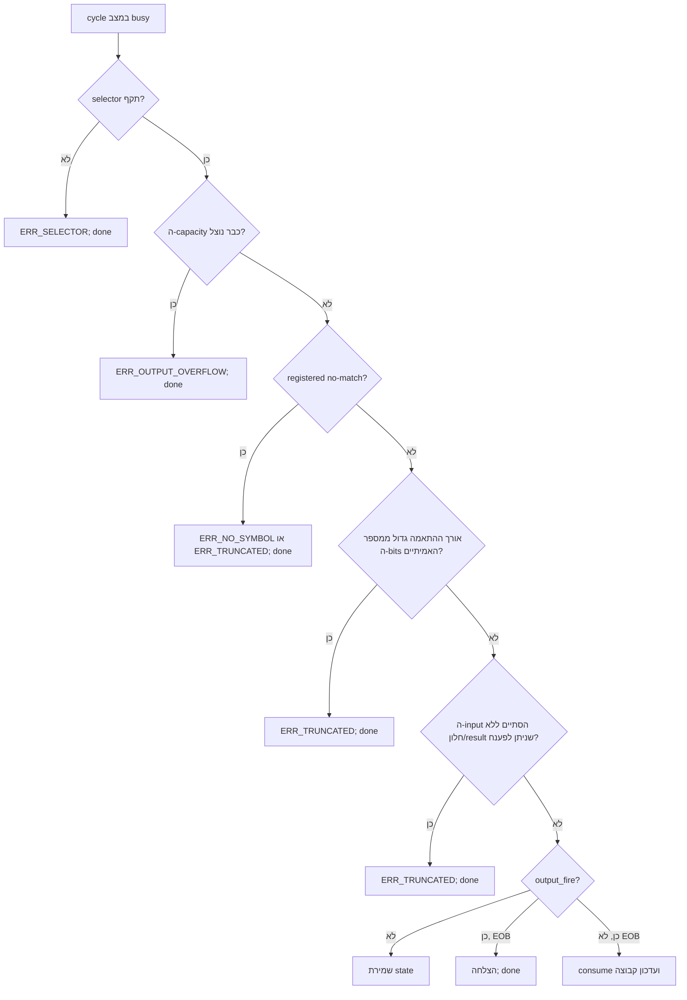

# 3. ארכיטקטורת ה-hardware ואופן הפעולה

[חזרה לאינדקס הדוח](README.md)

## 3.1 הרעיון הארכיטקטוני

ה-accelerator הופך לולאת software הכוללת פעולות bit באורך משתנה וחיפוש בטבלה
ל-pipeline קטן לעיבוד stream. התכנון מפריד בין שלושה תחומי אחריות:

1. **הכנת bits:** שמירת ה-bits הדחוסים הבאים במיקום קבוע.
2. **חיפוש symbol:** השוואת החלון הקבוע מול טבלת Huffman שנבחרה כעת, וביצוע
   register ל-symbol ולאורך שנבחרו.
3. **Commit/control:** הוצאת ה-symbol רק כאשר המקבל מאשר אותו, ולאחר מכן
   צריכה של מספר ה-bits המדויק ועדכון סדר הטבלאות.

תצוגה קומפקטית:



חץ ה-feedback חשוב מבחינה ארכיטקטונית. לא ניתן לדעת מה יהיה חלון החיפוש הבא
עד שה-symbol הנוכחי, שאורך הקוד שלו משתנה, התקבל והוסר.

## 3.2 ה-datapath המלא



ה-data זורם משמאל לימין. החצים המקווקווים הם feedback של commit: הם מעדכנים
state רק כאשר מתרחש output handshake.

## 3.3 ה-datapath של ה-reservoir בפירוט

### Invariant

ה-reservoir שומר את כל ה-bits האמיתיים שעדיין לא נקראו מיושרים לשמאל:

```text
buffer_q = [valid unread bits][don't-care/zero space]
            ^ bit 31 is always next
bit_count_q = number of valid unread bits, 0..32
```

לכן ה-matcher לעולם אינו צריך slice של bits עם index משתנה:

```text
peek_bits[15:0] = buffer_q[31:16]
```

זהו שינוי hardware קלאסי. ב-software נוח לבצע shift/mask על integers שרירותיים;
ה-hardware נעשה פשוט יותר אם משלמים על המיקום המשתנה פעם אחת בזמן append/consume,
וכל חיפוש רואה slice קבוע של wires.

### ה-byte הראשון

נסמן את ה-byte הראשון שהתקבל בתור `D[7:0]`, ואת `s=start_bit`, כאשר `0<=s<=7`.
מספר ה-bits שנשמרים הוא:

```text
n_first [bits] = 8 bits - s bits
```

ה-RTL ממקם את הסיומת שנשמרה בחלק העליון של ה-reservoir:

```text
buffer_next = zero_extend(D) << (BUFFER_WIDTH - 8 + s)
bit_count_next = 8 - s
```

דוגמה:

```text
D = 8'b1011_0110
s = 3

discarded bits = 101
retained bits  = 10110
reservoir      = 10110xxx_xxxxxxxx_xxxxxxxx_xxxxxxxx
bit_count      = 5
```

כאן `x` מציין bit שנמצא מחוץ ל-`bit_count`, ולכן לוגית אסור לצרוך אותו.

### הוספת byte מאוחר יותר

אם נותרו `n` bits אמיתיים, ה-byte הבא ממוקם מיד מתחתיהם:

```text
buffer_next = buffer_current
            OR (zero_extend(D) << (BUFFER_WIDTH - 8 - n))
bit_count_next = n + 8
```

אפשר לקבל את ה-byte כאשר, לאחר consume כלשהו שמתרחש במקביל, לא נותרו יותר מ-24
bits:

```text
byte_ready = active AND NOT input_last_seen
           AND (count_after_consume <= 32 - 8)
```

### צריכת קוד

עבור אורך תוצאה שהתקבל `L`:

```text
consume_ready = active AND (L != 0) AND (L <= bit_count_q)
consume_fire  = consume_valid AND consume_ready

buffer_after_consume = buffer_q << L
count_after_consume  = bit_count_q - L
```

התכנון מחשב קודם את ה-consume ואחר כך את ה-append, ולכן שתי ההעברות יכולות
להתרחש באותו edge:



### סוף ה-input

לפני `byte_last`, ה־signal `peek_valid` דורש לפחות 16 bits אמיתיים. לאחר שה-byte
האחרון התקבל, הוא מאפשר גם חלון חלקי שאינו ריק:

```text
peek_valid = active AND
             (bit_count >= 16 OR (last_seen AND bit_count != 0))
```

ה-bits הנמוכים שאינם בשימוש בתוך ה-peek בגודל 16-bit הם למעשה zero padding.
תוצאה מתקבלת רק אם:

```text
match_len <= reservoir_valid_bits
```

כך מונעים מקוד שתוכנת מראש להתאים ל-bits שלא היו באמת ב-source.

## 3.4 ה-datapath של CAM עם bank יחיד

### תכנות entry



בדיקות bounds ואורך מתרחשות לפני indexing או עדכון של entry. ערך `len=0`
מנקה את ה-valid bit שלו; הערכים `1..16` כותבים קוד תקף; ואורך גדול מ-16 נדחה
על ידי בודק ה-configuration של ששת ה-banks ואינו תקף ב-bank הבודד.

### התאמה מקבילית

לכל ה-entries `i=0..146` בטבלה שנבחרה:

```text
masked_window[i] = lookup_bits AND mask_mem[i]
raw_match[i] = valid_mem[i] AND
               (masked_window[i] == pattern_mem[i])
```

מבנה מקבילי קונספטואלי:



בכל bank קיימות 147 אפשרויות השוואה פיזיות, ובתכנון קיימים שישה banks. מנגנון
operand isolation משאיר את ה-inputs של חמישה banks לא פעילים, אך כל ששת ה-banks
עדיין צורכים משאבי silicon.

### בחירה מהאורך הקצר לארוך

כלל הבחירה ההתנהגותי הוא:

```text
candidate_found = 0
for length L = 1..16:
    for entry i = 0..146:
        if not candidate_found and raw_match[i] and len[i] == L:
            select entry i
```

כלל זה מגדיר במדויק את ה-priority: אורך קטן יותר מנצח, ולאחר מכן index קטן יותר
של entry. ה-source מתאר `16*147=2,352` תנאי length/entry לכל bank. ה-synthesis
עשוי לפשט טבלה תקפה מסוג prefix-free, אך רשת ה-priority/mux המקוננת כפי שהיא
מתוארת היא סיכון משמעותי ל-area ול-timing של 5 ns.

בטבלת prefix-free חוקית, כמה אורכים אינם יכולים להתאים לאותו רצף bits התחלתי.
מימוש עתידי המכוון ל-timing יוכל לבצע validation של הטבלאות ב-software ולהחליף
את ה-priority השטוח ב-balanced one-hot reduction או tournament tree, תוך שמירה
על התוצאה הנראית כלפי חוץ.

## 3.5 בחירה בין שישה banks

שישה banks מונעים צורך לתכנת מחדש בכל מעבר בין קבוצות bzip2. ה-ID של הטבלה
הפעילה מפוענח ל־lookup-valid signals בתצורת one-hot:

```text
bank_valid[k] = lookup_valid AND (active_table_q == k), k=0..5
```

שדות ה-ready/result של ה-bank שנבחר עוברים mux בחזרה. banks שאינם פעילים רואים
`lookup_valid=0` ו-`lookup_bits=0`. זהו operand isolation ולא clock gating;
ה־registered state של ה-banks עדיין מחובר ל-`clk`.



## 3.6 בקר ה-selector

רשימת ה-selectors שעברה parsing מספקת ID של טבלה בגודל 3-bit עבור כל קבוצה של
עד 50 symbols של Huffman. ה-state הוא:

```text
selector_mem[0..2965] : 3 bits each
selector_index_q       : current group
symbols_in_group_q     : accepted positions 0..49
active_table_q         : registered selector_mem[selector_index_q]
```

משוואת העדכון כאשר מתקבלת תוצאה שאינה EOB:

```text
if symbols_in_group_q == 49:
    selector_index_next   = selector_index_q + 1
    active_table_next     = selector_mem[selector_index_next]
    symbols_in_group_next = 0
else:
    symbols_in_group_next = symbols_in_group_q + 1
```

EOB שהתקבל מסיים קודם את הפעולה ואינו מנסה להביא selector נוסף.

### מדוע ה־selector נשמר ב־register

קריאה אסינכרונית מ-selector שמזינה ישירות את `active_table` הייתה יוצרת:

```text
selector_index register
-> selector memory/mux
-> bank decode
-> CAM compare
-> priority selection
-> result register
```

ה-`active_table_q` מפצל זאת לנתיב רגיל ומהיר ולנתיב boundary שמופעל לעיתים רחוקות:



נתיב ה-boundary עדיין דורש static timing analysis. אם הוא אינו עומד ב-5 ns,
אפשר לבצע prefetch ל-selector הבא זמן רב לפני symbol מספר 50, או לקרוא אותו דרך
שלב synchronous RAM.

## 3.7 בקרת request, result ו-commit

ה-top מאפשר lookup חדש רק כאשר:

```text
busy
AND selector is valid
AND reservoir exposes a window
AND no matcher result is pending
AND symbols_produced < symbol_capacity
```

תחת invariant זה ה-matcher הנבחר בהכרח ready, משום שה-storage היחיד שלו הוא
ה-result register, ואין result שממתין.

output תקף דורש בנוסף:

```text
matcher_result_valid
AND matcher_found
AND matcher_len <= real reservoir bits
AND capacity remains
```

ה-commit אטומי:

```text
output_fire = symbol_valid AND symbol_ready
```

באותו edge יחיד המערכת:

- מסירה `matcher_len` bits;
- מגדילה את `bits_consumed` ב-`matcher_len`;
- מגדילה את `symbols_produced` באחד;
- מסירה את תוצאת ה-matcher מה-output register שלו;
- מקדמת את מונה הקבוצה/selector עבור תוצאה שאינה EOB; או
- מסתיימת בהצלחה במקרה של EOB.

ה-commit האטומי הוא שהופך את ה-backpressure לבטוח.

## 3.8 דוגמה לפי cycles

נניח שכבר קיימים 16 bits ב-reservoir, שהמקבל תמיד ready ושאורך הקוד של ה-symbol
הנוכחי הוא 3.



ב-steady state, edges של קבלת request מתרחשים בקירוב ב-0, 2, 4, 6 וכן הלאה,
ולכן לתכנון ה-feedback המלא יש `II=2`.

טבלת timing קומפקטית:

| Clock edge | תוצאת ה-matcher לפני ה-edge | פעולה עיקרית | מצב ה-reservoir הנראה אחרי ה-edge |
|---:|---|---|---|
| 0 | ריק | קבלת lookup A ולכידת התוצאה שלו | A תקף; ה-reservoir לא השתנה |
| 1 | A תקף | קבלת A, צריכת האורך שלו, ו-refill אופציונלי | ה-result ריק; החלון הבא |
| 2 | ריק | קבלת lookup B ולכידת התוצאה שלו | B תקף; ה-reservoir לא השתנה |
| 3 | B תקף | קבלת B וצריכת האורך שלו | ה-result ריק; החלון הבא |
| 4 | ריק | קבלת lookup C ולכידת התוצאה שלו | C תקף |

ההשוואה ה-combinational מתרחשת לפני ה-edge של העברת ה-request, וה-result register
משתנה מיד אחריו. המרווח הנראה ב-steady state בין edges של request/capture הוא
שני cycles לכל symbol שהתקבל.

## 3.9 דוגמת backpressure



בזמן ה-stall לא נספר symbol כפול, משום ש-`symbols_produced` משתנה רק בעת
`valid AND ready`.

## 3.10 עדיפות בקרת סיום

כאשר ה-top במצב busy, הוא בודק תנאי סיום לפני commit רגיל. סדר העדיפויות הלוגי
הוא:



תוצאות התאמה שגויות מסומנות פנימית כ-ready, כדי ש-result סופי לא יישאר תקוע
ב-bank לאחר שה-job מדווח על error.

## 3.11 מודל performance הנגזר מהארכיטקטורה

מילוי ה-reservoir הראשוני במקרה הגרוע הוא:

```text
C_fill [cycles] = ceil((KEY_WIDTH + start_bit) / 8 bits-per-byte-cycle)
```

זהו מודל workload רגיל ללא stalls, שממתין לחלון lookup מלא. אם `byte_last` מגיע
מוקדם, ה-RTL עשוי לחשוף חלון חלקי קטן יותר שאינו ריק, ולכן מספר cycles המילוי
יכול להיות נמוך יותר.

עבור `KEY_WIDTH=16`:

```text
start_bit = 0      -> ceil(16/8) = 2 cycles
start_bit = 1..7   -> ceil(17..23/8) = 3 cycles
```

עם `N` symbols, initiation interval של `II=2`, וללא stalls:

```text
C_core [cycles] = C_fill + N*II
T_core [s]      = C_core / f_clk
```

עבור `N=148,271`, מילוי במקרה הגרוע ו-frequency יעד של 200 MHz:

```text
C_core = 3 + 148,271*2 = 296,545 cycles
T_core = 296,545 / 200,000,000 = 0.001482725 s
       = 1.482725 ms
```

מודל זה ברור בכוונה, אך אידיאלי. job אמיתי מוסיף stalls של source/output,
configuration/setup, latency של סיום, וכל cycles שנוספים על ידי platform wrapper.

## 3.12 חלופות המכוונות ל-timing

לוגיקת ה-priority המקוננת היא הסיכון העיקרי ליעד של 5 ns. האפשרויות הן:

| שינוי | תועלת צפויה | עלות/השפעה סמנטית |
|---|---|---|
| Balanced match-reduction/tournament tree | עומק לוגי קצר יותר; יכול לשמור שלב match יחיד | RTL ו-routing מפורשים יותר; חייב לשמר priority לפי אורך/index |
| Validation של טבלאות prefix-free ו-balanced one-hot OR | בחירה קטנה/מהירה יותר | נשען על validation ב-software/loader; רצוי לזהות כמה matches |
| הוספת register ל-`raw_matches` לפני ה-priority | חיתוך timing נקי | מוסיף שלב feedback; ללא speculation, ה-II של ה-top המלא צפוי להשתנות מ-2 לכ-3 |
| Prefetch של ה-selector הבא | מסיר את נתיב ה-async-memory בגבול קבוצה | מוסיף מעט control state |
| החלפת CAM ב-canonical range decoder | הרבה פחות לוגיקת השוואה/storage | ארכיטקטורה שונה מהתכנון הפשוט המבוסס בכוונה על הקוד של החבר |
| חיפוש sequential ב-bank יחיד | area קטן מאוד | cycles רבים לכל symbol; פוגע במטרת ה-performance |

אם שלב pipeline נוסף של ה-matcher משנה את לולאת ה-feedback המלאה ל-`II=3`, אותו
frequency יעד נותן:

```text
C_core,pipelined = 3 + 148,271*3 = 444,816 cycles
T_core,pipelined = 444,816 / 200,000,000
                 = 2.22408 ms
```

לכן "עוד שלבי pipeline" אינם ניתנים בחינם באופן אוטומטי. lookups עצמאיים אולי
ישמרו throughput ב-pipeline רגיל, אך ה-input הבא של decoder זה תלוי באורך התוצאה
הקודמת.
