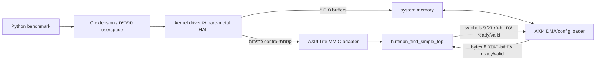
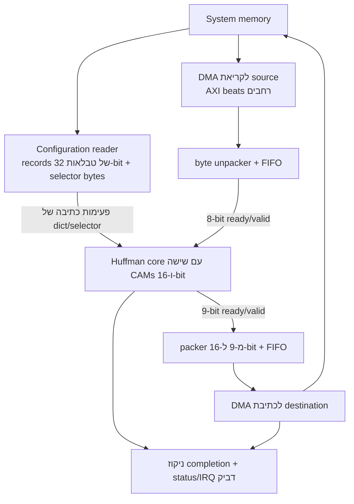
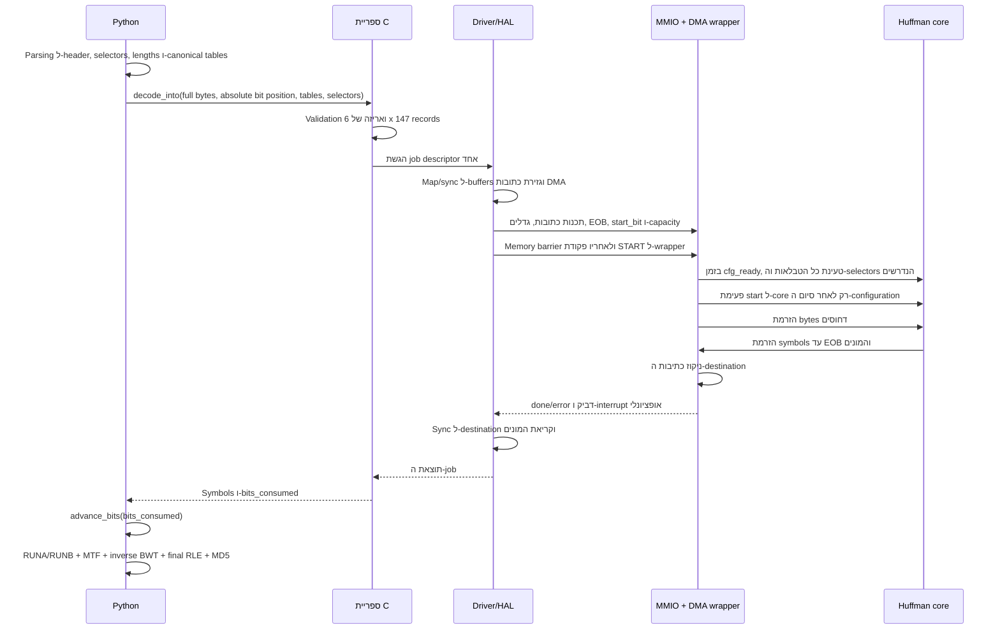

# 4. ה־interface בין hardware ל־software

[חזרה לאינדקס הדוח](README.md)

## 4.1 מה ממומש לעומת מה שמוצע

ה-core ב-SystemVerilog תוכנן בכוונה ללא תלות ב-bus. אפשר להניע ישירות מ-testbench
את פעימות ה-configuration ואת stream-י ה-ready/valid שלו. בשלב זה הוא **אינו**
מממש AXI, DMA, PCIe, interrupts, Linux driver או Python extension.

לצורך integration בתוך FPGA SoC טיפוסי, המערכת המעשית המינימלית שסביבו היא:



לצורך ההדגמה בקורס נדרשים רק ה-core וה-testbench. שכבות ה-MMIO/DMA/driver
מוגדרות כדי שלתכנון יהיה גבול עקבי מול מערכת אמיתית, אך אין חובה לממש אותן
אלא אם ה-scope של הפרויקט יתרחב.

## 4.2 מדוע ל-MMIO ול-DMA יש תפקידים שונים

### MMIO

Memory-mapped I/O נותן ל-registers של ה-accelerator כתובות שה-CPU יכול לראות.
פעולת store של ה-CPU לכתובת control משנה את ה-state של ההתקן; פעולת load קוראת
status. protocol קל כמו AXI4-Lite מתאים משום שמדובר במספר קטן של פעולות קצרות.

יש להשתמש ב-MMIO עבור:

- כתובות של buffers ל-source, destination ו-configuration;
- גדלי buffers, מספר selectors, ה-start bit, ה-EOB וה-capacity;
- פקודת `START` אחת;
- status, error, אישור interrupt ומונים.

**אין** להשתמש בטרנזקציית MMIO אחת לכל Huffman symbol. ב-benchmark יש 148,271
lookups; זמני round trip בין CPU להתקן לכל symbol יחזירו את רוב ה-overhead אל
תוך ה-hot loop.

### DMA

Direct memory access מעביר data בכמות גדולה בין system memory ל-accelerator,
ללא פקודת CPU עבור כל פריט. ה-DMA/config wrapper המוצע חייב:

- לקרוא ולפרוק את תמונת הטבלאות ואת ה-selector bytes לפעימות configuration;
- לקרוא את ה-source הדחוס ולהמיר bus beats ל-stream של 8-bit
  `byte_valid/byte_ready`;
- להרים את `byte_last` ב-byte האחרון של אזור ה-source הממופה;
- לטפל נכון ב-backpressure של stream ה-symbols;
- לארוז כל symbol בגודל 9-bit בתוך destination element בגודל 16-bit ובסדר
  little-endian;
- להפסיק לקבל source כשה-core מסיים או מדווח error;
- להמתין לסיום כל כתיבות ה-destination ותגובות ה-write; וכן
- רק לאחר מכן לפרסם את ה-state הדביק job-done של ה-wrapper או interrupt.

הנקודה האחרונה חשובה: קבלת EOB ב-core אומרת שה-symbol נכנס ל-output writer,
אך לא בהכרח שטרנזקציית ה-memory המתאימה כבר נראית גלובלית.

## 4.3 חלוקת העבודה בין software ל-hardware

### פעולות שנשארות ב-software

ה-software ממשיך לבצע:

- טיפול ב-file/container ו-parsing של ה-block header של bzip2;
- parsing של מפת ה-bytes שבשימוש;
- decoding של selectors בשיטות unary/MTF;
- parsing של אורכי Huffman ובניית canonical codes;
- validation ואריזה של טבלאות ה-accelerator;
- הרחבת RUNA/RUNB;
- data move-to-front transform;
- inverse Burrows-Wheeler transform;
- הרחבת run-length סופית; וכן
- בדיקת האורך הסופי וה-MD5.

### פעולות שמועברות ל-hardware

job אחד ומרוכז של hardware מבצע:

- המרה מ-bytes ל-bits בסדר MSB-first;
- יצירת snoop/peek בגודל 16-bit;
- match מול טבלת Huffman שנבחרה;
- צריכת bits לפי האורך שהוחזר;
- החלפת טבלה לאחר כל 50 Huffman symbols גולמיים;
- זיהוי EOB; וכן
- ספירת symbols/bits/cycles.

גבול זה רחב יותר מה-comparator בלבד. ה-bit reservoir חיוני, משום שבלעדיו Python
עדיין יצטרך לבצע peek ו-drop של bits עבור כל תוצאת hardware, וכך ייעלם חלק גדול
מהתועלת של ה-inclusive acceleration.

## 4.4 מיקומי ה-source הקיים ונקודת השינוי הנדרשת

המימוש המקורי הוא מקור ה-reference לנכונות:

- הקובץ [`suites/original/bm_pyflate/run_benchmark.py`](../../../suites/original/bm_pyflate/run_benchmark.py)
  בונה את שדות הטבלה הקנוניים בערך בשורות 177–200.
- המימוש שלו ל-`HuffmanTable.find_next_symbol` נמצא בערך בשורות 224–235.
- ה-parsing של selectors נמצא בערך בשורות 355–369, וטבלאות Huffman עוברות
  parsing בערך בשורות 372–391.
- החלפת הטבלה בכל 50 symbols והקריאה ל-`find_next_symbol` נמצאות בערך בשורות
  411–425.
- עיבוד RUNA/RUNB, EOB ו-data-MTF נמצא בערך בשורות 426–443.

המימוש ה-optimized הוא המקום הבטוח יותר להוסיף backend של hardware שניתן לבחור,
תוך שמירת המקור ללא שינוי כ-golden reference:

- הקובץ [`suites/optimized/bm_pyflate/run_benchmark.py`](../../../suites/optimized/bm_pyflate/run_benchmark.py)
  משתמש ב-dictionaries לפי `(length, code)` ועובר בלולאה על האורכים הייחודיים
  בערך בשורות 171–187 ו-202–211.
- לולאת ה-selector/lookup/post-processing המקבילה נמצאת בערך בשורות 361–385.

ה-lookup ה-optimized הוא השוואה אלגוריתמית שימושית, אך הוא עדיין Python software
ועדיין מבצע קריאת function סדרתית אחת לכל symbol. הוא אינו מספק hardware streams,
MMIO, DMA או driver.

## 4.5 פורמט data עבור configuration

### Entries של הטבלה

ה-CAM הפשוט הפעיל **אינו** משתמש בפורמט `range[]/perm[]` שבקובץ הקיים
`sw/huffman_find_uapi.h`; אותו header שייך ל-accelerator הקנוני האחר, שמשתמש
ב-range וב-20-bit.

יש להשתמש ב-record מפורש אחד בגודל 32-bit ובסדר little-endian עבור כל
`[table][entry]`:

```text
31       30 29             25 24                 16 15                 0
+----------+-----------------+----------------------+--------------------+
| reserved | length[4:0]     | decoded_symbol[8:0]  | canonical_code     |
+----------+-----------------+----------------------+--------------------+
```

מבנה C שקול, אשר נמנע מ-C bitfields תלויי-implementation:

```c
#define HFS_TABLES        6u
#define HFS_ENTRIES       147u
#define HFS_MAX_BITS      16u
#define HFS_MAX_SELECTORS 2966u

struct hfs_cam_entry {
    uint16_t code_le; /* canonical x.symbol, right aligned */
    uint16_t meta_le; /* [8:0]=x.code, [13:9]=x.bits, [15:14]=0 */
};
```

סדר ה-array הוא:

```text
entry[table_id][decoded_symbol_address]
```

עבור כל Huffman entry של Python בשם `x`:

```text
dict_wr_addr   = x.code
dict_wr_code   = x.symbol
dict_wr_symbol = x.code
dict_wr_len    = x.bits
```

קל להתבלבל בין השמות: ב-pyflate, השדה `x.symbol` הוא integer של ה-canonical
bit-code שנוצר, ואילו `x.code` הוא ה-index של אלפבית Huffman המפוענח שמוחזר
ללולאת ה-block.

Pseudocode לאריזה:

```python
records = [[0 for _ in range(147)] for _ in range(6)]

for table_id, table in enumerate(tables):
    for x in table.table:
        assert 0 <= x.code < 147
        assert 1 <= x.bits <= 16
        assert 0 <= x.symbol < (1 << x.bits)
        meta = x.code | (x.bits << 9)
        records[table_id][x.code] = x.symbol | (meta << 16)
```

יש לאתחל ולהגיש את כל `6x147` ה-records. אורך אפס הופך entry חסר ל-invalid.
כך נמנעים entries תקפים ישנים אם job מאוחר יותר משתמש בטבלה קצרה או שונה.
banks של טבלאות שאינן בשימוש מכילים records מאופסים ו-invalid.

גודל:

```text
6 tables * 147 records/table * 4 bytes/record = 3,528 bytes
```

### Selectors

יש להשתמש ב-byte אחד לכל selector טבלה שכבר עבר decoding:

```text
selector byte[2:0] = table ID
selector byte[7:3] = 0
```

ה-selectors חייבים להיות ה-ID האמיתיים של הטבלאות לאחר שה-software ביצע את ה-unary/MTF
selector decoding — ולא ה-selector bits המקודדים מהקובץ הדחוס. יש לבצע validation
לכל ID מול מספר הקבוצות שעבר parsing ומול מקסימום ה-hardware, שהוא שש.

הגודל שנמדד ב-workload:

```text
2,966 selectors * 1 byte = 2,966 bytes
```

### Symbols ב-destination

יש להשתמש ב-`uint16_t` בסדר little-endian עבור כל result:

```text
destination[8:0]  = decoded symbol
destination[15:9] = 0
```

EOB נכלל. עבור 148,271 ה-outputs שנצפו:

```text
148,271 symbols * 2 bytes/symbol = 296,542 bytes
```

זהו stream של Huffman symbols גולמיים, ולא ה-output המפוענח הסופי בגודל 399,360
bytes לאחר RUNA/RUNB, MTF, inverse BWT ו-final RLE.

עבור input נתמך כללי, ה-software חייב להקצות capacity לפני שהוא יודע את מספר
ה-symbols המדויק. מכיוון שכל Huffman code תקף צורך לפחות bit אחד, מספר ה-bits
שנותרו ב-source הוא חסם שמרני ל-symbol capacity. הספרייה חייבת לבדוק ש-
`capacity * 2 bytes` אינו גורם overflow ל-host size type ואינו גדול מה-destination
שמופה בפועל. אפשר להשתמש במספר הידוע 148,271 עבור fixture קבוע זה של ה-benchmark,
אך decoder לשימוש חוזר אינו יכול להניח אותו.

## 4.6 בעלות על מיקום bit מוחלט

ייתכן שקורא ה-bits של ה-software כבר הביא bytes מעבר למיקום הקריאה הלוגי. לכן
`tell()` גולמי של אובייקט הקובץ אינו כתובת התחלה בטוחה ל-accelerator בפני עצמו.

יש להשתמש במיקום bit לוגי מוחלט יחיד:

```text
absolute_bit_position [bits from file start]
byte_offset [bytes] = floor(absolute_bit_position / 8)
start_bit [bits]    = absolute_bit_position mod 8
```

פעולות bit שקולות:

```python
byte_offset = absolute_bit_position >> 3
start_bit = absolute_bit_position & 7
```

ה-pointer ל-source שמועבר ל-DMA הופך ל-`base + byte_offset`, ואילו `start_bit`
מורה ל-reservoir כמה bits התחלתיים של ה-byte הראשון יש לזרוק.

עם סיום העבודה, מחשבים מיקום לוגי חדש יחיד:

```python
old_absolute = b.tellbits()
new_absolute = old_absolute + result.bits_consumed
b.seekbits(new_absolute)
```

`bits_consumed` מתחיל ב-bit הראשון שאחרי `start_bit`, ולכן אין להוסיף שוב את
ה-bits ההתחלתיים שנדחו.

מותר ל-DMA לבצע prefetch של bus beats מעבר ל-EOB לשם יעילות. bytes אלה אינם
נצרכים לוגית. רק `bits_consumed` מקדם את קורא ה-software.

אין להשתמש ב-`RBitfield` המקורי ללא שינוי עבור integration זה: ה-copy constructor
שלו מציב `count=x.bitfield` בערך בשורה 36, וה-`dropbits` המרוכז שלו קורא
`self.f._read` בערך בשורה 67. הקורא ה-optimized מתקן אותם ל-`count=x.count`
ול-`f.read`, אך אותה קריאת bulk ישירה ל-`f.read` אינה מגדילה את `count` של הקורא,
ולכן `tellbits()` מאוחר יותר עדיין עלול להיות מיושן. יש להוסיף למימוש ה-optimized
API מפורש ובדוק של `seekbits()`/`advance_bits()`, במקום להסתמך על file state
שאינו חד-משמעי.

עבור הקובץ seekable של ה-benchmark, מימוש ברור הוא:

```python
def seekbits(self, absolute_position):
    if absolute_position < 0:
        raise ValueError("negative bit position")

    byte_position, bit_in_byte = divmod(absolute_position, 8)
    self.f.seek(byte_position)
    self.count = byte_position
    self.bits = 0
    self.bitfield = 0

    if bit_in_byte:
        self.needbits(8)          # fetches one byte and updates self.count
        self.readbits(bit_in_byte)  # discards its already-consumed prefix

def advance_bits(self, amount):
    if amount < 0:
        raise ValueError("negative advance")
    self.seekbits(self.tellbits() + amount)
```

פעולה זו מאפסת גם את ה-file pointer הבסיסי וגם את מצב ה-prefetch של ה-software
למיקום הלוגי היחיד והקובע. היא מבצעת seek אחד ו-refill של לכל היותר byte אחד;
היא אינה מבצעת לולאה אחת לכל symbol שפוענח. עבור source שאינו seekable, החלופה
היא `dropbits` מרוכז ומתוקן שצורך תחילה את ה-bits שכבר נמצאים ב-buffer ומעדכן
את `count` עבור כל byte שלם שעליו דילג.

## 4.7 API מינימלי של Python

יש להשתמש בקריאה אחת לכל Huffman block של bzip2:

```python
result = accelerator.decode_into(
    compressed=memoryview(full_file_bytes),
    absolute_bit_position=b.tellbits(),
    tables=tables,
    selectors=selectors_list,
    eob_symbol=symbols_in_use - 1,
    output=symbol_buffer,
)

if result.hardware_error:
    raise HuffmanAcceleratorError(result.hardware_error)

b.advance_bits(result.bits_consumed)
raw_symbols = symbol_buffer[:result.symbols_produced]
```

שדות result מומלצים:

```text
symbols_produced      uint32, includes EOB
bits_consumed         uint32
cycle_count           uint64
input_stall_cycles    uint32
output_stall_cycles   uint32
hardware_error        uint32 or enum
```

הספרייה שפונה ל-Python צריכה להציע מצבי backend מפורשים בשם `software`,
`hardware` ו-`auto`. מדידות hardware שמתפרסמות חייבות להשתמש ב-`hardware`
וחייבות להיכשל באופן גלוי אם ה-accelerator אינו זמין; fallback שקט יהפוך את
תוצאת ה-timing המדווחת לחסרת משמעות.

## 4.8 ABI מינימלי של C/job

C extension או ספריית userspace שתלויים ב-platform יכולים להגיש מבנה job דומה
למבנה הבא:

```c
struct hfs_job {
    uint64_t src_user_ptr;
    uint64_t tables_user_ptr;
    uint64_t selectors_user_ptr;
    uint64_t dst_user_ptr;

    uint32_t src_length_bytes;
    uint32_t dst_symbol_capacity;
    uint32_t selector_count;
    uint16_t eob_symbol;
    uint8_t  start_bit;
    uint8_t  table_count;
    uint32_t timeout_ms;

    /* Returned by driver/device. */
    uint32_t bits_consumed;
    uint32_t symbols_produced;
    uint32_t hardware_error;
    uint64_t cycle_count;
    uint32_t input_stall_cycles;
    uint32_t output_stall_cycles;
};
```

זהו ABI לוגי מוצע, ולא header שעבר compilation בפרויקט הנוכחי. עבור UAPI אמיתי
יש להשתמש בטיפוסים קבועים של Linux (`__u32`, `__u64`, ו-`__le16` במקום שבו הוא
נשמר), להגדיר alignment/padding במפורש, להוסיף שדה version/size ולספק טיפול
בתאימות 32/64-bit.

ה-C shim צריך:

1. לבצע validation לאובייקטי Python ולגדלים;
2. לגזור את `byte_offset` ואת `start_bit` ממיקום ה-bit המוחלט;
3. לארוז, או להשתמש מחדש, ב-buffers שמורים ב-cache של הטבלאות וה-selectors;
4. להגיש job אחד בדיוק;
5. לשחרר את Python GIL בזמן ההמתנה;
6. למפות קודי error של ה-hardware ל-Python exceptions; וכן
7. להחזיר מונים ו-view של ה-symbols שנוצרו, ללא copies שאינם נחוצים כאשר ניתן.

## 4.9 מפת MMIO registers מינימלית מוצעת

להלן מפה לוגית עקבית אחת עבור AXI4-Lite adapter. היא אינה ממומשת על ידי
`huffman_find_simple_top`, ואין לבלבל בינה לבין ה-package/header הישן יותר.

| Offset | Register | Access | שדות נדרשים |
|---:|---|---|---|
| `0x000` | `ID` | RO | זהות accelerator קבועה |
| `0x004` | `VERSION` | RO | גרסת interface של ABI/RTL |
| `0x008` | `CONTROL` | WO | bit 0 `START`; bit 1 עבור abort/reset אופציונלי |
| `0x00C` | `STATUS` | RO/W1C | bit 0 busy; bit 1 done-sticky; bit 2 error-sticky; bit 3 IRQ pending |
| `0x010` | `ERROR_CODE` | RO | error סופי של core/wrapper/DMA |
| `0x020` | `SRC_ADDR_LO` | RW | bits ‏31:0 של כתובת source DMA |
| `0x024` | `SRC_ADDR_HI` | RW | bits ‏63:32 של כתובת source DMA |
| `0x028` | `SRC_LENGTH` | RW | מספר bytes ממופים וזמינים מ-byte ההתחלה המתוקן |
| `0x02C` | `START_BIT` | RW | bits ‏2:0, חוקי בטווח 0–7 |
| `0x030` | `TABLE_ADDR_LO` | RW | החלק הנמוך של כתובת תמונת CAM בגודל 3,528-byte |
| `0x034` | `TABLE_ADDR_HI` | RW | החלק הגבוה של כתובת תמונת CAM |
| `0x038` | `CONFIG_FLAGS` | RW | לדוגמה בחירת reload/cached-table; אפס במימוש הפשוט |
| `0x040` | `SELECTOR_ADDR_LO` | RW | החלק הנמוך של כתובת תמונת selector |
| `0x044` | `SELECTOR_ADDR_HI` | RW | החלק הגבוה של כתובת תמונת selector |
| `0x048` | `SELECTOR_COUNT` | RW | 1–2966 |
| `0x04C` | `TABLE_COUNT` | RW | קבוצות bzip2 שעברו parsing, בטווח 2–6; test wrapper כללי עשוי לאפשר גם 1 |
| `0x050` | `DST_ADDR_LO` | RW | החלק הנמוך של כתובת destination DMA |
| `0x054` | `DST_ADDR_HI` | RW | החלק הגבוה של כתובת destination DMA |
| `0x058` | `DST_CAPACITY` | RW | מספר slots של symbols בגודל 16-bit, כולל EOB |
| `0x05C` | `EOB_SYMBOL` | RW | bits ‏8:0 |
| `0x060` | `BITS_CONSUMED` | RO | ההתקדמות הלוגית ב-bits לאחר ה-offset ההתחלתי |
| `0x064` | `SYMBOLS_PRODUCED` | RO | outputs כולל EOB |
| `0x068` | `CYCLE_COUNT_LO` | RO | bits ‏31:0 של מונה ה-cycles |
| `0x06C` | `CYCLE_COUNT_HI` | RO | bits ‏63:32 של מונה ה-cycles |
| `0x070` | `INPUT_STALLS` | RO | diagnostic של input starvation |
| `0x074` | `OUTPUT_STALLS` | RO | diagnostic של output backpressure |
| `0x078` | `IRQ_ACK` | W1C | אישור interrupt דביק של completion/error |

המשמעות של `W1C` היא "write one to clear". ה-adapter צריך לדחות `START` כשהוא
busy, לבצע snapshot אטומי של כל registers ה-job בעת start שהתקבל, ולהפוך את
ה-completion לדביק משום שה-`done` הטבעי של ה-core נמשך clock אחד בלבד.

ה-ordering של MMIO דורש write memory barrier לפני `START`, כדי שכל כתיבות הכתובת
והאורך יהיו גלויות קודם. לאחר completion, חייבים לבצע read barrier ו-DMA cache
synchronization לפני שה-software קורא את ה-destination.

## 4.10 התנהגות ה-DMA adapter



FIFOs שימושיים מנתקים בין memory bursts לבין קצב ה-bytes/symbols. קורא ה-source
אינו רשאי לדרוס או לשנות את סדר ה-bytes; כותב ה-output אינו רשאי לסמן completion
סופי לפני שהתקבלה תגובת ה-write האחרונה שלו.

ה-core חושף ports נפרדים לכתיבת dictionary ולכתיבת selector. loader מינימלי
יכול לבצע serialization לכל 3,848 הכתיבות (19.24 us ב-200 MHz); loader מסוג
dual-issue יכול לחפוף entry אחד של טבלה עם selector אחד ודורש לפחות 2,966 cycles
(14.83 us). פעולת fetch/setup חיצונית של DMA מתווספת לכך, ואפשר לשמור את תמונת
הטבלה ב-cache בין jobs זהים.

עבור bus ברוחב `W_bus` bits, frequency של `f_bus` ויעילות `eta`:

```text
B_effective [byte/s] = eta * (W_bus / 8) [byte/cycle]
                       * f_bus [cycle/s]

T_transfer [s] = bytes / B_effective
```

דוגמה אידיאלית (`eta=1`) עבור bus בגודל 128-bit וב-frequency של 200 MHz:

```text
B_peak = (128/8) bytes/cycle * 200,000,000 cycles/s
       = 3.2 GB/s

source beats = ceil(67,562 / 16) = 4,223 beats
source bus occupancy = 4,223 / 200 MHz = 21.115 us

destination beats = ceil(296,542 / 16) = 18,534 beats
destination bus occupancy = 18,534 / 200 MHz = 92.670 us

configuration beats = ceil(6,494 / 16) = 406 beats
configuration occupancy = 406 / 200 MHz = 2.030 us
```

אלה דוגמאות אידיאליות ל-bus occupancy, ולא latency מקצה לקצה של DMA. Arbitration,
burst setup, גבולות page, ‏IOMMU, cache maintenance ו-response latency מקטינים
את `eta`. תעבורת ה-source וה-destination יכולה לחפוף את מודל ה-core של 1.483 ms
אם מנועי ה-DMA עצמאיים ויש להם buffering מספיק.

ה-source port בגודל 8-bit צריך רק:

```text
67,562 bytes / 1.482725 ms = 45.57 MB/s average
```

אם כל הקובץ מסופק במהלך זמן ה-core המשוער. צד ה-output קרוב יותר לגבול של שני
bytes לכל שני cycles, כ-200 MB/s ב-200 MHz, ולכן ה-output buffering דורש יותר
תשומת לב.

## 4.11 אחריות ה-driver

accelerator אמיתי המחובר ל-Linux דורש בדרך כלל kernel driver, או נתיב גישה מבוקר
בסגנון UIO/VFIO, עבור MMIO, DMA ו-interrupts; הדבר אינו נחוץ עבור RTL simulation
ישירה. מערכות non-coherent דורשות בנוסף cache maintenance מפורש. שכבת driver/access
מינימלית חייבת:

1. לבצע validation לגרסת ABI, ל-overflow של fixed-width, ל-alignment, ל-pointers,
   לאורכים, ל-`start_bit`, למגבלות table/selector, ל-EOB ול-capacity של ה-destination;
2. לבצע validation ל-selectors מול `table_count` שעבר parsing, ולא רק מול `<6`;
3. לדחות טווחי DMA חופפים של source/destination (ובמדיניות הפשוטה ביותר, חפיפה
   בין כל ארבעת buffers ה-job), משום שכתיבות output עלולות לדרוס data דחוס או
   configuration שעדיין לא נקראו; לחלופין, לבצע staging לכל input חופף לפני
   שמאפשרים כתיבות;
4. לבצע pin/map ל-user buffers או להעתיק אותם ל-DMA buffers בטוחים;
5. להשיג כתובות DMA/IOMMU ולבצע cache synchronization כנדרש;
6. לתכנת MMIO registers, להוציא write barrier ולהתחיל את ה-job;
7. לישון עד completion interrupt או לבצע polling ל-status הדביק;
8. לאכוף timeout ולבצע reset/abort בטוח אם ה-hardware נתקע;
9. להמתין עד שכתיבות ה-output נוקזו, ואז לבצע synchronization ל-destination עבור
   גישת CPU;
10. לקרוא error/status/counters; וכן
11. לבצע unmap/unpin למשאבים בכל נתיב הצלחה או error.

ה-parsing של Huffman שייך ל-userspace ולא ל-driver. ה-driver מבצע validation
לייצוג הארוז לשם בטיחות; ספריית Python/C בונה אותו.

ב-FPGA SoC מסוג bare-metal, אותן אחריויות יכולות להימצא בספריית hardware
abstraction קטנה במקום ב-kernel driver. ב-coherent shared memory, חלק מפעולות
ה-cache נעלמות, אך כללי ה-ordering וה-completion נשארים.

## 4.12 ה-refactor הנדרש ל-benchmark

לאחר שה-software ביצע parsing ל-`selectors_list` וחישב טבלאות Huffman:

1. יש לבדוק את המגבלות הייחודיות ל-benchmark:

   ```text
   parsed table count <= 6
   alphabet entries <= 147
   every nonzero Huffman length <= 16
   selector count <= 2966
   every selector < parsed table count
   ```

2. לארוז ולהגיש תמונת טבלאות מלאה של שישה banks ואת רשימת ה-selectors.
3. לקבוע את מיקום ה-bit הלוגי המוחלט ולהגיש פעולת decode מרוכזת אחת.
4. לקדם את קורא ה-bits של ה-software פעם אחת לפי `bits_consumed` שהוחזר.
5. להעביר את ה-symbols הגולמיים שהוחזרו דרך לולאת post-Huffman הקיימת, בדיוק
   בסדר המקורי:
   - לצבור RUNA/RUNB;
   - כאשר מגיע symbol שאינו run, לבצע תחילה flush ל-run הממתין;
   - לאחר מכן לבדוק EOB;
   - אחרת לבצע data move-to-front ו-append.
6. להשאיר ללא שינוי את inverse BWT, ‏final RLE, גודל ה-output ו-validation של MD5.

ה-hardware כבר החליף טבלאות בכל 50 raw symbols. אסור ל-software לבצע מעבר selector
נוסף על הרצף שהוחזר.

אם קובץ חורג מהמגבלות הקבועות, מצב `auto` יכול לבצע fallback ל-software; מצב
`hardware` מפורש חייב לדווח error של unsupported input במקום לשנות בשקט את
ה-backend שנמדד.

## 4.13 רצף הטרנזקציה מקצה לקצה



## 4.14 גבול מדידה הוגן

ה-timer הנוכחי של Python אינו כולל פתיחת קובץ, אך כולל seek/decode; הוא גם בודק
את ה-golden output מחוץ ל-function הראשי הנמדד. benchmark הוגן של hardware יכול
ליצור device context מתמשך ולהקצות buffers לשימוש חוזר לפני המדידה, בדומה לפתיחת
הקובץ. עליו לכלול:

- parsing ואריזה שנדרשים עבור ה-block ואינם קיימים כבר ב-baseline;
- הגשת job;
- העברת table/selector נדרשת, אלא אם מודדים במפורש תרחיש cached;
- DMA של input ו-output;
- המתנה ל-completion ונראות ב-cache; וכן
- post-processing ב-software ל-symbols שהוחזרו.

אם tables/selectors נשמרים ב-cache בין iterations זהים של pyperformance, יש לדווח
על כך כאופטימיזציה והנחה נפרדות. תמיד יש לשמור את האורך הסופי הצפוי, 399,360
bytes, ואת MD5 `afa004a630fe072901b1d9628b960974` כבדיקת נכונות מקצה לקצה.

## 4.15 תוצר מינימלי לקורס לעומת מימוש אופציונלי

| שכבה | נדרש עבור מודל הדוח/הקורס | עבודה עתידית אופציונלית |
|---|---|---|
| SystemVerilog core | ממומש | תכנון priority מחדש המכוון ל-timing |
| Streams/config ישירים של testbench | מקור ה-testbench ממומש | הרצה תחת simulator מותקן; co-simulation אקראי |
| פורמט binary של table/selector/output | מוגדר במלואו כאן | הוספת `huffman_find_simple_uapi.h` וספריית אריזה |
| שינוי Python | Pseudocode וגבול שינוי מדויק | מימוש backend של simulation או device |
| מפת MMIO | specification לוגי | RTL של AXI4-Lite slave |
| DMA | נדרש קונספטואלית עבור batching שימושי | RTL של AXI master/FIFO/width-converter |
| Driver | יש להסביר את האחריויות בלבד | Linux driver, IRQ, IOMMU, timeout |
