# 6. חלופות ל-Block diagrams

[חזרה לאינדקס הדוח](README.md)

פרק זה מציע במכוון כמה גרסאות Mermaid. דוח סופי קצר יזדקק כנראה רק לתרשים A
ולתוספת של תרשים C או D. ניתן להשאיר את יתר התרשימים לצורכי לימוד, או להסירם
כדי להימנע מחזרה.

## תרשים A — שילוב מערכת קומפקטי

התרשים היחיד הטוב ביותר ברמת executive overview:

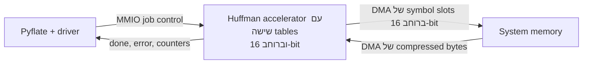

הוא מציג את חלוקת התקשורת הנכונה בלי להעמיס על הקורא: MMIO עבור control ו-DMA
עבור bulk data.

## תרשים B — שילוב מערכת/Software לא קומפקטי

תרשים ה-architecture המפורט הטוב ביותר עבור פרק ה-Hardware/Software:

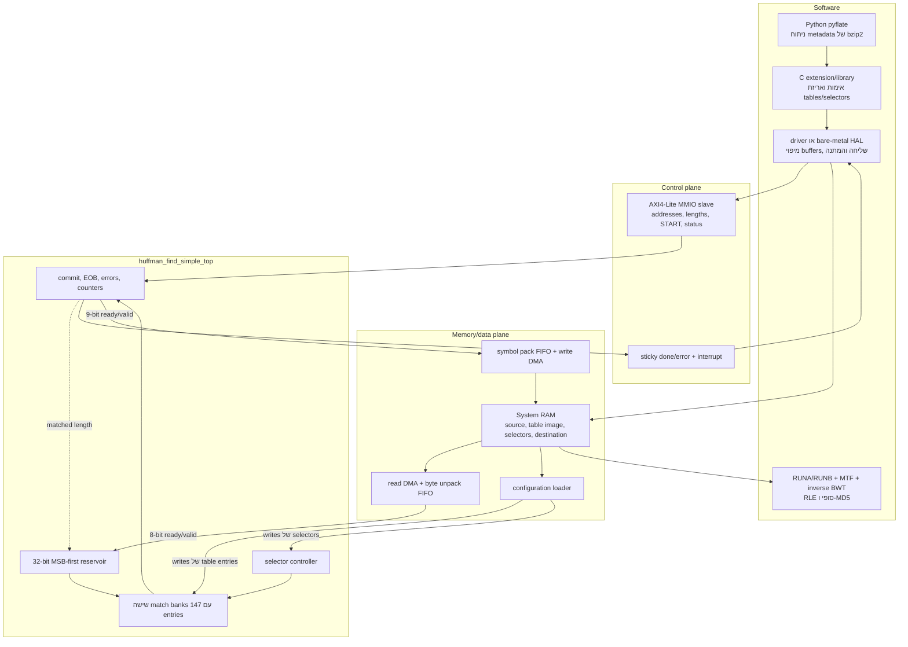

בלוקי ה-MMIO/DMA הם integration logic מוצע; ה-subgraph בשם `CORE` הוא ה-RTL
הבלתי תלוי ב-bus שכבר מומש.

## תרשים C — פנים ה-Accelerator באופן קומפקטי

תרשים Hardware-only התמציתי הטוב ביותר:

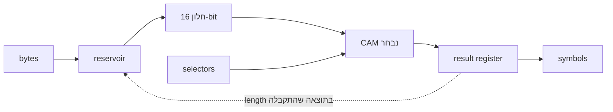

ה-feedback המקווקו מסביר מדוע ל-top המלא יש initiation interval של שני cycles,
אף שה-output של ה-matcher רשום.

## תרשים D — פנים ה-Accelerator באופן לא קומפקטי, כולל רוחבי signals

תרשים ה-Hardware description המפורט הטוב ביותר:

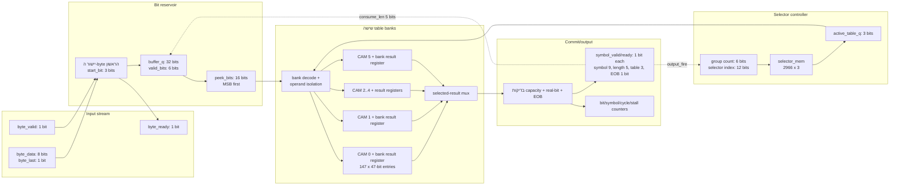

## תרשים E — הפרדה בין Datapath ל-control path

שימושי כאשר מסבירים מונחים אלה למתחילים:

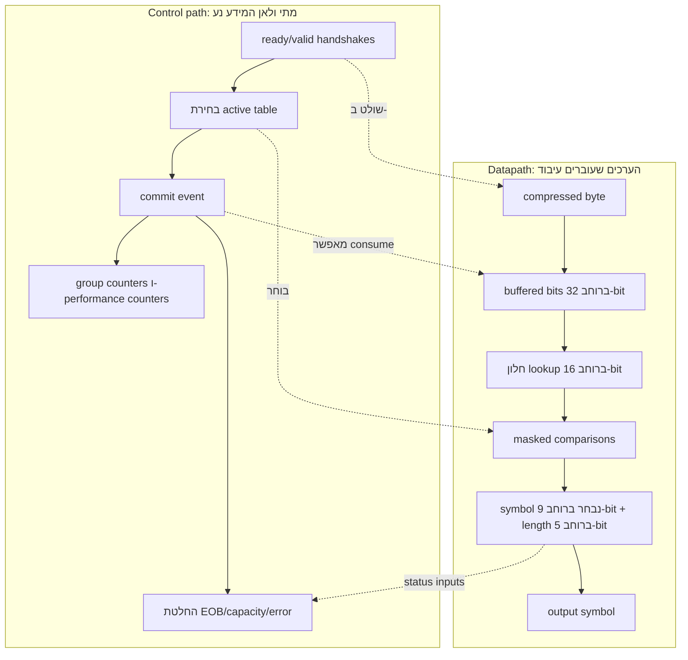

ה-datapath נושא bytes, bits, codes ו-symbols. ה-control path מחליט מתי ערך הוא
valid, איזה bank פועל והאם מותר למצב להתקדם.

## תרשים F — CAM entry אחד ו-parallel reduction

שימושי להסברת פעולת ה-Hardware המרכזית:

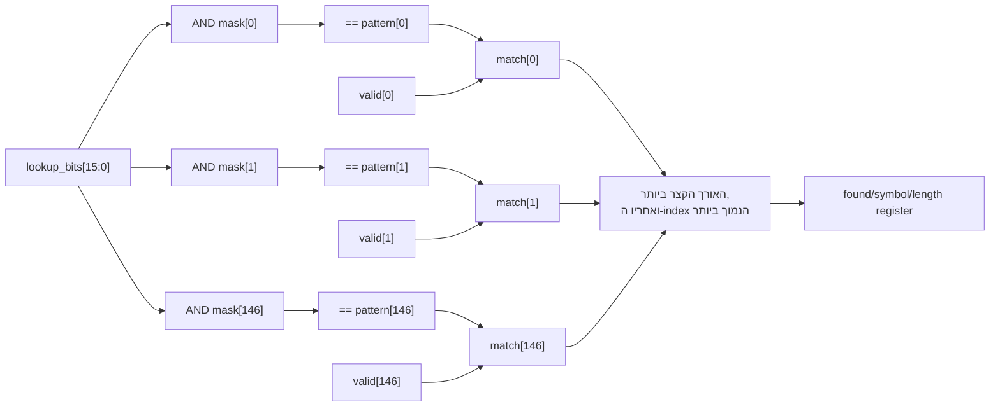

כל ענפי ה-entry מייצגים Hardware מקבילי. ה-priority reduction הוא combinational
וכנראה מהווה את סיכון ה-timing הגדול ביותר.

## תרשים G — דוגמה ל-bit alignment ב-reservoir

שימושי להבהרת יישור MSB-first:

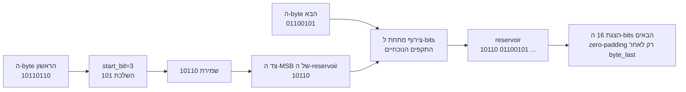

## תרשים H — תזמון ה-Selector

שימושי להוכחה שה-table משתנה בגבול הנכון:

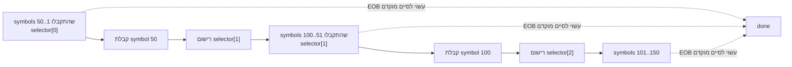

ה-transition מונע על ידי outputs שהתקבלו, ולכן output backpressure אינו יכול
להקדים בשקט את תנועת ה-selector.

## תרשים I — התנהגות commit ב-ready/valid

שימושי להסברת בטיחות ה-protocol:

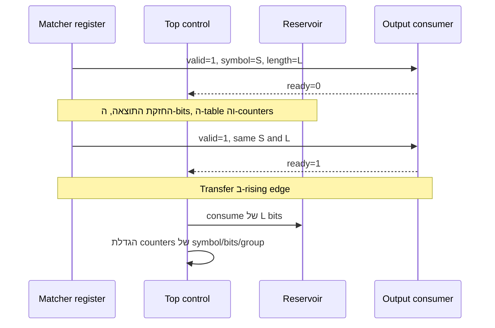

## תרשים J — מבט על מצבי ה-Control

שימושי בפרק Hardware architecture כאשר מצופה state diagram:

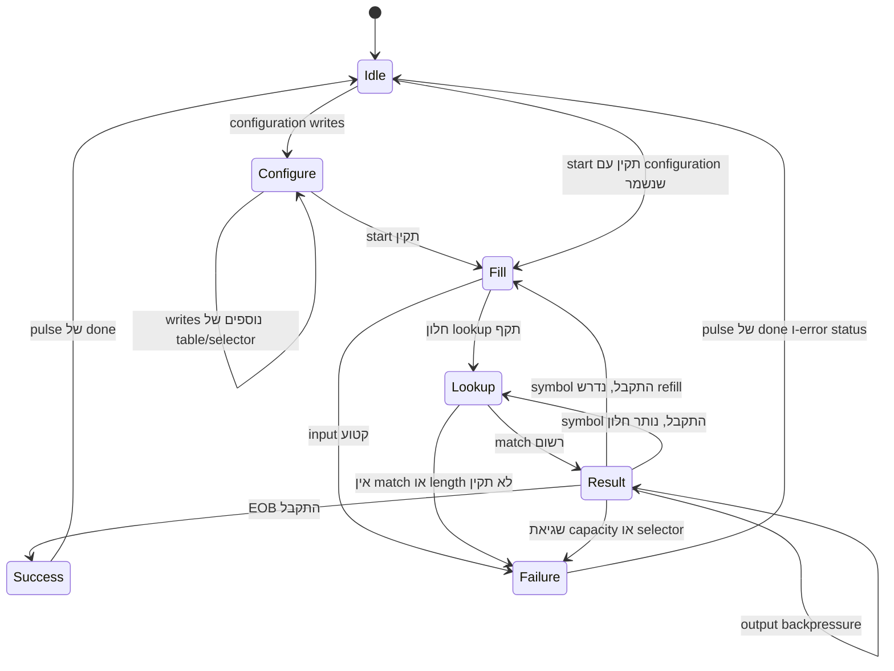

`Configure` הוא שלב שמפורש חיצונית כאשר `busy=0`; ה-RTL משתמש ב-state flags
ולא ב-FSM enumerated מדויק זה.

## תרשים K — מסלולי Timing סבירים

שימושי עבור פרק ה-timing/tradeoff:

```mermaid
flowchart TB
    subgraph P1["מסלול match רגיל: כנראה critical"]
        RQ["registers של reservoir ו-active-table"] --> BM["bank decode/mux"] --> CMP["147 השוואות masked ברוחב 16-bit"] --> PRI["16 x 147 priority predicates"] --> RR["result register"]
    end
    subgraph P2["מסלול עדכון ה-Reservoir"]
        MR["match result register"] --> SUB["חיסור length/count"] --> SHIFT["variable shift ברוחב 32-bit"] --> APP["צירוף byte אופציונלי שתלוי ב-count"] --> BQR["reservoir register"]
    end
    subgraph P3["מסלול Selector רק בגבול"]
        SI["selector index register"] --> ADD["increment"] --> MEM["קריאת selector memory"] --> RC["בדיקת טווח"] --> AT["active-table register"]
    end
```

ה-constraint של 5 ns חל על כל synchronous path, גם אם משתמשים ב-path רק פעם
ב-50 symbols.

## תרשים L — מפת Tradeoffs של ה-Architecture

שימושי כהשוואה מסכמת:

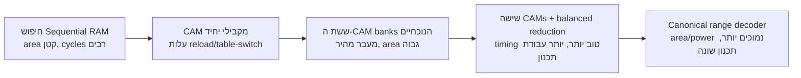

זהו רצף qualitative, ולא נתוני placement שנמדדו.

## בחירה מומלצת לדוח הסופי

אם הדוח חייב להיות קומפקטי, כדאי להשאיר:

1. את **תרשים A** עבור שילוב ה-Hardware/Software הכולל;
2. את **תרשים D** עבור ה-block diagram הפנימי המפורט; וכן
3. את **תרשים I או K**, בהתאם לשאלה אם הדיון מדגיש protocol correctness או
   timing closure.

אם הקהל חדש בתחום ה-RTL, כדאי להשאיר גם את תרשימים E, G ו-H, משום שהם הופכים
את ה-datapath/control, את ה-bit alignment ואת תזמון ה-selector למוחשיים.
