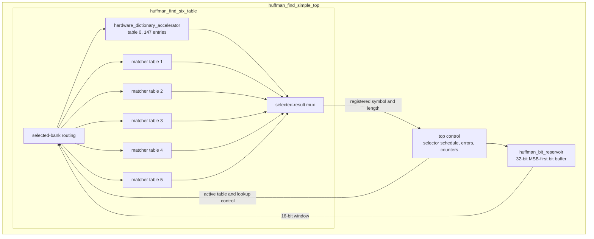
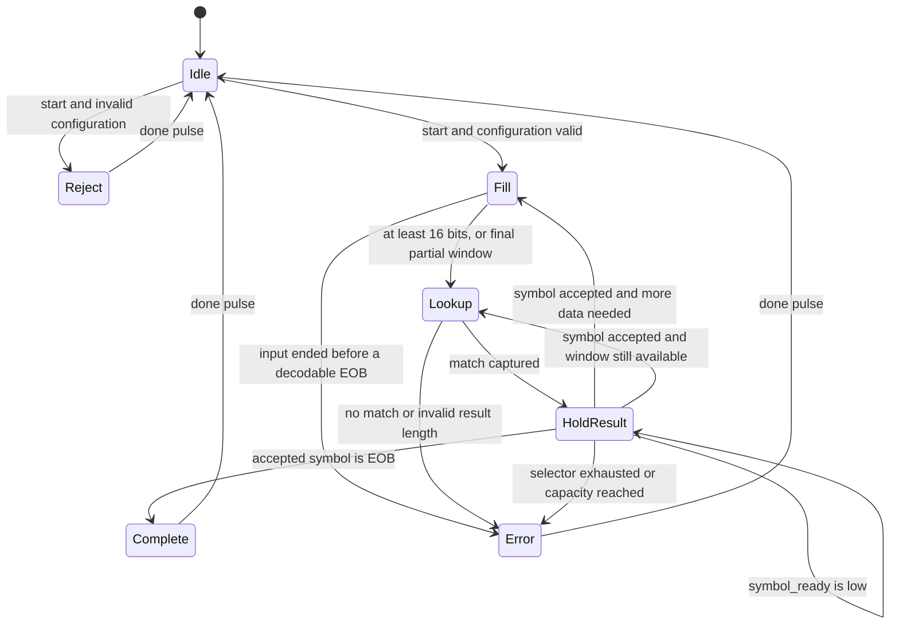

# 1. Hardware description

[Back to report index](README.md)

## 1.1 Proposed accelerator

The proposed hardware accelerates the repeated operation performed by
`HuffmanTable.find_next_symbol` in the pyflate bzip2 decoder. Software normally
examines the next compressed bits, searches a Huffman table, returns the decoded
symbol, and advances by the matched code length. The hardware performs those
same four actions as a streaming operation:

```text
compressed bytes -> bit window -> table match -> decoded symbol
                         ^                           |
                         `---- consume length <-----'
```

The active implementation is intentionally specialized to the measured
benchmark:

| Parameter | Value | Reason |
|---|---:|---|
| Huffman tables | 6 | Maximum used by the benchmark bzip2 block |
| Entries per table | 147 | Observed Huffman alphabet size, including EOB |
| Maximum code length | 16 bits | Sufficient for this benchmark; smaller than the general bzip2 limit |
| Decoded symbol width | 9 bits | `ceil(log2(147)) = 8`, but 9 bits safely represents the full project symbol interface and values 0–511 |
| Selector entries | 2,966 | One selector for each group of at most 50 decoded symbols |
| Reservoir | 32 bits | Holds a 16-bit lookup window plus refill margin |
| Input stream | 8 bits/cycle | Natural byte-oriented memory/DMA boundary |
| Output stream | 9-bit symbol plus metadata | Directly supplies the existing software post-processing loop |
| Clock target | 200 MHz | 5.000 ns target period; requires later timing closure |

This is a component accelerator, not a complete bzip2 decompressor. Software
continues to parse headers and Huffman metadata, perform RUNA/RUNB expansion,
move-to-front processing, inverse BWT, final run-length expansion, and output
verification.

## 1.2 Active SystemVerilog hierarchy



The implementation is divided into four active source files:

| Module | Source | Responsibility |
|---|---|---|
| `hardware_dictionary_accelerator` | [`rtl/huffman_find_simple.sv`](../rtl/huffman_find_simple.sv) | Stores and searches one table; generates alignment mask; resolves matches shortest length first; registers the result. |
| `huffman_find_six_table` | [`rtl/huffman_find_six_table.sv`](../rtl/huffman_find_six_table.sv) | Instantiates six matchers, directs writes and requests to one bank, isolates inactive operands, and multiplexes one result. |
| `huffman_bit_reservoir` | [`rtl/huffman_bit_reservoir.sv`](../rtl/huffman_bit_reservoir.sv) | Accepts bytes MSB first, discards the initial bit offset, exposes the next 16 bits, and removes a variable number of bits after a result is accepted. |
| `huffman_find_simple_top` | [`rtl/huffman_find_simple_top.sv`](../rtl/huffman_find_simple_top.sv) | Connects the reservoir and table banks; schedules selectors every 50 symbols; implements start/done/error, EOB, capacity, and counters. |

Suggested compile order:

```text
1. rtl/huffman_find_simple.sv
2. rtl/huffman_find_six_table.sv
3. rtl/huffman_bit_reservoir.sv
4. rtl/huffman_find_simple_top.sv
5. tests/tb_huffman_find_simple_top.sv
```

The source `rtl/huffman_find_accel.sv` is **not** instantiated by this hierarchy.
It is an older 20-bit canonical-range alternative and must not be mixed with
the 16-bit direct-table interface described here.

## 1.3 One-table match engine

### Configuration representation

Each table entry stores:

```text
pattern[15:0]  mask[15:0]  symbol[8:0]  length[4:0]  valid
```

Software writes a right-aligned canonical code. Hardware creates an MSB-aligned
pattern and mask. For `W = KEY_WIDTH`, right-aligned code `c`, and length `L`:

```text
shift   = W - L                                      [bits]
pattern = (c << shift) mod 2^W                       [W-bit vector]
mask    = ((2^W - 1) << shift) mod 2^W              [W-bit vector]
```

Example for `W=16`, code `c=0b101=5`, and `L=3`:

```text
shift   = 16 - 3 = 13 bits
pattern = 0x0005 << 13 = 0xA000
mask    = 0xFFFF << 13 = 0xE000 after 16-bit truncation
```

If the next lookup window begins `101...`, then:

```text
(lookup_bits AND 0xE000) == 0xA000
```

is true regardless of the remaining 13 bits. This convention fixes the earlier
alignment ambiguity: configuration codes are right aligned; reservoir lookup
bits and internally stored patterns are MSB aligned.

A zero length invalidates a slot. A nonzero length greater than `KEY_WIDTH` is
invalid. Writes are performed only when `dict_wr_addr < NUM_ENTRIES`, preventing
an out-of-range array index even though the eight-bit port can encode 0–255.

### Parallel comparison

All 147 entries in the selected bank are compared combinationally:

```text
raw_match[i] = lookup_valid
             AND valid[i]
             AND ((lookup_bits AND mask[i]) == pattern[i])
```

The implementation then searches lengths 1 through 16 and entries 0 through
146. The first match at the shortest length wins. A legal Huffman code is
prefix-free, so exactly one result should normally match; shortest-first
priority provides deterministic behavior even if software programs malformed
overlapping entries.

### Registered output

The selected `(found, symbol, length)` is captured in a one-entry output
register. It follows the standard ready/valid transfer rule:

```text
request_fire = lookup_valid AND lookup_ready
result_fire  = result_valid AND result_ready
```

The core can accept a request when its output register is empty or is being
consumed on the same edge:

```text
lookup_ready = NOT result_valid OR result_ready
```

If `result_valid=1` and `result_ready=0`, the result fields remain stable. This
prevents result loss when downstream logic stalls.

## 1.4 Six-table wrapper

bzip2 can use several Huffman tables and supplies a selector telling the decoder
which table applies to each group of 50 symbols. The wrapper instantiates six
independent table banks so a table switch does not require reloading the CAM.

For bank `k`:

```text
bank_lookup_valid[k] = lookup_valid AND (active_table == k)
bank_lookup_bits[k]  = lookup_bits when selected, otherwise 0
```

Only the selected bank sees an active request or changing lookup operand. This
operand isolation reduces unnecessary dynamic switching in the other five
banks. It does not remove their leakage or their area.

Configuration writes are similarly decoded by `dict_wr_table`. The wrapper
reports a configuration error if the table ID, entry address, or nonzero length
is outside the supported range.

## 1.5 MSB-first bit reservoir

The reservoir converts an easy-to-integrate byte stream into the 16-bit view
needed by the table matcher. Valid bits are maintained at the most-significant
side of a 32-bit register:

```text
buffer_q[31] = next compressed bit
peek_bits    = buffer_q[31:16]
```

On the first byte, `start_bit` leading bits are discarded. This allows a job to
start at an arbitrary bit position within its first byte. Subsequent bytes are
appended immediately after currently valid bits.

After a symbol result is accepted, a code of length `L` is consumed by:

```text
buffer_next    = buffer_current << L
bit_count_next = bit_count_current - L
```

Consumption and one-byte refill may occur on the same rising edge. Before the
last byte, the matcher waits for a full 16-bit window. After `byte_last`, the
reservoir permits a zero-padded partial window so a short final EOB code can be
decoded. The top rejects a candidate when `match_len > valid_bits`, so padded
zeros cannot create a false long match.

## 1.6 Top-level control

The top level executes one job using the following logical phases:



The RTL does not encode these labels as a large enumerated FSM; it uses `busy`,
the matcher result-valid state, reservoir state, and ordered terminal-condition
checks. The state diagram is the equivalent behavioral interpretation.

At `start`, the top latches:

- first-byte bit offset;
- number of selector entries;
- EOB symbol;
- destination symbol capacity; and
- selector table zero.

The active table is stored in `active_table_q`, rather than read asynchronously
from selector memory for every lookup. This recent timing-oriented change removes
the path `selector index -> selector RAM -> bank mux -> CAM -> priority encoder`
from normal operation. The next selector is captured only when the 50th symbol
of a group is accepted.

Selector behavior is based on accepted output symbols, not speculative matches:

```text
group positions 0..49  -> selector[0]
group positions 50..99 -> selector[1]
group positions 100..149 -> selector[2]
```

EOB is emitted on the normal result stream. Completion is asserted only on the
clock edge on which the EOB result is accepted, so backpressure cannot discard
the final symbol.

## 1.7 Errors and observability

The top provides terminal status and counters:

| Code | Name | Meaning |
|---:|---|---|
| `0x00` | `ERR_NONE` | No error |
| `0x02` | `ERR_BAD_CONFIG` | Invalid/incomplete configuration or illegal simultaneous write/start |
| `0x04` | `ERR_TRUNCATED` | Input ended without enough real bits for a valid result/EOB |
| `0x05` | `ERR_NO_SYMBOL` | Complete lookup window had no table match |
| `0x06` | `ERR_SELECTOR` | Invalid or exhausted selector schedule |
| `0x07` | `ERR_OUTPUT_OVERFLOW` | Symbol capacity was reached before accepted EOB |

Counters report logical work rather than merely interface activity:

- `bits_consumed`: sum of code lengths for accepted output symbols;
- `symbols_produced`: accepted outputs, including EOB;
- `cycle_count`: clocks spent busy;
- `input_stall_cycles`: cycles in which the reservoir could accept a byte but
  the producer did not provide one; and
- `output_stall_cycles`: cycles with a valid symbol blocked by the consumer.

Input and output stalls can overlap other internal conditions. Consequently,
stall counters are diagnostic categories and should not automatically be added
to reconstruct total cycles.

## 1.8 Initiation interval and deliberate simplicity

The table engine itself has a registered one-entry output and can accept one
independent lookup per cycle when results are continuously accepted. The
complete decoder, however, has a variable-length feedback dependency:

```text
lookup bits -> matched length -> consume reservoir -> next lookup bits
```

The simple top allows only one outstanding lookup. A match is registered on one
edge and its length is consumed on the next accepting edge. It therefore has:

```text
II = 2 cycles/symbol with no stream stalls
```

This choice is conservative and easy to explain and verify. A more aggressive
architecture could bypass or predict the next reservoir window, but it would
create a longer combinational feedback path or require speculation and recovery.

## 1.9 Reset and clock assumptions

All active modules use an active-low reset in `always_ff @(posedge clk or
negedge rst_n)`. Assertion may be asynchronous. Deassertion must be synchronized
to `clk` by the surrounding system so registers do not leave reset on unrelated
edges. This is now documented at the RTL ports.

The clock constraint in
[`constraints/huffman_find_simple_top.xdc`](../constraints/huffman_find_simple_top.xdc)
requests a 5.000 ns period:

```tcl
create_clock -name core_clk -period 5.000 [get_ports {clk}]
```

That line expresses a **target**, not an achieved frequency. Device-specific I/O
delays, generated clocks, clock uncertainty, reset/CDC treatment, synthesis,
placement, routing, and static timing analysis are still required.

## 1.10 Verification assets and implementation status

Two self-checking SystemVerilog testbench sources exist:

- [`tests/tb_huffman_find_simple.sv`](../tests/tb_huffman_find_simple.sv)
  exercises table programming, alignment, shortest priority, no-match, bounds,
  and output backpressure.
- [`tests/tb_huffman_find_simple_top.sv`](../tests/tb_huffman_find_simple_top.sv)
  exercises byte streaming through EOB, stalls, and final counters.

The Python reference model in
[`tools/huffman_reference.py`](../tools/huffman_reference.py) supplies a useful
golden model for larger randomized tests.

At the time of this report, no HDL simulator or target FPGA implementation
result is available in the workspace. The tests are therefore **implemented but
not claimed as executed here**, and frequency, area, and power remain analytical
targets/estimates. This qualification is important: logically complete RTL is
not the same as verified, synthesizable-on-every-tool, or timing-closed hardware.

## 1.11 Intentional limits

The active design intentionally does not provide:

- codes longer than 16 bits;
- more than six tables, 147 entries/table, or 2,966 selectors;
- LSB-first/reversed-code decoding;
- multiple simultaneous jobs;
- context save/restore or preemption;
- a standard bus, cache-coherent port, DMA master, or interrupt output;
- a separate configuration-clear/epoch command or per-table loaded flag;
  configuration persists until global reset, so software must fully rewrite all
  6x147 slots and invalidate absent entries before using different tables;
- protection against software changing table configuration during a job beyond
  `cfg_ready` and expected adapter behavior; or
- production reliability features such as ECC, watchdog recovery, formal proof,
  or redundant error reporting.

Those omissions are appropriate for a benchmark-specific course accelerator,
but each must be revisited before using the design as a general product block.
