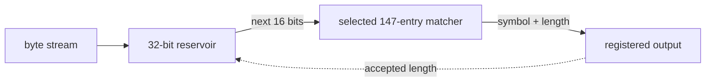
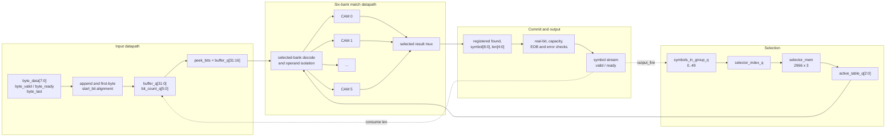
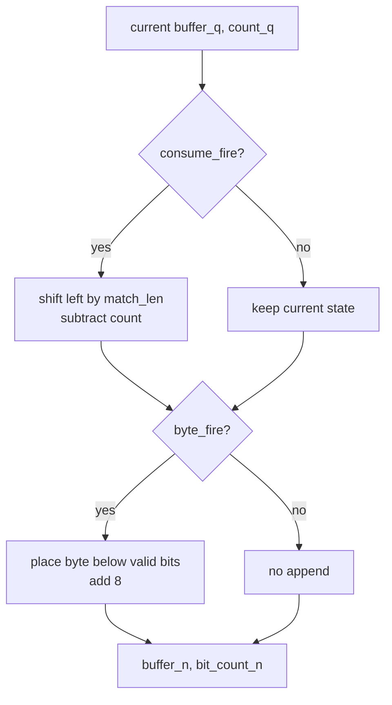
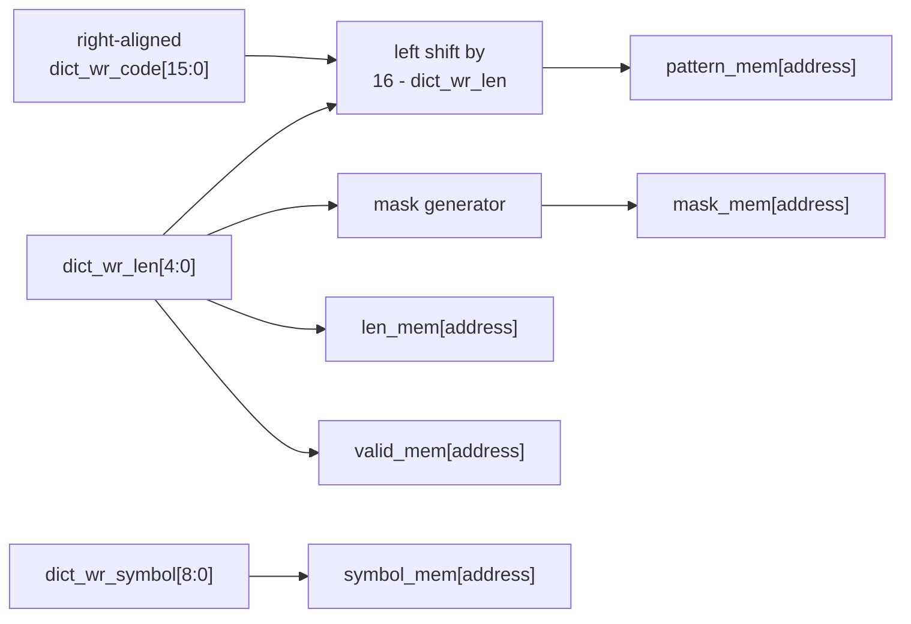
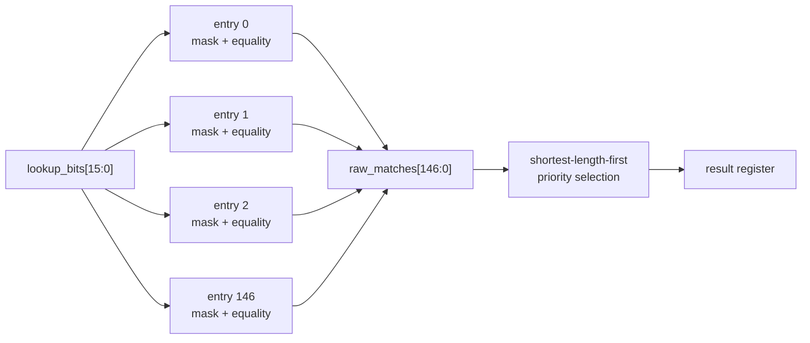
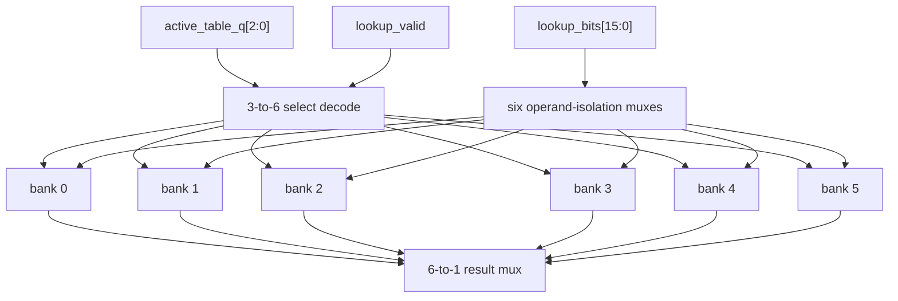
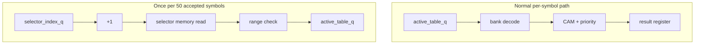
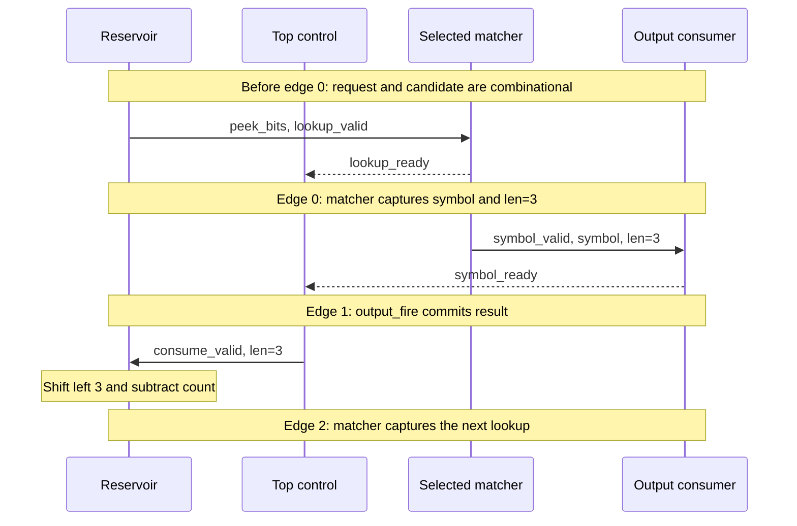
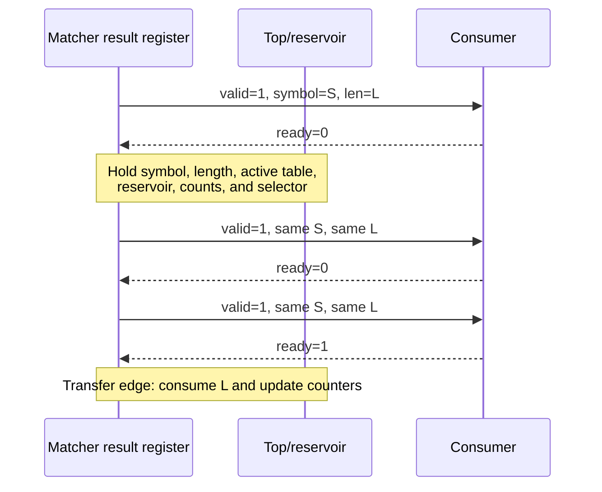
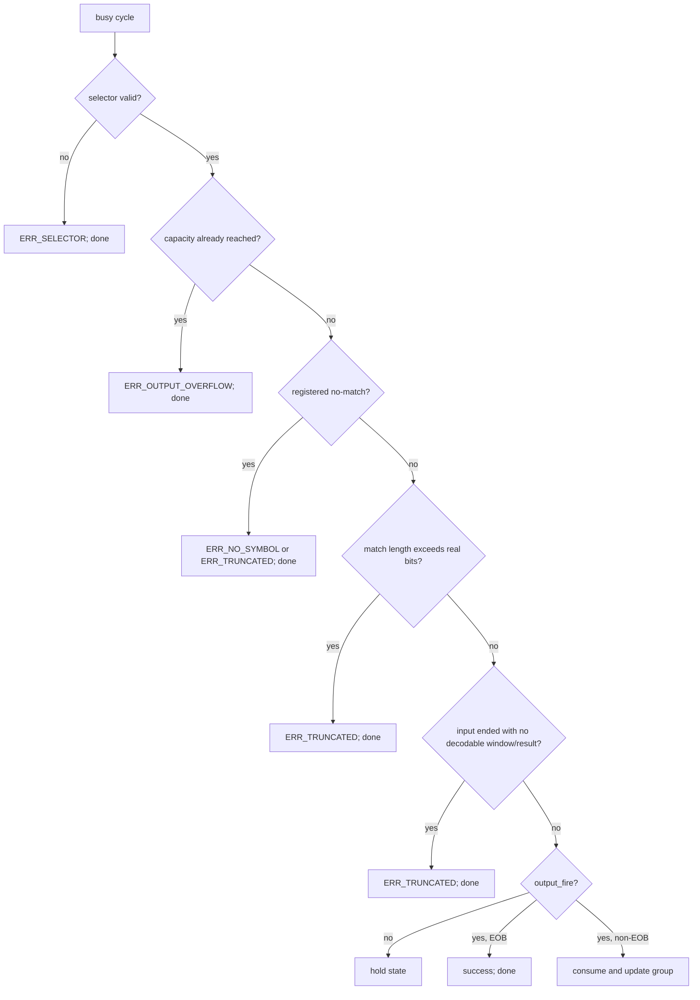

# 3. Hardware architecture and operation

[Back to report index](README.md)

## 3.1 Architectural idea

The accelerator turns a software loop with variable-length bit operations and a
table search into a small stream-processing pipeline. It separates the design
into three concerns:

1. **Bit preparation:** maintain the next compressed bits at a fixed location.
2. **Symbol lookup:** compare that fixed window with the currently selected
   Huffman table and register the winning symbol/length.
3. **Commit/control:** emit the symbol only when the receiver accepts it, then
   consume exactly its length and update the table schedule.

Compact view:



The feedback arrow is architecturally important. The next lookup window cannot
be known until the current symbol's variable code length has been accepted and
removed.

## 3.2 Full datapath



Data flows left-to-right. Dashed arrows are commit feedback: they update state
only when the output handshake occurs.

## 3.3 Reservoir datapath in detail

### Invariant

The reservoir keeps all real, unread bits left aligned:

```text
buffer_q = [valid unread bits][don't-care/zero space]
            ^ bit 31 is always next
bit_count_q = number of valid unread bits, 0..32
```

Consequently the matcher never needs a variable-index bit slice:

```text
peek_bits[15:0] = buffer_q[31:16]
```

This is a classic hardware transformation. Software can shift/mask arbitrary
integers conveniently; hardware becomes simpler if variable position is paid for
once during append/consume and every lookup sees a fixed wire slice.

### First byte

Let the accepted first byte be `D[7:0]` and let `s=start_bit`, where `0<=s<=7`.
The number of retained bits is:

```text
n_first [bits] = 8 bits - s bits
```

The RTL puts the retained suffix at the top of the reservoir:

```text
buffer_next = zero_extend(D) << (BUFFER_WIDTH - 8 + s)
bit_count_next = 8 - s
```

Example:

```text
D = 8'b1011_0110
s = 3

discarded bits = 101
retained bits  = 10110
reservoir      = 10110xxx_xxxxxxxx_xxxxxxxx_xxxxxxxx
bit_count      = 5
```

Here `x` means the bit is outside `bit_count` and cannot be logically consumed.

### Appending a later byte

If `n` real bits remain, the next byte is placed immediately below them:

```text
buffer_next = buffer_current
            OR (zero_extend(D) << (BUFFER_WIDTH - 8 - n))
bit_count_next = n + 8
```

The byte can be accepted when, after any simultaneous consume, no more than 24
bits remain:

```text
byte_ready = active AND NOT input_last_seen
           AND (count_after_consume <= 32 - 8)
```

### Consuming a code

For accepted result length `L`:

```text
consume_ready = active AND (L != 0) AND (L <= bit_count_q)
consume_fire  = consume_valid AND consume_ready

buffer_after_consume = buffer_q << L
count_after_consume  = bit_count_q - L
```

The design computes consume first and append second, so both transfers may occur
on the same edge:



### End of input

Before `byte_last`, `peek_valid` requires at least 16 real bits. Once the final
byte has been accepted, it also permits a partial nonempty window:

```text
peek_valid = active AND
             (bit_count >= 16 OR (last_seen AND bit_count != 0))
```

Unused low bits of the 16-bit peek are effectively zero padding. A result is
accepted only if:

```text
match_len <= reservoir_valid_bits
```

This prevents a programmed code from matching bits that were not actually in
the source.

## 3.4 One-bank CAM datapath

### Entry programming



Bounds and length checks occur before indexing/updating an entry. `len=0`
clears its valid bit; `1..16` writes a valid code; a length above 16 is rejected
by the six-bank configuration checker and invalid in the individual bank.

### Parallel match

For all entries `i=0..146` in the selected table:

```text
masked_window[i] = lookup_bits AND mask_mem[i]
raw_match[i] = valid_mem[i] AND
               (masked_window[i] == pattern_mem[i])
```

Conceptual parallel structure:



There are 147 physical comparison opportunities in each bank and six banks in
the design. Operand isolation holds five banks' inputs inactive, but all six
occupy silicon resources.

### Shortest-first selection

The behavioral selection rule is:

```text
candidate_found = 0
for length L = 1..16:
    for entry i = 0..146:
        if not candidate_found and raw_match[i] and len[i] == L:
            select entry i
```

This exactly defines priority: smaller length wins, then smaller entry index.
The source describes `16*147=2,352` length/entry predicates per bank. Synthesis
may simplify a valid prefix-free table, but the literal nested priority/mux
network is a major area and 5 ns timing risk.

For a legal prefix-free table, multiple lengths cannot match the same leading
bit sequence. A future timing-oriented implementation could validate tables in
software and replace the flat source priority with a balanced one-hot reduction
or tournament tree while preserving the externally visible result.

## 3.5 Six-bank selection

Six banks avoid reprogramming on every bzip2 group transition. The active table
ID is decoded into one-hot lookup valids:

```text
bank_valid[k] = lookup_valid AND (active_table_q == k), k=0..5
```

The selected bank's ready/result fields are multiplexed back. Inactive banks see
`lookup_valid=0` and `lookup_bits=0`. This is operand isolation, not clock
gating; clocked bank state is still connected to `clk`.



## 3.6 Selector controller

The parsed selector list supplies one 3-bit table ID for each group of up to 50
Huffman symbols. The state is:

```text
selector_mem[0..2965] : 3 bits each
selector_index_q       : current group
symbols_in_group_q     : accepted positions 0..49
active_table_q         : registered selector_mem[selector_index_q]
```

Update equation on an accepted non-EOB result:

```text
if symbols_in_group_q == 49:
    selector_index_next   = selector_index_q + 1
    active_table_next     = selector_mem[selector_index_next]
    symbols_in_group_next = 0
else:
    symbols_in_group_next = symbols_in_group_q + 1
```

Accepted EOB terminates first and does not attempt to fetch another selector.

### Why the selector is registered

An asynchronous selector read directly feeding `active_table` would create:

```text
selector_index register
-> selector memory/mux
-> bank decode
-> CAM compare
-> priority selection
-> result register
```

`active_table_q` splits that into a normal fast path and an infrequent boundary
path:



The boundary path still needs static timing analysis. If it fails 5 ns, the next
selector can be prefetched well before symbol 50 or read through a synchronous
RAM stage.

## 3.7 Request, result, and commit control

The top permits a new lookup only when:

```text
busy
AND selector is valid
AND reservoir exposes a window
AND no matcher result is pending
AND symbols_produced < symbol_capacity
```

The selected matcher is necessarily ready under this invariant because its only
storage is the result register and no result is pending.

A valid output additionally requires:

```text
matcher_result_valid
AND matcher_found
AND matcher_len <= real reservoir bits
AND capacity remains
```

Commit is atomic:

```text
output_fire = symbol_valid AND symbol_ready
```

On that one edge, the system:

- removes `matcher_len` bits;
- increments `bits_consumed` by `matcher_len`;
- increments `symbols_produced` by one;
- removes the matcher result from its output register;
- advances the group count/selector for a non-EOB result; or
- terminates successfully for EOB.

Atomic commit is what makes backpressure safe.

## 3.8 Cycle-by-cycle example

Assume the reservoir already has 16 bits, the receiver is always ready, and the
current symbol has code length 3.



In steady state, request-accept edges occur at approximately 0, 2, 4, 6, ...,
so the complete feedback design has `II=2`.

Compact timing table:

| Clock edge | Matcher result before edge | Main action | Reservoir visible after edge |
|---:|---|---|---|
| 0 | empty | Accept lookup A and capture its result | A valid; reservoir unchanged |
| 1 | A valid | Accept A, consume its length, optionally refill | result empty; next window |
| 2 | empty | Accept lookup B and capture its result | B valid; reservoir unchanged |
| 3 | B valid | Accept B and consume its length | result empty; next window |
| 4 | empty | Accept lookup C and capture its result | C valid |

The combinational comparison occurs before the request-transfer edge, and the
result register changes immediately after that edge. The observable steady-state
spacing between request/capture edges is two cycles per accepted symbol.

## 3.9 Backpressure example



No duplicate symbol is counted during the stall because `symbols_produced`
changes only on `valid AND ready`.

## 3.10 Terminal control priority

While busy, the top checks terminal conditions before normal commit. The logical
priority is:



Bad match results are marked ready internally so a terminal result cannot remain
wedged in a bank after the job reports an error.

## 3.11 Performance model from architecture

Worst-case initial reservoir fill is:

```text
C_fill [cycles] = ceil((KEY_WIDTH + start_bit) / 8 bits-per-byte-cycle)
```

For `KEY_WIDTH=16`:

```text
start_bit = 0      -> ceil(16/8) = 2 cycles
start_bit = 1..7   -> ceil(17..23/8) = 3 cycles
```

With `N` symbols, initiation interval `II=2`, and no stalls:

```text
C_core [cycles] = C_fill + N*II
T_core [s]      = C_core / f_clk
```

For `N=148,271`, worst fill, and target 200 MHz:

```text
C_core = 3 + 148,271*2 = 296,545 cycles
T_core = 296,545 / 200,000,000 = 0.001482725 s
       = 1.482725 ms
```

This model is intentionally clear but idealized. A real job adds source/output
stalls, configuration/setup, completion latency, and any cycles introduced by a
platform wrapper.

## 3.12 Timing-oriented alternatives

The nested priority logic is the principal risk to the 5 ns target. Options are:

| Change | Likely benefit | Cost/semantic effect |
|---|---|---|
| Balanced match-reduction/tournament tree | Shorter logic depth; can retain one match stage | More explicit RTL and routing; must preserve shortest/index priority |
| Validate prefix-free tables and balanced one-hot OR | Smaller/faster selection | Relies on software/loader validation; should detect multiple matches |
| Register `raw_matches` before priority | Clean timing cut | Adds a feedback stage; without speculation, full-top II likely changes from 2 to about 3 |
| Prefetch next selector | Removes boundary async-memory path | Adds small control state |
| Replace CAM with canonical range decoder | Much less compare/storage logic | Different architecture from the intentionally simple friend-based design |
| Single-bank sequential search | Very small area | Many cycles per symbol; defeats performance goal |

If an extra matcher pipeline stage changes the complete feedback loop to
`II=3`, the same target frequency gives:

```text
C_core,pipelined = 3 + 148,271*3 = 444,816 cycles
T_core,pipelined = 444,816 / 200,000,000
                 = 2.22408 ms
```

Therefore “more pipeline stages” is not automatically free. Independent
lookups might preserve throughput in a normal pipeline, but this decoder's next
input depends on the preceding result length.
