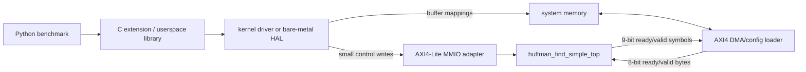
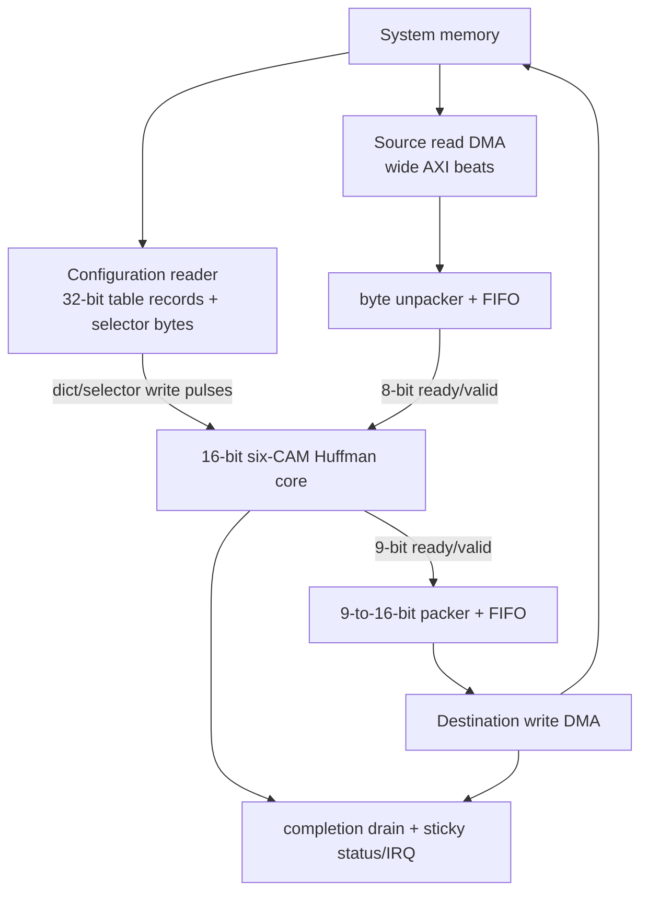
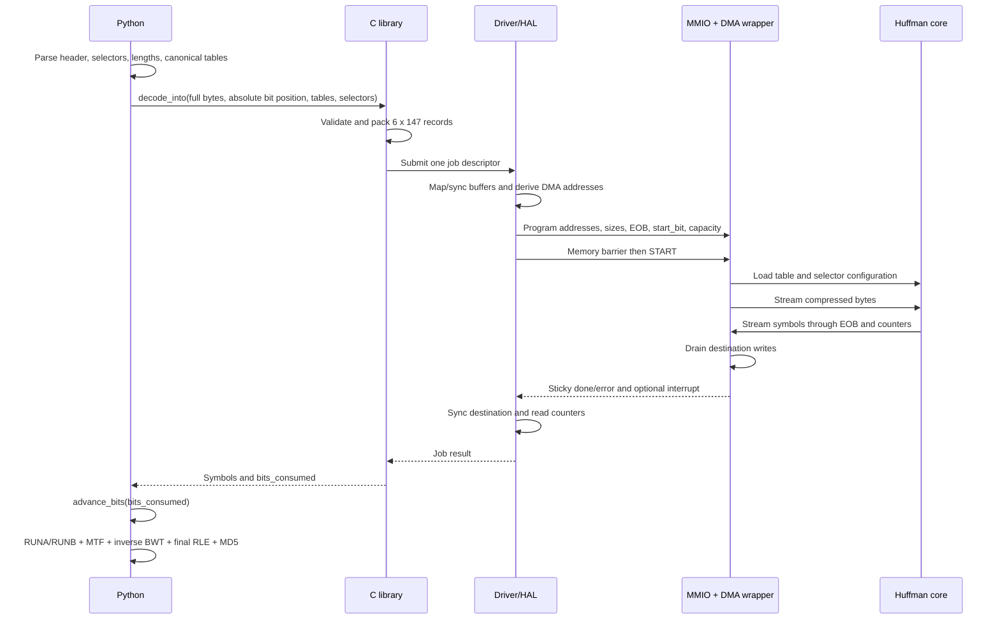

# 4. Hardware/software interface

[Back to report index](README.md)

## 4.1 What is implemented versus proposed

The SystemVerilog core is deliberately bus-independent. Its configuration
pulses and ready/valid streams can be driven directly by a testbench. It does
**not** currently implement AXI, DMA, PCIe, interrupts, a Linux driver, or a
Python extension.

For integration into a typical FPGA SoC, the smallest practical surrounding
system is:



For the course demonstration, only the core and testbench are required. The
MMIO/DMA/driver layers are specified so the design has a coherent real-system
boundary, but they need not be implemented unless the project scope expands.

## 4.2 Why MMIO and DMA have different jobs

### MMIO

Memory-mapped I/O gives accelerator registers CPU-visible addresses. A CPU
store to a control address changes device state; a CPU load reads status. A
lightweight protocol such as AXI4-Lite is appropriate because these operations
are few and small.

Use MMIO for:

- source/destination/configuration buffer addresses;
- buffer sizes, selector count, start bit, EOB, and capacity;
- one `START` command;
- status, error, interrupt acknowledgement, and counters.

Do **not** use one MMIO transaction per Huffman symbol. The benchmark has
148,271 lookups; per-symbol CPU/device round trips would put most overhead back
inside the hot loop.

### DMA

Direct memory access moves bulk data between system memory and the accelerator
without a CPU instruction for each item. The proposed DMA/config wrapper must:

- read and unpack the table image and selector bytes into configuration pulses;
- read the compressed source and convert bus beats into the eight-bit
  `byte_valid/byte_ready` stream;
- assert `byte_last` on the last byte of the mapped source region;
- accept symbol-stream backpressure correctly;
- pack each nine-bit symbol into a little-endian 16-bit destination element;
- stop accepting source when the core completes/errors;
- wait for all destination writes and write responses to finish; and
- only then publish the wrapper's sticky job-done state or interrupt.

The last point matters: core EOB acceptance means the symbol entered the output
writer, not necessarily that the corresponding memory transaction is globally
visible yet.

## 4.3 Software/hardware partition

### Operations remaining in software

Software retains:

- file/container handling and bzip2 block-header parsing;
- used-byte map parsing;
- selector unary/MTF decoding;
- Huffman length parsing and canonical-code construction;
- validation and packing of accelerator tables;
- RUNA/RUNB expansion;
- data move-to-front transform;
- inverse Burrows-Wheeler transform;
- final run-length expansion; and
- final length and MD5 checking.

### Operations moved to hardware

One batched hardware job performs:

- byte-to-MSB-first-bit conversion;
- 16-bit snoop/peek formation;
- selected Huffman-table match;
- returned-length bit consumption;
- table change after every 50 raw Huffman symbols;
- EOB recognition; and
- symbol/bit/cycle accounting.

This boundary is larger than the comparator alone. The bit reservoir is
essential because otherwise Python would still need to peek and drop bits for
every hardware result, eliminating much of the inclusive acceleration benefit.

## 4.4 Existing source locations and required modification point

The original implementation is the correctness reference:

- [`suites/original/bm_pyflate/run_benchmark.py`](../../../suites/original/bm_pyflate/run_benchmark.py)
  constructs canonical table fields around lines 177–200.
- Its `HuffmanTable.find_next_symbol` implementation is around lines 224–235.
- Selector parsing is around lines 355–369, and Huffman tables are parsed around
  lines 372–391.
- The table change every 50 symbols and call to `find_next_symbol` are around
  lines 411–425.
- RUNA/RUNB, EOB, and data-MTF processing are around lines 426–443.

The optimized implementation is the safer place to add a selectable hardware
backend while keeping the original untouched as a golden reference:

- [`suites/optimized/bm_pyflate/run_benchmark.py`](../../../suites/optimized/bm_pyflate/run_benchmark.py)
  uses dictionaries by `(length, code)` and loops over unique lengths around
  lines 171–187 and 202–211.
- Its equivalent selector/lookup/post-processing loop is around lines 361–385.

The optimized lookup is a useful algorithmic comparison, but it remains Python
software and still performs one sequential function call per symbol. It does
not provide hardware streams, MMIO, DMA, or a driver.

## 4.5 Configuration data format

### Table entries

The active simple CAM does **not** use the `range[]/perm[]` format in the
existing `sw/huffman_find_uapi.h`; that header belongs to the other 20-bit
canonical-range accelerator.

Use one explicit 32-bit little-endian record per `[table][entry]`:

```text
31       30 29             25 24                 16 15                 0
+----------+-----------------+----------------------+--------------------+
| reserved | length[4:0]     | decoded_symbol[8:0]  | canonical_code     |
+----------+-----------------+----------------------+--------------------+
```

Equivalent C layout, avoiding implementation-defined C bitfields:

```c
#define HFS_TABLES        6u
#define HFS_ENTRIES       147u
#define HFS_MAX_BITS      16u
#define HFS_MAX_SELECTORS 2966u

struct hfs_cam_entry {
    uint16_t code_le; /* canonical x.symbol, right aligned */
    uint16_t meta_le; /* [8:0]=x.code, [13:9]=x.bits, [15:14]=0 */
};
```

Array order is:

```text
entry[table_id][decoded_symbol_address]
```

For every Python Huffman entry `x`:

```text
dict_wr_addr   = x.code
dict_wr_code   = x.symbol
dict_wr_symbol = x.code
dict_wr_len    = x.bits
```

The names are easy to confuse: in pyflate, `x.symbol` is the generated
canonical bit-code integer, while `x.code` is the decoded Huffman alphabet
index returned to the block loop.

Packing pseudocode:

```python
records = [[0 for _ in range(147)] for _ in range(6)]

for table_id, table in enumerate(tables):
    for x in table.table:
        assert 0 <= x.code < 147
        assert 1 <= x.bits <= 16
        assert 0 <= x.symbol < (1 << x.bits)
        meta = x.code | (x.bits << 9)
        records[table_id][x.code] = x.symbol | (meta << 16)
```

All 6x147 records should be initialized and submitted. A zero length
invalidates an absent entry. This prevents stale valid entries if a later job
uses a shorter/different table. Unused table banks are all-zero invalid records.

Size:

```text
6 tables * 147 records/table * 4 bytes/record = 3,528 bytes
```

### Selectors

Use one byte per already-decoded table selector:

```text
selector byte[2:0] = table ID
selector byte[7:3] = 0
```

Selectors must be the actual table IDs after the software unary/MTF selector
decoding—not the encoded selector bits from the compressed file. Validate each
ID against the parsed number of groups and the hardware maximum of six.

Measured-workload size:

```text
2,966 selectors * 1 byte = 2,966 bytes
```

### Destination symbols

Use a little-endian `uint16_t` per result:

```text
destination[8:0]  = decoded symbol
destination[15:9] = 0
```

EOB is included. For the observed 148,271 outputs:

```text
148,271 symbols * 2 bytes/symbol = 296,542 bytes
```

This is the raw Huffman-symbol stream, not the final 399,360-byte decompressed
output after RUNA/RUNB, MTF, inverse BWT, and final RLE.

For a general supported input, software must allocate capacity before it knows
the exact symbol count. Since every valid Huffman code consumes at least one
bit, the number of remaining source bits is a conservative symbol-capacity
bound. The library must check that `capacity * 2 bytes` does not overflow the
host size type or exceed the actually mapped destination. The known 148,271
count may be used for this fixed benchmark fixture, but should not be assumed by
a reusable decoder.

## 4.6 Absolute bit-position ownership

The software bit reader may already have fetched bytes beyond the logical read
position. Therefore a raw file-object `tell()` is not a safe accelerator start
address by itself.

Use one absolute logical bit position:

```text
absolute_bit_position [bits from file start]
byte_offset [bytes] = floor(absolute_bit_position / 8)
start_bit [bits]    = absolute_bit_position mod 8
```

Equivalent bit operations:

```python
byte_offset = absolute_bit_position >> 3
start_bit = absolute_bit_position & 7
```

The source pointer passed to DMA becomes `base + byte_offset`, while
`start_bit` tells the reservoir how many leading bits of its first byte to
discard.

On completion:

```python
b.advance_bits(result.bits_consumed)
```

`bits_consumed` begins at the first bit after `start_bit`, so the skipped leading
bits must not be added again.

DMA is allowed to prefetch bus beats beyond EOB for efficiency. Those bytes are
not logically consumed. Only `bits_consumed` advances the software reader.

The original `RBitfield` should not be used unchanged for this integration: its
copy constructor assigns `count=x.bitfield` around line 36, and its bulk
`dropbits` calls `self.f._read` around line 67. The optimized reader corrects
these to `count=x.count` and `f.read`. Add an explicit, tested
`absolute_tellbits()`/`advance_bits(n)` API to the optimized version rather than
depending on ambiguous file state.

## 4.7 Minimal Python API

Use one call per bzip2 Huffman block:

```python
result = accelerator.decode_into(
    compressed=memoryview(full_file_bytes),
    absolute_bit_position=b.absolute_tellbits(),
    tables=tables,
    selectors=selectors_list,
    eob_symbol=symbols_in_use - 1,
    output=symbol_buffer,
)

if result.hardware_error:
    raise HuffmanAcceleratorError(result.hardware_error)

b.advance_bits(result.bits_consumed)
raw_symbols = symbol_buffer[:result.symbols_produced]
```

Recommended result fields:

```text
symbols_produced      uint32, includes EOB
bits_consumed         uint32
cycle_count           uint64
input_stall_cycles    uint32
output_stall_cycles   uint32
hardware_error        uint32 or enum
```

The Python-facing library should offer explicit `software`, `hardware`, and
`auto` backend modes. Published hardware measurements must use `hardware` and
must fail visibly if the accelerator is unavailable; silent fallback would make
the reported timing meaningless.

## 4.8 Minimal C/job ABI

A platform-specific C extension or userspace library can submit a job structure
similar to:

```c
struct hfs_job {
    uint64_t src_user_ptr;
    uint64_t tables_user_ptr;
    uint64_t selectors_user_ptr;
    uint64_t dst_user_ptr;

    uint32_t src_length_bytes;
    uint32_t dst_symbol_capacity;
    uint32_t selector_count;
    uint16_t eob_symbol;
    uint8_t  start_bit;
    uint8_t  table_count;
    uint32_t timeout_ms;

    /* Returned by driver/device. */
    uint32_t bits_consumed;
    uint32_t symbols_produced;
    uint32_t hardware_error;
    uint64_t cycle_count;
    uint32_t input_stall_cycles;
    uint32_t output_stall_cycles;
};
```

This is a proposed logical ABI, not a compiled header in the current project.
For a real UAPI, use fixed Linux types (`__u32`, `__u64`, `__le16` where stored),
define alignment/padding explicitly, add a version/size field, and provide
32/64-bit compatibility handling.

The C shim should:

1. validate Python objects and sizes;
2. derive `byte_offset` and `start_bit` from the absolute bit position;
3. pack or reuse cached table/selector buffers;
4. submit exactly one job;
5. release the Python GIL while waiting;
6. map hardware error codes to Python exceptions; and
7. return counters and a view of the produced symbols without unnecessary
   copies where possible.

## 4.9 Proposed minimal MMIO register map

The following is one coherent logical map for an AXI4-Lite adapter. It is not
implemented by `huffman_find_simple_top` and must not be confused with the older
package/header.

| Offset | Register | Access | Required fields |
|---:|---|---|---|
| `0x000` | `ID` | RO | Fixed accelerator identity |
| `0x004` | `VERSION` | RO | ABI/RTL interface version |
| `0x008` | `CONTROL` | WO | bit 0 `START`; bit 1 optional abort/reset |
| `0x00C` | `STATUS` | RO/W1C | bit 0 busy; bit 1 done-sticky; bit 2 error-sticky; bit 3 IRQ pending |
| `0x010` | `ERROR_CODE` | RO | Core/wrapper/DMA terminal error |
| `0x020` | `SRC_ADDR_LO` | RW | source DMA address bits 31:0 |
| `0x024` | `SRC_ADDR_HI` | RW | source DMA address bits 63:32 |
| `0x028` | `SRC_LENGTH` | RW | mapped bytes available from adjusted start byte |
| `0x02C` | `START_BIT` | RW | bits 2:0, legal 0–7 |
| `0x030` | `TABLE_ADDR_LO` | RW | 3,528-byte CAM image address low |
| `0x034` | `TABLE_ADDR_HI` | RW | CAM image address high |
| `0x038` | `CONFIG_FLAGS` | RW | e.g. reload/cached-table selection; zero for simple implementation |
| `0x040` | `SELECTOR_ADDR_LO` | RW | selector image address low |
| `0x044` | `SELECTOR_ADDR_HI` | RW | selector image address high |
| `0x048` | `SELECTOR_COUNT` | RW | 1–2966 |
| `0x04C` | `TABLE_COUNT` | RW | parsed groups, 1–6; wrapper validates selector IDs against it |
| `0x050` | `DST_ADDR_LO` | RW | destination DMA address low |
| `0x054` | `DST_ADDR_HI` | RW | destination DMA address high |
| `0x058` | `DST_CAPACITY` | RW | number of 16-bit symbol slots, includes EOB |
| `0x05C` | `EOB_SYMBOL` | RW | bits 8:0 |
| `0x060` | `BITS_CONSUMED` | RO | logical bit advance after initial offset |
| `0x064` | `SYMBOLS_PRODUCED` | RO | outputs including EOB |
| `0x068` | `CYCLE_COUNT_LO` | RO | cycle count bits 31:0 |
| `0x06C` | `CYCLE_COUNT_HI` | RO | cycle count bits 63:32 |
| `0x070` | `INPUT_STALLS` | RO | input-starvation diagnostic |
| `0x074` | `OUTPUT_STALLS` | RO | output-backpressure diagnostic |
| `0x078` | `IRQ_ACK` | W1C | acknowledge sticky completion/error interrupt |

`W1C` means “write one to clear.” The adapter should reject `START` while busy,
snapshot all job registers atomically on an accepted start, and make completion
sticky because the core's native `done` is only one clock wide.

MMIO ordering requires a write memory barrier before `START`, so all address and
length writes are visible first. After completion, a read barrier and DMA cache
synchronization must occur before software reads the destination.

## 4.10 DMA adapter behavior



Useful FIFOs decouple memory bursts from the byte/symbol rate. The source reader
must not overwrite or re-order bytes; the output writer must not signal final
completion until its last write response is received.

For a bus of width `W_bus` bits, frequency `f_bus`, and efficiency `eta`:

```text
B_effective [byte/s] = eta * (W_bus / 8) [byte/cycle]
                       * f_bus [cycle/s]

T_transfer [s] = bytes / B_effective
```

Illustrative ideal (`eta=1`) 128-bit, 200 MHz bus:

```text
B_peak = (128/8) bytes/cycle * 200,000,000 cycles/s
       = 3.2 GB/s

source beats = ceil(67,562 / 16) = 4,223 beats
source bus occupancy = 4,223 / 200 MHz = 21.115 us

destination beats = ceil(296,542 / 16) = 18,534 beats
destination bus occupancy = 18,534 / 200 MHz = 92.670 us

configuration beats = ceil(6,494 / 16) = 406 beats
configuration occupancy = 406 / 200 MHz = 2.030 us
```

These are ideal bus-occupancy examples, not end-to-end DMA latency. Arbitration,
burst setup, page boundaries, IOMMU, cache maintenance, and response latency
reduce `eta`. Source and destination traffic can overlap the 1.483 ms core model
if the DMA engines are independent and sufficiently buffered.

The eight-bit source port needs only:

```text
67,562 bytes / 1.482725 ms = 45.57 MB/s average
```

if the entire file were supplied during the estimated core interval. The output
side is closer to its two-byte-per-two-cycle limit, approximately 200 MB/s at
200 MHz, so output buffering deserves more attention.

## 4.11 Driver responsibilities

A real Linux driver is required only for a real non-coherent device/FPGA system;
it is not needed for direct RTL simulation. A minimal driver must:

1. validate ABI version, fixed-width overflow, alignment, pointers, lengths,
   `start_bit`, table/selector limits, EOB, and destination capacity;
2. validate selectors against the parsed `table_count`, not merely `<6`;
3. pin/map user buffers or copy them into safe DMA buffers;
4. obtain DMA/IOMMU addresses and perform required cache synchronization;
5. program MMIO registers, issue a write barrier, and start the job;
6. sleep for interrupt completion or poll sticky status;
7. enforce a timeout and reset/abort safely if hardware wedges;
8. wait until output writes are drained, then synchronize the destination for
   CPU access;
9. read error/status/counters; and
10. unmap/unpin resources on every success and error path.

Huffman parsing belongs in userspace, not in the driver. The driver validates
the packed representation for safety; the Python/C library constructs it.

On a bare-metal FPGA SoC, the same responsibilities can live in a small hardware
abstraction library instead of a kernel driver. On coherent shared memory, some
cache operations disappear, but ordering and completion rules remain.

## 4.12 Required benchmark refactor

After software has parsed `selectors_list` and computed Huffman tables:

1. Check benchmark-specific limits:

   ```text
   parsed table count <= 6
   alphabet entries <= 147
   every nonzero Huffman length <= 16
   selector count <= 2966
   every selector < parsed table count
   ```

2. Pack/submit a complete six-bank table image and selector list.
3. Determine the absolute logical bit position and submit one batched decode.
4. Advance the software bit reader once by returned `bits_consumed`.
5. Feed returned raw symbols through the existing post-Huffman loop in exactly
   the original order:
   - accumulate RUNA/RUNB;
   - when a non-run symbol arrives, flush the pending run first;
   - then test EOB;
   - otherwise perform data move-to-front and append.
6. Keep inverse BWT, final RLE, output size, and MD5 validation unchanged.

The hardware has already switched tables every 50 raw symbols. Software must
not perform a second selector change over the returned sequence.

If a file exceeds the fixed limits, `auto` may fall back to software; explicit
`hardware` mode must report an unsupported-input error instead of silently
changing the measured backend.

## 4.13 End-to-end transaction sequence



## 4.14 Fair measurement boundary

The current Python timer excludes file opening but includes seek/decode; it also
checks the golden output outside the main timed function. A fair hardware
benchmark may create a persistent device context and allocate reusable buffers
before timing, analogous to opening the file. It should include:

- block-required parsing and packing not already present in the baseline;
- job submission;
- required table/selector transfer unless explicitly measuring a cached case;
- input and output DMA;
- completion wait and cache visibility; and
- software post-processing of returned symbols.

If tables/selectors are cached across identical pyperformance iterations, report
that as a separate optimization and assumption. Always retain the expected final
length of 399,360 bytes and MD5 `afa004a630fe072901b1d9628b960974`
as the end-to-end correctness check.

## 4.15 Minimal course deliverable versus optional implementation

| Layer | Required for this report/course model | Optional future work |
|---|---|---|
| SystemVerilog core | Implemented | Timing-oriented priority redesign |
| Direct testbench streams/config | Testbench source implemented | Run under an installed simulator; randomized co-simulation |
| Table/selector/output binary format | Fully specified here | Add `huffman_find_simple_uapi.h` and packing library |
| Python modification | Pseudocode and exact change boundary | Implement simulation or device backend |
| MMIO map | Logical specification | AXI4-Lite slave RTL |
| DMA | Required conceptually for useful batching | AXI master/FIFO/width-converter RTL |
| Driver | Explain responsibilities only | Linux driver, IRQ, IOMMU, timeout |
