# 6. Block-diagram alternatives

[Back to report index](README.md)

This chapter intentionally offers several Mermaid versions. A short final report
probably needs only Figure A plus either Figure C or D. The remaining figures
can be retained for teaching or removed to avoid repetition.

## Figure A — compact system integration

Best single executive-level diagram:

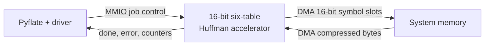

It shows the correct communication split without overwhelming the reader: MMIO
for control, DMA for bulk data.

## Figure B — non-compact system/software integration

Best detailed architecture figure for the hardware/software chapter:

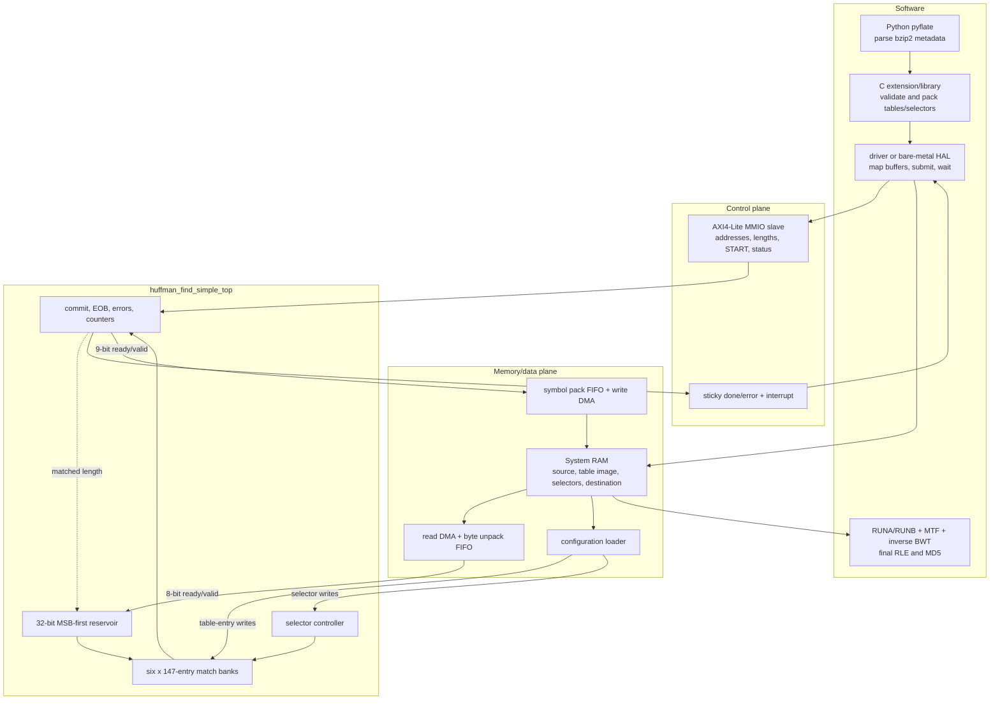

The MMIO/DMA blocks are proposed integration logic; the `CORE` subgraph is the
implemented bus-independent RTL.

## Figure C — compact accelerator interior

Best concise hardware-only diagram:

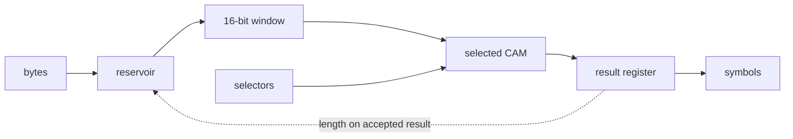

The dashed feedback explains why the complete top has a two-cycle initiation
interval even though the matcher output is registered.

## Figure D — non-compact accelerator interior with signal widths

Best detailed hardware-description figure:

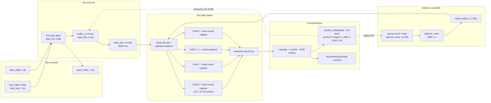

## Figure E — datapath versus control-path split

Useful when explaining those terms to a beginner:

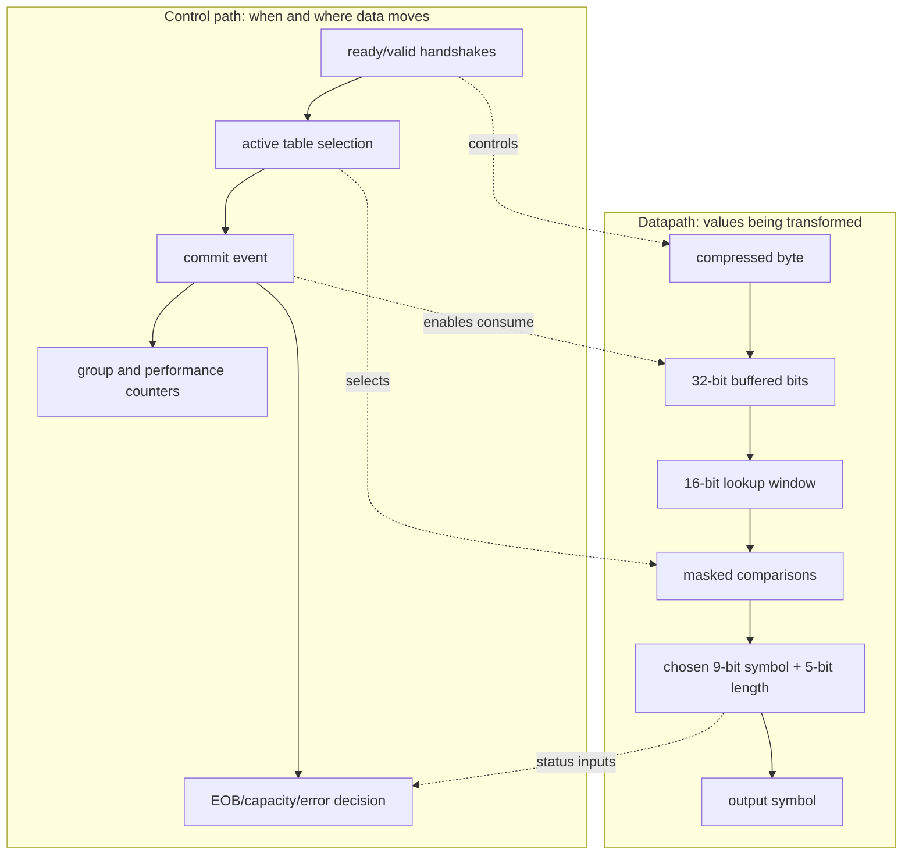

The datapath carries bytes, bits, codes, and symbols. The control path decides
when a value is valid, which bank acts, and whether state may advance.

## Figure F — one CAM entry and parallel reduction

Useful for explaining the central hardware operation:

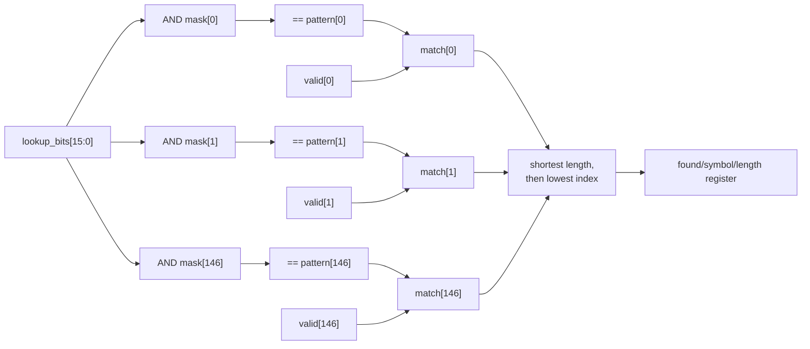

All entry branches represent parallel hardware. The priority reduction is
combinational and is likely the largest timing risk.

## Figure G — reservoir bit alignment example

Useful for clarifying MSB-first alignment:

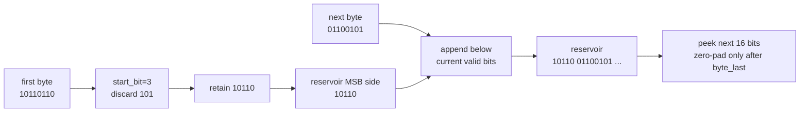

## Figure H — selector schedule

Useful for proving the table changes at the right boundary:

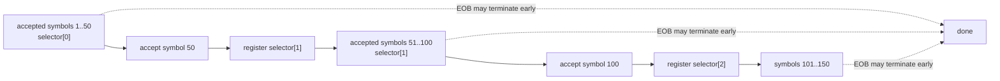

The transition is driven by accepted outputs, so output backpressure cannot
silently move the selector early.

## Figure I — ready/valid commit behavior

Useful for explaining protocol safety:

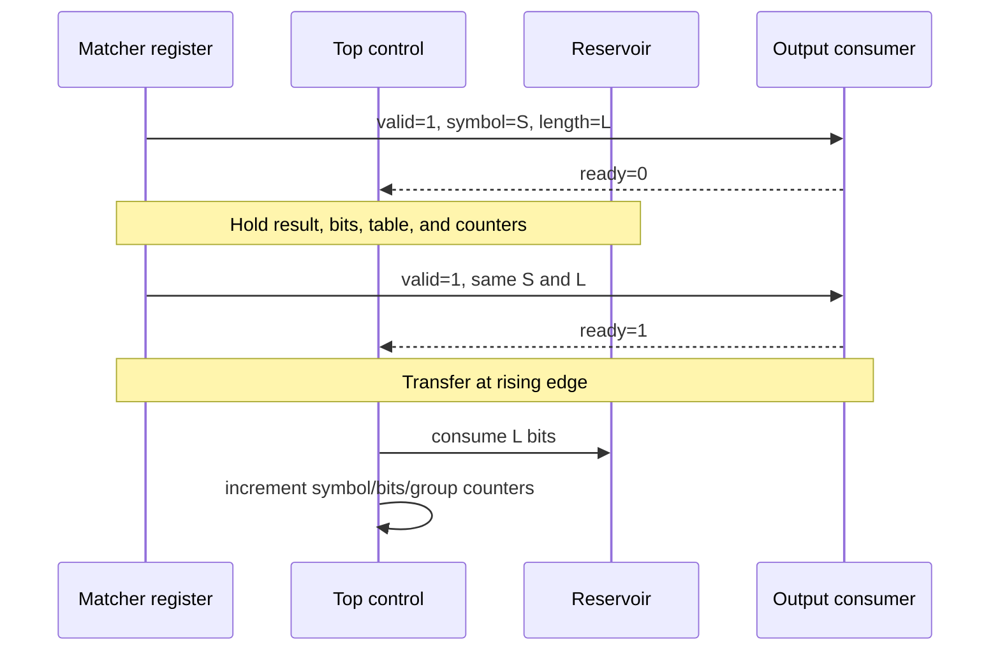

## Figure J — control-state view

Useful in a hardware-architecture section when a state diagram is expected:

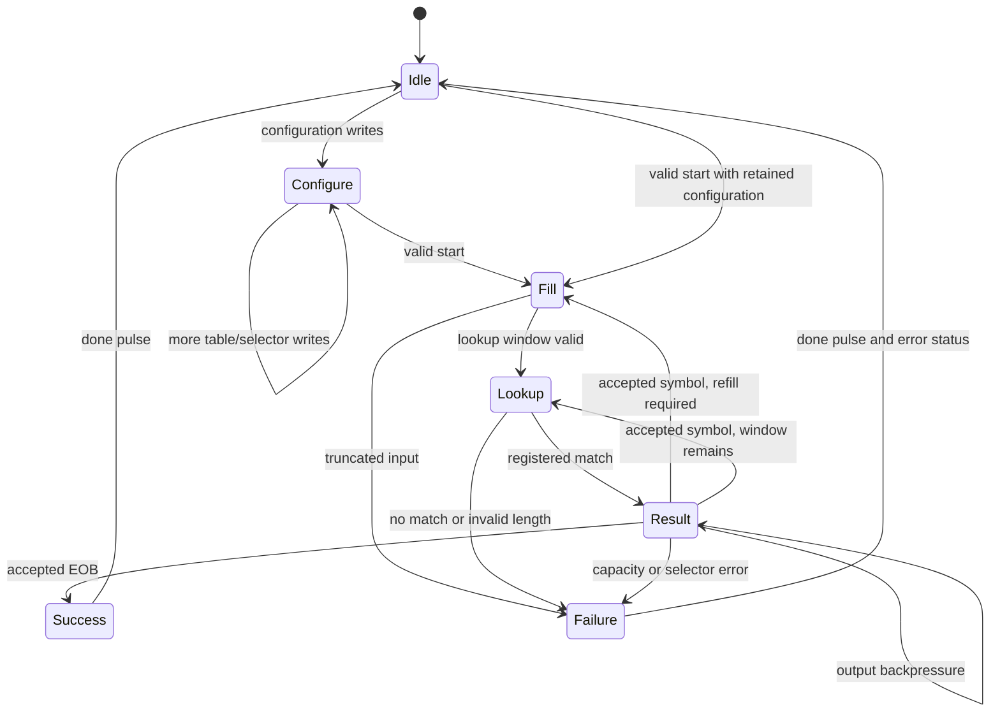

`Configure` is an externally interpreted phase while `busy=0`; the RTL uses
state flags rather than this exact enumerated FSM.

## Figure K — likely timing paths

Useful for the timing/tradeoff chapter:

```mermaid
flowchart TB
    subgraph P1["Normal match path: likely critical"]
        RQ["reservoir and active-table registers"] --> BM["bank decode/mux"] --> CMP["147 masked 16-bit comparisons"] --> PRI["16 x 147 priority predicates"] --> RR["result register"]
    end
    subgraph P2["Reservoir update path"]
        MR["match result register"] --> SUB["length/count subtract"] --> SHIFT["32-bit variable shift"] --> APP["optional count-dependent byte append"] --> BQR["reservoir register"]
    end
    subgraph P3["Boundary-only selector path"]
        SI["selector index register"] --> ADD["increment"] --> MEM["selector memory read"] --> RC["range check"] --> AT["active-table register"]
    end
```

The 5 ns constraint applies to every synchronous path, even if a path is used
only once per 50 symbols.

## Figure L — architecture tradeoff map

Useful as a concluding comparison:

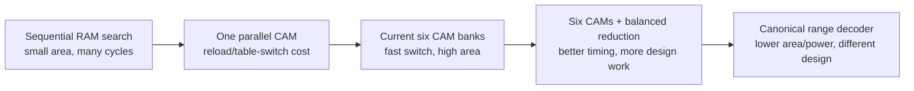

This is a qualitative continuum, not measured placement data.

## Recommended final-report selection

If the report must be compact, retain:

1. **Figure A** for overall hardware/software integration;
2. **Figure D** for the detailed internal block diagram; and
3. **Figure I or K** depending on whether the discussion emphasizes protocol
   correctness or timing closure.

If the audience is new to RTL, also retain Figures E, G, and H because they make
datapath/control, bit alignment, and selector scheduling concrete.
