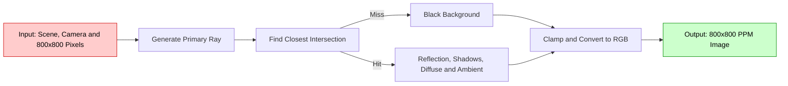
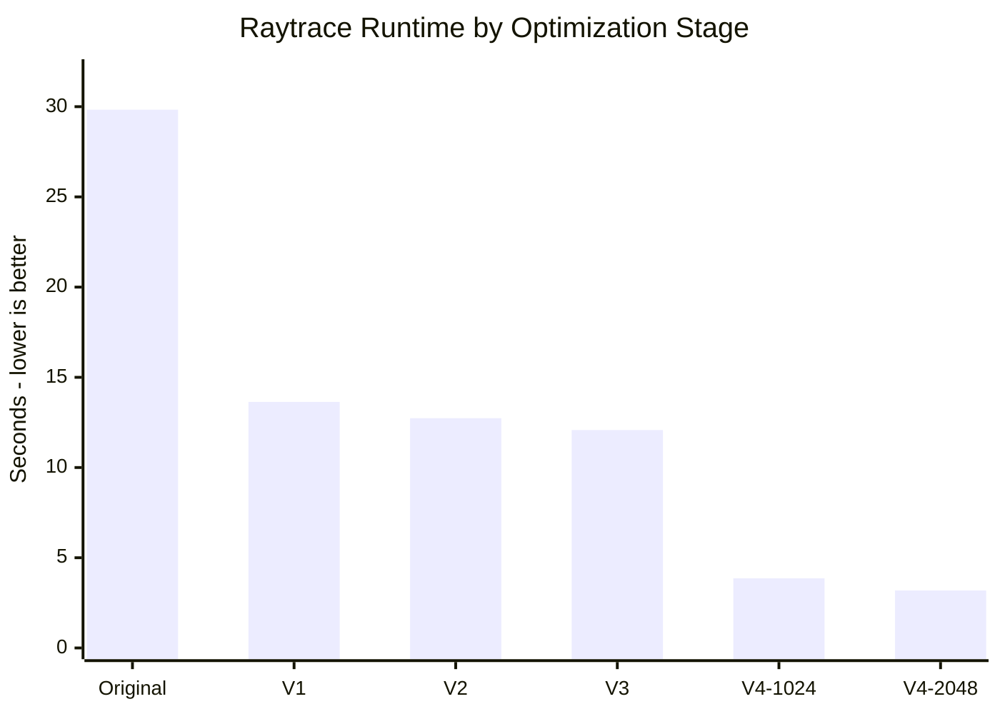

# שיפור benchmark ‏Raytracing באמצעות software-hardware co-design

## תקציר

המטרה הייתה להאיץ את benchmark ה־Raytracing של `pyperformance` בלי לשנות את התמונה המתקבלת. התהליך בוצע בארבעה צעדים מצטברים: תחילה צמצמנו עבודה חוזרת ו־allocations ב־Python, אחר כך כתבנו arithmetic ישירה ב־hot functions, לאחר מכן הוספנו `cache` לערכים קבועים, ולבסוף שינינו את יחידת העבודה מ־ray יחיד ל־batch של rays באמצעות NumPy.

ב־workload של `800×800`, זמן ה־benchmark ירד מ־**29.833 s** ב־Original ל־**3.184 s** ב־V4 עם `batch size=2048`. זו האצה של **9.37×** והפחתת זמן של **89.3%**. כל ששת קובצי ה־PPM זהים `byte-for-byte`, ולכן `MSE=0` ואין צורך ב־tolerance.

השיפור אינו חינם: ‏V4 משתמש ב־arrays נוספים וב־NumPy, ולכן `Peak RSS` גדל מכ־`36.27 MiB` לכ־`48.91 MiB`. ‏RSS הוא `Resident Set Size` — כמות ה־physical RAM שה־process מחזיק בפועל בזמן המדידה. כלומר, V4 מחליף מעט יותר memory בהרבה פחות זמן CPU.

| Version | Implementation | Main idea |
|---|---|---|
| Original | [`run_benchmark.py`](../suites/original/bm_raytrace/run_benchmark.py) | Scalar reference renderer |
| V1 | [`First Improvement`](<../suites/optimized/bm_raytrace/run_benchmark - First Improvemnt 2x speed.py>) | Remove repeated Python work and temporary objects |
| V2 | [`Second Improvement`](<../suites/optimized/bm_raytrace/run_benchmark - Second Improvent remove direct function calls and write the math.py>) | Inline arithmetic in four hot helpers |
| V3 | [`Third Improvement`](<../suites/optimized/bm_raytrace/run_benchmark - Third improvement - chacing the radious and camera values instead of repeated calcs.py>) | Cache sphere and camera invariants |
| V4 | [`run_benchmark.py`](../suites/optimized/bm_raytrace/run_benchmark.py) | NumPy batched renderer |

## שיטת המדידה

כל התוצאות בדוח משתמשות באותו workload של `800×800`, על CPU יחיד מאותו דגם: `Intel Xeon E5-2630 v3 @ 2.40 GHz`. פקודות המדידה העבירו את המידות במפורש לכל הגרסאות, ולכן ההשוואה אינה תלויה ב־default השונה בקובצי המקור.

- `timing.json` ו־`perf_stat.txt` נאספו עם CPython 3.12.13 רגיל. זמן ה־benchmark מתוך `timing.json` הוא המדד הראשי ל־speedup.
- `perf_report.txt`, ‏`speedscope.folded` וה־flamegraph נאספו בריצה נפרדת עם Python 3.12-dbg, כדי לקבל שמות כמו `py::Scene.rayColour`.
- Python 3.12-dbg מוסיף overhead גדול. לכן זמני הפונקציות בדוח הם **estimated inclusive CPU time in the debug profiling run**. אין להשוות אותם ישירות לזמן ה־benchmark הרגיל.
- ה־sampling השתמש ב־`cpu-clock` בתדירות `199 Hz`, ולא אבדו samples.
- לכל גרסה קיימת מדידה מתועדת אחת, ללא error bars. לכן המספרים מתארים היטב את הריצות שנשמרו, אך הבדלים קטנים אינם הוכחה ל־statistical significance.
- Hardware counters רבים עברו multiplexing והיו פעילים רק בכ־20%–30% מהזמן. `perf` ביצע scaling, ולכן נשתמש בהם לזיהוי מגמות גדולות ולא להסקת מסקנות דקות.
- Original נאסף ב־12 בספטמבר ו־V1–V4 ב־17 בספטמבר. ה־metadata מציג אותו CPU, ‏kernel ו־workload, אך הפרדת הימים מוסיפה uncertainty סביב הבדלים קטנים.
- לוגי ה־profiling כוללים warnings על kernel relocation ו־BPF symbols. הדבר מגביל attribution של kernel/BPF, אך user-space Python stacks נשארו זמינים ולא אבדו samples.

בקובץ [`OPTIMIZATIONS.md`](../suites/optimized/bm_raytrace/OPTIMIZATIONS.md) נשאר תיעוד ישן שלפיו `1024` הוא ברירת המחדל של V4. הקוד הסופי מגדיר `DEFAULT_BATCH_SIZE = 1024 * 2`, ולכן בדוח `2048` הוא ה־default. שתי מדידות V4 נשמרות בהשוואה כדי להראות את השפעת גודל ה־batch.

## 1. Overview

ה־benchmark בונה scene קבוע עם camera, שתי נקודות אור, שבעה `Sphere` ו־`Halfspace` אחד המשמש כרצפה. לכל pixel נוצר primary ray. ה־renderer מוצא את ה־intersection הקרוב ביותר, מחשב reflection רקורסיבי, בודק shadows, מוסיף diffuse ו־ambient lighting, ולבסוף כותב RGB אל `Canvas`.



### Libraries ומבני נתונים

המימוש המקורי משתמש ב־`array`, ב־`math` וב־`pyperf` (`2.10.0` בריצות שנשמרו), כחלק מ־`pyperformance`:

- `Canvas.bytes` הוא `array.array('B')` צפוף של ערכי RGB.
- `Vector` ו־`Point` מחזיקים שלושה מספרי Python.
- `Ray` מחזיק origin וכיוון מנורמל.
- `Scene.objects` הוא `list` של זוגות `(geometry, surface)`.
- צבע מיוצג כ־tuple מסוג `(r, g, b)`.

V4 מוסיף את NumPy (`2.5.3` בריצות שנשמרו). הוא אורז geometry, ‏materials ו־lights פעם אחת בכל render לתוך `float64 arrays`. קבוצת rays מיוצגת במבנה `(3, N)`, והבחירה בין rays פעילים מתבצעת בעזרת boolean masks ו־object-index arrays. מגבלות ה־threading נקבעות לפני import של NumPy, ולכן המדידה נשארת על CPU יחיד.

### איפה נמצא ה־software-hardware co-design

שלושת השלבים הראשונים מתאימים את ה־software לעלות האמיתית של CPython: פחות objects, פחות dispatch ופחות חישוב חוזר. V4 משנה גם את מבנה הנתונים ואת גרעיניות העבודה כך שיתאימו טוב יותר ל־compiled array kernels, ל־CPU cache וליחידות vector של המעבד. זהו co-design ברמת ה־algorithm וה־data layout: ה־software מציג batches רציפים, וה־hardware מריץ עבורם kernels מקומפלים.

המדידות מוכיחות שהמימוש השלם הואץ, אך אינן כוללות ספירה ישירה של SIMD instructions. לכן הדוח משתמש במונח `vectorized NumPy kernels` ואינו טוען שסט מסוים של SIMD instructions נמדד.


## 2. Initial analysis — Original

ה־flamegraph הוא `icicle graph`: רוחב box מייצג sampled CPU time, והעומק מייצג שרשרת קריאות. הניתוח מתמקד בפונקציות של ה־benchmark ולא ב־frames כלליים של CPython כגון `_PyEval_*`.

ב־[flamegraph המקורי](<../report raytracing/single Orignal/flamegraph.svg>) כמעט כל הפרופיל נמצא מתחת ל־`bench_raytrace` ול־`Scene.render`. הענף המרכזי הוא `Scene.rayColour`, ומתחתיו בולטים `SimpleSurface.colourAt`, בדיקות visibility ו־`Sphere.intersectionTime`. פונקציות קטנות כמו `Point.__sub__`, ‏`Vector.dot`, ‏`Vector.normalized` ו־`Vector.scale` מופיעות שוב ושוב ומעמיקות את ה־stack.

מתוך `24,085` samples של Original:

- `bench_raytrace` מופיע ב־`99.49%` מה־samples ו־`Scene.render` ב־`99.04%`.
- `Scene.rayColour` מופיע ב־`88.21%` ו־`SimpleSurface.colourAt` ב־`66.51%`.
- `Scene.visibleLights` ו־`Scene._lightIsVisible` תופסות כ־`46%` כל אחת.
- `Sphere.intersectionTime` מופיעה ב־`40.38%`.
- עומק ה־application stack הוא `7.55` בממוצע, `11` ב־p95 ועד `17` לכל היותר. recursion של `rayColour` מגיע לארבע שכבות.

המסקנה הייתה שה־bottleneck אינו נוסחה יחידה. העלות נוצרת ממיליוני חזרות על allocations, ‏normalization, ‏operator dispatch, method calls וסריקת lists בתוך הלולאות הפנימיות. לכן התחלנו בשינויים קטנים ששומרים על אותו algorithm, ורק לאחר מיצוי ה־scalar path עברנו ל־batching.

## 3. Optimizations


כל שלב נבנה על קודמו. לכן V3 כולל גם את V1 ו־V2, ו־V4 כולל את כל השינויים יחד.

### 3.1 V1 — הסרת עבודה חוזרת ב־scalar Python

ה־profile המקורי הראה שהעלות מפוזרת על פעולות Python קטנות שחוזרות עבור כל ray ועבור כל object. לכן V1 לא החליף algorithm; הוא ביצע פחות allocations, פחות method calls ופחות traversals עבור אותה תוצאה.

| Change | Before | After |
|---|---|---|
| Compact object layout | `class Vector(object):`<br><br>&nbsp;&nbsp;`def __init__(self, initx, inity, initz):`<br>&nbsp;&nbsp;&nbsp;&nbsp;`self.x = initx`<br>&nbsp;&nbsp;&nbsp;&nbsp;`self.y = inity`<br>&nbsp;&nbsp;&nbsp;&nbsp;`self.z = initz` | `class Vector(object):`<br><br>&nbsp;&nbsp;`__slots__ = ('x', 'y', 'z')`<br><br>&nbsp;&nbsp;`def __init__(self, initx, inity, initz):`<br>&nbsp;&nbsp;&nbsp;&nbsp;`self.x = initx`<br>&nbsp;&nbsp;&nbsp;&nbsp;`self.y = inity`<br>&nbsp;&nbsp;&nbsp;&nbsp;`self.z = initz` |
| Scalar sphere intersection | `cp = self.centre - ray.point`<br>`v = cp.dot(ray.vector)`<br>`discriminant = (self.radius * self.radius) - (cp.dot(cp) - v * v)` | `centre = self.centre`<br>`point = ray.point`<br>`direction = ray.vector`<br>`cpx = centre.x - point.x`<br>`cpy = centre.y - point.y`<br>`cpz = centre.z - point.z`<br>`v = (cpx * direction.x) + (cpy * direction.y) + (cpz * direction.z)`<br>`cpSquared = (cpx * cpx) + (cpy * cpy) + (cpz * cpz)`<br>`discriminant = (self.radius * self.radius) - (cpSquared - v * v)` |
| Cache camera components | `for y in range(canvas.height):`<br>&nbsp;&nbsp;`for x in range(canvas.width):`<br>&nbsp;&nbsp;&nbsp;&nbsp;`xcomp = vpRight.scale(x * pixelWidth - halfWidth)`<br>&nbsp;&nbsp;&nbsp;&nbsp;`ycomp = vpUp.scale(y * pixelHeight - halfHeight)` | `xcomponents = [vpRight.scale(x * pixelWidth - halfWidth)`<br>&nbsp;&nbsp;`for x in range(canvas.width)]`<br>`for y in range(canvas.height):`<br>&nbsp;&nbsp;`ycomp = vpUp.scale(y * pixelHeight - halfHeight)`<br>&nbsp;&nbsp;`for x, xcomp in enumerate(xcomponents):` |
| Select the closest hit during traversal | `intersections = [(o, o.intersectionTime(ray), s)`<br>&nbsp;&nbsp;`for (o, s) in self.objects]`<br>`i = firstIntersection(intersections)` | `closestTime = None`<br>`for o, s in self.objects:`<br>&nbsp;&nbsp;`t = o.intersectionTime(ray)`<br>&nbsp;&nbsp;`if t is not None and t > -EPSILON:`<br>&nbsp;&nbsp;&nbsp;&nbsp;`if closestTime is None or t < closestTime:`<br>&nbsp;&nbsp;&nbsp;&nbsp;&nbsp;&nbsp;`closestObject = o`<br>&nbsp;&nbsp;&nbsp;&nbsp;&nbsp;&nbsp;`closestTime = t`<br>&nbsp;&nbsp;&nbsp;&nbsp;&nbsp;&nbsp;`closestSurface = s` |
| Reuse one normalized shadow ray | `t = o.intersectionTime(Ray(p, l - p))`<br><br>`for lightPoint in scene.visibleLights(p):`<br>&nbsp;&nbsp;`contribution = (lightPoint - p).normalized().dot(normal)` | `ray = Ray(p, light - p)`<br>`if self._lightRayIsVisible(ray):`<br>&nbsp;&nbsp;`yield ray.vector`<br><br>`for lightDirection in scene._visibleLightDirections(p):`<br>&nbsp;&nbsp;`contribution = lightDirection.dot(normal)` |
| Remove a discarded checker result | `v = p - Point.ZERO`<br>`v.scale(1.0 / self.checkSize)` | `v = p - Point.ZERO` |

אותו שינוי `__slots__` בוצע גם ב־`Point` עם `('x', 'y', 'z')` וב־`Ray` עם `('point', 'vector')`. הוא מסיר את ה־instance dictionary, אך הקואורדינטות עדיין Python numbers. בחירת ה־hit בזמן traversal מבטלת list של tuples זמניים. ה־shadow ray נבנה ומנורמל פעם אחת לכל light ומשמש גם לבדיקת visibility וגם ל־Lambert contribution. פעולת ה־checker הוסרה משום שהקוד המקורי זרק את ה־Vector שהיא החזירה, ולכן גם לפני השינוי היא לא השפיעה על התמונה.

התוצאה הייתה הקפיצה הגדולה ביותר בין שלבי ה־scalar: זמן ה־benchmark ירד מ־`29.833 s` ל־`13.637 s`, כלומר `2.19×`. ב־[flamegraph של V1](<../report raytracing/single v1/flamegraph.svg>) רוחב `Scene.rayColour` יורד מ־`88.21%` ל־`73.84%`, ‏`Sphere.intersectionTime` יורד מכ־`40.38%` לכ־`30.9%`, ועומק ה־application stack הממוצע יורד מ־`7.55` ל־`6.29`.

### 3.2 V2 — arithmetic ישירה בארבע hot functions

אחרי V1, ה־flamegraph עדיין הציג שכבות רבות של helpers קצרים. V2 החליף ארבע שרשראות של method calls בחישוב ישיר. סדר פעולות ה־`float64` נשמר בכוונה כדי לא לשנות rounding.

| Function | Before | After |
|---|---|---|
| `Vector.normalized` | `return self.scale(1.0 / self.magnitude())` | `x = self.x`<br>`y = self.y`<br>`z = self.z`<br>`factor = 1.0 / math.sqrt((x * x) + (y * y) + (z * z))`<br>`return Vector(factor * x, factor * y, factor * z)` |
| `Vector.reflectThrough` | `d = normal.scale(self.dot(normal))`<br>`return self - d.scale(2)` | `projection = self.dot(normal)`<br>`return Vector(self.x - 2 * (projection * normal.x),`<br>&nbsp;&nbsp;`self.y - 2 * (projection * normal.y),`<br>&nbsp;&nbsp;`self.z - 2 * (projection * normal.z))` |
| `Ray.pointAtTime` | `return self.point + self.vector.scale(t)` | `point = self.point`<br>`vector = self.vector`<br>`return Point(point.x + t * vector.x,`<br>&nbsp;&nbsp;`point.y + t * vector.y,`<br>&nbsp;&nbsp;`point.z + t * vector.z)` |
| `Sphere.normalAt` | `return (p - self.centre).normalized()` | `centre = self.centre`<br>`x = p.x - centre.x`<br>`y = p.y - centre.y`<br>`z = p.z - centre.z`<br>`factor = 1.0 / math.sqrt((x * x) + (y * y) + (z * z))`<br>`return Vector(factor * x, factor * y, factor * z)` |

השינוי אינו מסיר כל call: ‏`reflectThrough` עדיין משתמשת ב־`dot`. הוא כן מבטל temporary vectors ו־dispatch מיותרים בדיוק במקומות שנמצאו ב־profile.

זמן ה־benchmark ירד מ־`13.637 s` ל־`12.734 s`, שיפור נוסף של כ־`1.07×`. ב־[flamegraph של V2](<../report raytracing/single v2/flamegraph.svg>) רוחב `Vector.normalized` יורד מ־`10.10%` ל־`5.49%`, ‏`Ray.__init__` מ־`11.16%` ל־`6.91%`, ו־`Vector.reflectThrough` מ־`4.12%` ל־`1.97%`. ‏`Vector.scale` כמעט נעלמת, בדיוק בהתאם לשינוי בקוד.

### 3.3 V3 — `cache` של invariants

V3 חיפש ערכים שחושבו שוב ושוב למרות שאינם משתנים לאורך ה־render: ריבוע ה־radius של כל sphere, והחיבור הראשון בכיוון ה־camera עבור כל column.

| Change | Before | After |
|---|---|---|
| Compute radius² once during scene construction | `self.centre = centre`<br>`self.radius = radius`<br><br>`discriminant = (self.radius * self.radius) - (cpSquared - v * v)` | `self.centre = centre`<br>`self.radius = radius`<br>`self.radiusSquared = radius * radius`<br><br>`discriminant = self.radiusSquared - (cpSquared - v * v)` |
| Cache eye direction plus horizontal offset once per column | `xcomponents = [vpRight.scale(x * pixelWidth - halfWidth)`<br>&nbsp;&nbsp;`for x in range(canvas.width)]`<br>`for y in range(canvas.height):`<br>&nbsp;&nbsp;`ycomp = vpUp.scale(y * pixelHeight - halfHeight)`<br>&nbsp;&nbsp;`for x, xcomp in enumerate(xcomponents):`<br>&nbsp;&nbsp;&nbsp;&nbsp;`ray = Ray(eye.point, eye.vector + xcomp + ycomp)` | `columnDirections = [eye.vector + vpRight.scale(x * pixelWidth - halfWidth)`<br>&nbsp;&nbsp;`for x in range(canvas.width)]`<br>`for y in range(canvas.height):`<br>&nbsp;&nbsp;`ycomp = vpUp.scale(y * pixelHeight - halfHeight)`<br>&nbsp;&nbsp;`for x, columnDirection in enumerate(columnDirections):`<br>&nbsp;&nbsp;&nbsp;&nbsp;`ray = Ray(eye.point, columnDirection + ycomp)` |

ב־`800×800`, החיבור `eye.vector + horizontalOffset` יורד מ־`640,000` ביצועים ל־`800`: נחסכים `639,200` temporary vectors ו־`1,917,600` חיבורי coordinate. ה־radius cache תקף ל־scene הסטטי של ה־benchmark; שינוי ישיר של `sphere.radius` לאחר construction היה מחייב לעדכן גם את `radiusSquared`.

זמן ה־benchmark ירד מ־`12.734 s` ל־`12.076 s`, שיפור נוסף של כ־`1.05×`. צורת [flamegraph של V3](<../report raytracing/single v3/flamegraph.svg>) דומה מאוד ל־V2, כפי שמצופה משינוי שמוזיל scalar operations בלי לשנות control flow. ‏`Vector.__add__` מצטמצמת, אך ההבדלים הקטנים בשאר הענפים קרובים לרעש של profile יחיד.

### 3.4 V4 — מעבר מ־ray יחיד ל־NumPy batch

V1–V3 שיפרו את אותו scalar renderer. ב־V4 בוצע השינוי הארכיטקטוני הגדול: במקום לפרש את אותה לולאה ב־Python עבור כל ray, ‏`BatchedRenderer` מפעיל את אותן משוואות על עד `2048` rays יחד בתוך compiled NumPy kernels.

| Area | Before — V3 | After — V4 |
|---|---|---|
| Render dispatch | `def render(self, canvas):`<br>&nbsp;&nbsp;`columnDirections = [eye.vector + vpRight.scale(x * pixelWidth - halfWidth)`<br>&nbsp;&nbsp;&nbsp;&nbsp;`for x in range(canvas.width)]`<br>&nbsp;&nbsp;`for y in range(canvas.height):`<br>&nbsp;&nbsp;&nbsp;&nbsp;`ycomp = vpUp.scale(y * pixelHeight - halfHeight)`<br>&nbsp;&nbsp;&nbsp;&nbsp;`for x, columnDirection in enumerate(columnDirections):`<br>&nbsp;&nbsp;&nbsp;&nbsp;&nbsp;&nbsp;`ray = Ray(eye.point, columnDirection + ycomp)`<br>&nbsp;&nbsp;&nbsp;&nbsp;&nbsp;&nbsp;`colour = self.rayColour(ray)` | `def render(self, canvas, batch_size=DEFAULT_BATCH_SIZE):`<br>&nbsp;&nbsp;`BatchedRenderer(self).render(canvas, batch_size)` |
| Primary-ray generation | `ray = Ray(eye.point, columnDirection + ycomp)`<br>`colour = self.rayColour(ray)`<br>`canvas.plot(x, y, *colour)` | `for start in range(0, width * height, batch_size):`<br>&nbsp;&nbsp;`pixels = np.arange(start, min(start + batch_size, width * height))`<br>&nbsp;&nbsp;`x = pixels % width`<br>&nbsp;&nbsp;`y = pixels // width`<br>&nbsp;&nbsp;`directions = self.normalized(columns[:, x] + rows[:, y])`<br>&nbsp;&nbsp;`yield x, y, np.broadcast_to(origin, directions.shape), directions` |
| Closest-hit selection | `closestTime = None`<br>`for o, s in self.objects:`<br>&nbsp;&nbsp;`t = o.intersectionTime(ray)`<br>&nbsp;&nbsp;`if t is not None and t > -EPSILON:`<br>&nbsp;&nbsp;&nbsp;&nbsp;`if closestTime is None or t < closestTime:`<br>&nbsp;&nbsp;&nbsp;&nbsp;&nbsp;&nbsp;`closestTime = t` | `closest = np.full(directions.shape[1], -1, dtype=np.intp)`<br>`times = np.zeros(directions.shape[1])`<br>`for index in range(len(self.geometry)):`<br>&nbsp;&nbsp;`candidate = self.intersectionTimes(index, origins, directions)`<br>&nbsp;&nbsp;`selected = ((candidate > -EPSILON)`<br>&nbsp;&nbsp;&nbsp;&nbsp;`& ((closest < 0) &#124; (candidate < times)))`<br>&nbsp;&nbsp;`closest[selected] = index`<br>&nbsp;&nbsp;`times[selected] = candidate[selected]` |
| Recursive reflection | `reflectedRay = Ray(p, ray.vector.reflectThrough(normal))`<br>`reflectedColour = scene.rayColour(reflectedRay)`<br>`c = addColours(c, self.specularCoefficient, reflectedColour)` | `selected = specular > 0`<br>`if np.any(selected):`<br>&nbsp;&nbsp;`d = directions[:, selected]`<br>&nbsp;&nbsp;`n = normals[:, selected]`<br>&nbsp;&nbsp;`projection = self.dot(d, n)`<br>&nbsp;&nbsp;`reflected = self.normalized(d - 2 * (projection * n))`<br>&nbsp;&nbsp;`reflectedColour = self.rayColours(points[:, selected], reflected, depth + 1)` |

בתחילת כל render, ובתוך האזור הנמדד, `BatchedRenderer` אורז את ה־geometry, ה־materials וה־lights ל־arrays. כיווני rays נשמרים במבנה `(3, N)`. ‏boolean masks משמשים ל־closest hits, ל־shadows ולבחירת rays שדורשים reflection. ה־recursion depth, סדר ה־objects, השוואות strict ו־`float64` נשמרים.


NumPy היא dependency חדשה, אך ה־numeric libraries מוגבלות ל־thread יחיד לפני ה־import. אין שימוש ב־BLAS או ב־`np.dot`; ה־dot products כתובים כפעולות elementwise בסדר שמחקה את ה־binary64 המקורי. ‏`Canvas.plot` והמרת RGB נשארו scalar כדי לשמור על הממשק ועל ה־output.

ה־batch size קובע כמה rays חולקים את overhead של NumPy. במדידות השרת, `1024` סיים ב־`3.862 s`, ואילו ברירת המחדל `2048` סיימה ב־`3.184 s` — עוד `17.57%` פחות זמן. לכן batching אינו רק החלפת syntax; ה־granularity חייבת להיות גדולה מספיק כדי להצדיק יצירת arrays, ‏indexing ו־masks.

ב־[flamegraph של V4-1024](<../report raytracing/single v4 1024/flamegraph.svg>) וב־[V4-2048](<../report raytracing/single v4 2048/flamegraph.svg>) ענפי ה־scalar של `Scene.rayColour` נעלמים מהנתיב הרגיל ומוחלפים ב־`BatchedRenderer` וב־NumPy native stacks. ‏`BatchedRenderer.rayColours` יורדת מכ־`422 ms` ב־1024 לכ־`226 ms` ב־2048 בריצת ה־profiling, אך `Canvas.plot` נשארת כמעט קבועה סביב `4.05 s`. לכן ה־output path הופך ל־bottleneck הבא.

יש כאן מגבלת attribution חשובה: ב־V4, ‏frame-pointer unwinding אינו תמיד מחבר native NumPy frame להורה שלו ב־Python. לכן ה־visible `bench_raytrace` subtree צר יותר, אך אין לפרש את כל השטח האחר כעבודה מחוץ ל־benchmark. המסקנה הבטוחה היא ששרשראות Python עמוקות הוחלפו בעבודה native רדודה יותר; עומק ה־application stack הממוצע יורד מ־`7.55` ב־Original ל־`4.93` ב־V4-2048.

## 4. Performance comparison

### 4.1 זמן ה־benchmark ו־memory

הזמן הבא מגיע מ־`timing.json` שנאסף עם CPython 3.12 הרגיל. זהו המדד הראשי להשוואת ה־workload עצמו.

| Version | Benchmark time (s) ↓ | Speedup vs previous optimization stage ↑ | Speedup vs Original ↑ | Time reduction vs Original ↑ | Peak RSS (MiB) ↓ |
|---|---:|---:|---:|---:|---:|
| Original | 29.833 | — | 1.00× | 0.00% | **36.27** |
| V1 | 13.637 | 2.19× | 2.19× | 54.29% | 36.39 |
| V2 | 12.734 | 1.07× | 2.34× | 57.31% | 36.43 |
| V3 | 12.076 | 1.05× | 2.47× | 59.52% | 36.48 |
| V4-1024 | 3.862 | 3.13× vs V3 | 7.72× | 87.05% | 48.97 |
| V4-2048 | **3.184** | **3.79× vs V3** | **9.37×** | **89.33%** | 48.91 |

```text
Speedup = Original time / Version time
Time reduction = (1 - Version time / Original time) * 100%
```



V1 חותך יותר ממחצית מזמן Original בלי dependency חדשה. V2 ו־V3 מוסיפים רווחים קטנים יותר, אך יחד הם מורידים את ה־scalar renderer ל־`12.076 s`. ‏V4-2048 משיג את השינוי הגדול הבא ומגיע ל־`9.37×` מול Original. מחיר ה־batch arrays הוא עלייה של `34.84%` ב־Peak RSS. ‏`Peak RSS` הוא שיא ה־physical RAM שה־process החזיק, ולא גודל ה־virtual address space.

### 4.2 נתוני `perf_stat.txt`

הטבלה הבאה כוללת את כל ה־counter values ואת זמני הסיכום שנשמרו ב־`perf_stat.txt`. הסימונים הם עשרוניים: `K=10³`, ‏`M=10⁶`, ‏`B=10⁹`. החץ מסמן את הכיוון הרצוי עבור אותו output מאומת. עבור event counts, ערך נמוך פירושו פחות עבודה שנמדדה; הוא אינו מבטיח לבדו efficiency טובה יותר.

| Metric | Original | V1 | V2 | V3 | V4-1024 | V4-2048 |
|---|---:|---:|---:|---:|---:|---:|
| CPU clock (↓) | 30.923 s | 14.252 s | 13.105 s | 12.727 s | 4.293 s | **3.613 s** |
| Task clock (↓) | 30.923 s | 14.252 s | 13.105 s | 12.727 s | 4.293 s | **3.613 s** |
| CPU cycles (↓) | 71.648B | 33.030B | 30.326B | 29.442B | 9.715B | **8.150B** |
| Instructions (↓) | 186.717B | 82.982B | 77.799B | 74.432B | 21.010B | **18.345B** |
| Branch instructions (↓) | 30.397B | 13.709B | 12.949B | 12.386B | 3.579B | **3.140B** |
| Branch misses (↓) | 173.482M | 79.909M | 68.097M | 66.875M | 24.252M | **18.213M** |
| Bus cycles (↓) | 2.503B | 1.152B | 1.059B | 1.029B | 340.595M | **287.487M** |
| Cache references (↓) | 45.849M | 41.044M | **25.308M** | 35.212M | 97.973M | 78.677M |
| Cache misses (↓) | 189.899K | 176.025K | **170.997K** | 184.646K | 681.762K | 671.849K |
| Reference cycles (↓) | 72.173B | 33.235B | 30.559B | 29.652B | 9.871B | **8.281B** |
| Page faults (↓) | **11.915K** | 11.950K | 11.986K | 11.984K | 16.244K | 16.466K |
| Minor faults (↓) | **11.915K** | 11.950K | 11.986K | 11.984K | 16.244K | 16.466K |
| Major faults (↓) | **0** | **0** | **0** | **0** | **0** | **0** |
| Context switches (↓) | 394 | 387 | 174 | 394 | 155 | **147** |
| CPU migrations (↓) | **0** | **0** | **0** | **0** | **0** | **0** |
| Alignment faults (↓) | **0** | **0** | **0** | **0** | **0** | **0** |
| Emulation faults (↓) | **0** | **0** | **0** | **0** | **0** | **0** |
| Cgroup switches (↓) | 365 | 358 | 145 | 365 | 121 | **116** |
| L1 D-cache loads (↓) | 42.988B | 19.108B | 18.230B | 17.154B | 4.304B | **3.799B** |
| L1 D-cache load misses (↓) | 585.915M | 410.781M | 326.121M | 376.699M | 213.002M | **201.150M** |
| L1 D-cache stores (↓) | 10.205B | 4.566B | 4.202B | 4.046B | 1.109B | **930.510M** |
| L1 I-cache load misses (↓) | 20.265M | 14.804M | 11.181M | 12.254M | 15.138M | **10.656M** |
| dTLB loads (↓) | 47.567B | 21.241B | 20.077B | 19.170B | 4.706B | **4.088B** |
| dTLB load misses (↓) | 6.928M | 3.334M | 2.930M | 2.787M | 1.740M | **1.445M** |
| dTLB stores (↓) | 25.773B | 11.211B | 10.427B | 9.934B | 2.583B | **2.266B** |
| dTLB store misses (↓) | 1.511M | 667.659K | 523.075K | 516.062K | **312.235K** | 325.234K |
| iTLB loads (↓) | 5.804M | 4.101M | **2.530M** | 3.510M | 7.253M | 4.329M |
| iTLB load misses (↓) | 4.508M | 1.933M | 1.509M | 1.680M | 1.722M | **1.357M** |
| Branch loads (↓) | 36.243B | 16.319B | 15.395B | 14.733B | 4.299B | **3.718B** |
| Branch load misses (↓) | 149.389M | 68.736M | 59.196M | 58.222M | 18.787M | **14.404M** |
| Duration time (↓) | 30.996 s | 14.341 s | 13.125 s | 12.822 s | 4.321 s | **3.642 s** |
| Elapsed time (↓) | 30.996 s | 14.341 s | 13.125 s | 12.822 s | 4.321 s | **3.642 s** |
| User time (↓) | 30.849 s | 14.225 s | 13.066 s | 12.689 s | 4.245 s | **3.546 s** |
| System time (↓) | 90.207 ms | **42.895 ms** | 49.798 ms | 55.272 ms | 59.997 ms | 78.398 ms |

ה־derived ratios המרכזיים מאותו קובץ מסבירים כיצד העבודה השתנתה:

| Metric | Original | V1 | V2 | V3 | V4-1024 | V4-2048 |
|---|---:|---:|---:|---:|---:|---:|
| CPU utilization (↑) | **0.998** | 0.994 | **0.998** | 0.993 | 0.994 | 0.992 |
| IPC (↑) | **2.61** | 2.51 | 2.57 | 2.53 | 2.16 | 2.25 |
| Branch miss rate (↓) | 0.57% | 0.58% | **0.53%** | 0.54% | 0.68% | 0.58% |
| Cache miss rate (↓) | **0.414%** | 0.429% | 0.676% | 0.524% | 0.696% | 0.854% |
| L1 D-cache load miss rate (↓) | **1.36%** | 2.15% | 1.79% | 2.20% | 4.95% | 5.29% |
| iTLB load miss rate (↓) | 77.67% | 47.14% | 59.65% | 47.85% | **23.75%** | 31.34% |

Original עד V4-2048 מציגים ירידה של `90.2%` ב־instructions, ‏`88.6%` ב־cycles, ‏`89.7%` ב־branch instructions ו־`91.2%` ב־L1 data loads. ה־IPC דווקא יורד מ־`2.61` ל־`2.25`; כלומר ההאצה מגיעה בעיקר מכך שפחות עבודת Python מבוצעת, לא מכך שכל instruction נעשה מהיר יותר.

V4 מגדיל cache references, ‏cache misses ו־page faults בגלל NumPy וה־arrays, אך מקצר מאוד את הזמן הכולל. ההשוואה בין `1024` ל־`2048` מחזקת את סיפור ה־batch overhead: ב־2048 מספר ה־instructions נמוך ב־`12.7%` ומספר ה־cycles נמוך ב־`16.1%`.

ה־hardware events עברו multiplexing משמעותי. לכן המגמות הגדולות עקביות ושימושיות, אך אין לייחס משמעות חזקה להבדל קטן בין שני cache או TLB counts.

אירועי stalled cycles, ‏LLC ומספר אירועי cache נוספים לא היו זמינים ב־VM ולכן אין להם ערכים בטבלה. `cache-references` ו־`cache-misses` הם generic hardware aliases שמשמעותם המדויקת תלויה בארכיטקטורה.

### 4.3 נתוני `perf_report.txt`

`perf report` מציג גם `Children` וגם `Self`, אך לשני המדדים יש משמעות שונה:

| Term | Meaning | Use in this report |
|---|---|---|
| Total sampled CPU time | All sampled `cpu-clock` time, including benchmark work, startup, imports and runtime | Denominator for each profiling run |
| Inclusive time (`Children`) | Time while the function is anywhere in the stack, including callees | Main function comparison |
| Exclusive time (`Self`) | Samples attributed directly to the symbol, excluding callees | Not used for Python pseudo-frames because it is usually zero or misleading |

Samples של `py::...` נוחתים בדרך כלל ב־CPython או ב־native code שמתחת ל־pseudo-frame, ולכן עמודת `Samples` של שורת Python אינה מתארת את הזמן הכולל שלה. זמן inclusive מחושב מתוך `Children`:

$$
t_{inclusive}(f) \approx
\frac{Children(f)}{100}
\times
\frac{EventCount}{10^9}\;seconds
$$

מכיוון שתדירות הדגימה היא `199 Hz`, ניתן לחשב גם כך:

```text
Time per sample = 1 / 199 s = 5.025125 ms
Inclusive time(f) = samples whose stack contains f / 199
```

השורות הן inclusive וחופפות: sample בתוך `Sphere.intersectionTime` נספר גם בתוך `Scene.rayColour` וגם בתוך `Scene.render`. לכן אסור לחבר את זמני השורות. כל הערכים הבאים הם estimated CPU time בריצת Python 3.12-dbg, ולא זמן ה־benchmark הרגיל.

| Scope / function — inclusive CPU time | Original | V1 | V2 | V3 | V4-1024 | V4-2048 |
|---|---:|---:|---:|---:|---:|---:|
| Total sampled `cpu-clock` (↓) | 121.03 s | 45.89 s | 40.85 s | 39.90 s | 10.11 s | **8.90 s** |
| `bench_raytrace` (↓) | 120.41 s | 45.24 s | 40.24 s | 39.30 s | 6.08 s | **5.79 s** |
| `Scene.render` (↓) | 119.87 s | 44.67 s | 39.68 s | 38.75 s | 5.52 s | **5.24 s** |
| Setup inside `bench_raytrace` (↓) | **545 ms** | 574 ms | 564 ms | 555 ms | 553 ms | 557 ms |
| Not attributed under `bench_raytrace` (diagnostic) | 617 ms | 652 ms | 609 ms | 603 ms | 4.04 s | 3.11 s |
| `Scene.rayColour` (↓) | 106.76 s | 33.89 s | 30.15 s | **30.03 s** | — | — |
| `SimpleSurface.colourAt` (↓) | 80.50 s | 23.55 s | **20.58 s** | 20.71 s | — | — |
| `Scene.visibleLights` → `_visibleLightDirections` (↓) | 56.04 s | 11.87 s | **10.81 s** | 10.92 s | — | — |
| `Scene._lightIsVisible` → `_lightRayIsVisible` (↓) | 55.58 s | 7.36 s | 7.49 s | **7.33 s** | — | — |
| `Sphere.intersectionTime` (↓) | 48.87 s | 14.20 s | 14.02 s | **13.74 s** | — | — |
| `Halfspace.intersectionTime` (↓) | 2.14 s | 1.94 s | 1.84 s | **1.80 s** | — | — |
| `Ray.__init__` (↓) | 19.16 s | 5.12 s | **2.82 s** | 3.13 s | — | — |
| `Vector.normalized` (↓) | 18.84 s | 4.64 s | **2.24 s** | 2.35 s | — | — |
| `Vector.magnitude` (↓) | 7.29 s | **1.83 s** | — | — | — | — |
| `Vector.scale` (↓) | 9.74 s | 2.63 s | **5 ms** | **5 ms** | — | — |
| `Vector.dot` (↓) | 20.60 s | 2.63 s | 1.65 s | **1.32 s** | — | — |
| `Vector.reflectThrough` (↓) | 2.01 s | 1.89 s | 805 ms | **674 ms** | — | — |
| `Ray.pointAtTime` (↓) | 1.15 s | 1.15 s | **466 ms** | 471 ms | — | — |
| `Sphere.normalAt` (↓) | 593 ms | 491 ms | **127 ms** | 208 ms | — | — |
| `Vector.__add__` (↓) | 1.59 s | 1.46 s | 1.63 s | **900 ms** | — | — |
| `Point.__sub__` (↓) | 25.84 s | 1.49 s | 1.41 s | **1.37 s** | — | — |
| `firstIntersection` (↓) | 1.15 s | — | — | — | — | — |
| `CheckerboardSurface.baseColourAt` (↓) | 1.30 s | **759 ms** | 1.03 s | 864 ms | — | — |
| `Canvas.plot` (↓) | 4.39 s | 4.22 s | 4.12 s | 4.05 s | 4.05 s | **4.04 s** |
| `Canvas.__init__` (↓) | **553 ms** | 573 ms | 558 ms | **553 ms** | **553 ms** | 558 ms |
| `BatchedRenderer.render` (↓) | — | — | — | — | 5.52 s | **5.24 s** |
| `BatchedRenderer.rayColours` (↓) | — | — | — | — | 422 ms | **226 ms** |
| `BatchedRenderer.intersectionTimes` (↓) | — | — | — | — | 221 ms | **116 ms** |
| `BatchedRenderer.lightIsVisible` (↓) | — | — | — | — | 171 ms | **106 ms** |
| `BatchedRenderer.closestHits` (↓) | — | — | — | — | 146 ms | **65 ms** |
| `BatchedRenderer.dot` (↓) | — | — | — | — | 91 ms | **40 ms** |
| `BatchedRenderer.normalized` (↓) | — | — | — | — | 40 ms | **35 ms** |
| `BatchedRenderer.normalsAt` (↓) | — | — | — | — | 65 ms | **25 ms** |
| `BatchedRenderer.baseColoursAt` (↓) | — | — | — | — | — | 5 ms |
| `BatchedRenderer.primaryRayBatches` (↓) | — | — | — | — | 10 ms | **5 ms** |

`—` מציין שהפונקציה הוחלפה או שלא הופיעה כ־top-level inclusive symbol; הוא אינו אומר בהכרח אפס עבודה. ה־bold מסמן את הערך הנמוך ביותר רק בין implementations שבהם אותה function ניתנת להשוואה. הבדלים קטנים בין V2 ל־V3 אינם statistically conclusive.

`Setup inside bench_raytrace` הוא ההפרש בין ה־samples של `bench_raytrace` לבין `Scene.render`, ולכן הוא כולל בניית `Canvas` ו־scene. ‏`Not attributed under bench_raytrace` כולל stacks שבהם לא נשמר frame של ה־benchmark. ב־V4, ‏`Scene.render` ו־`BatchedRenderer.render` חולקים אותו inclusive subtree ולכן זמנם זהה.

כמה native/runtime symbols משלימים את הסיפור משום שהם קשורים ישירות ל־operator dispatch, ל־object construction ולגבול NumPy/Python. Frames כלליים של evaluator הושמטו בכוונה.

| Runtime / native symbol — inclusive CPU time | Original | V1 | V2 | V3 | V4-1024 | V4-2048 |
|---|---:|---:|---:|---:|---:|---:|
| `binary_op1` (↓) | 34.71 s | 6.79 s | 5.78 s | 4.87 s | **85 ms** | 106 ms |
| `type_call` (↓) | 34.47 s | 8.37 s | 5.65 s | 5.74 s | 769 ms | **759 ms** |
| `min_max` (↓) | 1.62 s | 1.50 s | 1.57 s | 1.54 s | **1.30 s** | 1.31 s |
| `builtin_min` (↓) | 1.03 s | 955 ms | 1.02 s | 1.01 s | **754 ms** | 759 ms |
| `builtin_max` (↓) | 724 ms | 653 ms | 688 ms | 694 ms | 673 ms | **638 ms** |
| NumPy `PyArray_ToList` (↓) | — | — | — | — | **251 ms** | **251 ms** |
| libc `memset` (↓) | 975 ms | 382 ms | 372 ms | **266 ms** | 377 ms | 407 ms |

המספרים מראים את רצף השיפורים ולא רק את התוצאה הסופית. V1 מוריד בחדות את `Point.__sub__`, את lighting path ואת sphere intersection. ‏V2 מקטין את ארבעת helper paths ששונו. V3 מצמצם בעיקר את `Vector.__add__`. ב־V4 ה־scalar tree מוחלף ב־batch functions, וכאשר עוברים מ־1024 ל־2048 זמן `rayColours`, ‏`intersectionTimes` ו־`closestHits` יורד בערך בחצי.

`Canvas.plot` נשארת סביב ארבע שניות לאורך כל ריצות ה־debug profile. היא לא נעשתה איטית יותר; שאר ה־renderer נעשה קצר בהרבה, ולכן רוחבה היחסי גדל מ־`3.63%` ב־Original ל־`45.45%` ב־V4-2048. זהו מעבר של ה־bottleneck אל גבול ה־output.

השורה `Not attributed under bench_raytrace` דורשת זהירות מיוחדת. ב־Original–V3 היא סביב 0.5%–1.5%, אך ב־V4 היא 34%–40%. חלק מזה הוא import/setup אמיתי, אך חלק גדול הוא native NumPy work שה־frame-pointer unwinder לא הצליח לחבר להורה ב־Python. לכן אין לקרוא לשורה זו “outside main time”.

### 4.4 סיכום ה־flamegraphs

| Transition | Width and depth change | Interpretation |
|---|---|---|
| Original → V1 | `rayColour`, lighting and sphere paths contract sharply; average application depth falls from 7.55 to 6.29 | Repeated allocations, normalization and traversals were removed |
| V1 → V2 | `normalized`, `scale`, `pointAtTime` and `normalAt` branches contract | Direct arithmetic removes helper dispatch and temporary objects |
| V2 → V3 | `Vector.__add__` contracts; the overall shape remains similar | Cached scalar invariants reduce work without redesigning control flow |
| V3 → V4 | The scalar shading tree is replaced by `BatchedRenderer` and native NumPy stacks; average application depth falls to 4.93 | Work moves from interpreted per-ray loops into compiled batch kernels |
| V4-1024 → V4-2048 | Batched helper samples fall while `Canvas.plot` remains nearly constant | A larger batch amortizes overhead; the scalar output boundary becomes dominant |

ה־flamegraphs, טבלת ה־functions ו־`perf stat` מספרים אותו סיפור משלוש זוויות: פחות שכבות Python, פחות instructions ו־cycles, ולבסוף מעבר של רוב arithmetic ל־native batch kernels. עומק ה־reflection נשאר ארבע שכבות, ולכן השיפור לא הושג באמצעות הפחתת איכות או שינוי recursion depth.

## 5. Verification

כל `raytrace.ppm` הוא קובץ `P6 RGB` בגודל `800×800`, עם ערכי channel בטווח `0..255`. לאחר header של 15 bytes יש בדיוק:

```text
800 * 800 * 3 = 1,920,000 channel bytes
```

לכל גרסה חושב Mean Squared Error מול Original:

$$
MSE=\frac{1}{3WH}
\sum_{y=0}^{H-1}\sum_{x=0}^{W-1}\sum_{c\in\{R,G,B\}}
\left(I_{original}(x,y,c)-I_{version}(x,y,c)\right)^2
$$

| Version | Dimensions | Exact byte equality | MSE (↓) | Max absolute channel error (↓) | PSNR (↑) |
|---|---:|---:|---:|---:|---:|
| Original | 800×800 | Reference | **0** | **0** | **∞** |
| V1 | 800×800 | **Yes** | **0** | **0** | **∞** |
| V2 | 800×800 | **Yes** | **0** | **0** | **∞** |
| V3 | 800×800 | **Yes** | **0** | **0** | **∞** |
| V4-1024 | 800×800 | **Yes** | **0** | **0** | **∞** |
| V4-2048 | 800×800 | **Yes** | **0** | **0** | **∞** |

כל ששת הקבצים הם בגודל `1,920,015 bytes` וחולקים אותו SHA-256:

```text
3f8c8bbca2bd3188ba3ad3b95ae29950c53e1f534983d82a6af15256ab3d59f0
```

לכן אין צורך ב־tolerance: ה־output אינו רק קרוב, אלא זהה בדיוק לאחר quantization ל־RGB. ‏`PSNR=∞` מפני ש־`MSE=0`. בנוסף, ה־source hashes שב־`run_metadata.txt` תואמים לחמש גרסאות הקוד לאחר normalization של CRLF/LF, ולכן כל result artifact משויך ל־snapshot הנכון.

## 6. Conclusion

תהליך השיפור היה מצטבר ומונחה נתונים:

1. **V1** הסיר עבודה חוזרת מה־hot path והביא את הקפיצה הגדולה ביותר בתוך scalar Python.
2. **V2** צמצם method dispatch ו־temporary objects בארבע פעולות arithmetic שכיחות.
3. **V3** העביר invariants ל־construction או מחוץ ללולאה הפנימית.
4. **V4** שינה את ה־granularity מ־ray יחיד ל־batch של rays, כך שרוב ה־arithmetic רץ ב־compiled NumPy kernels.

בהשוואה הישירה בין Original לבין V4-2048:

- זמן ה־benchmark ירד מ־`29.833 s` ל־`3.184 s`: האצה של **9.37×** ו־**89.33% פחות זמן**.
- זמן ה־whole-process ב־`perf stat` ירד מ־`30.996 s` ל־`3.642 s`: האצה של **8.51×**.
- מספר ה־instructions ירד מ־`186.717B` ל־`18.345B`: ירידה של **90.2%**.
- מספר ה־cycles ירד מ־`71.648B` ל־`8.150B`: ירידה של **88.6%**.
- Peak RSS עלה מ־`36.27 MiB` ל־`48.91 MiB`: תוספת של **34.84% memory**.
- התמונה נשארה זהה `byte-for-byte`, עם `MSE=0`.

מבחינת software-hardware co-design, הלקח המרכזי הוא שלא מספיק לכתוב אותה לולאה בצורה אחרת. V1–V3 הפחיתו את העבודה שה־Python interpreter נדרש לבצע; V4 סידר את הנתונים ואת יחידת העבודה כך ש־compiled kernels יוכלו לעבד rays רבים יחד. ‏2048 דרש `17.57%` פחות זמן מ־1024, כלומר speedup של `1.21×`, משום שפחות batches שילמו את אותו overhead.

הצעד הבא המתבקש הוא להפוך גם את גבול ה־output ל־batched: לבצע clamp, המרה ל־`uint8` וכתיבה ל־`Canvas.bytes` ב־NumPy, במקום `tolist()` וקריאה ל־`Canvas.plot` עבור כל pixel. ההמלצה מגיעה ישירות מה־profile: ב־V4-2048 ‏`Canvas.plot` היא כ־`69.8%` מה־visible `bench_raytrace` subtree. לאחר מכן כדאי לבדוק reuse של temporary arrays כדי להקטין את Peak RSS ואת לחץ ה־cache.

ה־equivalence שהוכח שייך ל־workload הזה. V3 מניח ש־sphere radii אינם משתנים בזמן ה־render, ו־V4 אורז את סוגי ה־geometry וה־surface הידועים של ה־benchmark. אין להסיק מכך תאימות אוטומטית ל־custom subclasses או ל־scene שמשתנה בזמן הריצה.

## קובצי המקור של המדידות

- [`OPTIMIZATIONS.md`](../suites/optimized/bm_raytrace/OPTIMIZATIONS.md) — תיעוד השינויים והנחות ה־correctness.
- [`Original results`](<../report raytracing/single Orignal>) — timing, counters, profile, flamegraph ו־PPM של ה־baseline.
- [`V1 results`](<../report raytracing/single v1>), [`V2 results`](<../report raytracing/single v2>) ו־[`V3 results`](<../report raytracing/single v3>) — שלבי ה־scalar המצטברים.
- [`V4-1024 results`](<../report raytracing/single v4 1024>) ו־[`V4-2048 results`](<../report raytracing/single v4 2048>) — שתי מדידות ה־batch.
- [`Original speedscope.folded`](<../report raytracing/single Orignal/speedscope.folded>) — מקור ה־stack weights לניתוח ה־flamegraph.
