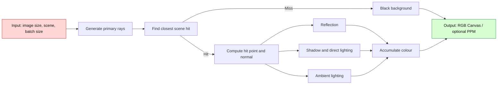
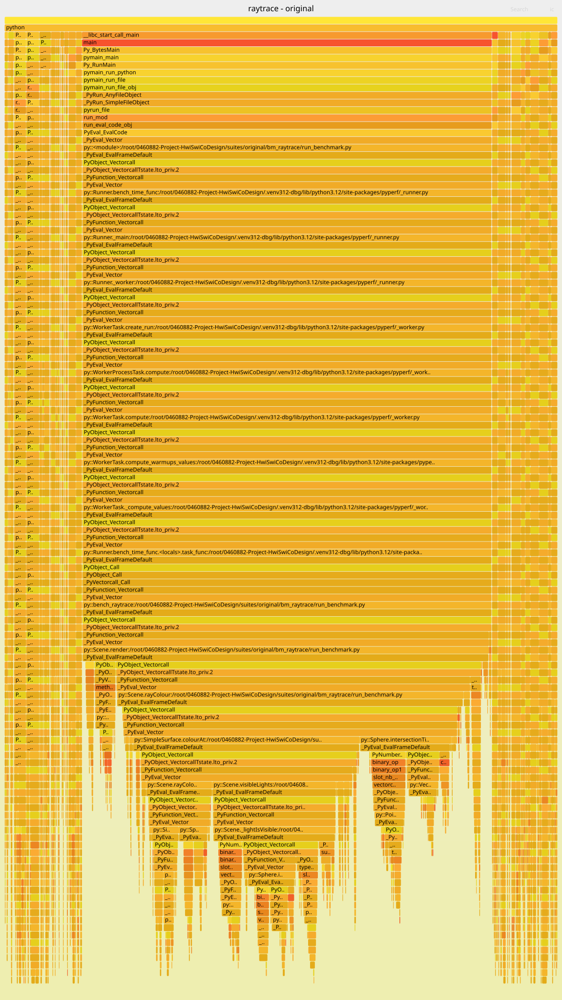
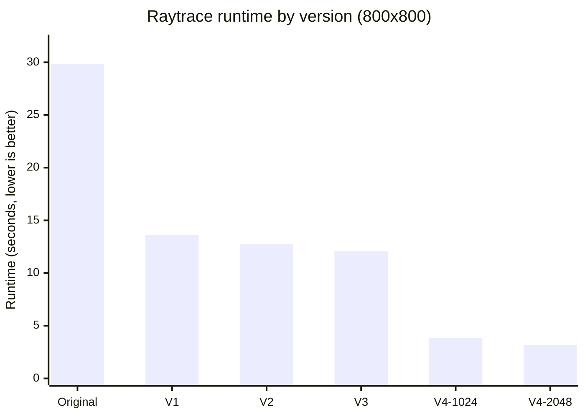
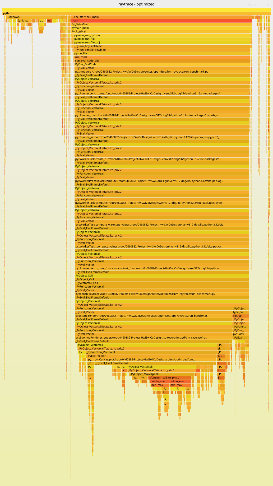

# האצת Raytracing באמצעות Software-Hardware Co-Design

## תקציר

בדוח זה שיפרנו את benchmark ה-Raytracing באמצעות שינויי software בלבד.‏ זמן הריצה של תמונת 800×800 ירד מ-29.833 שניות ב-Original ל-3.184 שניות ב-V4 עם batch size של 2048.‏ זהו speedup של 9.37× והפחתה של 89.33% בזמן.‏ מספר ה-instructions ירד ב-90.18% ומספר ה-cycles ירד ב-88.62%.‏ כל הגרסאות הפיקו קובץ PPM זהה byte-for-byte.‏ שיא השימוש ב-RAM עלה מ-36.27 ל-48.91 MiB.‏

---

## 1. Overview

### 1.1 תיאור ה-benchmark

raytrace הוא benchmark מתוך pyperformance.‏ הוא יוצר תמונה בגודל 800×800 באמצעות שליחת Ray דרך כל pixel,‏ מציאת הפגיעה הקרובה ביותר וחישוב reflection,‏ diffuse lighting,‏ ambient lighting ו-shadow.‏ ה-Scene כוללת שמונה אובייקטים ושני מקורות אור.‏ עומק ה-reflection מוגבל לארבע רמות.‏

בכל הגרסאות נשמרו אותה מתמטיקה,‏ אותו דיוק float64,‏ אותו סדר אובייקטים ואורות ואותו סדר חיבור של רכיבי הצבע.‏

### 1.2 תחום המדידה

ה-timer כולל יצירת Canvas,‏ בניית Scene,‏ יצירת Rays,‏ בדיקות פגיעה,‏ shading וכתיבת pixels ל-Canvas.‏ ב-V4 הוא כולל גם יצירת BatchedRenderer והמרת נתוני ה-Scene למערכי NumPy.‏ כתיבת קובץ PPM מתבצעת לאחר עצירת ה-timer ואינה נכללת בזמן.‏

### 1.3 ספריות ומבני נתונים

| Category | Names |
|---|---|
| Libraries | array, math, pyperf, os, NumPy 2.5.3 |
| Core data structures | Vector, Point, Ray, Sphere, Halfspace, Scene |
| Surface and output structures | SimpleSurface, CheckerboardSurface, Canvas, array.array('B') |
| V4 data structures | BatchedRenderer, NumPy float64 arrays, NumPy Boolean arrays |

---

## 2. Initial Analysis

### 2.1 סביבת המדידה

כל הגרסאות נמדדו עם תמונה בגודל 800×800 וב-CPU יחיד.‏ V4 הגבילה את NumPy ל-thread יחיד,‏ ולכן השיפור אינו נובע משימוש בכמה cores.‏

| Property | Recorded value |
|---|---|
| Workload | 800 × 800 pixels |
| CPU | Intel Xeon E5-2630 v3 @ 2.40 GHz |
| Available CPU count | 1 |
| Operating system | Linux 5.15 KVM, x86-64 |
| Python | CPython 3.12.13, 64-bit |
| V4 NumPy | 2.5.3 |
| V4 numeric-library thread limit | 1 |
| Profiling event | cpu-clock, 199 Hz |
| Hardware measurement | perf stat |

### 2.2 Profiling של Original

ה-Flame Graph מציג את החלק היחסי של כל פונקציה בדגימות.‏ האחוזים כוללים פונקציות פנימיות ולכן הם חופפים ואסור לחבר אותם.‏ החץ ↑ מציין ש-share גבוה יותר הוא יעד חשוב יותר לבדיקה ולא ביצועים טובים יותר.‏

| Original function | Profiler sample share (%) ↑ |
|---|---:|
| Scene.render | **73.56** |
| Scene.rayColour | 62.73 |
| SimpleSurface.colourAt | 41.03 |
| Scene.visibleLights | 22.38 |
| Scene._lightIsVisible | 22.12 |
| Sphere.intersectionTime | 16.60 |
| Point subtraction | 5.44 |
| Vector.dot | 5.40 |

רוב הדגימות נמצאו ב-Scene.render ובפונקציות שמתחתיה: חישוב צבע,‏ בדיקות shadow ובדיקות פגיעה ב-Sphere.‏ במדידת perf נרשמו 71.648 billion cycles,‏ 186.717 billion instructions ו-30.397 billion branch instructions.‏ בדיקת הקוד הראתה חישובים חוזרים,‏ אובייקטים זמניים,‏ קריאות רבות לפונקציות קטנות ועיבוד Ray אחד בכל פעם.‏

---

## 3. Optimizations

השיפורים מצטברים.‏ V2 מבוססת על V1,‏ V3 מבוססת על V2 ו-V4 כוללת את כל השינויים.‏

### 3.1 V1 - הסרת עבודה חוזרת

ב-V1 הוספנו Python slots כדי להגדיר מראש את שדות Vector,‏ Point ו-Ray.‏ כתבנו את בדיקת ה-Sphere ישירות,‏ השתמשנו מחדש בערכי Camera וב-Shadow Ray,‏ מצאנו את הפגיעה הקרובה במעבר יחיד והסרנו חישוב שלא שימש את התוצאה.‏

ב-Original נוצרו שני offsets לכל pixel.‏ ב-V1 נוצר offset אחד לכל column ואחד לכל row.‏ עבור $W=H=800$ מספר יצירות האובייקטים שנחסכו הוא:

$$
\underbrace{2\cdot800\cdot800}_{\text{before}}
-
\underbrace{(800+800)}_{\text{after}}
=1{,}278{,}400
$$

זמן הריצה ירד מ-29.833 ל-13.637 שניות.‏ זהו speedup של 2.19× והפחתה של 54.29% בזמן.‏ מספר ה-instructions ירד ב-55.56% לעומת Original.‏

### 3.2 V2 - צמצום קריאות לפונקציות

ב-V2 כתבנו את החישובים ישירות בתוך ארבע הפונקציות המרכזיות.‏ כך נחסכו קריאות וקפיצות בין פונקציות ונוצרו פחות אובייקטים זמניים.‏ המתמטיקה וסדר הפעולות נשמרו.‏ זמן הריצה ירד מ-13.637 ל-12.734 שניות,‏ שיפור של 6.62% לעומת V1 ו-speedup מצטבר של 2.34×.‏

### 3.3 V3 - שמירת ערכים קבועים

ב-V3 חישבנו פעם אחת את radiusSquared ואת ערך ה-Camera הקבוע לכל column ושמרנו אותם לשימוש חוזר.‏ חישוב Camera שבוצע קודם לכל pixel מבוצע כעת פעם אחת לכל column:

$$
\underbrace{800\cdot800}_{\text{before: once per pixel}}
-
\underbrace{800}_{\text{after: once per column}}
=639{,}200
$$

כל Vector שנחסך כלל שלושה חיבורי coordinates,‏ ולכן נחסכו 1,917,600 חיבורים בכל render.‏ זמן הריצה ירד מ-12.734 ל-12.076 שניות,‏ שיפור של 5.17% לעומת V2 ו-speedup מצטבר של 2.47×.‏

### 3.4 V4 - עיבוד Rays בקבוצות

ב-V4 איגדנו Rays במערכי NumPy ועיבדנו batch שלם בכל קריאה במקום Ray אחד בכל פעם ב-Python.‏ החישובים משתמשים ב-float64 ובמערכי True/False לסימון Rays פעילים.‏ מספר ה-threads נשאר 1.‏ סדר ה-Rays,‏ כללי הפגיעה וסדר חישוב הצבע נשמרו.‏

NumPy מריצה את הפעולות בקוד מכונה ועשויה להשתמש ב-SIMD.‏ השימוש ב-SIMD לא נמדד ישירות,‏ ולכן הוא אינו מוצג כתוצאה מוכחת.‏ השינוי שנמדד הוא הירידה במספר ה-instructions וה-cycles.‏

ברירת המחדל היא batch size של 2048.‏ מערך coordinates יחיד בגודל זה דורש:

$$
\underbrace{3}_{\text{x, y, z}}
\times
\underbrace{2048}_{\text{rays}}
\times
\underbrace{8\ \text{bytes}}_{\text{float64}}
=49{,}152\ \text{bytes}
=48\ \text{KiB}
$$

זמן הריצה ירד מ-12.076 ל-3.184 שניות,‏ שיפור של 3.79× והפחתה של 73.64% לעומת V3.‏

---

## 4. Performance Comparison

### 4.1 זמני ריצה

| Version | Runtime (s) ↓ | Speedup vs Original (×) ↑ | Time reduction vs Original (%) ↑ | Maximum RAM (MiB) ↓ |
|---|---:|---:|---:|---:|
| Original | 29.833 | 1.00 | 0.00 | **36.27** |
| V1 | 13.637 | 2.19 | 54.29 | 36.39 |
| V2 | 12.734 | 2.34 | 57.31 | 36.43 |
| V3 | 12.076 | 2.47 | 59.52 | 36.48 |
| V4, batch 1024 | 3.862 | 7.72 | 87.05 | 48.97 |
| V4, batch 2048 | **3.184** | **9.37** | **89.33** | 48.91 |

את ה-speedup מחשבים על ידי חלוקת הזמן המקורי בזמן הסופי.‏ את הפחתת הזמן מחשבים כחלק מהזמן המקורי שנחסך:

$$
\text{Speedup}=
\frac{\underbrace{29.833}_{\text{Original}}}{\underbrace{3.184}_{\text{V4}}}
=\underbrace{9.37\times}_{\text{speedup}}
$$

$$
\text{Time reduction}=
\frac{\underbrace{29.833-3.184}_{\text{saved time}}}{\underbrace{29.833}_{\text{Original}}}
\times100
=\underbrace{89.33\%}_{\text{reduction}}
$$

Batch 2048 היה מהיר ב-17.57% מ-batch 1024,‏ השתמש ב-16.10% פחות cycles וב-12.69% פחות instructions.‏ שיא ה-RAM היה כמעט זהה: 48.91 לעומת 48.97 MiB.‏ לכן 2048 נבחר כברירת המחדל.‏

### 4.2 Hardware counters

| Version | Cycles (B) ↓ | Instructions (B) ↓ | Branch instructions (B) ↓ | Branch misses (M) ↓ | L1D loads (B) ↓ | L1D misses (M) ↓ |
|---|---:|---:|---:|---:|---:|---:|
| Original | 71.648 | 186.717 | 30.397 | 173.482 | 42.988 | 585.915 |
| V1 | 33.030 | 82.982 | 13.709 | 79.909 | 19.108 | 410.781 |
| V2 | 30.326 | 77.799 | 12.949 | 68.097 | 18.230 | 326.121 |
| V3 | 29.442 | 74.432 | 12.386 | 66.875 | 17.154 | 376.699 |
| V4, batch 1024 | 9.715 | 21.010 | 3.579 | 24.252 | 4.304 | 213.002 |
| V4, batch 2048 | **8.150** | **18.345** | **3.140** | **18.213** | **3.799** | **201.150** |

מ-Original ל-V4/2048 מספר ה-cycles ירד ב-88.62%,‏ ה-instructions ירדו ב-90.18%,‏ ה-branch instructions ירדו ב-89.67% וה-L1D loads ירדו ב-91.16%.‏ שיעור ה-L1D misses עלה מ-1.36% ל-5.29%,‏ אך מספר ה-misses הכולל ירד מ-585.915 ל-201.150 million.‏ המחיר הוא עלייה של 12.64 MiB,‏ או 34.84%,‏ בשיא השימוש ב-RAM.‏

### 4.3 Profiling של V4

ב-V4 הפונקציות שמעבדות Ray יחיד כבר אינן מרכז הגרף.‏ BatchedRenderer.render מופיעה ב-58.72% מהדגימות,‏ Canvas.plot ב-45.45% ו-BatchedRenderer.rayColours ב-2.43%.‏ הפונקציות הקטנות נמצאות מתחת ל-1%.‏ צוואר הבקבוק העיקרי שנותר הוא המרת הצבע וכתיבת pixels דרך Canvas.plot.‏

---

## 5. Verification

### 5.1 זהות התוצאה

לכל גרסה שמרנו raytrace.ppm בגודל 800×800.‏ כל ששת הקבצים הם בגודל 1,920,015 bytes ובעלי אותו SHA-256,‏ ולכן הם זהים byte-for-byte.‏

| Version | File size (bytes) | SHA-256 | Result |
|---|---:|---|---|
| [Original](<../report raytracing/single Orignal/raytrace.ppm>) | **1,920,015** | **3F8C8BBCA2BD3188BA3AD3B95AE29950C53E1F534983D82A6AF15256AB3D59F0** | **BYTE-IDENTICAL** |
| [V1](<../report raytracing/single v1/raytrace.ppm>) | **1,920,015** | **3F8C8BBCA2BD3188BA3AD3B95AE29950C53E1F534983D82A6AF15256AB3D59F0** | **BYTE-IDENTICAL** |
| [V2](<../report raytracing/single v2/raytrace.ppm>) | **1,920,015** | **3F8C8BBCA2BD3188BA3AD3B95AE29950C53E1F534983D82A6AF15256AB3D59F0** | **BYTE-IDENTICAL** |
| [V3](<../report raytracing/single v3/raytrace.ppm>) | **1,920,015** | **3F8C8BBCA2BD3188BA3AD3B95AE29950C53E1F534983D82A6AF15256AB3D59F0** | **BYTE-IDENTICAL** |
| [V4, batch 1024](<../report raytracing/single v4 1024/raytrace.ppm>) | **1,920,015** | **3F8C8BBCA2BD3188BA3AD3B95AE29950C53E1F534983D82A6AF15256AB3D59F0** | **BYTE-IDENTICAL** |
| [V4, batch 2048](<../report raytracing/single v4 2048/raytrace.ppm>) | **1,920,015** | **3F8C8BBCA2BD3188BA3AD3B95AE29950C53E1F534983D82A6AF15256AB3D59F0** | **BYTE-IDENTICAL** |

גודל הקובץ מתקבל מ-15 bytes של PPM header ועוד שלושה bytes לכל pixel:

$$
\underbrace{15}_{\text{PPM header}}
+
\underbrace{800\cdot800\cdot3}_{\text{RGB data}}
=
\underbrace{1{,}920{,}015}_{\text{bytes}}
$$

### 5.2 כללים שנשמרו ותחום הבדיקה

בכל הגרסאות נשמרו float64,‏ ערכי EPSILON,‏ סדר האובייקטים וה-lights,‏ כללי tie-breaking,‏ עומק ה-reflection,‏ סדר חיבור רכיבי הצבע והמרת RGB.‏ הבדיקה מוכיחה זהות עבור ה-benchmark וה-Scene שנמדדו.‏ היא אינה מבטיחה תמיכה בכל subclass,‏ geometry או קלט עתידי.‏

לכל מדידה נשמר source_sha256 של קובץ הקוד.‏ לאחר איחוד סימוני סוף שורה של Windows ו-Linux,‏ כל hash התאים לקובץ המקור שסופק.‏ הקישורים מופיעים ב-Appendix D.‏

---

## 6. Conclusion

השינויים המצטברים הורידו את זמן הריצה מ-29.833 ל-3.184 שניות,‏ כלומר speedup של 9.37× והפחתה של 89.33%.‏ מספר ה-instructions ירד ב-90.18% ומספר ה-cycles ירד ב-88.62%.‏ התמונה נשארה זהה byte-for-byte.‏ שיא השימוש ב-RAM עלה ב-34.84%.‏ לא כתבנו RTL ולא השתמשנו בכמה threads.‏ שינינו את ה-software כך שה-CPU יבצע פחות עבודה ויעבד Rays בקבוצות.‏

---

## Appendix A - מגבלות המדידה

נשמרה מדידת זמן אחת לכל configuration,‏ ולכן אין הערכה של השונות בין ריצות.‏ כל הגרסאות השתמשו באותו CPU,‏ OS,‏ Python ו-CPU יחיד,‏ אך נמדדו בזמנים שונים.‏ זמני pyperf ו-Flame Graph נאספו מגרסאות Python שונות ומשמשים למטרות שונות.‏ perf חילק את ה-hardware counters בין חלקי הריצה והעריך את הסכומים,‏ וחלק מה-counters לא היו זמינים ולכן לא נכללו במסקנות.‏ perf stat כולל גם את פתיחת Python וטעינת הספריות,‏ ולכן pyperf הוא המקור להשוואת זמני ה-benchmark.‏ ה-source hashes מזהים את קובצי הקוד המדויקים שנמדדו.‏

## Appendix B - קבצי Profiling

| Version | Flame Graph | Folded stacks source |
|---|---|---|
| Original | [Open SVG](assets/flamegraph-original.svg) | [Open folded stacks](<../report raytracing/single Orignal/speedscope.folded>) |
| V1 | [Open SVG](assets/flamegraph-v1.svg) | [Open folded stacks](<../report raytracing/single v1/speedscope.folded>) |
| V2 | [Open SVG](assets/flamegraph-v2.svg) | [Open folded stacks](<../report raytracing/single v2/speedscope.folded>) |
| V3 | [Open SVG](assets/flamegraph-v3.svg) | [Open folded stacks](<../report raytracing/single v3/speedscope.folded>) |
| V4, batch 1024 | [Open SVG](assets/flamegraph-v4-1024.svg) | [Open folded stacks](<../report raytracing/single v4 1024/speedscope.folded>) |
| V4, batch 2048 | [Open SVG](assets/flamegraph-v4-2048.svg) | [Open folded stacks](<../report raytracing/single v4 2048/speedscope.folded>) |

## Appendix C - נתונים גולמיים

| Version | Timing | Hardware counters | Profiling report | Run metadata |
|---|---|---|---|---|
| Original | [timing.json](<../report raytracing/single Orignal/timing.json>) | [perf_stat.txt](<../report raytracing/single Orignal/perf_stat.txt>) | [perf_report.txt](<../report raytracing/single Orignal/perf_report.txt>) | [run_metadata.txt](<../report raytracing/single Orignal/run_metadata.txt>) |
| V1 | [timing.json](<../report raytracing/single v1/timing.json>) | [perf_stat.txt](<../report raytracing/single v1/perf_stat.txt>) | [perf_report.txt](<../report raytracing/single v1/perf_report.txt>) | [run_metadata.txt](<../report raytracing/single v1/run_metadata.txt>) |
| V2 | [timing.json](<../report raytracing/single v2/timing.json>) | [perf_stat.txt](<../report raytracing/single v2/perf_stat.txt>) | [perf_report.txt](<../report raytracing/single v2/perf_report.txt>) | [run_metadata.txt](<../report raytracing/single v2/run_metadata.txt>) |
| V3 | [timing.json](<../report raytracing/single v3/timing.json>) | [perf_stat.txt](<../report raytracing/single v3/perf_stat.txt>) | [perf_report.txt](<../report raytracing/single v3/perf_report.txt>) | [run_metadata.txt](<../report raytracing/single v3/run_metadata.txt>) |
| V4, batch 1024 | [timing.json](<../report raytracing/single v4 1024/timing.json>) | [perf_stat.txt](<../report raytracing/single v4 1024/perf_stat.txt>) | [perf_report.txt](<../report raytracing/single v4 1024/perf_report.txt>) | [run_metadata.txt](<../report raytracing/single v4 1024/run_metadata.txt>) |
| V4, batch 2048 | [timing.json](<../report raytracing/single v4 2048/timing.json>) | [perf_stat.txt](<../report raytracing/single v4 2048/perf_stat.txt>) | [perf_report.txt](<../report raytracing/single v4 2048/perf_report.txt>) | [run_metadata.txt](<../report raytracing/single v4 2048/run_metadata.txt>) |

## Appendix D - גרסאות הקוד

| Version | Source file | Recorded source SHA-256 | Snapshot check |
|---|---|---|---|
| Original | [Open source](../suites/original/bm_raytrace/run_benchmark.py) | 88ef4d9060d8e8f6ce40f376477aaf89cc808fa44813225a3071a05a1467f017 | **MATCH** |
| V1 | [Open source](<../suites/optimized/bm_raytrace/run_benchmark - First Improvemnt 2x speed.py>) | 35872f2da93b7017c640ccf29dc0836f220581ddbbd4b2041a4ffb5c625b5154 | **MATCH** |
| V2 | [Open source](<../suites/optimized/bm_raytrace/run_benchmark - Second Improvent remove direct function calls and write the math.py>) | 79b0af0a0c8f2f53783ae92bf232626128da14c0b829735a30300cd54d42b34f | **MATCH** |
| V3 | [Open source](<../suites/optimized/bm_raytrace/run_benchmark - Third improvement - chacing the radious and camera values instead of repeated calcs.py>) | 373cc992befa2630fc74bce65dc9ec1aea297810ee52bbf6cbbce3b2c6bd8d34 | **MATCH** |
| V4 | [Open source](../suites/optimized/bm_raytrace/run_benchmark.py) | be6eee7feabb67293512738eb68bbc569766a69b817e65ff1c72130ce7f2a432 | **MATCH** |

פירוט השינויים מופיע גם ב-[OPTIMIZATIONS.md](../suites/optimized/bm_raytrace/OPTIMIZATIONS.md).‏
