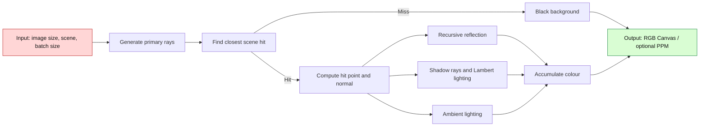
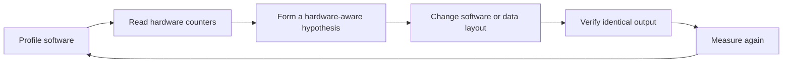
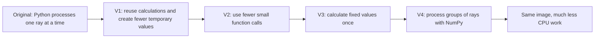
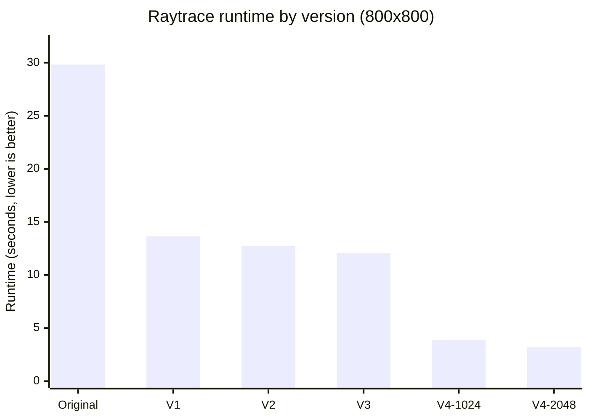

# האצת Raytracing באמצעות Software–Hardware Co-Design

## מסע הדרגתי מעיבוד Ray אחד בכל פעם לעיבוד קבוצות עם NumPy

### תקציר מנהלים

הסיפור של העבודה הזאת מתחיל ב-Raytracer קטן שקל להבין,‏ אבל לוקח לו זמן רב לסיים.‏ לכל pixel הוא שולח Ray לתוך ה-Scene,‏ בודק באיזה אובייקט ה-Ray פוגע,‏ ואז מחשב צבע,‏ תאורה,‏ צל והשתקפות.‏ כשחוזרים על התהליך הזה עבור תמונה בגודל 800×800 pixels,‏ הגרסה המקורית מסיימת רק אחרי **29.833 שניות**.‏

המטרה שלנו הייתה לקבל בדיוק את אותה תמונה בפחות זמן.‏ לא הקלנו את הבעיה,‏ לא הורדנו precision,‏ לא הוספנו threads ולא כתבנו RTL.‏ בכל שלב בדקנו היכן התוכנה מעסיקה את ה-CPU,‏ חיפשנו עבודה שאפשר למנוע או לארגן טוב יותר,‏ שינינו רק את הקוד,‏ ואז מדדנו מחדש.‏ זהו הרעיון של Software–Hardware Co-Design בעבודה הזאת: להבין כיצד בחירת הקוד ומבנה הנתונים משפיעים על העבודה שה-hardware נדרש לבצע.‏

אחרי ארבעה שיפורים מצטברים,‏ V4 עם batch size של 2048 סיימה בתוך **3.184 שניות**.‏ כדי להבין מאין הגיע ה-speedup,‏ מחלקים את הזמן המקורי בזמן החדש:

$$
\text{Speedup}=
\frac{\underbrace{29.833}_{\text{Original time}}}{\underbrace{3.184}_{\text{V4 time}}}
\approx \underbrace{9.37\times}_{\text{Speedup}}
$$

כדי לחשב כמה מזמן הריצה נחסך,‏ מחסרים את הזמן החדש מהזמן המקורי ומחלקים בזמן המקורי:

$$
\text{Time reduction}=
\frac{\underbrace{29.833-3.184}_{\text{Saved time}}}{\underbrace{29.833}_{\text{Original time}}}\times100
\approx \underbrace{89.33\%}_{\text{Time reduction}}
$$

כלומר,‏ התוכנית נעשתה מהירה פי **9.37** וזמן הריצה התקצר ב-**89.33%**.‏ גם כמות העבודה שה-CPU ביצע ירדה: מספר ה-instructions קטן ב-**90.18%** ומספר ה-cycles קטן ב-**88.62%**.‏ את האחוזים האלה מחשבים באותה דרך: מחסרים את הערך של V4 מהערך המקורי,‏ מחלקים בערך המקורי ומכפילים ב-100.‏ כל שש התמונות השמורות — Original,‏ ‏V1,‏ ‏V2,‏ ‏V3,‏ ‏V4/1024 ו-V4/2048 — זהות byte-for-byte ובעלות אותו SHA-256,‏ ולכן השיפור במהירות לא שינה את התוצאה.‏

לשיפור יש גם מחיר: V4 משתמשת ביותר memory בזמן הריצה.‏ כמות ה-RAM המרבית שנמדדה,‏ הנקראת Peak RSS,‏ עלתה מכ-36.27 MiB לכ-48.91 MiB.‏ בתמורה,‏ Python מנהלת הרבה פחות אובייקטים ומבצעת פחות קריאות קטנות לפונקציות,‏ ו-NumPy מטפלת בקבוצה של rays יחד.‏ זוהי פשרה טובה עבור ה-benchmark הזה: מעט יותר memory תמורת חיסכון גדול מאוד בזמן,‏ בלי שינוי בתמונה.‏

### מילון קצר לפני שמתחילים

כדי שהמשך הסיפור יהיה קל לקריאה,‏ כדאי להכיר כמה מילים שחוזרות בו.‏ **אובייקט** הוא הדרך של Python לארוז ערך,‏ למשל נקודה או כיוון,‏ יחד עם המידע הדרוש כדי לעבוד איתו.‏ האריזה נוחה למתכנת,‏ אך יצירה וניהול שלה דורשים זמן ו-memory.‏ **אובייקט זמני** הוא אריזה שנוצרת בשביל צעד קטן בחישוב ונזרקת מיד לאחר מכן.‏ **קריאה לפונקציה** פירושה לעבור לחלק אחר בקוד כדי שיבצע פעולה.‏ כל מעבר כזה קצר,‏ אבל כאשר הוא חוזר מיליוני פעמים הזמן מצטבר.‏

**Batch** הוא פשוט קבוצה של rays שמעובדת יחד במקום Ray אחד בכל פעם.‏ **NumPy** מאפשרת לבצע פעולה אחת על קבוצה של מספרים בקוד שכבר הוכן מראש להרצה מהירה,‏ וכך Python אינה צריכה לטפל בכל מספר בנפרד.‏ בצד ה-hardware,‏ **Instruction** היא פעולה קטנה שה-CPU התבקש לבצע,‏ ו-**Cycle** הוא צעד בשעון של ה-CPU.‏ כאשר אותה תוצאה מתקבלת בעזרת פחות instructions ופחות cycles,‏ בדרך כלל פירוש הדבר שהסרנו עבודה מיותרת.‏ **Cache** הוא אזור memory קטן ומהיר ליד ה-CPU; אפשר לחשוב עליו כמו חפץ שמונח על השולחן ונגיש מהר יותר מחפץ שצריך להביא מארון רחוק.‏

---

## 1.‏ Overview — מה ה-benchmark עושה?‏

### 1.1 הבעיה שאנו פותרים

raytrace הוא benchmark מתוך suite בסגנון pyperformance.‏ הספרייה pyperf היא שעון המדידה של ה-benchmark: היא מודדת כמה זמן נמשכת הריצה.‏ במילים פשוטות,‏ pyperformance הוא אוסף ה-benchmarks,‏ ואילו pyperf הוא הכלי שמודד אחד מהם.‏

בכל ריצה נבנית אותה Scene,‏ כך שכל הגרסאות מקבלות בדיוק אותה עבודה.‏ ה-Camera נמצאת במיקום (0, 1.8, 10),‏ מביטה אל (0, 3, 0),‏ ומשתמשת ב-field of view של 45°.‏ מולה נמצאים שני מקורות אור,‏ Sphere צהוב גדול,‏ שישה Spheres קטנים ורצפת CheckerboardSurface שמיוצגת בעזרת Halfspace.‏ בסך הכול ה-Scene מכילה שמונה אובייקטים ושני מקורות אור.‏ אם יש reflection,‏ הקוד יכול לעקוב אחריו עד ארבע רמות; לאחר מכן הוא עוצר ומחזיר צבע שחור,‏ כדי שהחישוב לא יימשך ללא סוף.‏

אפשר לדמיין את יצירת התמונה כך: מה-Camera נשלח קו דמיוני דרך כל pixel.‏ הקו הזה נקרא primary ray.‏ הקוד מחפש את האובייקט הראשון בדרכו.‏ אם אין פגיעה,‏ ה-pixel נצבע בשחור.‏ אם יש פגיעה,‏ הקוד בודק לאיזה כיוון פונה המשטח ומחבר שלושה סוגי אור: reflection דמוי מראה,‏ diffuse lighting שמגיע ישירות ממקור אור,‏ ו-ambient lighting חלש שנותן אור בסיסי.‏ בנוסף נשלח shadow ray מנקודת הפגיעה אל מקור האור.‏ אם אובייקט אחר עומד בדרך,‏ אותה נקודה נמצאת בצל.‏

### 1.2 המתמטיקה שנשמרה לאורך כל הדרך

גם כשהחלפנו את הדרך שבה הקוד עובד,‏ לא החלפנו את המתמטיקה שלו.‏ Ray מתחיל בנקודה $P_0$ ומתקדם בכיוון $D$.‏ הערך $t$ אומר כמה רחוק התקדמנו,‏ ולכן נקודה על ה-Ray מתוארת כך:

$$P(t)=P_0+tD$$

כדי לבדוק אם ה-Ray פוגע ב-Sphere,‏ מסמנים את מרכז ה-Sphere ב-$C$ ואת הרדיוס שלה ב-$r$.‏ תחילה מחשבים את הכיוון מנקודת ההתחלה אל המרכז:

$$CP=C-P_0$$

לאחר מכן משתמשים בכיוון הזה ובכיוון ה-Ray כדי לקבל את $v$:

$$v=CP\cdot D$$

לבסוף מחשבים את $Δ$:

$$\Delta=r^2-(CP\cdot CP-v^2)$$

אין צורך לפרק כאן את החישוב לכל coordinate.‏ הדבר החשוב הוא התוצאה: אם $\Delta$ שלילי,‏ ה-Ray פספס את ה-Sphere.‏ אם $\Delta$ אינו שלילי,‏ יש פגיעה.‏ במקרה כזה בוחרים את הפגיעה הקרובה יותר,‏ ו-$t$ אומר כמה להתקדם לאורך ה-Ray עד אליה:

$$t=v-\sqrt{\Delta}$$

לאחר שמוצאים פגיעה,‏ צבע ה-pixel הוא שילוב של reflection,‏ אור ישיר ואור בסיסי.‏ המשוואה המלאה היא:

$$C=k_sC_{reflection}+k_d\min\left(1,\sum_{visible}\max(0,L\cdot N)\right)C_{base}+k_aC_{base}$$

הערכים $k_s$,‏ ‏$k_d$ ו-$k_a$ קובעים כמה מכל סוג אור נכנס לצבע הסופי.‏ ב-SimpleSurface ערכי ברירת המחדל הם $k_s=0.2$,‏ ‏$k_d=0.6$ ו-$k_a=0.2$.‏ בכל גרסה שמרנו על אותה משוואה,‏ אותו סדר פעולות,‏ דיוק float64 של 64 bits,‏ אותו סדר אובייקטים ואורות ואותם כללים לבחירת הפגיעה.‏ לכן שינינו את דרך הביצוע,‏ אך לא את התמונה שאמורה להתקבל.‏

### 1.3 ספריות ומבני נתונים

הטבלה מפרטת רק את הספריות ואת מבני הנתונים המרכזיים שבהם הקוד משתמש.‏

| Category | Name | Simple purpose |
|---|---|---|
| Library | array | Provides the byte array used for RGB output |
| Library | math | Provides sqrt, tan and pi |
| Library | pyperf | Measures benchmark runtime |
| Library | os | Sets NumPy-related thread limits in V4 |
| Library | NumPy 2.5.3 | Processes groups of rays in V4 |
| Data structure | Vector, Point, Ray | Store directions, positions and rays |
| Data structure | Sphere, Halfspace | Represent scene geometry |
| Data structure | Scene | Stores geometry, lights and camera settings |
| Data structure | SimpleSurface, CheckerboardSurface | Store colour and lighting settings |
| Data structure | Canvas, array.array('B') | Store three RGB bytes for every pixel |
| Data structure | BatchedRenderer | Processes groups of rays with NumPy in V4 |
| Data structure | Python list and tuple | Store geometry, surfaces, lights and colours |
| Data structure | NumPy float64 arrays | Store many ray coordinates together in V4 |
| Data structure | NumPy Boolean arrays | Mark which rays are active, hit or blocked in V4 |

בגרסה המקורית,‏ כל Ray נשמר בעזרת אובייקטים כמו Vector ו-Point.‏ המבנה הזה ברור ונוח לקריאה,‏ אבל פעולות קטנות עשויות ליצור עוד אובייקט או לעבור דרך עוד פונקציה.‏ ב-V4,‏ החלק שחוזר פעמים רבות שומר יחד את הנתונים של rays רבים במערכי NumPy.‏ כך פעולה אחת יכולה לטפל בקבוצה שלמה במקום ש-Python תעבור על כל Ray בנפרד.‏

### 1.4 מה נכלל בזמן המדוד?‏

כדי שההשוואה תהיה הוגנת,‏ צריך לדעת בדיוק מתי השעון מתחיל ומתי הוא נעצר.‏ ה-timer של bench_raytrace מתחיל לפני יצירת ה-Canvas ובניית ה-Scene.‏ לכן הזמן המדוד כולל את הכנת ה-Canvas,‏ יצירת האובייקטים,‏ החומרים והאורות,‏ יצירת ה-rays,‏ מציאת הפגיעות,‏ חישוב ה-shading וכתיבת ה-pixels ל-Canvas.‏ ב-V4 הוא כולל גם את יצירת BatchedRenderer ואת העברת נתוני ה-Scene למערכי NumPy.‏

רק כתיבת קובץ ה-PPM האופציונלי מתבצעת לאחר שה-timer נעצר,‏ ולכן זמן שמירת הקובץ אינו נחשב כחלק מה-speedup.‏ כל ההשוואות בדוח בוצעו במפורש על תמונה בגודל 800×800 pixels,‏ גם אם בחלק מהקבצים הישנים הופיעו ברירות מחדל אחרות.‏

---

## 2.‏ Initial Analysis — להבין לאן הזמן הולך

### 2.1 סביבת המדידה

לפני שמשווים זמנים,‏ חשוב לוודא שכל הגרסאות רצות באותם תנאים.‏ לכן כולן נמדדו עם אותה תמונה בגודל 800×800 pixels ובאותו סוג סביבה.‏ V4 גם מגבילה במפורש את ספריות החישוב ל-thread יחיד.‏ במילים אחרות,‏ היא אינה מהירה יותר מפני שהשתמשה בסתר בכמה CPU cores; השיפור מגיע מהדרך שבה ארגנו את העבודה.‏

| Property | Recorded value |
|---|---|
| Workload | 800 × 800 pixels |
| CPU | Intel Xeon E5-2630 v3 @ 2.40 GHz |
| Available CPU count | 1 |
| Operating system | Linux 5.15 KVM, x86-64 |
| Python | CPython 3.12.13, 64-bit |
| V4 NumPy | 2.5.3 |
| V4 numeric-library thread limit | 1 |
| Profiling event | cpu-clock, 199 Hz |
| Hardware measurement | perf stat |

### 2.2 ה-Flame Graph המקורי

הצעד הראשון לא היה לנחש,‏ אלא לראות היכן הקוד מבלה את זמנו.‏ Flame Graph הוא מפה של העבודה: כל מלבן מייצג פונקציה,‏ ומלבן רחב אומר שה-profiler פגש אותה פעמים רבות יותר בזמן הדגימה.‏ לכן מלבן רחב מסמן מקום שכדאי לבדוק,‏ אך הוא עדיין לא מוכיח לבדו מה צריך לשנות.‏ מלבן יכול לכלול גם פונקציות שנקראו מתוכו,‏ ולכן האחוזים עשויים לחפוף ואין לחבר אותם.‏ את ה-profiling ביצענו בגרסת Python שמציגה יותר פרטים על הקריאות,‏ ואת זמני הריצה עצמם מדדנו בנפרד בעזרת pyperf.‏

כבר במבט ראשון רואים שכמעט כל הדרך עוברת דרך Scene.render.‏ מתוכה העבודה ממשיכה אל rayColour ו-colourAt,‏ אל בדיקות הצל ואל חישובי הפגיעה ב-Sphere.‏ כלומר,‏ הבעיה אינה נמצאת בפינה צדדית של התוכנית אלא בלב התהליך שחוזר עבור כל Ray.‏ הטבלה מדרגת את הפונקציות לפי החלק שלהן בדגימות.‏ החץ למעלה אומר שערך גבוה יותר מסמן יעד חשוב יותר לבדיקה; הוא אינו אומר שהפונקציה מהירה יותר.‏

| Original function | Profiler sample share (%) ↑ |
|---|---:|
| Scene.render | **73.56** |
| Scene.rayColour | 62.73 |
| SimpleSurface.colourAt | 41.03 |
| Scene.visibleLights | 22.38 |
| Scene._lightIsVisible | 22.12 |
| Sphere.intersectionTime | 16.60 |
| Point subtraction | 5.44 |
| Vector.dot | 5.40 |

### 2.3 מה ראינו מעבר ל-Flame Graph?‏

ה-Flame Graph הראה היכן לחפש,‏ ו-hardware counters הראו כמה עבודה באמת בוצעה.‏ בגרסה המקורית נמדדו כ-71.648 billion cycles,‏ ‏186.717 billion instructions ו-30.397 billion branch instructions.‏ ה-CPU היה עסוק כמעט כל הזמן.‏ לכן הוא לא חיכה לעבודה; להפך,‏ התוכנה ביקשה ממנו לבצע המון צעדים קטנים.‏

כשחיברנו את המדידות אל הקוד,‏ התמונה נעשתה פשוטה.‏ חלק מערכי ה-Camera וכיווני ה-shadow חושבו שוב בכל פעם אף שלא השתנו.‏ פעולות קטנות יצרו אובייקטים זמניים מסוג Vector,‏ ‏Point,‏ ‏list ו-tuple,‏ וחישוב קצר עבר לפעמים דרך כמה פונקציות.‏ נוסף על כך,‏ Python טיפלה בכל Ray לבד אף שאפשר לטפל ב-rays רבים יחד.‏ לכן המטרה לא הייתה להמציא מתמטיקה חדשה,‏ אלא להפסיק לבקש מה-CPU לחזור על הכנות,‏ מעברים ויצירת אובייקטים שאינם מוסיפים דבר לתמונה.‏

---

## 3.‏ Optimizations — המסע,‏ צעד אחר צעד

כל גרסה נבנתה על הגרסה שלפניה.‏ לכן אלה אינן ארבע דרכים שונות לפתור את אותה בעיה,‏ אלא סיפור אחד שמתקדם צעד אחר צעד.‏ בכל שלב שאלנו שאלה פשוטה: איזו עבודה הקוד מבצע שוב ושוב,‏ והאם אפשר להגיע לאותה תמונה בדרך קצרה יותר?‏ לאחר כל שינוי מדדנו שוב,‏ ורק אז המשכנו לשלב הבא.‏

### 3.1 V1 — קודם כול מפסיקים לבזבז עבודה

בשלב הראשון לא ניסינו להמציא אלגוריתם חדש.‏ פשוט חיפשנו מקומות שבהם Python עושה אותה עבודה פעמיים,‏ שומרת מידע שאיננו צריכים או יוצרת אובייקט זמני שנעלם מיד.‏ אפשר לחשוב על כך כמו סידור שולחן עבודה: לפני שקונים מחשב מהיר יותר,‏ מסירים ממנו את כל הפעולות המיותרות.‏

התחלנו במחלקות Vector,‏ ‏Point ו-Ray.‏ מספר השדות בכל אובייקט כזה ידוע מראש,‏ ולכן אין צורך ש-Python תשמור עבורו מנגנון גמיש להוספת שדות חדשים.‏ בעזרת Python slots אמרנו מראש אילו שדות קיימים.‏ הערכים עצמם לא השתנו; רק כמות המידע ש-Python צריכה לנהל סביב כל אובייקט קטנה.‏

לאחר מכן פישטנו את בדיקת הפגיעה ב-Sphere.‏ במקום ליצור אובייקט ביניים ולקרוא לכמה פונקציות קטנות,‏ הפונקציה מבצעת את אותו חישוב ישירות בעזרת הערכים שכבר נמצאים אצלה.‏ כך מתקבלת אותה תשובה עם פחות הכנות מסביב לחישוב.‏

הבזבוז הגדול הבא נמצא ב-Camera.‏ לכל pixel דרושים רכיב אופקי ורכיב אנכי.‏ בגרסה המקורית שני הרכיבים נוצרו מחדש עבור כל pixel,‏ אף שהרכיב האופקי זהה לאורך column שלם והרכיב האנכי זהה לאורך row שלם.‏ ב-V1 חישבנו כל רכיב רק במקום שבו הוא באמת משתנה.‏

נסמן את מספר ה-columns ב-$W$ ואת מספר ה-rows ב-$H$.‏ לפני השינוי נוצרו שני אובייקטים לכל pixel,‏ כלומר $2WH$.‏ אחרי השינוי נוצר אובייקט אחד לכל column ועוד אובייקט אחד לכל row,‏ כלומר $W+H$.‏ לכן בתמונה של 800×800 מספר האובייקטים שנחסך הוא:

$$
\underbrace{2WH}_{\text{before: two per pixel}}
-
\underbrace{(W+H)}_{\text{after: one per column and row}}
=2\cdot800\cdot800-(800+800)
=1{,}278{,}400
$$

כל אובייקט שלא נוצר חוסך גם את פעולות החישוב שנדרשו כדי לבנות אותו.‏

גם החיפוש אחר הפגיעה הקרובה היה ארוך מהנדרש.‏ קודם הקוד רשם ברשימה את תוצאת הבדיקה מול כל שמונת האובייקטים,‏ ואז עבר שוב על הרשימה כדי למצוא את הפגיעה הקרובה.‏ ב-V1 עוברים על האובייקטים פעם אחת ושומרים תוך כדי את התוצאה הטובה ביותר שנמצאה.‏ זה דומה לחיפוש המספר הקטן ביותר: אין צורך לרשום את כל המספרים ולקרוא אותם שוב,‏ אם אפשר לזכור בכל רגע את הקטן ביותר שראינו.‏ סדר האובייקטים וכללי הבחירה נשמרו בדיוק.‏

רעיון דומה הופעל בבדיקת shadow.‏ הכיוון מנקודת הפגיעה אל מקור האור אינו משתנה בזמן שבודקים את האובייקטים השונים.‏ לכן במקום לבנות אותו מחדש עבור כל אובייקט,‏ בנינו Shadow Ray אחד והשתמשנו בו שוב בכל הבדיקות וגם בחישוב התאורה.‏

לבסוף מצאנו ב-CheckerboardSurface חישוב שיצר Vector חדש,‏ אך התוצאה שלו לא נשמרה ולא שימשה בהמשך.‏ הסרת החישוב הזה אינה משנה דבר בתמונה; היא רק מפסיקה לבצע עבודה שאין לה תוצאה.‏

לאחר כל השינויים האלה זמן הריצה ירד מ-29.833 ל-13.637 שניות.‏ זהו speedup של 2.19× והפחתה של 54.29% בזמן הריצה.‏ גם מספר ה-instructions ירד בכ-55.56%.‏ המסקנה הייתה ברורה: יותר ממחצית מזמן הריצה לא נבע ממתמטיקה מסובכת,‏ אלא מכמות גדולה של פעולות קטנות שחזרו ללא צורך.‏

### 3.2 V2 — מפסיקים לקפוץ בין פונקציות קטנות

אחרי V1 הקוד כבר עשה פחות עבודה,‏ אך הדרך לכל תשובה עדיין עברה דרך הרבה פונקציות קטנות.‏ פונקציה אחת קראה לפונקציה שנייה,‏ והשנייה קראה לשלישית.‏ כל קריאה כזו זולה בפני עצמה,‏ אבל ה-Raytracer מבצע אותה שוב ושוב עבור מאות אלפי pixels,‏ ולכן גם עלות קטנה מצטברת לזמן משמעותי.‏

ב-V2 כתבנו את החישובים בתוך ארבע הפונקציות המרכזיות בצורה מפורשת יותר.‏ במקום לקפוץ בין כמה פונקציות עזר כדי לבצע חישוב קצר,‏ כל פונקציה מבצעת את עבודתה במקום אחד.‏ כך נחסכות קריאות לפונקציות ונוצרים פחות אובייקטים זמניים בדרך לתוצאה.‏

חשוב להדגיש שלא החלפנו את המתמטיקה.‏ רק כתבנו את אותה דרך בצורה ישירה יותר.‏ גם סדר פעולות החשבון נשמר,‏ כדי שלא ליצור שינוי קטן בתוצאה בגלל rounding.‏ אפשר לחשוב על V2 כעל קיצור מסלול: מגיעים לאותו יעד,‏ אבל עוברים דרך פחות תחנות בדרך.‏

זמן הריצה ירד מ-13.637 ל-12.734 שניות,‏ שיפור נוסף של 6.62%.‏ ה-speedup המצטבר לעומת Original עלה ל-2.34×.‏ השיפור קטן יותר מזה של V1,‏ אבל הוא אישר שגם קריאות קצרות לפונקציות חשובות כאשר הן חוזרות מיליוני פעמים.‏

### 3.3 V3 — מחשבים פעם אחת ערכים שאינם משתנים

בשלב השלישי חיפשנו ערכים שאינם משתנים,‏ אך הקוד עדיין מחשב אותם שוב ושוב.‏ מצאנו שניים כאלה: ערך שמבוסס על רדיוס ה-Sphere,‏ שנשאר קבוע כל עוד ה-Sphere אינו משתנה,‏ וחלק מחישוב ה-Camera,‏ שנשאר זהה לאורך column שלם.‏

ב-V3 חישבנו את ריבוע הרדיוס פעם אחת כאשר ה-Sphere נוצר ושמרנו אותו לשימוש חוזר.‏ באותו אופן,‏ החלק הקבוע בחישוב ה-Camera מחושב פעם אחת לכל column במקום פעם אחת לכל pixel.‏

גם כאן אפשר לראות בדיוק מאין מגיע החיסכון.‏ לפני השינוי החישוב בוצע פעם אחת לכל pixel,‏ כלומר $WH$ פעמים.‏ אחרי השינוי הוא מתבצע רק פעם אחת לכל column,‏ כלומר $W$ פעמים.‏ בתמונה של 800×800 מתקבל:

$$
\underbrace{WH}_{\text{before: once per pixel}}
-
\underbrace{W}_{\text{after: once per column}}
=800\cdot800-800
=639{,}200
$$

כל אחד מ-639,200 האובייקטים שנחסכו היה דורש שלושה חיבורים: אחד עבור x,‏ אחד עבור y ואחד עבור z.‏ לכן מספר החיבורים שנחסך הוא:

$$
\underbrace{639{,}200}_{\text{saved Vector creations}}
\times
\underbrace{3}_{\text{x, y and z}}
=1{,}917{,}600
$$

החישוב המקדים עדיין מתבצע בתוך הזמן המדוד,‏ ולכן לא העברנו עבודה אל מחוץ ל-benchmark.‏

הרעיון של V3 פשוט מאוד: אם ערך אינו משתנה בתוך לולאה,‏ מחשבים אותו פעם אחת לפני הלולאה ושומרים אותו.‏ אנו משלמים בכמות קטנה של memory,‏ ובתמורה נמנעים מהמון חישובים חוזרים.‏ השינוי מתאים ל-Scene שלנו,‏ שבו הרדיוס אינו משתנה בזמן ה-render.‏

זמן הריצה ירד מ-12.734 ל-12.076 שניות.‏ זהו שיפור נוסף של 5.17% ו-speedup מצטבר של 2.47× לעומת Original.‏

### 3.4 V4 — נותנים ל-CPU קבוצה של Rays במקום Ray אחד

שלושת השלבים הראשונים ניקו הרבה עבודה מיותרת,‏ אבל Python עדיין טיפלה בכל Ray בנפרד.‏ בכל פעם היא הייתה צריכה להתחיל את החישוב,‏ לנהל אותו ולסיים אותו,‏ ואז לעשות את אותו הדבר שוב עבור ה-Ray הבא.‏ ב-V4 שינינו את צורת העבודה: אספנו Rays שאינם תלויים זה בזה לקבוצות,‏ הנקראות batches,‏ ונתנו ל-NumPy לעבד קבוצה שלמה יחד.‏

אפשר לחשוב על ההבדל כמו על העברת פריטים: במקום לקרוא לעובד 2,048 פעמים ולמסור לו בכל פעם פריט אחד,‏ מוסרים לו מגש של 2,048 פריטים.‏ עדיין מטפלים בכל פריט,‏ אבל משלמים את עלות המסירה וההכנה הרבה פחות פעמים.‏ במקרה שלנו,‏ מערכי NumPy מחזיקים יחד את ערכי x,‏ ‏y ו-z של Rays רבים ומבצעים עליהם את אותן פעולות.‏

BatchedRenderer וגם ההכנה של מערכי NumPy נוצרים בתוך ה-timer,‏ ולכן המדידה כוללת את העלות שלהם.‏ ה-Rays נשמרים באותו סדר של ה-pixels ומחולקים לקבוצות עוקבות.‏ סימוני True/False פשוטים עוזרים לעקוב אחר Rays שפגעו,‏ נחסמו או עדיין זקוקים לחישוב reflection.‏ Ray שכבר נחסם אינו ממשיך לבדיקות חסרות צורך.‏

למרות שינוי צורת העבודה,‏ שמרנו על אותם כללים: אותו סדר אובייקטים,‏ אותה בחירה במקרה של פגיעות שוות ואותו סדר חיבור של reflection,‏ ‏diffuse ו-ambient.‏ בסיום הצבעים עדיין עוברים דרך Canvas.plot המקורית.‏ לכן שינוי הדרך שבה ה-CPU מקבל את העבודה אינו משנה את התמונה.‏

```mermaid
flowchart LR
    I["Input: independent rays"]:::input --> P["Store ray coordinates in arrays"]
    P --> B["Process one group of rays"]
    B --> U["NumPy performs the calculations"]
    U --> F["Keep active rays and calculate reflections"]
    F --> C["Convert colours to RGB"]
    C --> O["Output: byte-identical RGB pixels"]:::output
    classDef input fill:#ffd6d6,stroke:#b91c1c,color:#111
    classDef output fill:#d9fdd3,stroke:#15803d,color:#111
```

זהו החיבור המרכזי ל-Software–Hardware Co-Design.‏ לא שינינו את ה-hardware ולא כתבנו RTL.‏ במקום זאת שינינו את ה-software כך שיגיש ל-CPU עבודה בצורה נוחה יותר.‏ קריאת NumPy אחת מחליפה מאות או אלפי סיבובים של לולאת Python,‏ והחישוב מתבצע בפונקציות שכבר קומפלו לקוד מכונה.‏ חלק מהפונקציות האלה יכולות להשתמש גם ב-SIMD,‏ כלומר לבצע אותה פעולה על כמה מספרים יחד.‏

ה-profiling הראה ש-NumPy בחרה פונקציות חישוב המותאמות למשפחת ה-CPU.‏ עם זאת,‏ לא מדדנו ישירות כמה פעולות השתמשו ב-SIMD,‏ ולכן אנו מציגים זאת כיכולת של הספרייה ולא כטענה שכל חישוב השתמש בה.‏

מספר ה-threads הוגבל ל-1.‏ לכן השיפור אינו מגיע מעבודה על כמה cores,‏ אלא מכך ש-core אחד מקבל את העבודה בצורה יעילה יותר ו-Python צריכה לנהל פחות פעולות קטנות.‏

Batch size הוא מספר ה-Rays שמעובדים יחד.‏ Batch גדול מפחית את מספר הפעמים שבהן Python צריכה לפנות ל-NumPy,‏ אך הוא דורש מערכים זמניים גדולים יותר.‏ ב-float64 כל מספר תופס 8 bytes,‏ ולכל Ray יש שלושה coordinates.‏ לכן עבור batch size של 2048,‏ מערך coordinates יחיד דורש:

$$
\underbrace{3}_{\text{x, y and z}}
\times
\underbrace{2048}_{\text{rays in one batch}}
\times
\underbrace{8\ \text{bytes}}_{\text{one float64 value}}
=49{,}152\ \text{bytes}
=48\ \text{KiB}
$$

מכיוון ש-1 KiB שווה ל-1,024 bytes,‏ התוצאה 49,152 bytes שווה ל-48 KiB.‏ באותה דרך,‏ batch size של 1024 מכיל חצי מכמות ה-Rays ולכן דורש כ-24 KiB למערך coordinates יחיד.‏ בזמן העבודה קיימים כמה מערכים יחד,‏ ולכן מדדנו גם 1024 וגם 2048.‏ ברירת המחדל שנבחרה היא 2048,‏ מפני שהיא נתנה את זמן הריצה הטוב יותר במדידות שלנו.‏

עם batch size של 2048 זמן הריצה ירד מ-12.076 שניות ב-V3 ל-3.184 שניות ב-V4.‏ את ה-speedup של שלב זה מקבלים כאשר מחלקים את הזמן הישן בזמן החדש:

$$
\frac{\underbrace{12.076}_{\text{V3 runtime}}}
{\underbrace{3.184}_{\text{V4 runtime}}}
\approx 3.79\times
$$

כדי למצוא את אחוז ההפחתה,‏ מחשבים כמה זמן נחסך ומחלקים אותו בזמן הישן:

$$
\frac{
\underbrace{12.076-3.184}_{\text{seconds saved}}
}{
\underbrace{12.076}_{\text{V3 runtime}}
}
\times100
\approx73.64\%
$$

כלומר,‏ V4 מהירה בערך פי 3.79 מ-V3 ומפחיתה 73.64% מזמן הריצה של השלב הקודם.‏

### 3.5 סיכום רעיוני של ארבעת השלבים

הטבלה הבאה מרכזת את הדרך שעברנו.‏ כל שורה מתארת בעיה שהתגלתה לאחר המדידה הקודמת,‏ את השינוי שנעשה בעקבותיה ואת ההשפעה על עבודת ה-CPU.‏

| Stage | Problem found | Change made | Result for the CPU |
|---|---|---|---|
| V1 | The same work was repeated and many temporary values were created | Reuse values and scan the scene once | Less Python management work |
| V2 | Small calculations used several function calls | Write the four main operations explicitly | Fewer function calls and temporary values |
| V3 | Constant values were recalculated inside loops | Calculate radius and camera values once | Fewer repeated calculations |
| V4 | Python still processed one ray at a time | Group rays in NumPy arrays and process them together | Much less Python work per ray |

---

## 4.‏ Performance Comparison — מה השתפר בפועל?‏

### 4.1 זמני הריצה המצטברים

הדרך הפשוטה ביותר לבדוק אם הקוד באמת השתפר היא למדוד כמה זמן הוא צריך כדי לצייר את אותה תמונה.‏ Runtime הוא זמן הריצה בשניות,‏ ולכן כאן מספר קטן יותר הוא טוב יותר.‏ Speedup אומר פי כמה הגרסה מהירה מה-Original,‏ ו-Time reduction אומר איזה אחוז מזמן הריצה המקורי נחסך.‏ Maximum RAM הוא שיא ה-memory שנצרך במהלך הריצה; גם כאן נעדיף מספר קטן יותר,‏ כל עוד זמן הריצה נשאר טוב.‏

הערכים נלקחו ישירות מ-timing.json,‏ וכל הגרסאות ציירו תמונה בגודל 800×800 pixels.‏ V4 נבדקה עם batch size של 1024 וגם של 2048.‏ שתי התוצאות מוצגות בטבלה,‏ אך בהמשך הדוח V4 מתייחסת כברירת מחדל ל-2048,‏ מפני שזו האפשרות המהירה יותר.‏

| Version | Runtime (s) ↓ | Speedup vs Original (×) ↑ | Time reduction vs Original (%) ↑ | Maximum RAM (MiB) ↓ |
|---|---:|---:|---:|---:|
| Original | 29.833 | 1.00 | 0.00 | **36.27** |
| V1 | 13.637 | 2.19 | 54.29 | 36.39 |
| V2 | 12.734 | 2.34 | 57.31 | 36.43 |
| V3 | 12.076 | 2.47 | 59.52 | 36.48 |
| V4, batch 1024 | 3.862 | 7.72 | 87.05 | 48.97 |
| V4, batch 2048 | **3.184** | **9.37** | **89.33** | 48.91 |

הגרף מאפשר לראות את הסיפור במבט אחד.‏ ב-V1 העמודה מתקצרת מאוד,‏ מפני שהסרנו כמות גדולה של עבודה מיותרת ש-Python ביצעה.‏ V2 ו-V3 ממשיכות לקצר את הזמן בצעדים קטנים יותר.‏ ב-V4 מגיעה קפיצה גדולה נוספת,‏ משום שבמקום לטפל בכל Ray בנפרד,‏ NumPy מטפלת בקבוצה של Rays יחד.‏ בסוף המסע אותה תמונה יורדת מ-29.833 שניות ל-3.184 שניות.‏

### 4.2 התרומה של כל שלב לעומת קודמו

לא כל עמודה בטבלה הבאה משווה לאותו דבר.‏ Incremental speedup משווה כל גרסה רק לגרסה שבאה לפניה,‏ ולכן הוא עוזר להבין כמה תרם השינוי החדש לבדו.‏ Cumulative speedup משווה את הגרסה ל-Original,‏ ולכן הוא מספר כמה התקדמנו מתחילת המסע.‏ כאן V4 מופיעה רק עם batch size של 2048,‏ כדי שההשוואה תישאר פשוטה.‏

| Stage | Runtime (s) ↓ | Incremental speedup (×) ↑ | Incremental time reduction (%) ↑ | Cumulative speedup (×) ↑ |
|---|---:|---:|---:|---:|
| Original | 29.833 | 1.000 | 0.00 | 1.00 |
| V1 | 13.637 | 2.188 | 54.29 | 2.19 |
| V2 | 12.734 | 1.071 | 6.62 | 2.34 |
| V3 | 12.076 | 1.055 | 5.17 | 2.47 |
| V4, batch 2048 | **3.184** | **3.793** | **73.64** | **9.37** |

כדי למצוא את ה-Incremental speedup מחלקים את הזמן של הגרסה הקודמת בזמן של הגרסה החדשה.‏ לדוגמה,‏ במעבר מ-V1 ל-V2 החישוב הוא:

$$
\frac{
\underbrace{13.637}_{\text{V1 runtime}}
}{
\underbrace{12.734}_{\text{V2 runtime}}
}
\approx 1.071\times
$$

כלומר,‏ V2 מהירה פי 1.071 מ-V1.‏ כדי לקבל את אחוז הזמן שנחסך,‏ מחסרים את הזמן החדש מהזמן הישן ומחלקים בזמן הישן:

$$
\frac{
\underbrace{13.637-12.734}_{\text{seconds saved}}
}{
\underbrace{13.637}_{\text{V1 runtime}}
}
\times100
\approx6.62\%
$$

אותה דרך שימשה לכל השורות.‏ ההבדל היחיד ב-Cumulative speedup הוא שתמיד מחלקים את זמן ה-Original בזמן של הגרסה הנבדקת.‏ כך אפשר לראות ש-V2 ו-V3 הוסיפו שיפורים קטנים אך אמיתיים,‏ ואילו V4 סיפקה את הקפיצה הגדולה ביותר מאז V1.‏

### 4.3 מדוע 2048 נבחר כברירת המחדל?‏

Batch size קובע כמה Rays נמסרים ל-NumPy בכל פעם.‏ אפשר לחשוב עליו כעל גודל של מגש: מגש של 2048 מכיל יותר Rays ממגש של 1024,‏ ולכן Python צריכה למסור מגשים פחות פעמים.‏ מצד שני,‏ מגש גדול עלול לדרוש יותר memory.‏ המדידה הבאה בודקת איזה צד של הפשרה היה משמעותי יותר בפועל.‏

| Batch size | Runtime (s) ↓ | Speedup vs Original (×) ↑ | Speedup vs 1024 (×) ↑ | Cycles (B) ↓ | Instructions (B) ↓ | Maximum RAM (MiB) ↓ |
|---:|---:|---:|---:|---:|---:|---:|
| 1024 | 3.862 | 7.72 | 1.00 | 9.715 | 21.010 | 48.97 |
| 2048 | **3.184** | **9.37** | **1.21** | **8.150** | **18.345** | **48.91** |

את ההפחתה בזמן מחשבים באותה דרך שבה השתמשנו קודם: מוצאים כמה שניות נחסכו ומחלקים בזמן של batch 1024.‏

$$
\frac{
\underbrace{3.862-3.184}_{\text{seconds saved}}
}{
\underbrace{3.862}_{\text{runtime with batch 1024}}
}
\times100
\approx17.6\%
$$

הערכים המוצגים בטבלאות מעוגלים לשלוש ספרות אחרי הנקודה,‏ ואילו האחוזים חושבו מהערכים המלאים בקובצי התוצאות.‏ לכן התוצאה המדויקת שנרשמה היא 17.57%.‏ באותה שיטה התקבלו 16.10% פחות cycles ו-12.69% פחות instructions.‏ שיא ה-RAM כמעט לא השתנה: 48.97 MiB מול 48.91 MiB.‏

הסיבה לתוצאה פשוטה.‏ לכל קריאה מ-Python אל NumPy יש עלות התחלתית קטנה.‏ ב-batch של 2048 העלות הזאת מתחלקת בין יותר Rays,‏ ולכן צריך פחות קריאות בסך הכול.‏ במדידה שלנו החיסכון הזה היה גדול מהעלות של עבודה עם arrays גדולים יותר.‏ לכן 2048 נבחר כברירת המחדל.‏

### 4.4 Hardware counters לאורך המסע

זמן הריצה אומר לנו מי ניצח,‏ אבל Hardware counters עוזרים להבין מדוע.‏ Cycles הן פעימות השעון שעברו בזמן שה-CPU עבד.‏ Instructions הן הפקודות הקטנות שה-CPU קיבל לבצע.‏ אם אותו ציור דורש הרבה פחות instructions והרבה פחות cycles,‏ סימן שהתוכנה ביקשה מה-hardware פחות עבודה.‏

Branch instruction היא נקודת החלטה,‏ כמו בחירה בין שני מסלולים.‏ ה-CPU מנסה לנחש מראש באיזה מסלול הקוד ימשיך.‏ Branch miss קורה כאשר הניחוש היה שגוי,‏ ואז צריך לחזור ולתקן.‏ L1D הוא אזור data cache קטן ומהיר שנמצא קרוב מאוד ל-CPU.‏ L1D load הוא בקשה לקרוא ממנו נתון,‏ ו-L1D miss אומר שהנתון המבוקש לא נמצא שם וצריך לחפש אותו במקום איטי יותר.‏

IPC אומר כמה instructions הושלמו בממוצע בכל cycle.‏ מספר גבוה נשמע טוב,‏ אך הוא אינו מספר את כל הסיפור.‏ מכונית יכולה לנסוע ביעילות בכל קילומטר ועדיין להגיע מאוחר אם המסלול שלה ארוך מאוד.‏ באותו אופן,‏ IPC גבוה אינו עוזר מספיק אם הקוד מבקש מה-CPU לבצע הרבה יותר instructions בסך הכול.‏

הטבלה מציגה את הסכומים שנמדדו בעזרת perf stat.‏ האות B פירושה billion והאות M פירושה million.‏ מכיוון שה-CPU אינו יכול למדוד את כל האירועים באותו רגע,‏ perf עובר בין המדדים ומעריך את הסכומים.‏ לכן כדאי להסתכל על השינויים הגדולים וברורים,‏ ולא להסיק מסקנה מהבדל קטן מאוד.‏

| Version | Cycles (B) ↓ | Instructions (B) ↓ | Branch instructions (B) ↓ | Branch misses (M) ↓ | L1D loads (B) ↓ | L1D misses (M) ↓ | IPC ↑ |
|---|---:|---:|---:|---:|---:|---:|---:|
| Original | 71.648 | 186.717 | 30.397 | 173.482 | 42.988 | 585.915 | **2.606** |
| V1 | 33.030 | 82.982 | 13.709 | 79.909 | 19.108 | 410.781 | 2.512 |
| V2 | 30.326 | 77.799 | 12.949 | 68.097 | 18.230 | 326.121 | 2.565 |
| V3 | 29.442 | 74.432 | 12.386 | 66.875 | 17.154 | 376.699 | 2.528 |
| V4, batch 1024 | 9.715 | 21.010 | 3.579 | 24.252 | 4.304 | 213.002 | 2.163 |
| V4, batch 2048 | **8.150** | **18.345** | **3.140** | **18.213** | **3.799** | **201.150** | 2.251 |

הנקודה המפתיעה בטבלה היא שה-IPC הטוב ביותר שייך דווקא ל-Original,‏ אף שהיא הגרסה האיטית ביותר.‏ הסיבה היא ש-Original נותנת ל-CPU רשימת עבודה ארוכה מאוד.‏ V4 לא צריכה לסיים יותר עבודה בכל cycle; היא פשוט מבקשת הרבה פחות עבודה מלכתחילה.‏

כדי לחשב ירידה במדד כלשהו,‏ מחסרים את הערך החדש מהערך המקורי ומחלקים בערך המקורי.‏ לדוגמה,‏ הירידה במספר ה-instructions חושבה כך:

$$
\frac{
\underbrace{186.717-18.345}_{\text{billions of instructions saved}}
}{
\underbrace{186.717}_{\text{Original instructions}}
}
\times100
\approx90.18\%
$$

אותו חישוב מראה שמספר ה-cycles ירד ב-88.62%,‏ מספר ה-branch instructions ירד ב-89.67%,‏ מספר ה-branch misses ירד ב-89.50%,‏ מספר ה-L1D loads ירד ב-91.16%,‏ ומספר ה-L1D misses הכולל ירד ב-65.67%.‏ במילים פשוטות,‏ ה-CPU קיבל הרבה פחות פקודות,‏ ביצע פחות החלטות וניגש פחות פעמים לנתונים.‏

יש גם מחיר קטן לשיטת ה-batches.‏ ב-V4 קיימים arrays זמניים גדולים יותר,‏ ולכן שיא ה-RAM עולה ב-34.84%.‏ בנוסף,‏ מתוך בקשות הקריאה שכן נשארו,‏ שיעור ה-L1D misses עלה מ-1.36% ל-5.29%.‏ את השיעור הזה מוצאים על ידי חלוקת מספר ה-misses במספר ה-loads.‏ מכיוון שה-loads מוצגים ב-billions וה-misses ב-millions,‏ מכפילים את ה-loads ב-1,000 כדי להשוות יחידות:

$$
\underbrace{
\frac{585.915}{42.988\times1000}\times100
}_{\text{Original L1D miss rate}}
\approx1.36\%
\qquad
\underbrace{
\frac{201.150}{3.799\times1000}\times100
}_{\text{V4 L1D miss rate}}
\approx5.29\%
$$

חשוב לא להתבלבל: אחוז ה-misses עלה,‏ אבל המספר הכולל שלהם דווקא ירד מ-585.915 million ל-201.150 million.‏ V4 מבצעת כל כך מעט loads בסך הכול,‏ שהחיסכון הגדול ב-instructions וב-cycles עדיין מוריד את זמן הריצה פי 9.37.‏

### 4.5 ה-Flame Graph לאחר V4

ב-Flame Graph,‏ אזור רחב יותר מייצג מקום שבו התוכנית בילתה חלק גדול יותר מהדגימות.‏ לכן הגרף עוזר למצוא את החלקים שעדיין תופסים זמן רב לאחר האופטימיזציה.‏ הוא אינו תמונה של סדר הפעולות,‏ אלא מפה של המקומות שבהם ה-profiler מצא את התוכנית שוב ושוב.‏

ב-V4 עם batch size של 2048,‏ הפונקציות שטיפלו בכל Ray בנפרד — rayColour,‏ ‏colourAt,‏ ‏visibleLights ו-Sphere.intersectionTime — כבר אינן החלק המרכזי בגרף.‏ BatchedRenderer.render מופיעה ב-58.72% מהדגימות.‏ Canvas.plot,‏ שעדיין כותבת pixel אחד בכל פעם ב-Python כדי לשמור בדיוק על ההמרה המקורית,‏ מגיעה ל-45.45%.‏ BatchedRenderer.rayColours עצמה מופיעה בכ-2.43%,‏ וכל אחת מהפונקציות הקטנות שלה נמצאת מתחת ל-1%.‏

זהו השלב שבו צוואר הבקבוק עובר למקום חדש.‏ בהתחלה רוב הזמן הושקע בחישוב של כל Ray.‏ לאחר שהחישובים האלה עברו ל-batches,‏ הם נעשו מהירים בהרבה,‏ ולכן המרת הצבע וכתיבת ה-pixels אחד-אחד תופסות כעת חלק גדול יותר מהזמן שנותר.‏ אם היינו ממשיכים לגרסה נוספת,‏ זה היה המקום הטבעי הראשון לבדוק.‏

### 4.6 Original מול התוצאה הסופית

בסוף משווים ישירות בין נקודת ההתחלה לבין הגרסה שמכילה את כל השיפורים.‏ את ה-speedup הכולל מקבלים מחלוקת זמן ה-Original בזמן של V4:

$$
\frac{
\underbrace{29.833}_{\text{Original runtime}}
}{
\underbrace{3.184}_{\text{V4 runtime}}
}
\approx9.37\times
$$

כלומר,‏ בזמן שבו Original מסיימת תמונה אחת,‏ V4 יכולה לסיים בערך 9.37 תמונות זהות.‏ את אחוז הזמן שנחסך מחשבים כך:

$$
\frac{
\underbrace{29.833-3.184}_{\text{seconds saved}}
}{
\underbrace{29.833}_{\text{Original runtime}}
}
\times100
\approx89.33\%
$$

| Metric | Original | V4, batch 2048 | Change | Preferred direction |
|---|---:|---:|---:|---:|
| Runtime (s) ↓ | 29.833 | **3.184** | **−89.33%** | ↓ |
| Speedup (×) ↑ | 1.00 | **9.37** | **9.37× overall** | ↑ |
| Cycles (B) ↓ | 71.648 | **8.150** | **−88.62%** | ↓ |
| Instructions (B) ↓ | 186.717 | **18.345** | **−90.18%** | ↓ |
| Branch instructions (B) ↓ | 30.397 | **3.140** | **−89.67%** | ↓ |
| L1D loads (B) ↓ | 42.988 | **3.799** | **−91.16%** | ↓ |
| Maximum RAM (MiB) ↓ | **36.27** | 48.91 | +34.84% | ↓ |

התוצאה הסופית היא החלפה ברורה: V4 משתמשת בכ-12.64 MiB יותר RAM בשיא,‏ אך בתמורה היא מסיימת את אותה עבודה ב-3.184 שניות במקום ב-29.833 שניות.‏ לא שינינו את ה-hardware; שינינו את הדרך שבה ה-software מוסרת לו את העבודה.‏ כך ה-CPU צריך לבצע כ-90% פחות instructions,‏ וזמן הריצה מתקצר ב-89.33%.‏

---

## 5.‏ Verification — הוכחה שלא האצנו על ידי שינוי התוצאה

### 5.1 בדיקת התוצר בפועל

מהירות לבדה אינה מספיקה: חשוב לוודא שהגרסה המהירה עדיין מציירת בדיוק את אותה תמונה.‏ לכן שמרנו מכל גרסה קובץ raytrace.ppm בגודל 800×800 והשווינו את הקבצים בעזרת SHA-256.‏ אפשר לחשוב על SHA-256 כעל טביעת אצבע של קובץ: הוא קורא את כל ה-bytes ומפיק מהם סימן מזהה.‏ אפילו שינוי קטן בקובץ אמור לשנות את טביעת האצבע.‏ לכל ששת הקבצים התקבלו אותו גודל ואותו SHA-256,‏ ולכן הם זהים byte-for-byte.‏ במילים פשוטות,‏ לא רק שהתמונות נראות אותו הדבר — גם ה-header,‏ סדר ה-pixels וערכי RGB זהים לחלוטין.‏

| Version | File size (bytes) | SHA-256 | Result |
|---|---:|---|---|
| [Original](<../report raytracing/single Orignal/raytrace.ppm>) | **1,920,015** | **3F8C8BBCA2BD3188BA3AD3B95AE29950C53E1F534983D82A6AF15256AB3D59F0** | **BYTE-IDENTICAL** |
| [V1](<../report raytracing/single v1/raytrace.ppm>) | **1,920,015** | **3F8C8BBCA2BD3188BA3AD3B95AE29950C53E1F534983D82A6AF15256AB3D59F0** | **BYTE-IDENTICAL** |
| [V2](<../report raytracing/single v2/raytrace.ppm>) | **1,920,015** | **3F8C8BBCA2BD3188BA3AD3B95AE29950C53E1F534983D82A6AF15256AB3D59F0** | **BYTE-IDENTICAL** |
| [V3](<../report raytracing/single v3/raytrace.ppm>) | **1,920,015** | **3F8C8BBCA2BD3188BA3AD3B95AE29950C53E1F534983D82A6AF15256AB3D59F0** | **BYTE-IDENTICAL** |
| [V4, batch 1024](<../report raytracing/single v4 1024/raytrace.ppm>) | **1,920,015** | **3F8C8BBCA2BD3188BA3AD3B95AE29950C53E1F534983D82A6AF15256AB3D59F0** | **BYTE-IDENTICAL** |
| [V4, batch 2048](<../report raytracing/single v4 2048/raytrace.ppm>) | **1,920,015** | **3F8C8BBCA2BD3188BA3AD3B95AE29950C53E1F534983D82A6AF15256AB3D59F0** | **BYTE-IDENTICAL** |

אפשר גם לבדוק שהגודל הגיוני.‏ בתמונה יש 800×800 pixels,‏ ולכל pixel יש שלושה ערכי צבע: Red,‏ Green ו-Blue.‏ כל ערך תופס byte אחד.‏ לכך מצטרפים 15 bytes של header בתחילת קובץ ה-PPM:

$$
\underbrace{15}_{\text{PPM header}}
+
\underbrace{800\cdot800\cdot3}_{\text{pixels}\;\times\;\text{RGB bytes per pixel}}
=
\underbrace{1{,}920{,}015}_{\text{total file size in bytes}}
$$

כך מתקבל בדיוק הגודל שמופיע בטבלה: 1,920,015 bytes.‏

### 5.2 פרטים טכניים שנשמרו במכוון

ה-hash הזהה הוא ההוכחה הסופית,‏ אבל חשוב גם להבין מדוע התמונה לא השתנתה.‏ בכל שלב שינינו את הדרך שבה העבודה מתבצעת,‏ ולא את חוקי ה-Raytracing.‏ אותו כלל עדיין בוחר היכן Ray פוגע ב-Sphere,‏ ואותו EPSILON — מספר קטן המשמש כגבול זהירות — עדיין קובע מתי נחשיב משהו לפגיעה או ל-shadow.‏ גם סדר האובייקטים נשאר זהה.‏ אם שתי פגיעות נמצאות בדיוק באותו מרחק,‏ עדיין נבחר האובייקט שהופיע ראשון.‏

אותו עיקרון נשמר גם בחישוב הצבע.‏ ה-lights מטופלים באותו סדר,‏ והרכיבים reflection,‏ ‏diffuse ו-ambient מחוברים באותו סדר.‏ עומק ה-reflection וצורת ה-Camera לא השתנו.‏ גם Halfspace ודוגמת ה-checkerboard ממשיכים להתנהג בדיוק כמו קודם.‏ בסוף התהליך,‏ כל ערך RGB עדיין מוכפל ב-255,‏ החלק העשרוני נחתך והתוצאה מוגבלת לטווח 0…255.‏ החישובים נשארו מסוג float64 ובאותו סדר פעולות,‏ כדי שגם הבדלים זעירים של עיגול לא ישנו pixel.‏

בנוסף להשוואת התמונה המלאה,‏ OPTIMIZATIONS.md מתעד בדיקות בגדלי תמונה שונים ובמקרים מיוחדים של Sphere,‏ ‏shadow,‏ ‏reflection ו-batch אחרון שאינו מלא.‏ בברירת המחדל החדשה,‏ batch size של 2048,‏ קובץ ה-PPM בודק את כל הדרך מתחילת החישוב ועד לתמונה הסופית בגודל 800×800.‏

### 5.3 קישור המדידות לקוד שסופק

רצינו להיות בטוחים גם שכל תוצאה באמת שייכת לקוד הנכון.‏ לכן בכל run נשמר source_sha256,‏ שהוא SHA-256 של קובץ הקוד עצמו.‏ Windows ו-Linux מסמנים סוף שורה בצורה מעט שונה,‏ אף שהתוכן שהקורא רואה זהה.‏ לאחר שהתייחסנו לשני הסימונים באותה צורה,‏ טביעת האצבע של כל מדידה התאימה לקובץ המקור שסופק עבורה.‏ כך אפשר לעבור מתוצאה אל הקוד שיצר אותה בלי לנחש.‏

### 5.4 גבולות ההבטחה

חשוב להגדיר במדויק מה הוכחנו.‏ הוכחנו שה-benchmark וה-Scene שנמדדו מפיקים אותה תוצאה,‏ אך לא בדקנו כל שימוש אפשרי שהקוד עשוי לקבל בעתיד.‏ לדוגמה,‏ Python slots אומרים מראש אילו שדות קיימים בכל אובייקט.‏ הדבר חוסך עבודה וזיכרון,‏ אך גם אומר שאי אפשר להוסיף לאובייקט שדה חדש באופן חופשי.‏ כתיבת החישובים ישירות מתאימה למחלקות הקיימות,‏ אך subclass שמחליף פונקציית עזר לא בהכרח יקבל את ההתנהגות החדשה שלו.‏ בדומה לכך,‏ שמירת radiusSquared מתאימה למצב הקיים,‏ שבו הרדיוס של Sphere אינו משתנה לאחר יצירתו.‏

גם BatchedRenderer נכתב במיוחד לסוגי ה-geometry וה-surface שנמצאים ב-benchmark.‏ הוא אינו מנסה להיות מערכת plugins כללית שמכירה כל צורה עתידית.‏ קלט לא תקין,‏ Vector באורך אפס או batch size לא תקין אינם חלק מה-workload שנדרשנו למדוד.‏ הגבולות האלה מתאימים למטרת העבודה: להאיץ את ה-Raytracer הנתון ולשמור על תוצאתו,‏ ולא להפוך אותו לספרייה כללית לכל שימוש אפשרי.‏

---

## 6.‏ Conclusion — מה למדנו מן המסע?‏

המסע הזה מלמד שהשיפור הגדול לא הגיע מרעיון קסם אחד.‏ בכל שלב הסתכלנו על העבודה שהמחשב מבצע,‏ שאלנו שאלה פשוטה ושינינו רק את החלק שענה עליה.‏ לאחר כל שינוי מדדנו שוב ובדקנו שהתמונה נשארה זהה.‏

ב-V1 שאלנו איזו עבודה הקוד חוזר עליה ללא צורך.‏ מצאנו שאפשר להשתמש שוב ב-Shadow Rays ובערכי Camera שכבר נוצרו,‏ לעבור על האובייקטים פעם אחת במקום כמה פעמים,‏ ליצור פחות אובייקטים זמניים ולהשתמש ב-Python slots.‏ במילים פשוטות,‏ השארנו את אותו חישוב אך הסרנו ממנו עבודה כפולה.‏ הצעד הזה לבדו הוריד יותר ממחצית מזמן הריצה.‏

ב-V2 הסתכלנו על חישובים קצרים שהתבצעו דרך שרשרת של פונקציות קטנות.‏ כל קריאה כזאת גורמת ל-Python לעצור את הקוד הנוכחי,‏ לקפוץ לפונקציה אחרת ולחזור.‏ לכן כתבנו את ארבע הפעולות ישירות במקום שבו הן נדרשות.‏ המתמטיקה לא השתנתה; פשוט חסכנו הרבה קריאות וקפיצות בין פונקציות.‏

ב-V3 שאלנו אילו נתונים אינם משתנים בזמן שהלולאה רצה.‏ את radiusSquared ואת ערכי ה-Camera לכל column חישבנו פעם אחת ושמרנו לשימוש חוזר.‏ זה דומה לכתיבת תשובה בצד במקום לפתור שוב את אותו תרגיל בכל פעם שזקוקים לה.‏

ב-V4 שינינו את אופן מסירת העבודה ל-CPU.‏ כל Ray ניתן לחישוב בנפרד,‏ ולכן איגדנו rays רבים ב-batch והעברנו אותם יחד ל-NumPy.‏ במקום ש-Python יטפל בכל Ray בנפרד,‏ קריאת NumPy אחת מטפלת בקבוצה גדולה בעזרת קוד מהיר שתורגם מראש לשפת מכונה.‏ בעקבות זאת מספר ה-instructions ירד בכ-90% וזמן הריצה ירד בכ-89%,‏ בלי להוסיף threads ובלי לשנות את התמונה.‏

בסיום עבר זמן הריצה מ-29.833 שניות ב-Original ל-3.184 שניות ב-V4 עם batch size של 2048.‏ כדי להבין כיצד התקבל ה-speedup,‏ מחלקים את הזמן הישן בזמן החדש:

$$
\underbrace{\frac{29.833}{3.184}}_{\text{Original time}\;\div\;\text{V4 time}}
=
\mathbf{9.37\times}
$$

את הירידה באחוזים מחשבים על ידי בדיקה איזה חלק מהזמן המקורי נחסך:

$$
\underbrace{\left(1-\frac{3.184}{29.833}\right)\cdot100}_{\text{saved time as a percentage of Original}}
=
89.33\%\approx89\%
$$

כלומר,‏ בזמן שהגרסה המקורית מסיימת בערך ריצה אחת,‏ הגרסה הסופית יכולה לסיים בערך 9.37 ריצות,‏ וכ-89% מזמן ההמתנה נחסך.‏ התוצר עדיין תמונת 800×800 זהה byte-for-byte.‏ לשיפור יש גם מחיר: צריכת ה-RAM בשיא גדלה בכ-34.84%,‏ מפני שה-batches נשמרים במערכים בזמן החישוב.‏

במבט ראשון,‏ העלייה באחוז ה-L1D cache misses יכולה להיראות כמו נסיגה.‏ אבל אחוז לבדו אינו מספר את כל הסיפור.‏ הגרסה הסופית פונה ל-cache הרבה פחות פעמים,‏ ולכן גם כאשר חלק גדול יותר מהפניות מפספס,‏ מספר ה-misses בפועל עדיין קטן ב-65.67%.‏ זה דומה לקיצור רשימת קניות: גם אם שיעור הפריטים שלא נמצאו גדל,‏ ייתכן שמספר הפריטים החסרים הכולל עדיין קטן מפני שחיפשנו הרבה פחות פריטים.‏

כאן נמצא החיבור ל-Software–Hardware Co-Design.‏ לא בנינו hardware חדש ולא כתבנו RTL.‏ שינינו את ה-software כך שיתאים טוב יותר לדרך שבה ה-CPU עובד: פחות אובייקטים זמניים,‏ פחות קריאות Python,‏ פחות instructions ועבודה על rays רבים יחד.‏ לאחר מכן hardware counters,‏ כלומר מונים פנימיים של ה-CPU,‏ אישרו שגם מספר ה-instructions וגם מספר ה-cycles אכן ירדו.‏ כך המדידות לא שימשו רק להצגת התוצאה בסוף; הן עזרו לנו להבין מה לשפר בכל שלב.‏

ה-Flame Graph הסופי מראה גם היכן אפשר להמשיך בעתיד.‏ אחרי שהחישוב המרכזי הואץ,‏ Canvas.plot הפכה לפונקציה הבולטת ביותר.‏ אפשר לנסות בעתיד להמיר ולכתוב pixels בקבוצות,‏ אך יהיה צורך לשמור בדיוק על אותו עיגול מספרים,‏ אותה הגבלה לטווח 0…255,‏ אותו סדר שורות ואותם PPM bytes.‏ זה ממשיך את אותה דרך עבודה: למדוד,‏ לשנות דבר אחד,‏ לבדוק את התוצאה ורק אז להתקדם.‏

---

## Appendix A — מגבלות וקריאה אחראית של המדידות

כדי לקרוא את התוצאות בצורה הוגנת,‏ חשוב לדעת מה המדידות יכולות לספר ומה לא.‏ בכל configuration נשמרה מדידת זמן אחת.‏ לכן אפשר לדווח את הערך שנמדד,‏ אך אי אפשר לחשב ממנו עד כמה זמן הריצה משתנה בין הרצה להרצה.‏ Original והגרסאות המשופרות אמנם נמדדו בזמנים שונים,‏ אך כולן נמדדו עם אותו דגם CPU,‏ אותה מהירות מדווחת,‏ אותה גרסת Linux,‏ אותה גרסת Python ו-CPU יחיד.‏ השיפורים הגדולים בדוח ברורים גם כך.‏ כדי להשוות הבדל קטן בדיוק רב,‏ נכון יהיה להריץ כל גרסה כמה פעמים ולהסתכל על פיזור התוצאות.‏

גם ל-Flame Graph ול-pyperf יש תפקידים שונים.‏ ה-Flame Graph נאסף בעזרת גרסת Python שמציגה מידע מפורט יותר על הקריאות לפונקציות.‏ הוא עוזר לראות היכן התוכנה מבלה את זמנה,‏ כמו מפה שמראה אילו אזורים בקוד רחבים ובולטים יותר.‏ לעומת זאת,‏ זמני pyperf נאספו עם גרסת Python הרגילה,‏ ולכן הם המקור לחישוב ה-speedup.‏ אין להשוות ישירות את רוחב ה-Flame Graph לזמן שמדד pyperf.‏

יש מגבלה נוספת במדידות ה-hardware.‏ ל-CPU אין מספיק מונים כדי למדוד את כל ה-hardware counters באותו רגע.‏ לכן perf חילק ביניהם את זמן המדידה והעריך את הסכומים,‏ בדומה למדידה של כמה דברים בתורות.‏ ירידות גדולות,‏ כמו הירידה במספר ה-instructions,‏ עדיין נותנות כיוון ברור; הבדלים קטנים פחות ודאיים.‏ כמה מדדי cache ועיכובים פנימיים של ה-CPU לא היו זמינים כלל,‏ ולכן לא ניסינו להסיק מסקנות מנתונים שלא נמדדו.‏

המדידה של perf stat כוללת גם את הזמן הדרוש לפתיחת Python ולטעינת הספריות.‏ משום כך השתמשנו ב-pyperf להשוואת זמן ה-benchmark עצמו.‏ בחלק מהריצות היו בתיקיית הקוד שינויים שעדיין לא נשמרו ב-Git,‏ אך אין כאן חוסר ודאות לגבי הקוד שנמדד: בכל מדידה נשמר hash של קובץ המקור המדויק,‏ והוא תואם לגרסה שסופקה.‏

## Appendix B — קבצי Profiling

הטבלה מרכזת את קובצי ה-Profiling של כל גרסה.‏ קישור Flame Graph פותח את התרשים החזותי,‏ וקישור Folded stacks פותח את נתוני הטקסט שמהם נבנה התרשים.‏ כך אפשר גם לקרוא את הסיכום הגרפי וגם לחזור למידע הגולמי שמאחוריו.‏

| Version | Flame Graph | Folded stacks source |
|---|---|---|
| Original | [Open SVG](assets/flamegraph-original.svg) | [Open folded stacks](<../report raytracing/single Orignal/speedscope.folded>) |
| V1 | [Open SVG](assets/flamegraph-v1.svg) | [Open folded stacks](<../report raytracing/single v1/speedscope.folded>) |
| V2 | [Open SVG](assets/flamegraph-v2.svg) | [Open folded stacks](<../report raytracing/single v2/speedscope.folded>) |
| V3 | [Open SVG](assets/flamegraph-v3.svg) | [Open folded stacks](<../report raytracing/single v3/speedscope.folded>) |
| V4, batch 1024 | [Open SVG](assets/flamegraph-v4-1024.svg) | [Open folded stacks](<../report raytracing/single v4 1024/speedscope.folded>) |
| V4, batch 2048 | [Open SVG](assets/flamegraph-v4-2048.svg) | [Open folded stacks](<../report raytracing/single v4 2048/speedscope.folded>) |

## Appendix C — מקורות הנתונים הגולמיים

כדי שכל מספר בדוח יהיה ניתן לבדיקה,‏ הטבלה הבאה מקשרת לקבצים המקוריים של כל run.‏ קובץ Timing מכיל את זמן הריצה,‏ קובץ Hardware counters מכיל את מדדי ה-CPU,‏ ‏Profiling report מראה היכן התבזבז זמן,‏ ו-Run metadata מתעד את סביבת המדידה.‏ אלה הנתונים הגולמיים שמהם נבנו ההשוואות בדוח.‏

| Version | Timing | Hardware counters | Profiling report | Run metadata |
|---|---|---|---|---|
| Original | [timing.json](<../report raytracing/single Orignal/timing.json>) | [perf_stat.txt](<../report raytracing/single Orignal/perf_stat.txt>) | [perf_report.txt](<../report raytracing/single Orignal/perf_report.txt>) | [run_metadata.txt](<../report raytracing/single Orignal/run_metadata.txt>) |
| V1 | [timing.json](<../report raytracing/single v1/timing.json>) | [perf_stat.txt](<../report raytracing/single v1/perf_stat.txt>) | [perf_report.txt](<../report raytracing/single v1/perf_report.txt>) | [run_metadata.txt](<../report raytracing/single v1/run_metadata.txt>) |
| V2 | [timing.json](<../report raytracing/single v2/timing.json>) | [perf_stat.txt](<../report raytracing/single v2/perf_stat.txt>) | [perf_report.txt](<../report raytracing/single v2/perf_report.txt>) | [run_metadata.txt](<../report raytracing/single v2/run_metadata.txt>) |
| V3 | [timing.json](<../report raytracing/single v3/timing.json>) | [perf_stat.txt](<../report raytracing/single v3/perf_stat.txt>) | [perf_report.txt](<../report raytracing/single v3/perf_report.txt>) | [run_metadata.txt](<../report raytracing/single v3/run_metadata.txt>) |
| V4, batch 1024 | [timing.json](<../report raytracing/single v4 1024/timing.json>) | [perf_stat.txt](<../report raytracing/single v4 1024/perf_stat.txt>) | [perf_report.txt](<../report raytracing/single v4 1024/perf_report.txt>) | [run_metadata.txt](<../report raytracing/single v4 1024/run_metadata.txt>) |
| V4, batch 2048 | [timing.json](<../report raytracing/single v4 2048/timing.json>) | [perf_stat.txt](<../report raytracing/single v4 2048/perf_stat.txt>) | [perf_report.txt](<../report raytracing/single v4 2048/perf_report.txt>) | [run_metadata.txt](<../report raytracing/single v4 2048/run_metadata.txt>) |

## Appendix D — גרסאות הקוד שנמדדו

הטבלה מחברת בין כל מדידה לבין קובץ הקוד המדויק שיצר אותה.‏ בזמן הריצה נשמר SHA-256 של קובץ המקור,‏ כלומר טביעת האצבע שלו.‏ לאחר שהתייחסנו לסימון סוף שורה של Windows ושל Linux באותה צורה,‏ כל טביעות האצבע התאימו לקבצים שסופקו.‏ הערך MATCH אומר שהקוד שנמצא כעת בקישור הוא אותו קוד שנמדד,‏ ולא גרסה דומה או מאוחרת יותר.‏

| Version | Source file | Recorded source SHA-256 | Snapshot check |
|---|---|---|---|
| Original | [Open source](../suites/original/bm_raytrace/run_benchmark.py) | 88ef4d9060d8e8f6ce40f376477aaf89cc808fa44813225a3071a05a1467f017 | **MATCH** |
| V1 | [Open source](<../suites/optimized/bm_raytrace/run_benchmark - First Improvemnt 2x speed.py>) | 35872f2da93b7017c640ccf29dc0836f220581ddbbd4b2041a4ffb5c625b5154 | **MATCH** |
| V2 | [Open source](<../suites/optimized/bm_raytrace/run_benchmark - Second Improvent remove direct function calls and write the math.py>) | 79b0af0a0c8f2f53783ae92bf232626128da14c0b829735a30300cd54d42b34f | **MATCH** |
| V3 | [Open source](<../suites/optimized/bm_raytrace/run_benchmark - Third improvement - chacing the radious and camera values instead of repeated calcs.py>) | 373cc992befa2630fc74bce65dc9ec1aea297810ee52bbf6cbbce3b2c6bd8d34 | **MATCH** |
| V4 | [Open source](../suites/optimized/bm_raytrace/run_benchmark.py) | be6eee7feabb67293512738eb68bbc569766a69b817e65ff1c72130ce7f2a432 | **MATCH** |

הסיפור המלא של תכנון כל שלב מתועד גם במסמך [OPTIMIZATIONS.md](../suites/optimized/bm_raytrace/OPTIMIZATIONS.md).‏
