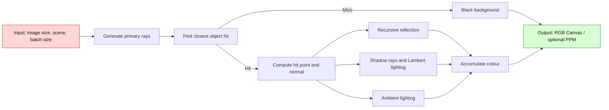
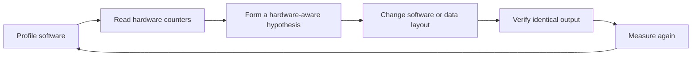
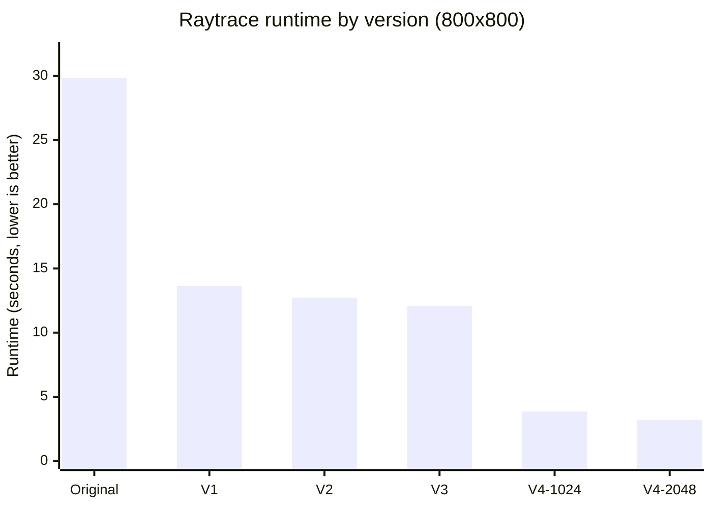

```mermaid
flowchart LR
    I["Input: independent rays"]:::input --> P["Store ray coordinates in arrays"]
    P --> B["Process one group of rays"]
    B --> U["NumPy performs the calculations"]
    U --> F["Keep active rays and calculate reflections"]
    F --> C["Convert colours to RGB"]
    C --> O["Output: byte-identical RGB pixels"]:::output
    classDef input fill:#ffd6d6,stroke:#b91c1c,color:#111
    classDef output fill:#d9fdd3,stroke:#15803d,color:#111
```

# האצת Raytracing באמצעות Software–Hardware Co-Design

## מסע הדרגתי מעיבוד Ray אחד בכל פעם לעיבוד קבוצות עם NumPy

### תקציר מנהלים

הסיפור של העבודה הזאת מתחיל ב־Raytracer קטן וברור, אבל יקר מאוד להרצה: לכל pixel נוצר Ray, לכל Ray נבדקים כל האובייקטים, ולכל פגיעה מחושבים reflection, תאורה ו־shadow rays. בגרסה המקורית, רינדור התמונה שנמדדה בגודל 800×800 pixels ארך **29.833 שניות**.

לא שינינו את הבעיה, לא הורדנו precision, לא הוספנו threads ולא כתבנו RTL. במקום זאת עבדנו בלולאת Software–Hardware Co-Design: קראנו את ה־profiling ואת ה־hardware counters, מצאנו איזו עבודה מיותרת התוכנה מבקשת מה־CPU לבצע, שינינו את הקוד ואת צורת ארגון הנתונים, מדדנו שוב, ורק אז עברנו לצעד הבא.

אחרי ארבעה שלבים מצטברים, זמן הריצה ירד ל־**3.184 שניות** עם batch size של 2048. זהו speedup של **9.37×** והפחתה של **89.33%** בזמן. במקביל, מספר ה־instructions ירד ב־**90.18%** ומספר ה־cycles ירד ב־**88.62%**. כל שש התמונות השמורות — Original, ‏V1, ‏V2, ‏V3, ‏V4/1024 ו־V4/2048 — זהות byte-for-byte ובעלות אותו SHA-256.

המחיר של V4 הוא שימוש ביותר memory בזמן הריצה: כמות ה־RAM המרבית שנמדדה (Peak RSS) עלתה מכ־36.27 MiB לכ־48.91 MiB. בתמורה, Python משקיעה הרבה פחות זמן בניהול objects ובקריאות לפונקציות קטנות, ו־NumPy יכולה לבצע אותה פעולה על קבוצה של rays יחד. זו בדיוק נקודת המבט של Co-Design: לא כל מדד משתפר יחד, ולכן בוחרים פשרה שנותנת את זמן הריצה הטוב ביותר בלי לשנות את התוצאה.

### מילון קצר לפני שמתחילים

כדי שהדוח יהיה נוח לקריאה, כדאי להכיר כמה מושגים שחוזרים בו. **Python object** הוא ערך ש־Python שומר יחד עם מידע נוסף הדרוש לניהולו. נוח לעבוד כך, אבל הניהול עולה זמן ו־memory. **Temporary object** הוא object שנוצר לצורך חישוב קצר ומיד אחר כך כבר אינו נחוץ. **Method call** היא קריאה לפונקציה השייכת ל־object, לדוגמה vector.normalized(); לפני ההרצה Python צריכה למצוא את ה־method ולהכין את הקריאה.

בהמשך נשתמש במילה **Batch** כדי לתאר קבוצה של rays שמעובדת יחד במקום Ray אחד בכל פעם. **Compiled NumPy code** הוא אוסף פונקציות של NumPy שכבר תורגמו לקוד מכונה, ולכן אינן עוברות שורת Python עבור כל מספר. בצד ה־hardware, **Instruction** היא פעולה בסיסית שה־CPU מבצע, ו־**Cycle** היא פעימת שעון שלו. בדרך כלל פחות instructions ופחות cycles עבור אותה תוצאה פירושם פחות עבודה. **Cache** הוא memory קטן ומהיר הקרוב ל־CPU, ולכן נתון שכבר נמצא בו נגיש מהר יותר מנתון שצריך להביא מ־memory רחוק יותר.

---

## 1. Overview — מה ה־benchmark עושה?

### 1.1 הבעיה שאנו פותרים

raytrace הוא benchmark מתוך suite בסגנון pyperformance. המדידה עצמה נעשית בעזרת ספריית pyperf, שאותה הקוד מייבא ישירות. חשוב להבדיל בין השניים: pyperformance הוא ה־suite, ו־pyperf הוא כלי המדידה.

ה־benchmark בונה Scene קבוע. ה־Camera נמצאת במיקום (0, 1.8, 10), מסתכלת אל (0, 3, 0), ומשתמשת ב־field of view של 45°. בתוך ה־Scene נמצאים שני מקורות אור, Sphere צהוב גדול, שישה Spheres קטנים ו־Halfspace עם CheckerboardSurface המשמש כרצפה. בסך הכול יש שמונה אובייקטים ושני מקורות אור. חישוב ה־reflection יכול להמשיך באופן רקורסיבי עד ארבע רמות; הקריאה הבאה כבר מחזירה צבע שחור.

לכל pixel נבנה primary ray — קו דמיוני שיוצא מה־Camera ועובר דרך אותו pixel. הקוד מאתר את האובייקט הראשון שהקו פוגש ומחשב את ה־normal, כלומר כיוון היוצא ישר מפני השטח. אחר כך הוא מחבר שלושה רכיבי צבע: specular reflection הוא ההשתקפות דמוית־המראה, diffuse lighting הוא האור הישיר על המשטח, ו־ambient lighting הוא אור בסיסי חלש. Shadow ray נוסף בודק אם אובייקט אחר חוסם את הדרך אל האור. אם ה־primary ray אינו פוגע בדבר, ה־pixel שחור.

### 1.2 המתמטיקה שנשמרה לאורך כל הדרך

ה־Ray מיוצג על ידי:

$$P(t)=P_0+tD$$

עבור Sphere, הקוד מחשב:

$$CP=C-P_0$$

$$v=CP\cdot D$$

$$\Delta=r^2-(CP\cdot CP-v^2)$$

הערך $\Delta$ אומר אם ה־Ray פוגע ב־Sphere: ערך שלילי פירושו שאין פגיעה. אם $\Delta \ge 0$, נבחר השורש הקטן, ו־$t$ מציין כמה צריך להתקדם לאורך ה־Ray עד נקודת הפגיעה:

$$t=v-\sqrt{\Delta}$$

מודל הצבע ניתן לתיאור כך:

$$C=k_sC_{reflection}+k_d\min\left(1,\sum_{visible}\max(0,L\cdot N)\right)C_{base}+k_aC_{base}$$

ברירת המחדל של SimpleSurface היא $k_s=0.2$, ‏$k_d=0.6$, ‏$k_a=0.2$. בכל שלבי האופטימיזציה שמרנו על סדר הפעולות, על דיוק float64 של 64 bits, על סדר האובייקטים והאורות, ועל חוקי הבחירה של הפגיעה.

### 1.3 ספריות ומבני נתונים

הטבלה מפרטת רק את הספריות ואת מבני הנתונים המרכזיים שבהם הקוד משתמש.

| Category | Name | Simple purpose |
|---|---|---|
| Library | array | Provides the byte array used for RGB output |
| Library | math | Provides sqrt, tan and pi |
| Library | pyperf | Measures benchmark runtime |
| Library | os | Sets NumPy-related thread limits in V4 |
| Library | NumPy 2.5.3 | Processes groups of rays in V4 |
| Data structure | Vector, Point, Ray | Store directions, positions and rays |
| Data structure | Sphere, Halfspace | Represent scene geometry |
| Data structure | Scene | Stores objects, lights and camera settings |
| Data structure | SimpleSurface, CheckerboardSurface | Store colour and lighting settings |
| Data structure | Canvas, array.array('B') | Store three RGB bytes for every pixel |
| Data structure | BatchedRenderer | Processes groups of rays with NumPy in V4 |
| Data structure | Python list and tuple | Store objects, surfaces, lights and colours |
| Data structure | NumPy float64 arrays | Store many ray coordinates together in V4 |
| Data structure | NumPy Boolean arrays | Mark which rays are active, hit or blocked in V4 |

בגרסה המקורית, כל coordinate הוא float רגיל של Python שנמצא בתוך Vector, ‏Point או Ray. זה נוח וברור, אבל חיבור או נרמול של vectors יוצר לעיתים object חדש וקורא לכמה methods קטנים. ב־V4, החישובים החמים משתמשים גם במערכים שבהם נמצאים יחד ערכי x, ‏y ו־z של rays רבים. כך NumPy יכולה לבצע פעולה אחת על קבוצה של rays, במקום ש־Python תטפל בכל Ray בנפרד.

### 1.4 מה נכלל בזמן המדוד?

ה־timer של bench_raytrace מתחיל לפני יצירת ה־Canvas ובניית ה־Scene, ולכן הוא כולל אתחול של ה־Canvas, יצירת האובייקטים, החומרים והאורות, יצירת ה־rays, חישוב הפגיעות, shading וכתיבת ה־pixels ל־Canvas. ב־V4 נכללים בזמן הזה גם יצירת BatchedRenderer והמרת נתוני ה־Scene למערכי NumPy.

כתיבת קובץ ה־PPM האופציונלי מתבצעת אחרי עצירת ה־timer, ולכן אינה מנפחת את ה־speedup. כל מדידות ההשוואה שניתנו בוצעו במפורש על 800×800 pixels, גם אם ברירות המחדל ההיסטוריות בחלק מהקבצים שונות.

---

## 2. Initial Analysis — להבין לאן הזמן הולך

### 2.1 סביבת המדידה

כל הגרסאות נמדדו עם אותו גודל תמונה ואותו סוג סביבה. V4 מגבילה במפורש את ספריות החישוב ל־thread יחיד, כך שההאצה אינה תוצאה של multicore נסתר.

| Property | Recorded value |
|---|---|
| Workload | 800 × 800 pixels |
| CPU | Intel Xeon E5-2630 v3 @ 2.40 GHz |
| Available CPU count | 1 |
| Operating system | Linux 5.15 KVM, x86-64 |
| Python | CPython 3.12.13, 64-bit |
| V4 NumPy | 2.5.3 |
| V4 numeric-library thread limit | 1 |
| Profiling event | cpu-clock, 199 Hz |
| Hardware measurement | perf stat |

### 2.2 ה־Flame Graph המקורי

ב־Flame Graph, כל מלבן מייצג function. מלבן רחב יותר פירושו שה־profiler ראה את אותה function לעיתים קרובות יותר, ולכן כדאי לבדוק אותה כמועמדת לאופטימיזציה. מלבן יכול להכיל functions שהוא קרא להן, ולכן האחוזים חופפים ואין לחבר אותם. ה־profiling נעשה עם גרסת Python שמציגה מידע מפורט יותר על הקריאות; לזמני הריצה עצמם אנו משתמשים ב־pyperf.

ה־Flame Graph מספר סיפור עקבי: כמעט כל העבודה נמצאת בתוך Scene.render, ורוב העבודה ממשיכה דרך rayColour, ‏colourAt, בדיקות האם האור חסום וחישובי Sphere. הטבלה מדרגת את ה־functions לפי חלקן בדגימות; כאן חץ למעלה פירושו “יעד חשוב יותר לבדיקה”, לא “קוד מהיר יותר”.

| Original function | Profiler sample share (%) ↑ |
|---|---:|
| Scene.render | **73.56** |
| Scene.rayColour | 62.73 |
| SimpleSurface.colourAt | 41.03 |
| Scene.visibleLights | 22.38 |
| Scene._lightIsVisible | 22.12 |
| Sphere.intersectionTime | 16.60 |
| Point subtraction | 5.44 |
| Vector.dot | 5.40 |

### 2.3 מה ראינו מעבר ל־Flame Graph?

בגרסה המקורית נמדדו כ־71.648 billion cycles, ‏186.717 billion instructions ו־30.397 billion branch instructions. ה־CPU היה עסוק כמעט לחלוטין. כלומר, הבעיה לא הייתה CPU “רדום”; הוא ביצע הרבה מאוד פעולות כדי לנהל Python objects וקריאות ל־methods, אף שהמתמטיקה עצמה קצרה יחסית.

הקוד וה־profiling הצביעו על ארבע סיבות מרכזיות לבזבוז. ראשית, אותם camera components, ‏shadow directions ו־$r^2$ חושבו שוב ושוב. שנית, פעולות חשבון פשוטות יצרו Vector, ‏Point, lists ו־tuples שנדרשו רק לרגע. בנוסף, חישוב מתמטי קצר עבר לעיתים דרך כמה methods ובדיקות של סוג האובייקט. לבסוף, Python עיבדה כל Ray בנפרד אף שאין תלות בין rays שונים. זו הייתה נקודת המפתח: לפני שמנסים להאיץ את המתמטיקה עצמה, כדאי לצמצם את כל העבודה שמקיפה אותה.

---

## 3. Optimizations — המסע, צעד אחר צעד

כל גרסה נבנתה על הגרסה שקדמה לה. אלה אינן ארבע חלופות נפרדות, אלא תהליך מצטבר: בכל שלב זיהינו עבודה מיותרת, שינינו חלק ממוקד בקוד, מדדנו שוב, ורק אז החלטנו מהו השיפור הבא.

### 3.1 V1 — קודם כול מפסיקים לבזבז עבודה

השלב הראשון סיפק את השיפור הגדול ביותר מבין הגרסאות שעדיין מעבדות Ray אחד בכל פעם. האלגוריתם של ה־Raytracer לא השתנה. במקום זאת, חיפשנו פעולות שה־CPU ביצע שוב ושוב אף שלא היה בהן צורך.

השינוי הראשון היה שימוש ב־Python slots במחלקות Vector, ‏Point ו־Ray. בדרך כלל object של Python מחזיק מבנה פנימי שמאפשר להוסיף לו שדות באופן חופשי. במקרה שלנו רשימת השדות ידועה מראש: ל־Vector ול־Point יש רק x, ‏y ו־z, ול־Ray יש רק point ו־vector. הגדרת השדות מראש מאפשרת ל־Python לנהל פחות מידע עבור כל object. ערכי ה־coordinates עצמם נשארו ערכי float רגילים של Python; רק צורת שמירת השדות נעשתה פשוטה יותר.

לאחר מכן פישטנו את חישוב הפגיעה ב־Sphere. הקוד המקורי יצר Vector ביניים בשם cp וקרא כמה פעמים לפונקציה dot. ב־V1 אותם x, ‏y ו־z נשמרים במשתנים מקומיים, והנוסחה המתמטית נכתבת ישירות. התוצאה נשארת זהה, אך נחסכים object זמני וכמה קריאות לפונקציות.

גם חישובי ה־Camera חזרו על עצמם יותר מהנדרש. בקוד המקורי הרכיבים xcomp ו־ycomp חושבו מחדש לכל pixel. בתמונה של 800×800 pixels נוצרו כך 1,280,000 Vector objects רק עבור שני ה־offsets האלה. ב־V1 הרכיב האופקי מחושב פעם אחת לכל column והרכיב האנכי פעם אחת לכל row. מספר ה־Vector objects שנחסכים הוא:

$$2WH-W-H=1{,}278{,}400$$

בנוסף לכך נחסכות פעולות החיבור והכפל שנדרשו כדי ליצור אותם.

השלב הבא היה פישוט החיפוש אחר הפגיעה הקרובה ביותר. הקוד המקורי יצר עבור כל Ray רשימה של שמונה tuples, ולאחר מכן עבר על הרשימה פעם נוספת באמצעות firstIntersection. ב־V1 עוברים על כל object פעם אחת ושומרים מיד את הפגיעה הקרובה ביותר שנמצאה. כללי הבחירה נשמרו: אותו EPSILON, אותו סדר objects, ואותה בחירה ב־object הראשון כאשר שתי פגיעות שוות.

מצאנו חזרה דומה גם בחישובי shadow. במקור נבנה מחדש Ray מהנקודה אל האור עבור כל object, ובכל פעם הכיוון שלו הומר לאורך 1. לאחר שהתברר שהאור אינו חסום, אותה המרה בוצעה שוב עבור חישוב התאורה. ב־V1 נבנה Shadow Ray אחד לכל צמד של point ו־light. אותו Ray משמש לכל בדיקות החסימה, ולאחר מכן אותו כיוון משמש גם לחישוב התאורה.

לבסוף הוסרה פעולה שלא השפיעה כלל על התוצאה. ב־CheckerboardSurface הייתה קריאת scale שיצרה Vector חדש, אך הקוד לא שמר אותו ולא השתמש בו. הסרת הקריאה מפסיקה ליצור object ולבצע חישוב חסר השפעה. הדוגמה המצוירת נשארת זהה, וגם ההתנהגות המקורית שבה checkSize אינו משפיע נשמרת.

לאחר כל השינויים האלה זמן הריצה ירד מ־29.833 ל־13.637 שניות. זהו speedup של 2.19× והפחתה של 54.29% בזמן הריצה. מספר ה־instructions ירד בכ־55.56% לעומת Original. התוצאה הזו הראתה שחלק גדול מהזמן המקורי הושקע בחישובים חוזרים וביצירת objects זמניים, ולא בחוסר באלגוריתם חיתוך טוב יותר.

### 3.2 V2 — מקצרים את הדרך למתמטיקה

אחרי V1 הקוד כבר ביצע פחות עבודה מיותרת, אך כל Ray עדיין עבר דרך פונקציות קטנות רבות, ובהן normalized, ‏pointAtTime, ‏normalAt ו־reflectThrough. כל קריאה כזו קצרה, אבל כשהיא מתבצעת פעמים רבות עבור כל pixel, העלות המצטברת נעשית משמעותית.

ב־V2 כתבנו את המתמטיקה ישירות בתוך ארבע הפונקציות שנקראו שוב ושוב. Vector.normalized מחשבת ישירות את $x^2+y^2+z^2$, את sqrt, את החלוקה ואת שלוש פעולות הכפל, במקום לעבור בשרשרת magnitude → dot → scale. הפונקציה Vector.reflectThrough עדיין משתמשת ב־dot, אך יוצרת רק Vector אחד עבור התוצאה במקום שלושה Vector objects זמניים. הפונקציה Ray.pointAtTime יוצרת ישירות את ה־Point הסופי, בלי ליצור קודם Vector נוסף. באופן דומה, Sphere.normalAt מחשבת את הכיוון ואת אורכו במקום אחד ויוצרת רק את ה־normal הסופי.

הנוסחאות קוצרו, אך סדר פעולות החשבון נשמר כדי למנוע אפילו שינוי קטן שנובע מ־rounding. לדוגמה, Sphere.normalAt עדיין מנרמלת את ה־Vector ואינה מחלקת פשוט ברדיוס. גם חישוב ה־reflection שומר על שתי פעולות הכפל שהיו בקוד המקורי.

מבחינת ה־CPU, השינוי אומר ש־Python מבצעת פחות קריאות לפונקציות ויוצרת פחות objects זמניים בדרך לאותה תשובה. זמן הריצה ירד מ־13.637 ל־12.734 שניות, שיפור נוסף של 6.62%. ה־speedup המצטבר לעומת Original עלה ל־2.34×.

### 3.3 V3 — מחשבים פעם אחת ערכים שאינם משתנים

לאחר V2 נשארו שתי פעולות קטנות שחזרו מספר רב של פעמים. ריבוע הרדיוס חושב בכל בדיקת Sphere אף שהרדיוס נשאר קבוע, והסכום של כיוון המבט וההזזה האופקית חושב לכל pixel אף שהוא קבוע לאורך column שלם.

ב־V3 הערך radiusSquared מחושב בזמן יצירת כל Sphere ונשמר לשימוש חוזר. בנוסף, עבור כל column נשמרת פעם אחת התוצאה של eye.vector + horizontalOffset. בתמונה של 800×800, שמירת הביטוי השני חוסכת:

$$WH-W=639{,}200$$

יצירות של Vector objects, וכן 1,917,600 חיבורים של coordinates בכל render. החישוב המקדים עדיין מתבצע בתוך הזמן המדוד, ולכן העבודה לא הועברה אל מחוץ ל־benchmark.

הרעיון בשלב הזה פשוט: כאשר ערך אינו משתנה בתוך לולאה, עדיף לחשב אותו פעם אחת לפני הלולאה ולשמור אותו. השימוש במעט memory נוסף חוסך מספר גדול של חישובים חוזרים. השינוי מניח שה־Scene נשאר סטטי. אם משנים את radius לאחר יצירת ה־Sphere, צריך לעדכן גם את radiusSquared.

זמן הריצה ירד מ־12.734 ל־12.076 שניות. זהו שיפור נוסף של 5.17% ו־speedup מצטבר של 2.47× לעומת Original.

### 3.4 V4 — משנים את צורת העבודה כדי להתאים ל־hardware

שלושת השלבים הראשונים הפכו את הקוד ליעיל הרבה יותר, אך Python עדיין עיבדה כל Ray בנפרד. בכל Ray היא ניהלה את הלולאות, קראה לפונקציות ויצרה את ה־objects הדרושים לחישוב. ב־V4 שינינו את צורת העבודה: Rays שאינם תלויים זה בזה נאספים לקבוצות, שנקראות batches, ו־NumPy מבצעת את אותו חישוב על כל הקבוצה.

BatchedRenderer נוצר בתוך ה־timer, ולכן גם עלות ההכנה שלו נכללת במדידה. בתחילת כל render הוא ממיר פעם אחת את נתוני ה־objects, החומרים והאורות למערכי NumPy. ה־coordinates נשמרים כ־float64 במערך שצורתו (3, N): השורה הראשונה מכילה את ערכי x, השנייה את ערכי y והשלישית את ערכי z, וכל עמודה מייצגת Ray אחד.

ה־primary rays נוצרים לפי סדר ה־pixels בתמונה ומחולקים לקבוצות עוקבות. אם מספר ה־pixels אינו מתחלק בדיוק בגודל ה־batch, הקבוצה האחרונה פשוט קטנה יותר. עבור כל object מחושב זמן הפגיעה של כל ה־rays שעדיין פעילים. סדר ה־objects נשמר, וכאשר שתי פגיעות שוות עדיין נבחר ה־object הראשון. בזמן בדיקות shadow, ‏Rays שכבר נחסמו אינם ממשיכים לבדיקה מול ה־object הבא. מערכי True/False מסמנים אילו Rays פגעו, אילו נחסמו ואילו עדיין צריכים לעבור חישוב reflection.

גם סדר צבירת הצבע נשמר בדיוק: תחילה reflection, אחריו diffuse ולבסוף ambient. בסיום החישוב הצבעים עדיין עוברים דרך Canvas.plot המקורית. כך נשמרים אותו חיתוך של הספרות, אותה הגבלה לטווח 0…255 ואותו כיוון של התמונה.

זהו החיבור המרכזי ל־Software–Hardware Co-Design. האלגוריתם נשאר אותו Raytracer, אך העבודה נמסרת ל־CPU בצורה שמתאימה לו יותר. Coordinates של Rays רבים נשמרים יחד במערכי NumPy, וקריאת NumPy אחת מחליפה מאות או אלפי סיבובים של לולאת Python. NumPy מפעילה פונקציות שכבר קומפלו לקוד מכונה, וחלק מהן יכולות להשתמש ב־SIMD, כלומר instruction יחיד של ה־CPU שמטפל בכמה מספרים יחד. בנוסף, עלות ההכנה של כל קריאת NumPy מתחלקת בין Rays רבים.

ב־profiling הופיעו שמות כגון DOUBLE_multiply_X86_V3, ‏DOUBLE_add_X86_V3 ו־DOUBLE_subtract_X86_V3. השמות מראים ש־NumPy בחרה פונקציות חישוב שמותאמות למשפחת ה־CPU. עם זאת, לא מדדנו ישירות את מספר ה־SIMD instructions, ולכן איננו טוענים שכל פעולה השתמשה ב־SIMD.

מספר ה־threads הוגבל ל־1 לפני טעינת NumPy. לכן V4 משתמשת ב־CPU core אחד בלבד, וה־speedup אינו נובע משימוש ב־cores נוספים. השיפור הגיע מכך ש־NumPy מבצעת חישובים רבים בקוד מכונה, בעוד Python נדרשת לנהל הרבה פחות עבודה עבור כל Ray.

Batch size הוא מספר ה־Rays שמעובדים יחד. Batch גדול מפחית את מספר הקריאות ל־NumPy, אך דורש arrays זמניים גדולים יותר. ברירת המחדל הסופית היא batch size של 2048. מערך coordinates יחיד בגודל $3 \times 2048 \times 8$ bytes תופס כ־48 KiB, לעומת כ־24 KiB כאשר batch size הוא 1024. בזמן החישוב קיימים כמה arrays יחד, ולכן batch גדול יותר עלול להשתמש ביותר memory. מסיבה זו מדדנו את שני הגדלים במקום להניח מראש איזה מהם יהיה טוב יותר.

עם batch size של 2048 זמן הריצה ירד מ־12.076 שניות ב־V3 ל־3.184 שניות ב־V4. זהו שיפור של 3.79× בשלב אחד והפחתה של 73.64% בזמן הריצה לעומת V3.

### 3.5 סיכום רעיוני של ארבעת השלבים

הטבלה הבאה מרכזת את הדרך שעברנו. כל שורה מתארת בעיה שהתגלתה לאחר המדידה הקודמת, את השינוי שנעשה בעקבותיה ואת ההשפעה על עבודת ה־CPU.

| Stage | Problem found | Change made | Result for the CPU |
|---|---|---|---|
| V1 | Repeated calculations and many temporary objects | Reuse values, scan objects once and calculate sphere values directly | Fewer Python operations and object creations |
| V2 | Small calculations required many Python function calls | Write four formulas directly where they are used | Fewer function calls and temporary objects |
| V3 | Constant values were recalculated inside loops | Calculate radius and camera values once | Fewer repeated calculations |
| V4 | Python still processed one ray at a time | Group rays in NumPy arrays and process them together | Much less Python work per ray |
---

## 4. Performance Comparison — מה השתפר בפועל?

### 4.1 זמני הריצה המצטברים

הערכים נלקחו ישירות מ־timing.json. כל השורות משתמשות ב־800×800 pixels. V4 מופיעה בשני גדלי batch כנדרש; בכל שאר הדיון V4 מתייחסת כברירת מחדל ל־2048.

| Version | Runtime (s) ↓ | Speedup vs Original (×) ↑ | Time reduction vs Original (%) ↑ | Maximum RAM (MiB) ↓ |
|---|---:|---:|---:|---:|
| Original | 29.833 | 1.00 | 0.00 | **36.27** |
| V1 | 13.637 | 2.19 | 54.29 | 36.39 |
| V2 | 12.734 | 2.34 | 57.31 | 36.43 |
| V3 | 12.076 | 2.47 | 59.52 | 36.48 |
| V4, batch 1024 | 3.862 | 7.72 | 87.05 | 48.97 |
| V4, batch 2048 | **3.184** | **9.37** | **89.33** | 48.91 |

הגרף ממחיש שני פרקים שונים בסיפור: V1 מסירה הרבה פעולות ניהול מיותרות של Python בבת אחת; V2 ו־V3 ממשיכות לצמצם חישובים וקריאות; V4 מעבדת rays רבים יחד ומביאה קפיצה נוספת.

### 4.2 התרומה של כל שלב לעומת קודמו

כאן V4 מיוצגת רק בברירת המחדל 2048, כדי לא לערבב configuration חלופי עם שלב אופטימיזציה נוסף.

| Stage | Runtime (s) ↓ | Incremental speedup (×) ↑ | Incremental time reduction (%) ↑ | Cumulative speedup (×) ↑ |
|---|---:|---:|---:|---:|
| Original | 29.833 | 1.000 | 0.00 | 1.00 |
| V1 | 13.637 | 2.188 | 54.29 | 2.19 |
| V2 | 12.734 | 1.071 | 6.62 | 2.34 |
| V3 | 12.076 | 1.055 | 5.17 | 2.47 |
| V4, batch 2048 | **3.184** | **3.793** | **73.64** | **9.37** |

### 4.3 מדוע 2048 נבחר כברירת המחדל?

| Batch size | Runtime (s) ↓ | Speedup vs Original (×) ↑ | Speedup vs 1024 (×) ↑ | Cycles (B) ↓ | Instructions (B) ↓ | Maximum RAM (MiB) ↓ |
|---:|---:|---:|---:|---:|---:|---:|
| 1024 | 3.862 | 7.72 | 1.00 | 9.715 | 21.010 | 48.97 |
| 2048 | **3.184** | **9.37** | **1.21** | **8.150** | **18.345** | **48.91** |

2048 קצר ב־17.57% בזמן לעומת 1024, עם 16.10% פחות cycles ו־12.69% פחות instructions. כמות ה־RAM המרבית שנמדדה כמעט זהה. ב־2048 העלות הקבועה של כל קריאת NumPy מתחלקת בין יותר rays. במקרה שנמדד, החיסכון הזה היה גדול יותר מהעלות של arrays גדולים יותר, ולכן 2048 היא הבחירה הנכונה.

### 4.4 Hardware counters לאורך המסע

כדי לקרוא את הטבלה חשוב להבין מה כל מדד מייצג. Cycles הן פעימות השעון שעברו בזמן העבודה, ו־Instructions הן הפעולות הבסיסיות שה־CPU ביצע. Branch instructions הן נקודות החלטה בקוד, ו־branch misses הן החלטות שה־CPU ניחש לא נכון ונאלץ לתקן. L1D הוא ה־data cache הקרוב והמהיר ביותר של ה־CPU. המדד IPC מתאר כמה instructions הסתיימו בממוצע בכל cycle, אך ערך IPC גבוה לבדו אינו מבטיח זמן ריצה נמוך, מפני שחשוב גם כמה instructions יש בסך הכול.

הטבלה מציגה את הסכומים מתוך perf stat. האות B פירושה billion והאות M פירושה million. ה־CPU אינו יכול למדוד את כל האירועים בו־זמנית, ולכן perf עבר ביניהם והעריך את הסכומים. ההבדלים הגדולים שימושיים, אך אין לייחס משמעות רבה להבדלים קטנים.

| Version | Cycles (B) ↓ | Instructions (B) ↓ | Branch instructions (B) ↓ | Branch misses (M) ↓ | L1D loads (B) ↓ | L1D misses (M) ↓ | IPC ↑ |
|---|---:|---:|---:|---:|---:|---:|---:|
| Original | 71.648 | 186.717 | 30.397 | 173.482 | 42.988 | 585.915 | **2.606** |
| V1 | 33.030 | 82.982 | 13.709 | 79.909 | 19.108 | 410.781 | 2.512 |
| V2 | 30.326 | 77.799 | 12.949 | 68.097 | 18.230 | 326.121 | 2.565 |
| V3 | 29.442 | 74.432 | 12.386 | 66.875 | 17.154 | 376.699 | 2.528 |
| V4, batch 1024 | 9.715 | 21.010 | 3.579 | 24.252 | 4.304 | 213.002 | 2.163 |
| V4, batch 2048 | **8.150** | **18.345** | **3.140** | **18.213** | **3.799** | **201.150** | 2.251 |

התובנה החשובה היא שה־IPC הגבוה ביותר דווקא שייך ל־Original, והיא עדיין הגרסה האיטית ביותר. V4 אינה מנצחת מפני שכל cycle “עושה יותר”; היא מנצחת מפני שבסך הכול ה־CPU מקבל הרבה פחות instructions לבצע. במעבר מ־Original ל־V4/2048 מספר ה־instructions ירד ב־90.18%, מספר ה־cycles ירד ב־88.62%, ומספר ה־branch instructions ירד ב־89.67%. במקביל, מספר ה־branch misses ירד ב־89.50%, מספר ה־L1D loads ירד ב־91.16%, ומספר ה־L1D misses המוחלט ירד ב־65.67%.

מצד שני, אחוז הפעמים שבהן הנתון לא נמצא ב־L1D cache עולה מ־1.36% ל־5.29%, וכמות ה־RAM המרבית עולה ב־34.84%. הסיבה היא שב־V4 קיימים arrays זמניים גדולים יותר. למרות זאת, סך ה־instructions וה־cycles קטן כל כך שזמן הריצה הכולל עדיין משתפר פי 9.37.

### 4.5 ה־Flame Graph לאחר V4

ב־V4/2048, ה־functions שטיפלו בכל Ray בנפרד — rayColour, ‏colourAt, ‏visibleLights ו־Sphere.intersectionTime — כבר אינן החלק המרכזי בגרף. BatchedRenderer.render מופיע ב־58.72% מהדגימות, ואילו Canvas.plot — שעדיין כותבת pixel אחד בכל פעם ב־Python כדי לשמר את ההמרה המקורית — מגיעה ל־45.45%. BatchedRenderer.rayColours עצמו מופיע בכ־2.43%, וכל אחת מהפונקציות הקטנות שלו מתחת ל־1%.

זהו רגע חשוב בסיפור: לאחר שמאיצים חלק אחד, חלק אחר שלא השתנה הופך למגבלה החדשה. אחרי שהחישובים עברו ל־batches, המרת הצבע וכתיבת pixels אחד־אחד הפכו ליעד הבא האפשרי.

### 4.6 Original מול התוצאה הסופית

| Metric | Original | V4, batch 2048 | Change | Preferred direction |
|---|---:|---:|---:|---:|
| Runtime (s) ↓ | 29.833 | **3.184** | **−89.33%** | ↓ |
| Speedup (×) ↑ | 1.00 | **9.37** | **9.37× overall** | ↑ |
| Cycles (B) ↓ | 71.648 | **8.150** | **−88.62%** | ↓ |
| Instructions (B) ↓ | 186.717 | **18.345** | **−90.18%** | ↓ |
| Branch instructions (B) ↓ | 30.397 | **3.140** | **−89.67%** | ↓ |
| L1D loads (B) ↓ | 42.988 | **3.799** | **−91.16%** | ↓ |
| Maximum RAM (MiB) ↓ | **36.27** | 48.91 | +34.84% | ↓ |

---

## 5. Verification — הוכחה שלא האצנו על ידי שינוי התוצאה

### 5.1 בדיקת התוצר בפועל

לכל גרסה נשמר קובץ raytrace.ppm של 800×800. ‏SHA-256 הוא מעין טביעת אצבע המחושבת מכל ה־bytes בקובץ. לכל ששת הקבצים יש אותו גודל ואותה טביעת אצבע, ולכן התוצרים השמורים זהים byte-for-byte, כולל ה־header, סדר ה־pixels וערכי RGB.

| Version | File size (bytes) | SHA-256 | Result |
|---|---:|---|---|
| [Original](<../report raytracing/single Orignal/raytrace.ppm>) | **1,920,015** | **3F8C8BBCA2BD3188BA3AD3B95AE29950C53E1F534983D82A6AF15256AB3D59F0** | **BYTE-IDENTICAL** |
| [V1](<../report raytracing/single v1/raytrace.ppm>) | **1,920,015** | **3F8C8BBCA2BD3188BA3AD3B95AE29950C53E1F534983D82A6AF15256AB3D59F0** | **BYTE-IDENTICAL** |
| [V2](<../report raytracing/single v2/raytrace.ppm>) | **1,920,015** | **3F8C8BBCA2BD3188BA3AD3B95AE29950C53E1F534983D82A6AF15256AB3D59F0** | **BYTE-IDENTICAL** |
| [V3](<../report raytracing/single v3/raytrace.ppm>) | **1,920,015** | **3F8C8BBCA2BD3188BA3AD3B95AE29950C53E1F534983D82A6AF15256AB3D59F0** | **BYTE-IDENTICAL** |
| [V4, batch 1024](<../report raytracing/single v4 1024/raytrace.ppm>) | **1,920,015** | **3F8C8BBCA2BD3188BA3AD3B95AE29950C53E1F534983D82A6AF15256AB3D59F0** | **BYTE-IDENTICAL** |
| [V4, batch 2048](<../report raytracing/single v4 2048/raytrace.ppm>) | **1,920,015** | **3F8C8BBCA2BD3188BA3AD3B95AE29950C53E1F534983D82A6AF15256AB3D59F0** | **BYTE-IDENTICAL** |

גודל הקובץ מתאים בדיוק ל־15 bytes של header ועוד $800\cdot800\cdot3=1{,}920{,}000$ bytes של RGB.

### 5.2 פרטים טכניים שנשמרו במכוון

ה־hash הזהה הוא ההוכחה החשובה ביותר, אך כדאי להבין גם כיצד שמרנו על אותה תמונה. בכל הגרסאות נשמרו אותו כלל מתמטי לבחירת נקודת הפגיעה ב־Sphere, אותם ערכי EPSILON לזיהוי פגיעה ו־shadow, אותו סדר objects ואותה בחירה באובייקט הראשון כאשר שתי פגיעות שוות. גם סדר ה־lights, סדר חיבור רכיבי reflection, ‏diffuse ו־ambient, עומק ה־reflection וצורת ה־Camera נשארו ללא שינוי.

גם בשלבים האחרונים לא שינינו את התנהגות ה־Halfspace או את דוגמת ה־checkerboard. המרת RGB עדיין מכפילה ב־255, חותכת את החלק העשרוני ומגבילה את התוצאה לטווח 0…255. כל החישובים נשארו בדיוק float64 ובאותו סדר פעולות חשבון.

OPTIMIZATIONS.md מתעד בנוסף בדיקות במספר גדלי תמונה ומקרי קצה של Sphere, ‏shadow, ‏reflection ו־batches חלקיים. עבור ברירת המחדל החדשה 2048, קובץ ה־PPM השמור מספק בדיקה מלאה של התהליך מתחילתו ועד סופו על תמונה של 800×800.

### 5.3 קישור המדידות לקוד שסופק

לכל run נשמר source_sha256, כלומר טביעת אצבע של קובץ הקוד. לאחר שאיחדנו את סימון סוף השורה של Windows ושל Linux, הטביעות התאימו לכל חמש גרסאות הקוד. לכן ברור איזה קובץ מקור שייך לכל תוצאה.

### 5.4 גבולות ההבטחה

ההוכחה חזקה עבור ה־benchmark וה־Scene שנמדדו, אך אינה טענה שכל API אפשרי נשאר זהה. Python slots מתאימים למחלקות שבהן רשימת השדות ידועה מראש, ולכן אי אפשר להוסיף להן שדות חדשים באופן חופשי. כתיבת הנוסחאות ישירות מתאימה למחלקות הקיימות, ולא ל־subclasses שמשנים את פונקציות העזר. באופן דומה, radiusSquared מניח שהרדיוס אינו משתנה לאחר יצירת ה־Sphere.

BatchedRenderer מכיר את סוגי ה־geometry וה־surface של ה־benchmark ואינו מיועד להיות מערכת plugins כללית. גם קלט לא תקין, Vector באורך אפס או batch size לא תקין אינם חלק מה־workload. הגבולות האלה מקובלים כאן, מפני שהמטרה הייתה לשמר בדיוק את ה־workload המוגדר, ולא להרחיב את ה־Raytracer לספרייה כללית.

---

## 6. Conclusion — מה למדנו מן המסע?

השיפור המרכזי לא הגיע מטריק יחיד. הוא הגיע מסדרה של שאלות פשוטות שנשאלו בסדר הנכון.

בהתחלה שאלנו: **איזו עבודה חוזרת ללא צורך?** התשובה הובילה ל־V1: שימוש חוזר ב־Shadow Rays ובערכי Camera, מעבר אחד על האובייקטים, פחות objects זמניים ושימוש ב־Python slots. זה לבדו חתך יותר ממחצית מזמן הריצה.

לאחר מכן שאלנו: **מדוע פעולה מתמטית קצרה דורשת כל כך הרבה קריאות Python?** התשובה הובילה ל־V2: כתיבת ארבע נוסחאות ישירות במקום שרשרת של פונקציות עזר.

אחר כך שאלנו: **אילו ערכים קבועים בתוך הלולאה?** התשובה הובילה ל־V3, שבה radiusSquared וערכי ה־Camera לכל column מחושבים פעם אחת ונשמרים לשימוש חוזר.

לבסוף שאלנו: **איך כדאי למסור את העבודה ל־CPU?** Rays הם עצמאיים, ולכן V4 ארגנה אותם בקבוצות והעבירה את החישובים למערכי NumPy. כך קריאת NumPy אחת מטפלת ב־rays רבים. מספר ה־instructions ירד בכ־90% וזמן הריצה ירד בכ־89%, בלי threads נוספים ובלי שינוי בתמונה.

התוצאה הסופית היא מעבר מ־29.833 ל־3.184 שניות — **9.37× faster** — עם תוצר 800×800 זהה byte-for-byte. המחיר הוא שימוש בכ־34.84% יותר RAM בשיא. למרות שאחוז ה־L1D cache misses גבוה יותר, מספר ה־misses הכולל עדיין קטן ב־65.67%, משום שה־CPU מבצע הרבה פחות גישות בסך הכול.

זהו Software–Hardware Co-Design במובן המעשי שלו: לא בנינו hardware חדש, אלא שינינו את software כך שה־CPU יבצע פחות עבודה ויקבל rays רבים יחד בצורה שמתאימה ל־NumPy. אחר כך בדקנו בעזרת hardware counters שה־instructions וה־cycles אכן ירדו. המדידות לא היו רק קישוט בדוח; הן עזרו לבחור את הצעד הבא.

ה־Flame Graph הסופי גם מצביע על המשך טבעי: Canvas.plot היא כעת ה־function הבולטת ביותר. אופטימיזציה עתידית יכולה להמיר ולכתוב קבוצה של pixels יחד, אך היא חייבת לשמור בדיוק על אותו עיגול מספרים, אותה הגבלה ל־0…255, אותו סדר שורות ואותם PPM bytes. זה יהיה הפרק הבא באותו סיפור: למדוד, לשנות דבר אחד, ולאמת שוב.

---

## Appendix A — מגבלות וקריאה אחראית של המדידות

קובצי התזמון שסופקו מכילים מדידה שמורה אחת לכל configuration, ולא סדרה שממנה אפשר לחשב את פיזור התוצאות. לכן אנו מדווחים בדיוק את מה שנמדד, בלי לטעון מה יהיה הטווח בהרצות נוספות. Original והגרסאות המשופרות נמדדו בזמנים שונים, אך עם אותו דגם CPU, אותה מהירות מדווחת, אותה גרסת Linux, אותה גרסת Python ו־CPU יחיד. השיפורים הגדולים ברורים; אם רוצים להעריך במדויק הבדל קטן, כדאי לחזור על המדידה כמה פעמים.

Flame Graphs נאספו עם גרסת Python שמספקת מידע מפורט יותר על קריאות לפונקציות, בעוד זמני pyperf נאספו עם גרסת Python הרגילה. לכן Flame Graph משמש לאיתור functions איטיות, ולא לחישוב ה־speedup.

ה־CPU לא יכול היה למדוד את כל ה־hardware counters בו־זמנית, ולכן perf עבר ביניהם והעריך את הסכומים. השינויים הגדולים שימושיים, אך הבדלים קטנים פחות ודאיים. כמה מדדי cache ועיכובים פנימיים של ה־CPU כלל לא היו זמינים, ולכן הדוח אינו מנסה להסביר נתונים שלא נמדדו.

perf stat כולל גם את פתיחת תהליך Python וטעינת הספריות, ולכן זמני pyperf הם המקור להשוואת זמן ה־benchmark עצמו. בחלק מהמדידות תיקיית הקוד הכילה גם שינויים שלא נשמרו ב־Git, אך לכל מדידה נשמר hash של קובץ המקור המדויק והוא תואם לגרסה שסופקה.

## Appendix B — קבצי Profiling

| Version | Flame Graph | Folded stacks source |
|---|---|---|
| Original | [Open SVG](assets/flamegraph-original.svg) | [Open folded stacks](<../report raytracing/single Orignal/speedscope.folded>) |
| V1 | [Open SVG](assets/flamegraph-v1.svg) | [Open folded stacks](<../report raytracing/single v1/speedscope.folded>) |
| V2 | [Open SVG](assets/flamegraph-v2.svg) | [Open folded stacks](<../report raytracing/single v2/speedscope.folded>) |
| V3 | [Open SVG](assets/flamegraph-v3.svg) | [Open folded stacks](<../report raytracing/single v3/speedscope.folded>) |
| V4, batch 1024 | [Open SVG](assets/flamegraph-v4-1024.svg) | [Open folded stacks](<../report raytracing/single v4 1024/speedscope.folded>) |
| V4, batch 2048 | [Open SVG](assets/flamegraph-v4-2048.svg) | [Open folded stacks](<../report raytracing/single v4 2048/speedscope.folded>) |

## Appendix C — מקורות הנתונים הגולמיים

| Version | Timing | Hardware counters | Profiling report | Run metadata |
|---|---|---|---|---|
| Original | [timing.json](<../report raytracing/single Orignal/timing.json>) | [perf_stat.txt](<../report raytracing/single Orignal/perf_stat.txt>) | [perf_report.txt](<../report raytracing/single Orignal/perf_report.txt>) | [run_metadata.txt](<../report raytracing/single Orignal/run_metadata.txt>) |
| V1 | [timing.json](<../report raytracing/single v1/timing.json>) | [perf_stat.txt](<../report raytracing/single v1/perf_stat.txt>) | [perf_report.txt](<../report raytracing/single v1/perf_report.txt>) | [run_metadata.txt](<../report raytracing/single v1/run_metadata.txt>) |
| V2 | [timing.json](<../report raytracing/single v2/timing.json>) | [perf_stat.txt](<../report raytracing/single v2/perf_stat.txt>) | [perf_report.txt](<../report raytracing/single v2/perf_report.txt>) | [run_metadata.txt](<../report raytracing/single v2/run_metadata.txt>) |
| V3 | [timing.json](<../report raytracing/single v3/timing.json>) | [perf_stat.txt](<../report raytracing/single v3/perf_stat.txt>) | [perf_report.txt](<../report raytracing/single v3/perf_report.txt>) | [run_metadata.txt](<../report raytracing/single v3/run_metadata.txt>) |
| V4, batch 1024 | [timing.json](<../report raytracing/single v4 1024/timing.json>) | [perf_stat.txt](<../report raytracing/single v4 1024/perf_stat.txt>) | [perf_report.txt](<../report raytracing/single v4 1024/perf_report.txt>) | [run_metadata.txt](<../report raytracing/single v4 1024/run_metadata.txt>) |
| V4, batch 2048 | [timing.json](<../report raytracing/single v4 2048/timing.json>) | [perf_stat.txt](<../report raytracing/single v4 2048/perf_stat.txt>) | [perf_report.txt](<../report raytracing/single v4 2048/perf_report.txt>) | [run_metadata.txt](<../report raytracing/single v4 2048/run_metadata.txt>) |

## Appendix D — גרסאות הקוד שנמדדו

ה־hashes בטבלה הם טביעות האצבע שנשמרו בזמן כל מדידה. הם תואמים לקבצים המקומיים לאחר שאיחדנו את סימון סוף השורה של Windows ושל Linux.

| Version | Source file | Recorded source SHA-256 | Snapshot check |
|---|---|---|---|
| Original | [Open source](../suites/original/bm_raytrace/run_benchmark.py) | 88ef4d9060d8e8f6ce40f376477aaf89cc808fa44813225a3071a05a1467f017 | **MATCH** |
| V1 | [Open source](<../suites/optimized/bm_raytrace/run_benchmark - First Improvemnt 2x speed.py>) | 35872f2da93b7017c640ccf29dc0836f220581ddbbd4b2041a4ffb5c625b5154 | **MATCH** |
| V2 | [Open source](<../suites/optimized/bm_raytrace/run_benchmark - Second Improvent remove direct function calls and write the math.py>) | 79b0af0a0c8f2f53783ae92bf232626128da14c0b829735a30300cd54d42b34f | **MATCH** |
| V3 | [Open source](<../suites/optimized/bm_raytrace/run_benchmark - Third improvement - chacing the radious and camera values instead of repeated calcs.py>) | 373cc992befa2630fc74bce65dc9ec1aea297810ee52bbf6cbbce3b2c6bd8d34 | **MATCH** |
| V4 | [Open source](../suites/optimized/bm_raytrace/run_benchmark.py) | be6eee7feabb67293512738eb68bbc569766a69b817e65ff1c72130ce7f2a432 | **MATCH** |

מסמך התכנון המלא ששימש לפענוח הכוונה של כל שלב: [OPTIMIZATIONS.md](../suites/optimized/bm_raytrace/OPTIMIZATIONS.md).
