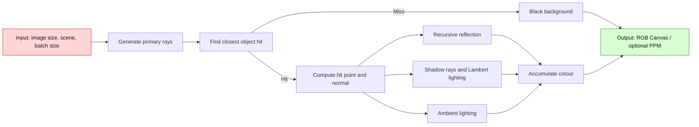
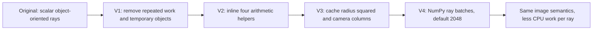
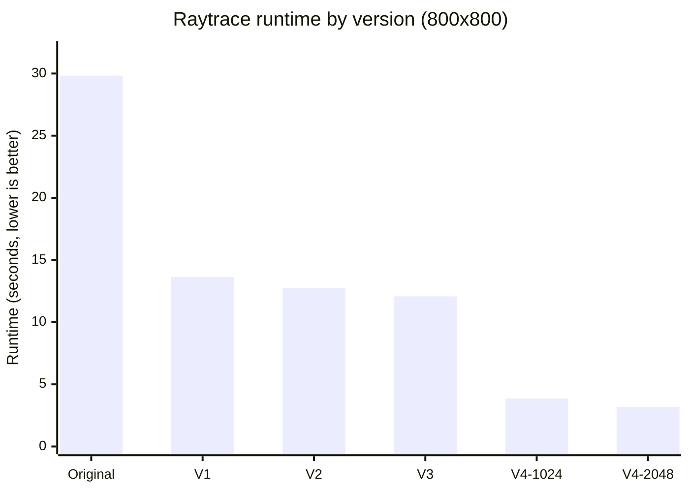

# האצת Raytracing באמצעות Software–Hardware Co-Design

## מסע הדרגתי מקוד Python סקלרי ל־NumPy batched renderer

### תקציר מנהלים

הסיפור של העבודה הזאת מתחיל ב־Raytracer קטן וברור, אבל יקר מאוד להרצה: לכל pixel נוצר `Ray`, לכל `Ray` נבדקים כל האובייקטים, ולכל פגיעה מחושבים reflection, תאורה ו־shadow rays. בגרסה המקורית, רינדור התמונה שנמדדה בגודל 800×800 pixels ארך **29.833 שניות**.

לא שינינו את הבעיה, לא הורדנו precision, לא הוספנו threads ולא כתבנו RTL. במקום זאת עבדנו בלולאת Software–Hardware Co-Design: קראנו את ה־profiling ואת ה־hardware counters, מצאנו איזו עבודה מיותרת התוכנה מבקשת מה־CPU לבצע, שינינו את הקוד ואת צורת ארגון הנתונים, מדדנו שוב, ורק אז עברנו לצעד הבא.

אחרי ארבעה שלבים מצטברים, זמן הריצה ירד ל־**3.184 שניות** עם `batch size` של 2048. זהו `speedup` של **9.37×** והפחתה של **89.33%** בזמן. במקביל, מספר ה־instructions ירד ב־**90.18%** ומספר ה־cycles ירד ב־**88.62%**. כל שש התמונות השמורות — Original, ‏V1, ‏V2, ‏V3, ‏V4/1024 ו־V4/2048 — זהות `byte-for-byte` ובעלות אותו `SHA-256`.

המחיר של V4 הוא `working set` גדול יותר: `Peak RSS` עלה מכ־36.27 MiB לכ־48.91 MiB. זו בדיוק נקודת המבט של Co-Design: לא כל מדד משתפר יחד. בחרנו להשקיע יותר memory כדי לצמצם בצורה דרמטית interpreter overhead, לחשוף `data-level parallelism`, ולאפשר ל־NumPy להשתמש ב־compiled kernels המתאימים ל־CPU.

---

## 1. Overview — מה ה־benchmark עושה?

### 1.1 הבעיה שאנו פותרים

`raytrace` הוא benchmark מתוך suite בסגנון `pyperformance`. המדידה עצמה נעשית בעזרת ספריית `pyperf`, שאותה הקוד מייבא ישירות. חשוב להבדיל בין השניים: `pyperformance` הוא ה־suite, ו־`pyperf` הוא כלי המדידה.

ה־benchmark בונה Scene קבוע:

- Camera במיקום `(0, 1.8, 10)`, המסתכלת אל `(0, 3, 0)`, עם `field of view` של 45°.
- שני מקורות אור נקודתיים.
- Sphere צהוב גדול ועוד שישה Spheres קטנים — שבעה Spheres בסך הכול.
- `Halfspace` אחד עם `CheckerboardSurface`, המשמש כרצפה.
- שמונה אובייקטים בסך הכול ושני מקורות אור.
- `reflection` רקורסיבי עד ארבע רמות מחושבות; הקריאה הבאה מוחזרת כשחור.

לכל pixel נבנה `primary ray`. הקוד מאתר את הפגיעה הקרובה ביותר, מחשב את נקודת הפגיעה ואת ה־normal, ואז מחבר שלושה רכיבים: `specular reflection`, ‏`Lambert diffuse lighting` ו־`ambient lighting`. אם אין פגיעה, ה־pixel שחור.

### 1.2 המתמטיקה שנשמרה לאורך כל הדרך

ה־Ray מיוצג על ידי:

$$P(t)=P_0+tD$$

עבור Sphere, הקוד מחשב:

$$CP=C-P_0$$

$$v=CP\cdot D$$

$$\Delta=r^2-(CP\cdot CP-v^2)$$

ואם $\Delta \ge 0$, נבחר השורש הקטן:

$$t=v-\sqrt{\Delta}$$

מודל הצבע ניתן לתיאור כך:

$$C=k_sC_{reflection}+k_d\min\left(1,\sum_{visible}\max(0,L\cdot N)\right)C_{base}+k_aC_{base}$$

ברירת המחדל של `SimpleSurface` היא $k_s=0.2$, ‏$k_d=0.6$, ‏$k_a=0.2$. בכל שלבי האופטימיזציה שמרנו על סדר הפעולות, על `binary64`, על סדר האובייקטים והאורות, ועל חוקי הבחירה של הפגיעה.

### 1.3 ספריות ומבני נתונים

הטבלה הבאה מתארת את אבני הבניין. היא איננה טבלת השוואת ביצועים, ולכן החצים והדגשת “הטוב ביותר” אינם רלוונטיים כאן.

| Component | Original implementation | V4 implementation |
|---|---|---|
| Standard library | `array`, `math` | `array`, `math`, `os` |
| External libraries | `pyperf` | `pyperf`, `NumPy 2.5.3` |
| Geometry objects | `Sphere`, `Halfspace` | Same scalar objects, packed once per render |
| Coordinate objects | `Vector`, `Point`, `Ray` with boxed Python numbers | Same API plus `float64` arrays shaped `(3, N)` in the batched path |
| Scene storage | List of `(geometry, surface)` tuples; list of lights | Same Scene plus packed geometry, material arrays and Boolean masks |
| Pixel storage | `array.array('B')`, three bytes per pixel | Unchanged |
| Execution model | Scalar object-oriented CPython | Single-threaded CPython orchestration plus compiled NumPy elementwise kernels |
| Output | P6 `PPM` | Byte-compatible P6 `PPM` |

בגרסה המקורית, כל `Vector`, ‏`Point` ו־`Ray` הוא Python object, וכל coordinate הוא Python `float` boxed. פעולות פשוטות כמו חיבור vectors כוללות method dispatch, בדיקות type, allocation של object חדש ועדכוני reference count. ב־V4, הנתונים החמים מאורגנים גם כ־`Structure of Arrays`: לכל batch קיימת מטריצה `(3, N)`, שבה כל עמודה היא Ray. כך coordinates רבים מאותו סוג נמצאים ברצף, וה־CPU יכול לעבד אותם באמצעות compiled array kernels.

### 1.4 מה נכלל בזמן המדוד?

ה־timer של `bench_raytrace` כולל בכל איטרציה:

- יצירה ואתחול של `Canvas`.
- בניית ה־Scene, האובייקטים, החומרים והאורות.
- ב־V4, גם יצירת `BatchedRenderer` ואריזת הנתונים.
- יצירת ה־rays, חישוב החיתוכים, shading וכתיבת pixels ל־Canvas.

כתיבת קובץ ה־`PPM` האופציונלי מתבצעת אחרי עצירת ה־timer, ולכן אינה מנפחת את ה־speedup. כל מדידות ההשוואה שניתנו בוצעו במפורש על 800×800 pixels, גם אם ברירות המחדל ההיסטוריות בחלק מהקבצים שונות.

---

## 2. Initial Analysis — להבין לאן הזמן הולך

### 2.1 סביבת המדידה

כל הגרסאות נמדדו עם אותו גודל תמונה ואותו סוג סביבה. V4 מגבילה במפורש את ספריות החישוב ל־thread יחיד, כך שההאצה אינה תוצאה של multicore נסתר.

| Property | Recorded value |
|---|---|
| Workload | `800 × 800` pixels |
| CPU | `Intel Xeon E5-2630 v3 @ 2.40 GHz` |
| Available CPU count | `1` |
| Operating system | `Linux 5.15 KVM, x86-64` |
| Python | `CPython 3.12.13, 64-bit` |
| V4 NumPy | `2.5.3` |
| V4 numeric-library thread limit | `1` |
| Profiling event | `cpu-clock`, 199 Hz |
| Hardware measurement | `perf stat` |

### 2.2 ה־Flame Graph המקורי

ב־Flame Graph, רוחב מסגרת מייצג את חלקה היחסי בדגימות. מסגרות מקוננות הן `inclusive` ולכן אין לחבר את האחוזים שלהן. ה־profiling נעשה עם debug build של Python כדי לקבל stacks ברורים; לכן אנו משתמשים בו לאיתור hotspots, ולא כתחליף לזמני `pyperf`.

ה־Flame Graph מספר סיפור עקבי: כמעט כל העבודה נמצאת בתוך `Scene.render`, ורוב העבודה החמה ממשיכה דרך `rayColour`, ‏`colourAt`, בדיקות visibility וחישובי Sphere. הטבלה מדרגת את היעדים לפי חלקם ה־inclusive; כאן חץ למעלה פירושו “יעד חשוב יותר לבדיקה”, לא “קוד מהיר יותר”.

| Original frame | Hotspot priority share (%) ↑ |
|---|---:|
| `Scene.render` | **73.56** |
| `Scene.rayColour` | 62.73 |
| `SimpleSurface.colourAt` | 41.03 |
| `Scene.visibleLights` | 22.38 |
| `Scene._lightIsVisible` | 22.12 |
| `Sphere.intersectionTime` | 16.60 |
| `Point.__sub__` | 5.44 |
| `Vector.dot` | 5.40 |

### 2.3 מה ראינו מעבר ל־Flame Graph?

בגרסה המקורית נמדדו כ־71.648 billion cycles, ‏186.717 billion instructions ו־30.397 billion branch instructions. ה־IPC היה כ־2.606, וה־CPU היה עסוק כמעט לחלוטין. כלומר, הבעיה לא הייתה CPU “רדום”; הוא עבד הרבה מאוד כדי לבצע שכבות של Python bookkeeping סביב מתמטיקה קטנה.

מהקוד ומה־profiling זיהינו ארבעה סוגי בזבוז:

1. **חישוב חוזר:** אותם camera components, ‏shadow directions ו־$r^2$ חושבו שוב ושוב.
2. **temporary objects:** פעולות arithmetic יצרו `Vector`, ‏`Point`, lists ו־tuples קצרי חיים.
3. **dynamic dispatch:** פעולה מתמטית קצרה עברה דרך מספר methods, בדיקות type ו־Python frames.
4. **scalar execution:** כל Ray עבר לבדו דרך interpreter, אף על פי ש־rays שונים אינם תלויים זה בזה.

זו הייתה נקודת המפתח: לפני שמנסים “להאיץ את המתמטיקה”, כדאי לצמצם את כל מה שמקיף אותה.

---

## 3. Optimizations — המסע, צעד אחר צעד

כל גרסה נבנתה מעל קודמתה. לא מדובר בארבע חלופות נפרדות, אלא בסדרה מצטברת שבה כל שלב משאיר hotspot אחר לשלב הבא.

### 3.1 V1 — קודם כול מפסיקים לבזבז עבודה

השלב הראשון הוא הגדול ביותר מבין האופטימיזציות הסקלריות. הוא לא משנה את האלגוריתם; הוא מסיר עבודה שה־CPU לא היה צריך לבצע מלכתחילה.

#### א. `__slots__` ל־Vector, Point ו־Ray

במקום `__dict__` נפרד לכל instance, הוגדרו slots קבועים. הדבר מצמצם pointer chasing ואת עלות ניהול האובייקטים. חשוב לדייק: זה עדיין אינו packed C struct; ה־coordinates עדיין Python numbers boxed. לכן זו אופטימיזציית object layout, לא שינוי representation מלא.

#### ב. חישוב Sphere עם scalar locals

במקום ליצור `cp` כ־Vector ולקרוא מספר פעמים ל־`dot`, הקוד טוען את `x`, ‏`y`, ‏`z` ל־locals ומבצע את אותם products וה־sums ישירות. כך נשמר סדר ה־floating-point, אך נחסכים object זמני, method calls ובדיקות type.

#### ג. Camera components פעם אחת לשורה ולעמודה

במקור חושבו `xcomp` ו־`ycomp` מחדש לכל pixel. ב־800×800 pixels מדובר ב־1,280,000 constructions של vectors רק עבור שני offsets. ב־V1, הרכיב האופקי מחושב פעם אחת לכל column והרכיב האנכי פעם אחת לכל row. החיסכון הוא:

$$2WH-W-H=1{,}278{,}400$$

temporary vectors, בנוסף ל־arithmetic ול־dispatch הנלווים להם.

#### ד. מציאת הפגיעה הקרובה תוך כדי traversal

המקור בנה list של שמונה tuples לכל Ray ורק אחר כך סרק אותה באמצעות `firstIntersection`. ב־V1, `rayColour` שומר תוך כדי הסריקה את ה־time, object וה־surface הקרובים ביותר. נשמרים בדיוק `t > -EPSILON`, השוואת `<` קשיחה, סדר האובייקטים והעדפת האובייקט הראשון במקרה של tie.

#### ה. Shadow Ray אחד לכל light

במקור, אותו `Ray(p, light-p)` נבנה ועבר normalization מחדש עבור כל object, ולאחר visibility בוצע normalization נוסף לצורך Lambert. ב־V1 נבנה Shadow Ray אחד לכל צמד point/light, משתמשים בו לכל בדיקות החסימה, ואז מעבירים את אותו normalized direction ל־shading.

#### ו. הסרת פעולה שלא השפיעה על התוצאה

ב־`CheckerboardSurface`, הקריאה `v.scale(1.0 / checkSize)` החזירה Vector חדש אך התוצאה נזרקה. הסרתה אינה משנה את הדוגמה המצוירת; היא רק מפסיקה לבצע allocation ו־arithmetic חסרי השפעה. לכן גם ההתנהגות ההיסטורית שבה `checkSize` אינו אפקטיבי נשמרת.

**התוצאה:** זמן הריצה ירד מ־29.833 ל־13.637 שניות — `speedup` של 2.19× והפחתה של 54.29%. גם ה־instructions ירדו בכ־55.56% לעומת Original. זהו אישור חזק לכך שה־hotspot האמיתי היה כמות העבודה הדינמית של Python, ולא נוסחת חיתוך חדשה שחסרה לנו.

### 3.2 V2 — מקצרים את הדרך למתמטיקה

אחרי V1, ה־Flame Graph עדיין נראה סקלרי: ה־Ray עובר דרך `normalized`, ‏`pointAtTime`, ‏`normalAt` ו־`reflectThrough`. כל helper קטן בפני עצמו, אבל הוא נקרא פעמים רבות מאוד.

V2 מבצע manual inlining בארבעה helpers:

- `Vector.normalized` מחשב ישירות $x^2+y^2+z^2$, ‏`sqrt`, reciprocal ושלושה products, בלי לעבור דרך `magnitude → dot → scale`.
- `Vector.reflectThrough` משתמש ב־`dot` אך יוצר רק Vector תוצאה אחד, במקום שלושה temporary vectors.
- `Ray.pointAtTime` יוצר ישירות Point סופי, בלי `scale` זמני ו־overloaded addition.
- `Sphere.normalAt` מחבר displacement ו־normalization ויוצר רק את ה־normal הסופי.

לא “פישטנו” את המתמטיקה בדרך שעלולה לשנות rounding. לדוגמה, `Sphere.normalAt` עדיין מבצע normalization ולא division ברדיוס, ו־reflection שומר על שתי פעולות הכפל המקוריות.

מבחינת hardware, המשמעות היא פחות Python frames, פחות indirect calls, פחות allocations ופחות reference-count updates. זמן הריצה ירד מ־13.637 ל־12.734 שניות — שיפור נוסף של 6.62%, ו־speedup מצטבר של 2.34×.

### 3.3 V3 — מעבירים invariants מחוץ ללולאה החמה

בשלב זה נשארו שתי פעולות קטנות אך חוזרות:

1. `radius * radius` חושב בכל בדיקת Sphere, אף שהרדיוס קבוע.
2. הביטוי `eye.vector + horizontalOffset` חושב לכל pixel, אף שהוא קבוע לאורך column.

לכן V3 מוסיף `radiusSquared` בזמן בניית כל Sphere, ושומר לכל column את `eye.vector + horizontalOffset`. ב־800×800, cache של הביטוי השני חוסך:

$$WH-W=639{,}200$$

Vector constructions ועוד 1,917,600 coordinate additions בכל render. החישוב המקדים עדיין נמצא בתוך האזור המדוד, ולכן לא “החבאנו” עבודה מחוץ ל־timer.

זהו מקרה קלאסי של `loop-invariant code motion`: מעט storage נוסף מחליף הרבה חישובים חוזרים. ההנחה היא שה־Scene סטטי; שינוי `radius` אחרי construction היה מחייב עדכון גם של `radiusSquared`.

זמן הריצה ירד מ־12.734 ל־12.076 שניות — שיפור נוסף של 5.17% ו־speedup מצטבר של 2.47×.

### 3.4 V4 — משנים את צורת העבודה כדי להתאים ל־hardware

שלושת השלבים הראשונים הפכו את הקוד הסקלרי ליעיל בהרבה, אך כל Ray עדיין עבר בנפרד דרך CPython. כאן הגיע השינוי הגדול: במקום לבקש מה־interpreter לבצע אותה פעולה עבור Ray אחד בכל פעם, V4 מרכז rays בלתי תלויים ל־batches ומעביר את ה־arithmetic ל־NumPy.

`BatchedRenderer` נוצר בתוך ה־timer ומבצע:

- packing של geometry, חומרים ואורות פעם אחת לכל render.
- אחסון coordinates במערכים `float64` בצורת `(3, N)` — rays בעמודות.
- יצירת primary rays בסדר row-major ב־batches עוקבים, כולל batch אחרון קצר.
- intersection לכל object על כל ה־rays הפעילים באמצעות elementwise operations.
- שמירת object order, strict comparisons ו־first-object tie behavior.
- סינון rays שכבר נחסמו לפני בדיקת ה־shadow object הבא.
- recursion על subsets של rays לצורך reflection.
- שמירת סדר הצבירה: reflection, אחר כך diffuse, אחר כך ambient.
- העברת הצבעים דרך `Canvas.plot` המקורי כדי לשמור בדיוק על truncation, clamp וכיוון התמונה.

```mermaid
flowchart LR
    I["Input: independent scalar rays"]:::input --> P["Pack coordinates as SoA (3, N)"]
    P --> B["Process one software batch"]
    B --> U["Compiled NumPy elementwise kernels"]
    U --> F["Masks, hit subsets and recursive shading"]
    F --> C["Original Canvas.plot conversion"]
    C --> O["Output: byte-identical RGB pixels"]:::output
    classDef input fill:#ffd6d6,stroke:#b91c1c,color:#111
    classDef output fill:#d9fdd3,stroke:#15803d,color:#111
```

#### למה זהו Co-Design גם בלי RTL?

האלגוריתם נשאר אותו Raytracer, אבל ה־software מציג אותו ל־hardware בצורה שונה:

- `SoA` הופך coordinates של rays רבים לרציפים יותר ב־memory.
- call אחד ל־NumPy מחליף מאות או אלפי iterations דרך Python bytecode.
- compiled kernels יכולים להשתמש ב־SIMD וב־instruction selection של ספריית NumPy עבור ה־CPU הקיים.
- overhead של dispatch, masks ו־allocation מתחלק על יותר rays.
- `batch size` הוא software tile, לא רוחב SIMD. הוא קובע איזון בין amortization לבין `working set` ו־cache pressure.

ב־profiling נצפו symbols כגון `DOUBLE_multiply_X86_V3`, ‏`DOUBLE_add_X86_V3` ו־`DOUBLE_subtract_X86_V3`. זו עדות לכך שנבחרו compiled x86-v3 kernels. אין כאן ספירה ישירה של SIMD instructions, ולכן איננו טוענים שכל פעולה רצה במסלול SIMD מסוים.

כל משתני ה־threading הנפוצים מוגבלים ל־1 לפני import של NumPy, וה־kernels כאן אינם BLAS. לכן V4 נשארת single-core; ההאצה מגיעה מ־vectorized native execution ומפחות interpreter work, לא מ־multithreading.

ברירת המחדל הסופית היא `batch size = 2048`. מערך coordinates יחיד בגודל `3 × 2048 × 8` bytes תופס כ־48 KiB, לעומת כ־24 KiB עבור 1024; בפועל קיימים כמה arrays ו־temporaries יחד. לכן היה חשוב למדוד את שני הגדלים במקום לנחש.

עם 2048, זמן הריצה ירד מ־12.076 שניות ב־V3 ל־3.184 שניות — שיפור של 3.79× בשלב אחד, והפחתה של 73.64% בזמן לעומת V3.

### 3.5 סיכום רעיוני של ארבעת השלבים

| Stage | Bottleneck found | Software change | Hardware-facing effect |
|---|---|---|---|
| V1 | Repeated work, temporary objects, hit lists and repeated shadow normalization | Reuse values, traverse once, add slots, scalarize sphere math | Fewer dynamic instructions, branches, allocations and pointer dereferences |
| V2 | Short arithmetic expressed through long Python call chains | Inline four hot helpers while preserving operation order | Less dispatch, frame creation and reference-count traffic |
| V3 | Loop-invariant values recomputed in hot loops | Cache radius squared and per-column camera terms | Fewer ALU operations, objects and memory writes |
| V4 | Independent rays still executed one by one by CPython | Pack rays into NumPy batches using SoA data | Amortized dispatch, compiled kernels and exposed data-level parallelism |

---

## 4. Performance Comparison — מה השתפר בפועל?

### 4.1 זמני הריצה המצטברים

הערכים נלקחו ישירות מ־`timing.json`. כל השורות משתמשות ב־800×800 pixels. V4 מופיעה בשני גדלי batch כנדרש; בכל שאר הדיון V4 מתייחסת כברירת מחדל ל־2048.

| Version | Runtime (s) ↓ | Speedup vs Original (×) ↑ | Time reduction vs Original (%) ↑ | Peak RSS (MiB) ↓ |
|---|---:|---:|---:|---:|
| Original | 29.833 | 1.00 | 0.00 | **36.27** |
| V1 | 13.637 | 2.19 | 54.29 | 36.39 |
| V2 | 12.734 | 2.34 | 57.31 | 36.43 |
| V3 | 12.076 | 2.47 | 59.52 | 36.48 |
| V4, batch 1024 | 3.862 | 7.72 | 87.05 | 48.97 |
| V4, batch 2048 | **3.184** | **9.37** | **89.33** | 48.91 |

הגרף ממחיש שני פרקים שונים בסיפור: V1 מסירה חלק גדול מה־Python overhead בבת אחת; V2 ו־V3 ממשיכות לשפר את המסלול הסקלרי; V4 משנה את granularity של העבודה ומביאה קפיצה נוספת.

### 4.2 התרומה של כל שלב לעומת קודמו

כאן V4 מיוצגת רק בברירת המחדל 2048, כדי לא לערבב configuration חלופי עם שלב אופטימיזציה נוסף.

| Stage | Runtime (s) ↓ | Incremental speedup (×) ↑ | Incremental time reduction (%) ↑ | Cumulative speedup (×) ↑ |
|---|---:|---:|---:|---:|
| Original | 29.833 | 1.000 | 0.00 | 1.00 |
| V1 | 13.637 | 2.188 | 54.29 | 2.19 |
| V2 | 12.734 | 1.071 | 6.62 | 2.34 |
| V3 | 12.076 | 1.055 | 5.17 | 2.47 |
| V4, batch 2048 | **3.184** | **3.793** | **73.64** | **9.37** |

### 4.3 מדוע 2048 נבחר כברירת המחדל?

| Batch size | Runtime (s) ↓ | Speedup vs Original (×) ↑ | Speedup vs 1024 (×) ↑ | Cycles (B) ↓ | Instructions (B) ↓ | Peak RSS (MiB) ↓ |
|---:|---:|---:|---:|---:|---:|---:|
| 1024 | 3.862 | 7.72 | 1.00 | 9.715 | 21.010 | 48.97 |
| 2048 | **3.184** | **9.37** | **1.21** | **8.150** | **18.345** | **48.91** |

2048 קצר ב־17.57% בזמן לעומת 1024, עם 16.10% פחות cycles ו־12.69% פחות instructions. `Peak RSS` כמעט זהה. במקרה הזה, amortization טוב יותר גבר על העלייה בגודל ה־batch, ולכן 2048 היא הבחירה הנכונה לנתונים שנמדדו.

### 4.4 Hardware counters לאורך המסע

הטבלה מציגה counts כוללים מתוך `perf stat`. `B` הוא billions ו־`M` הוא millions. האירועים נאספו ב־multiplexing, ולכן counts הם estimates scaled; שינויים גדולים ועקביים שימושיים, אך אין לפרש הבדלים קטנים בדיוק cycle-level.

| Version | Cycles (B) ↓ | Instructions (B) ↓ | Branch instructions (B) ↓ | Branch misses (M) ↓ | L1D loads (B) ↓ | L1D misses (M) ↓ | IPC ↑ |
|---|---:|---:|---:|---:|---:|---:|---:|
| Original | 71.648 | 186.717 | 30.397 | 173.482 | 42.988 | 585.915 | **2.606** |
| V1 | 33.030 | 82.982 | 13.709 | 79.909 | 19.108 | 410.781 | 2.512 |
| V2 | 30.326 | 77.799 | 12.949 | 68.097 | 18.230 | 326.121 | 2.565 |
| V3 | 29.442 | 74.432 | 12.386 | 66.875 | 17.154 | 376.699 | 2.528 |
| V4, batch 1024 | 9.715 | 21.010 | 3.579 | 24.252 | 4.304 | 213.002 | 2.163 |
| V4, batch 2048 | **8.150** | **18.345** | **3.140** | **18.213** | **3.799** | **201.150** | 2.251 |

התובנה החשובה היא שה־IPC הגבוה ביותר דווקא שייך ל־Original, והיא עדיין הגרסה האיטית ביותר. V4 אינה מנצחת מפני שכל cycle “עושה יותר”; היא מנצחת מפני שהיא מבקשת מה־CPU לבצע הרבה פחות עבודה דינמית. Original → V4/2048 נותן:

- 90.18% פחות instructions.
- 88.62% פחות cycles.
- 89.67% פחות branch instructions.
- 89.50% פחות branch misses במספר מוחלט.
- 91.16% פחות L1D loads.
- 65.67% פחות L1D misses במספר מוחלט.

מצד שני, `L1D miss rate` עולה מ־1.36% ל־5.29%, ו־Peak RSS עולה ב־34.84%. גם ה־generic `cache-references` עולים מ־45.85M ל־78.68M וה־generic `cache-misses` מ־189.9K ל־671.8K. כלומר, NumPy batches מפחיתים מאוד את סך ה־instructions והגישות מסוגים מסוימים, אבל מפעילים arrays ו־temporaries גדולים יותר ומגדילים memory pressure. זוהי trade-off אמיתית ולא כישלון: זמן הריצה הכולל עדיין קטן פי 9.37.

### 4.5 ה־Flame Graph לאחר V4

ב־V4/2048, ה־frames הסקלריים של `rayColour`, ‏`colourAt`, ‏`visibleLights` ו־`Sphere.intersectionTime` אינם שולטים עוד בגרף. `BatchedRenderer.render` מופיע ב־58.72% inclusive, ואילו `Canvas.plot` — שנשאר לולאת Python לפי pixel כדי לשמר את ההמרה המקורית — מגיע ל־45.45%. `BatchedRenderer.rayColours` עצמו מופיע בכ־2.43%, וה־helpers הבודדים מתחת ל־1% כל אחד.

זהו רגע חשוב בסיפור: האופטימיזציה לא “מעלימה זמן”; היא מזיזה את צוואר הבקבוק. אחרי שה־math עבר ל־batches, conversion וכתיבת pixels אחד־אחד הפכו ליעד הבא האפשרי. זו המחשה מעשית של Amdahl’s law.

### 4.6 Original מול התוצאה הסופית

| Metric | Original | V4, batch 2048 | Change | Preferred direction |
|---|---:|---:|---:|---:|
| Runtime (s) ↓ | 29.833 | **3.184** | **−89.33%** | ↓ |
| Speedup (×) ↑ | 1.00 | **9.37** | **9.37× overall** | ↑ |
| Cycles (B) ↓ | 71.648 | **8.150** | **−88.62%** | ↓ |
| Instructions (B) ↓ | 186.717 | **18.345** | **−90.18%** | ↓ |
| Branch instructions (B) ↓ | 30.397 | **3.140** | **−89.67%** | ↓ |
| L1D loads (B) ↓ | 42.988 | **3.799** | **−91.16%** | ↓ |
| Peak RSS (MiB) ↓ | **36.27** | 48.91 | +34.84% | ↓ |

---

## 5. Verification — הוכחה שלא האצנו על ידי שינוי התוצאה

### 5.1 בדיקת התוצר בפועל

לכל גרסה נשמר קובץ `raytrace.ppm` של 800×800. כל ששת הקבצים הם באותו גודל ובעלי אותו `SHA-256`. מכיוון ש־cryptographic hash חושב על כל bytes של הקובץ, זו הוכחה ישירה שהתוצרים השמורים זהים `byte-for-byte`, כולל header, סדר pixels וערכי RGB.

| Version | File size (bytes) | SHA-256 | Result |
|---|---:|---|---|
| [Original](<../report raytracing/single Orignal/raytrace.ppm>) | **1,920,015** | **`3F8C8BBCA2BD3188BA3AD3B95AE29950C53E1F534983D82A6AF15256AB3D59F0`** | **BYTE-IDENTICAL** |
| [V1](<../report raytracing/single v1/raytrace.ppm>) | **1,920,015** | **`3F8C8BBCA2BD3188BA3AD3B95AE29950C53E1F534983D82A6AF15256AB3D59F0`** | **BYTE-IDENTICAL** |
| [V2](<../report raytracing/single v2/raytrace.ppm>) | **1,920,015** | **`3F8C8BBCA2BD3188BA3AD3B95AE29950C53E1F534983D82A6AF15256AB3D59F0`** | **BYTE-IDENTICAL** |
| [V3](<../report raytracing/single v3/raytrace.ppm>) | **1,920,015** | **`3F8C8BBCA2BD3188BA3AD3B95AE29950C53E1F534983D82A6AF15256AB3D59F0`** | **BYTE-IDENTICAL** |
| [V4, batch 1024](<../report raytracing/single v4 1024/raytrace.ppm>) | **1,920,015** | **`3F8C8BBCA2BD3188BA3AD3B95AE29950C53E1F534983D82A6AF15256AB3D59F0`** | **BYTE-IDENTICAL** |
| [V4, batch 2048](<../report raytracing/single v4 2048/raytrace.ppm>) | **1,920,015** | **`3F8C8BBCA2BD3188BA3AD3B95AE29950C53E1F534983D82A6AF15256AB3D59F0`** | **BYTE-IDENTICAL** |

גודל הקובץ מתאים בדיוק ל־15 bytes של header ועוד $800\cdot800\cdot3=1{,}920{,}000$ bytes של RGB.

### 5.2 כללים סמנטיים שנשמרו במכוון

השוואת התמונה היא השורה התחתונה, אך הקוד גם שומר במפורש על הפרטים העדינים הבאים:

- אותו smaller Sphere root ואותו סדר arithmetic.
- `t > -EPSILON` עבור hit ו־`t > EPSILON` עבור shadow.
- strict `<` וסדר objects, ולכן אותו winner במקרה של tie.
- אותו סדר lights ואותו סדר צבירת reflection, diffuse ו־ambient.
- אותו reflection cutoff.
- אותו camera convention שבו `halfHeight = 0.75 × halfWidth`.
- אותה התנהגות של `Halfspace`, גם כשהנוסחה שלה אינה general plane equation.
- אותה התנהגות שבה blocker עם `t > EPSILON` מסתיר אור גם אם הוא מעבר ל־light.
- אותה דוגמת checker שבה `checkSize` ההיסטורי אינו משפיע.
- אותו `int(channel × 255)`, אותו clamp ל־0…255 ואותו vertical orientation.
- `float64`, ללא precision נמוך יותר, approximate square root, reassociation או `np.dot`.

`OPTIMIZATIONS.md` מתעד בנוסף בדיקות של RGB bytes ו־packed binary64 colours במספר גדלי תמונה, מקרי Sphere גבוליים ואקראיים, thresholds, ties, shadows, checker transitions, reflection levels, helper arithmetic ו־partial batches. עבור ברירת המחדל החדשה 2048, קובץ ה־PPM השמור מספק כאן בדיקת end-to-end ישירה על workload של 800×800.

### 5.3 קישור המדידות לקוד שסופק

לכל run נשמר `source_sha256`. בדקנו שה־hash של כל אחת מחמש גרסאות הקוד שסופקו, לאחר normalization של Windows `CRLF` ל־Linux `LF`, מתאים ל־hash שב־run metadata. לכן אפשר לקשר את Original, ‏V1, ‏V2, ‏V3 ו־V4 לקבצי המקור המתאימים, ולא רק לשמות folders.

### 5.4 גבולות ההבטחה

ההוכחה היא חזקה עבור ה־benchmark וה־Scene שנמדדו, אך אינה טענה שכל API אפשרי נשאר זהה:

- `__slots__` אינו מאפשר arbitrary dynamic attributes באותן מחלקות.
- inlining עוקף custom subclasses שינסו להחליף helper methods.
- `radiusSquared` מניח שהרדיוס אינו משתנה לאחר construction.
- `BatchedRenderer` מכיר את סוגי geometry ו־surface של ה־benchmark, ולא מערכת plugins כללית.
- inputs לא תקינים, zero-length vectors או `batch size` לא תקין אינם חלק מה־workload.

הגבולות האלה מקובלים כאן, מפני שהמטרה הייתה לשמר בדיוק את workload המוגדר — לא להרחיב את ה־Raytracer לספרייה כללית.

---

## 6. Conclusion — מה למדנו מן המסע?

השיפור המרכזי לא הגיע מטריק יחיד. הוא הגיע מסדרה של שאלות פשוטות שנשאלו בסדר הנכון.

בהתחלה שאלנו: **איזו עבודה חוזרת ללא צורך?** התשובה הובילה ל־V1: reuse של Shadow Rays ושל camera components, traversal יחיד, פחות temporaries ו־`__slots__`. זה לבדו חתך יותר ממחצית מזמן הריצה.

לאחר מכן שאלנו: **מדוע פעולה מתמטית קצרה עוברת דרך כל כך הרבה Python machinery?** התשובה הובילה ל־V2 ול־manual inlining של ארבעה helpers חמים.

אחר כך שאלנו: **אילו ערכים קבועים בתוך הלולאה?** התשובה הובילה ל־V3 ול־caching של `radiusSquared` ושל camera expressions לכל column.

לבסוף שאלנו: **איך ה־hardware היה רוצה לקבל את העבודה?** Rays הם עצמאיים, ולכן V4 ארגנה אותם ב־SoA batches והעבירה את ה־arithmetic ל־compiled NumPy kernels. בכך היא הפחיתה את מספר ה־instructions בכ־90% ואת זמן הריצה בכ־89%, בלי threads נוספים ובלי שינוי בתמונה.

התוצאה הסופית היא מעבר מ־29.833 ל־3.184 שניות — **9.37× faster** — עם תוצר 800×800 זהה `byte-for-byte`. ה־trade-off הוא שימוש בכ־34.84% יותר Peak RSS ועלייה ב־L1D miss rate, אך מספר ה־L1D misses המוחלט עדיין קטן ב־65.67% משום שסך הגישות קטן מאוד.

זהו Software–Hardware Co-Design במובן המעשי שלו: לא בנינו hardware חדש, אלא שינינו את software כך שיבקש פחות עבודה מה־CPU, יארגן data בצורה ידידותית יותר ל־cache ול־compiled vector kernels, וימדוד את התוצאה בעזרת counters אמיתיים. ה־hardware feedback לא היה קישוט בדוח; הוא הכתיב את הצעד הבא.

ה־Flame Graph הסופי גם מצביע על המשך טבעי: `Canvas.plot` הוא כעת ה־hotspot המזוהה הגדול. אופטימיזציה עתידית יכולה לבצע RGB conversion וכתיבה ל־Canvas ב־batch, אך היא חייבת לשמור בדיוק על truncation, clamp, orientation ו־PPM bytes. זה יהיה הפרק הבא באותו סיפור: למדוד, לשנות דבר אחד, ולאמת שוב.

---

## Appendix A — מגבלות וקריאה אחראית של המדידות

- קובצי התזמון שסופקו מכילים ערך שמור אחד לכל configuration, ללא variance או confidence interval. לכן אנו מדווחים את התוצאות שנצפו ואיננו טוענים statistical significance.
- Original והגרסאות המשופרות נמדדו ב־sessions שונים, אך על אותו דגם CPU, אותה תדירות מדווחת, אותו kernel, אותה גרסת CPython ואותו CPU count. השינויים הגדולים ברורים; הבדלים קטנים בין שלבים ראויים לחזרה נוספת אם נדרש אומדן סטטיסטי.
- Flame Graphs נאספו עם debug Python, בעוד timing ו־hardware counters נאספו עם release Python. לכן האחוזים משמשים למיקום hotspots, לא לחישוב speedup.
- Hardware events עברו multiplexing של כ־20%–30% מזמן האירוע. counts גדולים מוצגים כפי ש־`perf` דיווח אותם, אך אין להסיק מהם דיוק ברמת cycle בודד.
- `LLC` events ו־frontend/backend stall events לא היו זמינים. לכן איננו טוענים טענות מדודות על LLC או על סיבת stalls.
- `perf stat` כולל process startup ו־imports; מדידת `pyperf` היא המקור ל־runtime של ה־benchmark עצמו.
- חלק מ־run metadata סומן כ־dirty worktree. ה־source hash המדויק עדיין נשמר ותואם לקבצי המקור שסופקו לאחר normalization של line endings, ולכן זהות הקוד הנמדד ניתנת לבדיקה.

## Appendix B — קבצי Profiling

| Version | Flame Graph | Folded stacks source |
|---|---|---|
| Original | [Open SVG](assets/flamegraph-original.svg) | [Open folded stacks](<../report raytracing/single Orignal/speedscope.folded>) |
| V1 | [Open SVG](assets/flamegraph-v1.svg) | [Open folded stacks](<../report raytracing/single v1/speedscope.folded>) |
| V2 | [Open SVG](assets/flamegraph-v2.svg) | [Open folded stacks](<../report raytracing/single v2/speedscope.folded>) |
| V3 | [Open SVG](assets/flamegraph-v3.svg) | [Open folded stacks](<../report raytracing/single v3/speedscope.folded>) |
| V4, batch 1024 | [Open SVG](assets/flamegraph-v4-1024.svg) | [Open folded stacks](<../report raytracing/single v4 1024/speedscope.folded>) |
| V4, batch 2048 | [Open SVG](assets/flamegraph-v4-2048.svg) | [Open folded stacks](<../report raytracing/single v4 2048/speedscope.folded>) |

## Appendix C — מקורות הנתונים הגולמיים

| Version | Timing | Hardware counters | Profiling report | Run metadata |
|---|---|---|---|---|
| Original | [timing.json](<../report raytracing/single Orignal/timing.json>) | [perf_stat.txt](<../report raytracing/single Orignal/perf_stat.txt>) | [perf_report.txt](<../report raytracing/single Orignal/perf_report.txt>) | [run_metadata.txt](<../report raytracing/single Orignal/run_metadata.txt>) |
| V1 | [timing.json](<../report raytracing/single v1/timing.json>) | [perf_stat.txt](<../report raytracing/single v1/perf_stat.txt>) | [perf_report.txt](<../report raytracing/single v1/perf_report.txt>) | [run_metadata.txt](<../report raytracing/single v1/run_metadata.txt>) |
| V2 | [timing.json](<../report raytracing/single v2/timing.json>) | [perf_stat.txt](<../report raytracing/single v2/perf_stat.txt>) | [perf_report.txt](<../report raytracing/single v2/perf_report.txt>) | [run_metadata.txt](<../report raytracing/single v2/run_metadata.txt>) |
| V3 | [timing.json](<../report raytracing/single v3/timing.json>) | [perf_stat.txt](<../report raytracing/single v3/perf_stat.txt>) | [perf_report.txt](<../report raytracing/single v3/perf_report.txt>) | [run_metadata.txt](<../report raytracing/single v3/run_metadata.txt>) |
| V4, batch 1024 | [timing.json](<../report raytracing/single v4 1024/timing.json>) | [perf_stat.txt](<../report raytracing/single v4 1024/perf_stat.txt>) | [perf_report.txt](<../report raytracing/single v4 1024/perf_report.txt>) | [run_metadata.txt](<../report raytracing/single v4 1024/run_metadata.txt>) |
| V4, batch 2048 | [timing.json](<../report raytracing/single v4 2048/timing.json>) | [perf_stat.txt](<../report raytracing/single v4 2048/perf_stat.txt>) | [perf_report.txt](<../report raytracing/single v4 2048/perf_report.txt>) | [run_metadata.txt](<../report raytracing/single v4 2048/run_metadata.txt>) |

## Appendix D — גרסאות הקוד שנמדדו

ה־hashes בטבלה הם הערכים שנשמרו ב־run metadata. הם תואמים לקבצים המקומיים לאחר normalization של line endings ל־`LF`.

| Version | Source file | Recorded source SHA-256 | Snapshot check |
|---|---|---|---|
| Original | [Open source](../suites/original/bm_raytrace/run_benchmark.py) | `88ef4d9060d8e8f6ce40f376477aaf89cc808fa44813225a3071a05a1467f017` | **MATCH** |
| V1 | [Open source](<../suites/optimized/bm_raytrace/run_benchmark - First Improvemnt 2x speed.py>) | `35872f2da93b7017c640ccf29dc0836f220581ddbbd4b2041a4ffb5c625b5154` | **MATCH** |
| V2 | [Open source](<../suites/optimized/bm_raytrace/run_benchmark - Second Improvent remove direct function calls and write the math.py>) | `79b0af0a0c8f2f53783ae92bf232626128da14c0b829735a30300cd54d42b34f` | **MATCH** |
| V3 | [Open source](<../suites/optimized/bm_raytrace/run_benchmark - Third improvement - chacing the radious and camera values instead of repeated calcs.py>) | `373cc992befa2630fc74bce65dc9ec1aea297810ee52bbf6cbbce3b2c6bd8d34` | **MATCH** |
| V4 | [Open source](../suites/optimized/bm_raytrace/run_benchmark.py) | `be6eee7feabb67293512738eb68bbc569766a69b817e65ff1c72130ce7f2a432` | **MATCH** |

מסמך התכנון המלא ששימש לפענוח הכוונה של כל שלב: [OPTIMIZATIONS.md](../suites/optimized/bm_raytrace/OPTIMIZATIONS.md).
