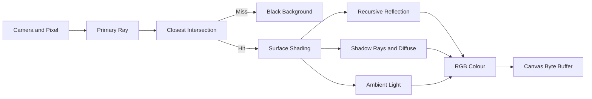
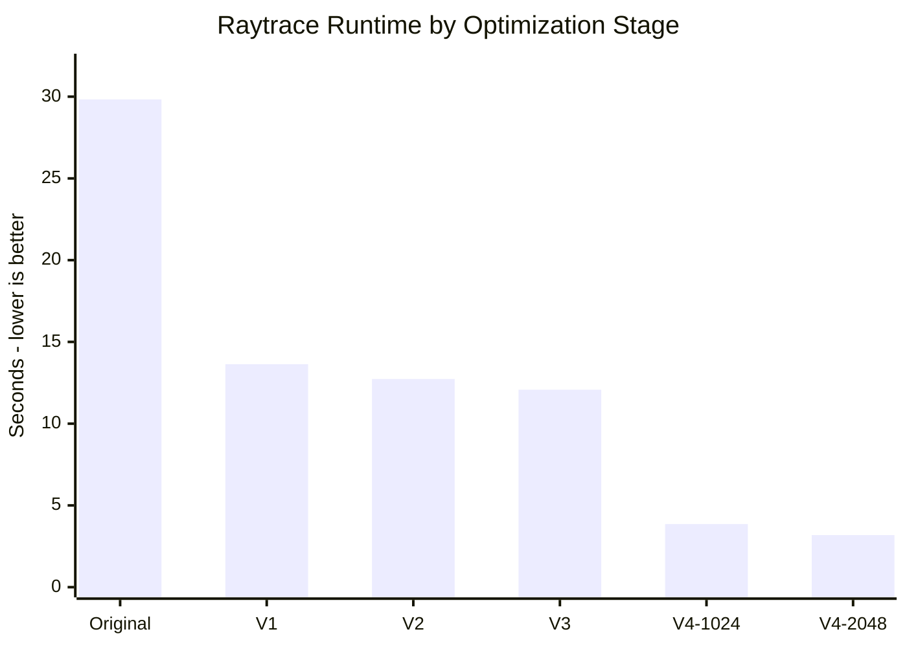

# שיפור benchmark ‏Raytracing ב־`pyperformance`

## תקציר

מטרת העבודה הייתה להאיץ את benchmark ה־Raytracing בלי לשנות את התמונה המתקבלת. העבודה בוצעה בארבעה שלבים מצטברים: צמצום allocations וקריאות Python מיותרות, כתיבת arithmetic ישירה בתוך ארבע פונקציות חמות, `cache` של ערכים קבועים, ולבסוף `vectorization` בקבוצות rays באמצעות NumPy.

ב־workload של `800×800` זמן ה־benchmark ירד מ־**29.833 s** ב־Original ל־**3.184 s** ב־V4 עם `batch size=2048`: האצה של **9.37×** והפחתת זמן של **89.3%**. כל קובצי התמונה זהים byte-for-byte, ולכן `MSE=0`.

| גרסה | קובץ קוד | רעיון מרכזי |
|---|---|---|
| Original | [`run_benchmark.py`](../suites/original/bm_raytrace/run_benchmark.py) | מימוש scalar מקורי |
| V1 | [`First Improvemnt`](<../suites/optimized/bm_raytrace/run_benchmark - First Improvemnt 2x speed.py>) | פחות allocations, חישובים וקריאות חוזרות |
| V2 | [`Second Improvent`](<../suites/optimized/bm_raytrace/run_benchmark - Second Improvent remove direct function calls and write the math.py>) | arithmetic ישירה בארבע פונקציות חמות |
| V3 | [`Third improvement`](<../suites/optimized/bm_raytrace/run_benchmark - Third improvement - chacing the radious and camera values instead of repeated calcs.py>) | `cache` ל־radius ולכיווני camera |
| V4 | [`run_benchmark.py`](../suites/optimized/bm_raytrace/run_benchmark.py) | NumPy batched renderer |

## סביבת המדידה והפרדת התפקידים

כל התוצאות הראשיות משתמשות באותו workload של `800×800`, על ליבה אחת ובאותו דגם CPU. ה־default במקור הוא `100×100`, ובקוד V4 הסופי הוא `800×800`; פקודות המדידה העבירו במפורש `800×800` לכל הגרסאות, ולכן ההשוואה הוגנת ואינה נשענת על ה־defaults.

- `timing.json` ו־`perf_stat.txt` נאספו עם Python 3.12 רגיל. אלו הנתונים שעליהם מבוססות טענות ה־speedup.
- `perf_report.txt` וה־flamegraph נאספו עם Python 3.12-dbg כדי לקבל שמות כגון `py::Scene.rayColour`.
- Python 3.12-dbg מוסיף overhead גדול. לכן משווים זמני `perf_report` רק בין גרסאות profiling, ולא משווים את המספר האבסולוטי שלהם לזמן מ־`timing.json` או `perf_stat`.
- ה־sampling בוצע עם `cpu-clock` בתדירות `199 Hz`, ללא samples שאבדו.

ב־[`OPTIMIZATIONS.md`](../suites/optimized/bm_raytrace/OPTIMIZATIONS.md) עדיין כתוב ש־`1024` הוא ה־default של V4, אבל בקוד הסופי `DEFAULT_BATCH_SIZE = 1024*2`. שתי המדידות מופיעות בטבלאות כדי להראות את השפעת גודל ה־batch; ההשוואה הסופית משתמשת ב־`2048`, שהוא גם ה־default הנוכחי וגם המהיר מביניהם.

## 1. Overview

ה־benchmark מייצר scene קבוע עם שתי נקודות אור, שבעה `Sphere` ו־`Halfspace` אחד המשמש כרצפה. לכל pixel נוצר primary ray. לאחר מציאת ה־intersection הקרוב ביותר מחושבים reflection רקורסיבי, diffuse lighting עם shadow rays, ו־ambient lighting. הצבע נחתך לטווח RGB ונכתב ל־`Canvas`.



### Libraries ומבני נתונים

המימוש המקורי קצר ומשתמש רק ב־`array`, ב־`math` וב־`pyperf`. ‏`Canvas.bytes` הוא `array.array('B')` צפוף של RGB. ‏`Vector` ו־`Point` מחזיקים שלושה מספרי Python, ‏`Ray` מחזיק origin וכיוון מנורמל, ‏`Scene.objects` הוא list של זוגות `(geometry, surface)`, והצבעים הם tuples מסוג `(r, g, b)`.

V4 מוסיף את NumPy ואת `os`. הגאומטריה וה־materials נארזים פעם אחת לכל render בתוך arrays מסוג `float64`; batches משתמשים במבנה `(3, N)`, ב־boolean masks וב־arrays של object indices. מגבלות thread נקבעות לפני import של NumPy, והחישוב נשאר על ליבה אחת.

## 2. Initial analysis — Original

ה־flamegraph הוא icicle graph: הרוחב מייצג sampled CPU time והעומק מייצג שרשרת קריאות. הניתוח כאן מתמקד בפונקציות של ה־benchmark ולא ב־CPython evaluator frames.

ב־[flamegraph המקורי](<../report raytracing/single Orignal/flamegraph.svg>) כמעט כל הרוחב נמצא מתחת ל־`bench_raytrace` ול־`Scene.render`. הענף הרחב ביותר הוא `Scene.rayColour`; מתחתיו בולטים `SimpleSurface.colourAt`, בדיקות visibility ו־`Sphere.intersectionTime`. הפונקציות `Point.__sub__`, ‏`Vector.dot`, ‏`Vector.normalized` ו־`Vector.scale` יוצרות שכבות עמוקות נוספות.

הנתונים הכמותיים תומכים בקריאה זו:

- `Scene.rayColour` נמצא ב־88.7% מה־samples המחוברים ל־benchmark.
- `SimpleSurface.colourAt` נמצא ב־66.9%, בדיקות light visibility בכ־46%, ו־`Sphere.intersectionTime` ב־40.6%.
- עומק application stack הממוצע הוא 7.52 frames.
- recursion הצבע מגיע לכל היותר לארבעה frames, בהתאם ללוגיקה בקוד.

המסקנה הראשונית הייתה שהבעיה אינה פעולה מתמטית יחידה, אלא חזרה המונית על object allocation, normalization, operator dispatch וסריקת lists בתוך הלולאות הפנימיות.

## 3. Optimizations


כל שלב נמדד על גבי השלב הקודם. לכן שינוי ב־V3, לדוגמה, כולל גם את כל השיפורים של V1 ו־V2.

### 3.1 V1 — צמצום עבודה חוזרת ב־scalar Python

V1 מטפל תחילה ברוחב הגדול של `rayColour`, visibility ו־sphere intersections. הוא אינו משנה את אלגוריתם ה־Raytracing, אלא מבצע פחות עבודה עבור אותו ray.

| שינוי | Before | After |
|---|---|---|
| יצירת shadow ray פעם אחת | `for (o, s) in self.objects:`<br>&nbsp;&nbsp;`t = o.intersectionTime(Ray(p, l - p))` | `return self._lightRayIsVisible(Ray(p, l - p))`<br><br>`def _lightRayIsVisible(self, ray):`<br>&nbsp;&nbsp;`for (o, s) in self.objects:`<br>&nbsp;&nbsp;&nbsp;&nbsp;`t = o.intersectionTime(ray)` |
| `cache` לרכיבי camera | `for y in range(canvas.height):`<br>&nbsp;&nbsp;`for x in range(canvas.width):`<br>&nbsp;&nbsp;&nbsp;&nbsp;`xcomp = vpRight.scale(...)`<br>&nbsp;&nbsp;&nbsp;&nbsp;`ycomp = vpUp.scale(...)` | `xcomponents = [vpRight.scale(...)`<br>&nbsp;&nbsp;`for x in range(canvas.width)]`<br>`for y in range(canvas.height):`<br>&nbsp;&nbsp;`ycomp = vpUp.scale(...)`<br>&nbsp;&nbsp;`for x, xcomp in enumerate(xcomponents):` |
| בחירת hit תוך כדי traversal | `intersections = [(o, o.intersectionTime(ray), s)`<br>&nbsp;&nbsp;`for (o, s) in self.objects]`<br>`i = firstIntersection(intersections)` | `closestTime = None`<br>`for o, s in self.objects:`<br>&nbsp;&nbsp;`t = o.intersectionTime(ray)`<br>&nbsp;&nbsp;`if t is not None and t > -EPSILON:`<br>&nbsp;&nbsp;&nbsp;&nbsp;`if closestTime is None or t < closestTime:`<br>&nbsp;&nbsp;&nbsp;&nbsp;&nbsp;&nbsp;`closestTime = t` |
| sphere intersection ב־scalar locals | `cp = self.centre - ray.point`<br>`v = cp.dot(ray.vector)`<br>`discriminant = (self.radius * self.radius)`<br>&nbsp;&nbsp;`- (cp.dot(cp) - v * v)` | `cpx = centre.x - point.x`<br>`cpy = centre.y - point.y`<br>`cpz = centre.z - point.z`<br>`v = (cpx * direction.x) + ...`<br>`cpSquared = (cpx * cpx) + ...` |
| הסרת instance dictionaries | `class Vector(object):`<br>&nbsp;&nbsp;`def __init__(...):` | `class Vector(object):`<br>&nbsp;&nbsp;`__slots__ = ('x', 'y', 'z')`<br>&nbsp;&nbsp;`def __init__(...):` |
| שימוש חוזר בכיוון אור מנורמל | `for lightPoint in scene.visibleLights(p):`<br>&nbsp;&nbsp;`contribution = (lightPoint - p)`<br>&nbsp;&nbsp;&nbsp;&nbsp;`.normalized().dot(normal)` | `for lightDirection in scene._visibleLightDirections(p):`<br>&nbsp;&nbsp;`contribution = lightDirection.dot(normal)` |
| הסרת תוצאה שנזרקה | `v = p - Point.ZERO`<br>`v.scale(1.0 / self.checkSize)` | `v = p - Point.ZERO` |

ה־closest-hit traversal החדש מונע list של intersections ו־tuples זמניים לכל ray. ‏`__slots__` חוסך `__dict__` לכל `Vector`, ‏`Point` ו־`Ray`, אך אינו הופך אותם ל־C structs. הסרת ה־checker scaling בטוחה עבור ה־workload מפני שהקוד המקורי ממילא זרק את ה־Vector שהוחזר.

ב־flamegraph של [V1](<../report raytracing/single v1/flamegraph.svg>) ‏`Scene.rayColour` יורד מ־88.7% ל־74.9% מה־benchmark המחובר, ‏`Sphere.intersectionTime` מ־40.6% ל־31.4%, ושרשרת visibility הישנה מוחלפת בענפים צרים יותר של `_visibleLightDirections` ו־`_lightRayIsVisible`. זהו השלב הבודד בעל התרומה הגדולה ביותר בין שלבי ה־scalar.

### 3.2 V2 — arithmetic ישירה בארבע פונקציות חמות

לאחר V1, שכבות helper קטנות עדיין הופיעו שוב ושוב. V2 מחליף ארבע שרשראות של method calls בחישוב מפורש תוך שמירת סדר פעולות ה־floating-point.

| פונקציה | Before | After |
|---|---|---|
| `Vector.normalized` | `return self.scale(1.0 / self.magnitude())` | `x = self.x; y = self.y; z = self.z`<br>`factor = 1.0 / math.sqrt((x*x) + (y*y) + (z*z))`<br>`return Vector(factor*x, factor*y, factor*z)` |
| `Vector.reflectThrough` | `d = normal.scale(self.dot(normal))`<br>`return self - d.scale(2)` | `projection = self.dot(normal)`<br>`return Vector(`&nbsp;<br>&nbsp;&nbsp;`self.x - 2 * (projection * normal.x),`<br>&nbsp;&nbsp;`self.y - 2 * (projection * normal.y),`<br>&nbsp;&nbsp;`self.z - 2 * (projection * normal.z))` |
| `Ray.pointAtTime` | `return self.point + self.vector.scale(t)` | `point = self.point`<br>`vector = self.vector`<br>`return Point(point.x + t * vector.x,`<br>&nbsp;&nbsp;`point.y + t * vector.y,`<br>&nbsp;&nbsp;`point.z + t * vector.z)` |
| `Sphere.normalAt` | `return (p - self.centre).normalized()` | `x = p.x - centre.x`<br>`y = p.y - centre.y`<br>`z = p.z - centre.z`<br>`factor = 1.0 / math.sqrt((x*x) + (y*y) + (z*z))`<br>`return Vector(factor*x, factor*y, factor*z)` |

השינוי אינו מסיר כל function call: ‏`reflectThrough` עדיין קוראת ל־`dot`. הוא כן מצמצם objects זמניים ו־dispatch בארבעה מקומות מדויקים. ב־[flamegraph של V2](<../report raytracing/single v2/flamegraph.svg>) רוחב `Vector.normalized` יורד מ־10.2% ל־5.6%, ‏`Vector.scale` כמעט נעלם, ‏`Ray.pointAtTime` יורד מ־2.5% ל־1.2%, ו־`Sphere.normalAt` מ־1.1% ל־0.3%.

### 3.3 V3 — `cache` של ערכים קבועים

V3 מזהה שני חישובים שהקלט שלהם אינו משתנה בזמן ה־render.

| שינוי | Before | After |
|---|---|---|
| radius בריבוע | `self.radius = radius`<br><br>`discriminant = (self.radius * self.radius) - ...` | `self.radius = radius`<br>`self.radiusSquared = radius * radius`<br><br>`discriminant = self.radiusSquared - ...` |
| camera column direction | `xcomponents = [vpRight.scale(...) ...]`<br>`ray = Ray(eye.point,`<br>&nbsp;&nbsp;`eye.vector + xcomp + ycomp)` | `columnDirections = [`<br>&nbsp;&nbsp;`eye.vector + vpRight.scale(...) ...]`<br>`ray = Ray(eye.point,`<br>&nbsp;&nbsp;`columnDirection + ycomp)` |

ב־`800×800`, החיבור `eye.vector + xcomp` משתנה מ־640,000 חישובים ל־800 בלבד. ה־radius מוכפל פעם אחת בזמן בניית כל sphere במקום בכל intersection. ההנחה היא שה־scene סטטי; שינוי `radius` לאחר construction היה מחייב לעדכן גם את ה־cache.

ב־[flamegraph של V3](<../report raytracing/single v3/flamegraph.svg>) ‏`Vector.__add__` יורד מ־4.05% ל־2.29% מה־benchmark המחובר. לעומת זאת, שינוי רוחב `Sphere.intersectionTime` קטן מרעש המדידה; השיפור של radius caching הגיוני מהקוד, אך אין לטעון שה־flamegraph לבדו מוכיח את גודלו.

### 3.4 V4 — `vectorization` באמצעות NumPy batches

V4 מחליף את לולאת ה־per-ray של Python ב־`BatchedRenderer`. הוא אורז את ה־scene ל־arrays, מייצר קבוצת rays, ומבצע intersection, masks, shadows ו־reflection עבור מספר rays יחד. הסדר בין objects, ה־thresholds, עומק ה־reflection וה־`float64` נשמרים.

| אזור | Before — V3 | After — V4 |
|---|---|---|
| render dispatch | `def render(self, canvas):`<br>&nbsp;&nbsp;`for y in range(canvas.height):`<br>&nbsp;&nbsp;&nbsp;&nbsp;`for x, columnDirection in enumerate(...):`<br>&nbsp;&nbsp;&nbsp;&nbsp;&nbsp;&nbsp;`ray = Ray(...)`<br>&nbsp;&nbsp;&nbsp;&nbsp;&nbsp;&nbsp;`colour = self.rayColour(ray)` | `def render(self, canvas, batch_size=DEFAULT_BATCH_SIZE):`<br>&nbsp;&nbsp;`BatchedRenderer(self).render(canvas, batch_size)` |
| יצירת batches | ray ו־objects של Python לכל pixel | `for start in range(0, width * height, batch_size):`<br>&nbsp;&nbsp;`pixels = np.arange(start, min(...))`<br>&nbsp;&nbsp;`x = pixels % width`<br>&nbsp;&nbsp;`y = pixels // width`<br>&nbsp;&nbsp;`directions = self.normalized(columns[:, x] + rows[:, y])` |
| closest hit | `for o, s in self.objects:`<br>&nbsp;&nbsp;`t = o.intersectionTime(ray)`<br>&nbsp;&nbsp;`if closestTime is None or t < closestTime:` | `candidate = self.intersectionTimes(index, origins, directions)`<br><code>selected = ((candidate &gt; -EPSILON) &amp; ((closest &lt; 0) &#124; (candidate &lt; times)))</code><br>`closest[selected] = index` |
| shading | `SimpleSurface.colourAt` עבור ray אחד וקריאה רקורסיבית ל־`Scene.rayColour` | `rayColours(origins, directions, depth)` מפעילה masks עבור hits, reflection, diffuse ו־ambient, ורק ה־columns הפעילים ממשיכים לרקורסיה. |
| גבול ה־output | `canvas.plot(x, y, *colour)` | `for px, py, (r, g, b) in zip(..., colours.T.tolist()):`<br>&nbsp;&nbsp;`canvas.plot(px, py, r, g, b)` |

NumPy היא dependency חדשה; אין threads נוספים של חישוב ואין שימוש ב־`np.dot` או ב־BLAS. ספריית NumPy עשויה לבחור kernels עם SIMD, אבל המדידה כאן מוכיחה acceleration של המימוש השלם ולא מבודדת כמה ממנה נובע מ־SIMD.

`batch size` הוא פרמטר ביצועים חשוב. בניסוי כיול מקומי מבוקר ונפרד, באותו workload של `100×100`, ‏CPython 3.12.14 וליבה אחת, V3 הסקלרי סיים ב־**205.3±19.8 ms**, ואילו V4 עם `batch size=2` נמשך **3291.6±99.8 ms** — זמן ארוך פי **16.03** (כ־1,503% יותר). זהו ניסוי Windows מקומי לבחירת batch ולא נתון השרת של `800×800`. המסקנה ברורה: עצם ה־vectorization אינו מספיק; batch קטן משלם שוב ושוב overhead של קריאות NumPy, הקצאת arrays, ‏indexing ו־masks. נדרש batch גדול מספיק כדי לפרוס את העלות על rays רבים.

ב־flamegraphs של [V4-1024](<../report raytracing/single v4 1024/flamegraph.svg>) ושל [V4-2048](<../report raytracing/single v4 2048/flamegraph.svg>) ענפי `Scene.rayColour` וה־scalar helpers נעלמים מהנתיב הרגיל ומוחלפים ב־`BatchedRenderer`. מספר samples של `Canvas.plot` נשאר כמעט קבוע לאורך כל הסדרה (`874, 840, 820, 807, 806, 805`), ולכן הוא הופך לצוואר הבקבוק הבא. עומק ה־application stack הממוצע יורד ל־4.75 ב־V4-2048, אך עומק recursion הצבע המרבי נשאר ארבעה frames — כלומר השיפור לא הושג על ידי קיצור reflection depth.

## 4. Performance comparison

### 4.1 זמן ה־benchmark

הזמן הבא מגיע מ־`timing.json` עם Python 3.12 הרגיל, ולכן הוא המדד הראשי להשוואת ה־code workload.

| גרסה | זמן | האצה לעומת השלב הקודם | האצה לעומת Original | הפחתת זמן מול Original | Peak RSS |
|---|---:|---:|---:|---:|---:|
| Original | 29.833 s | — | 1.00× | 0.0% | 36.27 MiB |
| V1 | 13.637 s | 2.19× | 2.19× | 54.3% | 36.39 MiB |
| V2 | 12.734 s | 1.07× | 2.34× | 57.3% | 36.43 MiB |
| V3 | 12.076 s | 1.05× | 2.47× | 59.5% | 36.48 MiB |
| V4 — batch 1024 | 3.862 s | 3.13× מול V3 | 7.72× | 87.1% | 48.97 MiB |
| V4 — batch 2048 | **3.184 s** | **3.79× מול V3** | **9.37×** | **89.3%** | 48.91 MiB |



V4-2048 מהיר ב־`1.21×` מ־V4-1024, כלומר 17.6% פחות זמן. המחיר של ה־arrays הוא עלייה של 34.8% ב־Peak RSS לעומת Original; זו החלפת memory עבור פחות Python work.

### 4.2 טבלת `perf_stat.txt`

הטבלה מכילה את כל ה־events שנמדדו. הסימונים הם SI עשרוניים: `K=10³`, ‏`M=10⁶`, ‏`G=10⁹`. ערך נמוך אינו תמיד “טוב” בפני עצמו; הוא שימושי כאשר הוא מוסבר יחד עם זמן הריצה והאלגוריתם.

| Metric | Original | V1 | V2 | V3 | V4-1024 | V4-2048 |
|---|---:|---:|---:|---:|---:|---:|
| `cpu-clock` | 30.923 s | 14.252 s | 13.105 s | 12.727 s | 4.293 s | 3.613 s |
| `task-clock` | 30.923 s | 14.252 s | 13.105 s | 12.727 s | 4.293 s | 3.613 s |
| `cycles` | 71.65G | 33.03G | 30.33G | 29.44G | 9.71G | 8.15G |
| `instructions` | 186.72G | 82.98G | 77.80G | 74.43G | 21.01G | 18.34G |
| `branch-instructions` | 30.40G | 13.71G | 12.95G | 12.39G | 3.58G | 3.14G |
| `branch-misses` | 173.48M | 79.91M | 68.10M | 66.87M | 24.25M | 18.21M |
| `bus-cycles` | 2.50G | 1.15G | 1.06G | 1.03G | 340.60M | 287.49M |
| `cache-references` | 45.85M | 41.04M | 25.31M | 35.21M | 97.97M | 78.68M |
| `cache-misses` | 189.90K | 176.03K | 171.00K | 184.65K | 681.76K | 671.85K |
| `ref-cycles` | 72.17G | 33.23G | 30.56G | 29.65G | 9.87G | 8.28G |
| `page-faults` | 11.92K | 11.95K | 11.99K | 11.98K | 16.24K | 16.47K |
| `minor-faults` | 11.92K | 11.95K | 11.99K | 11.98K | 16.24K | 16.47K |
| `major-faults` | 0 | 0 | 0 | 0 | 0 | 0 |
| `context-switches` | 394 | 387 | 174 | 394 | 155 | 147 |
| `cpu-migrations` | 0 | 0 | 0 | 0 | 0 | 0 |
| `alignment-faults` | 0 | 0 | 0 | 0 | 0 | 0 |
| `emulation-faults` | 0 | 0 | 0 | 0 | 0 | 0 |
| `cgroup-switches` | 365 | 358 | 145 | 365 | 121 | 116 |
| `L1-dcache-loads` | 42.99G | 19.11G | 18.23G | 17.15G | 4.30G | 3.80G |
| `L1-dcache-load-misses` | 585.92M | 410.78M | 326.12M | 376.70M | 213.00M | 201.15M |
| `L1-dcache-stores` | 10.20G | 4.57G | 4.20G | 4.05G | 1.11G | 930.51M |
| `L1-icache-load-misses` | 20.26M | 14.80M | 11.18M | 12.25M | 15.14M | 10.66M |
| `dTLB-loads` | 47.57G | 21.24G | 20.08G | 19.17G | 4.71G | 4.09G |
| `dTLB-load-misses` | 6.93M | 3.33M | 2.93M | 2.79M | 1.74M | 1.45M |
| `dTLB-stores` | 25.77G | 11.21G | 10.43G | 9.93G | 2.58G | 2.27G |
| `dTLB-store-misses` | 1.51M | 667.66K | 523.08K | 516.06K | 312.24K | 325.23K |
| `iTLB-loads` | 5.80M | 4.10M | 2.53M | 3.51M | 7.25M | 4.33M |
| `iTLB-load-misses` | 4.51M | 1.93M | 1.51M | 1.68M | 1.72M | 1.36M |
| `branch-loads` | 36.24G | 16.32G | 15.40G | 14.73G | 4.30G | 3.72G |
| `branch-load-misses` | 149.39M | 68.74M | 59.20M | 58.22M | 18.79M | 14.40M |
| `duration_time` | 30.996 s | 14.341 s | 13.125 s | 12.822 s | 4.321 s | 3.642 s |
| `time elapsed` | 30.996 s | 14.341 s | 13.125 s | 12.822 s | 4.321 s | 3.642 s |
| `user time` | 30.849 s | 14.225 s | 13.066 s | 12.689 s | 4.245 s | 3.546 s |
| `sys time` | 90.2 ms | 42.9 ms | 49.8 ms | 55.3 ms | 60.0 ms | 78.4 ms |

ה־derived metrics העיקריים מתוך אותו קובץ הם:

| Metric | Original | V1 | V2 | V3 | V4-1024 | V4-2048 |
|---|---:|---:|---:|---:|---:|---:|
| CPU utilization | 0.998 | 0.994 | 0.998 | 0.993 | 0.994 | 0.992 |
| IPC | 2.61 | 2.51 | 2.57 | 2.53 | 2.16 | 2.25 |
| Branch miss rate | 0.57% | 0.58% | 0.53% | 0.54% | 0.68% | 0.58% |
| Cache miss rate | 0.414% | 0.429% | 0.676% | 0.524% | 0.696% | 0.854% |
| L1D load miss rate | 1.36% | 2.15% | 1.79% | 2.20% | 4.95% | 5.29% |

מ־Original עד V4-2048 מספר ה־instructions יורד ב־90.2%, ‏cycles ב־88.6%, ‏branch instructions ב־89.7% ו־L1 data loads ב־91.2%. ה־IPC דווקא יורד מ־2.61 ל־2.25; ההאצה מגיעה מכך שמבוצעת הרבה פחות עבודת Python, לא מכך שכל instruction מהיר יותר.

V4 מגדיל את מספר `cache-references` וה־`cache-misses` בגלל arrays ו־NumPy, אבל עדיין מקצר מאוד את הזמן. בין batch ‏1024 ל־2048 בלבד, instructions יורדים ב־12.7% ו־cycles ב־16.1%, בהתאם לכך שפחות batches משלמים את אותו overhead.

חשוב: hardware counters רבים רצו רק בכ־20%–30% מהזמן בגלל multiplexing, ו־`perf` ביצע scaling. לכן שינויים גדולים ועקביים ב־instructions/cycles שימושיים, אך אין להסיק מסקנות דקות מהבדלים קטנים ב־cache/TLB, במיוחד בריצות V4 הקצרות.

### 4.3 טבלת `perf_report.txt` ו־`speedscope.folded`

יש להבדיל בין שלושה סוגי זמן:

| מונח | משמעות | שימוש בדוח |
|---|---|---|
| **Total profile time** | כל ה־sampled CPU time בתהליך, כולל benchmark, startup, imports ו־runtime. | מופיע בשורה הראשונה כדי לתת denominator משותף לכל גרסה. |
| **Inclusive function time** (`Children`) | הזמן שבו הפונקציה נמצאת ב־stack, כולל כל הפונקציות שנקראו מתוכה. זהו ה־total time המיוחס לפונקציה. | המדד העיקרי להשוואת hotspots; מוצגים זמן אבסולוטי ואחוז מתוך ה־total profile. |
| **Self / exclusive time** | רק samples שנחתו בגוף הפונקציה, ללא descendants. | שימושי ל־native leaf functions. עבור `py::...` samples נוחתים בדרך כלל ב־CPython או ב־NumPy שמתחת ל־pseudo-frame, ולכן `Self` עלול להיות אפס או מטעה ואינו מוצג כעמודת ההשוואה. |

נוסחת ההמרה, כאשר תדירות הדגימה היא `f=199 Hz`, היא:

```text
time per sample      = 1 / 199 s = 5.025125 ms
Total profile time   = total_samples / 199
Inclusive time(f)    = samples whose stack contains f / 199
Self time(f)         = Period(f) / 10^9 ≈ self_samples(f) / 199
```

ה־inclusive rows חופפים: לדוגמה sample בתוך `Sphere.intersectionTime` נספר גם ב־`Scene.rayColour` וגם ב־`Scene.render`. לכן אין לחבר שורות זו לזו. המספר בסוגריים הוא האחוז מתוך `Total profile time` של אותה גרסה.

מספר ה־samples הכולל הוא `24,085`, ‏`9,133`, ‏`8,129`, ‏`7,941`, ‏`2,012` ו־`1,771` עבור Original עד V4-2048 בהתאמה; חלוקה ב־199 נותנת את שורת ה־total הראשונה.

| Function / scope — inclusive | Original | V1 | V2 | V3 | V4-1024 | V4-2048 |
|---|---:|---:|---:|---:|---:|---:|
| **Total profile time** | **121.030 s (100%)** | **45.894 s (100%)** | **40.849 s (100%)** | **39.905 s (100%)** | **10.111 s (100%)** | **8.899 s (100%)** |
| **Visible `bench_raytrace` subtree** | 120.417 s (99.5%) | 45.241 s (98.6%) | 40.241 s (98.5%) | 39.302 s (98.5%) | 6.075 s (60.1%) | 5.794 s (65.1%) |
| **Other / unattached samples** | 613.1 ms (0.5%) | 653.3 ms (1.4%) | 608.0 ms (1.5%) | 603.0 ms (1.5%) | 4.035 s (39.9%) | 3.106 s (34.9%) |
| `bench_raytrace` | 120.417 s (99.5%) | 45.241 s (98.6%) | 40.241 s (98.5%) | 39.302 s (98.5%) | 6.075 s (60.1%) | 5.794 s (65.1%) |
| `Scene.render` | 119.864 s (99.0%) | 44.668 s (97.3%) | 39.678 s (97.1%) | 38.749 s (97.1%) | 5.523 s (54.6%) | 5.236 s (58.8%) |
| `Scene.rayColour` | 106.759 s (88.2%) | 33.889 s (73.8%) | 30.156 s (73.8%) | 30.030 s (75.3%) | — | — |
| `SimpleSurface.colourAt` | 80.497 s (66.5%) | 23.553 s (51.3%) | 20.583 s (50.4%) | 20.709 s (51.9%) | — | — |
| `Scene.visibleLights` | 56.040 s (46.3%) | — | — | — | — | — |
| `Scene._lightIsVisible` | 55.583 s (45.9%) | — | — | — | — | — |
| `Scene._visibleLightDirections` | — | 11.874 s (25.9%) | 10.814 s (26.5%) | 10.920 s (27.4%) | — | — |
| `Scene._lightRayIsVisible` | — | 7.362 s (16.0%) | 7.487 s (18.3%) | 7.327 s (18.4%) | — | — |
| `Sphere.intersectionTime` | 48.874 s (40.4%) | 14.196 s (30.9%) | 14.015 s (34.3%) | 13.734 s (34.4%) | — | — |
| `Halfspace.intersectionTime` | 2.136 s (1.8%) | 1.940 s (4.2%) | 1.844 s (4.5%) | 1.804 s (4.5%) | — | — |
| `Ray.__init__` | 19.156 s (15.8%) | 5.121 s (11.2%) | 2.824 s (6.9%) | 3.126 s (7.8%) | — | — |
| `Vector.normalized` | 18.839 s (15.6%) | 4.633 s (10.1%) | 2.241 s (5.5%) | 2.347 s (5.9%) | — | — |
| `Vector.magnitude` | 7.286 s (6.0%) | 1.834 s (4.0%) | — | — | — | — |
| `Vector.scale` | 9.744 s (8.1%) | 2.633 s (5.7%) | 5.0 ms (<0.1%) | 5.0 ms (<0.1%) | — | — |
| `Vector.dot` | 20.598 s (17.0%) | 2.633 s (5.7%) | 1.648 s (4.0%) | 1.317 s (3.3%) | — | — |
| `Vector.reflectThrough` | 2.010 s (1.7%) | 1.889 s (4.1%) | 804.0 ms (2.0%) | 673.4 ms (1.7%) | — | — |
| `Ray.pointAtTime` | 1.156 s (1.0%) | 1.151 s (2.5%) | 467.3 ms (1.1%) | 472.4 ms (1.2%) | — | — |
| `Sphere.normalAt` | 587.9 ms (0.5%) | 492.5 ms (1.1%) | 125.6 ms (0.3%) | 206.0 ms (0.5%) | — | — |
| `Vector.__add__` | 1.588 s (1.3%) | 1.457 s (3.2%) | 1.628 s (4.0%) | 899.5 ms (2.3%) | — | — |
| `Point.__sub__` | 25.844 s (21.4%) | 1.487 s (3.2%) | 1.407 s (3.4%) | 1.372 s (3.4%) | — | — |
| `firstIntersection` | 1.151 s (1.0%) | — | — | — | — | — |
| `CheckerboardSurface.baseColourAt` | 1.296 s (1.1%) | 758.8 ms (1.7%) | 1.025 s (2.5%) | 864.3 ms (2.2%) | — | — |
| `Canvas.plot` | 4.392 s (3.6%) | 4.221 s (9.2%) | 4.121 s (10.1%) | 4.055 s (10.2%) | 4.050 s (40.1%) | 4.045 s (45.5%) |
| `Canvas.__init__` | 552.8 ms (0.5%) | 572.9 ms (1.2%) | 557.8 ms (1.4%) | 552.8 ms (1.4%) | 552.8 ms (5.5%) | 557.8 ms (6.3%) |
| `BatchedRenderer.render` | — | — | — | — | 5.523 s (54.6%) | 5.236 s (58.8%) |
| `BatchedRenderer.rayColours` | — | — | — | — | 422.1 ms (4.2%) | 226.1 ms (2.5%) |
| `BatchedRenderer.intersectionTimes` | — | — | — | — | 221.1 ms (2.2%) | 115.6 ms (1.3%) |
| `BatchedRenderer.lightIsVisible` | — | — | — | — | 170.9 ms (1.7%) | 105.5 ms (1.2%) |
| `BatchedRenderer.closestHits` | — | — | — | — | 145.7 ms (1.4%) | 65.3 ms (0.7%) |
| `BatchedRenderer.dot` | — | — | — | — | 90.5 ms (0.9%) | 40.2 ms (0.5%) |
| `BatchedRenderer.normalized` | — | — | — | — | 40.2 ms (0.4%) | 35.2 ms (0.4%) |
| `BatchedRenderer.normalsAt` | — | — | — | — | 65.3 ms (0.6%) | 25.1 ms (0.3%) |
| `BatchedRenderer.baseColoursAt` | — | — | — | — | — | 5.0 ms (<0.1%) |
| `BatchedRenderer.primaryRayBatches` | — | — | — | — | 10.1 ms (0.1%) | 5.0 ms (<0.1%) |

מספר runtime/native symbols רלוונטיים משלימים את הסיפור. הם נבחרו משום שהם קשורים ישירות ל־operator dispatch, object construction או לגבול NumPy/Python; frames כלליים כמו `_PyEval_*` הושמטו בכוונה.

| Runtime/native symbol — inclusive | Original | V1 | V2 | V3 | V4-1024 | V4-2048 |
|---|---:|---:|---:|---:|---:|---:|
| `binary_op1` | 34.709 s (28.7%) | 6.789 s (14.8%) | 5.784 s (14.2%) | 4.874 s (12.2%) | 85.4 ms (0.8%) | 105.5 ms (1.2%) |
| `type_call` | 34.472 s (28.5%) | 8.367 s (18.2%) | 5.648 s (13.8%) | 5.739 s (14.4%) | 768.8 ms (7.6%) | 758.8 ms (8.5%) |
| `min_max` | 1.618 s (1.3%) | 1.497 s (3.3%) | 1.573 s (3.9%) | 1.543 s (3.9%) | 1.302 s (12.9%) | 1.312 s (14.7%) |
| `builtin_min` | 1.030 s (0.9%) | 954.8 ms (2.1%) | 1.020 s (2.5%) | 1.005 s (2.5%) | 753.8 ms (7.5%) | 758.8 ms (8.5%) |
| `builtin_max` | 723.6 ms (0.6%) | 653.3 ms (1.4%) | 688.4 ms (1.7%) | 693.5 ms (1.7%) | 673.4 ms (6.7%) | 638.2 ms (7.2%) |
| NumPy `PyArray_ToList` | — | — | — | — | 251.3 ms (2.5%) | 251.3 ms (2.8%) |
| libc `memset` | 974.9 ms (0.8%) | 381.9 ms (0.8%) | 371.9 ms (0.9%) | 266.3 ms (0.7%) | 376.9 ms (3.7%) | 407.0 ms (4.6%) |

ב־Original עד V3 כמעט כל ה־profile נמצא מתחת ל־`bench_raytrace`. ב־V4 ה־Python subtree הנראה צר בהרבה, ובמקביל מופיעים stacks נפרדים של NumPy native symbols. אין לקרוא לכל השורה “Other / unattached” בשם “מחוץ ל־main”: ‏frame-pointer unwinding אינו מצליח תמיד לחבר את NumPy native frame להורה ב־Python, ולכן חלק מהזמן הוא עבודת benchmark אמיתית שהתנתקה ב־stack. רק כ־7.2% מכלל samples של V4 מזוהים בבירור עם `importlib`.

הטבלה כן מראה שתי תופעות חזקות:

1. V1–V3 מקטינות בהדרגה את הענפים שעליהם הן פועלות. למשל `Point.__sub__` יורד מ־25.844 s ל־1.487 s כבר ב־V1, ו־`Vector.scale` כמעט נעלם ב־V2.
2. ב־V4-2048, ‏`rayColours`, ‏`intersectionTimes` ו־`closestHits` מקבלים בערך חצי ממספר ה־samples שלהם ב־V4-1024. לעומת זאת `Canvas.plot` נשאר סביב 4.05 s בשניהם; בתוך ה־visible benchmark subtree הוא כבר 69.8% ב־V4-2048.

### 4.4 סיכום ה־flamegraphs

| מעבר | שינוי ברוחב ובעומק | פירוש |
|---|---|---|
| Original → V1 | `rayColour`, visibility ו־sphere paths נעשים צרים משמעותית; עומק ממוצע 7.52 → 6.25. | הוסרו allocations, normalization ו־traversal חוזרים. |
| V1 → V2 | שכבות `normalized`, ‏`scale`, ‏`pointAtTime` ו־`normalAt` מצטמצמות. | arithmetic ישירה חוסכת helper dispatch ו־objects זמניים. |
| V2 → V3 | `Vector.__add__` מצטמצם; שינוי radius קטן מכדי לבודד בגרף. | camera cache נראה; אין להפריז בדיוק של hotspot קטן. |
| V3 → V4 | ה־scalar shading tree מוחלף ב־`BatchedRenderer` ו־NumPy native stacks; עומק ממוצע יורד ל־4.75. | עבודה רבה עברה מלולאות Python ל־compiled array kernels. |
| V4-1024 → V4-2048 | batched helper samples יורדים, בעוד `Canvas.plot` כמעט אינו משתנה. | batch גדול יותר מפחית overhead, אך ה־scalar output path קובע את הגבול הבא. |

## 5. Verification

כל `raytrace.ppm` הוא קובץ `P6 RGB` בגודל `800×800`. לאחר header של 15 bytes יש בדיוק:

```text
800 × 800 × 3 = 1,920,000 channel bytes
```

לכל גרסה חושב ה־Mean Squared Error מול Original:

$$
MSE=\frac{1}{3WH}\sum_{y=0}^{H-1}\sum_{x=0}^{W-1}\sum_{c\in\{R,G,B\}}
\left(I_{original}(x,y,c)-I_{version}(x,y,c)\right)^2
$$

| גרסה | Dimensions | Exact byte equality | MSE | Max absolute error | PSNR |
|---|---:|---:|---:|---:|---:|
| Original | 800×800 | reference | 0 | 0 | ∞ |
| V1 | 800×800 | כן | 0 | 0 | ∞ |
| V2 | 800×800 | כן | 0 | 0 | ∞ |
| V3 | 800×800 | כן | 0 | 0 | ∞ |
| V4 — batch 1024 | 800×800 | כן | 0 | 0 | ∞ |
| V4 — batch 2048 | 800×800 | כן | 0 | 0 | ∞ |

כל ששת הקבצים חולקים אותו SHA-256:

```text
3f8c8bbca2bd3188ba3ad3b95ae29950c53e1f534983d82a6af15256ab3d59f0
```

לכן אין צורך ב־tolerance: התוצאה אינה רק קרובה סטטיסטית אלא זהה בדיוק לאחר quantization ל־RGB. ‏`PSNR=∞` מפני שה־MSE הוא אפס. בנוסף, ה־source hashes שב־run metadata תואמים לחמש גרסאות הקוד לאחר normalization של CRLF/LF, ולכן כל artifact משויך לגרסה הנכונה.

## 6. Conclusion

הסיפור של האופטימיזציה היה הדרגתי וברור:

1. V1 הסיר עבודה חוזרת מה־hot path והביא את הקפיצה הגדולה ביותר בתוך scalar Python.
2. V2 צמצם method dispatch ו־temporary objects בארבע פעולות math שכיחות.
3. V3 העביר חישובים קבועים ל־construction או מחוץ ללולאה הפנימית.
4. V4 שינה את יחידת העבודה מ־ray יחיד ל־batch של rays, כך שרוב arithmetic מתבצע ב־NumPy compiled kernels.

בהשוואה הישירה שביקשנו, **Original → V4-2048**:

- זמן benchmark: ‏`29.833 s → 3.184 s`, כלומר **9.37× acceleration** ו־**89.3% פחות זמן**.
- whole-process `perf stat`: ‏`30.996 s → 3.642 s`, כלומר **8.51× acceleration**.
- instructions: ‏`186.72G → 18.34G`, ירידה של **90.2%**.
- cycles: ‏`71.65G → 8.15G`, ירידה של **88.6%**.
- Peak RSS: ‏`36.27 MiB → 48.91 MiB`, עלייה של **34.8%**.
- output: ‏byte-for-byte identical, עם `MSE=0`.

המסקנה החשובה מ־V4 היא ש־batching מועיל רק כאשר ה־batch גדול מספיק. Batch של 2 היה איטי פי 16.03 מ־V3 בניסוי הכיול, בעוד 1024 ו־2048 מפזרים את overhead על מספיק rays. על המכונה וה־workload שנמדדו, 2048 היה מהיר ב־17.6% מ־1024.

הצעד הבא הסביר הוא להפוך גם את ה־output path ל־batched: לבצע clamp, המרה ל־`uint8` וכתיבה ל־`Canvas.bytes` ב־NumPy במקום `tolist()` ו־`Canvas.plot` לכל pixel. ההמלצה נתמכת ישירות ב־profile: מספר samples של `Canvas.plot` כמעט לא השתנה, וב־V4-2048 הוא 69.8% מה־visible benchmark subtree. לאחר מכן כדאי לבדוק reuse של temporary arrays כדי לצמצם את עליית ה־RSS ואת לחץ ה־cache. כל שינוי נוסף חייב להמשיך להיבדק מול ה־PPM המקורי.

המימוש של V4 מותאם ל־scene הקבוע של benchmark זה: הוא אורז את סוגי geometry וה־surface הידועים וקורא את השדות שלהם ישירות. לכן ה־equivalence שהוכח הוא ל־benchmark הנמדד, ולא בהכרח ל־custom subclasses או לשינוי geometry בזמן render.

## קובצי המקור של המדידות

- [`report raytracing`](<../report raytracing>) — תיקיות Original, ‏V1–V3 ושתי מדידות V4.
- [`speedscope.folded` — Original](<../report raytracing/single Orignal/speedscope.folded>) — מקור ה־stack weights לניתוח ה־flamegraph.
- [`perf_stat.txt` — Original](<../report raytracing/single Orignal/perf_stat.txt>) ו־[`perf_report.txt` — Original](<../report raytracing/single Orignal/perf_report.txt>) — מבנה ה־baseline.
- [`NumPy batch calibration`](../results/raytrace/validation/2026-09-10-numpy-batches/README.md) — ניסוי batch size המקומי וההשוואה ל־V3.
